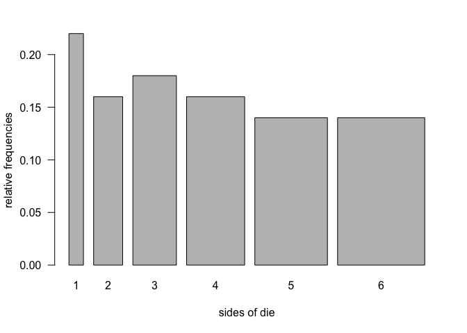

dieroller
================

``` r
die <- function(sides = c("1", "2", "3", "4", "5", "6"), prob = c(1/6, 1/6, 1/6, 1/6, 1/6, 1/6)) {
  check_sides(sides)
  check_prob(prob)
  res <- list(sides = sides, prob = prob)
  class(res) <- "die"
  return(res)
}
```

``` r
print.die <- function(x) {
  cat('object "die"\n\n')
  cd <- data.frame(
    side = x$sides, prob = x$prob
  )
  print(cd)
  invisible(x)
}
```

``` r
check_prob <- function(prob) {
  if(length(prob) !=6 | !is.numeric(prob)) {
    stop("\n'prob' must be a numeric vector of length 6")
  }
  if(any(prob < 0) | any(prob > 1)) {
    stop("\n'prob' values must be between 0 and 1")
  }
  if(sum(prob) !=1) {
    stop("\n'prob' values must be between 0 and 1")
  }
  TRUE
}
```

``` r
check_sides <- function(sides) {
  if (length(sides) != 6) {
    stop("\n'sides' must be on length 6")
  }
}

fair_die <- die()
fair_die
```

    ## object "die"
    ## 
    ##   side      prob
    ## 1    1 0.1666667
    ## 2    2 0.1666667
    ## 3    3 0.1666667
    ## 4    4 0.1666667
    ## 5    5 0.1666667
    ## 6    6 0.1666667

``` r
weird_die <- die(sides = c('i', 'ii', 'iii', 'iv', 'v', 'vi'))
weird_die
```

    ## object "die"
    ## 
    ##   side      prob
    ## 1    i 0.1666667
    ## 2   ii 0.1666667
    ## 3  iii 0.1666667
    ## 4   iv 0.1666667
    ## 5    v 0.1666667
    ## 6   vi 0.1666667

``` r
loaded_die <- die(prob = c(0.075, 0.1, 0.125, 0.15, 0.20, 0.35))
loaded_die
```

    ## object "die"
    ## 
    ##   side  prob
    ## 1    1 0.075
    ## 2    2 0.100
    ## 3    3 0.125
    ## 4    4 0.150
    ## 5    5 0.200
    ## 6    6 0.350

``` r
practice_die <- die(sides = c('1', '2', '3', '4', '5', '6'),
                    prob = c(0, 0, 0, .34, .33, .33))
```

``` r
check_times <- function(times) {
  if (times <= 0 | !is.numeric(times)) {
    stop("\n'times' must be a positive integer")
  } else {
    TRUE
  }
}
```

``` r
roll <- function(z, times = 1) {
  check_times(times)
  if(class(z) !="die") {
    stop("\nroll() requires an object 'die'")
  }
  rolls <- sample(z$sides, size = times, replace = TRUE, prob = z$prob)
  res <- list(
    sides = z$sides,
    rolls = rolls,
    prob = z$prob,
    total = length(rolls))
  class(res) <- "roll"
  res
}
```

``` r
print.roll <- function(q) {
  cat('object "roll"\n')
  print(q$rolls)
}

set.seed(123)
fair50 <- roll(fair_die, times = 50)
fair50
```

    ## object "roll"
    ##  [1] "3" "6" "4" "1" "1" "2" "5" "1" "5" "4" "1" "4" "6" "5" "2" "1" "3"
    ## [18] "2" "3" "1" "1" "6" "5" "1" "5" "6" "5" "5" "3" "2" "1" "1" "6" "6"
    ## [35] "2" "4" "6" "3" "3" "3" "2" "4" "4" "4" "2" "2" "3" "4" "3" "1"

``` r
names(fair50)
```

    ## [1] "sides" "rolls" "prob"  "total"

``` r
fair50$rolls
```

    ##  [1] "3" "6" "4" "1" "1" "2" "5" "1" "5" "4" "1" "4" "6" "5" "2" "1" "3"
    ## [18] "2" "3" "1" "1" "6" "5" "1" "5" "6" "5" "5" "3" "2" "1" "1" "6" "6"
    ## [35] "2" "4" "6" "3" "3" "3" "2" "4" "4" "4" "2" "2" "3" "4" "3" "1"

``` r
fair50$sides
```

    ## [1] "1" "2" "3" "4" "5" "6"

``` r
fair50$prob
```

    ## [1] 0.1666667 0.1666667 0.1666667 0.1666667 0.1666667 0.1666667

``` r
fair50$total
```

    ## [1] 50

``` r
str_die <- die(
  sides = c('a', 'b', 'c', 'd', 'e', 'f'),
  prob = c(0.075, 0.1, 0.125, 0.15, 0.20, 0.35))
set.seed(123)
str_rolls <- roll(str_die, times = 20)
names(str_rolls)
```

    ## [1] "sides" "rolls" "prob"  "total"

``` r
str_rolls
```

    ## object "roll"
    ##  [1] "f" "c" "e" "b" "a" "f" "e" "b" "d" "e" "a" "e" "d" "d" "f" "b" "f"
    ## [18] "f" "f" "a"

``` r
summary.roll <- function(w) {
  if(class(w) !="roll") {
    stop("\nsummary() requires an object 'roll'")
  }
  side <- w$sides
  count <- as.data.frame(table(w$rolls))[ ,2]
  prop <- (count/w$total)

  freqs <- data.frame(side, count, prop)
  res2 <- list(freqs = freqs)
  class(res2) <- "summary.roll"
  res2
}


print.summary.roll <- function(e) {
  cat('summary "roll" \n\n')
  print(as.data.frame(e$freqs))
}

set.seed(123)
fair_50rolls <- roll(fair_die, times = 50)
fair50_sum <- summary(fair_50rolls)
fair50_sum
```

    ## summary "roll" 
    ## 
    ##   side count prop
    ## 1    1    11 0.22
    ## 2    2     8 0.16
    ## 3    3     9 0.18
    ## 4    4     8 0.16
    ## 5    5     7 0.14
    ## 6    6     7 0.14

``` r
class(fair50_sum)
```

    ## [1] "summary.roll"

``` r
names(fair50_sum)
```

    ## [1] "freqs"

``` r
fair50_sum$freqs
```

    ##   side count prop
    ## 1    1    11 0.22
    ## 2    2     8 0.16
    ## 3    3     9 0.18
    ## 4    4     8 0.16
    ## 5    5     7 0.14
    ## 6    6     7 0.14

``` r
one_freqs <- function(x) {
  (cumsum(x$rolls == x$sides[1]) / 1:x$total)[x$total]
}
two_freqs <- function(x) {
  (cumsum(x$rolls == x$sides[2]) / 1:x$total)[x$total]
}
three_freqs <- function(x) {
  (cumsum(x$rolls == x$sides[3]) / 1:x$total)[x$total]
}
four_freqs <- function(x) {
  (cumsum(x$rolls == x$sides[4]) / 1:x$total)[x$total]
}
five_freqs <- function(x) {
  (cumsum(x$rolls == x$sides[5]) / 1:x$total)[x$total]
}
six_freqs <- function(x) {
  (cumsum(x$rolls == x$sides[6]) / 1:x$total)[x$total]
}


frequencies <- function(x, side = 1) {
  if(side == 1) {
    return(one_freqs(x))
  }
  if(side == 2) {
    return(two_freqs(x))
  }
  if(side == 3) {
    return(three_freqs(x))
  }
  if(side == 4) {
    return(four_freqs(x))
  }
  if(side == 5) {
    return(five_freqs(x))
  }
  if(side == 6) {
    return(six_freqs(x))
  }
}
```

``` r
plot.roll <- function(x) {
  barplot(c(frequencies(x), frequencies(x, 2), frequencies(x, 3),
            frequencies(x, 4), frequencies(x, 5), frequencies(x, 6)),
          as.numeric(x$side), type = 'n'
          , ylim = c(0,.2), las = 1, xlab = "sides of die"
          , bty = 'n', ylab = sprintf("relative frequencies")
          , names.arg = c(x$side[1], x$side[2], x$side[3],
                          x$side[4], x$side[5], x$side[6]))
}
plot(fair_50rolls)
```

    ## Warning in plot.window(xlim, ylim, log = log, ...): graphical parameter
    ## "type" is obsolete

    ## Warning in axis(if (horiz) 2 else 1, at = at.l, labels = names.arg, lty =
    ## axis.lty, : graphical parameter "type" is obsolete

    ## Warning in title(main = main, sub = sub, xlab = xlab, ylab = ylab, ...):
    ## graphical parameter "type" is obsolete

    ## Warning in axis(if (horiz) 1 else 2, cex.axis = cex.axis, ...): graphical
    ## parameter "type" is obsolete



``` r
"[.roll" <- function(x, i) {
  x$rolls[i]
}

set.seed(123)
fair500 <- roll(fair_die, times = 500)
fair500[500]
```

    ## [1] "6"

``` r
"[<-.roll" <- function(x, i, value) {
  x$rolls[i] <- value
  return(x$rolls)
}
fair500[500] <- 1
fair500
```

    ##   [1] "3" "6" "4" "1" "1" "2" "5" "1" "5" "4" "1" "4" "6" "5" "2" "1" "3"
    ##  [18] "2" "3" "1" "1" "6" "5" "1" "5" "6" "5" "5" "3" "2" "1" "1" "6" "6"
    ##  [35] "2" "4" "6" "3" "3" "3" "2" "4" "4" "4" "2" "2" "3" "4" "3" "1" "2"
    ##  [52] "4" "6" "2" "5" "3" "2" "6" "1" "4" "5" "2" "4" "3" "6" "4" "6" "6"
    ##  [69] "6" "4" "6" "5" "6" "2" "4" "3" "4" "5" "4" "2" "3" "6" "4" "6" "2"
    ##  [86] "4" "1" "1" "1" "3" "2" "5" "4" "5" "3" "3" "6" "2" "4" "5" "5" "3"
    ## [103] "4" "1" "4" "1" "1" "5" "4" "2" "1" "3" "2" "1" "6" "2" "5" "1" "5"
    ## [120] "4" "5" "3" "3" "3" "4" "1" "2" "2" "2" "6" "5" "1" "6" "6" "5" "5"
    ## [137] "6" "6" "1" "4" "3" "4" "2" "3" "1" "3" "3" "2" "3" "6" "1" "4" "4"
    ## [154] "3" "2" "4" "5" "3" "4" "3" "5" "4" "5" "4" "4" "5" "6" "3" "4" "3"
    ## [171] "5" "3" "1" "6" "6" "5" "4" "5" "1" "5" "1" "3" "6" "3" "5" "4" "3"
    ## [188] "5" "1" "1" "3" "3" "1" "5" "1" "4" "4" "5" "2" "5" "3" "1" "5" "5"
    ## [205] "4" "1" "4" "3" "3" "3" "4" "3" "3" "6" "2" "6" "4" "4" "6" "1" "3"
    ## [222] "1" "6" "6" "2" "4" "4" "5" "6" "1" "5" "4" "5" "2" "3" "4" "3" "6"
    ## [239] "2" "6" "5" "5" "3" "5" "3" "6" "4" "1" "1" "6" "3" "3" "5" "3" "5"
    ## [256] "6" "3" "4" "4" "1" "1" "1" "6" "1" "5" "5" "4" "4" "2" "5" "1" "2"
    ## [273] "2" "2" "6" "6" "1" "4" "2" "5" "6" "2" "4" "3" "2" "4" "2" "3" "2"
    ## [290] "6" "3" "2" "2" "1" "6" "6" "1" "2" "2" "6" "6" "2" "6" "6" "5" "4"
    ## [307] "2" "2" "4" "4" "4" "4" "6" "2" "4" "6" "1" "3" "4" "1" "1" "3" "2"
    ## [324] "6" "2" "2" "1" "2" "4" "1" "5" "3" "6" "1" "3" "4" "6" "5" "5" "1"
    ## [341] "4" "2" "5" "3" "4" "4" "1" "4" "3" "5" "2" "1" "5" "2" "5" "1" "6"
    ## [358] "4" "3" "1" "2" "3" "1" "3" "4" "6" "3" "2" "4" "4" "4" "4" "1" "4"
    ## [375] "5" "1" "6" "3" "3" "1" "5" "6" "4" "6" "5" "1" "3" "3" "2" "3" "1"
    ## [392] "3" "6" "6" "2" "3" "3" "2" "2" "1" "1" "2" "1" "5" "4" "4" "6" "2"
    ## [409] "4" "6" "3" "6" "3" "4" "3" "3" "1" "3" "4" "2" "5" "5" "5" "3" "1"
    ## [426] "5" "3" "4" "2" "1" "1" "5" "3" "1" "3" "5" "2" "4" "2" "2" "3" "5"
    ## [443] "6" "2" "1" "6" "6" "2" "4" "6" "5" "4" "3" "2" "3" "1" "6" "6" "2"
    ## [460] "2" "1" "4" "4" "2" "5" "3" "3" "6" "3" "6" "2" "6" "4" "6" "5" "4"
    ## [477] "5" "2" "3" "6" "3" "6" "3" "6" "1" "2" "2" "6" "4" "1" "1" "2" "4"
    ## [494] "6" "2" "1" "3" "2" "6" "1"

``` r
fair500[500]
```

    ## [1] "1"

``` r
summary(fair500)
```

    ##    Length     Class      Mode 
    ##       500 character character

``` r
"+.roll" <- function(obj, incr) {
  if (length(incr) != 1 | incr <= 0) {
    stop("\ninvalid increament (must be positive)")
  }
  more_rolls <- roll(obj$x, times = incr)
  rolls <- sample(x$sides, size = times, replace = TRUE, prob = x$prob)
  res <- list(
    sides = x$sides,
    rolls = rolls,
    prob = x$prob,
    total = length(rolls))
  class(res) <- "roll"
  res
}
```

De Mere's Problem I
===================

``` r
rep(roll(fair_die, times = 4), 1000)
```

    ## $sides
    ## [1] "1" "2" "3" "4" "5" "6"
    ## 
    ## $rolls
    ## [1] "4" "4" "3" "2"
    ## 
    ## $prob
    ## [1] 0.1666667 0.1666667 0.1666667 0.1666667 0.1666667 0.1666667
    ## 
    ## $total
    ## [1] 4
    ## 
    ## $sides
    ## [1] "1" "2" "3" "4" "5" "6"
    ## 
    ## $rolls
    ## [1] "4" "4" "3" "2"
    ## 
    ## $prob
    ## [1] 0.1666667 0.1666667 0.1666667 0.1666667 0.1666667 0.1666667
    ## 
    ## $total
    ## [1] 4
    ## 
    ## $sides
    ## [1] "1" "2" "3" "4" "5" "6"
    ## 
    ## $rolls
    ## [1] "4" "4" "3" "2"
    ## 
    ## $prob
    ## [1] 0.1666667 0.1666667 0.1666667 0.1666667 0.1666667 0.1666667
    ## 
    ## $total
    ## [1] 4
    ## 
    ## $sides
    ## [1] "1" "2" "3" "4" "5" "6"
    ## 
    ## $rolls
    ## [1] "4" "4" "3" "2"
    ## 
    ## $prob
    ## [1] 0.1666667 0.1666667 0.1666667 0.1666667 0.1666667 0.1666667
    ## 
    ## $total
    ## [1] 4
    ## 
    ## $sides
    ## [1] "1" "2" "3" "4" "5" "6"
    ## 
    ## $rolls
    ## [1] "4" "4" "3" "2"
    ## 
    ## $prob
    ## [1] 0.1666667 0.1666667 0.1666667 0.1666667 0.1666667 0.1666667
    ## 
    ## $total
    ## [1] 4
    ## 
    ## $sides
    ## [1] "1" "2" "3" "4" "5" "6"
    ## 
    ## $rolls
    ## [1] "4" "4" "3" "2"
    ## 
    ## $prob
    ## [1] 0.1666667 0.1666667 0.1666667 0.1666667 0.1666667 0.1666667
    ## 
    ## $total
    ## [1] 4
    ## 
    ## $sides
    ## [1] "1" "2" "3" "4" "5" "6"
    ## 
    ## $rolls
    ## [1] "4" "4" "3" "2"
    ## 
    ## $prob
    ## [1] 0.1666667 0.1666667 0.1666667 0.1666667 0.1666667 0.1666667
    ## 
    ## $total
    ## [1] 4
    ## 
    ## $sides
    ## [1] "1" "2" "3" "4" "5" "6"
    ## 
    ## $rolls
    ## [1] "4" "4" "3" "2"
    ## 
    ## $prob
    ## [1] 0.1666667 0.1666667 0.1666667 0.1666667 0.1666667 0.1666667
    ## 
    ## $total
    ## [1] 4
    ## 
    ## $sides
    ## [1] "1" "2" "3" "4" "5" "6"
    ## 
    ## $rolls
    ## [1] "4" "4" "3" "2"
    ## 
    ## $prob
    ## [1] 0.1666667 0.1666667 0.1666667 0.1666667 0.1666667 0.1666667
    ## 
    ## $total
    ## [1] 4
    ## 
    ## $sides
    ## [1] "1" "2" "3" "4" "5" "6"
    ## 
    ## $rolls
    ## [1] "4" "4" "3" "2"
    ## 
    ## $prob
    ## [1] 0.1666667 0.1666667 0.1666667 0.1666667 0.1666667 0.1666667
    ## 
    ## $total
    ## [1] 4
    ## 
    ## $sides
    ## [1] "1" "2" "3" "4" "5" "6"
    ## 
    ## $rolls
    ## [1] "4" "4" "3" "2"
    ## 
    ## $prob
    ## [1] 0.1666667 0.1666667 0.1666667 0.1666667 0.1666667 0.1666667
    ## 
    ## $total
    ## [1] 4
    ## 
    ## $sides
    ## [1] "1" "2" "3" "4" "5" "6"
    ## 
    ## $rolls
    ## [1] "4" "4" "3" "2"
    ## 
    ## $prob
    ## [1] 0.1666667 0.1666667 0.1666667 0.1666667 0.1666667 0.1666667
    ## 
    ## $total
    ## [1] 4
    ## 
    ## $sides
    ## [1] "1" "2" "3" "4" "5" "6"
    ## 
    ## $rolls
    ## [1] "4" "4" "3" "2"
    ## 
    ## $prob
    ## [1] 0.1666667 0.1666667 0.1666667 0.1666667 0.1666667 0.1666667
    ## 
    ## $total
    ## [1] 4
    ## 
    ## $sides
    ## [1] "1" "2" "3" "4" "5" "6"
    ## 
    ## $rolls
    ## [1] "4" "4" "3" "2"
    ## 
    ## $prob
    ## [1] 0.1666667 0.1666667 0.1666667 0.1666667 0.1666667 0.1666667
    ## 
    ## $total
    ## [1] 4
    ## 
    ## $sides
    ## [1] "1" "2" "3" "4" "5" "6"
    ## 
    ## $rolls
    ## [1] "4" "4" "3" "2"
    ## 
    ## $prob
    ## [1] 0.1666667 0.1666667 0.1666667 0.1666667 0.1666667 0.1666667
    ## 
    ## $total
    ## [1] 4
    ## 
    ## $sides
    ## [1] "1" "2" "3" "4" "5" "6"
    ## 
    ## $rolls
    ## [1] "4" "4" "3" "2"
    ## 
    ## $prob
    ## [1] 0.1666667 0.1666667 0.1666667 0.1666667 0.1666667 0.1666667
    ## 
    ## $total
    ## [1] 4
    ## 
    ## $sides
    ## [1] "1" "2" "3" "4" "5" "6"
    ## 
    ## $rolls
    ## [1] "4" "4" "3" "2"
    ## 
    ## $prob
    ## [1] 0.1666667 0.1666667 0.1666667 0.1666667 0.1666667 0.1666667
    ## 
    ## $total
    ## [1] 4
    ## 
    ## $sides
    ## [1] "1" "2" "3" "4" "5" "6"
    ## 
    ## $rolls
    ## [1] "4" "4" "3" "2"
    ## 
    ## $prob
    ## [1] 0.1666667 0.1666667 0.1666667 0.1666667 0.1666667 0.1666667
    ## 
    ## $total
    ## [1] 4
    ## 
    ## $sides
    ## [1] "1" "2" "3" "4" "5" "6"
    ## 
    ## $rolls
    ## [1] "4" "4" "3" "2"
    ## 
    ## $prob
    ## [1] 0.1666667 0.1666667 0.1666667 0.1666667 0.1666667 0.1666667
    ## 
    ## $total
    ## [1] 4
    ## 
    ## $sides
    ## [1] "1" "2" "3" "4" "5" "6"
    ## 
    ## $rolls
    ## [1] "4" "4" "3" "2"
    ## 
    ## $prob
    ## [1] 0.1666667 0.1666667 0.1666667 0.1666667 0.1666667 0.1666667
    ## 
    ## $total
    ## [1] 4
    ## 
    ## $sides
    ## [1] "1" "2" "3" "4" "5" "6"
    ## 
    ## $rolls
    ## [1] "4" "4" "3" "2"
    ## 
    ## $prob
    ## [1] 0.1666667 0.1666667 0.1666667 0.1666667 0.1666667 0.1666667
    ## 
    ## $total
    ## [1] 4
    ## 
    ## $sides
    ## [1] "1" "2" "3" "4" "5" "6"
    ## 
    ## $rolls
    ## [1] "4" "4" "3" "2"
    ## 
    ## $prob
    ## [1] 0.1666667 0.1666667 0.1666667 0.1666667 0.1666667 0.1666667
    ## 
    ## $total
    ## [1] 4
    ## 
    ## $sides
    ## [1] "1" "2" "3" "4" "5" "6"
    ## 
    ## $rolls
    ## [1] "4" "4" "3" "2"
    ## 
    ## $prob
    ## [1] 0.1666667 0.1666667 0.1666667 0.1666667 0.1666667 0.1666667
    ## 
    ## $total
    ## [1] 4
    ## 
    ## $sides
    ## [1] "1" "2" "3" "4" "5" "6"
    ## 
    ## $rolls
    ## [1] "4" "4" "3" "2"
    ## 
    ## $prob
    ## [1] 0.1666667 0.1666667 0.1666667 0.1666667 0.1666667 0.1666667
    ## 
    ## $total
    ## [1] 4
    ## 
    ## $sides
    ## [1] "1" "2" "3" "4" "5" "6"
    ## 
    ## $rolls
    ## [1] "4" "4" "3" "2"
    ## 
    ## $prob
    ## [1] 0.1666667 0.1666667 0.1666667 0.1666667 0.1666667 0.1666667
    ## 
    ## $total
    ## [1] 4
    ## 
    ## $sides
    ## [1] "1" "2" "3" "4" "5" "6"
    ## 
    ## $rolls
    ## [1] "4" "4" "3" "2"
    ## 
    ## $prob
    ## [1] 0.1666667 0.1666667 0.1666667 0.1666667 0.1666667 0.1666667
    ## 
    ## $total
    ## [1] 4
    ## 
    ## $sides
    ## [1] "1" "2" "3" "4" "5" "6"
    ## 
    ## $rolls
    ## [1] "4" "4" "3" "2"
    ## 
    ## $prob
    ## [1] 0.1666667 0.1666667 0.1666667 0.1666667 0.1666667 0.1666667
    ## 
    ## $total
    ## [1] 4
    ## 
    ## $sides
    ## [1] "1" "2" "3" "4" "5" "6"
    ## 
    ## $rolls
    ## [1] "4" "4" "3" "2"
    ## 
    ## $prob
    ## [1] 0.1666667 0.1666667 0.1666667 0.1666667 0.1666667 0.1666667
    ## 
    ## $total
    ## [1] 4
    ## 
    ## $sides
    ## [1] "1" "2" "3" "4" "5" "6"
    ## 
    ## $rolls
    ## [1] "4" "4" "3" "2"
    ## 
    ## $prob
    ## [1] 0.1666667 0.1666667 0.1666667 0.1666667 0.1666667 0.1666667
    ## 
    ## $total
    ## [1] 4
    ## 
    ## $sides
    ## [1] "1" "2" "3" "4" "5" "6"
    ## 
    ## $rolls
    ## [1] "4" "4" "3" "2"
    ## 
    ## $prob
    ## [1] 0.1666667 0.1666667 0.1666667 0.1666667 0.1666667 0.1666667
    ## 
    ## $total
    ## [1] 4
    ## 
    ## $sides
    ## [1] "1" "2" "3" "4" "5" "6"
    ## 
    ## $rolls
    ## [1] "4" "4" "3" "2"
    ## 
    ## $prob
    ## [1] 0.1666667 0.1666667 0.1666667 0.1666667 0.1666667 0.1666667
    ## 
    ## $total
    ## [1] 4
    ## 
    ## $sides
    ## [1] "1" "2" "3" "4" "5" "6"
    ## 
    ## $rolls
    ## [1] "4" "4" "3" "2"
    ## 
    ## $prob
    ## [1] 0.1666667 0.1666667 0.1666667 0.1666667 0.1666667 0.1666667
    ## 
    ## $total
    ## [1] 4
    ## 
    ## $sides
    ## [1] "1" "2" "3" "4" "5" "6"
    ## 
    ## $rolls
    ## [1] "4" "4" "3" "2"
    ## 
    ## $prob
    ## [1] 0.1666667 0.1666667 0.1666667 0.1666667 0.1666667 0.1666667
    ## 
    ## $total
    ## [1] 4
    ## 
    ## $sides
    ## [1] "1" "2" "3" "4" "5" "6"
    ## 
    ## $rolls
    ## [1] "4" "4" "3" "2"
    ## 
    ## $prob
    ## [1] 0.1666667 0.1666667 0.1666667 0.1666667 0.1666667 0.1666667
    ## 
    ## $total
    ## [1] 4
    ## 
    ## $sides
    ## [1] "1" "2" "3" "4" "5" "6"
    ## 
    ## $rolls
    ## [1] "4" "4" "3" "2"
    ## 
    ## $prob
    ## [1] 0.1666667 0.1666667 0.1666667 0.1666667 0.1666667 0.1666667
    ## 
    ## $total
    ## [1] 4
    ## 
    ## $sides
    ## [1] "1" "2" "3" "4" "5" "6"
    ## 
    ## $rolls
    ## [1] "4" "4" "3" "2"
    ## 
    ## $prob
    ## [1] 0.1666667 0.1666667 0.1666667 0.1666667 0.1666667 0.1666667
    ## 
    ## $total
    ## [1] 4
    ## 
    ## $sides
    ## [1] "1" "2" "3" "4" "5" "6"
    ## 
    ## $rolls
    ## [1] "4" "4" "3" "2"
    ## 
    ## $prob
    ## [1] 0.1666667 0.1666667 0.1666667 0.1666667 0.1666667 0.1666667
    ## 
    ## $total
    ## [1] 4
    ## 
    ## $sides
    ## [1] "1" "2" "3" "4" "5" "6"
    ## 
    ## $rolls
    ## [1] "4" "4" "3" "2"
    ## 
    ## $prob
    ## [1] 0.1666667 0.1666667 0.1666667 0.1666667 0.1666667 0.1666667
    ## 
    ## $total
    ## [1] 4
    ## 
    ## $sides
    ## [1] "1" "2" "3" "4" "5" "6"
    ## 
    ## $rolls
    ## [1] "4" "4" "3" "2"
    ## 
    ## $prob
    ## [1] 0.1666667 0.1666667 0.1666667 0.1666667 0.1666667 0.1666667
    ## 
    ## $total
    ## [1] 4
    ## 
    ## $sides
    ## [1] "1" "2" "3" "4" "5" "6"
    ## 
    ## $rolls
    ## [1] "4" "4" "3" "2"
    ## 
    ## $prob
    ## [1] 0.1666667 0.1666667 0.1666667 0.1666667 0.1666667 0.1666667
    ## 
    ## $total
    ## [1] 4
    ## 
    ## $sides
    ## [1] "1" "2" "3" "4" "5" "6"
    ## 
    ## $rolls
    ## [1] "4" "4" "3" "2"
    ## 
    ## $prob
    ## [1] 0.1666667 0.1666667 0.1666667 0.1666667 0.1666667 0.1666667
    ## 
    ## $total
    ## [1] 4
    ## 
    ## $sides
    ## [1] "1" "2" "3" "4" "5" "6"
    ## 
    ## $rolls
    ## [1] "4" "4" "3" "2"
    ## 
    ## $prob
    ## [1] 0.1666667 0.1666667 0.1666667 0.1666667 0.1666667 0.1666667
    ## 
    ## $total
    ## [1] 4
    ## 
    ## $sides
    ## [1] "1" "2" "3" "4" "5" "6"
    ## 
    ## $rolls
    ## [1] "4" "4" "3" "2"
    ## 
    ## $prob
    ## [1] 0.1666667 0.1666667 0.1666667 0.1666667 0.1666667 0.1666667
    ## 
    ## $total
    ## [1] 4
    ## 
    ## $sides
    ## [1] "1" "2" "3" "4" "5" "6"
    ## 
    ## $rolls
    ## [1] "4" "4" "3" "2"
    ## 
    ## $prob
    ## [1] 0.1666667 0.1666667 0.1666667 0.1666667 0.1666667 0.1666667
    ## 
    ## $total
    ## [1] 4
    ## 
    ## $sides
    ## [1] "1" "2" "3" "4" "5" "6"
    ## 
    ## $rolls
    ## [1] "4" "4" "3" "2"
    ## 
    ## $prob
    ## [1] 0.1666667 0.1666667 0.1666667 0.1666667 0.1666667 0.1666667
    ## 
    ## $total
    ## [1] 4
    ## 
    ## $sides
    ## [1] "1" "2" "3" "4" "5" "6"
    ## 
    ## $rolls
    ## [1] "4" "4" "3" "2"
    ## 
    ## $prob
    ## [1] 0.1666667 0.1666667 0.1666667 0.1666667 0.1666667 0.1666667
    ## 
    ## $total
    ## [1] 4
    ## 
    ## $sides
    ## [1] "1" "2" "3" "4" "5" "6"
    ## 
    ## $rolls
    ## [1] "4" "4" "3" "2"
    ## 
    ## $prob
    ## [1] 0.1666667 0.1666667 0.1666667 0.1666667 0.1666667 0.1666667
    ## 
    ## $total
    ## [1] 4
    ## 
    ## $sides
    ## [1] "1" "2" "3" "4" "5" "6"
    ## 
    ## $rolls
    ## [1] "4" "4" "3" "2"
    ## 
    ## $prob
    ## [1] 0.1666667 0.1666667 0.1666667 0.1666667 0.1666667 0.1666667
    ## 
    ## $total
    ## [1] 4
    ## 
    ## $sides
    ## [1] "1" "2" "3" "4" "5" "6"
    ## 
    ## $rolls
    ## [1] "4" "4" "3" "2"
    ## 
    ## $prob
    ## [1] 0.1666667 0.1666667 0.1666667 0.1666667 0.1666667 0.1666667
    ## 
    ## $total
    ## [1] 4
    ## 
    ## $sides
    ## [1] "1" "2" "3" "4" "5" "6"
    ## 
    ## $rolls
    ## [1] "4" "4" "3" "2"
    ## 
    ## $prob
    ## [1] 0.1666667 0.1666667 0.1666667 0.1666667 0.1666667 0.1666667
    ## 
    ## $total
    ## [1] 4
    ## 
    ## $sides
    ## [1] "1" "2" "3" "4" "5" "6"
    ## 
    ## $rolls
    ## [1] "4" "4" "3" "2"
    ## 
    ## $prob
    ## [1] 0.1666667 0.1666667 0.1666667 0.1666667 0.1666667 0.1666667
    ## 
    ## $total
    ## [1] 4
    ## 
    ## $sides
    ## [1] "1" "2" "3" "4" "5" "6"
    ## 
    ## $rolls
    ## [1] "4" "4" "3" "2"
    ## 
    ## $prob
    ## [1] 0.1666667 0.1666667 0.1666667 0.1666667 0.1666667 0.1666667
    ## 
    ## $total
    ## [1] 4
    ## 
    ## $sides
    ## [1] "1" "2" "3" "4" "5" "6"
    ## 
    ## $rolls
    ## [1] "4" "4" "3" "2"
    ## 
    ## $prob
    ## [1] 0.1666667 0.1666667 0.1666667 0.1666667 0.1666667 0.1666667
    ## 
    ## $total
    ## [1] 4
    ## 
    ## $sides
    ## [1] "1" "2" "3" "4" "5" "6"
    ## 
    ## $rolls
    ## [1] "4" "4" "3" "2"
    ## 
    ## $prob
    ## [1] 0.1666667 0.1666667 0.1666667 0.1666667 0.1666667 0.1666667
    ## 
    ## $total
    ## [1] 4
    ## 
    ## $sides
    ## [1] "1" "2" "3" "4" "5" "6"
    ## 
    ## $rolls
    ## [1] "4" "4" "3" "2"
    ## 
    ## $prob
    ## [1] 0.1666667 0.1666667 0.1666667 0.1666667 0.1666667 0.1666667
    ## 
    ## $total
    ## [1] 4
    ## 
    ## $sides
    ## [1] "1" "2" "3" "4" "5" "6"
    ## 
    ## $rolls
    ## [1] "4" "4" "3" "2"
    ## 
    ## $prob
    ## [1] 0.1666667 0.1666667 0.1666667 0.1666667 0.1666667 0.1666667
    ## 
    ## $total
    ## [1] 4
    ## 
    ## $sides
    ## [1] "1" "2" "3" "4" "5" "6"
    ## 
    ## $rolls
    ## [1] "4" "4" "3" "2"
    ## 
    ## $prob
    ## [1] 0.1666667 0.1666667 0.1666667 0.1666667 0.1666667 0.1666667
    ## 
    ## $total
    ## [1] 4
    ## 
    ## $sides
    ## [1] "1" "2" "3" "4" "5" "6"
    ## 
    ## $rolls
    ## [1] "4" "4" "3" "2"
    ## 
    ## $prob
    ## [1] 0.1666667 0.1666667 0.1666667 0.1666667 0.1666667 0.1666667
    ## 
    ## $total
    ## [1] 4
    ## 
    ## $sides
    ## [1] "1" "2" "3" "4" "5" "6"
    ## 
    ## $rolls
    ## [1] "4" "4" "3" "2"
    ## 
    ## $prob
    ## [1] 0.1666667 0.1666667 0.1666667 0.1666667 0.1666667 0.1666667
    ## 
    ## $total
    ## [1] 4
    ## 
    ## $sides
    ## [1] "1" "2" "3" "4" "5" "6"
    ## 
    ## $rolls
    ## [1] "4" "4" "3" "2"
    ## 
    ## $prob
    ## [1] 0.1666667 0.1666667 0.1666667 0.1666667 0.1666667 0.1666667
    ## 
    ## $total
    ## [1] 4
    ## 
    ## $sides
    ## [1] "1" "2" "3" "4" "5" "6"
    ## 
    ## $rolls
    ## [1] "4" "4" "3" "2"
    ## 
    ## $prob
    ## [1] 0.1666667 0.1666667 0.1666667 0.1666667 0.1666667 0.1666667
    ## 
    ## $total
    ## [1] 4
    ## 
    ## $sides
    ## [1] "1" "2" "3" "4" "5" "6"
    ## 
    ## $rolls
    ## [1] "4" "4" "3" "2"
    ## 
    ## $prob
    ## [1] 0.1666667 0.1666667 0.1666667 0.1666667 0.1666667 0.1666667
    ## 
    ## $total
    ## [1] 4
    ## 
    ## $sides
    ## [1] "1" "2" "3" "4" "5" "6"
    ## 
    ## $rolls
    ## [1] "4" "4" "3" "2"
    ## 
    ## $prob
    ## [1] 0.1666667 0.1666667 0.1666667 0.1666667 0.1666667 0.1666667
    ## 
    ## $total
    ## [1] 4
    ## 
    ## $sides
    ## [1] "1" "2" "3" "4" "5" "6"
    ## 
    ## $rolls
    ## [1] "4" "4" "3" "2"
    ## 
    ## $prob
    ## [1] 0.1666667 0.1666667 0.1666667 0.1666667 0.1666667 0.1666667
    ## 
    ## $total
    ## [1] 4
    ## 
    ## $sides
    ## [1] "1" "2" "3" "4" "5" "6"
    ## 
    ## $rolls
    ## [1] "4" "4" "3" "2"
    ## 
    ## $prob
    ## [1] 0.1666667 0.1666667 0.1666667 0.1666667 0.1666667 0.1666667
    ## 
    ## $total
    ## [1] 4
    ## 
    ## $sides
    ## [1] "1" "2" "3" "4" "5" "6"
    ## 
    ## $rolls
    ## [1] "4" "4" "3" "2"
    ## 
    ## $prob
    ## [1] 0.1666667 0.1666667 0.1666667 0.1666667 0.1666667 0.1666667
    ## 
    ## $total
    ## [1] 4
    ## 
    ## $sides
    ## [1] "1" "2" "3" "4" "5" "6"
    ## 
    ## $rolls
    ## [1] "4" "4" "3" "2"
    ## 
    ## $prob
    ## [1] 0.1666667 0.1666667 0.1666667 0.1666667 0.1666667 0.1666667
    ## 
    ## $total
    ## [1] 4
    ## 
    ## $sides
    ## [1] "1" "2" "3" "4" "5" "6"
    ## 
    ## $rolls
    ## [1] "4" "4" "3" "2"
    ## 
    ## $prob
    ## [1] 0.1666667 0.1666667 0.1666667 0.1666667 0.1666667 0.1666667
    ## 
    ## $total
    ## [1] 4
    ## 
    ## $sides
    ## [1] "1" "2" "3" "4" "5" "6"
    ## 
    ## $rolls
    ## [1] "4" "4" "3" "2"
    ## 
    ## $prob
    ## [1] 0.1666667 0.1666667 0.1666667 0.1666667 0.1666667 0.1666667
    ## 
    ## $total
    ## [1] 4
    ## 
    ## $sides
    ## [1] "1" "2" "3" "4" "5" "6"
    ## 
    ## $rolls
    ## [1] "4" "4" "3" "2"
    ## 
    ## $prob
    ## [1] 0.1666667 0.1666667 0.1666667 0.1666667 0.1666667 0.1666667
    ## 
    ## $total
    ## [1] 4
    ## 
    ## $sides
    ## [1] "1" "2" "3" "4" "5" "6"
    ## 
    ## $rolls
    ## [1] "4" "4" "3" "2"
    ## 
    ## $prob
    ## [1] 0.1666667 0.1666667 0.1666667 0.1666667 0.1666667 0.1666667
    ## 
    ## $total
    ## [1] 4
    ## 
    ## $sides
    ## [1] "1" "2" "3" "4" "5" "6"
    ## 
    ## $rolls
    ## [1] "4" "4" "3" "2"
    ## 
    ## $prob
    ## [1] 0.1666667 0.1666667 0.1666667 0.1666667 0.1666667 0.1666667
    ## 
    ## $total
    ## [1] 4
    ## 
    ## $sides
    ## [1] "1" "2" "3" "4" "5" "6"
    ## 
    ## $rolls
    ## [1] "4" "4" "3" "2"
    ## 
    ## $prob
    ## [1] 0.1666667 0.1666667 0.1666667 0.1666667 0.1666667 0.1666667
    ## 
    ## $total
    ## [1] 4
    ## 
    ## $sides
    ## [1] "1" "2" "3" "4" "5" "6"
    ## 
    ## $rolls
    ## [1] "4" "4" "3" "2"
    ## 
    ## $prob
    ## [1] 0.1666667 0.1666667 0.1666667 0.1666667 0.1666667 0.1666667
    ## 
    ## $total
    ## [1] 4
    ## 
    ## $sides
    ## [1] "1" "2" "3" "4" "5" "6"
    ## 
    ## $rolls
    ## [1] "4" "4" "3" "2"
    ## 
    ## $prob
    ## [1] 0.1666667 0.1666667 0.1666667 0.1666667 0.1666667 0.1666667
    ## 
    ## $total
    ## [1] 4
    ## 
    ## $sides
    ## [1] "1" "2" "3" "4" "5" "6"
    ## 
    ## $rolls
    ## [1] "4" "4" "3" "2"
    ## 
    ## $prob
    ## [1] 0.1666667 0.1666667 0.1666667 0.1666667 0.1666667 0.1666667
    ## 
    ## $total
    ## [1] 4
    ## 
    ## $sides
    ## [1] "1" "2" "3" "4" "5" "6"
    ## 
    ## $rolls
    ## [1] "4" "4" "3" "2"
    ## 
    ## $prob
    ## [1] 0.1666667 0.1666667 0.1666667 0.1666667 0.1666667 0.1666667
    ## 
    ## $total
    ## [1] 4
    ## 
    ## $sides
    ## [1] "1" "2" "3" "4" "5" "6"
    ## 
    ## $rolls
    ## [1] "4" "4" "3" "2"
    ## 
    ## $prob
    ## [1] 0.1666667 0.1666667 0.1666667 0.1666667 0.1666667 0.1666667
    ## 
    ## $total
    ## [1] 4
    ## 
    ## $sides
    ## [1] "1" "2" "3" "4" "5" "6"
    ## 
    ## $rolls
    ## [1] "4" "4" "3" "2"
    ## 
    ## $prob
    ## [1] 0.1666667 0.1666667 0.1666667 0.1666667 0.1666667 0.1666667
    ## 
    ## $total
    ## [1] 4
    ## 
    ## $sides
    ## [1] "1" "2" "3" "4" "5" "6"
    ## 
    ## $rolls
    ## [1] "4" "4" "3" "2"
    ## 
    ## $prob
    ## [1] 0.1666667 0.1666667 0.1666667 0.1666667 0.1666667 0.1666667
    ## 
    ## $total
    ## [1] 4
    ## 
    ## $sides
    ## [1] "1" "2" "3" "4" "5" "6"
    ## 
    ## $rolls
    ## [1] "4" "4" "3" "2"
    ## 
    ## $prob
    ## [1] 0.1666667 0.1666667 0.1666667 0.1666667 0.1666667 0.1666667
    ## 
    ## $total
    ## [1] 4
    ## 
    ## $sides
    ## [1] "1" "2" "3" "4" "5" "6"
    ## 
    ## $rolls
    ## [1] "4" "4" "3" "2"
    ## 
    ## $prob
    ## [1] 0.1666667 0.1666667 0.1666667 0.1666667 0.1666667 0.1666667
    ## 
    ## $total
    ## [1] 4
    ## 
    ## $sides
    ## [1] "1" "2" "3" "4" "5" "6"
    ## 
    ## $rolls
    ## [1] "4" "4" "3" "2"
    ## 
    ## $prob
    ## [1] 0.1666667 0.1666667 0.1666667 0.1666667 0.1666667 0.1666667
    ## 
    ## $total
    ## [1] 4
    ## 
    ## $sides
    ## [1] "1" "2" "3" "4" "5" "6"
    ## 
    ## $rolls
    ## [1] "4" "4" "3" "2"
    ## 
    ## $prob
    ## [1] 0.1666667 0.1666667 0.1666667 0.1666667 0.1666667 0.1666667
    ## 
    ## $total
    ## [1] 4
    ## 
    ## $sides
    ## [1] "1" "2" "3" "4" "5" "6"
    ## 
    ## $rolls
    ## [1] "4" "4" "3" "2"
    ## 
    ## $prob
    ## [1] 0.1666667 0.1666667 0.1666667 0.1666667 0.1666667 0.1666667
    ## 
    ## $total
    ## [1] 4
    ## 
    ## $sides
    ## [1] "1" "2" "3" "4" "5" "6"
    ## 
    ## $rolls
    ## [1] "4" "4" "3" "2"
    ## 
    ## $prob
    ## [1] 0.1666667 0.1666667 0.1666667 0.1666667 0.1666667 0.1666667
    ## 
    ## $total
    ## [1] 4
    ## 
    ## $sides
    ## [1] "1" "2" "3" "4" "5" "6"
    ## 
    ## $rolls
    ## [1] "4" "4" "3" "2"
    ## 
    ## $prob
    ## [1] 0.1666667 0.1666667 0.1666667 0.1666667 0.1666667 0.1666667
    ## 
    ## $total
    ## [1] 4
    ## 
    ## $sides
    ## [1] "1" "2" "3" "4" "5" "6"
    ## 
    ## $rolls
    ## [1] "4" "4" "3" "2"
    ## 
    ## $prob
    ## [1] 0.1666667 0.1666667 0.1666667 0.1666667 0.1666667 0.1666667
    ## 
    ## $total
    ## [1] 4
    ## 
    ## $sides
    ## [1] "1" "2" "3" "4" "5" "6"
    ## 
    ## $rolls
    ## [1] "4" "4" "3" "2"
    ## 
    ## $prob
    ## [1] 0.1666667 0.1666667 0.1666667 0.1666667 0.1666667 0.1666667
    ## 
    ## $total
    ## [1] 4
    ## 
    ## $sides
    ## [1] "1" "2" "3" "4" "5" "6"
    ## 
    ## $rolls
    ## [1] "4" "4" "3" "2"
    ## 
    ## $prob
    ## [1] 0.1666667 0.1666667 0.1666667 0.1666667 0.1666667 0.1666667
    ## 
    ## $total
    ## [1] 4
    ## 
    ## $sides
    ## [1] "1" "2" "3" "4" "5" "6"
    ## 
    ## $rolls
    ## [1] "4" "4" "3" "2"
    ## 
    ## $prob
    ## [1] 0.1666667 0.1666667 0.1666667 0.1666667 0.1666667 0.1666667
    ## 
    ## $total
    ## [1] 4
    ## 
    ## $sides
    ## [1] "1" "2" "3" "4" "5" "6"
    ## 
    ## $rolls
    ## [1] "4" "4" "3" "2"
    ## 
    ## $prob
    ## [1] 0.1666667 0.1666667 0.1666667 0.1666667 0.1666667 0.1666667
    ## 
    ## $total
    ## [1] 4
    ## 
    ## $sides
    ## [1] "1" "2" "3" "4" "5" "6"
    ## 
    ## $rolls
    ## [1] "4" "4" "3" "2"
    ## 
    ## $prob
    ## [1] 0.1666667 0.1666667 0.1666667 0.1666667 0.1666667 0.1666667
    ## 
    ## $total
    ## [1] 4
    ## 
    ## $sides
    ## [1] "1" "2" "3" "4" "5" "6"
    ## 
    ## $rolls
    ## [1] "4" "4" "3" "2"
    ## 
    ## $prob
    ## [1] 0.1666667 0.1666667 0.1666667 0.1666667 0.1666667 0.1666667
    ## 
    ## $total
    ## [1] 4
    ## 
    ## $sides
    ## [1] "1" "2" "3" "4" "5" "6"
    ## 
    ## $rolls
    ## [1] "4" "4" "3" "2"
    ## 
    ## $prob
    ## [1] 0.1666667 0.1666667 0.1666667 0.1666667 0.1666667 0.1666667
    ## 
    ## $total
    ## [1] 4
    ## 
    ## $sides
    ## [1] "1" "2" "3" "4" "5" "6"
    ## 
    ## $rolls
    ## [1] "4" "4" "3" "2"
    ## 
    ## $prob
    ## [1] 0.1666667 0.1666667 0.1666667 0.1666667 0.1666667 0.1666667
    ## 
    ## $total
    ## [1] 4
    ## 
    ## $sides
    ## [1] "1" "2" "3" "4" "5" "6"
    ## 
    ## $rolls
    ## [1] "4" "4" "3" "2"
    ## 
    ## $prob
    ## [1] 0.1666667 0.1666667 0.1666667 0.1666667 0.1666667 0.1666667
    ## 
    ## $total
    ## [1] 4
    ## 
    ## $sides
    ## [1] "1" "2" "3" "4" "5" "6"
    ## 
    ## $rolls
    ## [1] "4" "4" "3" "2"
    ## 
    ## $prob
    ## [1] 0.1666667 0.1666667 0.1666667 0.1666667 0.1666667 0.1666667
    ## 
    ## $total
    ## [1] 4
    ## 
    ## $sides
    ## [1] "1" "2" "3" "4" "5" "6"
    ## 
    ## $rolls
    ## [1] "4" "4" "3" "2"
    ## 
    ## $prob
    ## [1] 0.1666667 0.1666667 0.1666667 0.1666667 0.1666667 0.1666667
    ## 
    ## $total
    ## [1] 4
    ## 
    ## $sides
    ## [1] "1" "2" "3" "4" "5" "6"
    ## 
    ## $rolls
    ## [1] "4" "4" "3" "2"
    ## 
    ## $prob
    ## [1] 0.1666667 0.1666667 0.1666667 0.1666667 0.1666667 0.1666667
    ## 
    ## $total
    ## [1] 4
    ## 
    ## $sides
    ## [1] "1" "2" "3" "4" "5" "6"
    ## 
    ## $rolls
    ## [1] "4" "4" "3" "2"
    ## 
    ## $prob
    ## [1] 0.1666667 0.1666667 0.1666667 0.1666667 0.1666667 0.1666667
    ## 
    ## $total
    ## [1] 4
    ## 
    ## $sides
    ## [1] "1" "2" "3" "4" "5" "6"
    ## 
    ## $rolls
    ## [1] "4" "4" "3" "2"
    ## 
    ## $prob
    ## [1] 0.1666667 0.1666667 0.1666667 0.1666667 0.1666667 0.1666667
    ## 
    ## $total
    ## [1] 4
    ## 
    ## $sides
    ## [1] "1" "2" "3" "4" "5" "6"
    ## 
    ## $rolls
    ## [1] "4" "4" "3" "2"
    ## 
    ## $prob
    ## [1] 0.1666667 0.1666667 0.1666667 0.1666667 0.1666667 0.1666667
    ## 
    ## $total
    ## [1] 4
    ## 
    ## $sides
    ## [1] "1" "2" "3" "4" "5" "6"
    ## 
    ## $rolls
    ## [1] "4" "4" "3" "2"
    ## 
    ## $prob
    ## [1] 0.1666667 0.1666667 0.1666667 0.1666667 0.1666667 0.1666667
    ## 
    ## $total
    ## [1] 4
    ## 
    ## $sides
    ## [1] "1" "2" "3" "4" "5" "6"
    ## 
    ## $rolls
    ## [1] "4" "4" "3" "2"
    ## 
    ## $prob
    ## [1] 0.1666667 0.1666667 0.1666667 0.1666667 0.1666667 0.1666667
    ## 
    ## $total
    ## [1] 4
    ## 
    ## $sides
    ## [1] "1" "2" "3" "4" "5" "6"
    ## 
    ## $rolls
    ## [1] "4" "4" "3" "2"
    ## 
    ## $prob
    ## [1] 0.1666667 0.1666667 0.1666667 0.1666667 0.1666667 0.1666667
    ## 
    ## $total
    ## [1] 4
    ## 
    ## $sides
    ## [1] "1" "2" "3" "4" "5" "6"
    ## 
    ## $rolls
    ## [1] "4" "4" "3" "2"
    ## 
    ## $prob
    ## [1] 0.1666667 0.1666667 0.1666667 0.1666667 0.1666667 0.1666667
    ## 
    ## $total
    ## [1] 4
    ## 
    ## $sides
    ## [1] "1" "2" "3" "4" "5" "6"
    ## 
    ## $rolls
    ## [1] "4" "4" "3" "2"
    ## 
    ## $prob
    ## [1] 0.1666667 0.1666667 0.1666667 0.1666667 0.1666667 0.1666667
    ## 
    ## $total
    ## [1] 4
    ## 
    ## $sides
    ## [1] "1" "2" "3" "4" "5" "6"
    ## 
    ## $rolls
    ## [1] "4" "4" "3" "2"
    ## 
    ## $prob
    ## [1] 0.1666667 0.1666667 0.1666667 0.1666667 0.1666667 0.1666667
    ## 
    ## $total
    ## [1] 4
    ## 
    ## $sides
    ## [1] "1" "2" "3" "4" "5" "6"
    ## 
    ## $rolls
    ## [1] "4" "4" "3" "2"
    ## 
    ## $prob
    ## [1] 0.1666667 0.1666667 0.1666667 0.1666667 0.1666667 0.1666667
    ## 
    ## $total
    ## [1] 4
    ## 
    ## $sides
    ## [1] "1" "2" "3" "4" "5" "6"
    ## 
    ## $rolls
    ## [1] "4" "4" "3" "2"
    ## 
    ## $prob
    ## [1] 0.1666667 0.1666667 0.1666667 0.1666667 0.1666667 0.1666667
    ## 
    ## $total
    ## [1] 4
    ## 
    ## $sides
    ## [1] "1" "2" "3" "4" "5" "6"
    ## 
    ## $rolls
    ## [1] "4" "4" "3" "2"
    ## 
    ## $prob
    ## [1] 0.1666667 0.1666667 0.1666667 0.1666667 0.1666667 0.1666667
    ## 
    ## $total
    ## [1] 4
    ## 
    ## $sides
    ## [1] "1" "2" "3" "4" "5" "6"
    ## 
    ## $rolls
    ## [1] "4" "4" "3" "2"
    ## 
    ## $prob
    ## [1] 0.1666667 0.1666667 0.1666667 0.1666667 0.1666667 0.1666667
    ## 
    ## $total
    ## [1] 4
    ## 
    ## $sides
    ## [1] "1" "2" "3" "4" "5" "6"
    ## 
    ## $rolls
    ## [1] "4" "4" "3" "2"
    ## 
    ## $prob
    ## [1] 0.1666667 0.1666667 0.1666667 0.1666667 0.1666667 0.1666667
    ## 
    ## $total
    ## [1] 4
    ## 
    ## $sides
    ## [1] "1" "2" "3" "4" "5" "6"
    ## 
    ## $rolls
    ## [1] "4" "4" "3" "2"
    ## 
    ## $prob
    ## [1] 0.1666667 0.1666667 0.1666667 0.1666667 0.1666667 0.1666667
    ## 
    ## $total
    ## [1] 4
    ## 
    ## $sides
    ## [1] "1" "2" "3" "4" "5" "6"
    ## 
    ## $rolls
    ## [1] "4" "4" "3" "2"
    ## 
    ## $prob
    ## [1] 0.1666667 0.1666667 0.1666667 0.1666667 0.1666667 0.1666667
    ## 
    ## $total
    ## [1] 4
    ## 
    ## $sides
    ## [1] "1" "2" "3" "4" "5" "6"
    ## 
    ## $rolls
    ## [1] "4" "4" "3" "2"
    ## 
    ## $prob
    ## [1] 0.1666667 0.1666667 0.1666667 0.1666667 0.1666667 0.1666667
    ## 
    ## $total
    ## [1] 4
    ## 
    ## $sides
    ## [1] "1" "2" "3" "4" "5" "6"
    ## 
    ## $rolls
    ## [1] "4" "4" "3" "2"
    ## 
    ## $prob
    ## [1] 0.1666667 0.1666667 0.1666667 0.1666667 0.1666667 0.1666667
    ## 
    ## $total
    ## [1] 4
    ## 
    ## $sides
    ## [1] "1" "2" "3" "4" "5" "6"
    ## 
    ## $rolls
    ## [1] "4" "4" "3" "2"
    ## 
    ## $prob
    ## [1] 0.1666667 0.1666667 0.1666667 0.1666667 0.1666667 0.1666667
    ## 
    ## $total
    ## [1] 4
    ## 
    ## $sides
    ## [1] "1" "2" "3" "4" "5" "6"
    ## 
    ## $rolls
    ## [1] "4" "4" "3" "2"
    ## 
    ## $prob
    ## [1] 0.1666667 0.1666667 0.1666667 0.1666667 0.1666667 0.1666667
    ## 
    ## $total
    ## [1] 4
    ## 
    ## $sides
    ## [1] "1" "2" "3" "4" "5" "6"
    ## 
    ## $rolls
    ## [1] "4" "4" "3" "2"
    ## 
    ## $prob
    ## [1] 0.1666667 0.1666667 0.1666667 0.1666667 0.1666667 0.1666667
    ## 
    ## $total
    ## [1] 4
    ## 
    ## $sides
    ## [1] "1" "2" "3" "4" "5" "6"
    ## 
    ## $rolls
    ## [1] "4" "4" "3" "2"
    ## 
    ## $prob
    ## [1] 0.1666667 0.1666667 0.1666667 0.1666667 0.1666667 0.1666667
    ## 
    ## $total
    ## [1] 4
    ## 
    ## $sides
    ## [1] "1" "2" "3" "4" "5" "6"
    ## 
    ## $rolls
    ## [1] "4" "4" "3" "2"
    ## 
    ## $prob
    ## [1] 0.1666667 0.1666667 0.1666667 0.1666667 0.1666667 0.1666667
    ## 
    ## $total
    ## [1] 4
    ## 
    ## $sides
    ## [1] "1" "2" "3" "4" "5" "6"
    ## 
    ## $rolls
    ## [1] "4" "4" "3" "2"
    ## 
    ## $prob
    ## [1] 0.1666667 0.1666667 0.1666667 0.1666667 0.1666667 0.1666667
    ## 
    ## $total
    ## [1] 4
    ## 
    ## $sides
    ## [1] "1" "2" "3" "4" "5" "6"
    ## 
    ## $rolls
    ## [1] "4" "4" "3" "2"
    ## 
    ## $prob
    ## [1] 0.1666667 0.1666667 0.1666667 0.1666667 0.1666667 0.1666667
    ## 
    ## $total
    ## [1] 4
    ## 
    ## $sides
    ## [1] "1" "2" "3" "4" "5" "6"
    ## 
    ## $rolls
    ## [1] "4" "4" "3" "2"
    ## 
    ## $prob
    ## [1] 0.1666667 0.1666667 0.1666667 0.1666667 0.1666667 0.1666667
    ## 
    ## $total
    ## [1] 4
    ## 
    ## $sides
    ## [1] "1" "2" "3" "4" "5" "6"
    ## 
    ## $rolls
    ## [1] "4" "4" "3" "2"
    ## 
    ## $prob
    ## [1] 0.1666667 0.1666667 0.1666667 0.1666667 0.1666667 0.1666667
    ## 
    ## $total
    ## [1] 4
    ## 
    ## $sides
    ## [1] "1" "2" "3" "4" "5" "6"
    ## 
    ## $rolls
    ## [1] "4" "4" "3" "2"
    ## 
    ## $prob
    ## [1] 0.1666667 0.1666667 0.1666667 0.1666667 0.1666667 0.1666667
    ## 
    ## $total
    ## [1] 4
    ## 
    ## $sides
    ## [1] "1" "2" "3" "4" "5" "6"
    ## 
    ## $rolls
    ## [1] "4" "4" "3" "2"
    ## 
    ## $prob
    ## [1] 0.1666667 0.1666667 0.1666667 0.1666667 0.1666667 0.1666667
    ## 
    ## $total
    ## [1] 4
    ## 
    ## $sides
    ## [1] "1" "2" "3" "4" "5" "6"
    ## 
    ## $rolls
    ## [1] "4" "4" "3" "2"
    ## 
    ## $prob
    ## [1] 0.1666667 0.1666667 0.1666667 0.1666667 0.1666667 0.1666667
    ## 
    ## $total
    ## [1] 4
    ## 
    ## $sides
    ## [1] "1" "2" "3" "4" "5" "6"
    ## 
    ## $rolls
    ## [1] "4" "4" "3" "2"
    ## 
    ## $prob
    ## [1] 0.1666667 0.1666667 0.1666667 0.1666667 0.1666667 0.1666667
    ## 
    ## $total
    ## [1] 4
    ## 
    ## $sides
    ## [1] "1" "2" "3" "4" "5" "6"
    ## 
    ## $rolls
    ## [1] "4" "4" "3" "2"
    ## 
    ## $prob
    ## [1] 0.1666667 0.1666667 0.1666667 0.1666667 0.1666667 0.1666667
    ## 
    ## $total
    ## [1] 4
    ## 
    ## $sides
    ## [1] "1" "2" "3" "4" "5" "6"
    ## 
    ## $rolls
    ## [1] "4" "4" "3" "2"
    ## 
    ## $prob
    ## [1] 0.1666667 0.1666667 0.1666667 0.1666667 0.1666667 0.1666667
    ## 
    ## $total
    ## [1] 4
    ## 
    ## $sides
    ## [1] "1" "2" "3" "4" "5" "6"
    ## 
    ## $rolls
    ## [1] "4" "4" "3" "2"
    ## 
    ## $prob
    ## [1] 0.1666667 0.1666667 0.1666667 0.1666667 0.1666667 0.1666667
    ## 
    ## $total
    ## [1] 4
    ## 
    ## $sides
    ## [1] "1" "2" "3" "4" "5" "6"
    ## 
    ## $rolls
    ## [1] "4" "4" "3" "2"
    ## 
    ## $prob
    ## [1] 0.1666667 0.1666667 0.1666667 0.1666667 0.1666667 0.1666667
    ## 
    ## $total
    ## [1] 4
    ## 
    ## $sides
    ## [1] "1" "2" "3" "4" "5" "6"
    ## 
    ## $rolls
    ## [1] "4" "4" "3" "2"
    ## 
    ## $prob
    ## [1] 0.1666667 0.1666667 0.1666667 0.1666667 0.1666667 0.1666667
    ## 
    ## $total
    ## [1] 4
    ## 
    ## $sides
    ## [1] "1" "2" "3" "4" "5" "6"
    ## 
    ## $rolls
    ## [1] "4" "4" "3" "2"
    ## 
    ## $prob
    ## [1] 0.1666667 0.1666667 0.1666667 0.1666667 0.1666667 0.1666667
    ## 
    ## $total
    ## [1] 4
    ## 
    ## $sides
    ## [1] "1" "2" "3" "4" "5" "6"
    ## 
    ## $rolls
    ## [1] "4" "4" "3" "2"
    ## 
    ## $prob
    ## [1] 0.1666667 0.1666667 0.1666667 0.1666667 0.1666667 0.1666667
    ## 
    ## $total
    ## [1] 4
    ## 
    ## $sides
    ## [1] "1" "2" "3" "4" "5" "6"
    ## 
    ## $rolls
    ## [1] "4" "4" "3" "2"
    ## 
    ## $prob
    ## [1] 0.1666667 0.1666667 0.1666667 0.1666667 0.1666667 0.1666667
    ## 
    ## $total
    ## [1] 4
    ## 
    ## $sides
    ## [1] "1" "2" "3" "4" "5" "6"
    ## 
    ## $rolls
    ## [1] "4" "4" "3" "2"
    ## 
    ## $prob
    ## [1] 0.1666667 0.1666667 0.1666667 0.1666667 0.1666667 0.1666667
    ## 
    ## $total
    ## [1] 4
    ## 
    ## $sides
    ## [1] "1" "2" "3" "4" "5" "6"
    ## 
    ## $rolls
    ## [1] "4" "4" "3" "2"
    ## 
    ## $prob
    ## [1] 0.1666667 0.1666667 0.1666667 0.1666667 0.1666667 0.1666667
    ## 
    ## $total
    ## [1] 4
    ## 
    ## $sides
    ## [1] "1" "2" "3" "4" "5" "6"
    ## 
    ## $rolls
    ## [1] "4" "4" "3" "2"
    ## 
    ## $prob
    ## [1] 0.1666667 0.1666667 0.1666667 0.1666667 0.1666667 0.1666667
    ## 
    ## $total
    ## [1] 4
    ## 
    ## $sides
    ## [1] "1" "2" "3" "4" "5" "6"
    ## 
    ## $rolls
    ## [1] "4" "4" "3" "2"
    ## 
    ## $prob
    ## [1] 0.1666667 0.1666667 0.1666667 0.1666667 0.1666667 0.1666667
    ## 
    ## $total
    ## [1] 4
    ## 
    ## $sides
    ## [1] "1" "2" "3" "4" "5" "6"
    ## 
    ## $rolls
    ## [1] "4" "4" "3" "2"
    ## 
    ## $prob
    ## [1] 0.1666667 0.1666667 0.1666667 0.1666667 0.1666667 0.1666667
    ## 
    ## $total
    ## [1] 4
    ## 
    ## $sides
    ## [1] "1" "2" "3" "4" "5" "6"
    ## 
    ## $rolls
    ## [1] "4" "4" "3" "2"
    ## 
    ## $prob
    ## [1] 0.1666667 0.1666667 0.1666667 0.1666667 0.1666667 0.1666667
    ## 
    ## $total
    ## [1] 4
    ## 
    ## $sides
    ## [1] "1" "2" "3" "4" "5" "6"
    ## 
    ## $rolls
    ## [1] "4" "4" "3" "2"
    ## 
    ## $prob
    ## [1] 0.1666667 0.1666667 0.1666667 0.1666667 0.1666667 0.1666667
    ## 
    ## $total
    ## [1] 4
    ## 
    ## $sides
    ## [1] "1" "2" "3" "4" "5" "6"
    ## 
    ## $rolls
    ## [1] "4" "4" "3" "2"
    ## 
    ## $prob
    ## [1] 0.1666667 0.1666667 0.1666667 0.1666667 0.1666667 0.1666667
    ## 
    ## $total
    ## [1] 4
    ## 
    ## $sides
    ## [1] "1" "2" "3" "4" "5" "6"
    ## 
    ## $rolls
    ## [1] "4" "4" "3" "2"
    ## 
    ## $prob
    ## [1] 0.1666667 0.1666667 0.1666667 0.1666667 0.1666667 0.1666667
    ## 
    ## $total
    ## [1] 4
    ## 
    ## $sides
    ## [1] "1" "2" "3" "4" "5" "6"
    ## 
    ## $rolls
    ## [1] "4" "4" "3" "2"
    ## 
    ## $prob
    ## [1] 0.1666667 0.1666667 0.1666667 0.1666667 0.1666667 0.1666667
    ## 
    ## $total
    ## [1] 4
    ## 
    ## $sides
    ## [1] "1" "2" "3" "4" "5" "6"
    ## 
    ## $rolls
    ## [1] "4" "4" "3" "2"
    ## 
    ## $prob
    ## [1] 0.1666667 0.1666667 0.1666667 0.1666667 0.1666667 0.1666667
    ## 
    ## $total
    ## [1] 4
    ## 
    ## $sides
    ## [1] "1" "2" "3" "4" "5" "6"
    ## 
    ## $rolls
    ## [1] "4" "4" "3" "2"
    ## 
    ## $prob
    ## [1] 0.1666667 0.1666667 0.1666667 0.1666667 0.1666667 0.1666667
    ## 
    ## $total
    ## [1] 4
    ## 
    ## $sides
    ## [1] "1" "2" "3" "4" "5" "6"
    ## 
    ## $rolls
    ## [1] "4" "4" "3" "2"
    ## 
    ## $prob
    ## [1] 0.1666667 0.1666667 0.1666667 0.1666667 0.1666667 0.1666667
    ## 
    ## $total
    ## [1] 4
    ## 
    ## $sides
    ## [1] "1" "2" "3" "4" "5" "6"
    ## 
    ## $rolls
    ## [1] "4" "4" "3" "2"
    ## 
    ## $prob
    ## [1] 0.1666667 0.1666667 0.1666667 0.1666667 0.1666667 0.1666667
    ## 
    ## $total
    ## [1] 4
    ## 
    ## $sides
    ## [1] "1" "2" "3" "4" "5" "6"
    ## 
    ## $rolls
    ## [1] "4" "4" "3" "2"
    ## 
    ## $prob
    ## [1] 0.1666667 0.1666667 0.1666667 0.1666667 0.1666667 0.1666667
    ## 
    ## $total
    ## [1] 4
    ## 
    ## $sides
    ## [1] "1" "2" "3" "4" "5" "6"
    ## 
    ## $rolls
    ## [1] "4" "4" "3" "2"
    ## 
    ## $prob
    ## [1] 0.1666667 0.1666667 0.1666667 0.1666667 0.1666667 0.1666667
    ## 
    ## $total
    ## [1] 4
    ## 
    ## $sides
    ## [1] "1" "2" "3" "4" "5" "6"
    ## 
    ## $rolls
    ## [1] "4" "4" "3" "2"
    ## 
    ## $prob
    ## [1] 0.1666667 0.1666667 0.1666667 0.1666667 0.1666667 0.1666667
    ## 
    ## $total
    ## [1] 4
    ## 
    ## $sides
    ## [1] "1" "2" "3" "4" "5" "6"
    ## 
    ## $rolls
    ## [1] "4" "4" "3" "2"
    ## 
    ## $prob
    ## [1] 0.1666667 0.1666667 0.1666667 0.1666667 0.1666667 0.1666667
    ## 
    ## $total
    ## [1] 4
    ## 
    ## $sides
    ## [1] "1" "2" "3" "4" "5" "6"
    ## 
    ## $rolls
    ## [1] "4" "4" "3" "2"
    ## 
    ## $prob
    ## [1] 0.1666667 0.1666667 0.1666667 0.1666667 0.1666667 0.1666667
    ## 
    ## $total
    ## [1] 4
    ## 
    ## $sides
    ## [1] "1" "2" "3" "4" "5" "6"
    ## 
    ## $rolls
    ## [1] "4" "4" "3" "2"
    ## 
    ## $prob
    ## [1] 0.1666667 0.1666667 0.1666667 0.1666667 0.1666667 0.1666667
    ## 
    ## $total
    ## [1] 4
    ## 
    ## $sides
    ## [1] "1" "2" "3" "4" "5" "6"
    ## 
    ## $rolls
    ## [1] "4" "4" "3" "2"
    ## 
    ## $prob
    ## [1] 0.1666667 0.1666667 0.1666667 0.1666667 0.1666667 0.1666667
    ## 
    ## $total
    ## [1] 4
    ## 
    ## $sides
    ## [1] "1" "2" "3" "4" "5" "6"
    ## 
    ## $rolls
    ## [1] "4" "4" "3" "2"
    ## 
    ## $prob
    ## [1] 0.1666667 0.1666667 0.1666667 0.1666667 0.1666667 0.1666667
    ## 
    ## $total
    ## [1] 4
    ## 
    ## $sides
    ## [1] "1" "2" "3" "4" "5" "6"
    ## 
    ## $rolls
    ## [1] "4" "4" "3" "2"
    ## 
    ## $prob
    ## [1] 0.1666667 0.1666667 0.1666667 0.1666667 0.1666667 0.1666667
    ## 
    ## $total
    ## [1] 4
    ## 
    ## $sides
    ## [1] "1" "2" "3" "4" "5" "6"
    ## 
    ## $rolls
    ## [1] "4" "4" "3" "2"
    ## 
    ## $prob
    ## [1] 0.1666667 0.1666667 0.1666667 0.1666667 0.1666667 0.1666667
    ## 
    ## $total
    ## [1] 4
    ## 
    ## $sides
    ## [1] "1" "2" "3" "4" "5" "6"
    ## 
    ## $rolls
    ## [1] "4" "4" "3" "2"
    ## 
    ## $prob
    ## [1] 0.1666667 0.1666667 0.1666667 0.1666667 0.1666667 0.1666667
    ## 
    ## $total
    ## [1] 4
    ## 
    ## $sides
    ## [1] "1" "2" "3" "4" "5" "6"
    ## 
    ## $rolls
    ## [1] "4" "4" "3" "2"
    ## 
    ## $prob
    ## [1] 0.1666667 0.1666667 0.1666667 0.1666667 0.1666667 0.1666667
    ## 
    ## $total
    ## [1] 4
    ## 
    ## $sides
    ## [1] "1" "2" "3" "4" "5" "6"
    ## 
    ## $rolls
    ## [1] "4" "4" "3" "2"
    ## 
    ## $prob
    ## [1] 0.1666667 0.1666667 0.1666667 0.1666667 0.1666667 0.1666667
    ## 
    ## $total
    ## [1] 4
    ## 
    ## $sides
    ## [1] "1" "2" "3" "4" "5" "6"
    ## 
    ## $rolls
    ## [1] "4" "4" "3" "2"
    ## 
    ## $prob
    ## [1] 0.1666667 0.1666667 0.1666667 0.1666667 0.1666667 0.1666667
    ## 
    ## $total
    ## [1] 4
    ## 
    ## $sides
    ## [1] "1" "2" "3" "4" "5" "6"
    ## 
    ## $rolls
    ## [1] "4" "4" "3" "2"
    ## 
    ## $prob
    ## [1] 0.1666667 0.1666667 0.1666667 0.1666667 0.1666667 0.1666667
    ## 
    ## $total
    ## [1] 4
    ## 
    ## $sides
    ## [1] "1" "2" "3" "4" "5" "6"
    ## 
    ## $rolls
    ## [1] "4" "4" "3" "2"
    ## 
    ## $prob
    ## [1] 0.1666667 0.1666667 0.1666667 0.1666667 0.1666667 0.1666667
    ## 
    ## $total
    ## [1] 4
    ## 
    ## $sides
    ## [1] "1" "2" "3" "4" "5" "6"
    ## 
    ## $rolls
    ## [1] "4" "4" "3" "2"
    ## 
    ## $prob
    ## [1] 0.1666667 0.1666667 0.1666667 0.1666667 0.1666667 0.1666667
    ## 
    ## $total
    ## [1] 4
    ## 
    ## $sides
    ## [1] "1" "2" "3" "4" "5" "6"
    ## 
    ## $rolls
    ## [1] "4" "4" "3" "2"
    ## 
    ## $prob
    ## [1] 0.1666667 0.1666667 0.1666667 0.1666667 0.1666667 0.1666667
    ## 
    ## $total
    ## [1] 4
    ## 
    ## $sides
    ## [1] "1" "2" "3" "4" "5" "6"
    ## 
    ## $rolls
    ## [1] "4" "4" "3" "2"
    ## 
    ## $prob
    ## [1] 0.1666667 0.1666667 0.1666667 0.1666667 0.1666667 0.1666667
    ## 
    ## $total
    ## [1] 4
    ## 
    ## $sides
    ## [1] "1" "2" "3" "4" "5" "6"
    ## 
    ## $rolls
    ## [1] "4" "4" "3" "2"
    ## 
    ## $prob
    ## [1] 0.1666667 0.1666667 0.1666667 0.1666667 0.1666667 0.1666667
    ## 
    ## $total
    ## [1] 4
    ## 
    ## $sides
    ## [1] "1" "2" "3" "4" "5" "6"
    ## 
    ## $rolls
    ## [1] "4" "4" "3" "2"
    ## 
    ## $prob
    ## [1] 0.1666667 0.1666667 0.1666667 0.1666667 0.1666667 0.1666667
    ## 
    ## $total
    ## [1] 4
    ## 
    ## $sides
    ## [1] "1" "2" "3" "4" "5" "6"
    ## 
    ## $rolls
    ## [1] "4" "4" "3" "2"
    ## 
    ## $prob
    ## [1] 0.1666667 0.1666667 0.1666667 0.1666667 0.1666667 0.1666667
    ## 
    ## $total
    ## [1] 4
    ## 
    ## $sides
    ## [1] "1" "2" "3" "4" "5" "6"
    ## 
    ## $rolls
    ## [1] "4" "4" "3" "2"
    ## 
    ## $prob
    ## [1] 0.1666667 0.1666667 0.1666667 0.1666667 0.1666667 0.1666667
    ## 
    ## $total
    ## [1] 4
    ## 
    ## $sides
    ## [1] "1" "2" "3" "4" "5" "6"
    ## 
    ## $rolls
    ## [1] "4" "4" "3" "2"
    ## 
    ## $prob
    ## [1] 0.1666667 0.1666667 0.1666667 0.1666667 0.1666667 0.1666667
    ## 
    ## $total
    ## [1] 4
    ## 
    ## $sides
    ## [1] "1" "2" "3" "4" "5" "6"
    ## 
    ## $rolls
    ## [1] "4" "4" "3" "2"
    ## 
    ## $prob
    ## [1] 0.1666667 0.1666667 0.1666667 0.1666667 0.1666667 0.1666667
    ## 
    ## $total
    ## [1] 4
    ## 
    ## $sides
    ## [1] "1" "2" "3" "4" "5" "6"
    ## 
    ## $rolls
    ## [1] "4" "4" "3" "2"
    ## 
    ## $prob
    ## [1] 0.1666667 0.1666667 0.1666667 0.1666667 0.1666667 0.1666667
    ## 
    ## $total
    ## [1] 4
    ## 
    ## $sides
    ## [1] "1" "2" "3" "4" "5" "6"
    ## 
    ## $rolls
    ## [1] "4" "4" "3" "2"
    ## 
    ## $prob
    ## [1] 0.1666667 0.1666667 0.1666667 0.1666667 0.1666667 0.1666667
    ## 
    ## $total
    ## [1] 4
    ## 
    ## $sides
    ## [1] "1" "2" "3" "4" "5" "6"
    ## 
    ## $rolls
    ## [1] "4" "4" "3" "2"
    ## 
    ## $prob
    ## [1] 0.1666667 0.1666667 0.1666667 0.1666667 0.1666667 0.1666667
    ## 
    ## $total
    ## [1] 4
    ## 
    ## $sides
    ## [1] "1" "2" "3" "4" "5" "6"
    ## 
    ## $rolls
    ## [1] "4" "4" "3" "2"
    ## 
    ## $prob
    ## [1] 0.1666667 0.1666667 0.1666667 0.1666667 0.1666667 0.1666667
    ## 
    ## $total
    ## [1] 4
    ## 
    ## $sides
    ## [1] "1" "2" "3" "4" "5" "6"
    ## 
    ## $rolls
    ## [1] "4" "4" "3" "2"
    ## 
    ## $prob
    ## [1] 0.1666667 0.1666667 0.1666667 0.1666667 0.1666667 0.1666667
    ## 
    ## $total
    ## [1] 4
    ## 
    ## $sides
    ## [1] "1" "2" "3" "4" "5" "6"
    ## 
    ## $rolls
    ## [1] "4" "4" "3" "2"
    ## 
    ## $prob
    ## [1] 0.1666667 0.1666667 0.1666667 0.1666667 0.1666667 0.1666667
    ## 
    ## $total
    ## [1] 4
    ## 
    ## $sides
    ## [1] "1" "2" "3" "4" "5" "6"
    ## 
    ## $rolls
    ## [1] "4" "4" "3" "2"
    ## 
    ## $prob
    ## [1] 0.1666667 0.1666667 0.1666667 0.1666667 0.1666667 0.1666667
    ## 
    ## $total
    ## [1] 4
    ## 
    ## $sides
    ## [1] "1" "2" "3" "4" "5" "6"
    ## 
    ## $rolls
    ## [1] "4" "4" "3" "2"
    ## 
    ## $prob
    ## [1] 0.1666667 0.1666667 0.1666667 0.1666667 0.1666667 0.1666667
    ## 
    ## $total
    ## [1] 4
    ## 
    ## $sides
    ## [1] "1" "2" "3" "4" "5" "6"
    ## 
    ## $rolls
    ## [1] "4" "4" "3" "2"
    ## 
    ## $prob
    ## [1] 0.1666667 0.1666667 0.1666667 0.1666667 0.1666667 0.1666667
    ## 
    ## $total
    ## [1] 4
    ## 
    ## $sides
    ## [1] "1" "2" "3" "4" "5" "6"
    ## 
    ## $rolls
    ## [1] "4" "4" "3" "2"
    ## 
    ## $prob
    ## [1] 0.1666667 0.1666667 0.1666667 0.1666667 0.1666667 0.1666667
    ## 
    ## $total
    ## [1] 4
    ## 
    ## $sides
    ## [1] "1" "2" "3" "4" "5" "6"
    ## 
    ## $rolls
    ## [1] "4" "4" "3" "2"
    ## 
    ## $prob
    ## [1] 0.1666667 0.1666667 0.1666667 0.1666667 0.1666667 0.1666667
    ## 
    ## $total
    ## [1] 4
    ## 
    ## $sides
    ## [1] "1" "2" "3" "4" "5" "6"
    ## 
    ## $rolls
    ## [1] "4" "4" "3" "2"
    ## 
    ## $prob
    ## [1] 0.1666667 0.1666667 0.1666667 0.1666667 0.1666667 0.1666667
    ## 
    ## $total
    ## [1] 4
    ## 
    ## $sides
    ## [1] "1" "2" "3" "4" "5" "6"
    ## 
    ## $rolls
    ## [1] "4" "4" "3" "2"
    ## 
    ## $prob
    ## [1] 0.1666667 0.1666667 0.1666667 0.1666667 0.1666667 0.1666667
    ## 
    ## $total
    ## [1] 4
    ## 
    ## $sides
    ## [1] "1" "2" "3" "4" "5" "6"
    ## 
    ## $rolls
    ## [1] "4" "4" "3" "2"
    ## 
    ## $prob
    ## [1] 0.1666667 0.1666667 0.1666667 0.1666667 0.1666667 0.1666667
    ## 
    ## $total
    ## [1] 4
    ## 
    ## $sides
    ## [1] "1" "2" "3" "4" "5" "6"
    ## 
    ## $rolls
    ## [1] "4" "4" "3" "2"
    ## 
    ## $prob
    ## [1] 0.1666667 0.1666667 0.1666667 0.1666667 0.1666667 0.1666667
    ## 
    ## $total
    ## [1] 4
    ## 
    ## $sides
    ## [1] "1" "2" "3" "4" "5" "6"
    ## 
    ## $rolls
    ## [1] "4" "4" "3" "2"
    ## 
    ## $prob
    ## [1] 0.1666667 0.1666667 0.1666667 0.1666667 0.1666667 0.1666667
    ## 
    ## $total
    ## [1] 4
    ## 
    ## $sides
    ## [1] "1" "2" "3" "4" "5" "6"
    ## 
    ## $rolls
    ## [1] "4" "4" "3" "2"
    ## 
    ## $prob
    ## [1] 0.1666667 0.1666667 0.1666667 0.1666667 0.1666667 0.1666667
    ## 
    ## $total
    ## [1] 4
    ## 
    ## $sides
    ## [1] "1" "2" "3" "4" "5" "6"
    ## 
    ## $rolls
    ## [1] "4" "4" "3" "2"
    ## 
    ## $prob
    ## [1] 0.1666667 0.1666667 0.1666667 0.1666667 0.1666667 0.1666667
    ## 
    ## $total
    ## [1] 4
    ## 
    ## $sides
    ## [1] "1" "2" "3" "4" "5" "6"
    ## 
    ## $rolls
    ## [1] "4" "4" "3" "2"
    ## 
    ## $prob
    ## [1] 0.1666667 0.1666667 0.1666667 0.1666667 0.1666667 0.1666667
    ## 
    ## $total
    ## [1] 4
    ## 
    ## $sides
    ## [1] "1" "2" "3" "4" "5" "6"
    ## 
    ## $rolls
    ## [1] "4" "4" "3" "2"
    ## 
    ## $prob
    ## [1] 0.1666667 0.1666667 0.1666667 0.1666667 0.1666667 0.1666667
    ## 
    ## $total
    ## [1] 4
    ## 
    ## $sides
    ## [1] "1" "2" "3" "4" "5" "6"
    ## 
    ## $rolls
    ## [1] "4" "4" "3" "2"
    ## 
    ## $prob
    ## [1] 0.1666667 0.1666667 0.1666667 0.1666667 0.1666667 0.1666667
    ## 
    ## $total
    ## [1] 4
    ## 
    ## $sides
    ## [1] "1" "2" "3" "4" "5" "6"
    ## 
    ## $rolls
    ## [1] "4" "4" "3" "2"
    ## 
    ## $prob
    ## [1] 0.1666667 0.1666667 0.1666667 0.1666667 0.1666667 0.1666667
    ## 
    ## $total
    ## [1] 4
    ## 
    ## $sides
    ## [1] "1" "2" "3" "4" "5" "6"
    ## 
    ## $rolls
    ## [1] "4" "4" "3" "2"
    ## 
    ## $prob
    ## [1] 0.1666667 0.1666667 0.1666667 0.1666667 0.1666667 0.1666667
    ## 
    ## $total
    ## [1] 4
    ## 
    ## $sides
    ## [1] "1" "2" "3" "4" "5" "6"
    ## 
    ## $rolls
    ## [1] "4" "4" "3" "2"
    ## 
    ## $prob
    ## [1] 0.1666667 0.1666667 0.1666667 0.1666667 0.1666667 0.1666667
    ## 
    ## $total
    ## [1] 4
    ## 
    ## $sides
    ## [1] "1" "2" "3" "4" "5" "6"
    ## 
    ## $rolls
    ## [1] "4" "4" "3" "2"
    ## 
    ## $prob
    ## [1] 0.1666667 0.1666667 0.1666667 0.1666667 0.1666667 0.1666667
    ## 
    ## $total
    ## [1] 4
    ## 
    ## $sides
    ## [1] "1" "2" "3" "4" "5" "6"
    ## 
    ## $rolls
    ## [1] "4" "4" "3" "2"
    ## 
    ## $prob
    ## [1] 0.1666667 0.1666667 0.1666667 0.1666667 0.1666667 0.1666667
    ## 
    ## $total
    ## [1] 4
    ## 
    ## $sides
    ## [1] "1" "2" "3" "4" "5" "6"
    ## 
    ## $rolls
    ## [1] "4" "4" "3" "2"
    ## 
    ## $prob
    ## [1] 0.1666667 0.1666667 0.1666667 0.1666667 0.1666667 0.1666667
    ## 
    ## $total
    ## [1] 4
    ## 
    ## $sides
    ## [1] "1" "2" "3" "4" "5" "6"
    ## 
    ## $rolls
    ## [1] "4" "4" "3" "2"
    ## 
    ## $prob
    ## [1] 0.1666667 0.1666667 0.1666667 0.1666667 0.1666667 0.1666667
    ## 
    ## $total
    ## [1] 4
    ## 
    ## $sides
    ## [1] "1" "2" "3" "4" "5" "6"
    ## 
    ## $rolls
    ## [1] "4" "4" "3" "2"
    ## 
    ## $prob
    ## [1] 0.1666667 0.1666667 0.1666667 0.1666667 0.1666667 0.1666667
    ## 
    ## $total
    ## [1] 4
    ## 
    ## $sides
    ## [1] "1" "2" "3" "4" "5" "6"
    ## 
    ## $rolls
    ## [1] "4" "4" "3" "2"
    ## 
    ## $prob
    ## [1] 0.1666667 0.1666667 0.1666667 0.1666667 0.1666667 0.1666667
    ## 
    ## $total
    ## [1] 4
    ## 
    ## $sides
    ## [1] "1" "2" "3" "4" "5" "6"
    ## 
    ## $rolls
    ## [1] "4" "4" "3" "2"
    ## 
    ## $prob
    ## [1] 0.1666667 0.1666667 0.1666667 0.1666667 0.1666667 0.1666667
    ## 
    ## $total
    ## [1] 4
    ## 
    ## $sides
    ## [1] "1" "2" "3" "4" "5" "6"
    ## 
    ## $rolls
    ## [1] "4" "4" "3" "2"
    ## 
    ## $prob
    ## [1] 0.1666667 0.1666667 0.1666667 0.1666667 0.1666667 0.1666667
    ## 
    ## $total
    ## [1] 4
    ## 
    ## $sides
    ## [1] "1" "2" "3" "4" "5" "6"
    ## 
    ## $rolls
    ## [1] "4" "4" "3" "2"
    ## 
    ## $prob
    ## [1] 0.1666667 0.1666667 0.1666667 0.1666667 0.1666667 0.1666667
    ## 
    ## $total
    ## [1] 4
    ## 
    ## $sides
    ## [1] "1" "2" "3" "4" "5" "6"
    ## 
    ## $rolls
    ## [1] "4" "4" "3" "2"
    ## 
    ## $prob
    ## [1] 0.1666667 0.1666667 0.1666667 0.1666667 0.1666667 0.1666667
    ## 
    ## $total
    ## [1] 4
    ## 
    ## $sides
    ## [1] "1" "2" "3" "4" "5" "6"
    ## 
    ## $rolls
    ## [1] "4" "4" "3" "2"
    ## 
    ## $prob
    ## [1] 0.1666667 0.1666667 0.1666667 0.1666667 0.1666667 0.1666667
    ## 
    ## $total
    ## [1] 4
    ## 
    ## $sides
    ## [1] "1" "2" "3" "4" "5" "6"
    ## 
    ## $rolls
    ## [1] "4" "4" "3" "2"
    ## 
    ## $prob
    ## [1] 0.1666667 0.1666667 0.1666667 0.1666667 0.1666667 0.1666667
    ## 
    ## $total
    ## [1] 4
    ## 
    ## $sides
    ## [1] "1" "2" "3" "4" "5" "6"
    ## 
    ## $rolls
    ## [1] "4" "4" "3" "2"
    ## 
    ## $prob
    ## [1] 0.1666667 0.1666667 0.1666667 0.1666667 0.1666667 0.1666667
    ## 
    ## $total
    ## [1] 4
    ## 
    ## $sides
    ## [1] "1" "2" "3" "4" "5" "6"
    ## 
    ## $rolls
    ## [1] "4" "4" "3" "2"
    ## 
    ## $prob
    ## [1] 0.1666667 0.1666667 0.1666667 0.1666667 0.1666667 0.1666667
    ## 
    ## $total
    ## [1] 4
    ## 
    ## $sides
    ## [1] "1" "2" "3" "4" "5" "6"
    ## 
    ## $rolls
    ## [1] "4" "4" "3" "2"
    ## 
    ## $prob
    ## [1] 0.1666667 0.1666667 0.1666667 0.1666667 0.1666667 0.1666667
    ## 
    ## $total
    ## [1] 4
    ## 
    ## $sides
    ## [1] "1" "2" "3" "4" "5" "6"
    ## 
    ## $rolls
    ## [1] "4" "4" "3" "2"
    ## 
    ## $prob
    ## [1] 0.1666667 0.1666667 0.1666667 0.1666667 0.1666667 0.1666667
    ## 
    ## $total
    ## [1] 4
    ## 
    ## $sides
    ## [1] "1" "2" "3" "4" "5" "6"
    ## 
    ## $rolls
    ## [1] "4" "4" "3" "2"
    ## 
    ## $prob
    ## [1] 0.1666667 0.1666667 0.1666667 0.1666667 0.1666667 0.1666667
    ## 
    ## $total
    ## [1] 4
    ## 
    ## $sides
    ## [1] "1" "2" "3" "4" "5" "6"
    ## 
    ## $rolls
    ## [1] "4" "4" "3" "2"
    ## 
    ## $prob
    ## [1] 0.1666667 0.1666667 0.1666667 0.1666667 0.1666667 0.1666667
    ## 
    ## $total
    ## [1] 4
    ## 
    ## $sides
    ## [1] "1" "2" "3" "4" "5" "6"
    ## 
    ## $rolls
    ## [1] "4" "4" "3" "2"
    ## 
    ## $prob
    ## [1] 0.1666667 0.1666667 0.1666667 0.1666667 0.1666667 0.1666667
    ## 
    ## $total
    ## [1] 4
    ## 
    ## $sides
    ## [1] "1" "2" "3" "4" "5" "6"
    ## 
    ## $rolls
    ## [1] "4" "4" "3" "2"
    ## 
    ## $prob
    ## [1] 0.1666667 0.1666667 0.1666667 0.1666667 0.1666667 0.1666667
    ## 
    ## $total
    ## [1] 4
    ## 
    ## $sides
    ## [1] "1" "2" "3" "4" "5" "6"
    ## 
    ## $rolls
    ## [1] "4" "4" "3" "2"
    ## 
    ## $prob
    ## [1] 0.1666667 0.1666667 0.1666667 0.1666667 0.1666667 0.1666667
    ## 
    ## $total
    ## [1] 4
    ## 
    ## $sides
    ## [1] "1" "2" "3" "4" "5" "6"
    ## 
    ## $rolls
    ## [1] "4" "4" "3" "2"
    ## 
    ## $prob
    ## [1] 0.1666667 0.1666667 0.1666667 0.1666667 0.1666667 0.1666667
    ## 
    ## $total
    ## [1] 4
    ## 
    ## $sides
    ## [1] "1" "2" "3" "4" "5" "6"
    ## 
    ## $rolls
    ## [1] "4" "4" "3" "2"
    ## 
    ## $prob
    ## [1] 0.1666667 0.1666667 0.1666667 0.1666667 0.1666667 0.1666667
    ## 
    ## $total
    ## [1] 4
    ## 
    ## $sides
    ## [1] "1" "2" "3" "4" "5" "6"
    ## 
    ## $rolls
    ## [1] "4" "4" "3" "2"
    ## 
    ## $prob
    ## [1] 0.1666667 0.1666667 0.1666667 0.1666667 0.1666667 0.1666667
    ## 
    ## $total
    ## [1] 4
    ## 
    ## $sides
    ## [1] "1" "2" "3" "4" "5" "6"
    ## 
    ## $rolls
    ## [1] "4" "4" "3" "2"
    ## 
    ## $prob
    ## [1] 0.1666667 0.1666667 0.1666667 0.1666667 0.1666667 0.1666667
    ## 
    ## $total
    ## [1] 4
    ## 
    ## $sides
    ## [1] "1" "2" "3" "4" "5" "6"
    ## 
    ## $rolls
    ## [1] "4" "4" "3" "2"
    ## 
    ## $prob
    ## [1] 0.1666667 0.1666667 0.1666667 0.1666667 0.1666667 0.1666667
    ## 
    ## $total
    ## [1] 4
    ## 
    ## $sides
    ## [1] "1" "2" "3" "4" "5" "6"
    ## 
    ## $rolls
    ## [1] "4" "4" "3" "2"
    ## 
    ## $prob
    ## [1] 0.1666667 0.1666667 0.1666667 0.1666667 0.1666667 0.1666667
    ## 
    ## $total
    ## [1] 4
    ## 
    ## $sides
    ## [1] "1" "2" "3" "4" "5" "6"
    ## 
    ## $rolls
    ## [1] "4" "4" "3" "2"
    ## 
    ## $prob
    ## [1] 0.1666667 0.1666667 0.1666667 0.1666667 0.1666667 0.1666667
    ## 
    ## $total
    ## [1] 4
    ## 
    ## $sides
    ## [1] "1" "2" "3" "4" "5" "6"
    ## 
    ## $rolls
    ## [1] "4" "4" "3" "2"
    ## 
    ## $prob
    ## [1] 0.1666667 0.1666667 0.1666667 0.1666667 0.1666667 0.1666667
    ## 
    ## $total
    ## [1] 4
    ## 
    ## $sides
    ## [1] "1" "2" "3" "4" "5" "6"
    ## 
    ## $rolls
    ## [1] "4" "4" "3" "2"
    ## 
    ## $prob
    ## [1] 0.1666667 0.1666667 0.1666667 0.1666667 0.1666667 0.1666667
    ## 
    ## $total
    ## [1] 4
    ## 
    ## $sides
    ## [1] "1" "2" "3" "4" "5" "6"
    ## 
    ## $rolls
    ## [1] "4" "4" "3" "2"
    ## 
    ## $prob
    ## [1] 0.1666667 0.1666667 0.1666667 0.1666667 0.1666667 0.1666667
    ## 
    ## $total
    ## [1] 4
    ## 
    ## $sides
    ## [1] "1" "2" "3" "4" "5" "6"
    ## 
    ## $rolls
    ## [1] "4" "4" "3" "2"
    ## 
    ## $prob
    ## [1] 0.1666667 0.1666667 0.1666667 0.1666667 0.1666667 0.1666667
    ## 
    ## $total
    ## [1] 4
    ## 
    ## $sides
    ## [1] "1" "2" "3" "4" "5" "6"
    ## 
    ## $rolls
    ## [1] "4" "4" "3" "2"
    ## 
    ## $prob
    ## [1] 0.1666667 0.1666667 0.1666667 0.1666667 0.1666667 0.1666667
    ## 
    ## $total
    ## [1] 4
    ## 
    ## $sides
    ## [1] "1" "2" "3" "4" "5" "6"
    ## 
    ## $rolls
    ## [1] "4" "4" "3" "2"
    ## 
    ## $prob
    ## [1] 0.1666667 0.1666667 0.1666667 0.1666667 0.1666667 0.1666667
    ## 
    ## $total
    ## [1] 4
    ## 
    ## $sides
    ## [1] "1" "2" "3" "4" "5" "6"
    ## 
    ## $rolls
    ## [1] "4" "4" "3" "2"
    ## 
    ## $prob
    ## [1] 0.1666667 0.1666667 0.1666667 0.1666667 0.1666667 0.1666667
    ## 
    ## $total
    ## [1] 4
    ## 
    ## $sides
    ## [1] "1" "2" "3" "4" "5" "6"
    ## 
    ## $rolls
    ## [1] "4" "4" "3" "2"
    ## 
    ## $prob
    ## [1] 0.1666667 0.1666667 0.1666667 0.1666667 0.1666667 0.1666667
    ## 
    ## $total
    ## [1] 4
    ## 
    ## $sides
    ## [1] "1" "2" "3" "4" "5" "6"
    ## 
    ## $rolls
    ## [1] "4" "4" "3" "2"
    ## 
    ## $prob
    ## [1] 0.1666667 0.1666667 0.1666667 0.1666667 0.1666667 0.1666667
    ## 
    ## $total
    ## [1] 4
    ## 
    ## $sides
    ## [1] "1" "2" "3" "4" "5" "6"
    ## 
    ## $rolls
    ## [1] "4" "4" "3" "2"
    ## 
    ## $prob
    ## [1] 0.1666667 0.1666667 0.1666667 0.1666667 0.1666667 0.1666667
    ## 
    ## $total
    ## [1] 4
    ## 
    ## $sides
    ## [1] "1" "2" "3" "4" "5" "6"
    ## 
    ## $rolls
    ## [1] "4" "4" "3" "2"
    ## 
    ## $prob
    ## [1] 0.1666667 0.1666667 0.1666667 0.1666667 0.1666667 0.1666667
    ## 
    ## $total
    ## [1] 4
    ## 
    ## $sides
    ## [1] "1" "2" "3" "4" "5" "6"
    ## 
    ## $rolls
    ## [1] "4" "4" "3" "2"
    ## 
    ## $prob
    ## [1] 0.1666667 0.1666667 0.1666667 0.1666667 0.1666667 0.1666667
    ## 
    ## $total
    ## [1] 4
    ## 
    ## $sides
    ## [1] "1" "2" "3" "4" "5" "6"
    ## 
    ## $rolls
    ## [1] "4" "4" "3" "2"
    ## 
    ## $prob
    ## [1] 0.1666667 0.1666667 0.1666667 0.1666667 0.1666667 0.1666667
    ## 
    ## $total
    ## [1] 4
    ## 
    ## $sides
    ## [1] "1" "2" "3" "4" "5" "6"
    ## 
    ## $rolls
    ## [1] "4" "4" "3" "2"
    ## 
    ## $prob
    ## [1] 0.1666667 0.1666667 0.1666667 0.1666667 0.1666667 0.1666667
    ## 
    ## $total
    ## [1] 4
    ## 
    ## $sides
    ## [1] "1" "2" "3" "4" "5" "6"
    ## 
    ## $rolls
    ## [1] "4" "4" "3" "2"
    ## 
    ## $prob
    ## [1] 0.1666667 0.1666667 0.1666667 0.1666667 0.1666667 0.1666667
    ## 
    ## $total
    ## [1] 4
    ## 
    ## $sides
    ## [1] "1" "2" "3" "4" "5" "6"
    ## 
    ## $rolls
    ## [1] "4" "4" "3" "2"
    ## 
    ## $prob
    ## [1] 0.1666667 0.1666667 0.1666667 0.1666667 0.1666667 0.1666667
    ## 
    ## $total
    ## [1] 4
    ## 
    ## $sides
    ## [1] "1" "2" "3" "4" "5" "6"
    ## 
    ## $rolls
    ## [1] "4" "4" "3" "2"
    ## 
    ## $prob
    ## [1] 0.1666667 0.1666667 0.1666667 0.1666667 0.1666667 0.1666667
    ## 
    ## $total
    ## [1] 4
    ## 
    ## $sides
    ## [1] "1" "2" "3" "4" "5" "6"
    ## 
    ## $rolls
    ## [1] "4" "4" "3" "2"
    ## 
    ## $prob
    ## [1] 0.1666667 0.1666667 0.1666667 0.1666667 0.1666667 0.1666667
    ## 
    ## $total
    ## [1] 4
    ## 
    ## $sides
    ## [1] "1" "2" "3" "4" "5" "6"
    ## 
    ## $rolls
    ## [1] "4" "4" "3" "2"
    ## 
    ## $prob
    ## [1] 0.1666667 0.1666667 0.1666667 0.1666667 0.1666667 0.1666667
    ## 
    ## $total
    ## [1] 4
    ## 
    ## $sides
    ## [1] "1" "2" "3" "4" "5" "6"
    ## 
    ## $rolls
    ## [1] "4" "4" "3" "2"
    ## 
    ## $prob
    ## [1] 0.1666667 0.1666667 0.1666667 0.1666667 0.1666667 0.1666667
    ## 
    ## $total
    ## [1] 4
    ## 
    ## $sides
    ## [1] "1" "2" "3" "4" "5" "6"
    ## 
    ## $rolls
    ## [1] "4" "4" "3" "2"
    ## 
    ## $prob
    ## [1] 0.1666667 0.1666667 0.1666667 0.1666667 0.1666667 0.1666667
    ## 
    ## $total
    ## [1] 4
    ## 
    ## $sides
    ## [1] "1" "2" "3" "4" "5" "6"
    ## 
    ## $rolls
    ## [1] "4" "4" "3" "2"
    ## 
    ## $prob
    ## [1] 0.1666667 0.1666667 0.1666667 0.1666667 0.1666667 0.1666667
    ## 
    ## $total
    ## [1] 4
    ## 
    ## $sides
    ## [1] "1" "2" "3" "4" "5" "6"
    ## 
    ## $rolls
    ## [1] "4" "4" "3" "2"
    ## 
    ## $prob
    ## [1] 0.1666667 0.1666667 0.1666667 0.1666667 0.1666667 0.1666667
    ## 
    ## $total
    ## [1] 4
    ## 
    ## $sides
    ## [1] "1" "2" "3" "4" "5" "6"
    ## 
    ## $rolls
    ## [1] "4" "4" "3" "2"
    ## 
    ## $prob
    ## [1] 0.1666667 0.1666667 0.1666667 0.1666667 0.1666667 0.1666667
    ## 
    ## $total
    ## [1] 4
    ## 
    ## $sides
    ## [1] "1" "2" "3" "4" "5" "6"
    ## 
    ## $rolls
    ## [1] "4" "4" "3" "2"
    ## 
    ## $prob
    ## [1] 0.1666667 0.1666667 0.1666667 0.1666667 0.1666667 0.1666667
    ## 
    ## $total
    ## [1] 4
    ## 
    ## $sides
    ## [1] "1" "2" "3" "4" "5" "6"
    ## 
    ## $rolls
    ## [1] "4" "4" "3" "2"
    ## 
    ## $prob
    ## [1] 0.1666667 0.1666667 0.1666667 0.1666667 0.1666667 0.1666667
    ## 
    ## $total
    ## [1] 4
    ## 
    ## $sides
    ## [1] "1" "2" "3" "4" "5" "6"
    ## 
    ## $rolls
    ## [1] "4" "4" "3" "2"
    ## 
    ## $prob
    ## [1] 0.1666667 0.1666667 0.1666667 0.1666667 0.1666667 0.1666667
    ## 
    ## $total
    ## [1] 4
    ## 
    ## $sides
    ## [1] "1" "2" "3" "4" "5" "6"
    ## 
    ## $rolls
    ## [1] "4" "4" "3" "2"
    ## 
    ## $prob
    ## [1] 0.1666667 0.1666667 0.1666667 0.1666667 0.1666667 0.1666667
    ## 
    ## $total
    ## [1] 4
    ## 
    ## $sides
    ## [1] "1" "2" "3" "4" "5" "6"
    ## 
    ## $rolls
    ## [1] "4" "4" "3" "2"
    ## 
    ## $prob
    ## [1] 0.1666667 0.1666667 0.1666667 0.1666667 0.1666667 0.1666667
    ## 
    ## $total
    ## [1] 4
    ## 
    ## $sides
    ## [1] "1" "2" "3" "4" "5" "6"
    ## 
    ## $rolls
    ## [1] "4" "4" "3" "2"
    ## 
    ## $prob
    ## [1] 0.1666667 0.1666667 0.1666667 0.1666667 0.1666667 0.1666667
    ## 
    ## $total
    ## [1] 4
    ## 
    ## $sides
    ## [1] "1" "2" "3" "4" "5" "6"
    ## 
    ## $rolls
    ## [1] "4" "4" "3" "2"
    ## 
    ## $prob
    ## [1] 0.1666667 0.1666667 0.1666667 0.1666667 0.1666667 0.1666667
    ## 
    ## $total
    ## [1] 4
    ## 
    ## $sides
    ## [1] "1" "2" "3" "4" "5" "6"
    ## 
    ## $rolls
    ## [1] "4" "4" "3" "2"
    ## 
    ## $prob
    ## [1] 0.1666667 0.1666667 0.1666667 0.1666667 0.1666667 0.1666667
    ## 
    ## $total
    ## [1] 4
    ## 
    ## $sides
    ## [1] "1" "2" "3" "4" "5" "6"
    ## 
    ## $rolls
    ## [1] "4" "4" "3" "2"
    ## 
    ## $prob
    ## [1] 0.1666667 0.1666667 0.1666667 0.1666667 0.1666667 0.1666667
    ## 
    ## $total
    ## [1] 4
    ## 
    ## $sides
    ## [1] "1" "2" "3" "4" "5" "6"
    ## 
    ## $rolls
    ## [1] "4" "4" "3" "2"
    ## 
    ## $prob
    ## [1] 0.1666667 0.1666667 0.1666667 0.1666667 0.1666667 0.1666667
    ## 
    ## $total
    ## [1] 4
    ## 
    ## $sides
    ## [1] "1" "2" "3" "4" "5" "6"
    ## 
    ## $rolls
    ## [1] "4" "4" "3" "2"
    ## 
    ## $prob
    ## [1] 0.1666667 0.1666667 0.1666667 0.1666667 0.1666667 0.1666667
    ## 
    ## $total
    ## [1] 4
    ## 
    ## $sides
    ## [1] "1" "2" "3" "4" "5" "6"
    ## 
    ## $rolls
    ## [1] "4" "4" "3" "2"
    ## 
    ## $prob
    ## [1] 0.1666667 0.1666667 0.1666667 0.1666667 0.1666667 0.1666667
    ## 
    ## $total
    ## [1] 4
    ## 
    ## $sides
    ## [1] "1" "2" "3" "4" "5" "6"
    ## 
    ## $rolls
    ## [1] "4" "4" "3" "2"
    ## 
    ## $prob
    ## [1] 0.1666667 0.1666667 0.1666667 0.1666667 0.1666667 0.1666667
    ## 
    ## $total
    ## [1] 4
    ## 
    ## $sides
    ## [1] "1" "2" "3" "4" "5" "6"
    ## 
    ## $rolls
    ## [1] "4" "4" "3" "2"
    ## 
    ## $prob
    ## [1] 0.1666667 0.1666667 0.1666667 0.1666667 0.1666667 0.1666667
    ## 
    ## $total
    ## [1] 4
    ## 
    ## $sides
    ## [1] "1" "2" "3" "4" "5" "6"
    ## 
    ## $rolls
    ## [1] "4" "4" "3" "2"
    ## 
    ## $prob
    ## [1] 0.1666667 0.1666667 0.1666667 0.1666667 0.1666667 0.1666667
    ## 
    ## $total
    ## [1] 4
    ## 
    ## $sides
    ## [1] "1" "2" "3" "4" "5" "6"
    ## 
    ## $rolls
    ## [1] "4" "4" "3" "2"
    ## 
    ## $prob
    ## [1] 0.1666667 0.1666667 0.1666667 0.1666667 0.1666667 0.1666667
    ## 
    ## $total
    ## [1] 4
    ## 
    ## $sides
    ## [1] "1" "2" "3" "4" "5" "6"
    ## 
    ## $rolls
    ## [1] "4" "4" "3" "2"
    ## 
    ## $prob
    ## [1] 0.1666667 0.1666667 0.1666667 0.1666667 0.1666667 0.1666667
    ## 
    ## $total
    ## [1] 4
    ## 
    ## $sides
    ## [1] "1" "2" "3" "4" "5" "6"
    ## 
    ## $rolls
    ## [1] "4" "4" "3" "2"
    ## 
    ## $prob
    ## [1] 0.1666667 0.1666667 0.1666667 0.1666667 0.1666667 0.1666667
    ## 
    ## $total
    ## [1] 4
    ## 
    ## $sides
    ## [1] "1" "2" "3" "4" "5" "6"
    ## 
    ## $rolls
    ## [1] "4" "4" "3" "2"
    ## 
    ## $prob
    ## [1] 0.1666667 0.1666667 0.1666667 0.1666667 0.1666667 0.1666667
    ## 
    ## $total
    ## [1] 4
    ## 
    ## $sides
    ## [1] "1" "2" "3" "4" "5" "6"
    ## 
    ## $rolls
    ## [1] "4" "4" "3" "2"
    ## 
    ## $prob
    ## [1] 0.1666667 0.1666667 0.1666667 0.1666667 0.1666667 0.1666667
    ## 
    ## $total
    ## [1] 4
    ## 
    ## $sides
    ## [1] "1" "2" "3" "4" "5" "6"
    ## 
    ## $rolls
    ## [1] "4" "4" "3" "2"
    ## 
    ## $prob
    ## [1] 0.1666667 0.1666667 0.1666667 0.1666667 0.1666667 0.1666667
    ## 
    ## $total
    ## [1] 4
    ## 
    ## $sides
    ## [1] "1" "2" "3" "4" "5" "6"
    ## 
    ## $rolls
    ## [1] "4" "4" "3" "2"
    ## 
    ## $prob
    ## [1] 0.1666667 0.1666667 0.1666667 0.1666667 0.1666667 0.1666667
    ## 
    ## $total
    ## [1] 4
    ## 
    ## $sides
    ## [1] "1" "2" "3" "4" "5" "6"
    ## 
    ## $rolls
    ## [1] "4" "4" "3" "2"
    ## 
    ## $prob
    ## [1] 0.1666667 0.1666667 0.1666667 0.1666667 0.1666667 0.1666667
    ## 
    ## $total
    ## [1] 4
    ## 
    ## $sides
    ## [1] "1" "2" "3" "4" "5" "6"
    ## 
    ## $rolls
    ## [1] "4" "4" "3" "2"
    ## 
    ## $prob
    ## [1] 0.1666667 0.1666667 0.1666667 0.1666667 0.1666667 0.1666667
    ## 
    ## $total
    ## [1] 4
    ## 
    ## $sides
    ## [1] "1" "2" "3" "4" "5" "6"
    ## 
    ## $rolls
    ## [1] "4" "4" "3" "2"
    ## 
    ## $prob
    ## [1] 0.1666667 0.1666667 0.1666667 0.1666667 0.1666667 0.1666667
    ## 
    ## $total
    ## [1] 4
    ## 
    ## $sides
    ## [1] "1" "2" "3" "4" "5" "6"
    ## 
    ## $rolls
    ## [1] "4" "4" "3" "2"
    ## 
    ## $prob
    ## [1] 0.1666667 0.1666667 0.1666667 0.1666667 0.1666667 0.1666667
    ## 
    ## $total
    ## [1] 4
    ## 
    ## $sides
    ## [1] "1" "2" "3" "4" "5" "6"
    ## 
    ## $rolls
    ## [1] "4" "4" "3" "2"
    ## 
    ## $prob
    ## [1] 0.1666667 0.1666667 0.1666667 0.1666667 0.1666667 0.1666667
    ## 
    ## $total
    ## [1] 4
    ## 
    ## $sides
    ## [1] "1" "2" "3" "4" "5" "6"
    ## 
    ## $rolls
    ## [1] "4" "4" "3" "2"
    ## 
    ## $prob
    ## [1] 0.1666667 0.1666667 0.1666667 0.1666667 0.1666667 0.1666667
    ## 
    ## $total
    ## [1] 4
    ## 
    ## $sides
    ## [1] "1" "2" "3" "4" "5" "6"
    ## 
    ## $rolls
    ## [1] "4" "4" "3" "2"
    ## 
    ## $prob
    ## [1] 0.1666667 0.1666667 0.1666667 0.1666667 0.1666667 0.1666667
    ## 
    ## $total
    ## [1] 4
    ## 
    ## $sides
    ## [1] "1" "2" "3" "4" "5" "6"
    ## 
    ## $rolls
    ## [1] "4" "4" "3" "2"
    ## 
    ## $prob
    ## [1] 0.1666667 0.1666667 0.1666667 0.1666667 0.1666667 0.1666667
    ## 
    ## $total
    ## [1] 4
    ## 
    ## $sides
    ## [1] "1" "2" "3" "4" "5" "6"
    ## 
    ## $rolls
    ## [1] "4" "4" "3" "2"
    ## 
    ## $prob
    ## [1] 0.1666667 0.1666667 0.1666667 0.1666667 0.1666667 0.1666667
    ## 
    ## $total
    ## [1] 4
    ## 
    ## $sides
    ## [1] "1" "2" "3" "4" "5" "6"
    ## 
    ## $rolls
    ## [1] "4" "4" "3" "2"
    ## 
    ## $prob
    ## [1] 0.1666667 0.1666667 0.1666667 0.1666667 0.1666667 0.1666667
    ## 
    ## $total
    ## [1] 4
    ## 
    ## $sides
    ## [1] "1" "2" "3" "4" "5" "6"
    ## 
    ## $rolls
    ## [1] "4" "4" "3" "2"
    ## 
    ## $prob
    ## [1] 0.1666667 0.1666667 0.1666667 0.1666667 0.1666667 0.1666667
    ## 
    ## $total
    ## [1] 4
    ## 
    ## $sides
    ## [1] "1" "2" "3" "4" "5" "6"
    ## 
    ## $rolls
    ## [1] "4" "4" "3" "2"
    ## 
    ## $prob
    ## [1] 0.1666667 0.1666667 0.1666667 0.1666667 0.1666667 0.1666667
    ## 
    ## $total
    ## [1] 4
    ## 
    ## $sides
    ## [1] "1" "2" "3" "4" "5" "6"
    ## 
    ## $rolls
    ## [1] "4" "4" "3" "2"
    ## 
    ## $prob
    ## [1] 0.1666667 0.1666667 0.1666667 0.1666667 0.1666667 0.1666667
    ## 
    ## $total
    ## [1] 4
    ## 
    ## $sides
    ## [1] "1" "2" "3" "4" "5" "6"
    ## 
    ## $rolls
    ## [1] "4" "4" "3" "2"
    ## 
    ## $prob
    ## [1] 0.1666667 0.1666667 0.1666667 0.1666667 0.1666667 0.1666667
    ## 
    ## $total
    ## [1] 4
    ## 
    ## $sides
    ## [1] "1" "2" "3" "4" "5" "6"
    ## 
    ## $rolls
    ## [1] "4" "4" "3" "2"
    ## 
    ## $prob
    ## [1] 0.1666667 0.1666667 0.1666667 0.1666667 0.1666667 0.1666667
    ## 
    ## $total
    ## [1] 4
    ## 
    ## $sides
    ## [1] "1" "2" "3" "4" "5" "6"
    ## 
    ## $rolls
    ## [1] "4" "4" "3" "2"
    ## 
    ## $prob
    ## [1] 0.1666667 0.1666667 0.1666667 0.1666667 0.1666667 0.1666667
    ## 
    ## $total
    ## [1] 4
    ## 
    ## $sides
    ## [1] "1" "2" "3" "4" "5" "6"
    ## 
    ## $rolls
    ## [1] "4" "4" "3" "2"
    ## 
    ## $prob
    ## [1] 0.1666667 0.1666667 0.1666667 0.1666667 0.1666667 0.1666667
    ## 
    ## $total
    ## [1] 4
    ## 
    ## $sides
    ## [1] "1" "2" "3" "4" "5" "6"
    ## 
    ## $rolls
    ## [1] "4" "4" "3" "2"
    ## 
    ## $prob
    ## [1] 0.1666667 0.1666667 0.1666667 0.1666667 0.1666667 0.1666667
    ## 
    ## $total
    ## [1] 4
    ## 
    ## $sides
    ## [1] "1" "2" "3" "4" "5" "6"
    ## 
    ## $rolls
    ## [1] "4" "4" "3" "2"
    ## 
    ## $prob
    ## [1] 0.1666667 0.1666667 0.1666667 0.1666667 0.1666667 0.1666667
    ## 
    ## $total
    ## [1] 4
    ## 
    ## $sides
    ## [1] "1" "2" "3" "4" "5" "6"
    ## 
    ## $rolls
    ## [1] "4" "4" "3" "2"
    ## 
    ## $prob
    ## [1] 0.1666667 0.1666667 0.1666667 0.1666667 0.1666667 0.1666667
    ## 
    ## $total
    ## [1] 4
    ## 
    ## $sides
    ## [1] "1" "2" "3" "4" "5" "6"
    ## 
    ## $rolls
    ## [1] "4" "4" "3" "2"
    ## 
    ## $prob
    ## [1] 0.1666667 0.1666667 0.1666667 0.1666667 0.1666667 0.1666667
    ## 
    ## $total
    ## [1] 4
    ## 
    ## $sides
    ## [1] "1" "2" "3" "4" "5" "6"
    ## 
    ## $rolls
    ## [1] "4" "4" "3" "2"
    ## 
    ## $prob
    ## [1] 0.1666667 0.1666667 0.1666667 0.1666667 0.1666667 0.1666667
    ## 
    ## $total
    ## [1] 4
    ## 
    ## $sides
    ## [1] "1" "2" "3" "4" "5" "6"
    ## 
    ## $rolls
    ## [1] "4" "4" "3" "2"
    ## 
    ## $prob
    ## [1] 0.1666667 0.1666667 0.1666667 0.1666667 0.1666667 0.1666667
    ## 
    ## $total
    ## [1] 4
    ## 
    ## $sides
    ## [1] "1" "2" "3" "4" "5" "6"
    ## 
    ## $rolls
    ## [1] "4" "4" "3" "2"
    ## 
    ## $prob
    ## [1] 0.1666667 0.1666667 0.1666667 0.1666667 0.1666667 0.1666667
    ## 
    ## $total
    ## [1] 4
    ## 
    ## $sides
    ## [1] "1" "2" "3" "4" "5" "6"
    ## 
    ## $rolls
    ## [1] "4" "4" "3" "2"
    ## 
    ## $prob
    ## [1] 0.1666667 0.1666667 0.1666667 0.1666667 0.1666667 0.1666667
    ## 
    ## $total
    ## [1] 4
    ## 
    ## $sides
    ## [1] "1" "2" "3" "4" "5" "6"
    ## 
    ## $rolls
    ## [1] "4" "4" "3" "2"
    ## 
    ## $prob
    ## [1] 0.1666667 0.1666667 0.1666667 0.1666667 0.1666667 0.1666667
    ## 
    ## $total
    ## [1] 4
    ## 
    ## $sides
    ## [1] "1" "2" "3" "4" "5" "6"
    ## 
    ## $rolls
    ## [1] "4" "4" "3" "2"
    ## 
    ## $prob
    ## [1] 0.1666667 0.1666667 0.1666667 0.1666667 0.1666667 0.1666667
    ## 
    ## $total
    ## [1] 4
    ## 
    ## $sides
    ## [1] "1" "2" "3" "4" "5" "6"
    ## 
    ## $rolls
    ## [1] "4" "4" "3" "2"
    ## 
    ## $prob
    ## [1] 0.1666667 0.1666667 0.1666667 0.1666667 0.1666667 0.1666667
    ## 
    ## $total
    ## [1] 4
    ## 
    ## $sides
    ## [1] "1" "2" "3" "4" "5" "6"
    ## 
    ## $rolls
    ## [1] "4" "4" "3" "2"
    ## 
    ## $prob
    ## [1] 0.1666667 0.1666667 0.1666667 0.1666667 0.1666667 0.1666667
    ## 
    ## $total
    ## [1] 4
    ## 
    ## $sides
    ## [1] "1" "2" "3" "4" "5" "6"
    ## 
    ## $rolls
    ## [1] "4" "4" "3" "2"
    ## 
    ## $prob
    ## [1] 0.1666667 0.1666667 0.1666667 0.1666667 0.1666667 0.1666667
    ## 
    ## $total
    ## [1] 4
    ## 
    ## $sides
    ## [1] "1" "2" "3" "4" "5" "6"
    ## 
    ## $rolls
    ## [1] "4" "4" "3" "2"
    ## 
    ## $prob
    ## [1] 0.1666667 0.1666667 0.1666667 0.1666667 0.1666667 0.1666667
    ## 
    ## $total
    ## [1] 4
    ## 
    ## $sides
    ## [1] "1" "2" "3" "4" "5" "6"
    ## 
    ## $rolls
    ## [1] "4" "4" "3" "2"
    ## 
    ## $prob
    ## [1] 0.1666667 0.1666667 0.1666667 0.1666667 0.1666667 0.1666667
    ## 
    ## $total
    ## [1] 4
    ## 
    ## $sides
    ## [1] "1" "2" "3" "4" "5" "6"
    ## 
    ## $rolls
    ## [1] "4" "4" "3" "2"
    ## 
    ## $prob
    ## [1] 0.1666667 0.1666667 0.1666667 0.1666667 0.1666667 0.1666667
    ## 
    ## $total
    ## [1] 4
    ## 
    ## $sides
    ## [1] "1" "2" "3" "4" "5" "6"
    ## 
    ## $rolls
    ## [1] "4" "4" "3" "2"
    ## 
    ## $prob
    ## [1] 0.1666667 0.1666667 0.1666667 0.1666667 0.1666667 0.1666667
    ## 
    ## $total
    ## [1] 4
    ## 
    ## $sides
    ## [1] "1" "2" "3" "4" "5" "6"
    ## 
    ## $rolls
    ## [1] "4" "4" "3" "2"
    ## 
    ## $prob
    ## [1] 0.1666667 0.1666667 0.1666667 0.1666667 0.1666667 0.1666667
    ## 
    ## $total
    ## [1] 4
    ## 
    ## $sides
    ## [1] "1" "2" "3" "4" "5" "6"
    ## 
    ## $rolls
    ## [1] "4" "4" "3" "2"
    ## 
    ## $prob
    ## [1] 0.1666667 0.1666667 0.1666667 0.1666667 0.1666667 0.1666667
    ## 
    ## $total
    ## [1] 4
    ## 
    ## $sides
    ## [1] "1" "2" "3" "4" "5" "6"
    ## 
    ## $rolls
    ## [1] "4" "4" "3" "2"
    ## 
    ## $prob
    ## [1] 0.1666667 0.1666667 0.1666667 0.1666667 0.1666667 0.1666667
    ## 
    ## $total
    ## [1] 4
    ## 
    ## $sides
    ## [1] "1" "2" "3" "4" "5" "6"
    ## 
    ## $rolls
    ## [1] "4" "4" "3" "2"
    ## 
    ## $prob
    ## [1] 0.1666667 0.1666667 0.1666667 0.1666667 0.1666667 0.1666667
    ## 
    ## $total
    ## [1] 4
    ## 
    ## $sides
    ## [1] "1" "2" "3" "4" "5" "6"
    ## 
    ## $rolls
    ## [1] "4" "4" "3" "2"
    ## 
    ## $prob
    ## [1] 0.1666667 0.1666667 0.1666667 0.1666667 0.1666667 0.1666667
    ## 
    ## $total
    ## [1] 4
    ## 
    ## $sides
    ## [1] "1" "2" "3" "4" "5" "6"
    ## 
    ## $rolls
    ## [1] "4" "4" "3" "2"
    ## 
    ## $prob
    ## [1] 0.1666667 0.1666667 0.1666667 0.1666667 0.1666667 0.1666667
    ## 
    ## $total
    ## [1] 4
    ## 
    ## $sides
    ## [1] "1" "2" "3" "4" "5" "6"
    ## 
    ## $rolls
    ## [1] "4" "4" "3" "2"
    ## 
    ## $prob
    ## [1] 0.1666667 0.1666667 0.1666667 0.1666667 0.1666667 0.1666667
    ## 
    ## $total
    ## [1] 4
    ## 
    ## $sides
    ## [1] "1" "2" "3" "4" "5" "6"
    ## 
    ## $rolls
    ## [1] "4" "4" "3" "2"
    ## 
    ## $prob
    ## [1] 0.1666667 0.1666667 0.1666667 0.1666667 0.1666667 0.1666667
    ## 
    ## $total
    ## [1] 4
    ## 
    ## $sides
    ## [1] "1" "2" "3" "4" "5" "6"
    ## 
    ## $rolls
    ## [1] "4" "4" "3" "2"
    ## 
    ## $prob
    ## [1] 0.1666667 0.1666667 0.1666667 0.1666667 0.1666667 0.1666667
    ## 
    ## $total
    ## [1] 4
    ## 
    ## $sides
    ## [1] "1" "2" "3" "4" "5" "6"
    ## 
    ## $rolls
    ## [1] "4" "4" "3" "2"
    ## 
    ## $prob
    ## [1] 0.1666667 0.1666667 0.1666667 0.1666667 0.1666667 0.1666667
    ## 
    ## $total
    ## [1] 4
    ## 
    ## $sides
    ## [1] "1" "2" "3" "4" "5" "6"
    ## 
    ## $rolls
    ## [1] "4" "4" "3" "2"
    ## 
    ## $prob
    ## [1] 0.1666667 0.1666667 0.1666667 0.1666667 0.1666667 0.1666667
    ## 
    ## $total
    ## [1] 4
    ## 
    ## $sides
    ## [1] "1" "2" "3" "4" "5" "6"
    ## 
    ## $rolls
    ## [1] "4" "4" "3" "2"
    ## 
    ## $prob
    ## [1] 0.1666667 0.1666667 0.1666667 0.1666667 0.1666667 0.1666667
    ## 
    ## $total
    ## [1] 4
    ## 
    ## $sides
    ## [1] "1" "2" "3" "4" "5" "6"
    ## 
    ## $rolls
    ## [1] "4" "4" "3" "2"
    ## 
    ## $prob
    ## [1] 0.1666667 0.1666667 0.1666667 0.1666667 0.1666667 0.1666667
    ## 
    ## $total
    ## [1] 4
    ## 
    ## $sides
    ## [1] "1" "2" "3" "4" "5" "6"
    ## 
    ## $rolls
    ## [1] "4" "4" "3" "2"
    ## 
    ## $prob
    ## [1] 0.1666667 0.1666667 0.1666667 0.1666667 0.1666667 0.1666667
    ## 
    ## $total
    ## [1] 4
    ## 
    ## $sides
    ## [1] "1" "2" "3" "4" "5" "6"
    ## 
    ## $rolls
    ## [1] "4" "4" "3" "2"
    ## 
    ## $prob
    ## [1] 0.1666667 0.1666667 0.1666667 0.1666667 0.1666667 0.1666667
    ## 
    ## $total
    ## [1] 4
    ## 
    ## $sides
    ## [1] "1" "2" "3" "4" "5" "6"
    ## 
    ## $rolls
    ## [1] "4" "4" "3" "2"
    ## 
    ## $prob
    ## [1] 0.1666667 0.1666667 0.1666667 0.1666667 0.1666667 0.1666667
    ## 
    ## $total
    ## [1] 4
    ## 
    ## $sides
    ## [1] "1" "2" "3" "4" "5" "6"
    ## 
    ## $rolls
    ## [1] "4" "4" "3" "2"
    ## 
    ## $prob
    ## [1] 0.1666667 0.1666667 0.1666667 0.1666667 0.1666667 0.1666667
    ## 
    ## $total
    ## [1] 4
    ## 
    ## $sides
    ## [1] "1" "2" "3" "4" "5" "6"
    ## 
    ## $rolls
    ## [1] "4" "4" "3" "2"
    ## 
    ## $prob
    ## [1] 0.1666667 0.1666667 0.1666667 0.1666667 0.1666667 0.1666667
    ## 
    ## $total
    ## [1] 4
    ## 
    ## $sides
    ## [1] "1" "2" "3" "4" "5" "6"
    ## 
    ## $rolls
    ## [1] "4" "4" "3" "2"
    ## 
    ## $prob
    ## [1] 0.1666667 0.1666667 0.1666667 0.1666667 0.1666667 0.1666667
    ## 
    ## $total
    ## [1] 4
    ## 
    ## $sides
    ## [1] "1" "2" "3" "4" "5" "6"
    ## 
    ## $rolls
    ## [1] "4" "4" "3" "2"
    ## 
    ## $prob
    ## [1] 0.1666667 0.1666667 0.1666667 0.1666667 0.1666667 0.1666667
    ## 
    ## $total
    ## [1] 4
    ## 
    ## $sides
    ## [1] "1" "2" "3" "4" "5" "6"
    ## 
    ## $rolls
    ## [1] "4" "4" "3" "2"
    ## 
    ## $prob
    ## [1] 0.1666667 0.1666667 0.1666667 0.1666667 0.1666667 0.1666667
    ## 
    ## $total
    ## [1] 4
    ## 
    ## $sides
    ## [1] "1" "2" "3" "4" "5" "6"
    ## 
    ## $rolls
    ## [1] "4" "4" "3" "2"
    ## 
    ## $prob
    ## [1] 0.1666667 0.1666667 0.1666667 0.1666667 0.1666667 0.1666667
    ## 
    ## $total
    ## [1] 4
    ## 
    ## $sides
    ## [1] "1" "2" "3" "4" "5" "6"
    ## 
    ## $rolls
    ## [1] "4" "4" "3" "2"
    ## 
    ## $prob
    ## [1] 0.1666667 0.1666667 0.1666667 0.1666667 0.1666667 0.1666667
    ## 
    ## $total
    ## [1] 4
    ## 
    ## $sides
    ## [1] "1" "2" "3" "4" "5" "6"
    ## 
    ## $rolls
    ## [1] "4" "4" "3" "2"
    ## 
    ## $prob
    ## [1] 0.1666667 0.1666667 0.1666667 0.1666667 0.1666667 0.1666667
    ## 
    ## $total
    ## [1] 4
    ## 
    ## $sides
    ## [1] "1" "2" "3" "4" "5" "6"
    ## 
    ## $rolls
    ## [1] "4" "4" "3" "2"
    ## 
    ## $prob
    ## [1] 0.1666667 0.1666667 0.1666667 0.1666667 0.1666667 0.1666667
    ## 
    ## $total
    ## [1] 4
    ## 
    ## $sides
    ## [1] "1" "2" "3" "4" "5" "6"
    ## 
    ## $rolls
    ## [1] "4" "4" "3" "2"
    ## 
    ## $prob
    ## [1] 0.1666667 0.1666667 0.1666667 0.1666667 0.1666667 0.1666667
    ## 
    ## $total
    ## [1] 4
    ## 
    ## $sides
    ## [1] "1" "2" "3" "4" "5" "6"
    ## 
    ## $rolls
    ## [1] "4" "4" "3" "2"
    ## 
    ## $prob
    ## [1] 0.1666667 0.1666667 0.1666667 0.1666667 0.1666667 0.1666667
    ## 
    ## $total
    ## [1] 4
    ## 
    ## $sides
    ## [1] "1" "2" "3" "4" "5" "6"
    ## 
    ## $rolls
    ## [1] "4" "4" "3" "2"
    ## 
    ## $prob
    ## [1] 0.1666667 0.1666667 0.1666667 0.1666667 0.1666667 0.1666667
    ## 
    ## $total
    ## [1] 4
    ## 
    ## $sides
    ## [1] "1" "2" "3" "4" "5" "6"
    ## 
    ## $rolls
    ## [1] "4" "4" "3" "2"
    ## 
    ## $prob
    ## [1] 0.1666667 0.1666667 0.1666667 0.1666667 0.1666667 0.1666667
    ## 
    ## $total
    ## [1] 4
    ## 
    ## $sides
    ## [1] "1" "2" "3" "4" "5" "6"
    ## 
    ## $rolls
    ## [1] "4" "4" "3" "2"
    ## 
    ## $prob
    ## [1] 0.1666667 0.1666667 0.1666667 0.1666667 0.1666667 0.1666667
    ## 
    ## $total
    ## [1] 4
    ## 
    ## $sides
    ## [1] "1" "2" "3" "4" "5" "6"
    ## 
    ## $rolls
    ## [1] "4" "4" "3" "2"
    ## 
    ## $prob
    ## [1] 0.1666667 0.1666667 0.1666667 0.1666667 0.1666667 0.1666667
    ## 
    ## $total
    ## [1] 4
    ## 
    ## $sides
    ## [1] "1" "2" "3" "4" "5" "6"
    ## 
    ## $rolls
    ## [1] "4" "4" "3" "2"
    ## 
    ## $prob
    ## [1] 0.1666667 0.1666667 0.1666667 0.1666667 0.1666667 0.1666667
    ## 
    ## $total
    ## [1] 4
    ## 
    ## $sides
    ## [1] "1" "2" "3" "4" "5" "6"
    ## 
    ## $rolls
    ## [1] "4" "4" "3" "2"
    ## 
    ## $prob
    ## [1] 0.1666667 0.1666667 0.1666667 0.1666667 0.1666667 0.1666667
    ## 
    ## $total
    ## [1] 4
    ## 
    ## $sides
    ## [1] "1" "2" "3" "4" "5" "6"
    ## 
    ## $rolls
    ## [1] "4" "4" "3" "2"
    ## 
    ## $prob
    ## [1] 0.1666667 0.1666667 0.1666667 0.1666667 0.1666667 0.1666667
    ## 
    ## $total
    ## [1] 4
    ## 
    ## $sides
    ## [1] "1" "2" "3" "4" "5" "6"
    ## 
    ## $rolls
    ## [1] "4" "4" "3" "2"
    ## 
    ## $prob
    ## [1] 0.1666667 0.1666667 0.1666667 0.1666667 0.1666667 0.1666667
    ## 
    ## $total
    ## [1] 4
    ## 
    ## $sides
    ## [1] "1" "2" "3" "4" "5" "6"
    ## 
    ## $rolls
    ## [1] "4" "4" "3" "2"
    ## 
    ## $prob
    ## [1] 0.1666667 0.1666667 0.1666667 0.1666667 0.1666667 0.1666667
    ## 
    ## $total
    ## [1] 4
    ## 
    ## $sides
    ## [1] "1" "2" "3" "4" "5" "6"
    ## 
    ## $rolls
    ## [1] "4" "4" "3" "2"
    ## 
    ## $prob
    ## [1] 0.1666667 0.1666667 0.1666667 0.1666667 0.1666667 0.1666667
    ## 
    ## $total
    ## [1] 4
    ## 
    ## $sides
    ## [1] "1" "2" "3" "4" "5" "6"
    ## 
    ## $rolls
    ## [1] "4" "4" "3" "2"
    ## 
    ## $prob
    ## [1] 0.1666667 0.1666667 0.1666667 0.1666667 0.1666667 0.1666667
    ## 
    ## $total
    ## [1] 4
    ## 
    ## $sides
    ## [1] "1" "2" "3" "4" "5" "6"
    ## 
    ## $rolls
    ## [1] "4" "4" "3" "2"
    ## 
    ## $prob
    ## [1] 0.1666667 0.1666667 0.1666667 0.1666667 0.1666667 0.1666667
    ## 
    ## $total
    ## [1] 4
    ## 
    ## $sides
    ## [1] "1" "2" "3" "4" "5" "6"
    ## 
    ## $rolls
    ## [1] "4" "4" "3" "2"
    ## 
    ## $prob
    ## [1] 0.1666667 0.1666667 0.1666667 0.1666667 0.1666667 0.1666667
    ## 
    ## $total
    ## [1] 4
    ## 
    ## $sides
    ## [1] "1" "2" "3" "4" "5" "6"
    ## 
    ## $rolls
    ## [1] "4" "4" "3" "2"
    ## 
    ## $prob
    ## [1] 0.1666667 0.1666667 0.1666667 0.1666667 0.1666667 0.1666667
    ## 
    ## $total
    ## [1] 4
    ## 
    ## $sides
    ## [1] "1" "2" "3" "4" "5" "6"
    ## 
    ## $rolls
    ## [1] "4" "4" "3" "2"
    ## 
    ## $prob
    ## [1] 0.1666667 0.1666667 0.1666667 0.1666667 0.1666667 0.1666667
    ## 
    ## $total
    ## [1] 4
    ## 
    ## $sides
    ## [1] "1" "2" "3" "4" "5" "6"
    ## 
    ## $rolls
    ## [1] "4" "4" "3" "2"
    ## 
    ## $prob
    ## [1] 0.1666667 0.1666667 0.1666667 0.1666667 0.1666667 0.1666667
    ## 
    ## $total
    ## [1] 4
    ## 
    ## $sides
    ## [1] "1" "2" "3" "4" "5" "6"
    ## 
    ## $rolls
    ## [1] "4" "4" "3" "2"
    ## 
    ## $prob
    ## [1] 0.1666667 0.1666667 0.1666667 0.1666667 0.1666667 0.1666667
    ## 
    ## $total
    ## [1] 4
    ## 
    ## $sides
    ## [1] "1" "2" "3" "4" "5" "6"
    ## 
    ## $rolls
    ## [1] "4" "4" "3" "2"
    ## 
    ## $prob
    ## [1] 0.1666667 0.1666667 0.1666667 0.1666667 0.1666667 0.1666667
    ## 
    ## $total
    ## [1] 4
    ## 
    ## $sides
    ## [1] "1" "2" "3" "4" "5" "6"
    ## 
    ## $rolls
    ## [1] "4" "4" "3" "2"
    ## 
    ## $prob
    ## [1] 0.1666667 0.1666667 0.1666667 0.1666667 0.1666667 0.1666667
    ## 
    ## $total
    ## [1] 4
    ## 
    ## $sides
    ## [1] "1" "2" "3" "4" "5" "6"
    ## 
    ## $rolls
    ## [1] "4" "4" "3" "2"
    ## 
    ## $prob
    ## [1] 0.1666667 0.1666667 0.1666667 0.1666667 0.1666667 0.1666667
    ## 
    ## $total
    ## [1] 4
    ## 
    ## $sides
    ## [1] "1" "2" "3" "4" "5" "6"
    ## 
    ## $rolls
    ## [1] "4" "4" "3" "2"
    ## 
    ## $prob
    ## [1] 0.1666667 0.1666667 0.1666667 0.1666667 0.1666667 0.1666667
    ## 
    ## $total
    ## [1] 4
    ## 
    ## $sides
    ## [1] "1" "2" "3" "4" "5" "6"
    ## 
    ## $rolls
    ## [1] "4" "4" "3" "2"
    ## 
    ## $prob
    ## [1] 0.1666667 0.1666667 0.1666667 0.1666667 0.1666667 0.1666667
    ## 
    ## $total
    ## [1] 4
    ## 
    ## $sides
    ## [1] "1" "2" "3" "4" "5" "6"
    ## 
    ## $rolls
    ## [1] "4" "4" "3" "2"
    ## 
    ## $prob
    ## [1] 0.1666667 0.1666667 0.1666667 0.1666667 0.1666667 0.1666667
    ## 
    ## $total
    ## [1] 4
    ## 
    ## $sides
    ## [1] "1" "2" "3" "4" "5" "6"
    ## 
    ## $rolls
    ## [1] "4" "4" "3" "2"
    ## 
    ## $prob
    ## [1] 0.1666667 0.1666667 0.1666667 0.1666667 0.1666667 0.1666667
    ## 
    ## $total
    ## [1] 4
    ## 
    ## $sides
    ## [1] "1" "2" "3" "4" "5" "6"
    ## 
    ## $rolls
    ## [1] "4" "4" "3" "2"
    ## 
    ## $prob
    ## [1] 0.1666667 0.1666667 0.1666667 0.1666667 0.1666667 0.1666667
    ## 
    ## $total
    ## [1] 4
    ## 
    ## $sides
    ## [1] "1" "2" "3" "4" "5" "6"
    ## 
    ## $rolls
    ## [1] "4" "4" "3" "2"
    ## 
    ## $prob
    ## [1] 0.1666667 0.1666667 0.1666667 0.1666667 0.1666667 0.1666667
    ## 
    ## $total
    ## [1] 4
    ## 
    ## $sides
    ## [1] "1" "2" "3" "4" "5" "6"
    ## 
    ## $rolls
    ## [1] "4" "4" "3" "2"
    ## 
    ## $prob
    ## [1] 0.1666667 0.1666667 0.1666667 0.1666667 0.1666667 0.1666667
    ## 
    ## $total
    ## [1] 4
    ## 
    ## $sides
    ## [1] "1" "2" "3" "4" "5" "6"
    ## 
    ## $rolls
    ## [1] "4" "4" "3" "2"
    ## 
    ## $prob
    ## [1] 0.1666667 0.1666667 0.1666667 0.1666667 0.1666667 0.1666667
    ## 
    ## $total
    ## [1] 4
    ## 
    ## $sides
    ## [1] "1" "2" "3" "4" "5" "6"
    ## 
    ## $rolls
    ## [1] "4" "4" "3" "2"
    ## 
    ## $prob
    ## [1] 0.1666667 0.1666667 0.1666667 0.1666667 0.1666667 0.1666667
    ## 
    ## $total
    ## [1] 4
    ## 
    ## $sides
    ## [1] "1" "2" "3" "4" "5" "6"
    ## 
    ## $rolls
    ## [1] "4" "4" "3" "2"
    ## 
    ## $prob
    ## [1] 0.1666667 0.1666667 0.1666667 0.1666667 0.1666667 0.1666667
    ## 
    ## $total
    ## [1] 4
    ## 
    ## $sides
    ## [1] "1" "2" "3" "4" "5" "6"
    ## 
    ## $rolls
    ## [1] "4" "4" "3" "2"
    ## 
    ## $prob
    ## [1] 0.1666667 0.1666667 0.1666667 0.1666667 0.1666667 0.1666667
    ## 
    ## $total
    ## [1] 4
    ## 
    ## $sides
    ## [1] "1" "2" "3" "4" "5" "6"
    ## 
    ## $rolls
    ## [1] "4" "4" "3" "2"
    ## 
    ## $prob
    ## [1] 0.1666667 0.1666667 0.1666667 0.1666667 0.1666667 0.1666667
    ## 
    ## $total
    ## [1] 4
    ## 
    ## $sides
    ## [1] "1" "2" "3" "4" "5" "6"
    ## 
    ## $rolls
    ## [1] "4" "4" "3" "2"
    ## 
    ## $prob
    ## [1] 0.1666667 0.1666667 0.1666667 0.1666667 0.1666667 0.1666667
    ## 
    ## $total
    ## [1] 4
    ## 
    ## $sides
    ## [1] "1" "2" "3" "4" "5" "6"
    ## 
    ## $rolls
    ## [1] "4" "4" "3" "2"
    ## 
    ## $prob
    ## [1] 0.1666667 0.1666667 0.1666667 0.1666667 0.1666667 0.1666667
    ## 
    ## $total
    ## [1] 4
    ## 
    ## $sides
    ## [1] "1" "2" "3" "4" "5" "6"
    ## 
    ## $rolls
    ## [1] "4" "4" "3" "2"
    ## 
    ## $prob
    ## [1] 0.1666667 0.1666667 0.1666667 0.1666667 0.1666667 0.1666667
    ## 
    ## $total
    ## [1] 4
    ## 
    ## $sides
    ## [1] "1" "2" "3" "4" "5" "6"
    ## 
    ## $rolls
    ## [1] "4" "4" "3" "2"
    ## 
    ## $prob
    ## [1] 0.1666667 0.1666667 0.1666667 0.1666667 0.1666667 0.1666667
    ## 
    ## $total
    ## [1] 4
    ## 
    ## $sides
    ## [1] "1" "2" "3" "4" "5" "6"
    ## 
    ## $rolls
    ## [1] "4" "4" "3" "2"
    ## 
    ## $prob
    ## [1] 0.1666667 0.1666667 0.1666667 0.1666667 0.1666667 0.1666667
    ## 
    ## $total
    ## [1] 4
    ## 
    ## $sides
    ## [1] "1" "2" "3" "4" "5" "6"
    ## 
    ## $rolls
    ## [1] "4" "4" "3" "2"
    ## 
    ## $prob
    ## [1] 0.1666667 0.1666667 0.1666667 0.1666667 0.1666667 0.1666667
    ## 
    ## $total
    ## [1] 4
    ## 
    ## $sides
    ## [1] "1" "2" "3" "4" "5" "6"
    ## 
    ## $rolls
    ## [1] "4" "4" "3" "2"
    ## 
    ## $prob
    ## [1] 0.1666667 0.1666667 0.1666667 0.1666667 0.1666667 0.1666667
    ## 
    ## $total
    ## [1] 4
    ## 
    ## $sides
    ## [1] "1" "2" "3" "4" "5" "6"
    ## 
    ## $rolls
    ## [1] "4" "4" "3" "2"
    ## 
    ## $prob
    ## [1] 0.1666667 0.1666667 0.1666667 0.1666667 0.1666667 0.1666667
    ## 
    ## $total
    ## [1] 4
    ## 
    ## $sides
    ## [1] "1" "2" "3" "4" "5" "6"
    ## 
    ## $rolls
    ## [1] "4" "4" "3" "2"
    ## 
    ## $prob
    ## [1] 0.1666667 0.1666667 0.1666667 0.1666667 0.1666667 0.1666667
    ## 
    ## $total
    ## [1] 4
    ## 
    ## $sides
    ## [1] "1" "2" "3" "4" "5" "6"
    ## 
    ## $rolls
    ## [1] "4" "4" "3" "2"
    ## 
    ## $prob
    ## [1] 0.1666667 0.1666667 0.1666667 0.1666667 0.1666667 0.1666667
    ## 
    ## $total
    ## [1] 4
    ## 
    ## $sides
    ## [1] "1" "2" "3" "4" "5" "6"
    ## 
    ## $rolls
    ## [1] "4" "4" "3" "2"
    ## 
    ## $prob
    ## [1] 0.1666667 0.1666667 0.1666667 0.1666667 0.1666667 0.1666667
    ## 
    ## $total
    ## [1] 4
    ## 
    ## $sides
    ## [1] "1" "2" "3" "4" "5" "6"
    ## 
    ## $rolls
    ## [1] "4" "4" "3" "2"
    ## 
    ## $prob
    ## [1] 0.1666667 0.1666667 0.1666667 0.1666667 0.1666667 0.1666667
    ## 
    ## $total
    ## [1] 4
    ## 
    ## $sides
    ## [1] "1" "2" "3" "4" "5" "6"
    ## 
    ## $rolls
    ## [1] "4" "4" "3" "2"
    ## 
    ## $prob
    ## [1] 0.1666667 0.1666667 0.1666667 0.1666667 0.1666667 0.1666667
    ## 
    ## $total
    ## [1] 4
    ## 
    ## $sides
    ## [1] "1" "2" "3" "4" "5" "6"
    ## 
    ## $rolls
    ## [1] "4" "4" "3" "2"
    ## 
    ## $prob
    ## [1] 0.1666667 0.1666667 0.1666667 0.1666667 0.1666667 0.1666667
    ## 
    ## $total
    ## [1] 4
    ## 
    ## $sides
    ## [1] "1" "2" "3" "4" "5" "6"
    ## 
    ## $rolls
    ## [1] "4" "4" "3" "2"
    ## 
    ## $prob
    ## [1] 0.1666667 0.1666667 0.1666667 0.1666667 0.1666667 0.1666667
    ## 
    ## $total
    ## [1] 4
    ## 
    ## $sides
    ## [1] "1" "2" "3" "4" "5" "6"
    ## 
    ## $rolls
    ## [1] "4" "4" "3" "2"
    ## 
    ## $prob
    ## [1] 0.1666667 0.1666667 0.1666667 0.1666667 0.1666667 0.1666667
    ## 
    ## $total
    ## [1] 4
    ## 
    ## $sides
    ## [1] "1" "2" "3" "4" "5" "6"
    ## 
    ## $rolls
    ## [1] "4" "4" "3" "2"
    ## 
    ## $prob
    ## [1] 0.1666667 0.1666667 0.1666667 0.1666667 0.1666667 0.1666667
    ## 
    ## $total
    ## [1] 4
    ## 
    ## $sides
    ## [1] "1" "2" "3" "4" "5" "6"
    ## 
    ## $rolls
    ## [1] "4" "4" "3" "2"
    ## 
    ## $prob
    ## [1] 0.1666667 0.1666667 0.1666667 0.1666667 0.1666667 0.1666667
    ## 
    ## $total
    ## [1] 4
    ## 
    ## $sides
    ## [1] "1" "2" "3" "4" "5" "6"
    ## 
    ## $rolls
    ## [1] "4" "4" "3" "2"
    ## 
    ## $prob
    ## [1] 0.1666667 0.1666667 0.1666667 0.1666667 0.1666667 0.1666667
    ## 
    ## $total
    ## [1] 4
    ## 
    ## $sides
    ## [1] "1" "2" "3" "4" "5" "6"
    ## 
    ## $rolls
    ## [1] "4" "4" "3" "2"
    ## 
    ## $prob
    ## [1] 0.1666667 0.1666667 0.1666667 0.1666667 0.1666667 0.1666667
    ## 
    ## $total
    ## [1] 4
    ## 
    ## $sides
    ## [1] "1" "2" "3" "4" "5" "6"
    ## 
    ## $rolls
    ## [1] "4" "4" "3" "2"
    ## 
    ## $prob
    ## [1] 0.1666667 0.1666667 0.1666667 0.1666667 0.1666667 0.1666667
    ## 
    ## $total
    ## [1] 4
    ## 
    ## $sides
    ## [1] "1" "2" "3" "4" "5" "6"
    ## 
    ## $rolls
    ## [1] "4" "4" "3" "2"
    ## 
    ## $prob
    ## [1] 0.1666667 0.1666667 0.1666667 0.1666667 0.1666667 0.1666667
    ## 
    ## $total
    ## [1] 4
    ## 
    ## $sides
    ## [1] "1" "2" "3" "4" "5" "6"
    ## 
    ## $rolls
    ## [1] "4" "4" "3" "2"
    ## 
    ## $prob
    ## [1] 0.1666667 0.1666667 0.1666667 0.1666667 0.1666667 0.1666667
    ## 
    ## $total
    ## [1] 4
    ## 
    ## $sides
    ## [1] "1" "2" "3" "4" "5" "6"
    ## 
    ## $rolls
    ## [1] "4" "4" "3" "2"
    ## 
    ## $prob
    ## [1] 0.1666667 0.1666667 0.1666667 0.1666667 0.1666667 0.1666667
    ## 
    ## $total
    ## [1] 4
    ## 
    ## $sides
    ## [1] "1" "2" "3" "4" "5" "6"
    ## 
    ## $rolls
    ## [1] "4" "4" "3" "2"
    ## 
    ## $prob
    ## [1] 0.1666667 0.1666667 0.1666667 0.1666667 0.1666667 0.1666667
    ## 
    ## $total
    ## [1] 4
    ## 
    ## $sides
    ## [1] "1" "2" "3" "4" "5" "6"
    ## 
    ## $rolls
    ## [1] "4" "4" "3" "2"
    ## 
    ## $prob
    ## [1] 0.1666667 0.1666667 0.1666667 0.1666667 0.1666667 0.1666667
    ## 
    ## $total
    ## [1] 4
    ## 
    ## $sides
    ## [1] "1" "2" "3" "4" "5" "6"
    ## 
    ## $rolls
    ## [1] "4" "4" "3" "2"
    ## 
    ## $prob
    ## [1] 0.1666667 0.1666667 0.1666667 0.1666667 0.1666667 0.1666667
    ## 
    ## $total
    ## [1] 4
    ## 
    ## $sides
    ## [1] "1" "2" "3" "4" "5" "6"
    ## 
    ## $rolls
    ## [1] "4" "4" "3" "2"
    ## 
    ## $prob
    ## [1] 0.1666667 0.1666667 0.1666667 0.1666667 0.1666667 0.1666667
    ## 
    ## $total
    ## [1] 4
    ## 
    ## $sides
    ## [1] "1" "2" "3" "4" "5" "6"
    ## 
    ## $rolls
    ## [1] "4" "4" "3" "2"
    ## 
    ## $prob
    ## [1] 0.1666667 0.1666667 0.1666667 0.1666667 0.1666667 0.1666667
    ## 
    ## $total
    ## [1] 4
    ## 
    ## $sides
    ## [1] "1" "2" "3" "4" "5" "6"
    ## 
    ## $rolls
    ## [1] "4" "4" "3" "2"
    ## 
    ## $prob
    ## [1] 0.1666667 0.1666667 0.1666667 0.1666667 0.1666667 0.1666667
    ## 
    ## $total
    ## [1] 4
    ## 
    ## $sides
    ## [1] "1" "2" "3" "4" "5" "6"
    ## 
    ## $rolls
    ## [1] "4" "4" "3" "2"
    ## 
    ## $prob
    ## [1] 0.1666667 0.1666667 0.1666667 0.1666667 0.1666667 0.1666667
    ## 
    ## $total
    ## [1] 4
    ## 
    ## $sides
    ## [1] "1" "2" "3" "4" "5" "6"
    ## 
    ## $rolls
    ## [1] "4" "4" "3" "2"
    ## 
    ## $prob
    ## [1] 0.1666667 0.1666667 0.1666667 0.1666667 0.1666667 0.1666667
    ## 
    ## $total
    ## [1] 4
    ## 
    ## $sides
    ## [1] "1" "2" "3" "4" "5" "6"
    ## 
    ## $rolls
    ## [1] "4" "4" "3" "2"
    ## 
    ## $prob
    ## [1] 0.1666667 0.1666667 0.1666667 0.1666667 0.1666667 0.1666667
    ## 
    ## $total
    ## [1] 4
    ## 
    ## $sides
    ## [1] "1" "2" "3" "4" "5" "6"
    ## 
    ## $rolls
    ## [1] "4" "4" "3" "2"
    ## 
    ## $prob
    ## [1] 0.1666667 0.1666667 0.1666667 0.1666667 0.1666667 0.1666667
    ## 
    ## $total
    ## [1] 4
    ## 
    ## $sides
    ## [1] "1" "2" "3" "4" "5" "6"
    ## 
    ## $rolls
    ## [1] "4" "4" "3" "2"
    ## 
    ## $prob
    ## [1] 0.1666667 0.1666667 0.1666667 0.1666667 0.1666667 0.1666667
    ## 
    ## $total
    ## [1] 4
    ## 
    ## $sides
    ## [1] "1" "2" "3" "4" "5" "6"
    ## 
    ## $rolls
    ## [1] "4" "4" "3" "2"
    ## 
    ## $prob
    ## [1] 0.1666667 0.1666667 0.1666667 0.1666667 0.1666667 0.1666667
    ## 
    ## $total
    ## [1] 4
    ## 
    ## $sides
    ## [1] "1" "2" "3" "4" "5" "6"
    ## 
    ## $rolls
    ## [1] "4" "4" "3" "2"
    ## 
    ## $prob
    ## [1] 0.1666667 0.1666667 0.1666667 0.1666667 0.1666667 0.1666667
    ## 
    ## $total
    ## [1] 4
    ## 
    ## $sides
    ## [1] "1" "2" "3" "4" "5" "6"
    ## 
    ## $rolls
    ## [1] "4" "4" "3" "2"
    ## 
    ## $prob
    ## [1] 0.1666667 0.1666667 0.1666667 0.1666667 0.1666667 0.1666667
    ## 
    ## $total
    ## [1] 4
    ## 
    ## $sides
    ## [1] "1" "2" "3" "4" "5" "6"
    ## 
    ## $rolls
    ## [1] "4" "4" "3" "2"
    ## 
    ## $prob
    ## [1] 0.1666667 0.1666667 0.1666667 0.1666667 0.1666667 0.1666667
    ## 
    ## $total
    ## [1] 4
    ## 
    ## $sides
    ## [1] "1" "2" "3" "4" "5" "6"
    ## 
    ## $rolls
    ## [1] "4" "4" "3" "2"
    ## 
    ## $prob
    ## [1] 0.1666667 0.1666667 0.1666667 0.1666667 0.1666667 0.1666667
    ## 
    ## $total
    ## [1] 4
    ## 
    ## $sides
    ## [1] "1" "2" "3" "4" "5" "6"
    ## 
    ## $rolls
    ## [1] "4" "4" "3" "2"
    ## 
    ## $prob
    ## [1] 0.1666667 0.1666667 0.1666667 0.1666667 0.1666667 0.1666667
    ## 
    ## $total
    ## [1] 4
    ## 
    ## $sides
    ## [1] "1" "2" "3" "4" "5" "6"
    ## 
    ## $rolls
    ## [1] "4" "4" "3" "2"
    ## 
    ## $prob
    ## [1] 0.1666667 0.1666667 0.1666667 0.1666667 0.1666667 0.1666667
    ## 
    ## $total
    ## [1] 4
    ## 
    ## $sides
    ## [1] "1" "2" "3" "4" "5" "6"
    ## 
    ## $rolls
    ## [1] "4" "4" "3" "2"
    ## 
    ## $prob
    ## [1] 0.1666667 0.1666667 0.1666667 0.1666667 0.1666667 0.1666667
    ## 
    ## $total
    ## [1] 4
    ## 
    ## $sides
    ## [1] "1" "2" "3" "4" "5" "6"
    ## 
    ## $rolls
    ## [1] "4" "4" "3" "2"
    ## 
    ## $prob
    ## [1] 0.1666667 0.1666667 0.1666667 0.1666667 0.1666667 0.1666667
    ## 
    ## $total
    ## [1] 4
    ## 
    ## $sides
    ## [1] "1" "2" "3" "4" "5" "6"
    ## 
    ## $rolls
    ## [1] "4" "4" "3" "2"
    ## 
    ## $prob
    ## [1] 0.1666667 0.1666667 0.1666667 0.1666667 0.1666667 0.1666667
    ## 
    ## $total
    ## [1] 4
    ## 
    ## $sides
    ## [1] "1" "2" "3" "4" "5" "6"
    ## 
    ## $rolls
    ## [1] "4" "4" "3" "2"
    ## 
    ## $prob
    ## [1] 0.1666667 0.1666667 0.1666667 0.1666667 0.1666667 0.1666667
    ## 
    ## $total
    ## [1] 4
    ## 
    ## $sides
    ## [1] "1" "2" "3" "4" "5" "6"
    ## 
    ## $rolls
    ## [1] "4" "4" "3" "2"
    ## 
    ## $prob
    ## [1] 0.1666667 0.1666667 0.1666667 0.1666667 0.1666667 0.1666667
    ## 
    ## $total
    ## [1] 4
    ## 
    ## $sides
    ## [1] "1" "2" "3" "4" "5" "6"
    ## 
    ## $rolls
    ## [1] "4" "4" "3" "2"
    ## 
    ## $prob
    ## [1] 0.1666667 0.1666667 0.1666667 0.1666667 0.1666667 0.1666667
    ## 
    ## $total
    ## [1] 4
    ## 
    ## $sides
    ## [1] "1" "2" "3" "4" "5" "6"
    ## 
    ## $rolls
    ## [1] "4" "4" "3" "2"
    ## 
    ## $prob
    ## [1] 0.1666667 0.1666667 0.1666667 0.1666667 0.1666667 0.1666667
    ## 
    ## $total
    ## [1] 4
    ## 
    ## $sides
    ## [1] "1" "2" "3" "4" "5" "6"
    ## 
    ## $rolls
    ## [1] "4" "4" "3" "2"
    ## 
    ## $prob
    ## [1] 0.1666667 0.1666667 0.1666667 0.1666667 0.1666667 0.1666667
    ## 
    ## $total
    ## [1] 4
    ## 
    ## $sides
    ## [1] "1" "2" "3" "4" "5" "6"
    ## 
    ## $rolls
    ## [1] "4" "4" "3" "2"
    ## 
    ## $prob
    ## [1] 0.1666667 0.1666667 0.1666667 0.1666667 0.1666667 0.1666667
    ## 
    ## $total
    ## [1] 4
    ## 
    ## $sides
    ## [1] "1" "2" "3" "4" "5" "6"
    ## 
    ## $rolls
    ## [1] "4" "4" "3" "2"
    ## 
    ## $prob
    ## [1] 0.1666667 0.1666667 0.1666667 0.1666667 0.1666667 0.1666667
    ## 
    ## $total
    ## [1] 4
    ## 
    ## $sides
    ## [1] "1" "2" "3" "4" "5" "6"
    ## 
    ## $rolls
    ## [1] "4" "4" "3" "2"
    ## 
    ## $prob
    ## [1] 0.1666667 0.1666667 0.1666667 0.1666667 0.1666667 0.1666667
    ## 
    ## $total
    ## [1] 4
    ## 
    ## $sides
    ## [1] "1" "2" "3" "4" "5" "6"
    ## 
    ## $rolls
    ## [1] "4" "4" "3" "2"
    ## 
    ## $prob
    ## [1] 0.1666667 0.1666667 0.1666667 0.1666667 0.1666667 0.1666667
    ## 
    ## $total
    ## [1] 4
    ## 
    ## $sides
    ## [1] "1" "2" "3" "4" "5" "6"
    ## 
    ## $rolls
    ## [1] "4" "4" "3" "2"
    ## 
    ## $prob
    ## [1] 0.1666667 0.1666667 0.1666667 0.1666667 0.1666667 0.1666667
    ## 
    ## $total
    ## [1] 4
    ## 
    ## $sides
    ## [1] "1" "2" "3" "4" "5" "6"
    ## 
    ## $rolls
    ## [1] "4" "4" "3" "2"
    ## 
    ## $prob
    ## [1] 0.1666667 0.1666667 0.1666667 0.1666667 0.1666667 0.1666667
    ## 
    ## $total
    ## [1] 4
    ## 
    ## $sides
    ## [1] "1" "2" "3" "4" "5" "6"
    ## 
    ## $rolls
    ## [1] "4" "4" "3" "2"
    ## 
    ## $prob
    ## [1] 0.1666667 0.1666667 0.1666667 0.1666667 0.1666667 0.1666667
    ## 
    ## $total
    ## [1] 4
    ## 
    ## $sides
    ## [1] "1" "2" "3" "4" "5" "6"
    ## 
    ## $rolls
    ## [1] "4" "4" "3" "2"
    ## 
    ## $prob
    ## [1] 0.1666667 0.1666667 0.1666667 0.1666667 0.1666667 0.1666667
    ## 
    ## $total
    ## [1] 4
    ## 
    ## $sides
    ## [1] "1" "2" "3" "4" "5" "6"
    ## 
    ## $rolls
    ## [1] "4" "4" "3" "2"
    ## 
    ## $prob
    ## [1] 0.1666667 0.1666667 0.1666667 0.1666667 0.1666667 0.1666667
    ## 
    ## $total
    ## [1] 4
    ## 
    ## $sides
    ## [1] "1" "2" "3" "4" "5" "6"
    ## 
    ## $rolls
    ## [1] "4" "4" "3" "2"
    ## 
    ## $prob
    ## [1] 0.1666667 0.1666667 0.1666667 0.1666667 0.1666667 0.1666667
    ## 
    ## $total
    ## [1] 4
    ## 
    ## $sides
    ## [1] "1" "2" "3" "4" "5" "6"
    ## 
    ## $rolls
    ## [1] "4" "4" "3" "2"
    ## 
    ## $prob
    ## [1] 0.1666667 0.1666667 0.1666667 0.1666667 0.1666667 0.1666667
    ## 
    ## $total
    ## [1] 4
    ## 
    ## $sides
    ## [1] "1" "2" "3" "4" "5" "6"
    ## 
    ## $rolls
    ## [1] "4" "4" "3" "2"
    ## 
    ## $prob
    ## [1] 0.1666667 0.1666667 0.1666667 0.1666667 0.1666667 0.1666667
    ## 
    ## $total
    ## [1] 4
    ## 
    ## $sides
    ## [1] "1" "2" "3" "4" "5" "6"
    ## 
    ## $rolls
    ## [1] "4" "4" "3" "2"
    ## 
    ## $prob
    ## [1] 0.1666667 0.1666667 0.1666667 0.1666667 0.1666667 0.1666667
    ## 
    ## $total
    ## [1] 4
    ## 
    ## $sides
    ## [1] "1" "2" "3" "4" "5" "6"
    ## 
    ## $rolls
    ## [1] "4" "4" "3" "2"
    ## 
    ## $prob
    ## [1] 0.1666667 0.1666667 0.1666667 0.1666667 0.1666667 0.1666667
    ## 
    ## $total
    ## [1] 4
    ## 
    ## $sides
    ## [1] "1" "2" "3" "4" "5" "6"
    ## 
    ## $rolls
    ## [1] "4" "4" "3" "2"
    ## 
    ## $prob
    ## [1] 0.1666667 0.1666667 0.1666667 0.1666667 0.1666667 0.1666667
    ## 
    ## $total
    ## [1] 4
    ## 
    ## $sides
    ## [1] "1" "2" "3" "4" "5" "6"
    ## 
    ## $rolls
    ## [1] "4" "4" "3" "2"
    ## 
    ## $prob
    ## [1] 0.1666667 0.1666667 0.1666667 0.1666667 0.1666667 0.1666667
    ## 
    ## $total
    ## [1] 4
    ## 
    ## $sides
    ## [1] "1" "2" "3" "4" "5" "6"
    ## 
    ## $rolls
    ## [1] "4" "4" "3" "2"
    ## 
    ## $prob
    ## [1] 0.1666667 0.1666667 0.1666667 0.1666667 0.1666667 0.1666667
    ## 
    ## $total
    ## [1] 4
    ## 
    ## $sides
    ## [1] "1" "2" "3" "4" "5" "6"
    ## 
    ## $rolls
    ## [1] "4" "4" "3" "2"
    ## 
    ## $prob
    ## [1] 0.1666667 0.1666667 0.1666667 0.1666667 0.1666667 0.1666667
    ## 
    ## $total
    ## [1] 4
    ## 
    ## $sides
    ## [1] "1" "2" "3" "4" "5" "6"
    ## 
    ## $rolls
    ## [1] "4" "4" "3" "2"
    ## 
    ## $prob
    ## [1] 0.1666667 0.1666667 0.1666667 0.1666667 0.1666667 0.1666667
    ## 
    ## $total
    ## [1] 4
    ## 
    ## $sides
    ## [1] "1" "2" "3" "4" "5" "6"
    ## 
    ## $rolls
    ## [1] "4" "4" "3" "2"
    ## 
    ## $prob
    ## [1] 0.1666667 0.1666667 0.1666667 0.1666667 0.1666667 0.1666667
    ## 
    ## $total
    ## [1] 4
    ## 
    ## $sides
    ## [1] "1" "2" "3" "4" "5" "6"
    ## 
    ## $rolls
    ## [1] "4" "4" "3" "2"
    ## 
    ## $prob
    ## [1] 0.1666667 0.1666667 0.1666667 0.1666667 0.1666667 0.1666667
    ## 
    ## $total
    ## [1] 4
    ## 
    ## $sides
    ## [1] "1" "2" "3" "4" "5" "6"
    ## 
    ## $rolls
    ## [1] "4" "4" "3" "2"
    ## 
    ## $prob
    ## [1] 0.1666667 0.1666667 0.1666667 0.1666667 0.1666667 0.1666667
    ## 
    ## $total
    ## [1] 4
    ## 
    ## $sides
    ## [1] "1" "2" "3" "4" "5" "6"
    ## 
    ## $rolls
    ## [1] "4" "4" "3" "2"
    ## 
    ## $prob
    ## [1] 0.1666667 0.1666667 0.1666667 0.1666667 0.1666667 0.1666667
    ## 
    ## $total
    ## [1] 4
    ## 
    ## $sides
    ## [1] "1" "2" "3" "4" "5" "6"
    ## 
    ## $rolls
    ## [1] "4" "4" "3" "2"
    ## 
    ## $prob
    ## [1] 0.1666667 0.1666667 0.1666667 0.1666667 0.1666667 0.1666667
    ## 
    ## $total
    ## [1] 4
    ## 
    ## $sides
    ## [1] "1" "2" "3" "4" "5" "6"
    ## 
    ## $rolls
    ## [1] "4" "4" "3" "2"
    ## 
    ## $prob
    ## [1] 0.1666667 0.1666667 0.1666667 0.1666667 0.1666667 0.1666667
    ## 
    ## $total
    ## [1] 4
    ## 
    ## $sides
    ## [1] "1" "2" "3" "4" "5" "6"
    ## 
    ## $rolls
    ## [1] "4" "4" "3" "2"
    ## 
    ## $prob
    ## [1] 0.1666667 0.1666667 0.1666667 0.1666667 0.1666667 0.1666667
    ## 
    ## $total
    ## [1] 4
    ## 
    ## $sides
    ## [1] "1" "2" "3" "4" "5" "6"
    ## 
    ## $rolls
    ## [1] "4" "4" "3" "2"
    ## 
    ## $prob
    ## [1] 0.1666667 0.1666667 0.1666667 0.1666667 0.1666667 0.1666667
    ## 
    ## $total
    ## [1] 4
    ## 
    ## $sides
    ## [1] "1" "2" "3" "4" "5" "6"
    ## 
    ## $rolls
    ## [1] "4" "4" "3" "2"
    ## 
    ## $prob
    ## [1] 0.1666667 0.1666667 0.1666667 0.1666667 0.1666667 0.1666667
    ## 
    ## $total
    ## [1] 4
    ## 
    ## $sides
    ## [1] "1" "2" "3" "4" "5" "6"
    ## 
    ## $rolls
    ## [1] "4" "4" "3" "2"
    ## 
    ## $prob
    ## [1] 0.1666667 0.1666667 0.1666667 0.1666667 0.1666667 0.1666667
    ## 
    ## $total
    ## [1] 4
    ## 
    ## $sides
    ## [1] "1" "2" "3" "4" "5" "6"
    ## 
    ## $rolls
    ## [1] "4" "4" "3" "2"
    ## 
    ## $prob
    ## [1] 0.1666667 0.1666667 0.1666667 0.1666667 0.1666667 0.1666667
    ## 
    ## $total
    ## [1] 4
    ## 
    ## $sides
    ## [1] "1" "2" "3" "4" "5" "6"
    ## 
    ## $rolls
    ## [1] "4" "4" "3" "2"
    ## 
    ## $prob
    ## [1] 0.1666667 0.1666667 0.1666667 0.1666667 0.1666667 0.1666667
    ## 
    ## $total
    ## [1] 4
    ## 
    ## $sides
    ## [1] "1" "2" "3" "4" "5" "6"
    ## 
    ## $rolls
    ## [1] "4" "4" "3" "2"
    ## 
    ## $prob
    ## [1] 0.1666667 0.1666667 0.1666667 0.1666667 0.1666667 0.1666667
    ## 
    ## $total
    ## [1] 4
    ## 
    ## $sides
    ## [1] "1" "2" "3" "4" "5" "6"
    ## 
    ## $rolls
    ## [1] "4" "4" "3" "2"
    ## 
    ## $prob
    ## [1] 0.1666667 0.1666667 0.1666667 0.1666667 0.1666667 0.1666667
    ## 
    ## $total
    ## [1] 4
    ## 
    ## $sides
    ## [1] "1" "2" "3" "4" "5" "6"
    ## 
    ## $rolls
    ## [1] "4" "4" "3" "2"
    ## 
    ## $prob
    ## [1] 0.1666667 0.1666667 0.1666667 0.1666667 0.1666667 0.1666667
    ## 
    ## $total
    ## [1] 4
    ## 
    ## $sides
    ## [1] "1" "2" "3" "4" "5" "6"
    ## 
    ## $rolls
    ## [1] "4" "4" "3" "2"
    ## 
    ## $prob
    ## [1] 0.1666667 0.1666667 0.1666667 0.1666667 0.1666667 0.1666667
    ## 
    ## $total
    ## [1] 4
    ## 
    ## $sides
    ## [1] "1" "2" "3" "4" "5" "6"
    ## 
    ## $rolls
    ## [1] "4" "4" "3" "2"
    ## 
    ## $prob
    ## [1] 0.1666667 0.1666667 0.1666667 0.1666667 0.1666667 0.1666667
    ## 
    ## $total
    ## [1] 4
    ## 
    ## $sides
    ## [1] "1" "2" "3" "4" "5" "6"
    ## 
    ## $rolls
    ## [1] "4" "4" "3" "2"
    ## 
    ## $prob
    ## [1] 0.1666667 0.1666667 0.1666667 0.1666667 0.1666667 0.1666667
    ## 
    ## $total
    ## [1] 4
    ## 
    ## $sides
    ## [1] "1" "2" "3" "4" "5" "6"
    ## 
    ## $rolls
    ## [1] "4" "4" "3" "2"
    ## 
    ## $prob
    ## [1] 0.1666667 0.1666667 0.1666667 0.1666667 0.1666667 0.1666667
    ## 
    ## $total
    ## [1] 4
    ## 
    ## $sides
    ## [1] "1" "2" "3" "4" "5" "6"
    ## 
    ## $rolls
    ## [1] "4" "4" "3" "2"
    ## 
    ## $prob
    ## [1] 0.1666667 0.1666667 0.1666667 0.1666667 0.1666667 0.1666667
    ## 
    ## $total
    ## [1] 4
    ## 
    ## $sides
    ## [1] "1" "2" "3" "4" "5" "6"
    ## 
    ## $rolls
    ## [1] "4" "4" "3" "2"
    ## 
    ## $prob
    ## [1] 0.1666667 0.1666667 0.1666667 0.1666667 0.1666667 0.1666667
    ## 
    ## $total
    ## [1] 4
    ## 
    ## $sides
    ## [1] "1" "2" "3" "4" "5" "6"
    ## 
    ## $rolls
    ## [1] "4" "4" "3" "2"
    ## 
    ## $prob
    ## [1] 0.1666667 0.1666667 0.1666667 0.1666667 0.1666667 0.1666667
    ## 
    ## $total
    ## [1] 4
    ## 
    ## $sides
    ## [1] "1" "2" "3" "4" "5" "6"
    ## 
    ## $rolls
    ## [1] "4" "4" "3" "2"
    ## 
    ## $prob
    ## [1] 0.1666667 0.1666667 0.1666667 0.1666667 0.1666667 0.1666667
    ## 
    ## $total
    ## [1] 4
    ## 
    ## $sides
    ## [1] "1" "2" "3" "4" "5" "6"
    ## 
    ## $rolls
    ## [1] "4" "4" "3" "2"
    ## 
    ## $prob
    ## [1] 0.1666667 0.1666667 0.1666667 0.1666667 0.1666667 0.1666667
    ## 
    ## $total
    ## [1] 4
    ## 
    ## $sides
    ## [1] "1" "2" "3" "4" "5" "6"
    ## 
    ## $rolls
    ## [1] "4" "4" "3" "2"
    ## 
    ## $prob
    ## [1] 0.1666667 0.1666667 0.1666667 0.1666667 0.1666667 0.1666667
    ## 
    ## $total
    ## [1] 4
    ## 
    ## $sides
    ## [1] "1" "2" "3" "4" "5" "6"
    ## 
    ## $rolls
    ## [1] "4" "4" "3" "2"
    ## 
    ## $prob
    ## [1] 0.1666667 0.1666667 0.1666667 0.1666667 0.1666667 0.1666667
    ## 
    ## $total
    ## [1] 4
    ## 
    ## $sides
    ## [1] "1" "2" "3" "4" "5" "6"
    ## 
    ## $rolls
    ## [1] "4" "4" "3" "2"
    ## 
    ## $prob
    ## [1] 0.1666667 0.1666667 0.1666667 0.1666667 0.1666667 0.1666667
    ## 
    ## $total
    ## [1] 4
    ## 
    ## $sides
    ## [1] "1" "2" "3" "4" "5" "6"
    ## 
    ## $rolls
    ## [1] "4" "4" "3" "2"
    ## 
    ## $prob
    ## [1] 0.1666667 0.1666667 0.1666667 0.1666667 0.1666667 0.1666667
    ## 
    ## $total
    ## [1] 4
    ## 
    ## $sides
    ## [1] "1" "2" "3" "4" "5" "6"
    ## 
    ## $rolls
    ## [1] "4" "4" "3" "2"
    ## 
    ## $prob
    ## [1] 0.1666667 0.1666667 0.1666667 0.1666667 0.1666667 0.1666667
    ## 
    ## $total
    ## [1] 4
    ## 
    ## $sides
    ## [1] "1" "2" "3" "4" "5" "6"
    ## 
    ## $rolls
    ## [1] "4" "4" "3" "2"
    ## 
    ## $prob
    ## [1] 0.1666667 0.1666667 0.1666667 0.1666667 0.1666667 0.1666667
    ## 
    ## $total
    ## [1] 4
    ## 
    ## $sides
    ## [1] "1" "2" "3" "4" "5" "6"
    ## 
    ## $rolls
    ## [1] "4" "4" "3" "2"
    ## 
    ## $prob
    ## [1] 0.1666667 0.1666667 0.1666667 0.1666667 0.1666667 0.1666667
    ## 
    ## $total
    ## [1] 4
    ## 
    ## $sides
    ## [1] "1" "2" "3" "4" "5" "6"
    ## 
    ## $rolls
    ## [1] "4" "4" "3" "2"
    ## 
    ## $prob
    ## [1] 0.1666667 0.1666667 0.1666667 0.1666667 0.1666667 0.1666667
    ## 
    ## $total
    ## [1] 4
    ## 
    ## $sides
    ## [1] "1" "2" "3" "4" "5" "6"
    ## 
    ## $rolls
    ## [1] "4" "4" "3" "2"
    ## 
    ## $prob
    ## [1] 0.1666667 0.1666667 0.1666667 0.1666667 0.1666667 0.1666667
    ## 
    ## $total
    ## [1] 4
    ## 
    ## $sides
    ## [1] "1" "2" "3" "4" "5" "6"
    ## 
    ## $rolls
    ## [1] "4" "4" "3" "2"
    ## 
    ## $prob
    ## [1] 0.1666667 0.1666667 0.1666667 0.1666667 0.1666667 0.1666667
    ## 
    ## $total
    ## [1] 4
    ## 
    ## $sides
    ## [1] "1" "2" "3" "4" "5" "6"
    ## 
    ## $rolls
    ## [1] "4" "4" "3" "2"
    ## 
    ## $prob
    ## [1] 0.1666667 0.1666667 0.1666667 0.1666667 0.1666667 0.1666667
    ## 
    ## $total
    ## [1] 4
    ## 
    ## $sides
    ## [1] "1" "2" "3" "4" "5" "6"
    ## 
    ## $rolls
    ## [1] "4" "4" "3" "2"
    ## 
    ## $prob
    ## [1] 0.1666667 0.1666667 0.1666667 0.1666667 0.1666667 0.1666667
    ## 
    ## $total
    ## [1] 4
    ## 
    ## $sides
    ## [1] "1" "2" "3" "4" "5" "6"
    ## 
    ## $rolls
    ## [1] "4" "4" "3" "2"
    ## 
    ## $prob
    ## [1] 0.1666667 0.1666667 0.1666667 0.1666667 0.1666667 0.1666667
    ## 
    ## $total
    ## [1] 4
    ## 
    ## $sides
    ## [1] "1" "2" "3" "4" "5" "6"
    ## 
    ## $rolls
    ## [1] "4" "4" "3" "2"
    ## 
    ## $prob
    ## [1] 0.1666667 0.1666667 0.1666667 0.1666667 0.1666667 0.1666667
    ## 
    ## $total
    ## [1] 4
    ## 
    ## $sides
    ## [1] "1" "2" "3" "4" "5" "6"
    ## 
    ## $rolls
    ## [1] "4" "4" "3" "2"
    ## 
    ## $prob
    ## [1] 0.1666667 0.1666667 0.1666667 0.1666667 0.1666667 0.1666667
    ## 
    ## $total
    ## [1] 4
    ## 
    ## $sides
    ## [1] "1" "2" "3" "4" "5" "6"
    ## 
    ## $rolls
    ## [1] "4" "4" "3" "2"
    ## 
    ## $prob
    ## [1] 0.1666667 0.1666667 0.1666667 0.1666667 0.1666667 0.1666667
    ## 
    ## $total
    ## [1] 4
    ## 
    ## $sides
    ## [1] "1" "2" "3" "4" "5" "6"
    ## 
    ## $rolls
    ## [1] "4" "4" "3" "2"
    ## 
    ## $prob
    ## [1] 0.1666667 0.1666667 0.1666667 0.1666667 0.1666667 0.1666667
    ## 
    ## $total
    ## [1] 4
    ## 
    ## $sides
    ## [1] "1" "2" "3" "4" "5" "6"
    ## 
    ## $rolls
    ## [1] "4" "4" "3" "2"
    ## 
    ## $prob
    ## [1] 0.1666667 0.1666667 0.1666667 0.1666667 0.1666667 0.1666667
    ## 
    ## $total
    ## [1] 4
    ## 
    ## $sides
    ## [1] "1" "2" "3" "4" "5" "6"
    ## 
    ## $rolls
    ## [1] "4" "4" "3" "2"
    ## 
    ## $prob
    ## [1] 0.1666667 0.1666667 0.1666667 0.1666667 0.1666667 0.1666667
    ## 
    ## $total
    ## [1] 4
    ## 
    ## $sides
    ## [1] "1" "2" "3" "4" "5" "6"
    ## 
    ## $rolls
    ## [1] "4" "4" "3" "2"
    ## 
    ## $prob
    ## [1] 0.1666667 0.1666667 0.1666667 0.1666667 0.1666667 0.1666667
    ## 
    ## $total
    ## [1] 4
    ## 
    ## $sides
    ## [1] "1" "2" "3" "4" "5" "6"
    ## 
    ## $rolls
    ## [1] "4" "4" "3" "2"
    ## 
    ## $prob
    ## [1] 0.1666667 0.1666667 0.1666667 0.1666667 0.1666667 0.1666667
    ## 
    ## $total
    ## [1] 4
    ## 
    ## $sides
    ## [1] "1" "2" "3" "4" "5" "6"
    ## 
    ## $rolls
    ## [1] "4" "4" "3" "2"
    ## 
    ## $prob
    ## [1] 0.1666667 0.1666667 0.1666667 0.1666667 0.1666667 0.1666667
    ## 
    ## $total
    ## [1] 4
    ## 
    ## $sides
    ## [1] "1" "2" "3" "4" "5" "6"
    ## 
    ## $rolls
    ## [1] "4" "4" "3" "2"
    ## 
    ## $prob
    ## [1] 0.1666667 0.1666667 0.1666667 0.1666667 0.1666667 0.1666667
    ## 
    ## $total
    ## [1] 4
    ## 
    ## $sides
    ## [1] "1" "2" "3" "4" "5" "6"
    ## 
    ## $rolls
    ## [1] "4" "4" "3" "2"
    ## 
    ## $prob
    ## [1] 0.1666667 0.1666667 0.1666667 0.1666667 0.1666667 0.1666667
    ## 
    ## $total
    ## [1] 4
    ## 
    ## $sides
    ## [1] "1" "2" "3" "4" "5" "6"
    ## 
    ## $rolls
    ## [1] "4" "4" "3" "2"
    ## 
    ## $prob
    ## [1] 0.1666667 0.1666667 0.1666667 0.1666667 0.1666667 0.1666667
    ## 
    ## $total
    ## [1] 4
    ## 
    ## $sides
    ## [1] "1" "2" "3" "4" "5" "6"
    ## 
    ## $rolls
    ## [1] "4" "4" "3" "2"
    ## 
    ## $prob
    ## [1] 0.1666667 0.1666667 0.1666667 0.1666667 0.1666667 0.1666667
    ## 
    ## $total
    ## [1] 4
    ## 
    ## $sides
    ## [1] "1" "2" "3" "4" "5" "6"
    ## 
    ## $rolls
    ## [1] "4" "4" "3" "2"
    ## 
    ## $prob
    ## [1] 0.1666667 0.1666667 0.1666667 0.1666667 0.1666667 0.1666667
    ## 
    ## $total
    ## [1] 4
    ## 
    ## $sides
    ## [1] "1" "2" "3" "4" "5" "6"
    ## 
    ## $rolls
    ## [1] "4" "4" "3" "2"
    ## 
    ## $prob
    ## [1] 0.1666667 0.1666667 0.1666667 0.1666667 0.1666667 0.1666667
    ## 
    ## $total
    ## [1] 4
    ## 
    ## $sides
    ## [1] "1" "2" "3" "4" "5" "6"
    ## 
    ## $rolls
    ## [1] "4" "4" "3" "2"
    ## 
    ## $prob
    ## [1] 0.1666667 0.1666667 0.1666667 0.1666667 0.1666667 0.1666667
    ## 
    ## $total
    ## [1] 4
    ## 
    ## $sides
    ## [1] "1" "2" "3" "4" "5" "6"
    ## 
    ## $rolls
    ## [1] "4" "4" "3" "2"
    ## 
    ## $prob
    ## [1] 0.1666667 0.1666667 0.1666667 0.1666667 0.1666667 0.1666667
    ## 
    ## $total
    ## [1] 4
    ## 
    ## $sides
    ## [1] "1" "2" "3" "4" "5" "6"
    ## 
    ## $rolls
    ## [1] "4" "4" "3" "2"
    ## 
    ## $prob
    ## [1] 0.1666667 0.1666667 0.1666667 0.1666667 0.1666667 0.1666667
    ## 
    ## $total
    ## [1] 4
    ## 
    ## $sides
    ## [1] "1" "2" "3" "4" "5" "6"
    ## 
    ## $rolls
    ## [1] "4" "4" "3" "2"
    ## 
    ## $prob
    ## [1] 0.1666667 0.1666667 0.1666667 0.1666667 0.1666667 0.1666667
    ## 
    ## $total
    ## [1] 4
    ## 
    ## $sides
    ## [1] "1" "2" "3" "4" "5" "6"
    ## 
    ## $rolls
    ## [1] "4" "4" "3" "2"
    ## 
    ## $prob
    ## [1] 0.1666667 0.1666667 0.1666667 0.1666667 0.1666667 0.1666667
    ## 
    ## $total
    ## [1] 4
    ## 
    ## $sides
    ## [1] "1" "2" "3" "4" "5" "6"
    ## 
    ## $rolls
    ## [1] "4" "4" "3" "2"
    ## 
    ## $prob
    ## [1] 0.1666667 0.1666667 0.1666667 0.1666667 0.1666667 0.1666667
    ## 
    ## $total
    ## [1] 4
    ## 
    ## $sides
    ## [1] "1" "2" "3" "4" "5" "6"
    ## 
    ## $rolls
    ## [1] "4" "4" "3" "2"
    ## 
    ## $prob
    ## [1] 0.1666667 0.1666667 0.1666667 0.1666667 0.1666667 0.1666667
    ## 
    ## $total
    ## [1] 4
    ## 
    ## $sides
    ## [1] "1" "2" "3" "4" "5" "6"
    ## 
    ## $rolls
    ## [1] "4" "4" "3" "2"
    ## 
    ## $prob
    ## [1] 0.1666667 0.1666667 0.1666667 0.1666667 0.1666667 0.1666667
    ## 
    ## $total
    ## [1] 4
    ## 
    ## $sides
    ## [1] "1" "2" "3" "4" "5" "6"
    ## 
    ## $rolls
    ## [1] "4" "4" "3" "2"
    ## 
    ## $prob
    ## [1] 0.1666667 0.1666667 0.1666667 0.1666667 0.1666667 0.1666667
    ## 
    ## $total
    ## [1] 4
    ## 
    ## $sides
    ## [1] "1" "2" "3" "4" "5" "6"
    ## 
    ## $rolls
    ## [1] "4" "4" "3" "2"
    ## 
    ## $prob
    ## [1] 0.1666667 0.1666667 0.1666667 0.1666667 0.1666667 0.1666667
    ## 
    ## $total
    ## [1] 4
    ## 
    ## $sides
    ## [1] "1" "2" "3" "4" "5" "6"
    ## 
    ## $rolls
    ## [1] "4" "4" "3" "2"
    ## 
    ## $prob
    ## [1] 0.1666667 0.1666667 0.1666667 0.1666667 0.1666667 0.1666667
    ## 
    ## $total
    ## [1] 4
    ## 
    ## $sides
    ## [1] "1" "2" "3" "4" "5" "6"
    ## 
    ## $rolls
    ## [1] "4" "4" "3" "2"
    ## 
    ## $prob
    ## [1] 0.1666667 0.1666667 0.1666667 0.1666667 0.1666667 0.1666667
    ## 
    ## $total
    ## [1] 4
    ## 
    ## $sides
    ## [1] "1" "2" "3" "4" "5" "6"
    ## 
    ## $rolls
    ## [1] "4" "4" "3" "2"
    ## 
    ## $prob
    ## [1] 0.1666667 0.1666667 0.1666667 0.1666667 0.1666667 0.1666667
    ## 
    ## $total
    ## [1] 4
    ## 
    ## $sides
    ## [1] "1" "2" "3" "4" "5" "6"
    ## 
    ## $rolls
    ## [1] "4" "4" "3" "2"
    ## 
    ## $prob
    ## [1] 0.1666667 0.1666667 0.1666667 0.1666667 0.1666667 0.1666667
    ## 
    ## $total
    ## [1] 4
    ## 
    ## $sides
    ## [1] "1" "2" "3" "4" "5" "6"
    ## 
    ## $rolls
    ## [1] "4" "4" "3" "2"
    ## 
    ## $prob
    ## [1] 0.1666667 0.1666667 0.1666667 0.1666667 0.1666667 0.1666667
    ## 
    ## $total
    ## [1] 4
    ## 
    ## $sides
    ## [1] "1" "2" "3" "4" "5" "6"
    ## 
    ## $rolls
    ## [1] "4" "4" "3" "2"
    ## 
    ## $prob
    ## [1] 0.1666667 0.1666667 0.1666667 0.1666667 0.1666667 0.1666667
    ## 
    ## $total
    ## [1] 4
    ## 
    ## $sides
    ## [1] "1" "2" "3" "4" "5" "6"
    ## 
    ## $rolls
    ## [1] "4" "4" "3" "2"
    ## 
    ## $prob
    ## [1] 0.1666667 0.1666667 0.1666667 0.1666667 0.1666667 0.1666667
    ## 
    ## $total
    ## [1] 4
    ## 
    ## $sides
    ## [1] "1" "2" "3" "4" "5" "6"
    ## 
    ## $rolls
    ## [1] "4" "4" "3" "2"
    ## 
    ## $prob
    ## [1] 0.1666667 0.1666667 0.1666667 0.1666667 0.1666667 0.1666667
    ## 
    ## $total
    ## [1] 4
    ## 
    ## $sides
    ## [1] "1" "2" "3" "4" "5" "6"
    ## 
    ## $rolls
    ## [1] "4" "4" "3" "2"
    ## 
    ## $prob
    ## [1] 0.1666667 0.1666667 0.1666667 0.1666667 0.1666667 0.1666667
    ## 
    ## $total
    ## [1] 4
    ## 
    ## $sides
    ## [1] "1" "2" "3" "4" "5" "6"
    ## 
    ## $rolls
    ## [1] "4" "4" "3" "2"
    ## 
    ## $prob
    ## [1] 0.1666667 0.1666667 0.1666667 0.1666667 0.1666667 0.1666667
    ## 
    ## $total
    ## [1] 4
    ## 
    ## $sides
    ## [1] "1" "2" "3" "4" "5" "6"
    ## 
    ## $rolls
    ## [1] "4" "4" "3" "2"
    ## 
    ## $prob
    ## [1] 0.1666667 0.1666667 0.1666667 0.1666667 0.1666667 0.1666667
    ## 
    ## $total
    ## [1] 4
    ## 
    ## $sides
    ## [1] "1" "2" "3" "4" "5" "6"
    ## 
    ## $rolls
    ## [1] "4" "4" "3" "2"
    ## 
    ## $prob
    ## [1] 0.1666667 0.1666667 0.1666667 0.1666667 0.1666667 0.1666667
    ## 
    ## $total
    ## [1] 4
    ## 
    ## $sides
    ## [1] "1" "2" "3" "4" "5" "6"
    ## 
    ## $rolls
    ## [1] "4" "4" "3" "2"
    ## 
    ## $prob
    ## [1] 0.1666667 0.1666667 0.1666667 0.1666667 0.1666667 0.1666667
    ## 
    ## $total
    ## [1] 4
    ## 
    ## $sides
    ## [1] "1" "2" "3" "4" "5" "6"
    ## 
    ## $rolls
    ## [1] "4" "4" "3" "2"
    ## 
    ## $prob
    ## [1] 0.1666667 0.1666667 0.1666667 0.1666667 0.1666667 0.1666667
    ## 
    ## $total
    ## [1] 4
    ## 
    ## $sides
    ## [1] "1" "2" "3" "4" "5" "6"
    ## 
    ## $rolls
    ## [1] "4" "4" "3" "2"
    ## 
    ## $prob
    ## [1] 0.1666667 0.1666667 0.1666667 0.1666667 0.1666667 0.1666667
    ## 
    ## $total
    ## [1] 4
    ## 
    ## $sides
    ## [1] "1" "2" "3" "4" "5" "6"
    ## 
    ## $rolls
    ## [1] "4" "4" "3" "2"
    ## 
    ## $prob
    ## [1] 0.1666667 0.1666667 0.1666667 0.1666667 0.1666667 0.1666667
    ## 
    ## $total
    ## [1] 4
    ## 
    ## $sides
    ## [1] "1" "2" "3" "4" "5" "6"
    ## 
    ## $rolls
    ## [1] "4" "4" "3" "2"
    ## 
    ## $prob
    ## [1] 0.1666667 0.1666667 0.1666667 0.1666667 0.1666667 0.1666667
    ## 
    ## $total
    ## [1] 4
    ## 
    ## $sides
    ## [1] "1" "2" "3" "4" "5" "6"
    ## 
    ## $rolls
    ## [1] "4" "4" "3" "2"
    ## 
    ## $prob
    ## [1] 0.1666667 0.1666667 0.1666667 0.1666667 0.1666667 0.1666667
    ## 
    ## $total
    ## [1] 4
    ## 
    ## $sides
    ## [1] "1" "2" "3" "4" "5" "6"
    ## 
    ## $rolls
    ## [1] "4" "4" "3" "2"
    ## 
    ## $prob
    ## [1] 0.1666667 0.1666667 0.1666667 0.1666667 0.1666667 0.1666667
    ## 
    ## $total
    ## [1] 4
    ## 
    ## $sides
    ## [1] "1" "2" "3" "4" "5" "6"
    ## 
    ## $rolls
    ## [1] "4" "4" "3" "2"
    ## 
    ## $prob
    ## [1] 0.1666667 0.1666667 0.1666667 0.1666667 0.1666667 0.1666667
    ## 
    ## $total
    ## [1] 4
    ## 
    ## $sides
    ## [1] "1" "2" "3" "4" "5" "6"
    ## 
    ## $rolls
    ## [1] "4" "4" "3" "2"
    ## 
    ## $prob
    ## [1] 0.1666667 0.1666667 0.1666667 0.1666667 0.1666667 0.1666667
    ## 
    ## $total
    ## [1] 4
    ## 
    ## $sides
    ## [1] "1" "2" "3" "4" "5" "6"
    ## 
    ## $rolls
    ## [1] "4" "4" "3" "2"
    ## 
    ## $prob
    ## [1] 0.1666667 0.1666667 0.1666667 0.1666667 0.1666667 0.1666667
    ## 
    ## $total
    ## [1] 4
    ## 
    ## $sides
    ## [1] "1" "2" "3" "4" "5" "6"
    ## 
    ## $rolls
    ## [1] "4" "4" "3" "2"
    ## 
    ## $prob
    ## [1] 0.1666667 0.1666667 0.1666667 0.1666667 0.1666667 0.1666667
    ## 
    ## $total
    ## [1] 4
    ## 
    ## $sides
    ## [1] "1" "2" "3" "4" "5" "6"
    ## 
    ## $rolls
    ## [1] "4" "4" "3" "2"
    ## 
    ## $prob
    ## [1] 0.1666667 0.1666667 0.1666667 0.1666667 0.1666667 0.1666667
    ## 
    ## $total
    ## [1] 4
    ## 
    ## $sides
    ## [1] "1" "2" "3" "4" "5" "6"
    ## 
    ## $rolls
    ## [1] "4" "4" "3" "2"
    ## 
    ## $prob
    ## [1] 0.1666667 0.1666667 0.1666667 0.1666667 0.1666667 0.1666667
    ## 
    ## $total
    ## [1] 4
    ## 
    ## $sides
    ## [1] "1" "2" "3" "4" "5" "6"
    ## 
    ## $rolls
    ## [1] "4" "4" "3" "2"
    ## 
    ## $prob
    ## [1] 0.1666667 0.1666667 0.1666667 0.1666667 0.1666667 0.1666667
    ## 
    ## $total
    ## [1] 4
    ## 
    ## $sides
    ## [1] "1" "2" "3" "4" "5" "6"
    ## 
    ## $rolls
    ## [1] "4" "4" "3" "2"
    ## 
    ## $prob
    ## [1] 0.1666667 0.1666667 0.1666667 0.1666667 0.1666667 0.1666667
    ## 
    ## $total
    ## [1] 4
    ## 
    ## $sides
    ## [1] "1" "2" "3" "4" "5" "6"
    ## 
    ## $rolls
    ## [1] "4" "4" "3" "2"
    ## 
    ## $prob
    ## [1] 0.1666667 0.1666667 0.1666667 0.1666667 0.1666667 0.1666667
    ## 
    ## $total
    ## [1] 4
    ## 
    ## $sides
    ## [1] "1" "2" "3" "4" "5" "6"
    ## 
    ## $rolls
    ## [1] "4" "4" "3" "2"
    ## 
    ## $prob
    ## [1] 0.1666667 0.1666667 0.1666667 0.1666667 0.1666667 0.1666667
    ## 
    ## $total
    ## [1] 4
    ## 
    ## $sides
    ## [1] "1" "2" "3" "4" "5" "6"
    ## 
    ## $rolls
    ## [1] "4" "4" "3" "2"
    ## 
    ## $prob
    ## [1] 0.1666667 0.1666667 0.1666667 0.1666667 0.1666667 0.1666667
    ## 
    ## $total
    ## [1] 4
    ## 
    ## $sides
    ## [1] "1" "2" "3" "4" "5" "6"
    ## 
    ## $rolls
    ## [1] "4" "4" "3" "2"
    ## 
    ## $prob
    ## [1] 0.1666667 0.1666667 0.1666667 0.1666667 0.1666667 0.1666667
    ## 
    ## $total
    ## [1] 4
    ## 
    ## $sides
    ## [1] "1" "2" "3" "4" "5" "6"
    ## 
    ## $rolls
    ## [1] "4" "4" "3" "2"
    ## 
    ## $prob
    ## [1] 0.1666667 0.1666667 0.1666667 0.1666667 0.1666667 0.1666667
    ## 
    ## $total
    ## [1] 4
    ## 
    ## $sides
    ## [1] "1" "2" "3" "4" "5" "6"
    ## 
    ## $rolls
    ## [1] "4" "4" "3" "2"
    ## 
    ## $prob
    ## [1] 0.1666667 0.1666667 0.1666667 0.1666667 0.1666667 0.1666667
    ## 
    ## $total
    ## [1] 4
    ## 
    ## $sides
    ## [1] "1" "2" "3" "4" "5" "6"
    ## 
    ## $rolls
    ## [1] "4" "4" "3" "2"
    ## 
    ## $prob
    ## [1] 0.1666667 0.1666667 0.1666667 0.1666667 0.1666667 0.1666667
    ## 
    ## $total
    ## [1] 4
    ## 
    ## $sides
    ## [1] "1" "2" "3" "4" "5" "6"
    ## 
    ## $rolls
    ## [1] "4" "4" "3" "2"
    ## 
    ## $prob
    ## [1] 0.1666667 0.1666667 0.1666667 0.1666667 0.1666667 0.1666667
    ## 
    ## $total
    ## [1] 4
    ## 
    ## $sides
    ## [1] "1" "2" "3" "4" "5" "6"
    ## 
    ## $rolls
    ## [1] "4" "4" "3" "2"
    ## 
    ## $prob
    ## [1] 0.1666667 0.1666667 0.1666667 0.1666667 0.1666667 0.1666667
    ## 
    ## $total
    ## [1] 4
    ## 
    ## $sides
    ## [1] "1" "2" "3" "4" "5" "6"
    ## 
    ## $rolls
    ## [1] "4" "4" "3" "2"
    ## 
    ## $prob
    ## [1] 0.1666667 0.1666667 0.1666667 0.1666667 0.1666667 0.1666667
    ## 
    ## $total
    ## [1] 4
    ## 
    ## $sides
    ## [1] "1" "2" "3" "4" "5" "6"
    ## 
    ## $rolls
    ## [1] "4" "4" "3" "2"
    ## 
    ## $prob
    ## [1] 0.1666667 0.1666667 0.1666667 0.1666667 0.1666667 0.1666667
    ## 
    ## $total
    ## [1] 4
    ## 
    ## $sides
    ## [1] "1" "2" "3" "4" "5" "6"
    ## 
    ## $rolls
    ## [1] "4" "4" "3" "2"
    ## 
    ## $prob
    ## [1] 0.1666667 0.1666667 0.1666667 0.1666667 0.1666667 0.1666667
    ## 
    ## $total
    ## [1] 4
    ## 
    ## $sides
    ## [1] "1" "2" "3" "4" "5" "6"
    ## 
    ## $rolls
    ## [1] "4" "4" "3" "2"
    ## 
    ## $prob
    ## [1] 0.1666667 0.1666667 0.1666667 0.1666667 0.1666667 0.1666667
    ## 
    ## $total
    ## [1] 4
    ## 
    ## $sides
    ## [1] "1" "2" "3" "4" "5" "6"
    ## 
    ## $rolls
    ## [1] "4" "4" "3" "2"
    ## 
    ## $prob
    ## [1] 0.1666667 0.1666667 0.1666667 0.1666667 0.1666667 0.1666667
    ## 
    ## $total
    ## [1] 4
    ## 
    ## $sides
    ## [1] "1" "2" "3" "4" "5" "6"
    ## 
    ## $rolls
    ## [1] "4" "4" "3" "2"
    ## 
    ## $prob
    ## [1] 0.1666667 0.1666667 0.1666667 0.1666667 0.1666667 0.1666667
    ## 
    ## $total
    ## [1] 4
    ## 
    ## $sides
    ## [1] "1" "2" "3" "4" "5" "6"
    ## 
    ## $rolls
    ## [1] "4" "4" "3" "2"
    ## 
    ## $prob
    ## [1] 0.1666667 0.1666667 0.1666667 0.1666667 0.1666667 0.1666667
    ## 
    ## $total
    ## [1] 4
    ## 
    ## $sides
    ## [1] "1" "2" "3" "4" "5" "6"
    ## 
    ## $rolls
    ## [1] "4" "4" "3" "2"
    ## 
    ## $prob
    ## [1] 0.1666667 0.1666667 0.1666667 0.1666667 0.1666667 0.1666667
    ## 
    ## $total
    ## [1] 4
    ## 
    ## $sides
    ## [1] "1" "2" "3" "4" "5" "6"
    ## 
    ## $rolls
    ## [1] "4" "4" "3" "2"
    ## 
    ## $prob
    ## [1] 0.1666667 0.1666667 0.1666667 0.1666667 0.1666667 0.1666667
    ## 
    ## $total
    ## [1] 4
    ## 
    ## $sides
    ## [1] "1" "2" "3" "4" "5" "6"
    ## 
    ## $rolls
    ## [1] "4" "4" "3" "2"
    ## 
    ## $prob
    ## [1] 0.1666667 0.1666667 0.1666667 0.1666667 0.1666667 0.1666667
    ## 
    ## $total
    ## [1] 4
    ## 
    ## $sides
    ## [1] "1" "2" "3" "4" "5" "6"
    ## 
    ## $rolls
    ## [1] "4" "4" "3" "2"
    ## 
    ## $prob
    ## [1] 0.1666667 0.1666667 0.1666667 0.1666667 0.1666667 0.1666667
    ## 
    ## $total
    ## [1] 4
    ## 
    ## $sides
    ## [1] "1" "2" "3" "4" "5" "6"
    ## 
    ## $rolls
    ## [1] "4" "4" "3" "2"
    ## 
    ## $prob
    ## [1] 0.1666667 0.1666667 0.1666667 0.1666667 0.1666667 0.1666667
    ## 
    ## $total
    ## [1] 4
    ## 
    ## $sides
    ## [1] "1" "2" "3" "4" "5" "6"
    ## 
    ## $rolls
    ## [1] "4" "4" "3" "2"
    ## 
    ## $prob
    ## [1] 0.1666667 0.1666667 0.1666667 0.1666667 0.1666667 0.1666667
    ## 
    ## $total
    ## [1] 4
    ## 
    ## $sides
    ## [1] "1" "2" "3" "4" "5" "6"
    ## 
    ## $rolls
    ## [1] "4" "4" "3" "2"
    ## 
    ## $prob
    ## [1] 0.1666667 0.1666667 0.1666667 0.1666667 0.1666667 0.1666667
    ## 
    ## $total
    ## [1] 4
    ## 
    ## $sides
    ## [1] "1" "2" "3" "4" "5" "6"
    ## 
    ## $rolls
    ## [1] "4" "4" "3" "2"
    ## 
    ## $prob
    ## [1] 0.1666667 0.1666667 0.1666667 0.1666667 0.1666667 0.1666667
    ## 
    ## $total
    ## [1] 4
    ## 
    ## $sides
    ## [1] "1" "2" "3" "4" "5" "6"
    ## 
    ## $rolls
    ## [1] "4" "4" "3" "2"
    ## 
    ## $prob
    ## [1] 0.1666667 0.1666667 0.1666667 0.1666667 0.1666667 0.1666667
    ## 
    ## $total
    ## [1] 4
    ## 
    ## $sides
    ## [1] "1" "2" "3" "4" "5" "6"
    ## 
    ## $rolls
    ## [1] "4" "4" "3" "2"
    ## 
    ## $prob
    ## [1] 0.1666667 0.1666667 0.1666667 0.1666667 0.1666667 0.1666667
    ## 
    ## $total
    ## [1] 4
    ## 
    ## $sides
    ## [1] "1" "2" "3" "4" "5" "6"
    ## 
    ## $rolls
    ## [1] "4" "4" "3" "2"
    ## 
    ## $prob
    ## [1] 0.1666667 0.1666667 0.1666667 0.1666667 0.1666667 0.1666667
    ## 
    ## $total
    ## [1] 4
    ## 
    ## $sides
    ## [1] "1" "2" "3" "4" "5" "6"
    ## 
    ## $rolls
    ## [1] "4" "4" "3" "2"
    ## 
    ## $prob
    ## [1] 0.1666667 0.1666667 0.1666667 0.1666667 0.1666667 0.1666667
    ## 
    ## $total
    ## [1] 4
    ## 
    ## $sides
    ## [1] "1" "2" "3" "4" "5" "6"
    ## 
    ## $rolls
    ## [1] "4" "4" "3" "2"
    ## 
    ## $prob
    ## [1] 0.1666667 0.1666667 0.1666667 0.1666667 0.1666667 0.1666667
    ## 
    ## $total
    ## [1] 4
    ## 
    ## $sides
    ## [1] "1" "2" "3" "4" "5" "6"
    ## 
    ## $rolls
    ## [1] "4" "4" "3" "2"
    ## 
    ## $prob
    ## [1] 0.1666667 0.1666667 0.1666667 0.1666667 0.1666667 0.1666667
    ## 
    ## $total
    ## [1] 4
    ## 
    ## $sides
    ## [1] "1" "2" "3" "4" "5" "6"
    ## 
    ## $rolls
    ## [1] "4" "4" "3" "2"
    ## 
    ## $prob
    ## [1] 0.1666667 0.1666667 0.1666667 0.1666667 0.1666667 0.1666667
    ## 
    ## $total
    ## [1] 4
    ## 
    ## $sides
    ## [1] "1" "2" "3" "4" "5" "6"
    ## 
    ## $rolls
    ## [1] "4" "4" "3" "2"
    ## 
    ## $prob
    ## [1] 0.1666667 0.1666667 0.1666667 0.1666667 0.1666667 0.1666667
    ## 
    ## $total
    ## [1] 4
    ## 
    ## $sides
    ## [1] "1" "2" "3" "4" "5" "6"
    ## 
    ## $rolls
    ## [1] "4" "4" "3" "2"
    ## 
    ## $prob
    ## [1] 0.1666667 0.1666667 0.1666667 0.1666667 0.1666667 0.1666667
    ## 
    ## $total
    ## [1] 4
    ## 
    ## $sides
    ## [1] "1" "2" "3" "4" "5" "6"
    ## 
    ## $rolls
    ## [1] "4" "4" "3" "2"
    ## 
    ## $prob
    ## [1] 0.1666667 0.1666667 0.1666667 0.1666667 0.1666667 0.1666667
    ## 
    ## $total
    ## [1] 4
    ## 
    ## $sides
    ## [1] "1" "2" "3" "4" "5" "6"
    ## 
    ## $rolls
    ## [1] "4" "4" "3" "2"
    ## 
    ## $prob
    ## [1] 0.1666667 0.1666667 0.1666667 0.1666667 0.1666667 0.1666667
    ## 
    ## $total
    ## [1] 4
    ## 
    ## $sides
    ## [1] "1" "2" "3" "4" "5" "6"
    ## 
    ## $rolls
    ## [1] "4" "4" "3" "2"
    ## 
    ## $prob
    ## [1] 0.1666667 0.1666667 0.1666667 0.1666667 0.1666667 0.1666667
    ## 
    ## $total
    ## [1] 4
    ## 
    ## $sides
    ## [1] "1" "2" "3" "4" "5" "6"
    ## 
    ## $rolls
    ## [1] "4" "4" "3" "2"
    ## 
    ## $prob
    ## [1] 0.1666667 0.1666667 0.1666667 0.1666667 0.1666667 0.1666667
    ## 
    ## $total
    ## [1] 4
    ## 
    ## $sides
    ## [1] "1" "2" "3" "4" "5" "6"
    ## 
    ## $rolls
    ## [1] "4" "4" "3" "2"
    ## 
    ## $prob
    ## [1] 0.1666667 0.1666667 0.1666667 0.1666667 0.1666667 0.1666667
    ## 
    ## $total
    ## [1] 4
    ## 
    ## $sides
    ## [1] "1" "2" "3" "4" "5" "6"
    ## 
    ## $rolls
    ## [1] "4" "4" "3" "2"
    ## 
    ## $prob
    ## [1] 0.1666667 0.1666667 0.1666667 0.1666667 0.1666667 0.1666667
    ## 
    ## $total
    ## [1] 4
    ## 
    ## $sides
    ## [1] "1" "2" "3" "4" "5" "6"
    ## 
    ## $rolls
    ## [1] "4" "4" "3" "2"
    ## 
    ## $prob
    ## [1] 0.1666667 0.1666667 0.1666667 0.1666667 0.1666667 0.1666667
    ## 
    ## $total
    ## [1] 4
    ## 
    ## $sides
    ## [1] "1" "2" "3" "4" "5" "6"
    ## 
    ## $rolls
    ## [1] "4" "4" "3" "2"
    ## 
    ## $prob
    ## [1] 0.1666667 0.1666667 0.1666667 0.1666667 0.1666667 0.1666667
    ## 
    ## $total
    ## [1] 4
    ## 
    ## $sides
    ## [1] "1" "2" "3" "4" "5" "6"
    ## 
    ## $rolls
    ## [1] "4" "4" "3" "2"
    ## 
    ## $prob
    ## [1] 0.1666667 0.1666667 0.1666667 0.1666667 0.1666667 0.1666667
    ## 
    ## $total
    ## [1] 4
    ## 
    ## $sides
    ## [1] "1" "2" "3" "4" "5" "6"
    ## 
    ## $rolls
    ## [1] "4" "4" "3" "2"
    ## 
    ## $prob
    ## [1] 0.1666667 0.1666667 0.1666667 0.1666667 0.1666667 0.1666667
    ## 
    ## $total
    ## [1] 4
    ## 
    ## $sides
    ## [1] "1" "2" "3" "4" "5" "6"
    ## 
    ## $rolls
    ## [1] "4" "4" "3" "2"
    ## 
    ## $prob
    ## [1] 0.1666667 0.1666667 0.1666667 0.1666667 0.1666667 0.1666667
    ## 
    ## $total
    ## [1] 4
    ## 
    ## $sides
    ## [1] "1" "2" "3" "4" "5" "6"
    ## 
    ## $rolls
    ## [1] "4" "4" "3" "2"
    ## 
    ## $prob
    ## [1] 0.1666667 0.1666667 0.1666667 0.1666667 0.1666667 0.1666667
    ## 
    ## $total
    ## [1] 4
    ## 
    ## $sides
    ## [1] "1" "2" "3" "4" "5" "6"
    ## 
    ## $rolls
    ## [1] "4" "4" "3" "2"
    ## 
    ## $prob
    ## [1] 0.1666667 0.1666667 0.1666667 0.1666667 0.1666667 0.1666667
    ## 
    ## $total
    ## [1] 4
    ## 
    ## $sides
    ## [1] "1" "2" "3" "4" "5" "6"
    ## 
    ## $rolls
    ## [1] "4" "4" "3" "2"
    ## 
    ## $prob
    ## [1] 0.1666667 0.1666667 0.1666667 0.1666667 0.1666667 0.1666667
    ## 
    ## $total
    ## [1] 4
    ## 
    ## $sides
    ## [1] "1" "2" "3" "4" "5" "6"
    ## 
    ## $rolls
    ## [1] "4" "4" "3" "2"
    ## 
    ## $prob
    ## [1] 0.1666667 0.1666667 0.1666667 0.1666667 0.1666667 0.1666667
    ## 
    ## $total
    ## [1] 4
    ## 
    ## $sides
    ## [1] "1" "2" "3" "4" "5" "6"
    ## 
    ## $rolls
    ## [1] "4" "4" "3" "2"
    ## 
    ## $prob
    ## [1] 0.1666667 0.1666667 0.1666667 0.1666667 0.1666667 0.1666667
    ## 
    ## $total
    ## [1] 4
    ## 
    ## $sides
    ## [1] "1" "2" "3" "4" "5" "6"
    ## 
    ## $rolls
    ## [1] "4" "4" "3" "2"
    ## 
    ## $prob
    ## [1] 0.1666667 0.1666667 0.1666667 0.1666667 0.1666667 0.1666667
    ## 
    ## $total
    ## [1] 4
    ## 
    ## $sides
    ## [1] "1" "2" "3" "4" "5" "6"
    ## 
    ## $rolls
    ## [1] "4" "4" "3" "2"
    ## 
    ## $prob
    ## [1] 0.1666667 0.1666667 0.1666667 0.1666667 0.1666667 0.1666667
    ## 
    ## $total
    ## [1] 4
    ## 
    ## $sides
    ## [1] "1" "2" "3" "4" "5" "6"
    ## 
    ## $rolls
    ## [1] "4" "4" "3" "2"
    ## 
    ## $prob
    ## [1] 0.1666667 0.1666667 0.1666667 0.1666667 0.1666667 0.1666667
    ## 
    ## $total
    ## [1] 4
    ## 
    ## $sides
    ## [1] "1" "2" "3" "4" "5" "6"
    ## 
    ## $rolls
    ## [1] "4" "4" "3" "2"
    ## 
    ## $prob
    ## [1] 0.1666667 0.1666667 0.1666667 0.1666667 0.1666667 0.1666667
    ## 
    ## $total
    ## [1] 4
    ## 
    ## $sides
    ## [1] "1" "2" "3" "4" "5" "6"
    ## 
    ## $rolls
    ## [1] "4" "4" "3" "2"
    ## 
    ## $prob
    ## [1] 0.1666667 0.1666667 0.1666667 0.1666667 0.1666667 0.1666667
    ## 
    ## $total
    ## [1] 4
    ## 
    ## $sides
    ## [1] "1" "2" "3" "4" "5" "6"
    ## 
    ## $rolls
    ## [1] "4" "4" "3" "2"
    ## 
    ## $prob
    ## [1] 0.1666667 0.1666667 0.1666667 0.1666667 0.1666667 0.1666667
    ## 
    ## $total
    ## [1] 4
    ## 
    ## $sides
    ## [1] "1" "2" "3" "4" "5" "6"
    ## 
    ## $rolls
    ## [1] "4" "4" "3" "2"
    ## 
    ## $prob
    ## [1] 0.1666667 0.1666667 0.1666667 0.1666667 0.1666667 0.1666667
    ## 
    ## $total
    ## [1] 4
    ## 
    ## $sides
    ## [1] "1" "2" "3" "4" "5" "6"
    ## 
    ## $rolls
    ## [1] "4" "4" "3" "2"
    ## 
    ## $prob
    ## [1] 0.1666667 0.1666667 0.1666667 0.1666667 0.1666667 0.1666667
    ## 
    ## $total
    ## [1] 4
    ## 
    ## $sides
    ## [1] "1" "2" "3" "4" "5" "6"
    ## 
    ## $rolls
    ## [1] "4" "4" "3" "2"
    ## 
    ## $prob
    ## [1] 0.1666667 0.1666667 0.1666667 0.1666667 0.1666667 0.1666667
    ## 
    ## $total
    ## [1] 4
    ## 
    ## $sides
    ## [1] "1" "2" "3" "4" "5" "6"
    ## 
    ## $rolls
    ## [1] "4" "4" "3" "2"
    ## 
    ## $prob
    ## [1] 0.1666667 0.1666667 0.1666667 0.1666667 0.1666667 0.1666667
    ## 
    ## $total
    ## [1] 4
    ## 
    ## $sides
    ## [1] "1" "2" "3" "4" "5" "6"
    ## 
    ## $rolls
    ## [1] "4" "4" "3" "2"
    ## 
    ## $prob
    ## [1] 0.1666667 0.1666667 0.1666667 0.1666667 0.1666667 0.1666667
    ## 
    ## $total
    ## [1] 4
    ## 
    ## $sides
    ## [1] "1" "2" "3" "4" "5" "6"
    ## 
    ## $rolls
    ## [1] "4" "4" "3" "2"
    ## 
    ## $prob
    ## [1] 0.1666667 0.1666667 0.1666667 0.1666667 0.1666667 0.1666667
    ## 
    ## $total
    ## [1] 4
    ## 
    ## $sides
    ## [1] "1" "2" "3" "4" "5" "6"
    ## 
    ## $rolls
    ## [1] "4" "4" "3" "2"
    ## 
    ## $prob
    ## [1] 0.1666667 0.1666667 0.1666667 0.1666667 0.1666667 0.1666667
    ## 
    ## $total
    ## [1] 4
    ## 
    ## $sides
    ## [1] "1" "2" "3" "4" "5" "6"
    ## 
    ## $rolls
    ## [1] "4" "4" "3" "2"
    ## 
    ## $prob
    ## [1] 0.1666667 0.1666667 0.1666667 0.1666667 0.1666667 0.1666667
    ## 
    ## $total
    ## [1] 4
    ## 
    ## $sides
    ## [1] "1" "2" "3" "4" "5" "6"
    ## 
    ## $rolls
    ## [1] "4" "4" "3" "2"
    ## 
    ## $prob
    ## [1] 0.1666667 0.1666667 0.1666667 0.1666667 0.1666667 0.1666667
    ## 
    ## $total
    ## [1] 4
    ## 
    ## $sides
    ## [1] "1" "2" "3" "4" "5" "6"
    ## 
    ## $rolls
    ## [1] "4" "4" "3" "2"
    ## 
    ## $prob
    ## [1] 0.1666667 0.1666667 0.1666667 0.1666667 0.1666667 0.1666667
    ## 
    ## $total
    ## [1] 4
    ## 
    ## $sides
    ## [1] "1" "2" "3" "4" "5" "6"
    ## 
    ## $rolls
    ## [1] "4" "4" "3" "2"
    ## 
    ## $prob
    ## [1] 0.1666667 0.1666667 0.1666667 0.1666667 0.1666667 0.1666667
    ## 
    ## $total
    ## [1] 4
    ## 
    ## $sides
    ## [1] "1" "2" "3" "4" "5" "6"
    ## 
    ## $rolls
    ## [1] "4" "4" "3" "2"
    ## 
    ## $prob
    ## [1] 0.1666667 0.1666667 0.1666667 0.1666667 0.1666667 0.1666667
    ## 
    ## $total
    ## [1] 4
    ## 
    ## $sides
    ## [1] "1" "2" "3" "4" "5" "6"
    ## 
    ## $rolls
    ## [1] "4" "4" "3" "2"
    ## 
    ## $prob
    ## [1] 0.1666667 0.1666667 0.1666667 0.1666667 0.1666667 0.1666667
    ## 
    ## $total
    ## [1] 4
    ## 
    ## $sides
    ## [1] "1" "2" "3" "4" "5" "6"
    ## 
    ## $rolls
    ## [1] "4" "4" "3" "2"
    ## 
    ## $prob
    ## [1] 0.1666667 0.1666667 0.1666667 0.1666667 0.1666667 0.1666667
    ## 
    ## $total
    ## [1] 4
    ## 
    ## $sides
    ## [1] "1" "2" "3" "4" "5" "6"
    ## 
    ## $rolls
    ## [1] "4" "4" "3" "2"
    ## 
    ## $prob
    ## [1] 0.1666667 0.1666667 0.1666667 0.1666667 0.1666667 0.1666667
    ## 
    ## $total
    ## [1] 4
    ## 
    ## $sides
    ## [1] "1" "2" "3" "4" "5" "6"
    ## 
    ## $rolls
    ## [1] "4" "4" "3" "2"
    ## 
    ## $prob
    ## [1] 0.1666667 0.1666667 0.1666667 0.1666667 0.1666667 0.1666667
    ## 
    ## $total
    ## [1] 4
    ## 
    ## $sides
    ## [1] "1" "2" "3" "4" "5" "6"
    ## 
    ## $rolls
    ## [1] "4" "4" "3" "2"
    ## 
    ## $prob
    ## [1] 0.1666667 0.1666667 0.1666667 0.1666667 0.1666667 0.1666667
    ## 
    ## $total
    ## [1] 4
    ## 
    ## $sides
    ## [1] "1" "2" "3" "4" "5" "6"
    ## 
    ## $rolls
    ## [1] "4" "4" "3" "2"
    ## 
    ## $prob
    ## [1] 0.1666667 0.1666667 0.1666667 0.1666667 0.1666667 0.1666667
    ## 
    ## $total
    ## [1] 4
    ## 
    ## $sides
    ## [1] "1" "2" "3" "4" "5" "6"
    ## 
    ## $rolls
    ## [1] "4" "4" "3" "2"
    ## 
    ## $prob
    ## [1] 0.1666667 0.1666667 0.1666667 0.1666667 0.1666667 0.1666667
    ## 
    ## $total
    ## [1] 4
    ## 
    ## $sides
    ## [1] "1" "2" "3" "4" "5" "6"
    ## 
    ## $rolls
    ## [1] "4" "4" "3" "2"
    ## 
    ## $prob
    ## [1] 0.1666667 0.1666667 0.1666667 0.1666667 0.1666667 0.1666667
    ## 
    ## $total
    ## [1] 4
    ## 
    ## $sides
    ## [1] "1" "2" "3" "4" "5" "6"
    ## 
    ## $rolls
    ## [1] "4" "4" "3" "2"
    ## 
    ## $prob
    ## [1] 0.1666667 0.1666667 0.1666667 0.1666667 0.1666667 0.1666667
    ## 
    ## $total
    ## [1] 4
    ## 
    ## $sides
    ## [1] "1" "2" "3" "4" "5" "6"
    ## 
    ## $rolls
    ## [1] "4" "4" "3" "2"
    ## 
    ## $prob
    ## [1] 0.1666667 0.1666667 0.1666667 0.1666667 0.1666667 0.1666667
    ## 
    ## $total
    ## [1] 4
    ## 
    ## $sides
    ## [1] "1" "2" "3" "4" "5" "6"
    ## 
    ## $rolls
    ## [1] "4" "4" "3" "2"
    ## 
    ## $prob
    ## [1] 0.1666667 0.1666667 0.1666667 0.1666667 0.1666667 0.1666667
    ## 
    ## $total
    ## [1] 4
    ## 
    ## $sides
    ## [1] "1" "2" "3" "4" "5" "6"
    ## 
    ## $rolls
    ## [1] "4" "4" "3" "2"
    ## 
    ## $prob
    ## [1] 0.1666667 0.1666667 0.1666667 0.1666667 0.1666667 0.1666667
    ## 
    ## $total
    ## [1] 4
    ## 
    ## $sides
    ## [1] "1" "2" "3" "4" "5" "6"
    ## 
    ## $rolls
    ## [1] "4" "4" "3" "2"
    ## 
    ## $prob
    ## [1] 0.1666667 0.1666667 0.1666667 0.1666667 0.1666667 0.1666667
    ## 
    ## $total
    ## [1] 4
    ## 
    ## $sides
    ## [1] "1" "2" "3" "4" "5" "6"
    ## 
    ## $rolls
    ## [1] "4" "4" "3" "2"
    ## 
    ## $prob
    ## [1] 0.1666667 0.1666667 0.1666667 0.1666667 0.1666667 0.1666667
    ## 
    ## $total
    ## [1] 4
    ## 
    ## $sides
    ## [1] "1" "2" "3" "4" "5" "6"
    ## 
    ## $rolls
    ## [1] "4" "4" "3" "2"
    ## 
    ## $prob
    ## [1] 0.1666667 0.1666667 0.1666667 0.1666667 0.1666667 0.1666667
    ## 
    ## $total
    ## [1] 4
    ## 
    ## $sides
    ## [1] "1" "2" "3" "4" "5" "6"
    ## 
    ## $rolls
    ## [1] "4" "4" "3" "2"
    ## 
    ## $prob
    ## [1] 0.1666667 0.1666667 0.1666667 0.1666667 0.1666667 0.1666667
    ## 
    ## $total
    ## [1] 4
    ## 
    ## $sides
    ## [1] "1" "2" "3" "4" "5" "6"
    ## 
    ## $rolls
    ## [1] "4" "4" "3" "2"
    ## 
    ## $prob
    ## [1] 0.1666667 0.1666667 0.1666667 0.1666667 0.1666667 0.1666667
    ## 
    ## $total
    ## [1] 4
    ## 
    ## $sides
    ## [1] "1" "2" "3" "4" "5" "6"
    ## 
    ## $rolls
    ## [1] "4" "4" "3" "2"
    ## 
    ## $prob
    ## [1] 0.1666667 0.1666667 0.1666667 0.1666667 0.1666667 0.1666667
    ## 
    ## $total
    ## [1] 4
    ## 
    ## $sides
    ## [1] "1" "2" "3" "4" "5" "6"
    ## 
    ## $rolls
    ## [1] "4" "4" "3" "2"
    ## 
    ## $prob
    ## [1] 0.1666667 0.1666667 0.1666667 0.1666667 0.1666667 0.1666667
    ## 
    ## $total
    ## [1] 4
    ## 
    ## $sides
    ## [1] "1" "2" "3" "4" "5" "6"
    ## 
    ## $rolls
    ## [1] "4" "4" "3" "2"
    ## 
    ## $prob
    ## [1] 0.1666667 0.1666667 0.1666667 0.1666667 0.1666667 0.1666667
    ## 
    ## $total
    ## [1] 4
    ## 
    ## $sides
    ## [1] "1" "2" "3" "4" "5" "6"
    ## 
    ## $rolls
    ## [1] "4" "4" "3" "2"
    ## 
    ## $prob
    ## [1] 0.1666667 0.1666667 0.1666667 0.1666667 0.1666667 0.1666667
    ## 
    ## $total
    ## [1] 4
    ## 
    ## $sides
    ## [1] "1" "2" "3" "4" "5" "6"
    ## 
    ## $rolls
    ## [1] "4" "4" "3" "2"
    ## 
    ## $prob
    ## [1] 0.1666667 0.1666667 0.1666667 0.1666667 0.1666667 0.1666667
    ## 
    ## $total
    ## [1] 4
    ## 
    ## $sides
    ## [1] "1" "2" "3" "4" "5" "6"
    ## 
    ## $rolls
    ## [1] "4" "4" "3" "2"
    ## 
    ## $prob
    ## [1] 0.1666667 0.1666667 0.1666667 0.1666667 0.1666667 0.1666667
    ## 
    ## $total
    ## [1] 4
    ## 
    ## $sides
    ## [1] "1" "2" "3" "4" "5" "6"
    ## 
    ## $rolls
    ## [1] "4" "4" "3" "2"
    ## 
    ## $prob
    ## [1] 0.1666667 0.1666667 0.1666667 0.1666667 0.1666667 0.1666667
    ## 
    ## $total
    ## [1] 4
    ## 
    ## $sides
    ## [1] "1" "2" "3" "4" "5" "6"
    ## 
    ## $rolls
    ## [1] "4" "4" "3" "2"
    ## 
    ## $prob
    ## [1] 0.1666667 0.1666667 0.1666667 0.1666667 0.1666667 0.1666667
    ## 
    ## $total
    ## [1] 4
    ## 
    ## $sides
    ## [1] "1" "2" "3" "4" "5" "6"
    ## 
    ## $rolls
    ## [1] "4" "4" "3" "2"
    ## 
    ## $prob
    ## [1] 0.1666667 0.1666667 0.1666667 0.1666667 0.1666667 0.1666667
    ## 
    ## $total
    ## [1] 4
    ## 
    ## $sides
    ## [1] "1" "2" "3" "4" "5" "6"
    ## 
    ## $rolls
    ## [1] "4" "4" "3" "2"
    ## 
    ## $prob
    ## [1] 0.1666667 0.1666667 0.1666667 0.1666667 0.1666667 0.1666667
    ## 
    ## $total
    ## [1] 4
    ## 
    ## $sides
    ## [1] "1" "2" "3" "4" "5" "6"
    ## 
    ## $rolls
    ## [1] "4" "4" "3" "2"
    ## 
    ## $prob
    ## [1] 0.1666667 0.1666667 0.1666667 0.1666667 0.1666667 0.1666667
    ## 
    ## $total
    ## [1] 4
    ## 
    ## $sides
    ## [1] "1" "2" "3" "4" "5" "6"
    ## 
    ## $rolls
    ## [1] "4" "4" "3" "2"
    ## 
    ## $prob
    ## [1] 0.1666667 0.1666667 0.1666667 0.1666667 0.1666667 0.1666667
    ## 
    ## $total
    ## [1] 4
    ## 
    ## $sides
    ## [1] "1" "2" "3" "4" "5" "6"
    ## 
    ## $rolls
    ## [1] "4" "4" "3" "2"
    ## 
    ## $prob
    ## [1] 0.1666667 0.1666667 0.1666667 0.1666667 0.1666667 0.1666667
    ## 
    ## $total
    ## [1] 4
    ## 
    ## $sides
    ## [1] "1" "2" "3" "4" "5" "6"
    ## 
    ## $rolls
    ## [1] "4" "4" "3" "2"
    ## 
    ## $prob
    ## [1] 0.1666667 0.1666667 0.1666667 0.1666667 0.1666667 0.1666667
    ## 
    ## $total
    ## [1] 4
    ## 
    ## $sides
    ## [1] "1" "2" "3" "4" "5" "6"
    ## 
    ## $rolls
    ## [1] "4" "4" "3" "2"
    ## 
    ## $prob
    ## [1] 0.1666667 0.1666667 0.1666667 0.1666667 0.1666667 0.1666667
    ## 
    ## $total
    ## [1] 4
    ## 
    ## $sides
    ## [1] "1" "2" "3" "4" "5" "6"
    ## 
    ## $rolls
    ## [1] "4" "4" "3" "2"
    ## 
    ## $prob
    ## [1] 0.1666667 0.1666667 0.1666667 0.1666667 0.1666667 0.1666667
    ## 
    ## $total
    ## [1] 4
    ## 
    ## $sides
    ## [1] "1" "2" "3" "4" "5" "6"
    ## 
    ## $rolls
    ## [1] "4" "4" "3" "2"
    ## 
    ## $prob
    ## [1] 0.1666667 0.1666667 0.1666667 0.1666667 0.1666667 0.1666667
    ## 
    ## $total
    ## [1] 4
    ## 
    ## $sides
    ## [1] "1" "2" "3" "4" "5" "6"
    ## 
    ## $rolls
    ## [1] "4" "4" "3" "2"
    ## 
    ## $prob
    ## [1] 0.1666667 0.1666667 0.1666667 0.1666667 0.1666667 0.1666667
    ## 
    ## $total
    ## [1] 4
    ## 
    ## $sides
    ## [1] "1" "2" "3" "4" "5" "6"
    ## 
    ## $rolls
    ## [1] "4" "4" "3" "2"
    ## 
    ## $prob
    ## [1] 0.1666667 0.1666667 0.1666667 0.1666667 0.1666667 0.1666667
    ## 
    ## $total
    ## [1] 4
    ## 
    ## $sides
    ## [1] "1" "2" "3" "4" "5" "6"
    ## 
    ## $rolls
    ## [1] "4" "4" "3" "2"
    ## 
    ## $prob
    ## [1] 0.1666667 0.1666667 0.1666667 0.1666667 0.1666667 0.1666667
    ## 
    ## $total
    ## [1] 4
    ## 
    ## $sides
    ## [1] "1" "2" "3" "4" "5" "6"
    ## 
    ## $rolls
    ## [1] "4" "4" "3" "2"
    ## 
    ## $prob
    ## [1] 0.1666667 0.1666667 0.1666667 0.1666667 0.1666667 0.1666667
    ## 
    ## $total
    ## [1] 4
    ## 
    ## $sides
    ## [1] "1" "2" "3" "4" "5" "6"
    ## 
    ## $rolls
    ## [1] "4" "4" "3" "2"
    ## 
    ## $prob
    ## [1] 0.1666667 0.1666667 0.1666667 0.1666667 0.1666667 0.1666667
    ## 
    ## $total
    ## [1] 4
    ## 
    ## $sides
    ## [1] "1" "2" "3" "4" "5" "6"
    ## 
    ## $rolls
    ## [1] "4" "4" "3" "2"
    ## 
    ## $prob
    ## [1] 0.1666667 0.1666667 0.1666667 0.1666667 0.1666667 0.1666667
    ## 
    ## $total
    ## [1] 4
    ## 
    ## $sides
    ## [1] "1" "2" "3" "4" "5" "6"
    ## 
    ## $rolls
    ## [1] "4" "4" "3" "2"
    ## 
    ## $prob
    ## [1] 0.1666667 0.1666667 0.1666667 0.1666667 0.1666667 0.1666667
    ## 
    ## $total
    ## [1] 4
    ## 
    ## $sides
    ## [1] "1" "2" "3" "4" "5" "6"
    ## 
    ## $rolls
    ## [1] "4" "4" "3" "2"
    ## 
    ## $prob
    ## [1] 0.1666667 0.1666667 0.1666667 0.1666667 0.1666667 0.1666667
    ## 
    ## $total
    ## [1] 4
    ## 
    ## $sides
    ## [1] "1" "2" "3" "4" "5" "6"
    ## 
    ## $rolls
    ## [1] "4" "4" "3" "2"
    ## 
    ## $prob
    ## [1] 0.1666667 0.1666667 0.1666667 0.1666667 0.1666667 0.1666667
    ## 
    ## $total
    ## [1] 4
    ## 
    ## $sides
    ## [1] "1" "2" "3" "4" "5" "6"
    ## 
    ## $rolls
    ## [1] "4" "4" "3" "2"
    ## 
    ## $prob
    ## [1] 0.1666667 0.1666667 0.1666667 0.1666667 0.1666667 0.1666667
    ## 
    ## $total
    ## [1] 4
    ## 
    ## $sides
    ## [1] "1" "2" "3" "4" "5" "6"
    ## 
    ## $rolls
    ## [1] "4" "4" "3" "2"
    ## 
    ## $prob
    ## [1] 0.1666667 0.1666667 0.1666667 0.1666667 0.1666667 0.1666667
    ## 
    ## $total
    ## [1] 4
    ## 
    ## $sides
    ## [1] "1" "2" "3" "4" "5" "6"
    ## 
    ## $rolls
    ## [1] "4" "4" "3" "2"
    ## 
    ## $prob
    ## [1] 0.1666667 0.1666667 0.1666667 0.1666667 0.1666667 0.1666667
    ## 
    ## $total
    ## [1] 4
    ## 
    ## $sides
    ## [1] "1" "2" "3" "4" "5" "6"
    ## 
    ## $rolls
    ## [1] "4" "4" "3" "2"
    ## 
    ## $prob
    ## [1] 0.1666667 0.1666667 0.1666667 0.1666667 0.1666667 0.1666667
    ## 
    ## $total
    ## [1] 4
    ## 
    ## $sides
    ## [1] "1" "2" "3" "4" "5" "6"
    ## 
    ## $rolls
    ## [1] "4" "4" "3" "2"
    ## 
    ## $prob
    ## [1] 0.1666667 0.1666667 0.1666667 0.1666667 0.1666667 0.1666667
    ## 
    ## $total
    ## [1] 4
    ## 
    ## $sides
    ## [1] "1" "2" "3" "4" "5" "6"
    ## 
    ## $rolls
    ## [1] "4" "4" "3" "2"
    ## 
    ## $prob
    ## [1] 0.1666667 0.1666667 0.1666667 0.1666667 0.1666667 0.1666667
    ## 
    ## $total
    ## [1] 4
    ## 
    ## $sides
    ## [1] "1" "2" "3" "4" "5" "6"
    ## 
    ## $rolls
    ## [1] "4" "4" "3" "2"
    ## 
    ## $prob
    ## [1] 0.1666667 0.1666667 0.1666667 0.1666667 0.1666667 0.1666667
    ## 
    ## $total
    ## [1] 4
    ## 
    ## $sides
    ## [1] "1" "2" "3" "4" "5" "6"
    ## 
    ## $rolls
    ## [1] "4" "4" "3" "2"
    ## 
    ## $prob
    ## [1] 0.1666667 0.1666667 0.1666667 0.1666667 0.1666667 0.1666667
    ## 
    ## $total
    ## [1] 4
    ## 
    ## $sides
    ## [1] "1" "2" "3" "4" "5" "6"
    ## 
    ## $rolls
    ## [1] "4" "4" "3" "2"
    ## 
    ## $prob
    ## [1] 0.1666667 0.1666667 0.1666667 0.1666667 0.1666667 0.1666667
    ## 
    ## $total
    ## [1] 4
    ## 
    ## $sides
    ## [1] "1" "2" "3" "4" "5" "6"
    ## 
    ## $rolls
    ## [1] "4" "4" "3" "2"
    ## 
    ## $prob
    ## [1] 0.1666667 0.1666667 0.1666667 0.1666667 0.1666667 0.1666667
    ## 
    ## $total
    ## [1] 4
    ## 
    ## $sides
    ## [1] "1" "2" "3" "4" "5" "6"
    ## 
    ## $rolls
    ## [1] "4" "4" "3" "2"
    ## 
    ## $prob
    ## [1] 0.1666667 0.1666667 0.1666667 0.1666667 0.1666667 0.1666667
    ## 
    ## $total
    ## [1] 4
    ## 
    ## $sides
    ## [1] "1" "2" "3" "4" "5" "6"
    ## 
    ## $rolls
    ## [1] "4" "4" "3" "2"
    ## 
    ## $prob
    ## [1] 0.1666667 0.1666667 0.1666667 0.1666667 0.1666667 0.1666667
    ## 
    ## $total
    ## [1] 4
    ## 
    ## $sides
    ## [1] "1" "2" "3" "4" "5" "6"
    ## 
    ## $rolls
    ## [1] "4" "4" "3" "2"
    ## 
    ## $prob
    ## [1] 0.1666667 0.1666667 0.1666667 0.1666667 0.1666667 0.1666667
    ## 
    ## $total
    ## [1] 4
    ## 
    ## $sides
    ## [1] "1" "2" "3" "4" "5" "6"
    ## 
    ## $rolls
    ## [1] "4" "4" "3" "2"
    ## 
    ## $prob
    ## [1] 0.1666667 0.1666667 0.1666667 0.1666667 0.1666667 0.1666667
    ## 
    ## $total
    ## [1] 4
    ## 
    ## $sides
    ## [1] "1" "2" "3" "4" "5" "6"
    ## 
    ## $rolls
    ## [1] "4" "4" "3" "2"
    ## 
    ## $prob
    ## [1] 0.1666667 0.1666667 0.1666667 0.1666667 0.1666667 0.1666667
    ## 
    ## $total
    ## [1] 4
    ## 
    ## $sides
    ## [1] "1" "2" "3" "4" "5" "6"
    ## 
    ## $rolls
    ## [1] "4" "4" "3" "2"
    ## 
    ## $prob
    ## [1] 0.1666667 0.1666667 0.1666667 0.1666667 0.1666667 0.1666667
    ## 
    ## $total
    ## [1] 4
    ## 
    ## $sides
    ## [1] "1" "2" "3" "4" "5" "6"
    ## 
    ## $rolls
    ## [1] "4" "4" "3" "2"
    ## 
    ## $prob
    ## [1] 0.1666667 0.1666667 0.1666667 0.1666667 0.1666667 0.1666667
    ## 
    ## $total
    ## [1] 4
    ## 
    ## $sides
    ## [1] "1" "2" "3" "4" "5" "6"
    ## 
    ## $rolls
    ## [1] "4" "4" "3" "2"
    ## 
    ## $prob
    ## [1] 0.1666667 0.1666667 0.1666667 0.1666667 0.1666667 0.1666667
    ## 
    ## $total
    ## [1] 4
    ## 
    ## $sides
    ## [1] "1" "2" "3" "4" "5" "6"
    ## 
    ## $rolls
    ## [1] "4" "4" "3" "2"
    ## 
    ## $prob
    ## [1] 0.1666667 0.1666667 0.1666667 0.1666667 0.1666667 0.1666667
    ## 
    ## $total
    ## [1] 4
    ## 
    ## $sides
    ## [1] "1" "2" "3" "4" "5" "6"
    ## 
    ## $rolls
    ## [1] "4" "4" "3" "2"
    ## 
    ## $prob
    ## [1] 0.1666667 0.1666667 0.1666667 0.1666667 0.1666667 0.1666667
    ## 
    ## $total
    ## [1] 4
    ## 
    ## $sides
    ## [1] "1" "2" "3" "4" "5" "6"
    ## 
    ## $rolls
    ## [1] "4" "4" "3" "2"
    ## 
    ## $prob
    ## [1] 0.1666667 0.1666667 0.1666667 0.1666667 0.1666667 0.1666667
    ## 
    ## $total
    ## [1] 4
    ## 
    ## $sides
    ## [1] "1" "2" "3" "4" "5" "6"
    ## 
    ## $rolls
    ## [1] "4" "4" "3" "2"
    ## 
    ## $prob
    ## [1] 0.1666667 0.1666667 0.1666667 0.1666667 0.1666667 0.1666667
    ## 
    ## $total
    ## [1] 4
    ## 
    ## $sides
    ## [1] "1" "2" "3" "4" "5" "6"
    ## 
    ## $rolls
    ## [1] "4" "4" "3" "2"
    ## 
    ## $prob
    ## [1] 0.1666667 0.1666667 0.1666667 0.1666667 0.1666667 0.1666667
    ## 
    ## $total
    ## [1] 4
    ## 
    ## $sides
    ## [1] "1" "2" "3" "4" "5" "6"
    ## 
    ## $rolls
    ## [1] "4" "4" "3" "2"
    ## 
    ## $prob
    ## [1] 0.1666667 0.1666667 0.1666667 0.1666667 0.1666667 0.1666667
    ## 
    ## $total
    ## [1] 4
    ## 
    ## $sides
    ## [1] "1" "2" "3" "4" "5" "6"
    ## 
    ## $rolls
    ## [1] "4" "4" "3" "2"
    ## 
    ## $prob
    ## [1] 0.1666667 0.1666667 0.1666667 0.1666667 0.1666667 0.1666667
    ## 
    ## $total
    ## [1] 4
    ## 
    ## $sides
    ## [1] "1" "2" "3" "4" "5" "6"
    ## 
    ## $rolls
    ## [1] "4" "4" "3" "2"
    ## 
    ## $prob
    ## [1] 0.1666667 0.1666667 0.1666667 0.1666667 0.1666667 0.1666667
    ## 
    ## $total
    ## [1] 4
    ## 
    ## $sides
    ## [1] "1" "2" "3" "4" "5" "6"
    ## 
    ## $rolls
    ## [1] "4" "4" "3" "2"
    ## 
    ## $prob
    ## [1] 0.1666667 0.1666667 0.1666667 0.1666667 0.1666667 0.1666667
    ## 
    ## $total
    ## [1] 4
    ## 
    ## $sides
    ## [1] "1" "2" "3" "4" "5" "6"
    ## 
    ## $rolls
    ## [1] "4" "4" "3" "2"
    ## 
    ## $prob
    ## [1] 0.1666667 0.1666667 0.1666667 0.1666667 0.1666667 0.1666667
    ## 
    ## $total
    ## [1] 4
    ## 
    ## $sides
    ## [1] "1" "2" "3" "4" "5" "6"
    ## 
    ## $rolls
    ## [1] "4" "4" "3" "2"
    ## 
    ## $prob
    ## [1] 0.1666667 0.1666667 0.1666667 0.1666667 0.1666667 0.1666667
    ## 
    ## $total
    ## [1] 4
    ## 
    ## $sides
    ## [1] "1" "2" "3" "4" "5" "6"
    ## 
    ## $rolls
    ## [1] "4" "4" "3" "2"
    ## 
    ## $prob
    ## [1] 0.1666667 0.1666667 0.1666667 0.1666667 0.1666667 0.1666667
    ## 
    ## $total
    ## [1] 4
    ## 
    ## $sides
    ## [1] "1" "2" "3" "4" "5" "6"
    ## 
    ## $rolls
    ## [1] "4" "4" "3" "2"
    ## 
    ## $prob
    ## [1] 0.1666667 0.1666667 0.1666667 0.1666667 0.1666667 0.1666667
    ## 
    ## $total
    ## [1] 4
    ## 
    ## $sides
    ## [1] "1" "2" "3" "4" "5" "6"
    ## 
    ## $rolls
    ## [1] "4" "4" "3" "2"
    ## 
    ## $prob
    ## [1] 0.1666667 0.1666667 0.1666667 0.1666667 0.1666667 0.1666667
    ## 
    ## $total
    ## [1] 4
    ## 
    ## $sides
    ## [1] "1" "2" "3" "4" "5" "6"
    ## 
    ## $rolls
    ## [1] "4" "4" "3" "2"
    ## 
    ## $prob
    ## [1] 0.1666667 0.1666667 0.1666667 0.1666667 0.1666667 0.1666667
    ## 
    ## $total
    ## [1] 4
    ## 
    ## $sides
    ## [1] "1" "2" "3" "4" "5" "6"
    ## 
    ## $rolls
    ## [1] "4" "4" "3" "2"
    ## 
    ## $prob
    ## [1] 0.1666667 0.1666667 0.1666667 0.1666667 0.1666667 0.1666667
    ## 
    ## $total
    ## [1] 4
    ## 
    ## $sides
    ## [1] "1" "2" "3" "4" "5" "6"
    ## 
    ## $rolls
    ## [1] "4" "4" "3" "2"
    ## 
    ## $prob
    ## [1] 0.1666667 0.1666667 0.1666667 0.1666667 0.1666667 0.1666667
    ## 
    ## $total
    ## [1] 4
    ## 
    ## $sides
    ## [1] "1" "2" "3" "4" "5" "6"
    ## 
    ## $rolls
    ## [1] "4" "4" "3" "2"
    ## 
    ## $prob
    ## [1] 0.1666667 0.1666667 0.1666667 0.1666667 0.1666667 0.1666667
    ## 
    ## $total
    ## [1] 4
    ## 
    ## $sides
    ## [1] "1" "2" "3" "4" "5" "6"
    ## 
    ## $rolls
    ## [1] "4" "4" "3" "2"
    ## 
    ## $prob
    ## [1] 0.1666667 0.1666667 0.1666667 0.1666667 0.1666667 0.1666667
    ## 
    ## $total
    ## [1] 4
    ## 
    ## $sides
    ## [1] "1" "2" "3" "4" "5" "6"
    ## 
    ## $rolls
    ## [1] "4" "4" "3" "2"
    ## 
    ## $prob
    ## [1] 0.1666667 0.1666667 0.1666667 0.1666667 0.1666667 0.1666667
    ## 
    ## $total
    ## [1] 4
    ## 
    ## $sides
    ## [1] "1" "2" "3" "4" "5" "6"
    ## 
    ## $rolls
    ## [1] "4" "4" "3" "2"
    ## 
    ## $prob
    ## [1] 0.1666667 0.1666667 0.1666667 0.1666667 0.1666667 0.1666667
    ## 
    ## $total
    ## [1] 4
    ## 
    ## $sides
    ## [1] "1" "2" "3" "4" "5" "6"
    ## 
    ## $rolls
    ## [1] "4" "4" "3" "2"
    ## 
    ## $prob
    ## [1] 0.1666667 0.1666667 0.1666667 0.1666667 0.1666667 0.1666667
    ## 
    ## $total
    ## [1] 4
    ## 
    ## $sides
    ## [1] "1" "2" "3" "4" "5" "6"
    ## 
    ## $rolls
    ## [1] "4" "4" "3" "2"
    ## 
    ## $prob
    ## [1] 0.1666667 0.1666667 0.1666667 0.1666667 0.1666667 0.1666667
    ## 
    ## $total
    ## [1] 4
    ## 
    ## $sides
    ## [1] "1" "2" "3" "4" "5" "6"
    ## 
    ## $rolls
    ## [1] "4" "4" "3" "2"
    ## 
    ## $prob
    ## [1] 0.1666667 0.1666667 0.1666667 0.1666667 0.1666667 0.1666667
    ## 
    ## $total
    ## [1] 4
    ## 
    ## $sides
    ## [1] "1" "2" "3" "4" "5" "6"
    ## 
    ## $rolls
    ## [1] "4" "4" "3" "2"
    ## 
    ## $prob
    ## [1] 0.1666667 0.1666667 0.1666667 0.1666667 0.1666667 0.1666667
    ## 
    ## $total
    ## [1] 4
    ## 
    ## $sides
    ## [1] "1" "2" "3" "4" "5" "6"
    ## 
    ## $rolls
    ## [1] "4" "4" "3" "2"
    ## 
    ## $prob
    ## [1] 0.1666667 0.1666667 0.1666667 0.1666667 0.1666667 0.1666667
    ## 
    ## $total
    ## [1] 4
    ## 
    ## $sides
    ## [1] "1" "2" "3" "4" "5" "6"
    ## 
    ## $rolls
    ## [1] "4" "4" "3" "2"
    ## 
    ## $prob
    ## [1] 0.1666667 0.1666667 0.1666667 0.1666667 0.1666667 0.1666667
    ## 
    ## $total
    ## [1] 4
    ## 
    ## $sides
    ## [1] "1" "2" "3" "4" "5" "6"
    ## 
    ## $rolls
    ## [1] "4" "4" "3" "2"
    ## 
    ## $prob
    ## [1] 0.1666667 0.1666667 0.1666667 0.1666667 0.1666667 0.1666667
    ## 
    ## $total
    ## [1] 4
    ## 
    ## $sides
    ## [1] "1" "2" "3" "4" "5" "6"
    ## 
    ## $rolls
    ## [1] "4" "4" "3" "2"
    ## 
    ## $prob
    ## [1] 0.1666667 0.1666667 0.1666667 0.1666667 0.1666667 0.1666667
    ## 
    ## $total
    ## [1] 4
    ## 
    ## $sides
    ## [1] "1" "2" "3" "4" "5" "6"
    ## 
    ## $rolls
    ## [1] "4" "4" "3" "2"
    ## 
    ## $prob
    ## [1] 0.1666667 0.1666667 0.1666667 0.1666667 0.1666667 0.1666667
    ## 
    ## $total
    ## [1] 4
    ## 
    ## $sides
    ## [1] "1" "2" "3" "4" "5" "6"
    ## 
    ## $rolls
    ## [1] "4" "4" "3" "2"
    ## 
    ## $prob
    ## [1] 0.1666667 0.1666667 0.1666667 0.1666667 0.1666667 0.1666667
    ## 
    ## $total
    ## [1] 4
    ## 
    ## $sides
    ## [1] "1" "2" "3" "4" "5" "6"
    ## 
    ## $rolls
    ## [1] "4" "4" "3" "2"
    ## 
    ## $prob
    ## [1] 0.1666667 0.1666667 0.1666667 0.1666667 0.1666667 0.1666667
    ## 
    ## $total
    ## [1] 4
    ## 
    ## $sides
    ## [1] "1" "2" "3" "4" "5" "6"
    ## 
    ## $rolls
    ## [1] "4" "4" "3" "2"
    ## 
    ## $prob
    ## [1] 0.1666667 0.1666667 0.1666667 0.1666667 0.1666667 0.1666667
    ## 
    ## $total
    ## [1] 4
    ## 
    ## $sides
    ## [1] "1" "2" "3" "4" "5" "6"
    ## 
    ## $rolls
    ## [1] "4" "4" "3" "2"
    ## 
    ## $prob
    ## [1] 0.1666667 0.1666667 0.1666667 0.1666667 0.1666667 0.1666667
    ## 
    ## $total
    ## [1] 4
    ## 
    ## $sides
    ## [1] "1" "2" "3" "4" "5" "6"
    ## 
    ## $rolls
    ## [1] "4" "4" "3" "2"
    ## 
    ## $prob
    ## [1] 0.1666667 0.1666667 0.1666667 0.1666667 0.1666667 0.1666667
    ## 
    ## $total
    ## [1] 4
    ## 
    ## $sides
    ## [1] "1" "2" "3" "4" "5" "6"
    ## 
    ## $rolls
    ## [1] "4" "4" "3" "2"
    ## 
    ## $prob
    ## [1] 0.1666667 0.1666667 0.1666667 0.1666667 0.1666667 0.1666667
    ## 
    ## $total
    ## [1] 4
    ## 
    ## $sides
    ## [1] "1" "2" "3" "4" "5" "6"
    ## 
    ## $rolls
    ## [1] "4" "4" "3" "2"
    ## 
    ## $prob
    ## [1] 0.1666667 0.1666667 0.1666667 0.1666667 0.1666667 0.1666667
    ## 
    ## $total
    ## [1] 4
    ## 
    ## $sides
    ## [1] "1" "2" "3" "4" "5" "6"
    ## 
    ## $rolls
    ## [1] "4" "4" "3" "2"
    ## 
    ## $prob
    ## [1] 0.1666667 0.1666667 0.1666667 0.1666667 0.1666667 0.1666667
    ## 
    ## $total
    ## [1] 4
    ## 
    ## $sides
    ## [1] "1" "2" "3" "4" "5" "6"
    ## 
    ## $rolls
    ## [1] "4" "4" "3" "2"
    ## 
    ## $prob
    ## [1] 0.1666667 0.1666667 0.1666667 0.1666667 0.1666667 0.1666667
    ## 
    ## $total
    ## [1] 4
    ## 
    ## $sides
    ## [1] "1" "2" "3" "4" "5" "6"
    ## 
    ## $rolls
    ## [1] "4" "4" "3" "2"
    ## 
    ## $prob
    ## [1] 0.1666667 0.1666667 0.1666667 0.1666667 0.1666667 0.1666667
    ## 
    ## $total
    ## [1] 4
    ## 
    ## $sides
    ## [1] "1" "2" "3" "4" "5" "6"
    ## 
    ## $rolls
    ## [1] "4" "4" "3" "2"
    ## 
    ## $prob
    ## [1] 0.1666667 0.1666667 0.1666667 0.1666667 0.1666667 0.1666667
    ## 
    ## $total
    ## [1] 4
    ## 
    ## $sides
    ## [1] "1" "2" "3" "4" "5" "6"
    ## 
    ## $rolls
    ## [1] "4" "4" "3" "2"
    ## 
    ## $prob
    ## [1] 0.1666667 0.1666667 0.1666667 0.1666667 0.1666667 0.1666667
    ## 
    ## $total
    ## [1] 4
    ## 
    ## $sides
    ## [1] "1" "2" "3" "4" "5" "6"
    ## 
    ## $rolls
    ## [1] "4" "4" "3" "2"
    ## 
    ## $prob
    ## [1] 0.1666667 0.1666667 0.1666667 0.1666667 0.1666667 0.1666667
    ## 
    ## $total
    ## [1] 4
    ## 
    ## $sides
    ## [1] "1" "2" "3" "4" "5" "6"
    ## 
    ## $rolls
    ## [1] "4" "4" "3" "2"
    ## 
    ## $prob
    ## [1] 0.1666667 0.1666667 0.1666667 0.1666667 0.1666667 0.1666667
    ## 
    ## $total
    ## [1] 4
    ## 
    ## $sides
    ## [1] "1" "2" "3" "4" "5" "6"
    ## 
    ## $rolls
    ## [1] "4" "4" "3" "2"
    ## 
    ## $prob
    ## [1] 0.1666667 0.1666667 0.1666667 0.1666667 0.1666667 0.1666667
    ## 
    ## $total
    ## [1] 4
    ## 
    ## $sides
    ## [1] "1" "2" "3" "4" "5" "6"
    ## 
    ## $rolls
    ## [1] "4" "4" "3" "2"
    ## 
    ## $prob
    ## [1] 0.1666667 0.1666667 0.1666667 0.1666667 0.1666667 0.1666667
    ## 
    ## $total
    ## [1] 4
    ## 
    ## $sides
    ## [1] "1" "2" "3" "4" "5" "6"
    ## 
    ## $rolls
    ## [1] "4" "4" "3" "2"
    ## 
    ## $prob
    ## [1] 0.1666667 0.1666667 0.1666667 0.1666667 0.1666667 0.1666667
    ## 
    ## $total
    ## [1] 4
    ## 
    ## $sides
    ## [1] "1" "2" "3" "4" "5" "6"
    ## 
    ## $rolls
    ## [1] "4" "4" "3" "2"
    ## 
    ## $prob
    ## [1] 0.1666667 0.1666667 0.1666667 0.1666667 0.1666667 0.1666667
    ## 
    ## $total
    ## [1] 4
    ## 
    ## $sides
    ## [1] "1" "2" "3" "4" "5" "6"
    ## 
    ## $rolls
    ## [1] "4" "4" "3" "2"
    ## 
    ## $prob
    ## [1] 0.1666667 0.1666667 0.1666667 0.1666667 0.1666667 0.1666667
    ## 
    ## $total
    ## [1] 4
    ## 
    ## $sides
    ## [1] "1" "2" "3" "4" "5" "6"
    ## 
    ## $rolls
    ## [1] "4" "4" "3" "2"
    ## 
    ## $prob
    ## [1] 0.1666667 0.1666667 0.1666667 0.1666667 0.1666667 0.1666667
    ## 
    ## $total
    ## [1] 4
    ## 
    ## $sides
    ## [1] "1" "2" "3" "4" "5" "6"
    ## 
    ## $rolls
    ## [1] "4" "4" "3" "2"
    ## 
    ## $prob
    ## [1] 0.1666667 0.1666667 0.1666667 0.1666667 0.1666667 0.1666667
    ## 
    ## $total
    ## [1] 4
    ## 
    ## $sides
    ## [1] "1" "2" "3" "4" "5" "6"
    ## 
    ## $rolls
    ## [1] "4" "4" "3" "2"
    ## 
    ## $prob
    ## [1] 0.1666667 0.1666667 0.1666667 0.1666667 0.1666667 0.1666667
    ## 
    ## $total
    ## [1] 4
    ## 
    ## $sides
    ## [1] "1" "2" "3" "4" "5" "6"
    ## 
    ## $rolls
    ## [1] "4" "4" "3" "2"
    ## 
    ## $prob
    ## [1] 0.1666667 0.1666667 0.1666667 0.1666667 0.1666667 0.1666667
    ## 
    ## $total
    ## [1] 4
    ## 
    ## $sides
    ## [1] "1" "2" "3" "4" "5" "6"
    ## 
    ## $rolls
    ## [1] "4" "4" "3" "2"
    ## 
    ## $prob
    ## [1] 0.1666667 0.1666667 0.1666667 0.1666667 0.1666667 0.1666667
    ## 
    ## $total
    ## [1] 4
    ## 
    ## $sides
    ## [1] "1" "2" "3" "4" "5" "6"
    ## 
    ## $rolls
    ## [1] "4" "4" "3" "2"
    ## 
    ## $prob
    ## [1] 0.1666667 0.1666667 0.1666667 0.1666667 0.1666667 0.1666667
    ## 
    ## $total
    ## [1] 4
    ## 
    ## $sides
    ## [1] "1" "2" "3" "4" "5" "6"
    ## 
    ## $rolls
    ## [1] "4" "4" "3" "2"
    ## 
    ## $prob
    ## [1] 0.1666667 0.1666667 0.1666667 0.1666667 0.1666667 0.1666667
    ## 
    ## $total
    ## [1] 4
    ## 
    ## $sides
    ## [1] "1" "2" "3" "4" "5" "6"
    ## 
    ## $rolls
    ## [1] "4" "4" "3" "2"
    ## 
    ## $prob
    ## [1] 0.1666667 0.1666667 0.1666667 0.1666667 0.1666667 0.1666667
    ## 
    ## $total
    ## [1] 4
    ## 
    ## $sides
    ## [1] "1" "2" "3" "4" "5" "6"
    ## 
    ## $rolls
    ## [1] "4" "4" "3" "2"
    ## 
    ## $prob
    ## [1] 0.1666667 0.1666667 0.1666667 0.1666667 0.1666667 0.1666667
    ## 
    ## $total
    ## [1] 4
    ## 
    ## $sides
    ## [1] "1" "2" "3" "4" "5" "6"
    ## 
    ## $rolls
    ## [1] "4" "4" "3" "2"
    ## 
    ## $prob
    ## [1] 0.1666667 0.1666667 0.1666667 0.1666667 0.1666667 0.1666667
    ## 
    ## $total
    ## [1] 4
    ## 
    ## $sides
    ## [1] "1" "2" "3" "4" "5" "6"
    ## 
    ## $rolls
    ## [1] "4" "4" "3" "2"
    ## 
    ## $prob
    ## [1] 0.1666667 0.1666667 0.1666667 0.1666667 0.1666667 0.1666667
    ## 
    ## $total
    ## [1] 4
    ## 
    ## $sides
    ## [1] "1" "2" "3" "4" "5" "6"
    ## 
    ## $rolls
    ## [1] "4" "4" "3" "2"
    ## 
    ## $prob
    ## [1] 0.1666667 0.1666667 0.1666667 0.1666667 0.1666667 0.1666667
    ## 
    ## $total
    ## [1] 4
    ## 
    ## $sides
    ## [1] "1" "2" "3" "4" "5" "6"
    ## 
    ## $rolls
    ## [1] "4" "4" "3" "2"
    ## 
    ## $prob
    ## [1] 0.1666667 0.1666667 0.1666667 0.1666667 0.1666667 0.1666667
    ## 
    ## $total
    ## [1] 4
    ## 
    ## $sides
    ## [1] "1" "2" "3" "4" "5" "6"
    ## 
    ## $rolls
    ## [1] "4" "4" "3" "2"
    ## 
    ## $prob
    ## [1] 0.1666667 0.1666667 0.1666667 0.1666667 0.1666667 0.1666667
    ## 
    ## $total
    ## [1] 4
    ## 
    ## $sides
    ## [1] "1" "2" "3" "4" "5" "6"
    ## 
    ## $rolls
    ## [1] "4" "4" "3" "2"
    ## 
    ## $prob
    ## [1] 0.1666667 0.1666667 0.1666667 0.1666667 0.1666667 0.1666667
    ## 
    ## $total
    ## [1] 4
    ## 
    ## $sides
    ## [1] "1" "2" "3" "4" "5" "6"
    ## 
    ## $rolls
    ## [1] "4" "4" "3" "2"
    ## 
    ## $prob
    ## [1] 0.1666667 0.1666667 0.1666667 0.1666667 0.1666667 0.1666667
    ## 
    ## $total
    ## [1] 4
    ## 
    ## $sides
    ## [1] "1" "2" "3" "4" "5" "6"
    ## 
    ## $rolls
    ## [1] "4" "4" "3" "2"
    ## 
    ## $prob
    ## [1] 0.1666667 0.1666667 0.1666667 0.1666667 0.1666667 0.1666667
    ## 
    ## $total
    ## [1] 4
    ## 
    ## $sides
    ## [1] "1" "2" "3" "4" "5" "6"
    ## 
    ## $rolls
    ## [1] "4" "4" "3" "2"
    ## 
    ## $prob
    ## [1] 0.1666667 0.1666667 0.1666667 0.1666667 0.1666667 0.1666667
    ## 
    ## $total
    ## [1] 4
    ## 
    ## $sides
    ## [1] "1" "2" "3" "4" "5" "6"
    ## 
    ## $rolls
    ## [1] "4" "4" "3" "2"
    ## 
    ## $prob
    ## [1] 0.1666667 0.1666667 0.1666667 0.1666667 0.1666667 0.1666667
    ## 
    ## $total
    ## [1] 4
    ## 
    ## $sides
    ## [1] "1" "2" "3" "4" "5" "6"
    ## 
    ## $rolls
    ## [1] "4" "4" "3" "2"
    ## 
    ## $prob
    ## [1] 0.1666667 0.1666667 0.1666667 0.1666667 0.1666667 0.1666667
    ## 
    ## $total
    ## [1] 4
    ## 
    ## $sides
    ## [1] "1" "2" "3" "4" "5" "6"
    ## 
    ## $rolls
    ## [1] "4" "4" "3" "2"
    ## 
    ## $prob
    ## [1] 0.1666667 0.1666667 0.1666667 0.1666667 0.1666667 0.1666667
    ## 
    ## $total
    ## [1] 4
    ## 
    ## $sides
    ## [1] "1" "2" "3" "4" "5" "6"
    ## 
    ## $rolls
    ## [1] "4" "4" "3" "2"
    ## 
    ## $prob
    ## [1] 0.1666667 0.1666667 0.1666667 0.1666667 0.1666667 0.1666667
    ## 
    ## $total
    ## [1] 4
    ## 
    ## $sides
    ## [1] "1" "2" "3" "4" "5" "6"
    ## 
    ## $rolls
    ## [1] "4" "4" "3" "2"
    ## 
    ## $prob
    ## [1] 0.1666667 0.1666667 0.1666667 0.1666667 0.1666667 0.1666667
    ## 
    ## $total
    ## [1] 4
    ## 
    ## $sides
    ## [1] "1" "2" "3" "4" "5" "6"
    ## 
    ## $rolls
    ## [1] "4" "4" "3" "2"
    ## 
    ## $prob
    ## [1] 0.1666667 0.1666667 0.1666667 0.1666667 0.1666667 0.1666667
    ## 
    ## $total
    ## [1] 4
    ## 
    ## $sides
    ## [1] "1" "2" "3" "4" "5" "6"
    ## 
    ## $rolls
    ## [1] "4" "4" "3" "2"
    ## 
    ## $prob
    ## [1] 0.1666667 0.1666667 0.1666667 0.1666667 0.1666667 0.1666667
    ## 
    ## $total
    ## [1] 4
    ## 
    ## $sides
    ## [1] "1" "2" "3" "4" "5" "6"
    ## 
    ## $rolls
    ## [1] "4" "4" "3" "2"
    ## 
    ## $prob
    ## [1] 0.1666667 0.1666667 0.1666667 0.1666667 0.1666667 0.1666667
    ## 
    ## $total
    ## [1] 4
    ## 
    ## $sides
    ## [1] "1" "2" "3" "4" "5" "6"
    ## 
    ## $rolls
    ## [1] "4" "4" "3" "2"
    ## 
    ## $prob
    ## [1] 0.1666667 0.1666667 0.1666667 0.1666667 0.1666667 0.1666667
    ## 
    ## $total
    ## [1] 4
    ## 
    ## $sides
    ## [1] "1" "2" "3" "4" "5" "6"
    ## 
    ## $rolls
    ## [1] "4" "4" "3" "2"
    ## 
    ## $prob
    ## [1] 0.1666667 0.1666667 0.1666667 0.1666667 0.1666667 0.1666667
    ## 
    ## $total
    ## [1] 4
    ## 
    ## $sides
    ## [1] "1" "2" "3" "4" "5" "6"
    ## 
    ## $rolls
    ## [1] "4" "4" "3" "2"
    ## 
    ## $prob
    ## [1] 0.1666667 0.1666667 0.1666667 0.1666667 0.1666667 0.1666667
    ## 
    ## $total
    ## [1] 4
    ## 
    ## $sides
    ## [1] "1" "2" "3" "4" "5" "6"
    ## 
    ## $rolls
    ## [1] "4" "4" "3" "2"
    ## 
    ## $prob
    ## [1] 0.1666667 0.1666667 0.1666667 0.1666667 0.1666667 0.1666667
    ## 
    ## $total
    ## [1] 4
    ## 
    ## $sides
    ## [1] "1" "2" "3" "4" "5" "6"
    ## 
    ## $rolls
    ## [1] "4" "4" "3" "2"
    ## 
    ## $prob
    ## [1] 0.1666667 0.1666667 0.1666667 0.1666667 0.1666667 0.1666667
    ## 
    ## $total
    ## [1] 4
    ## 
    ## $sides
    ## [1] "1" "2" "3" "4" "5" "6"
    ## 
    ## $rolls
    ## [1] "4" "4" "3" "2"
    ## 
    ## $prob
    ## [1] 0.1666667 0.1666667 0.1666667 0.1666667 0.1666667 0.1666667
    ## 
    ## $total
    ## [1] 4
    ## 
    ## $sides
    ## [1] "1" "2" "3" "4" "5" "6"
    ## 
    ## $rolls
    ## [1] "4" "4" "3" "2"
    ## 
    ## $prob
    ## [1] 0.1666667 0.1666667 0.1666667 0.1666667 0.1666667 0.1666667
    ## 
    ## $total
    ## [1] 4
    ## 
    ## $sides
    ## [1] "1" "2" "3" "4" "5" "6"
    ## 
    ## $rolls
    ## [1] "4" "4" "3" "2"
    ## 
    ## $prob
    ## [1] 0.1666667 0.1666667 0.1666667 0.1666667 0.1666667 0.1666667
    ## 
    ## $total
    ## [1] 4
    ## 
    ## $sides
    ## [1] "1" "2" "3" "4" "5" "6"
    ## 
    ## $rolls
    ## [1] "4" "4" "3" "2"
    ## 
    ## $prob
    ## [1] 0.1666667 0.1666667 0.1666667 0.1666667 0.1666667 0.1666667
    ## 
    ## $total
    ## [1] 4
    ## 
    ## $sides
    ## [1] "1" "2" "3" "4" "5" "6"
    ## 
    ## $rolls
    ## [1] "4" "4" "3" "2"
    ## 
    ## $prob
    ## [1] 0.1666667 0.1666667 0.1666667 0.1666667 0.1666667 0.1666667
    ## 
    ## $total
    ## [1] 4
    ## 
    ## $sides
    ## [1] "1" "2" "3" "4" "5" "6"
    ## 
    ## $rolls
    ## [1] "4" "4" "3" "2"
    ## 
    ## $prob
    ## [1] 0.1666667 0.1666667 0.1666667 0.1666667 0.1666667 0.1666667
    ## 
    ## $total
    ## [1] 4
    ## 
    ## $sides
    ## [1] "1" "2" "3" "4" "5" "6"
    ## 
    ## $rolls
    ## [1] "4" "4" "3" "2"
    ## 
    ## $prob
    ## [1] 0.1666667 0.1666667 0.1666667 0.1666667 0.1666667 0.1666667
    ## 
    ## $total
    ## [1] 4
    ## 
    ## $sides
    ## [1] "1" "2" "3" "4" "5" "6"
    ## 
    ## $rolls
    ## [1] "4" "4" "3" "2"
    ## 
    ## $prob
    ## [1] 0.1666667 0.1666667 0.1666667 0.1666667 0.1666667 0.1666667
    ## 
    ## $total
    ## [1] 4
    ## 
    ## $sides
    ## [1] "1" "2" "3" "4" "5" "6"
    ## 
    ## $rolls
    ## [1] "4" "4" "3" "2"
    ## 
    ## $prob
    ## [1] 0.1666667 0.1666667 0.1666667 0.1666667 0.1666667 0.1666667
    ## 
    ## $total
    ## [1] 4
    ## 
    ## $sides
    ## [1] "1" "2" "3" "4" "5" "6"
    ## 
    ## $rolls
    ## [1] "4" "4" "3" "2"
    ## 
    ## $prob
    ## [1] 0.1666667 0.1666667 0.1666667 0.1666667 0.1666667 0.1666667
    ## 
    ## $total
    ## [1] 4
    ## 
    ## $sides
    ## [1] "1" "2" "3" "4" "5" "6"
    ## 
    ## $rolls
    ## [1] "4" "4" "3" "2"
    ## 
    ## $prob
    ## [1] 0.1666667 0.1666667 0.1666667 0.1666667 0.1666667 0.1666667
    ## 
    ## $total
    ## [1] 4
    ## 
    ## $sides
    ## [1] "1" "2" "3" "4" "5" "6"
    ## 
    ## $rolls
    ## [1] "4" "4" "3" "2"
    ## 
    ## $prob
    ## [1] 0.1666667 0.1666667 0.1666667 0.1666667 0.1666667 0.1666667
    ## 
    ## $total
    ## [1] 4
    ## 
    ## $sides
    ## [1] "1" "2" "3" "4" "5" "6"
    ## 
    ## $rolls
    ## [1] "4" "4" "3" "2"
    ## 
    ## $prob
    ## [1] 0.1666667 0.1666667 0.1666667 0.1666667 0.1666667 0.1666667
    ## 
    ## $total
    ## [1] 4
    ## 
    ## $sides
    ## [1] "1" "2" "3" "4" "5" "6"
    ## 
    ## $rolls
    ## [1] "4" "4" "3" "2"
    ## 
    ## $prob
    ## [1] 0.1666667 0.1666667 0.1666667 0.1666667 0.1666667 0.1666667
    ## 
    ## $total
    ## [1] 4
    ## 
    ## $sides
    ## [1] "1" "2" "3" "4" "5" "6"
    ## 
    ## $rolls
    ## [1] "4" "4" "3" "2"
    ## 
    ## $prob
    ## [1] 0.1666667 0.1666667 0.1666667 0.1666667 0.1666667 0.1666667
    ## 
    ## $total
    ## [1] 4
    ## 
    ## $sides
    ## [1] "1" "2" "3" "4" "5" "6"
    ## 
    ## $rolls
    ## [1] "4" "4" "3" "2"
    ## 
    ## $prob
    ## [1] 0.1666667 0.1666667 0.1666667 0.1666667 0.1666667 0.1666667
    ## 
    ## $total
    ## [1] 4
    ## 
    ## $sides
    ## [1] "1" "2" "3" "4" "5" "6"
    ## 
    ## $rolls
    ## [1] "4" "4" "3" "2"
    ## 
    ## $prob
    ## [1] 0.1666667 0.1666667 0.1666667 0.1666667 0.1666667 0.1666667
    ## 
    ## $total
    ## [1] 4
    ## 
    ## $sides
    ## [1] "1" "2" "3" "4" "5" "6"
    ## 
    ## $rolls
    ## [1] "4" "4" "3" "2"
    ## 
    ## $prob
    ## [1] 0.1666667 0.1666667 0.1666667 0.1666667 0.1666667 0.1666667
    ## 
    ## $total
    ## [1] 4
    ## 
    ## $sides
    ## [1] "1" "2" "3" "4" "5" "6"
    ## 
    ## $rolls
    ## [1] "4" "4" "3" "2"
    ## 
    ## $prob
    ## [1] 0.1666667 0.1666667 0.1666667 0.1666667 0.1666667 0.1666667
    ## 
    ## $total
    ## [1] 4
    ## 
    ## $sides
    ## [1] "1" "2" "3" "4" "5" "6"
    ## 
    ## $rolls
    ## [1] "4" "4" "3" "2"
    ## 
    ## $prob
    ## [1] 0.1666667 0.1666667 0.1666667 0.1666667 0.1666667 0.1666667
    ## 
    ## $total
    ## [1] 4
    ## 
    ## $sides
    ## [1] "1" "2" "3" "4" "5" "6"
    ## 
    ## $rolls
    ## [1] "4" "4" "3" "2"
    ## 
    ## $prob
    ## [1] 0.1666667 0.1666667 0.1666667 0.1666667 0.1666667 0.1666667
    ## 
    ## $total
    ## [1] 4
    ## 
    ## $sides
    ## [1] "1" "2" "3" "4" "5" "6"
    ## 
    ## $rolls
    ## [1] "4" "4" "3" "2"
    ## 
    ## $prob
    ## [1] 0.1666667 0.1666667 0.1666667 0.1666667 0.1666667 0.1666667
    ## 
    ## $total
    ## [1] 4
    ## 
    ## $sides
    ## [1] "1" "2" "3" "4" "5" "6"
    ## 
    ## $rolls
    ## [1] "4" "4" "3" "2"
    ## 
    ## $prob
    ## [1] 0.1666667 0.1666667 0.1666667 0.1666667 0.1666667 0.1666667
    ## 
    ## $total
    ## [1] 4
    ## 
    ## $sides
    ## [1] "1" "2" "3" "4" "5" "6"
    ## 
    ## $rolls
    ## [1] "4" "4" "3" "2"
    ## 
    ## $prob
    ## [1] 0.1666667 0.1666667 0.1666667 0.1666667 0.1666667 0.1666667
    ## 
    ## $total
    ## [1] 4
    ## 
    ## $sides
    ## [1] "1" "2" "3" "4" "5" "6"
    ## 
    ## $rolls
    ## [1] "4" "4" "3" "2"
    ## 
    ## $prob
    ## [1] 0.1666667 0.1666667 0.1666667 0.1666667 0.1666667 0.1666667
    ## 
    ## $total
    ## [1] 4
    ## 
    ## $sides
    ## [1] "1" "2" "3" "4" "5" "6"
    ## 
    ## $rolls
    ## [1] "4" "4" "3" "2"
    ## 
    ## $prob
    ## [1] 0.1666667 0.1666667 0.1666667 0.1666667 0.1666667 0.1666667
    ## 
    ## $total
    ## [1] 4
    ## 
    ## $sides
    ## [1] "1" "2" "3" "4" "5" "6"
    ## 
    ## $rolls
    ## [1] "4" "4" "3" "2"
    ## 
    ## $prob
    ## [1] 0.1666667 0.1666667 0.1666667 0.1666667 0.1666667 0.1666667
    ## 
    ## $total
    ## [1] 4
    ## 
    ## $sides
    ## [1] "1" "2" "3" "4" "5" "6"
    ## 
    ## $rolls
    ## [1] "4" "4" "3" "2"
    ## 
    ## $prob
    ## [1] 0.1666667 0.1666667 0.1666667 0.1666667 0.1666667 0.1666667
    ## 
    ## $total
    ## [1] 4
    ## 
    ## $sides
    ## [1] "1" "2" "3" "4" "5" "6"
    ## 
    ## $rolls
    ## [1] "4" "4" "3" "2"
    ## 
    ## $prob
    ## [1] 0.1666667 0.1666667 0.1666667 0.1666667 0.1666667 0.1666667
    ## 
    ## $total
    ## [1] 4
    ## 
    ## $sides
    ## [1] "1" "2" "3" "4" "5" "6"
    ## 
    ## $rolls
    ## [1] "4" "4" "3" "2"
    ## 
    ## $prob
    ## [1] 0.1666667 0.1666667 0.1666667 0.1666667 0.1666667 0.1666667
    ## 
    ## $total
    ## [1] 4
    ## 
    ## $sides
    ## [1] "1" "2" "3" "4" "5" "6"
    ## 
    ## $rolls
    ## [1] "4" "4" "3" "2"
    ## 
    ## $prob
    ## [1] 0.1666667 0.1666667 0.1666667 0.1666667 0.1666667 0.1666667
    ## 
    ## $total
    ## [1] 4
    ## 
    ## $sides
    ## [1] "1" "2" "3" "4" "5" "6"
    ## 
    ## $rolls
    ## [1] "4" "4" "3" "2"
    ## 
    ## $prob
    ## [1] 0.1666667 0.1666667 0.1666667 0.1666667 0.1666667 0.1666667
    ## 
    ## $total
    ## [1] 4
    ## 
    ## $sides
    ## [1] "1" "2" "3" "4" "5" "6"
    ## 
    ## $rolls
    ## [1] "4" "4" "3" "2"
    ## 
    ## $prob
    ## [1] 0.1666667 0.1666667 0.1666667 0.1666667 0.1666667 0.1666667
    ## 
    ## $total
    ## [1] 4
    ## 
    ## $sides
    ## [1] "1" "2" "3" "4" "5" "6"
    ## 
    ## $rolls
    ## [1] "4" "4" "3" "2"
    ## 
    ## $prob
    ## [1] 0.1666667 0.1666667 0.1666667 0.1666667 0.1666667 0.1666667
    ## 
    ## $total
    ## [1] 4
    ## 
    ## $sides
    ## [1] "1" "2" "3" "4" "5" "6"
    ## 
    ## $rolls
    ## [1] "4" "4" "3" "2"
    ## 
    ## $prob
    ## [1] 0.1666667 0.1666667 0.1666667 0.1666667 0.1666667 0.1666667
    ## 
    ## $total
    ## [1] 4
    ## 
    ## $sides
    ## [1] "1" "2" "3" "4" "5" "6"
    ## 
    ## $rolls
    ## [1] "4" "4" "3" "2"
    ## 
    ## $prob
    ## [1] 0.1666667 0.1666667 0.1666667 0.1666667 0.1666667 0.1666667
    ## 
    ## $total
    ## [1] 4
    ## 
    ## $sides
    ## [1] "1" "2" "3" "4" "5" "6"
    ## 
    ## $rolls
    ## [1] "4" "4" "3" "2"
    ## 
    ## $prob
    ## [1] 0.1666667 0.1666667 0.1666667 0.1666667 0.1666667 0.1666667
    ## 
    ## $total
    ## [1] 4
    ## 
    ## $sides
    ## [1] "1" "2" "3" "4" "5" "6"
    ## 
    ## $rolls
    ## [1] "4" "4" "3" "2"
    ## 
    ## $prob
    ## [1] 0.1666667 0.1666667 0.1666667 0.1666667 0.1666667 0.1666667
    ## 
    ## $total
    ## [1] 4
    ## 
    ## $sides
    ## [1] "1" "2" "3" "4" "5" "6"
    ## 
    ## $rolls
    ## [1] "4" "4" "3" "2"
    ## 
    ## $prob
    ## [1] 0.1666667 0.1666667 0.1666667 0.1666667 0.1666667 0.1666667
    ## 
    ## $total
    ## [1] 4
    ## 
    ## $sides
    ## [1] "1" "2" "3" "4" "5" "6"
    ## 
    ## $rolls
    ## [1] "4" "4" "3" "2"
    ## 
    ## $prob
    ## [1] 0.1666667 0.1666667 0.1666667 0.1666667 0.1666667 0.1666667
    ## 
    ## $total
    ## [1] 4
    ## 
    ## $sides
    ## [1] "1" "2" "3" "4" "5" "6"
    ## 
    ## $rolls
    ## [1] "4" "4" "3" "2"
    ## 
    ## $prob
    ## [1] 0.1666667 0.1666667 0.1666667 0.1666667 0.1666667 0.1666667
    ## 
    ## $total
    ## [1] 4
    ## 
    ## $sides
    ## [1] "1" "2" "3" "4" "5" "6"
    ## 
    ## $rolls
    ## [1] "4" "4" "3" "2"
    ## 
    ## $prob
    ## [1] 0.1666667 0.1666667 0.1666667 0.1666667 0.1666667 0.1666667
    ## 
    ## $total
    ## [1] 4
    ## 
    ## $sides
    ## [1] "1" "2" "3" "4" "5" "6"
    ## 
    ## $rolls
    ## [1] "4" "4" "3" "2"
    ## 
    ## $prob
    ## [1] 0.1666667 0.1666667 0.1666667 0.1666667 0.1666667 0.1666667
    ## 
    ## $total
    ## [1] 4
    ## 
    ## $sides
    ## [1] "1" "2" "3" "4" "5" "6"
    ## 
    ## $rolls
    ## [1] "4" "4" "3" "2"
    ## 
    ## $prob
    ## [1] 0.1666667 0.1666667 0.1666667 0.1666667 0.1666667 0.1666667
    ## 
    ## $total
    ## [1] 4
    ## 
    ## $sides
    ## [1] "1" "2" "3" "4" "5" "6"
    ## 
    ## $rolls
    ## [1] "4" "4" "3" "2"
    ## 
    ## $prob
    ## [1] 0.1666667 0.1666667 0.1666667 0.1666667 0.1666667 0.1666667
    ## 
    ## $total
    ## [1] 4
    ## 
    ## $sides
    ## [1] "1" "2" "3" "4" "5" "6"
    ## 
    ## $rolls
    ## [1] "4" "4" "3" "2"
    ## 
    ## $prob
    ## [1] 0.1666667 0.1666667 0.1666667 0.1666667 0.1666667 0.1666667
    ## 
    ## $total
    ## [1] 4
    ## 
    ## $sides
    ## [1] "1" "2" "3" "4" "5" "6"
    ## 
    ## $rolls
    ## [1] "4" "4" "3" "2"
    ## 
    ## $prob
    ## [1] 0.1666667 0.1666667 0.1666667 0.1666667 0.1666667 0.1666667
    ## 
    ## $total
    ## [1] 4
    ## 
    ## $sides
    ## [1] "1" "2" "3" "4" "5" "6"
    ## 
    ## $rolls
    ## [1] "4" "4" "3" "2"
    ## 
    ## $prob
    ## [1] 0.1666667 0.1666667 0.1666667 0.1666667 0.1666667 0.1666667
    ## 
    ## $total
    ## [1] 4
    ## 
    ## $sides
    ## [1] "1" "2" "3" "4" "5" "6"
    ## 
    ## $rolls
    ## [1] "4" "4" "3" "2"
    ## 
    ## $prob
    ## [1] 0.1666667 0.1666667 0.1666667 0.1666667 0.1666667 0.1666667
    ## 
    ## $total
    ## [1] 4
    ## 
    ## $sides
    ## [1] "1" "2" "3" "4" "5" "6"
    ## 
    ## $rolls
    ## [1] "4" "4" "3" "2"
    ## 
    ## $prob
    ## [1] 0.1666667 0.1666667 0.1666667 0.1666667 0.1666667 0.1666667
    ## 
    ## $total
    ## [1] 4
    ## 
    ## $sides
    ## [1] "1" "2" "3" "4" "5" "6"
    ## 
    ## $rolls
    ## [1] "4" "4" "3" "2"
    ## 
    ## $prob
    ## [1] 0.1666667 0.1666667 0.1666667 0.1666667 0.1666667 0.1666667
    ## 
    ## $total
    ## [1] 4
    ## 
    ## $sides
    ## [1] "1" "2" "3" "4" "5" "6"
    ## 
    ## $rolls
    ## [1] "4" "4" "3" "2"
    ## 
    ## $prob
    ## [1] 0.1666667 0.1666667 0.1666667 0.1666667 0.1666667 0.1666667
    ## 
    ## $total
    ## [1] 4
    ## 
    ## $sides
    ## [1] "1" "2" "3" "4" "5" "6"
    ## 
    ## $rolls
    ## [1] "4" "4" "3" "2"
    ## 
    ## $prob
    ## [1] 0.1666667 0.1666667 0.1666667 0.1666667 0.1666667 0.1666667
    ## 
    ## $total
    ## [1] 4
    ## 
    ## $sides
    ## [1] "1" "2" "3" "4" "5" "6"
    ## 
    ## $rolls
    ## [1] "4" "4" "3" "2"
    ## 
    ## $prob
    ## [1] 0.1666667 0.1666667 0.1666667 0.1666667 0.1666667 0.1666667
    ## 
    ## $total
    ## [1] 4
    ## 
    ## $sides
    ## [1] "1" "2" "3" "4" "5" "6"
    ## 
    ## $rolls
    ## [1] "4" "4" "3" "2"
    ## 
    ## $prob
    ## [1] 0.1666667 0.1666667 0.1666667 0.1666667 0.1666667 0.1666667
    ## 
    ## $total
    ## [1] 4
    ## 
    ## $sides
    ## [1] "1" "2" "3" "4" "5" "6"
    ## 
    ## $rolls
    ## [1] "4" "4" "3" "2"
    ## 
    ## $prob
    ## [1] 0.1666667 0.1666667 0.1666667 0.1666667 0.1666667 0.1666667
    ## 
    ## $total
    ## [1] 4
    ## 
    ## $sides
    ## [1] "1" "2" "3" "4" "5" "6"
    ## 
    ## $rolls
    ## [1] "4" "4" "3" "2"
    ## 
    ## $prob
    ## [1] 0.1666667 0.1666667 0.1666667 0.1666667 0.1666667 0.1666667
    ## 
    ## $total
    ## [1] 4
    ## 
    ## $sides
    ## [1] "1" "2" "3" "4" "5" "6"
    ## 
    ## $rolls
    ## [1] "4" "4" "3" "2"
    ## 
    ## $prob
    ## [1] 0.1666667 0.1666667 0.1666667 0.1666667 0.1666667 0.1666667
    ## 
    ## $total
    ## [1] 4
    ## 
    ## $sides
    ## [1] "1" "2" "3" "4" "5" "6"
    ## 
    ## $rolls
    ## [1] "4" "4" "3" "2"
    ## 
    ## $prob
    ## [1] 0.1666667 0.1666667 0.1666667 0.1666667 0.1666667 0.1666667
    ## 
    ## $total
    ## [1] 4
    ## 
    ## $sides
    ## [1] "1" "2" "3" "4" "5" "6"
    ## 
    ## $rolls
    ## [1] "4" "4" "3" "2"
    ## 
    ## $prob
    ## [1] 0.1666667 0.1666667 0.1666667 0.1666667 0.1666667 0.1666667
    ## 
    ## $total
    ## [1] 4
    ## 
    ## $sides
    ## [1] "1" "2" "3" "4" "5" "6"
    ## 
    ## $rolls
    ## [1] "4" "4" "3" "2"
    ## 
    ## $prob
    ## [1] 0.1666667 0.1666667 0.1666667 0.1666667 0.1666667 0.1666667
    ## 
    ## $total
    ## [1] 4
    ## 
    ## $sides
    ## [1] "1" "2" "3" "4" "5" "6"
    ## 
    ## $rolls
    ## [1] "4" "4" "3" "2"
    ## 
    ## $prob
    ## [1] 0.1666667 0.1666667 0.1666667 0.1666667 0.1666667 0.1666667
    ## 
    ## $total
    ## [1] 4
    ## 
    ## $sides
    ## [1] "1" "2" "3" "4" "5" "6"
    ## 
    ## $rolls
    ## [1] "4" "4" "3" "2"
    ## 
    ## $prob
    ## [1] 0.1666667 0.1666667 0.1666667 0.1666667 0.1666667 0.1666667
    ## 
    ## $total
    ## [1] 4
    ## 
    ## $sides
    ## [1] "1" "2" "3" "4" "5" "6"
    ## 
    ## $rolls
    ## [1] "4" "4" "3" "2"
    ## 
    ## $prob
    ## [1] 0.1666667 0.1666667 0.1666667 0.1666667 0.1666667 0.1666667
    ## 
    ## $total
    ## [1] 4
    ## 
    ## $sides
    ## [1] "1" "2" "3" "4" "5" "6"
    ## 
    ## $rolls
    ## [1] "4" "4" "3" "2"
    ## 
    ## $prob
    ## [1] 0.1666667 0.1666667 0.1666667 0.1666667 0.1666667 0.1666667
    ## 
    ## $total
    ## [1] 4
    ## 
    ## $sides
    ## [1] "1" "2" "3" "4" "5" "6"
    ## 
    ## $rolls
    ## [1] "4" "4" "3" "2"
    ## 
    ## $prob
    ## [1] 0.1666667 0.1666667 0.1666667 0.1666667 0.1666667 0.1666667
    ## 
    ## $total
    ## [1] 4
    ## 
    ## $sides
    ## [1] "1" "2" "3" "4" "5" "6"
    ## 
    ## $rolls
    ## [1] "4" "4" "3" "2"
    ## 
    ## $prob
    ## [1] 0.1666667 0.1666667 0.1666667 0.1666667 0.1666667 0.1666667
    ## 
    ## $total
    ## [1] 4
    ## 
    ## $sides
    ## [1] "1" "2" "3" "4" "5" "6"
    ## 
    ## $rolls
    ## [1] "4" "4" "3" "2"
    ## 
    ## $prob
    ## [1] 0.1666667 0.1666667 0.1666667 0.1666667 0.1666667 0.1666667
    ## 
    ## $total
    ## [1] 4
    ## 
    ## $sides
    ## [1] "1" "2" "3" "4" "5" "6"
    ## 
    ## $rolls
    ## [1] "4" "4" "3" "2"
    ## 
    ## $prob
    ## [1] 0.1666667 0.1666667 0.1666667 0.1666667 0.1666667 0.1666667
    ## 
    ## $total
    ## [1] 4
    ## 
    ## $sides
    ## [1] "1" "2" "3" "4" "5" "6"
    ## 
    ## $rolls
    ## [1] "4" "4" "3" "2"
    ## 
    ## $prob
    ## [1] 0.1666667 0.1666667 0.1666667 0.1666667 0.1666667 0.1666667
    ## 
    ## $total
    ## [1] 4
    ## 
    ## $sides
    ## [1] "1" "2" "3" "4" "5" "6"
    ## 
    ## $rolls
    ## [1] "4" "4" "3" "2"
    ## 
    ## $prob
    ## [1] 0.1666667 0.1666667 0.1666667 0.1666667 0.1666667 0.1666667
    ## 
    ## $total
    ## [1] 4
    ## 
    ## $sides
    ## [1] "1" "2" "3" "4" "5" "6"
    ## 
    ## $rolls
    ## [1] "4" "4" "3" "2"
    ## 
    ## $prob
    ## [1] 0.1666667 0.1666667 0.1666667 0.1666667 0.1666667 0.1666667
    ## 
    ## $total
    ## [1] 4
    ## 
    ## $sides
    ## [1] "1" "2" "3" "4" "5" "6"
    ## 
    ## $rolls
    ## [1] "4" "4" "3" "2"
    ## 
    ## $prob
    ## [1] 0.1666667 0.1666667 0.1666667 0.1666667 0.1666667 0.1666667
    ## 
    ## $total
    ## [1] 4
    ## 
    ## $sides
    ## [1] "1" "2" "3" "4" "5" "6"
    ## 
    ## $rolls
    ## [1] "4" "4" "3" "2"
    ## 
    ## $prob
    ## [1] 0.1666667 0.1666667 0.1666667 0.1666667 0.1666667 0.1666667
    ## 
    ## $total
    ## [1] 4
    ## 
    ## $sides
    ## [1] "1" "2" "3" "4" "5" "6"
    ## 
    ## $rolls
    ## [1] "4" "4" "3" "2"
    ## 
    ## $prob
    ## [1] 0.1666667 0.1666667 0.1666667 0.1666667 0.1666667 0.1666667
    ## 
    ## $total
    ## [1] 4
    ## 
    ## $sides
    ## [1] "1" "2" "3" "4" "5" "6"
    ## 
    ## $rolls
    ## [1] "4" "4" "3" "2"
    ## 
    ## $prob
    ## [1] 0.1666667 0.1666667 0.1666667 0.1666667 0.1666667 0.1666667
    ## 
    ## $total
    ## [1] 4
    ## 
    ## $sides
    ## [1] "1" "2" "3" "4" "5" "6"
    ## 
    ## $rolls
    ## [1] "4" "4" "3" "2"
    ## 
    ## $prob
    ## [1] 0.1666667 0.1666667 0.1666667 0.1666667 0.1666667 0.1666667
    ## 
    ## $total
    ## [1] 4
    ## 
    ## $sides
    ## [1] "1" "2" "3" "4" "5" "6"
    ## 
    ## $rolls
    ## [1] "4" "4" "3" "2"
    ## 
    ## $prob
    ## [1] 0.1666667 0.1666667 0.1666667 0.1666667 0.1666667 0.1666667
    ## 
    ## $total
    ## [1] 4
    ## 
    ## $sides
    ## [1] "1" "2" "3" "4" "5" "6"
    ## 
    ## $rolls
    ## [1] "4" "4" "3" "2"
    ## 
    ## $prob
    ## [1] 0.1666667 0.1666667 0.1666667 0.1666667 0.1666667 0.1666667
    ## 
    ## $total
    ## [1] 4
    ## 
    ## $sides
    ## [1] "1" "2" "3" "4" "5" "6"
    ## 
    ## $rolls
    ## [1] "4" "4" "3" "2"
    ## 
    ## $prob
    ## [1] 0.1666667 0.1666667 0.1666667 0.1666667 0.1666667 0.1666667
    ## 
    ## $total
    ## [1] 4
    ## 
    ## $sides
    ## [1] "1" "2" "3" "4" "5" "6"
    ## 
    ## $rolls
    ## [1] "4" "4" "3" "2"
    ## 
    ## $prob
    ## [1] 0.1666667 0.1666667 0.1666667 0.1666667 0.1666667 0.1666667
    ## 
    ## $total
    ## [1] 4
    ## 
    ## $sides
    ## [1] "1" "2" "3" "4" "5" "6"
    ## 
    ## $rolls
    ## [1] "4" "4" "3" "2"
    ## 
    ## $prob
    ## [1] 0.1666667 0.1666667 0.1666667 0.1666667 0.1666667 0.1666667
    ## 
    ## $total
    ## [1] 4
    ## 
    ## $sides
    ## [1] "1" "2" "3" "4" "5" "6"
    ## 
    ## $rolls
    ## [1] "4" "4" "3" "2"
    ## 
    ## $prob
    ## [1] 0.1666667 0.1666667 0.1666667 0.1666667 0.1666667 0.1666667
    ## 
    ## $total
    ## [1] 4
    ## 
    ## $sides
    ## [1] "1" "2" "3" "4" "5" "6"
    ## 
    ## $rolls
    ## [1] "4" "4" "3" "2"
    ## 
    ## $prob
    ## [1] 0.1666667 0.1666667 0.1666667 0.1666667 0.1666667 0.1666667
    ## 
    ## $total
    ## [1] 4
    ## 
    ## $sides
    ## [1] "1" "2" "3" "4" "5" "6"
    ## 
    ## $rolls
    ## [1] "4" "4" "3" "2"
    ## 
    ## $prob
    ## [1] 0.1666667 0.1666667 0.1666667 0.1666667 0.1666667 0.1666667
    ## 
    ## $total
    ## [1] 4
    ## 
    ## $sides
    ## [1] "1" "2" "3" "4" "5" "6"
    ## 
    ## $rolls
    ## [1] "4" "4" "3" "2"
    ## 
    ## $prob
    ## [1] 0.1666667 0.1666667 0.1666667 0.1666667 0.1666667 0.1666667
    ## 
    ## $total
    ## [1] 4
    ## 
    ## $sides
    ## [1] "1" "2" "3" "4" "5" "6"
    ## 
    ## $rolls
    ## [1] "4" "4" "3" "2"
    ## 
    ## $prob
    ## [1] 0.1666667 0.1666667 0.1666667 0.1666667 0.1666667 0.1666667
    ## 
    ## $total
    ## [1] 4
    ## 
    ## $sides
    ## [1] "1" "2" "3" "4" "5" "6"
    ## 
    ## $rolls
    ## [1] "4" "4" "3" "2"
    ## 
    ## $prob
    ## [1] 0.1666667 0.1666667 0.1666667 0.1666667 0.1666667 0.1666667
    ## 
    ## $total
    ## [1] 4
    ## 
    ## $sides
    ## [1] "1" "2" "3" "4" "5" "6"
    ## 
    ## $rolls
    ## [1] "4" "4" "3" "2"
    ## 
    ## $prob
    ## [1] 0.1666667 0.1666667 0.1666667 0.1666667 0.1666667 0.1666667
    ## 
    ## $total
    ## [1] 4
    ## 
    ## $sides
    ## [1] "1" "2" "3" "4" "5" "6"
    ## 
    ## $rolls
    ## [1] "4" "4" "3" "2"
    ## 
    ## $prob
    ## [1] 0.1666667 0.1666667 0.1666667 0.1666667 0.1666667 0.1666667
    ## 
    ## $total
    ## [1] 4
    ## 
    ## $sides
    ## [1] "1" "2" "3" "4" "5" "6"
    ## 
    ## $rolls
    ## [1] "4" "4" "3" "2"
    ## 
    ## $prob
    ## [1] 0.1666667 0.1666667 0.1666667 0.1666667 0.1666667 0.1666667
    ## 
    ## $total
    ## [1] 4
    ## 
    ## $sides
    ## [1] "1" "2" "3" "4" "5" "6"
    ## 
    ## $rolls
    ## [1] "4" "4" "3" "2"
    ## 
    ## $prob
    ## [1] 0.1666667 0.1666667 0.1666667 0.1666667 0.1666667 0.1666667
    ## 
    ## $total
    ## [1] 4
    ## 
    ## $sides
    ## [1] "1" "2" "3" "4" "5" "6"
    ## 
    ## $rolls
    ## [1] "4" "4" "3" "2"
    ## 
    ## $prob
    ## [1] 0.1666667 0.1666667 0.1666667 0.1666667 0.1666667 0.1666667
    ## 
    ## $total
    ## [1] 4
    ## 
    ## $sides
    ## [1] "1" "2" "3" "4" "5" "6"
    ## 
    ## $rolls
    ## [1] "4" "4" "3" "2"
    ## 
    ## $prob
    ## [1] 0.1666667 0.1666667 0.1666667 0.1666667 0.1666667 0.1666667
    ## 
    ## $total
    ## [1] 4
    ## 
    ## $sides
    ## [1] "1" "2" "3" "4" "5" "6"
    ## 
    ## $rolls
    ## [1] "4" "4" "3" "2"
    ## 
    ## $prob
    ## [1] 0.1666667 0.1666667 0.1666667 0.1666667 0.1666667 0.1666667
    ## 
    ## $total
    ## [1] 4
    ## 
    ## $sides
    ## [1] "1" "2" "3" "4" "5" "6"
    ## 
    ## $rolls
    ## [1] "4" "4" "3" "2"
    ## 
    ## $prob
    ## [1] 0.1666667 0.1666667 0.1666667 0.1666667 0.1666667 0.1666667
    ## 
    ## $total
    ## [1] 4
    ## 
    ## $sides
    ## [1] "1" "2" "3" "4" "5" "6"
    ## 
    ## $rolls
    ## [1] "4" "4" "3" "2"
    ## 
    ## $prob
    ## [1] 0.1666667 0.1666667 0.1666667 0.1666667 0.1666667 0.1666667
    ## 
    ## $total
    ## [1] 4
    ## 
    ## $sides
    ## [1] "1" "2" "3" "4" "5" "6"
    ## 
    ## $rolls
    ## [1] "4" "4" "3" "2"
    ## 
    ## $prob
    ## [1] 0.1666667 0.1666667 0.1666667 0.1666667 0.1666667 0.1666667
    ## 
    ## $total
    ## [1] 4
    ## 
    ## $sides
    ## [1] "1" "2" "3" "4" "5" "6"
    ## 
    ## $rolls
    ## [1] "4" "4" "3" "2"
    ## 
    ## $prob
    ## [1] 0.1666667 0.1666667 0.1666667 0.1666667 0.1666667 0.1666667
    ## 
    ## $total
    ## [1] 4
    ## 
    ## $sides
    ## [1] "1" "2" "3" "4" "5" "6"
    ## 
    ## $rolls
    ## [1] "4" "4" "3" "2"
    ## 
    ## $prob
    ## [1] 0.1666667 0.1666667 0.1666667 0.1666667 0.1666667 0.1666667
    ## 
    ## $total
    ## [1] 4
    ## 
    ## $sides
    ## [1] "1" "2" "3" "4" "5" "6"
    ## 
    ## $rolls
    ## [1] "4" "4" "3" "2"
    ## 
    ## $prob
    ## [1] 0.1666667 0.1666667 0.1666667 0.1666667 0.1666667 0.1666667
    ## 
    ## $total
    ## [1] 4
    ## 
    ## $sides
    ## [1] "1" "2" "3" "4" "5" "6"
    ## 
    ## $rolls
    ## [1] "4" "4" "3" "2"
    ## 
    ## $prob
    ## [1] 0.1666667 0.1666667 0.1666667 0.1666667 0.1666667 0.1666667
    ## 
    ## $total
    ## [1] 4
    ## 
    ## $sides
    ## [1] "1" "2" "3" "4" "5" "6"
    ## 
    ## $rolls
    ## [1] "4" "4" "3" "2"
    ## 
    ## $prob
    ## [1] 0.1666667 0.1666667 0.1666667 0.1666667 0.1666667 0.1666667
    ## 
    ## $total
    ## [1] 4
    ## 
    ## $sides
    ## [1] "1" "2" "3" "4" "5" "6"
    ## 
    ## $rolls
    ## [1] "4" "4" "3" "2"
    ## 
    ## $prob
    ## [1] 0.1666667 0.1666667 0.1666667 0.1666667 0.1666667 0.1666667
    ## 
    ## $total
    ## [1] 4
    ## 
    ## $sides
    ## [1] "1" "2" "3" "4" "5" "6"
    ## 
    ## $rolls
    ## [1] "4" "4" "3" "2"
    ## 
    ## $prob
    ## [1] 0.1666667 0.1666667 0.1666667 0.1666667 0.1666667 0.1666667
    ## 
    ## $total
    ## [1] 4
    ## 
    ## $sides
    ## [1] "1" "2" "3" "4" "5" "6"
    ## 
    ## $rolls
    ## [1] "4" "4" "3" "2"
    ## 
    ## $prob
    ## [1] 0.1666667 0.1666667 0.1666667 0.1666667 0.1666667 0.1666667
    ## 
    ## $total
    ## [1] 4
    ## 
    ## $sides
    ## [1] "1" "2" "3" "4" "5" "6"
    ## 
    ## $rolls
    ## [1] "4" "4" "3" "2"
    ## 
    ## $prob
    ## [1] 0.1666667 0.1666667 0.1666667 0.1666667 0.1666667 0.1666667
    ## 
    ## $total
    ## [1] 4
    ## 
    ## $sides
    ## [1] "1" "2" "3" "4" "5" "6"
    ## 
    ## $rolls
    ## [1] "4" "4" "3" "2"
    ## 
    ## $prob
    ## [1] 0.1666667 0.1666667 0.1666667 0.1666667 0.1666667 0.1666667
    ## 
    ## $total
    ## [1] 4
    ## 
    ## $sides
    ## [1] "1" "2" "3" "4" "5" "6"
    ## 
    ## $rolls
    ## [1] "4" "4" "3" "2"
    ## 
    ## $prob
    ## [1] 0.1666667 0.1666667 0.1666667 0.1666667 0.1666667 0.1666667
    ## 
    ## $total
    ## [1] 4
    ## 
    ## $sides
    ## [1] "1" "2" "3" "4" "5" "6"
    ## 
    ## $rolls
    ## [1] "4" "4" "3" "2"
    ## 
    ## $prob
    ## [1] 0.1666667 0.1666667 0.1666667 0.1666667 0.1666667 0.1666667
    ## 
    ## $total
    ## [1] 4
    ## 
    ## $sides
    ## [1] "1" "2" "3" "4" "5" "6"
    ## 
    ## $rolls
    ## [1] "4" "4" "3" "2"
    ## 
    ## $prob
    ## [1] 0.1666667 0.1666667 0.1666667 0.1666667 0.1666667 0.1666667
    ## 
    ## $total
    ## [1] 4
    ## 
    ## $sides
    ## [1] "1" "2" "3" "4" "5" "6"
    ## 
    ## $rolls
    ## [1] "4" "4" "3" "2"
    ## 
    ## $prob
    ## [1] 0.1666667 0.1666667 0.1666667 0.1666667 0.1666667 0.1666667
    ## 
    ## $total
    ## [1] 4
    ## 
    ## $sides
    ## [1] "1" "2" "3" "4" "5" "6"
    ## 
    ## $rolls
    ## [1] "4" "4" "3" "2"
    ## 
    ## $prob
    ## [1] 0.1666667 0.1666667 0.1666667 0.1666667 0.1666667 0.1666667
    ## 
    ## $total
    ## [1] 4
    ## 
    ## $sides
    ## [1] "1" "2" "3" "4" "5" "6"
    ## 
    ## $rolls
    ## [1] "4" "4" "3" "2"
    ## 
    ## $prob
    ## [1] 0.1666667 0.1666667 0.1666667 0.1666667 0.1666667 0.1666667
    ## 
    ## $total
    ## [1] 4
    ## 
    ## $sides
    ## [1] "1" "2" "3" "4" "5" "6"
    ## 
    ## $rolls
    ## [1] "4" "4" "3" "2"
    ## 
    ## $prob
    ## [1] 0.1666667 0.1666667 0.1666667 0.1666667 0.1666667 0.1666667
    ## 
    ## $total
    ## [1] 4
    ## 
    ## $sides
    ## [1] "1" "2" "3" "4" "5" "6"
    ## 
    ## $rolls
    ## [1] "4" "4" "3" "2"
    ## 
    ## $prob
    ## [1] 0.1666667 0.1666667 0.1666667 0.1666667 0.1666667 0.1666667
    ## 
    ## $total
    ## [1] 4
    ## 
    ## $sides
    ## [1] "1" "2" "3" "4" "5" "6"
    ## 
    ## $rolls
    ## [1] "4" "4" "3" "2"
    ## 
    ## $prob
    ## [1] 0.1666667 0.1666667 0.1666667 0.1666667 0.1666667 0.1666667
    ## 
    ## $total
    ## [1] 4
    ## 
    ## $sides
    ## [1] "1" "2" "3" "4" "5" "6"
    ## 
    ## $rolls
    ## [1] "4" "4" "3" "2"
    ## 
    ## $prob
    ## [1] 0.1666667 0.1666667 0.1666667 0.1666667 0.1666667 0.1666667
    ## 
    ## $total
    ## [1] 4
    ## 
    ## $sides
    ## [1] "1" "2" "3" "4" "5" "6"
    ## 
    ## $rolls
    ## [1] "4" "4" "3" "2"
    ## 
    ## $prob
    ## [1] 0.1666667 0.1666667 0.1666667 0.1666667 0.1666667 0.1666667
    ## 
    ## $total
    ## [1] 4
    ## 
    ## $sides
    ## [1] "1" "2" "3" "4" "5" "6"
    ## 
    ## $rolls
    ## [1] "4" "4" "3" "2"
    ## 
    ## $prob
    ## [1] 0.1666667 0.1666667 0.1666667 0.1666667 0.1666667 0.1666667
    ## 
    ## $total
    ## [1] 4
    ## 
    ## $sides
    ## [1] "1" "2" "3" "4" "5" "6"
    ## 
    ## $rolls
    ## [1] "4" "4" "3" "2"
    ## 
    ## $prob
    ## [1] 0.1666667 0.1666667 0.1666667 0.1666667 0.1666667 0.1666667
    ## 
    ## $total
    ## [1] 4
    ## 
    ## $sides
    ## [1] "1" "2" "3" "4" "5" "6"
    ## 
    ## $rolls
    ## [1] "4" "4" "3" "2"
    ## 
    ## $prob
    ## [1] 0.1666667 0.1666667 0.1666667 0.1666667 0.1666667 0.1666667
    ## 
    ## $total
    ## [1] 4
    ## 
    ## $sides
    ## [1] "1" "2" "3" "4" "5" "6"
    ## 
    ## $rolls
    ## [1] "4" "4" "3" "2"
    ## 
    ## $prob
    ## [1] 0.1666667 0.1666667 0.1666667 0.1666667 0.1666667 0.1666667
    ## 
    ## $total
    ## [1] 4
    ## 
    ## $sides
    ## [1] "1" "2" "3" "4" "5" "6"
    ## 
    ## $rolls
    ## [1] "4" "4" "3" "2"
    ## 
    ## $prob
    ## [1] 0.1666667 0.1666667 0.1666667 0.1666667 0.1666667 0.1666667
    ## 
    ## $total
    ## [1] 4
    ## 
    ## $sides
    ## [1] "1" "2" "3" "4" "5" "6"
    ## 
    ## $rolls
    ## [1] "4" "4" "3" "2"
    ## 
    ## $prob
    ## [1] 0.1666667 0.1666667 0.1666667 0.1666667 0.1666667 0.1666667
    ## 
    ## $total
    ## [1] 4
    ## 
    ## $sides
    ## [1] "1" "2" "3" "4" "5" "6"
    ## 
    ## $rolls
    ## [1] "4" "4" "3" "2"
    ## 
    ## $prob
    ## [1] 0.1666667 0.1666667 0.1666667 0.1666667 0.1666667 0.1666667
    ## 
    ## $total
    ## [1] 4
    ## 
    ## $sides
    ## [1] "1" "2" "3" "4" "5" "6"
    ## 
    ## $rolls
    ## [1] "4" "4" "3" "2"
    ## 
    ## $prob
    ## [1] 0.1666667 0.1666667 0.1666667 0.1666667 0.1666667 0.1666667
    ## 
    ## $total
    ## [1] 4
    ## 
    ## $sides
    ## [1] "1" "2" "3" "4" "5" "6"
    ## 
    ## $rolls
    ## [1] "4" "4" "3" "2"
    ## 
    ## $prob
    ## [1] 0.1666667 0.1666667 0.1666667 0.1666667 0.1666667 0.1666667
    ## 
    ## $total
    ## [1] 4
    ## 
    ## $sides
    ## [1] "1" "2" "3" "4" "5" "6"
    ## 
    ## $rolls
    ## [1] "4" "4" "3" "2"
    ## 
    ## $prob
    ## [1] 0.1666667 0.1666667 0.1666667 0.1666667 0.1666667 0.1666667
    ## 
    ## $total
    ## [1] 4
    ## 
    ## $sides
    ## [1] "1" "2" "3" "4" "5" "6"
    ## 
    ## $rolls
    ## [1] "4" "4" "3" "2"
    ## 
    ## $prob
    ## [1] 0.1666667 0.1666667 0.1666667 0.1666667 0.1666667 0.1666667
    ## 
    ## $total
    ## [1] 4
    ## 
    ## $sides
    ## [1] "1" "2" "3" "4" "5" "6"
    ## 
    ## $rolls
    ## [1] "4" "4" "3" "2"
    ## 
    ## $prob
    ## [1] 0.1666667 0.1666667 0.1666667 0.1666667 0.1666667 0.1666667
    ## 
    ## $total
    ## [1] 4
    ## 
    ## $sides
    ## [1] "1" "2" "3" "4" "5" "6"
    ## 
    ## $rolls
    ## [1] "4" "4" "3" "2"
    ## 
    ## $prob
    ## [1] 0.1666667 0.1666667 0.1666667 0.1666667 0.1666667 0.1666667
    ## 
    ## $total
    ## [1] 4
    ## 
    ## $sides
    ## [1] "1" "2" "3" "4" "5" "6"
    ## 
    ## $rolls
    ## [1] "4" "4" "3" "2"
    ## 
    ## $prob
    ## [1] 0.1666667 0.1666667 0.1666667 0.1666667 0.1666667 0.1666667
    ## 
    ## $total
    ## [1] 4
    ## 
    ## $sides
    ## [1] "1" "2" "3" "4" "5" "6"
    ## 
    ## $rolls
    ## [1] "4" "4" "3" "2"
    ## 
    ## $prob
    ## [1] 0.1666667 0.1666667 0.1666667 0.1666667 0.1666667 0.1666667
    ## 
    ## $total
    ## [1] 4
    ## 
    ## $sides
    ## [1] "1" "2" "3" "4" "5" "6"
    ## 
    ## $rolls
    ## [1] "4" "4" "3" "2"
    ## 
    ## $prob
    ## [1] 0.1666667 0.1666667 0.1666667 0.1666667 0.1666667 0.1666667
    ## 
    ## $total
    ## [1] 4
    ## 
    ## $sides
    ## [1] "1" "2" "3" "4" "5" "6"
    ## 
    ## $rolls
    ## [1] "4" "4" "3" "2"
    ## 
    ## $prob
    ## [1] 0.1666667 0.1666667 0.1666667 0.1666667 0.1666667 0.1666667
    ## 
    ## $total
    ## [1] 4
    ## 
    ## $sides
    ## [1] "1" "2" "3" "4" "5" "6"
    ## 
    ## $rolls
    ## [1] "4" "4" "3" "2"
    ## 
    ## $prob
    ## [1] 0.1666667 0.1666667 0.1666667 0.1666667 0.1666667 0.1666667
    ## 
    ## $total
    ## [1] 4
    ## 
    ## $sides
    ## [1] "1" "2" "3" "4" "5" "6"
    ## 
    ## $rolls
    ## [1] "4" "4" "3" "2"
    ## 
    ## $prob
    ## [1] 0.1666667 0.1666667 0.1666667 0.1666667 0.1666667 0.1666667
    ## 
    ## $total
    ## [1] 4
    ## 
    ## $sides
    ## [1] "1" "2" "3" "4" "5" "6"
    ## 
    ## $rolls
    ## [1] "4" "4" "3" "2"
    ## 
    ## $prob
    ## [1] 0.1666667 0.1666667 0.1666667 0.1666667 0.1666667 0.1666667
    ## 
    ## $total
    ## [1] 4
    ## 
    ## $sides
    ## [1] "1" "2" "3" "4" "5" "6"
    ## 
    ## $rolls
    ## [1] "4" "4" "3" "2"
    ## 
    ## $prob
    ## [1] 0.1666667 0.1666667 0.1666667 0.1666667 0.1666667 0.1666667
    ## 
    ## $total
    ## [1] 4
    ## 
    ## $sides
    ## [1] "1" "2" "3" "4" "5" "6"
    ## 
    ## $rolls
    ## [1] "4" "4" "3" "2"
    ## 
    ## $prob
    ## [1] 0.1666667 0.1666667 0.1666667 0.1666667 0.1666667 0.1666667
    ## 
    ## $total
    ## [1] 4
    ## 
    ## $sides
    ## [1] "1" "2" "3" "4" "5" "6"
    ## 
    ## $rolls
    ## [1] "4" "4" "3" "2"
    ## 
    ## $prob
    ## [1] 0.1666667 0.1666667 0.1666667 0.1666667 0.1666667 0.1666667
    ## 
    ## $total
    ## [1] 4
    ## 
    ## $sides
    ## [1] "1" "2" "3" "4" "5" "6"
    ## 
    ## $rolls
    ## [1] "4" "4" "3" "2"
    ## 
    ## $prob
    ## [1] 0.1666667 0.1666667 0.1666667 0.1666667 0.1666667 0.1666667
    ## 
    ## $total
    ## [1] 4
    ## 
    ## $sides
    ## [1] "1" "2" "3" "4" "5" "6"
    ## 
    ## $rolls
    ## [1] "4" "4" "3" "2"
    ## 
    ## $prob
    ## [1] 0.1666667 0.1666667 0.1666667 0.1666667 0.1666667 0.1666667
    ## 
    ## $total
    ## [1] 4
    ## 
    ## $sides
    ## [1] "1" "2" "3" "4" "5" "6"
    ## 
    ## $rolls
    ## [1] "4" "4" "3" "2"
    ## 
    ## $prob
    ## [1] 0.1666667 0.1666667 0.1666667 0.1666667 0.1666667 0.1666667
    ## 
    ## $total
    ## [1] 4
    ## 
    ## $sides
    ## [1] "1" "2" "3" "4" "5" "6"
    ## 
    ## $rolls
    ## [1] "4" "4" "3" "2"
    ## 
    ## $prob
    ## [1] 0.1666667 0.1666667 0.1666667 0.1666667 0.1666667 0.1666667
    ## 
    ## $total
    ## [1] 4
    ## 
    ## $sides
    ## [1] "1" "2" "3" "4" "5" "6"
    ## 
    ## $rolls
    ## [1] "4" "4" "3" "2"
    ## 
    ## $prob
    ## [1] 0.1666667 0.1666667 0.1666667 0.1666667 0.1666667 0.1666667
    ## 
    ## $total
    ## [1] 4
    ## 
    ## $sides
    ## [1] "1" "2" "3" "4" "5" "6"
    ## 
    ## $rolls
    ## [1] "4" "4" "3" "2"
    ## 
    ## $prob
    ## [1] 0.1666667 0.1666667 0.1666667 0.1666667 0.1666667 0.1666667
    ## 
    ## $total
    ## [1] 4
    ## 
    ## $sides
    ## [1] "1" "2" "3" "4" "5" "6"
    ## 
    ## $rolls
    ## [1] "4" "4" "3" "2"
    ## 
    ## $prob
    ## [1] 0.1666667 0.1666667 0.1666667 0.1666667 0.1666667 0.1666667
    ## 
    ## $total
    ## [1] 4
    ## 
    ## $sides
    ## [1] "1" "2" "3" "4" "5" "6"
    ## 
    ## $rolls
    ## [1] "4" "4" "3" "2"
    ## 
    ## $prob
    ## [1] 0.1666667 0.1666667 0.1666667 0.1666667 0.1666667 0.1666667
    ## 
    ## $total
    ## [1] 4
    ## 
    ## $sides
    ## [1] "1" "2" "3" "4" "5" "6"
    ## 
    ## $rolls
    ## [1] "4" "4" "3" "2"
    ## 
    ## $prob
    ## [1] 0.1666667 0.1666667 0.1666667 0.1666667 0.1666667 0.1666667
    ## 
    ## $total
    ## [1] 4
    ## 
    ## $sides
    ## [1] "1" "2" "3" "4" "5" "6"
    ## 
    ## $rolls
    ## [1] "4" "4" "3" "2"
    ## 
    ## $prob
    ## [1] 0.1666667 0.1666667 0.1666667 0.1666667 0.1666667 0.1666667
    ## 
    ## $total
    ## [1] 4
    ## 
    ## $sides
    ## [1] "1" "2" "3" "4" "5" "6"
    ## 
    ## $rolls
    ## [1] "4" "4" "3" "2"
    ## 
    ## $prob
    ## [1] 0.1666667 0.1666667 0.1666667 0.1666667 0.1666667 0.1666667
    ## 
    ## $total
    ## [1] 4
    ## 
    ## $sides
    ## [1] "1" "2" "3" "4" "5" "6"
    ## 
    ## $rolls
    ## [1] "4" "4" "3" "2"
    ## 
    ## $prob
    ## [1] 0.1666667 0.1666667 0.1666667 0.1666667 0.1666667 0.1666667
    ## 
    ## $total
    ## [1] 4
    ## 
    ## $sides
    ## [1] "1" "2" "3" "4" "5" "6"
    ## 
    ## $rolls
    ## [1] "4" "4" "3" "2"
    ## 
    ## $prob
    ## [1] 0.1666667 0.1666667 0.1666667 0.1666667 0.1666667 0.1666667
    ## 
    ## $total
    ## [1] 4
    ## 
    ## $sides
    ## [1] "1" "2" "3" "4" "5" "6"
    ## 
    ## $rolls
    ## [1] "4" "4" "3" "2"
    ## 
    ## $prob
    ## [1] 0.1666667 0.1666667 0.1666667 0.1666667 0.1666667 0.1666667
    ## 
    ## $total
    ## [1] 4
    ## 
    ## $sides
    ## [1] "1" "2" "3" "4" "5" "6"
    ## 
    ## $rolls
    ## [1] "4" "4" "3" "2"
    ## 
    ## $prob
    ## [1] 0.1666667 0.1666667 0.1666667 0.1666667 0.1666667 0.1666667
    ## 
    ## $total
    ## [1] 4
    ## 
    ## $sides
    ## [1] "1" "2" "3" "4" "5" "6"
    ## 
    ## $rolls
    ## [1] "4" "4" "3" "2"
    ## 
    ## $prob
    ## [1] 0.1666667 0.1666667 0.1666667 0.1666667 0.1666667 0.1666667
    ## 
    ## $total
    ## [1] 4
    ## 
    ## $sides
    ## [1] "1" "2" "3" "4" "5" "6"
    ## 
    ## $rolls
    ## [1] "4" "4" "3" "2"
    ## 
    ## $prob
    ## [1] 0.1666667 0.1666667 0.1666667 0.1666667 0.1666667 0.1666667
    ## 
    ## $total
    ## [1] 4
    ## 
    ## $sides
    ## [1] "1" "2" "3" "4" "5" "6"
    ## 
    ## $rolls
    ## [1] "4" "4" "3" "2"
    ## 
    ## $prob
    ## [1] 0.1666667 0.1666667 0.1666667 0.1666667 0.1666667 0.1666667
    ## 
    ## $total
    ## [1] 4
    ## 
    ## $sides
    ## [1] "1" "2" "3" "4" "5" "6"
    ## 
    ## $rolls
    ## [1] "4" "4" "3" "2"
    ## 
    ## $prob
    ## [1] 0.1666667 0.1666667 0.1666667 0.1666667 0.1666667 0.1666667
    ## 
    ## $total
    ## [1] 4
    ## 
    ## $sides
    ## [1] "1" "2" "3" "4" "5" "6"
    ## 
    ## $rolls
    ## [1] "4" "4" "3" "2"
    ## 
    ## $prob
    ## [1] 0.1666667 0.1666667 0.1666667 0.1666667 0.1666667 0.1666667
    ## 
    ## $total
    ## [1] 4
    ## 
    ## $sides
    ## [1] "1" "2" "3" "4" "5" "6"
    ## 
    ## $rolls
    ## [1] "4" "4" "3" "2"
    ## 
    ## $prob
    ## [1] 0.1666667 0.1666667 0.1666667 0.1666667 0.1666667 0.1666667
    ## 
    ## $total
    ## [1] 4
    ## 
    ## $sides
    ## [1] "1" "2" "3" "4" "5" "6"
    ## 
    ## $rolls
    ## [1] "4" "4" "3" "2"
    ## 
    ## $prob
    ## [1] 0.1666667 0.1666667 0.1666667 0.1666667 0.1666667 0.1666667
    ## 
    ## $total
    ## [1] 4
    ## 
    ## $sides
    ## [1] "1" "2" "3" "4" "5" "6"
    ## 
    ## $rolls
    ## [1] "4" "4" "3" "2"
    ## 
    ## $prob
    ## [1] 0.1666667 0.1666667 0.1666667 0.1666667 0.1666667 0.1666667
    ## 
    ## $total
    ## [1] 4
    ## 
    ## $sides
    ## [1] "1" "2" "3" "4" "5" "6"
    ## 
    ## $rolls
    ## [1] "4" "4" "3" "2"
    ## 
    ## $prob
    ## [1] 0.1666667 0.1666667 0.1666667 0.1666667 0.1666667 0.1666667
    ## 
    ## $total
    ## [1] 4
    ## 
    ## $sides
    ## [1] "1" "2" "3" "4" "5" "6"
    ## 
    ## $rolls
    ## [1] "4" "4" "3" "2"
    ## 
    ## $prob
    ## [1] 0.1666667 0.1666667 0.1666667 0.1666667 0.1666667 0.1666667
    ## 
    ## $total
    ## [1] 4
    ## 
    ## $sides
    ## [1] "1" "2" "3" "4" "5" "6"
    ## 
    ## $rolls
    ## [1] "4" "4" "3" "2"
    ## 
    ## $prob
    ## [1] 0.1666667 0.1666667 0.1666667 0.1666667 0.1666667 0.1666667
    ## 
    ## $total
    ## [1] 4
    ## 
    ## $sides
    ## [1] "1" "2" "3" "4" "5" "6"
    ## 
    ## $rolls
    ## [1] "4" "4" "3" "2"
    ## 
    ## $prob
    ## [1] 0.1666667 0.1666667 0.1666667 0.1666667 0.1666667 0.1666667
    ## 
    ## $total
    ## [1] 4
    ## 
    ## $sides
    ## [1] "1" "2" "3" "4" "5" "6"
    ## 
    ## $rolls
    ## [1] "4" "4" "3" "2"
    ## 
    ## $prob
    ## [1] 0.1666667 0.1666667 0.1666667 0.1666667 0.1666667 0.1666667
    ## 
    ## $total
    ## [1] 4
    ## 
    ## $sides
    ## [1] "1" "2" "3" "4" "5" "6"
    ## 
    ## $rolls
    ## [1] "4" "4" "3" "2"
    ## 
    ## $prob
    ## [1] 0.1666667 0.1666667 0.1666667 0.1666667 0.1666667 0.1666667
    ## 
    ## $total
    ## [1] 4
    ## 
    ## $sides
    ## [1] "1" "2" "3" "4" "5" "6"
    ## 
    ## $rolls
    ## [1] "4" "4" "3" "2"
    ## 
    ## $prob
    ## [1] 0.1666667 0.1666667 0.1666667 0.1666667 0.1666667 0.1666667
    ## 
    ## $total
    ## [1] 4
    ## 
    ## $sides
    ## [1] "1" "2" "3" "4" "5" "6"
    ## 
    ## $rolls
    ## [1] "4" "4" "3" "2"
    ## 
    ## $prob
    ## [1] 0.1666667 0.1666667 0.1666667 0.1666667 0.1666667 0.1666667
    ## 
    ## $total
    ## [1] 4
    ## 
    ## $sides
    ## [1] "1" "2" "3" "4" "5" "6"
    ## 
    ## $rolls
    ## [1] "4" "4" "3" "2"
    ## 
    ## $prob
    ## [1] 0.1666667 0.1666667 0.1666667 0.1666667 0.1666667 0.1666667
    ## 
    ## $total
    ## [1] 4
    ## 
    ## $sides
    ## [1] "1" "2" "3" "4" "5" "6"
    ## 
    ## $rolls
    ## [1] "4" "4" "3" "2"
    ## 
    ## $prob
    ## [1] 0.1666667 0.1666667 0.1666667 0.1666667 0.1666667 0.1666667
    ## 
    ## $total
    ## [1] 4
    ## 
    ## $sides
    ## [1] "1" "2" "3" "4" "5" "6"
    ## 
    ## $rolls
    ## [1] "4" "4" "3" "2"
    ## 
    ## $prob
    ## [1] 0.1666667 0.1666667 0.1666667 0.1666667 0.1666667 0.1666667
    ## 
    ## $total
    ## [1] 4
    ## 
    ## $sides
    ## [1] "1" "2" "3" "4" "5" "6"
    ## 
    ## $rolls
    ## [1] "4" "4" "3" "2"
    ## 
    ## $prob
    ## [1] 0.1666667 0.1666667 0.1666667 0.1666667 0.1666667 0.1666667
    ## 
    ## $total
    ## [1] 4
    ## 
    ## $sides
    ## [1] "1" "2" "3" "4" "5" "6"
    ## 
    ## $rolls
    ## [1] "4" "4" "3" "2"
    ## 
    ## $prob
    ## [1] 0.1666667 0.1666667 0.1666667 0.1666667 0.1666667 0.1666667
    ## 
    ## $total
    ## [1] 4
    ## 
    ## $sides
    ## [1] "1" "2" "3" "4" "5" "6"
    ## 
    ## $rolls
    ## [1] "4" "4" "3" "2"
    ## 
    ## $prob
    ## [1] 0.1666667 0.1666667 0.1666667 0.1666667 0.1666667 0.1666667
    ## 
    ## $total
    ## [1] 4
    ## 
    ## $sides
    ## [1] "1" "2" "3" "4" "5" "6"
    ## 
    ## $rolls
    ## [1] "4" "4" "3" "2"
    ## 
    ## $prob
    ## [1] 0.1666667 0.1666667 0.1666667 0.1666667 0.1666667 0.1666667
    ## 
    ## $total
    ## [1] 4
    ## 
    ## $sides
    ## [1] "1" "2" "3" "4" "5" "6"
    ## 
    ## $rolls
    ## [1] "4" "4" "3" "2"
    ## 
    ## $prob
    ## [1] 0.1666667 0.1666667 0.1666667 0.1666667 0.1666667 0.1666667
    ## 
    ## $total
    ## [1] 4
    ## 
    ## $sides
    ## [1] "1" "2" "3" "4" "5" "6"
    ## 
    ## $rolls
    ## [1] "4" "4" "3" "2"
    ## 
    ## $prob
    ## [1] 0.1666667 0.1666667 0.1666667 0.1666667 0.1666667 0.1666667
    ## 
    ## $total
    ## [1] 4
    ## 
    ## $sides
    ## [1] "1" "2" "3" "4" "5" "6"
    ## 
    ## $rolls
    ## [1] "4" "4" "3" "2"
    ## 
    ## $prob
    ## [1] 0.1666667 0.1666667 0.1666667 0.1666667 0.1666667 0.1666667
    ## 
    ## $total
    ## [1] 4
    ## 
    ## $sides
    ## [1] "1" "2" "3" "4" "5" "6"
    ## 
    ## $rolls
    ## [1] "4" "4" "3" "2"
    ## 
    ## $prob
    ## [1] 0.1666667 0.1666667 0.1666667 0.1666667 0.1666667 0.1666667
    ## 
    ## $total
    ## [1] 4
    ## 
    ## $sides
    ## [1] "1" "2" "3" "4" "5" "6"
    ## 
    ## $rolls
    ## [1] "4" "4" "3" "2"
    ## 
    ## $prob
    ## [1] 0.1666667 0.1666667 0.1666667 0.1666667 0.1666667 0.1666667
    ## 
    ## $total
    ## [1] 4
    ## 
    ## $sides
    ## [1] "1" "2" "3" "4" "5" "6"
    ## 
    ## $rolls
    ## [1] "4" "4" "3" "2"
    ## 
    ## $prob
    ## [1] 0.1666667 0.1666667 0.1666667 0.1666667 0.1666667 0.1666667
    ## 
    ## $total
    ## [1] 4
    ## 
    ## $sides
    ## [1] "1" "2" "3" "4" "5" "6"
    ## 
    ## $rolls
    ## [1] "4" "4" "3" "2"
    ## 
    ## $prob
    ## [1] 0.1666667 0.1666667 0.1666667 0.1666667 0.1666667 0.1666667
    ## 
    ## $total
    ## [1] 4
    ## 
    ## $sides
    ## [1] "1" "2" "3" "4" "5" "6"
    ## 
    ## $rolls
    ## [1] "4" "4" "3" "2"
    ## 
    ## $prob
    ## [1] 0.1666667 0.1666667 0.1666667 0.1666667 0.1666667 0.1666667
    ## 
    ## $total
    ## [1] 4
    ## 
    ## $sides
    ## [1] "1" "2" "3" "4" "5" "6"
    ## 
    ## $rolls
    ## [1] "4" "4" "3" "2"
    ## 
    ## $prob
    ## [1] 0.1666667 0.1666667 0.1666667 0.1666667 0.1666667 0.1666667
    ## 
    ## $total
    ## [1] 4
    ## 
    ## $sides
    ## [1] "1" "2" "3" "4" "5" "6"
    ## 
    ## $rolls
    ## [1] "4" "4" "3" "2"
    ## 
    ## $prob
    ## [1] 0.1666667 0.1666667 0.1666667 0.1666667 0.1666667 0.1666667
    ## 
    ## $total
    ## [1] 4
    ## 
    ## $sides
    ## [1] "1" "2" "3" "4" "5" "6"
    ## 
    ## $rolls
    ## [1] "4" "4" "3" "2"
    ## 
    ## $prob
    ## [1] 0.1666667 0.1666667 0.1666667 0.1666667 0.1666667 0.1666667
    ## 
    ## $total
    ## [1] 4
    ## 
    ## $sides
    ## [1] "1" "2" "3" "4" "5" "6"
    ## 
    ## $rolls
    ## [1] "4" "4" "3" "2"
    ## 
    ## $prob
    ## [1] 0.1666667 0.1666667 0.1666667 0.1666667 0.1666667 0.1666667
    ## 
    ## $total
    ## [1] 4
    ## 
    ## $sides
    ## [1] "1" "2" "3" "4" "5" "6"
    ## 
    ## $rolls
    ## [1] "4" "4" "3" "2"
    ## 
    ## $prob
    ## [1] 0.1666667 0.1666667 0.1666667 0.1666667 0.1666667 0.1666667
    ## 
    ## $total
    ## [1] 4
    ## 
    ## $sides
    ## [1] "1" "2" "3" "4" "5" "6"
    ## 
    ## $rolls
    ## [1] "4" "4" "3" "2"
    ## 
    ## $prob
    ## [1] 0.1666667 0.1666667 0.1666667 0.1666667 0.1666667 0.1666667
    ## 
    ## $total
    ## [1] 4
    ## 
    ## $sides
    ## [1] "1" "2" "3" "4" "5" "6"
    ## 
    ## $rolls
    ## [1] "4" "4" "3" "2"
    ## 
    ## $prob
    ## [1] 0.1666667 0.1666667 0.1666667 0.1666667 0.1666667 0.1666667
    ## 
    ## $total
    ## [1] 4
    ## 
    ## $sides
    ## [1] "1" "2" "3" "4" "5" "6"
    ## 
    ## $rolls
    ## [1] "4" "4" "3" "2"
    ## 
    ## $prob
    ## [1] 0.1666667 0.1666667 0.1666667 0.1666667 0.1666667 0.1666667
    ## 
    ## $total
    ## [1] 4
    ## 
    ## $sides
    ## [1] "1" "2" "3" "4" "5" "6"
    ## 
    ## $rolls
    ## [1] "4" "4" "3" "2"
    ## 
    ## $prob
    ## [1] 0.1666667 0.1666667 0.1666667 0.1666667 0.1666667 0.1666667
    ## 
    ## $total
    ## [1] 4
    ## 
    ## $sides
    ## [1] "1" "2" "3" "4" "5" "6"
    ## 
    ## $rolls
    ## [1] "4" "4" "3" "2"
    ## 
    ## $prob
    ## [1] 0.1666667 0.1666667 0.1666667 0.1666667 0.1666667 0.1666667
    ## 
    ## $total
    ## [1] 4
    ## 
    ## $sides
    ## [1] "1" "2" "3" "4" "5" "6"
    ## 
    ## $rolls
    ## [1] "4" "4" "3" "2"
    ## 
    ## $prob
    ## [1] 0.1666667 0.1666667 0.1666667 0.1666667 0.1666667 0.1666667
    ## 
    ## $total
    ## [1] 4
    ## 
    ## $sides
    ## [1] "1" "2" "3" "4" "5" "6"
    ## 
    ## $rolls
    ## [1] "4" "4" "3" "2"
    ## 
    ## $prob
    ## [1] 0.1666667 0.1666667 0.1666667 0.1666667 0.1666667 0.1666667
    ## 
    ## $total
    ## [1] 4
    ## 
    ## $sides
    ## [1] "1" "2" "3" "4" "5" "6"
    ## 
    ## $rolls
    ## [1] "4" "4" "3" "2"
    ## 
    ## $prob
    ## [1] 0.1666667 0.1666667 0.1666667 0.1666667 0.1666667 0.1666667
    ## 
    ## $total
    ## [1] 4
    ## 
    ## $sides
    ## [1] "1" "2" "3" "4" "5" "6"
    ## 
    ## $rolls
    ## [1] "4" "4" "3" "2"
    ## 
    ## $prob
    ## [1] 0.1666667 0.1666667 0.1666667 0.1666667 0.1666667 0.1666667
    ## 
    ## $total
    ## [1] 4
    ## 
    ## $sides
    ## [1] "1" "2" "3" "4" "5" "6"
    ## 
    ## $rolls
    ## [1] "4" "4" "3" "2"
    ## 
    ## $prob
    ## [1] 0.1666667 0.1666667 0.1666667 0.1666667 0.1666667 0.1666667
    ## 
    ## $total
    ## [1] 4
    ## 
    ## $sides
    ## [1] "1" "2" "3" "4" "5" "6"
    ## 
    ## $rolls
    ## [1] "4" "4" "3" "2"
    ## 
    ## $prob
    ## [1] 0.1666667 0.1666667 0.1666667 0.1666667 0.1666667 0.1666667
    ## 
    ## $total
    ## [1] 4
    ## 
    ## $sides
    ## [1] "1" "2" "3" "4" "5" "6"
    ## 
    ## $rolls
    ## [1] "4" "4" "3" "2"
    ## 
    ## $prob
    ## [1] 0.1666667 0.1666667 0.1666667 0.1666667 0.1666667 0.1666667
    ## 
    ## $total
    ## [1] 4
    ## 
    ## $sides
    ## [1] "1" "2" "3" "4" "5" "6"
    ## 
    ## $rolls
    ## [1] "4" "4" "3" "2"
    ## 
    ## $prob
    ## [1] 0.1666667 0.1666667 0.1666667 0.1666667 0.1666667 0.1666667
    ## 
    ## $total
    ## [1] 4
    ## 
    ## $sides
    ## [1] "1" "2" "3" "4" "5" "6"
    ## 
    ## $rolls
    ## [1] "4" "4" "3" "2"
    ## 
    ## $prob
    ## [1] 0.1666667 0.1666667 0.1666667 0.1666667 0.1666667 0.1666667
    ## 
    ## $total
    ## [1] 4
    ## 
    ## $sides
    ## [1] "1" "2" "3" "4" "5" "6"
    ## 
    ## $rolls
    ## [1] "4" "4" "3" "2"
    ## 
    ## $prob
    ## [1] 0.1666667 0.1666667 0.1666667 0.1666667 0.1666667 0.1666667
    ## 
    ## $total
    ## [1] 4
    ## 
    ## $sides
    ## [1] "1" "2" "3" "4" "5" "6"
    ## 
    ## $rolls
    ## [1] "4" "4" "3" "2"
    ## 
    ## $prob
    ## [1] 0.1666667 0.1666667 0.1666667 0.1666667 0.1666667 0.1666667
    ## 
    ## $total
    ## [1] 4
    ## 
    ## $sides
    ## [1] "1" "2" "3" "4" "5" "6"
    ## 
    ## $rolls
    ## [1] "4" "4" "3" "2"
    ## 
    ## $prob
    ## [1] 0.1666667 0.1666667 0.1666667 0.1666667 0.1666667 0.1666667
    ## 
    ## $total
    ## [1] 4
    ## 
    ## $sides
    ## [1] "1" "2" "3" "4" "5" "6"
    ## 
    ## $rolls
    ## [1] "4" "4" "3" "2"
    ## 
    ## $prob
    ## [1] 0.1666667 0.1666667 0.1666667 0.1666667 0.1666667 0.1666667
    ## 
    ## $total
    ## [1] 4
    ## 
    ## $sides
    ## [1] "1" "2" "3" "4" "5" "6"
    ## 
    ## $rolls
    ## [1] "4" "4" "3" "2"
    ## 
    ## $prob
    ## [1] 0.1666667 0.1666667 0.1666667 0.1666667 0.1666667 0.1666667
    ## 
    ## $total
    ## [1] 4
    ## 
    ## $sides
    ## [1] "1" "2" "3" "4" "5" "6"
    ## 
    ## $rolls
    ## [1] "4" "4" "3" "2"
    ## 
    ## $prob
    ## [1] 0.1666667 0.1666667 0.1666667 0.1666667 0.1666667 0.1666667
    ## 
    ## $total
    ## [1] 4
    ## 
    ## $sides
    ## [1] "1" "2" "3" "4" "5" "6"
    ## 
    ## $rolls
    ## [1] "4" "4" "3" "2"
    ## 
    ## $prob
    ## [1] 0.1666667 0.1666667 0.1666667 0.1666667 0.1666667 0.1666667
    ## 
    ## $total
    ## [1] 4
    ## 
    ## $sides
    ## [1] "1" "2" "3" "4" "5" "6"
    ## 
    ## $rolls
    ## [1] "4" "4" "3" "2"
    ## 
    ## $prob
    ## [1] 0.1666667 0.1666667 0.1666667 0.1666667 0.1666667 0.1666667
    ## 
    ## $total
    ## [1] 4
    ## 
    ## $sides
    ## [1] "1" "2" "3" "4" "5" "6"
    ## 
    ## $rolls
    ## [1] "4" "4" "3" "2"
    ## 
    ## $prob
    ## [1] 0.1666667 0.1666667 0.1666667 0.1666667 0.1666667 0.1666667
    ## 
    ## $total
    ## [1] 4
    ## 
    ## $sides
    ## [1] "1" "2" "3" "4" "5" "6"
    ## 
    ## $rolls
    ## [1] "4" "4" "3" "2"
    ## 
    ## $prob
    ## [1] 0.1666667 0.1666667 0.1666667 0.1666667 0.1666667 0.1666667
    ## 
    ## $total
    ## [1] 4
    ## 
    ## $sides
    ## [1] "1" "2" "3" "4" "5" "6"
    ## 
    ## $rolls
    ## [1] "4" "4" "3" "2"
    ## 
    ## $prob
    ## [1] 0.1666667 0.1666667 0.1666667 0.1666667 0.1666667 0.1666667
    ## 
    ## $total
    ## [1] 4
    ## 
    ## $sides
    ## [1] "1" "2" "3" "4" "5" "6"
    ## 
    ## $rolls
    ## [1] "4" "4" "3" "2"
    ## 
    ## $prob
    ## [1] 0.1666667 0.1666667 0.1666667 0.1666667 0.1666667 0.1666667
    ## 
    ## $total
    ## [1] 4
    ## 
    ## $sides
    ## [1] "1" "2" "3" "4" "5" "6"
    ## 
    ## $rolls
    ## [1] "4" "4" "3" "2"
    ## 
    ## $prob
    ## [1] 0.1666667 0.1666667 0.1666667 0.1666667 0.1666667 0.1666667
    ## 
    ## $total
    ## [1] 4
    ## 
    ## $sides
    ## [1] "1" "2" "3" "4" "5" "6"
    ## 
    ## $rolls
    ## [1] "4" "4" "3" "2"
    ## 
    ## $prob
    ## [1] 0.1666667 0.1666667 0.1666667 0.1666667 0.1666667 0.1666667
    ## 
    ## $total
    ## [1] 4
    ## 
    ## $sides
    ## [1] "1" "2" "3" "4" "5" "6"
    ## 
    ## $rolls
    ## [1] "4" "4" "3" "2"
    ## 
    ## $prob
    ## [1] 0.1666667 0.1666667 0.1666667 0.1666667 0.1666667 0.1666667
    ## 
    ## $total
    ## [1] 4
    ## 
    ## $sides
    ## [1] "1" "2" "3" "4" "5" "6"
    ## 
    ## $rolls
    ## [1] "4" "4" "3" "2"
    ## 
    ## $prob
    ## [1] 0.1666667 0.1666667 0.1666667 0.1666667 0.1666667 0.1666667
    ## 
    ## $total
    ## [1] 4
    ## 
    ## $sides
    ## [1] "1" "2" "3" "4" "5" "6"
    ## 
    ## $rolls
    ## [1] "4" "4" "3" "2"
    ## 
    ## $prob
    ## [1] 0.1666667 0.1666667 0.1666667 0.1666667 0.1666667 0.1666667
    ## 
    ## $total
    ## [1] 4
    ## 
    ## $sides
    ## [1] "1" "2" "3" "4" "5" "6"
    ## 
    ## $rolls
    ## [1] "4" "4" "3" "2"
    ## 
    ## $prob
    ## [1] 0.1666667 0.1666667 0.1666667 0.1666667 0.1666667 0.1666667
    ## 
    ## $total
    ## [1] 4
    ## 
    ## $sides
    ## [1] "1" "2" "3" "4" "5" "6"
    ## 
    ## $rolls
    ## [1] "4" "4" "3" "2"
    ## 
    ## $prob
    ## [1] 0.1666667 0.1666667 0.1666667 0.1666667 0.1666667 0.1666667
    ## 
    ## $total
    ## [1] 4
    ## 
    ## $sides
    ## [1] "1" "2" "3" "4" "5" "6"
    ## 
    ## $rolls
    ## [1] "4" "4" "3" "2"
    ## 
    ## $prob
    ## [1] 0.1666667 0.1666667 0.1666667 0.1666667 0.1666667 0.1666667
    ## 
    ## $total
    ## [1] 4
    ## 
    ## $sides
    ## [1] "1" "2" "3" "4" "5" "6"
    ## 
    ## $rolls
    ## [1] "4" "4" "3" "2"
    ## 
    ## $prob
    ## [1] 0.1666667 0.1666667 0.1666667 0.1666667 0.1666667 0.1666667
    ## 
    ## $total
    ## [1] 4
    ## 
    ## $sides
    ## [1] "1" "2" "3" "4" "5" "6"
    ## 
    ## $rolls
    ## [1] "4" "4" "3" "2"
    ## 
    ## $prob
    ## [1] 0.1666667 0.1666667 0.1666667 0.1666667 0.1666667 0.1666667
    ## 
    ## $total
    ## [1] 4
    ## 
    ## $sides
    ## [1] "1" "2" "3" "4" "5" "6"
    ## 
    ## $rolls
    ## [1] "4" "4" "3" "2"
    ## 
    ## $prob
    ## [1] 0.1666667 0.1666667 0.1666667 0.1666667 0.1666667 0.1666667
    ## 
    ## $total
    ## [1] 4
    ## 
    ## $sides
    ## [1] "1" "2" "3" "4" "5" "6"
    ## 
    ## $rolls
    ## [1] "4" "4" "3" "2"
    ## 
    ## $prob
    ## [1] 0.1666667 0.1666667 0.1666667 0.1666667 0.1666667 0.1666667
    ## 
    ## $total
    ## [1] 4
    ## 
    ## $sides
    ## [1] "1" "2" "3" "4" "5" "6"
    ## 
    ## $rolls
    ## [1] "4" "4" "3" "2"
    ## 
    ## $prob
    ## [1] 0.1666667 0.1666667 0.1666667 0.1666667 0.1666667 0.1666667
    ## 
    ## $total
    ## [1] 4
    ## 
    ## $sides
    ## [1] "1" "2" "3" "4" "5" "6"
    ## 
    ## $rolls
    ## [1] "4" "4" "3" "2"
    ## 
    ## $prob
    ## [1] 0.1666667 0.1666667 0.1666667 0.1666667 0.1666667 0.1666667
    ## 
    ## $total
    ## [1] 4
    ## 
    ## $sides
    ## [1] "1" "2" "3" "4" "5" "6"
    ## 
    ## $rolls
    ## [1] "4" "4" "3" "2"
    ## 
    ## $prob
    ## [1] 0.1666667 0.1666667 0.1666667 0.1666667 0.1666667 0.1666667
    ## 
    ## $total
    ## [1] 4
    ## 
    ## $sides
    ## [1] "1" "2" "3" "4" "5" "6"
    ## 
    ## $rolls
    ## [1] "4" "4" "3" "2"
    ## 
    ## $prob
    ## [1] 0.1666667 0.1666667 0.1666667 0.1666667 0.1666667 0.1666667
    ## 
    ## $total
    ## [1] 4
    ## 
    ## $sides
    ## [1] "1" "2" "3" "4" "5" "6"
    ## 
    ## $rolls
    ## [1] "4" "4" "3" "2"
    ## 
    ## $prob
    ## [1] 0.1666667 0.1666667 0.1666667 0.1666667 0.1666667 0.1666667
    ## 
    ## $total
    ## [1] 4
    ## 
    ## $sides
    ## [1] "1" "2" "3" "4" "5" "6"
    ## 
    ## $rolls
    ## [1] "4" "4" "3" "2"
    ## 
    ## $prob
    ## [1] 0.1666667 0.1666667 0.1666667 0.1666667 0.1666667 0.1666667
    ## 
    ## $total
    ## [1] 4
    ## 
    ## $sides
    ## [1] "1" "2" "3" "4" "5" "6"
    ## 
    ## $rolls
    ## [1] "4" "4" "3" "2"
    ## 
    ## $prob
    ## [1] 0.1666667 0.1666667 0.1666667 0.1666667 0.1666667 0.1666667
    ## 
    ## $total
    ## [1] 4
    ## 
    ## $sides
    ## [1] "1" "2" "3" "4" "5" "6"
    ## 
    ## $rolls
    ## [1] "4" "4" "3" "2"
    ## 
    ## $prob
    ## [1] 0.1666667 0.1666667 0.1666667 0.1666667 0.1666667 0.1666667
    ## 
    ## $total
    ## [1] 4
    ## 
    ## $sides
    ## [1] "1" "2" "3" "4" "5" "6"
    ## 
    ## $rolls
    ## [1] "4" "4" "3" "2"
    ## 
    ## $prob
    ## [1] 0.1666667 0.1666667 0.1666667 0.1666667 0.1666667 0.1666667
    ## 
    ## $total
    ## [1] 4
    ## 
    ## $sides
    ## [1] "1" "2" "3" "4" "5" "6"
    ## 
    ## $rolls
    ## [1] "4" "4" "3" "2"
    ## 
    ## $prob
    ## [1] 0.1666667 0.1666667 0.1666667 0.1666667 0.1666667 0.1666667
    ## 
    ## $total
    ## [1] 4
    ## 
    ## $sides
    ## [1] "1" "2" "3" "4" "5" "6"
    ## 
    ## $rolls
    ## [1] "4" "4" "3" "2"
    ## 
    ## $prob
    ## [1] 0.1666667 0.1666667 0.1666667 0.1666667 0.1666667 0.1666667
    ## 
    ## $total
    ## [1] 4
    ## 
    ## $sides
    ## [1] "1" "2" "3" "4" "5" "6"
    ## 
    ## $rolls
    ## [1] "4" "4" "3" "2"
    ## 
    ## $prob
    ## [1] 0.1666667 0.1666667 0.1666667 0.1666667 0.1666667 0.1666667
    ## 
    ## $total
    ## [1] 4
    ## 
    ## $sides
    ## [1] "1" "2" "3" "4" "5" "6"
    ## 
    ## $rolls
    ## [1] "4" "4" "3" "2"
    ## 
    ## $prob
    ## [1] 0.1666667 0.1666667 0.1666667 0.1666667 0.1666667 0.1666667
    ## 
    ## $total
    ## [1] 4
    ## 
    ## $sides
    ## [1] "1" "2" "3" "4" "5" "6"
    ## 
    ## $rolls
    ## [1] "4" "4" "3" "2"
    ## 
    ## $prob
    ## [1] 0.1666667 0.1666667 0.1666667 0.1666667 0.1666667 0.1666667
    ## 
    ## $total
    ## [1] 4
    ## 
    ## $sides
    ## [1] "1" "2" "3" "4" "5" "6"
    ## 
    ## $rolls
    ## [1] "4" "4" "3" "2"
    ## 
    ## $prob
    ## [1] 0.1666667 0.1666667 0.1666667 0.1666667 0.1666667 0.1666667
    ## 
    ## $total
    ## [1] 4
    ## 
    ## $sides
    ## [1] "1" "2" "3" "4" "5" "6"
    ## 
    ## $rolls
    ## [1] "4" "4" "3" "2"
    ## 
    ## $prob
    ## [1] 0.1666667 0.1666667 0.1666667 0.1666667 0.1666667 0.1666667
    ## 
    ## $total
    ## [1] 4
    ## 
    ## $sides
    ## [1] "1" "2" "3" "4" "5" "6"
    ## 
    ## $rolls
    ## [1] "4" "4" "3" "2"
    ## 
    ## $prob
    ## [1] 0.1666667 0.1666667 0.1666667 0.1666667 0.1666667 0.1666667
    ## 
    ## $total
    ## [1] 4
    ## 
    ## $sides
    ## [1] "1" "2" "3" "4" "5" "6"
    ## 
    ## $rolls
    ## [1] "4" "4" "3" "2"
    ## 
    ## $prob
    ## [1] 0.1666667 0.1666667 0.1666667 0.1666667 0.1666667 0.1666667
    ## 
    ## $total
    ## [1] 4
    ## 
    ## $sides
    ## [1] "1" "2" "3" "4" "5" "6"
    ## 
    ## $rolls
    ## [1] "4" "4" "3" "2"
    ## 
    ## $prob
    ## [1] 0.1666667 0.1666667 0.1666667 0.1666667 0.1666667 0.1666667
    ## 
    ## $total
    ## [1] 4
    ## 
    ## $sides
    ## [1] "1" "2" "3" "4" "5" "6"
    ## 
    ## $rolls
    ## [1] "4" "4" "3" "2"
    ## 
    ## $prob
    ## [1] 0.1666667 0.1666667 0.1666667 0.1666667 0.1666667 0.1666667
    ## 
    ## $total
    ## [1] 4
    ## 
    ## $sides
    ## [1] "1" "2" "3" "4" "5" "6"
    ## 
    ## $rolls
    ## [1] "4" "4" "3" "2"
    ## 
    ## $prob
    ## [1] 0.1666667 0.1666667 0.1666667 0.1666667 0.1666667 0.1666667
    ## 
    ## $total
    ## [1] 4
    ## 
    ## $sides
    ## [1] "1" "2" "3" "4" "5" "6"
    ## 
    ## $rolls
    ## [1] "4" "4" "3" "2"
    ## 
    ## $prob
    ## [1] 0.1666667 0.1666667 0.1666667 0.1666667 0.1666667 0.1666667
    ## 
    ## $total
    ## [1] 4
    ## 
    ## $sides
    ## [1] "1" "2" "3" "4" "5" "6"
    ## 
    ## $rolls
    ## [1] "4" "4" "3" "2"
    ## 
    ## $prob
    ## [1] 0.1666667 0.1666667 0.1666667 0.1666667 0.1666667 0.1666667
    ## 
    ## $total
    ## [1] 4
    ## 
    ## $sides
    ## [1] "1" "2" "3" "4" "5" "6"
    ## 
    ## $rolls
    ## [1] "4" "4" "3" "2"
    ## 
    ## $prob
    ## [1] 0.1666667 0.1666667 0.1666667 0.1666667 0.1666667 0.1666667
    ## 
    ## $total
    ## [1] 4
    ## 
    ## $sides
    ## [1] "1" "2" "3" "4" "5" "6"
    ## 
    ## $rolls
    ## [1] "4" "4" "3" "2"
    ## 
    ## $prob
    ## [1] 0.1666667 0.1666667 0.1666667 0.1666667 0.1666667 0.1666667
    ## 
    ## $total
    ## [1] 4
    ## 
    ## $sides
    ## [1] "1" "2" "3" "4" "5" "6"
    ## 
    ## $rolls
    ## [1] "4" "4" "3" "2"
    ## 
    ## $prob
    ## [1] 0.1666667 0.1666667 0.1666667 0.1666667 0.1666667 0.1666667
    ## 
    ## $total
    ## [1] 4
    ## 
    ## $sides
    ## [1] "1" "2" "3" "4" "5" "6"
    ## 
    ## $rolls
    ## [1] "4" "4" "3" "2"
    ## 
    ## $prob
    ## [1] 0.1666667 0.1666667 0.1666667 0.1666667 0.1666667 0.1666667
    ## 
    ## $total
    ## [1] 4
    ## 
    ## $sides
    ## [1] "1" "2" "3" "4" "5" "6"
    ## 
    ## $rolls
    ## [1] "4" "4" "3" "2"
    ## 
    ## $prob
    ## [1] 0.1666667 0.1666667 0.1666667 0.1666667 0.1666667 0.1666667
    ## 
    ## $total
    ## [1] 4
    ## 
    ## $sides
    ## [1] "1" "2" "3" "4" "5" "6"
    ## 
    ## $rolls
    ## [1] "4" "4" "3" "2"
    ## 
    ## $prob
    ## [1] 0.1666667 0.1666667 0.1666667 0.1666667 0.1666667 0.1666667
    ## 
    ## $total
    ## [1] 4
    ## 
    ## $sides
    ## [1] "1" "2" "3" "4" "5" "6"
    ## 
    ## $rolls
    ## [1] "4" "4" "3" "2"
    ## 
    ## $prob
    ## [1] 0.1666667 0.1666667 0.1666667 0.1666667 0.1666667 0.1666667
    ## 
    ## $total
    ## [1] 4
    ## 
    ## $sides
    ## [1] "1" "2" "3" "4" "5" "6"
    ## 
    ## $rolls
    ## [1] "4" "4" "3" "2"
    ## 
    ## $prob
    ## [1] 0.1666667 0.1666667 0.1666667 0.1666667 0.1666667 0.1666667
    ## 
    ## $total
    ## [1] 4
    ## 
    ## $sides
    ## [1] "1" "2" "3" "4" "5" "6"
    ## 
    ## $rolls
    ## [1] "4" "4" "3" "2"
    ## 
    ## $prob
    ## [1] 0.1666667 0.1666667 0.1666667 0.1666667 0.1666667 0.1666667
    ## 
    ## $total
    ## [1] 4
    ## 
    ## $sides
    ## [1] "1" "2" "3" "4" "5" "6"
    ## 
    ## $rolls
    ## [1] "4" "4" "3" "2"
    ## 
    ## $prob
    ## [1] 0.1666667 0.1666667 0.1666667 0.1666667 0.1666667 0.1666667
    ## 
    ## $total
    ## [1] 4
    ## 
    ## $sides
    ## [1] "1" "2" "3" "4" "5" "6"
    ## 
    ## $rolls
    ## [1] "4" "4" "3" "2"
    ## 
    ## $prob
    ## [1] 0.1666667 0.1666667 0.1666667 0.1666667 0.1666667 0.1666667
    ## 
    ## $total
    ## [1] 4

De Mere's Problem II
====================

``` r
rep(roll(fair_die, times = 48), 1000)
```

    ## $sides
    ## [1] "1" "2" "3" "4" "5" "6"
    ## 
    ## $rolls
    ##  [1] "4" "3" "5" "5" "1" "4" "4" "2" "1" "4" "6" "3" "4" "6" "2" "6" "3"
    ## [18] "4" "3" "2" "5" "6" "1" "2" "1" "3" "1" "6" "4" "6" "2" "6" "4" "6"
    ## [35] "5" "3" "6" "2" "6" "3" "6" "1" "2" "1" "6" "4" "3" "3"
    ## 
    ## $prob
    ## [1] 0.1666667 0.1666667 0.1666667 0.1666667 0.1666667 0.1666667
    ## 
    ## $total
    ## [1] 48
    ## 
    ## $sides
    ## [1] "1" "2" "3" "4" "5" "6"
    ## 
    ## $rolls
    ##  [1] "4" "3" "5" "5" "1" "4" "4" "2" "1" "4" "6" "3" "4" "6" "2" "6" "3"
    ## [18] "4" "3" "2" "5" "6" "1" "2" "1" "3" "1" "6" "4" "6" "2" "6" "4" "6"
    ## [35] "5" "3" "6" "2" "6" "3" "6" "1" "2" "1" "6" "4" "3" "3"
    ## 
    ## $prob
    ## [1] 0.1666667 0.1666667 0.1666667 0.1666667 0.1666667 0.1666667
    ## 
    ## $total
    ## [1] 48
    ## 
    ## $sides
    ## [1] "1" "2" "3" "4" "5" "6"
    ## 
    ## $rolls
    ##  [1] "4" "3" "5" "5" "1" "4" "4" "2" "1" "4" "6" "3" "4" "6" "2" "6" "3"
    ## [18] "4" "3" "2" "5" "6" "1" "2" "1" "3" "1" "6" "4" "6" "2" "6" "4" "6"
    ## [35] "5" "3" "6" "2" "6" "3" "6" "1" "2" "1" "6" "4" "3" "3"
    ## 
    ## $prob
    ## [1] 0.1666667 0.1666667 0.1666667 0.1666667 0.1666667 0.1666667
    ## 
    ## $total
    ## [1] 48
    ## 
    ## $sides
    ## [1] "1" "2" "3" "4" "5" "6"
    ## 
    ## $rolls
    ##  [1] "4" "3" "5" "5" "1" "4" "4" "2" "1" "4" "6" "3" "4" "6" "2" "6" "3"
    ## [18] "4" "3" "2" "5" "6" "1" "2" "1" "3" "1" "6" "4" "6" "2" "6" "4" "6"
    ## [35] "5" "3" "6" "2" "6" "3" "6" "1" "2" "1" "6" "4" "3" "3"
    ## 
    ## $prob
    ## [1] 0.1666667 0.1666667 0.1666667 0.1666667 0.1666667 0.1666667
    ## 
    ## $total
    ## [1] 48
    ## 
    ## $sides
    ## [1] "1" "2" "3" "4" "5" "6"
    ## 
    ## $rolls
    ##  [1] "4" "3" "5" "5" "1" "4" "4" "2" "1" "4" "6" "3" "4" "6" "2" "6" "3"
    ## [18] "4" "3" "2" "5" "6" "1" "2" "1" "3" "1" "6" "4" "6" "2" "6" "4" "6"
    ## [35] "5" "3" "6" "2" "6" "3" "6" "1" "2" "1" "6" "4" "3" "3"
    ## 
    ## $prob
    ## [1] 0.1666667 0.1666667 0.1666667 0.1666667 0.1666667 0.1666667
    ## 
    ## $total
    ## [1] 48
    ## 
    ## $sides
    ## [1] "1" "2" "3" "4" "5" "6"
    ## 
    ## $rolls
    ##  [1] "4" "3" "5" "5" "1" "4" "4" "2" "1" "4" "6" "3" "4" "6" "2" "6" "3"
    ## [18] "4" "3" "2" "5" "6" "1" "2" "1" "3" "1" "6" "4" "6" "2" "6" "4" "6"
    ## [35] "5" "3" "6" "2" "6" "3" "6" "1" "2" "1" "6" "4" "3" "3"
    ## 
    ## $prob
    ## [1] 0.1666667 0.1666667 0.1666667 0.1666667 0.1666667 0.1666667
    ## 
    ## $total
    ## [1] 48
    ## 
    ## $sides
    ## [1] "1" "2" "3" "4" "5" "6"
    ## 
    ## $rolls
    ##  [1] "4" "3" "5" "5" "1" "4" "4" "2" "1" "4" "6" "3" "4" "6" "2" "6" "3"
    ## [18] "4" "3" "2" "5" "6" "1" "2" "1" "3" "1" "6" "4" "6" "2" "6" "4" "6"
    ## [35] "5" "3" "6" "2" "6" "3" "6" "1" "2" "1" "6" "4" "3" "3"
    ## 
    ## $prob
    ## [1] 0.1666667 0.1666667 0.1666667 0.1666667 0.1666667 0.1666667
    ## 
    ## $total
    ## [1] 48
    ## 
    ## $sides
    ## [1] "1" "2" "3" "4" "5" "6"
    ## 
    ## $rolls
    ##  [1] "4" "3" "5" "5" "1" "4" "4" "2" "1" "4" "6" "3" "4" "6" "2" "6" "3"
    ## [18] "4" "3" "2" "5" "6" "1" "2" "1" "3" "1" "6" "4" "6" "2" "6" "4" "6"
    ## [35] "5" "3" "6" "2" "6" "3" "6" "1" "2" "1" "6" "4" "3" "3"
    ## 
    ## $prob
    ## [1] 0.1666667 0.1666667 0.1666667 0.1666667 0.1666667 0.1666667
    ## 
    ## $total
    ## [1] 48
    ## 
    ## $sides
    ## [1] "1" "2" "3" "4" "5" "6"
    ## 
    ## $rolls
    ##  [1] "4" "3" "5" "5" "1" "4" "4" "2" "1" "4" "6" "3" "4" "6" "2" "6" "3"
    ## [18] "4" "3" "2" "5" "6" "1" "2" "1" "3" "1" "6" "4" "6" "2" "6" "4" "6"
    ## [35] "5" "3" "6" "2" "6" "3" "6" "1" "2" "1" "6" "4" "3" "3"
    ## 
    ## $prob
    ## [1] 0.1666667 0.1666667 0.1666667 0.1666667 0.1666667 0.1666667
    ## 
    ## $total
    ## [1] 48
    ## 
    ## $sides
    ## [1] "1" "2" "3" "4" "5" "6"
    ## 
    ## $rolls
    ##  [1] "4" "3" "5" "5" "1" "4" "4" "2" "1" "4" "6" "3" "4" "6" "2" "6" "3"
    ## [18] "4" "3" "2" "5" "6" "1" "2" "1" "3" "1" "6" "4" "6" "2" "6" "4" "6"
    ## [35] "5" "3" "6" "2" "6" "3" "6" "1" "2" "1" "6" "4" "3" "3"
    ## 
    ## $prob
    ## [1] 0.1666667 0.1666667 0.1666667 0.1666667 0.1666667 0.1666667
    ## 
    ## $total
    ## [1] 48
    ## 
    ## $sides
    ## [1] "1" "2" "3" "4" "5" "6"
    ## 
    ## $rolls
    ##  [1] "4" "3" "5" "5" "1" "4" "4" "2" "1" "4" "6" "3" "4" "6" "2" "6" "3"
    ## [18] "4" "3" "2" "5" "6" "1" "2" "1" "3" "1" "6" "4" "6" "2" "6" "4" "6"
    ## [35] "5" "3" "6" "2" "6" "3" "6" "1" "2" "1" "6" "4" "3" "3"
    ## 
    ## $prob
    ## [1] 0.1666667 0.1666667 0.1666667 0.1666667 0.1666667 0.1666667
    ## 
    ## $total
    ## [1] 48
    ## 
    ## $sides
    ## [1] "1" "2" "3" "4" "5" "6"
    ## 
    ## $rolls
    ##  [1] "4" "3" "5" "5" "1" "4" "4" "2" "1" "4" "6" "3" "4" "6" "2" "6" "3"
    ## [18] "4" "3" "2" "5" "6" "1" "2" "1" "3" "1" "6" "4" "6" "2" "6" "4" "6"
    ## [35] "5" "3" "6" "2" "6" "3" "6" "1" "2" "1" "6" "4" "3" "3"
    ## 
    ## $prob
    ## [1] 0.1666667 0.1666667 0.1666667 0.1666667 0.1666667 0.1666667
    ## 
    ## $total
    ## [1] 48
    ## 
    ## $sides
    ## [1] "1" "2" "3" "4" "5" "6"
    ## 
    ## $rolls
    ##  [1] "4" "3" "5" "5" "1" "4" "4" "2" "1" "4" "6" "3" "4" "6" "2" "6" "3"
    ## [18] "4" "3" "2" "5" "6" "1" "2" "1" "3" "1" "6" "4" "6" "2" "6" "4" "6"
    ## [35] "5" "3" "6" "2" "6" "3" "6" "1" "2" "1" "6" "4" "3" "3"
    ## 
    ## $prob
    ## [1] 0.1666667 0.1666667 0.1666667 0.1666667 0.1666667 0.1666667
    ## 
    ## $total
    ## [1] 48
    ## 
    ## $sides
    ## [1] "1" "2" "3" "4" "5" "6"
    ## 
    ## $rolls
    ##  [1] "4" "3" "5" "5" "1" "4" "4" "2" "1" "4" "6" "3" "4" "6" "2" "6" "3"
    ## [18] "4" "3" "2" "5" "6" "1" "2" "1" "3" "1" "6" "4" "6" "2" "6" "4" "6"
    ## [35] "5" "3" "6" "2" "6" "3" "6" "1" "2" "1" "6" "4" "3" "3"
    ## 
    ## $prob
    ## [1] 0.1666667 0.1666667 0.1666667 0.1666667 0.1666667 0.1666667
    ## 
    ## $total
    ## [1] 48
    ## 
    ## $sides
    ## [1] "1" "2" "3" "4" "5" "6"
    ## 
    ## $rolls
    ##  [1] "4" "3" "5" "5" "1" "4" "4" "2" "1" "4" "6" "3" "4" "6" "2" "6" "3"
    ## [18] "4" "3" "2" "5" "6" "1" "2" "1" "3" "1" "6" "4" "6" "2" "6" "4" "6"
    ## [35] "5" "3" "6" "2" "6" "3" "6" "1" "2" "1" "6" "4" "3" "3"
    ## 
    ## $prob
    ## [1] 0.1666667 0.1666667 0.1666667 0.1666667 0.1666667 0.1666667
    ## 
    ## $total
    ## [1] 48
    ## 
    ## $sides
    ## [1] "1" "2" "3" "4" "5" "6"
    ## 
    ## $rolls
    ##  [1] "4" "3" "5" "5" "1" "4" "4" "2" "1" "4" "6" "3" "4" "6" "2" "6" "3"
    ## [18] "4" "3" "2" "5" "6" "1" "2" "1" "3" "1" "6" "4" "6" "2" "6" "4" "6"
    ## [35] "5" "3" "6" "2" "6" "3" "6" "1" "2" "1" "6" "4" "3" "3"
    ## 
    ## $prob
    ## [1] 0.1666667 0.1666667 0.1666667 0.1666667 0.1666667 0.1666667
    ## 
    ## $total
    ## [1] 48
    ## 
    ## $sides
    ## [1] "1" "2" "3" "4" "5" "6"
    ## 
    ## $rolls
    ##  [1] "4" "3" "5" "5" "1" "4" "4" "2" "1" "4" "6" "3" "4" "6" "2" "6" "3"
    ## [18] "4" "3" "2" "5" "6" "1" "2" "1" "3" "1" "6" "4" "6" "2" "6" "4" "6"
    ## [35] "5" "3" "6" "2" "6" "3" "6" "1" "2" "1" "6" "4" "3" "3"
    ## 
    ## $prob
    ## [1] 0.1666667 0.1666667 0.1666667 0.1666667 0.1666667 0.1666667
    ## 
    ## $total
    ## [1] 48
    ## 
    ## $sides
    ## [1] "1" "2" "3" "4" "5" "6"
    ## 
    ## $rolls
    ##  [1] "4" "3" "5" "5" "1" "4" "4" "2" "1" "4" "6" "3" "4" "6" "2" "6" "3"
    ## [18] "4" "3" "2" "5" "6" "1" "2" "1" "3" "1" "6" "4" "6" "2" "6" "4" "6"
    ## [35] "5" "3" "6" "2" "6" "3" "6" "1" "2" "1" "6" "4" "3" "3"
    ## 
    ## $prob
    ## [1] 0.1666667 0.1666667 0.1666667 0.1666667 0.1666667 0.1666667
    ## 
    ## $total
    ## [1] 48
    ## 
    ## $sides
    ## [1] "1" "2" "3" "4" "5" "6"
    ## 
    ## $rolls
    ##  [1] "4" "3" "5" "5" "1" "4" "4" "2" "1" "4" "6" "3" "4" "6" "2" "6" "3"
    ## [18] "4" "3" "2" "5" "6" "1" "2" "1" "3" "1" "6" "4" "6" "2" "6" "4" "6"
    ## [35] "5" "3" "6" "2" "6" "3" "6" "1" "2" "1" "6" "4" "3" "3"
    ## 
    ## $prob
    ## [1] 0.1666667 0.1666667 0.1666667 0.1666667 0.1666667 0.1666667
    ## 
    ## $total
    ## [1] 48
    ## 
    ## $sides
    ## [1] "1" "2" "3" "4" "5" "6"
    ## 
    ## $rolls
    ##  [1] "4" "3" "5" "5" "1" "4" "4" "2" "1" "4" "6" "3" "4" "6" "2" "6" "3"
    ## [18] "4" "3" "2" "5" "6" "1" "2" "1" "3" "1" "6" "4" "6" "2" "6" "4" "6"
    ## [35] "5" "3" "6" "2" "6" "3" "6" "1" "2" "1" "6" "4" "3" "3"
    ## 
    ## $prob
    ## [1] 0.1666667 0.1666667 0.1666667 0.1666667 0.1666667 0.1666667
    ## 
    ## $total
    ## [1] 48
    ## 
    ## $sides
    ## [1] "1" "2" "3" "4" "5" "6"
    ## 
    ## $rolls
    ##  [1] "4" "3" "5" "5" "1" "4" "4" "2" "1" "4" "6" "3" "4" "6" "2" "6" "3"
    ## [18] "4" "3" "2" "5" "6" "1" "2" "1" "3" "1" "6" "4" "6" "2" "6" "4" "6"
    ## [35] "5" "3" "6" "2" "6" "3" "6" "1" "2" "1" "6" "4" "3" "3"
    ## 
    ## $prob
    ## [1] 0.1666667 0.1666667 0.1666667 0.1666667 0.1666667 0.1666667
    ## 
    ## $total
    ## [1] 48
    ## 
    ## $sides
    ## [1] "1" "2" "3" "4" "5" "6"
    ## 
    ## $rolls
    ##  [1] "4" "3" "5" "5" "1" "4" "4" "2" "1" "4" "6" "3" "4" "6" "2" "6" "3"
    ## [18] "4" "3" "2" "5" "6" "1" "2" "1" "3" "1" "6" "4" "6" "2" "6" "4" "6"
    ## [35] "5" "3" "6" "2" "6" "3" "6" "1" "2" "1" "6" "4" "3" "3"
    ## 
    ## $prob
    ## [1] 0.1666667 0.1666667 0.1666667 0.1666667 0.1666667 0.1666667
    ## 
    ## $total
    ## [1] 48
    ## 
    ## $sides
    ## [1] "1" "2" "3" "4" "5" "6"
    ## 
    ## $rolls
    ##  [1] "4" "3" "5" "5" "1" "4" "4" "2" "1" "4" "6" "3" "4" "6" "2" "6" "3"
    ## [18] "4" "3" "2" "5" "6" "1" "2" "1" "3" "1" "6" "4" "6" "2" "6" "4" "6"
    ## [35] "5" "3" "6" "2" "6" "3" "6" "1" "2" "1" "6" "4" "3" "3"
    ## 
    ## $prob
    ## [1] 0.1666667 0.1666667 0.1666667 0.1666667 0.1666667 0.1666667
    ## 
    ## $total
    ## [1] 48
    ## 
    ## $sides
    ## [1] "1" "2" "3" "4" "5" "6"
    ## 
    ## $rolls
    ##  [1] "4" "3" "5" "5" "1" "4" "4" "2" "1" "4" "6" "3" "4" "6" "2" "6" "3"
    ## [18] "4" "3" "2" "5" "6" "1" "2" "1" "3" "1" "6" "4" "6" "2" "6" "4" "6"
    ## [35] "5" "3" "6" "2" "6" "3" "6" "1" "2" "1" "6" "4" "3" "3"
    ## 
    ## $prob
    ## [1] 0.1666667 0.1666667 0.1666667 0.1666667 0.1666667 0.1666667
    ## 
    ## $total
    ## [1] 48
    ## 
    ## $sides
    ## [1] "1" "2" "3" "4" "5" "6"
    ## 
    ## $rolls
    ##  [1] "4" "3" "5" "5" "1" "4" "4" "2" "1" "4" "6" "3" "4" "6" "2" "6" "3"
    ## [18] "4" "3" "2" "5" "6" "1" "2" "1" "3" "1" "6" "4" "6" "2" "6" "4" "6"
    ## [35] "5" "3" "6" "2" "6" "3" "6" "1" "2" "1" "6" "4" "3" "3"
    ## 
    ## $prob
    ## [1] 0.1666667 0.1666667 0.1666667 0.1666667 0.1666667 0.1666667
    ## 
    ## $total
    ## [1] 48
    ## 
    ## $sides
    ## [1] "1" "2" "3" "4" "5" "6"
    ## 
    ## $rolls
    ##  [1] "4" "3" "5" "5" "1" "4" "4" "2" "1" "4" "6" "3" "4" "6" "2" "6" "3"
    ## [18] "4" "3" "2" "5" "6" "1" "2" "1" "3" "1" "6" "4" "6" "2" "6" "4" "6"
    ## [35] "5" "3" "6" "2" "6" "3" "6" "1" "2" "1" "6" "4" "3" "3"
    ## 
    ## $prob
    ## [1] 0.1666667 0.1666667 0.1666667 0.1666667 0.1666667 0.1666667
    ## 
    ## $total
    ## [1] 48
    ## 
    ## $sides
    ## [1] "1" "2" "3" "4" "5" "6"
    ## 
    ## $rolls
    ##  [1] "4" "3" "5" "5" "1" "4" "4" "2" "1" "4" "6" "3" "4" "6" "2" "6" "3"
    ## [18] "4" "3" "2" "5" "6" "1" "2" "1" "3" "1" "6" "4" "6" "2" "6" "4" "6"
    ## [35] "5" "3" "6" "2" "6" "3" "6" "1" "2" "1" "6" "4" "3" "3"
    ## 
    ## $prob
    ## [1] 0.1666667 0.1666667 0.1666667 0.1666667 0.1666667 0.1666667
    ## 
    ## $total
    ## [1] 48
    ## 
    ## $sides
    ## [1] "1" "2" "3" "4" "5" "6"
    ## 
    ## $rolls
    ##  [1] "4" "3" "5" "5" "1" "4" "4" "2" "1" "4" "6" "3" "4" "6" "2" "6" "3"
    ## [18] "4" "3" "2" "5" "6" "1" "2" "1" "3" "1" "6" "4" "6" "2" "6" "4" "6"
    ## [35] "5" "3" "6" "2" "6" "3" "6" "1" "2" "1" "6" "4" "3" "3"
    ## 
    ## $prob
    ## [1] 0.1666667 0.1666667 0.1666667 0.1666667 0.1666667 0.1666667
    ## 
    ## $total
    ## [1] 48
    ## 
    ## $sides
    ## [1] "1" "2" "3" "4" "5" "6"
    ## 
    ## $rolls
    ##  [1] "4" "3" "5" "5" "1" "4" "4" "2" "1" "4" "6" "3" "4" "6" "2" "6" "3"
    ## [18] "4" "3" "2" "5" "6" "1" "2" "1" "3" "1" "6" "4" "6" "2" "6" "4" "6"
    ## [35] "5" "3" "6" "2" "6" "3" "6" "1" "2" "1" "6" "4" "3" "3"
    ## 
    ## $prob
    ## [1] 0.1666667 0.1666667 0.1666667 0.1666667 0.1666667 0.1666667
    ## 
    ## $total
    ## [1] 48
    ## 
    ## $sides
    ## [1] "1" "2" "3" "4" "5" "6"
    ## 
    ## $rolls
    ##  [1] "4" "3" "5" "5" "1" "4" "4" "2" "1" "4" "6" "3" "4" "6" "2" "6" "3"
    ## [18] "4" "3" "2" "5" "6" "1" "2" "1" "3" "1" "6" "4" "6" "2" "6" "4" "6"
    ## [35] "5" "3" "6" "2" "6" "3" "6" "1" "2" "1" "6" "4" "3" "3"
    ## 
    ## $prob
    ## [1] 0.1666667 0.1666667 0.1666667 0.1666667 0.1666667 0.1666667
    ## 
    ## $total
    ## [1] 48
    ## 
    ## $sides
    ## [1] "1" "2" "3" "4" "5" "6"
    ## 
    ## $rolls
    ##  [1] "4" "3" "5" "5" "1" "4" "4" "2" "1" "4" "6" "3" "4" "6" "2" "6" "3"
    ## [18] "4" "3" "2" "5" "6" "1" "2" "1" "3" "1" "6" "4" "6" "2" "6" "4" "6"
    ## [35] "5" "3" "6" "2" "6" "3" "6" "1" "2" "1" "6" "4" "3" "3"
    ## 
    ## $prob
    ## [1] 0.1666667 0.1666667 0.1666667 0.1666667 0.1666667 0.1666667
    ## 
    ## $total
    ## [1] 48
    ## 
    ## $sides
    ## [1] "1" "2" "3" "4" "5" "6"
    ## 
    ## $rolls
    ##  [1] "4" "3" "5" "5" "1" "4" "4" "2" "1" "4" "6" "3" "4" "6" "2" "6" "3"
    ## [18] "4" "3" "2" "5" "6" "1" "2" "1" "3" "1" "6" "4" "6" "2" "6" "4" "6"
    ## [35] "5" "3" "6" "2" "6" "3" "6" "1" "2" "1" "6" "4" "3" "3"
    ## 
    ## $prob
    ## [1] 0.1666667 0.1666667 0.1666667 0.1666667 0.1666667 0.1666667
    ## 
    ## $total
    ## [1] 48
    ## 
    ## $sides
    ## [1] "1" "2" "3" "4" "5" "6"
    ## 
    ## $rolls
    ##  [1] "4" "3" "5" "5" "1" "4" "4" "2" "1" "4" "6" "3" "4" "6" "2" "6" "3"
    ## [18] "4" "3" "2" "5" "6" "1" "2" "1" "3" "1" "6" "4" "6" "2" "6" "4" "6"
    ## [35] "5" "3" "6" "2" "6" "3" "6" "1" "2" "1" "6" "4" "3" "3"
    ## 
    ## $prob
    ## [1] 0.1666667 0.1666667 0.1666667 0.1666667 0.1666667 0.1666667
    ## 
    ## $total
    ## [1] 48
    ## 
    ## $sides
    ## [1] "1" "2" "3" "4" "5" "6"
    ## 
    ## $rolls
    ##  [1] "4" "3" "5" "5" "1" "4" "4" "2" "1" "4" "6" "3" "4" "6" "2" "6" "3"
    ## [18] "4" "3" "2" "5" "6" "1" "2" "1" "3" "1" "6" "4" "6" "2" "6" "4" "6"
    ## [35] "5" "3" "6" "2" "6" "3" "6" "1" "2" "1" "6" "4" "3" "3"
    ## 
    ## $prob
    ## [1] 0.1666667 0.1666667 0.1666667 0.1666667 0.1666667 0.1666667
    ## 
    ## $total
    ## [1] 48
    ## 
    ## $sides
    ## [1] "1" "2" "3" "4" "5" "6"
    ## 
    ## $rolls
    ##  [1] "4" "3" "5" "5" "1" "4" "4" "2" "1" "4" "6" "3" "4" "6" "2" "6" "3"
    ## [18] "4" "3" "2" "5" "6" "1" "2" "1" "3" "1" "6" "4" "6" "2" "6" "4" "6"
    ## [35] "5" "3" "6" "2" "6" "3" "6" "1" "2" "1" "6" "4" "3" "3"
    ## 
    ## $prob
    ## [1] 0.1666667 0.1666667 0.1666667 0.1666667 0.1666667 0.1666667
    ## 
    ## $total
    ## [1] 48
    ## 
    ## $sides
    ## [1] "1" "2" "3" "4" "5" "6"
    ## 
    ## $rolls
    ##  [1] "4" "3" "5" "5" "1" "4" "4" "2" "1" "4" "6" "3" "4" "6" "2" "6" "3"
    ## [18] "4" "3" "2" "5" "6" "1" "2" "1" "3" "1" "6" "4" "6" "2" "6" "4" "6"
    ## [35] "5" "3" "6" "2" "6" "3" "6" "1" "2" "1" "6" "4" "3" "3"
    ## 
    ## $prob
    ## [1] 0.1666667 0.1666667 0.1666667 0.1666667 0.1666667 0.1666667
    ## 
    ## $total
    ## [1] 48
    ## 
    ## $sides
    ## [1] "1" "2" "3" "4" "5" "6"
    ## 
    ## $rolls
    ##  [1] "4" "3" "5" "5" "1" "4" "4" "2" "1" "4" "6" "3" "4" "6" "2" "6" "3"
    ## [18] "4" "3" "2" "5" "6" "1" "2" "1" "3" "1" "6" "4" "6" "2" "6" "4" "6"
    ## [35] "5" "3" "6" "2" "6" "3" "6" "1" "2" "1" "6" "4" "3" "3"
    ## 
    ## $prob
    ## [1] 0.1666667 0.1666667 0.1666667 0.1666667 0.1666667 0.1666667
    ## 
    ## $total
    ## [1] 48
    ## 
    ## $sides
    ## [1] "1" "2" "3" "4" "5" "6"
    ## 
    ## $rolls
    ##  [1] "4" "3" "5" "5" "1" "4" "4" "2" "1" "4" "6" "3" "4" "6" "2" "6" "3"
    ## [18] "4" "3" "2" "5" "6" "1" "2" "1" "3" "1" "6" "4" "6" "2" "6" "4" "6"
    ## [35] "5" "3" "6" "2" "6" "3" "6" "1" "2" "1" "6" "4" "3" "3"
    ## 
    ## $prob
    ## [1] 0.1666667 0.1666667 0.1666667 0.1666667 0.1666667 0.1666667
    ## 
    ## $total
    ## [1] 48
    ## 
    ## $sides
    ## [1] "1" "2" "3" "4" "5" "6"
    ## 
    ## $rolls
    ##  [1] "4" "3" "5" "5" "1" "4" "4" "2" "1" "4" "6" "3" "4" "6" "2" "6" "3"
    ## [18] "4" "3" "2" "5" "6" "1" "2" "1" "3" "1" "6" "4" "6" "2" "6" "4" "6"
    ## [35] "5" "3" "6" "2" "6" "3" "6" "1" "2" "1" "6" "4" "3" "3"
    ## 
    ## $prob
    ## [1] 0.1666667 0.1666667 0.1666667 0.1666667 0.1666667 0.1666667
    ## 
    ## $total
    ## [1] 48
    ## 
    ## $sides
    ## [1] "1" "2" "3" "4" "5" "6"
    ## 
    ## $rolls
    ##  [1] "4" "3" "5" "5" "1" "4" "4" "2" "1" "4" "6" "3" "4" "6" "2" "6" "3"
    ## [18] "4" "3" "2" "5" "6" "1" "2" "1" "3" "1" "6" "4" "6" "2" "6" "4" "6"
    ## [35] "5" "3" "6" "2" "6" "3" "6" "1" "2" "1" "6" "4" "3" "3"
    ## 
    ## $prob
    ## [1] 0.1666667 0.1666667 0.1666667 0.1666667 0.1666667 0.1666667
    ## 
    ## $total
    ## [1] 48
    ## 
    ## $sides
    ## [1] "1" "2" "3" "4" "5" "6"
    ## 
    ## $rolls
    ##  [1] "4" "3" "5" "5" "1" "4" "4" "2" "1" "4" "6" "3" "4" "6" "2" "6" "3"
    ## [18] "4" "3" "2" "5" "6" "1" "2" "1" "3" "1" "6" "4" "6" "2" "6" "4" "6"
    ## [35] "5" "3" "6" "2" "6" "3" "6" "1" "2" "1" "6" "4" "3" "3"
    ## 
    ## $prob
    ## [1] 0.1666667 0.1666667 0.1666667 0.1666667 0.1666667 0.1666667
    ## 
    ## $total
    ## [1] 48
    ## 
    ## $sides
    ## [1] "1" "2" "3" "4" "5" "6"
    ## 
    ## $rolls
    ##  [1] "4" "3" "5" "5" "1" "4" "4" "2" "1" "4" "6" "3" "4" "6" "2" "6" "3"
    ## [18] "4" "3" "2" "5" "6" "1" "2" "1" "3" "1" "6" "4" "6" "2" "6" "4" "6"
    ## [35] "5" "3" "6" "2" "6" "3" "6" "1" "2" "1" "6" "4" "3" "3"
    ## 
    ## $prob
    ## [1] 0.1666667 0.1666667 0.1666667 0.1666667 0.1666667 0.1666667
    ## 
    ## $total
    ## [1] 48
    ## 
    ## $sides
    ## [1] "1" "2" "3" "4" "5" "6"
    ## 
    ## $rolls
    ##  [1] "4" "3" "5" "5" "1" "4" "4" "2" "1" "4" "6" "3" "4" "6" "2" "6" "3"
    ## [18] "4" "3" "2" "5" "6" "1" "2" "1" "3" "1" "6" "4" "6" "2" "6" "4" "6"
    ## [35] "5" "3" "6" "2" "6" "3" "6" "1" "2" "1" "6" "4" "3" "3"
    ## 
    ## $prob
    ## [1] 0.1666667 0.1666667 0.1666667 0.1666667 0.1666667 0.1666667
    ## 
    ## $total
    ## [1] 48
    ## 
    ## $sides
    ## [1] "1" "2" "3" "4" "5" "6"
    ## 
    ## $rolls
    ##  [1] "4" "3" "5" "5" "1" "4" "4" "2" "1" "4" "6" "3" "4" "6" "2" "6" "3"
    ## [18] "4" "3" "2" "5" "6" "1" "2" "1" "3" "1" "6" "4" "6" "2" "6" "4" "6"
    ## [35] "5" "3" "6" "2" "6" "3" "6" "1" "2" "1" "6" "4" "3" "3"
    ## 
    ## $prob
    ## [1] 0.1666667 0.1666667 0.1666667 0.1666667 0.1666667 0.1666667
    ## 
    ## $total
    ## [1] 48
    ## 
    ## $sides
    ## [1] "1" "2" "3" "4" "5" "6"
    ## 
    ## $rolls
    ##  [1] "4" "3" "5" "5" "1" "4" "4" "2" "1" "4" "6" "3" "4" "6" "2" "6" "3"
    ## [18] "4" "3" "2" "5" "6" "1" "2" "1" "3" "1" "6" "4" "6" "2" "6" "4" "6"
    ## [35] "5" "3" "6" "2" "6" "3" "6" "1" "2" "1" "6" "4" "3" "3"
    ## 
    ## $prob
    ## [1] 0.1666667 0.1666667 0.1666667 0.1666667 0.1666667 0.1666667
    ## 
    ## $total
    ## [1] 48
    ## 
    ## $sides
    ## [1] "1" "2" "3" "4" "5" "6"
    ## 
    ## $rolls
    ##  [1] "4" "3" "5" "5" "1" "4" "4" "2" "1" "4" "6" "3" "4" "6" "2" "6" "3"
    ## [18] "4" "3" "2" "5" "6" "1" "2" "1" "3" "1" "6" "4" "6" "2" "6" "4" "6"
    ## [35] "5" "3" "6" "2" "6" "3" "6" "1" "2" "1" "6" "4" "3" "3"
    ## 
    ## $prob
    ## [1] 0.1666667 0.1666667 0.1666667 0.1666667 0.1666667 0.1666667
    ## 
    ## $total
    ## [1] 48
    ## 
    ## $sides
    ## [1] "1" "2" "3" "4" "5" "6"
    ## 
    ## $rolls
    ##  [1] "4" "3" "5" "5" "1" "4" "4" "2" "1" "4" "6" "3" "4" "6" "2" "6" "3"
    ## [18] "4" "3" "2" "5" "6" "1" "2" "1" "3" "1" "6" "4" "6" "2" "6" "4" "6"
    ## [35] "5" "3" "6" "2" "6" "3" "6" "1" "2" "1" "6" "4" "3" "3"
    ## 
    ## $prob
    ## [1] 0.1666667 0.1666667 0.1666667 0.1666667 0.1666667 0.1666667
    ## 
    ## $total
    ## [1] 48
    ## 
    ## $sides
    ## [1] "1" "2" "3" "4" "5" "6"
    ## 
    ## $rolls
    ##  [1] "4" "3" "5" "5" "1" "4" "4" "2" "1" "4" "6" "3" "4" "6" "2" "6" "3"
    ## [18] "4" "3" "2" "5" "6" "1" "2" "1" "3" "1" "6" "4" "6" "2" "6" "4" "6"
    ## [35] "5" "3" "6" "2" "6" "3" "6" "1" "2" "1" "6" "4" "3" "3"
    ## 
    ## $prob
    ## [1] 0.1666667 0.1666667 0.1666667 0.1666667 0.1666667 0.1666667
    ## 
    ## $total
    ## [1] 48
    ## 
    ## $sides
    ## [1] "1" "2" "3" "4" "5" "6"
    ## 
    ## $rolls
    ##  [1] "4" "3" "5" "5" "1" "4" "4" "2" "1" "4" "6" "3" "4" "6" "2" "6" "3"
    ## [18] "4" "3" "2" "5" "6" "1" "2" "1" "3" "1" "6" "4" "6" "2" "6" "4" "6"
    ## [35] "5" "3" "6" "2" "6" "3" "6" "1" "2" "1" "6" "4" "3" "3"
    ## 
    ## $prob
    ## [1] 0.1666667 0.1666667 0.1666667 0.1666667 0.1666667 0.1666667
    ## 
    ## $total
    ## [1] 48
    ## 
    ## $sides
    ## [1] "1" "2" "3" "4" "5" "6"
    ## 
    ## $rolls
    ##  [1] "4" "3" "5" "5" "1" "4" "4" "2" "1" "4" "6" "3" "4" "6" "2" "6" "3"
    ## [18] "4" "3" "2" "5" "6" "1" "2" "1" "3" "1" "6" "4" "6" "2" "6" "4" "6"
    ## [35] "5" "3" "6" "2" "6" "3" "6" "1" "2" "1" "6" "4" "3" "3"
    ## 
    ## $prob
    ## [1] 0.1666667 0.1666667 0.1666667 0.1666667 0.1666667 0.1666667
    ## 
    ## $total
    ## [1] 48
    ## 
    ## $sides
    ## [1] "1" "2" "3" "4" "5" "6"
    ## 
    ## $rolls
    ##  [1] "4" "3" "5" "5" "1" "4" "4" "2" "1" "4" "6" "3" "4" "6" "2" "6" "3"
    ## [18] "4" "3" "2" "5" "6" "1" "2" "1" "3" "1" "6" "4" "6" "2" "6" "4" "6"
    ## [35] "5" "3" "6" "2" "6" "3" "6" "1" "2" "1" "6" "4" "3" "3"
    ## 
    ## $prob
    ## [1] 0.1666667 0.1666667 0.1666667 0.1666667 0.1666667 0.1666667
    ## 
    ## $total
    ## [1] 48
    ## 
    ## $sides
    ## [1] "1" "2" "3" "4" "5" "6"
    ## 
    ## $rolls
    ##  [1] "4" "3" "5" "5" "1" "4" "4" "2" "1" "4" "6" "3" "4" "6" "2" "6" "3"
    ## [18] "4" "3" "2" "5" "6" "1" "2" "1" "3" "1" "6" "4" "6" "2" "6" "4" "6"
    ## [35] "5" "3" "6" "2" "6" "3" "6" "1" "2" "1" "6" "4" "3" "3"
    ## 
    ## $prob
    ## [1] 0.1666667 0.1666667 0.1666667 0.1666667 0.1666667 0.1666667
    ## 
    ## $total
    ## [1] 48
    ## 
    ## $sides
    ## [1] "1" "2" "3" "4" "5" "6"
    ## 
    ## $rolls
    ##  [1] "4" "3" "5" "5" "1" "4" "4" "2" "1" "4" "6" "3" "4" "6" "2" "6" "3"
    ## [18] "4" "3" "2" "5" "6" "1" "2" "1" "3" "1" "6" "4" "6" "2" "6" "4" "6"
    ## [35] "5" "3" "6" "2" "6" "3" "6" "1" "2" "1" "6" "4" "3" "3"
    ## 
    ## $prob
    ## [1] 0.1666667 0.1666667 0.1666667 0.1666667 0.1666667 0.1666667
    ## 
    ## $total
    ## [1] 48
    ## 
    ## $sides
    ## [1] "1" "2" "3" "4" "5" "6"
    ## 
    ## $rolls
    ##  [1] "4" "3" "5" "5" "1" "4" "4" "2" "1" "4" "6" "3" "4" "6" "2" "6" "3"
    ## [18] "4" "3" "2" "5" "6" "1" "2" "1" "3" "1" "6" "4" "6" "2" "6" "4" "6"
    ## [35] "5" "3" "6" "2" "6" "3" "6" "1" "2" "1" "6" "4" "3" "3"
    ## 
    ## $prob
    ## [1] 0.1666667 0.1666667 0.1666667 0.1666667 0.1666667 0.1666667
    ## 
    ## $total
    ## [1] 48
    ## 
    ## $sides
    ## [1] "1" "2" "3" "4" "5" "6"
    ## 
    ## $rolls
    ##  [1] "4" "3" "5" "5" "1" "4" "4" "2" "1" "4" "6" "3" "4" "6" "2" "6" "3"
    ## [18] "4" "3" "2" "5" "6" "1" "2" "1" "3" "1" "6" "4" "6" "2" "6" "4" "6"
    ## [35] "5" "3" "6" "2" "6" "3" "6" "1" "2" "1" "6" "4" "3" "3"
    ## 
    ## $prob
    ## [1] 0.1666667 0.1666667 0.1666667 0.1666667 0.1666667 0.1666667
    ## 
    ## $total
    ## [1] 48
    ## 
    ## $sides
    ## [1] "1" "2" "3" "4" "5" "6"
    ## 
    ## $rolls
    ##  [1] "4" "3" "5" "5" "1" "4" "4" "2" "1" "4" "6" "3" "4" "6" "2" "6" "3"
    ## [18] "4" "3" "2" "5" "6" "1" "2" "1" "3" "1" "6" "4" "6" "2" "6" "4" "6"
    ## [35] "5" "3" "6" "2" "6" "3" "6" "1" "2" "1" "6" "4" "3" "3"
    ## 
    ## $prob
    ## [1] 0.1666667 0.1666667 0.1666667 0.1666667 0.1666667 0.1666667
    ## 
    ## $total
    ## [1] 48
    ## 
    ## $sides
    ## [1] "1" "2" "3" "4" "5" "6"
    ## 
    ## $rolls
    ##  [1] "4" "3" "5" "5" "1" "4" "4" "2" "1" "4" "6" "3" "4" "6" "2" "6" "3"
    ## [18] "4" "3" "2" "5" "6" "1" "2" "1" "3" "1" "6" "4" "6" "2" "6" "4" "6"
    ## [35] "5" "3" "6" "2" "6" "3" "6" "1" "2" "1" "6" "4" "3" "3"
    ## 
    ## $prob
    ## [1] 0.1666667 0.1666667 0.1666667 0.1666667 0.1666667 0.1666667
    ## 
    ## $total
    ## [1] 48
    ## 
    ## $sides
    ## [1] "1" "2" "3" "4" "5" "6"
    ## 
    ## $rolls
    ##  [1] "4" "3" "5" "5" "1" "4" "4" "2" "1" "4" "6" "3" "4" "6" "2" "6" "3"
    ## [18] "4" "3" "2" "5" "6" "1" "2" "1" "3" "1" "6" "4" "6" "2" "6" "4" "6"
    ## [35] "5" "3" "6" "2" "6" "3" "6" "1" "2" "1" "6" "4" "3" "3"
    ## 
    ## $prob
    ## [1] 0.1666667 0.1666667 0.1666667 0.1666667 0.1666667 0.1666667
    ## 
    ## $total
    ## [1] 48
    ## 
    ## $sides
    ## [1] "1" "2" "3" "4" "5" "6"
    ## 
    ## $rolls
    ##  [1] "4" "3" "5" "5" "1" "4" "4" "2" "1" "4" "6" "3" "4" "6" "2" "6" "3"
    ## [18] "4" "3" "2" "5" "6" "1" "2" "1" "3" "1" "6" "4" "6" "2" "6" "4" "6"
    ## [35] "5" "3" "6" "2" "6" "3" "6" "1" "2" "1" "6" "4" "3" "3"
    ## 
    ## $prob
    ## [1] 0.1666667 0.1666667 0.1666667 0.1666667 0.1666667 0.1666667
    ## 
    ## $total
    ## [1] 48
    ## 
    ## $sides
    ## [1] "1" "2" "3" "4" "5" "6"
    ## 
    ## $rolls
    ##  [1] "4" "3" "5" "5" "1" "4" "4" "2" "1" "4" "6" "3" "4" "6" "2" "6" "3"
    ## [18] "4" "3" "2" "5" "6" "1" "2" "1" "3" "1" "6" "4" "6" "2" "6" "4" "6"
    ## [35] "5" "3" "6" "2" "6" "3" "6" "1" "2" "1" "6" "4" "3" "3"
    ## 
    ## $prob
    ## [1] 0.1666667 0.1666667 0.1666667 0.1666667 0.1666667 0.1666667
    ## 
    ## $total
    ## [1] 48
    ## 
    ## $sides
    ## [1] "1" "2" "3" "4" "5" "6"
    ## 
    ## $rolls
    ##  [1] "4" "3" "5" "5" "1" "4" "4" "2" "1" "4" "6" "3" "4" "6" "2" "6" "3"
    ## [18] "4" "3" "2" "5" "6" "1" "2" "1" "3" "1" "6" "4" "6" "2" "6" "4" "6"
    ## [35] "5" "3" "6" "2" "6" "3" "6" "1" "2" "1" "6" "4" "3" "3"
    ## 
    ## $prob
    ## [1] 0.1666667 0.1666667 0.1666667 0.1666667 0.1666667 0.1666667
    ## 
    ## $total
    ## [1] 48
    ## 
    ## $sides
    ## [1] "1" "2" "3" "4" "5" "6"
    ## 
    ## $rolls
    ##  [1] "4" "3" "5" "5" "1" "4" "4" "2" "1" "4" "6" "3" "4" "6" "2" "6" "3"
    ## [18] "4" "3" "2" "5" "6" "1" "2" "1" "3" "1" "6" "4" "6" "2" "6" "4" "6"
    ## [35] "5" "3" "6" "2" "6" "3" "6" "1" "2" "1" "6" "4" "3" "3"
    ## 
    ## $prob
    ## [1] 0.1666667 0.1666667 0.1666667 0.1666667 0.1666667 0.1666667
    ## 
    ## $total
    ## [1] 48
    ## 
    ## $sides
    ## [1] "1" "2" "3" "4" "5" "6"
    ## 
    ## $rolls
    ##  [1] "4" "3" "5" "5" "1" "4" "4" "2" "1" "4" "6" "3" "4" "6" "2" "6" "3"
    ## [18] "4" "3" "2" "5" "6" "1" "2" "1" "3" "1" "6" "4" "6" "2" "6" "4" "6"
    ## [35] "5" "3" "6" "2" "6" "3" "6" "1" "2" "1" "6" "4" "3" "3"
    ## 
    ## $prob
    ## [1] 0.1666667 0.1666667 0.1666667 0.1666667 0.1666667 0.1666667
    ## 
    ## $total
    ## [1] 48
    ## 
    ## $sides
    ## [1] "1" "2" "3" "4" "5" "6"
    ## 
    ## $rolls
    ##  [1] "4" "3" "5" "5" "1" "4" "4" "2" "1" "4" "6" "3" "4" "6" "2" "6" "3"
    ## [18] "4" "3" "2" "5" "6" "1" "2" "1" "3" "1" "6" "4" "6" "2" "6" "4" "6"
    ## [35] "5" "3" "6" "2" "6" "3" "6" "1" "2" "1" "6" "4" "3" "3"
    ## 
    ## $prob
    ## [1] 0.1666667 0.1666667 0.1666667 0.1666667 0.1666667 0.1666667
    ## 
    ## $total
    ## [1] 48
    ## 
    ## $sides
    ## [1] "1" "2" "3" "4" "5" "6"
    ## 
    ## $rolls
    ##  [1] "4" "3" "5" "5" "1" "4" "4" "2" "1" "4" "6" "3" "4" "6" "2" "6" "3"
    ## [18] "4" "3" "2" "5" "6" "1" "2" "1" "3" "1" "6" "4" "6" "2" "6" "4" "6"
    ## [35] "5" "3" "6" "2" "6" "3" "6" "1" "2" "1" "6" "4" "3" "3"
    ## 
    ## $prob
    ## [1] 0.1666667 0.1666667 0.1666667 0.1666667 0.1666667 0.1666667
    ## 
    ## $total
    ## [1] 48
    ## 
    ## $sides
    ## [1] "1" "2" "3" "4" "5" "6"
    ## 
    ## $rolls
    ##  [1] "4" "3" "5" "5" "1" "4" "4" "2" "1" "4" "6" "3" "4" "6" "2" "6" "3"
    ## [18] "4" "3" "2" "5" "6" "1" "2" "1" "3" "1" "6" "4" "6" "2" "6" "4" "6"
    ## [35] "5" "3" "6" "2" "6" "3" "6" "1" "2" "1" "6" "4" "3" "3"
    ## 
    ## $prob
    ## [1] 0.1666667 0.1666667 0.1666667 0.1666667 0.1666667 0.1666667
    ## 
    ## $total
    ## [1] 48
    ## 
    ## $sides
    ## [1] "1" "2" "3" "4" "5" "6"
    ## 
    ## $rolls
    ##  [1] "4" "3" "5" "5" "1" "4" "4" "2" "1" "4" "6" "3" "4" "6" "2" "6" "3"
    ## [18] "4" "3" "2" "5" "6" "1" "2" "1" "3" "1" "6" "4" "6" "2" "6" "4" "6"
    ## [35] "5" "3" "6" "2" "6" "3" "6" "1" "2" "1" "6" "4" "3" "3"
    ## 
    ## $prob
    ## [1] 0.1666667 0.1666667 0.1666667 0.1666667 0.1666667 0.1666667
    ## 
    ## $total
    ## [1] 48
    ## 
    ## $sides
    ## [1] "1" "2" "3" "4" "5" "6"
    ## 
    ## $rolls
    ##  [1] "4" "3" "5" "5" "1" "4" "4" "2" "1" "4" "6" "3" "4" "6" "2" "6" "3"
    ## [18] "4" "3" "2" "5" "6" "1" "2" "1" "3" "1" "6" "4" "6" "2" "6" "4" "6"
    ## [35] "5" "3" "6" "2" "6" "3" "6" "1" "2" "1" "6" "4" "3" "3"
    ## 
    ## $prob
    ## [1] 0.1666667 0.1666667 0.1666667 0.1666667 0.1666667 0.1666667
    ## 
    ## $total
    ## [1] 48
    ## 
    ## $sides
    ## [1] "1" "2" "3" "4" "5" "6"
    ## 
    ## $rolls
    ##  [1] "4" "3" "5" "5" "1" "4" "4" "2" "1" "4" "6" "3" "4" "6" "2" "6" "3"
    ## [18] "4" "3" "2" "5" "6" "1" "2" "1" "3" "1" "6" "4" "6" "2" "6" "4" "6"
    ## [35] "5" "3" "6" "2" "6" "3" "6" "1" "2" "1" "6" "4" "3" "3"
    ## 
    ## $prob
    ## [1] 0.1666667 0.1666667 0.1666667 0.1666667 0.1666667 0.1666667
    ## 
    ## $total
    ## [1] 48
    ## 
    ## $sides
    ## [1] "1" "2" "3" "4" "5" "6"
    ## 
    ## $rolls
    ##  [1] "4" "3" "5" "5" "1" "4" "4" "2" "1" "4" "6" "3" "4" "6" "2" "6" "3"
    ## [18] "4" "3" "2" "5" "6" "1" "2" "1" "3" "1" "6" "4" "6" "2" "6" "4" "6"
    ## [35] "5" "3" "6" "2" "6" "3" "6" "1" "2" "1" "6" "4" "3" "3"
    ## 
    ## $prob
    ## [1] 0.1666667 0.1666667 0.1666667 0.1666667 0.1666667 0.1666667
    ## 
    ## $total
    ## [1] 48
    ## 
    ## $sides
    ## [1] "1" "2" "3" "4" "5" "6"
    ## 
    ## $rolls
    ##  [1] "4" "3" "5" "5" "1" "4" "4" "2" "1" "4" "6" "3" "4" "6" "2" "6" "3"
    ## [18] "4" "3" "2" "5" "6" "1" "2" "1" "3" "1" "6" "4" "6" "2" "6" "4" "6"
    ## [35] "5" "3" "6" "2" "6" "3" "6" "1" "2" "1" "6" "4" "3" "3"
    ## 
    ## $prob
    ## [1] 0.1666667 0.1666667 0.1666667 0.1666667 0.1666667 0.1666667
    ## 
    ## $total
    ## [1] 48
    ## 
    ## $sides
    ## [1] "1" "2" "3" "4" "5" "6"
    ## 
    ## $rolls
    ##  [1] "4" "3" "5" "5" "1" "4" "4" "2" "1" "4" "6" "3" "4" "6" "2" "6" "3"
    ## [18] "4" "3" "2" "5" "6" "1" "2" "1" "3" "1" "6" "4" "6" "2" "6" "4" "6"
    ## [35] "5" "3" "6" "2" "6" "3" "6" "1" "2" "1" "6" "4" "3" "3"
    ## 
    ## $prob
    ## [1] 0.1666667 0.1666667 0.1666667 0.1666667 0.1666667 0.1666667
    ## 
    ## $total
    ## [1] 48
    ## 
    ## $sides
    ## [1] "1" "2" "3" "4" "5" "6"
    ## 
    ## $rolls
    ##  [1] "4" "3" "5" "5" "1" "4" "4" "2" "1" "4" "6" "3" "4" "6" "2" "6" "3"
    ## [18] "4" "3" "2" "5" "6" "1" "2" "1" "3" "1" "6" "4" "6" "2" "6" "4" "6"
    ## [35] "5" "3" "6" "2" "6" "3" "6" "1" "2" "1" "6" "4" "3" "3"
    ## 
    ## $prob
    ## [1] 0.1666667 0.1666667 0.1666667 0.1666667 0.1666667 0.1666667
    ## 
    ## $total
    ## [1] 48
    ## 
    ## $sides
    ## [1] "1" "2" "3" "4" "5" "6"
    ## 
    ## $rolls
    ##  [1] "4" "3" "5" "5" "1" "4" "4" "2" "1" "4" "6" "3" "4" "6" "2" "6" "3"
    ## [18] "4" "3" "2" "5" "6" "1" "2" "1" "3" "1" "6" "4" "6" "2" "6" "4" "6"
    ## [35] "5" "3" "6" "2" "6" "3" "6" "1" "2" "1" "6" "4" "3" "3"
    ## 
    ## $prob
    ## [1] 0.1666667 0.1666667 0.1666667 0.1666667 0.1666667 0.1666667
    ## 
    ## $total
    ## [1] 48
    ## 
    ## $sides
    ## [1] "1" "2" "3" "4" "5" "6"
    ## 
    ## $rolls
    ##  [1] "4" "3" "5" "5" "1" "4" "4" "2" "1" "4" "6" "3" "4" "6" "2" "6" "3"
    ## [18] "4" "3" "2" "5" "6" "1" "2" "1" "3" "1" "6" "4" "6" "2" "6" "4" "6"
    ## [35] "5" "3" "6" "2" "6" "3" "6" "1" "2" "1" "6" "4" "3" "3"
    ## 
    ## $prob
    ## [1] 0.1666667 0.1666667 0.1666667 0.1666667 0.1666667 0.1666667
    ## 
    ## $total
    ## [1] 48
    ## 
    ## $sides
    ## [1] "1" "2" "3" "4" "5" "6"
    ## 
    ## $rolls
    ##  [1] "4" "3" "5" "5" "1" "4" "4" "2" "1" "4" "6" "3" "4" "6" "2" "6" "3"
    ## [18] "4" "3" "2" "5" "6" "1" "2" "1" "3" "1" "6" "4" "6" "2" "6" "4" "6"
    ## [35] "5" "3" "6" "2" "6" "3" "6" "1" "2" "1" "6" "4" "3" "3"
    ## 
    ## $prob
    ## [1] 0.1666667 0.1666667 0.1666667 0.1666667 0.1666667 0.1666667
    ## 
    ## $total
    ## [1] 48
    ## 
    ## $sides
    ## [1] "1" "2" "3" "4" "5" "6"
    ## 
    ## $rolls
    ##  [1] "4" "3" "5" "5" "1" "4" "4" "2" "1" "4" "6" "3" "4" "6" "2" "6" "3"
    ## [18] "4" "3" "2" "5" "6" "1" "2" "1" "3" "1" "6" "4" "6" "2" "6" "4" "6"
    ## [35] "5" "3" "6" "2" "6" "3" "6" "1" "2" "1" "6" "4" "3" "3"
    ## 
    ## $prob
    ## [1] 0.1666667 0.1666667 0.1666667 0.1666667 0.1666667 0.1666667
    ## 
    ## $total
    ## [1] 48
    ## 
    ## $sides
    ## [1] "1" "2" "3" "4" "5" "6"
    ## 
    ## $rolls
    ##  [1] "4" "3" "5" "5" "1" "4" "4" "2" "1" "4" "6" "3" "4" "6" "2" "6" "3"
    ## [18] "4" "3" "2" "5" "6" "1" "2" "1" "3" "1" "6" "4" "6" "2" "6" "4" "6"
    ## [35] "5" "3" "6" "2" "6" "3" "6" "1" "2" "1" "6" "4" "3" "3"
    ## 
    ## $prob
    ## [1] 0.1666667 0.1666667 0.1666667 0.1666667 0.1666667 0.1666667
    ## 
    ## $total
    ## [1] 48
    ## 
    ## $sides
    ## [1] "1" "2" "3" "4" "5" "6"
    ## 
    ## $rolls
    ##  [1] "4" "3" "5" "5" "1" "4" "4" "2" "1" "4" "6" "3" "4" "6" "2" "6" "3"
    ## [18] "4" "3" "2" "5" "6" "1" "2" "1" "3" "1" "6" "4" "6" "2" "6" "4" "6"
    ## [35] "5" "3" "6" "2" "6" "3" "6" "1" "2" "1" "6" "4" "3" "3"
    ## 
    ## $prob
    ## [1] 0.1666667 0.1666667 0.1666667 0.1666667 0.1666667 0.1666667
    ## 
    ## $total
    ## [1] 48
    ## 
    ## $sides
    ## [1] "1" "2" "3" "4" "5" "6"
    ## 
    ## $rolls
    ##  [1] "4" "3" "5" "5" "1" "4" "4" "2" "1" "4" "6" "3" "4" "6" "2" "6" "3"
    ## [18] "4" "3" "2" "5" "6" "1" "2" "1" "3" "1" "6" "4" "6" "2" "6" "4" "6"
    ## [35] "5" "3" "6" "2" "6" "3" "6" "1" "2" "1" "6" "4" "3" "3"
    ## 
    ## $prob
    ## [1] 0.1666667 0.1666667 0.1666667 0.1666667 0.1666667 0.1666667
    ## 
    ## $total
    ## [1] 48
    ## 
    ## $sides
    ## [1] "1" "2" "3" "4" "5" "6"
    ## 
    ## $rolls
    ##  [1] "4" "3" "5" "5" "1" "4" "4" "2" "1" "4" "6" "3" "4" "6" "2" "6" "3"
    ## [18] "4" "3" "2" "5" "6" "1" "2" "1" "3" "1" "6" "4" "6" "2" "6" "4" "6"
    ## [35] "5" "3" "6" "2" "6" "3" "6" "1" "2" "1" "6" "4" "3" "3"
    ## 
    ## $prob
    ## [1] 0.1666667 0.1666667 0.1666667 0.1666667 0.1666667 0.1666667
    ## 
    ## $total
    ## [1] 48
    ## 
    ## $sides
    ## [1] "1" "2" "3" "4" "5" "6"
    ## 
    ## $rolls
    ##  [1] "4" "3" "5" "5" "1" "4" "4" "2" "1" "4" "6" "3" "4" "6" "2" "6" "3"
    ## [18] "4" "3" "2" "5" "6" "1" "2" "1" "3" "1" "6" "4" "6" "2" "6" "4" "6"
    ## [35] "5" "3" "6" "2" "6" "3" "6" "1" "2" "1" "6" "4" "3" "3"
    ## 
    ## $prob
    ## [1] 0.1666667 0.1666667 0.1666667 0.1666667 0.1666667 0.1666667
    ## 
    ## $total
    ## [1] 48
    ## 
    ## $sides
    ## [1] "1" "2" "3" "4" "5" "6"
    ## 
    ## $rolls
    ##  [1] "4" "3" "5" "5" "1" "4" "4" "2" "1" "4" "6" "3" "4" "6" "2" "6" "3"
    ## [18] "4" "3" "2" "5" "6" "1" "2" "1" "3" "1" "6" "4" "6" "2" "6" "4" "6"
    ## [35] "5" "3" "6" "2" "6" "3" "6" "1" "2" "1" "6" "4" "3" "3"
    ## 
    ## $prob
    ## [1] 0.1666667 0.1666667 0.1666667 0.1666667 0.1666667 0.1666667
    ## 
    ## $total
    ## [1] 48
    ## 
    ## $sides
    ## [1] "1" "2" "3" "4" "5" "6"
    ## 
    ## $rolls
    ##  [1] "4" "3" "5" "5" "1" "4" "4" "2" "1" "4" "6" "3" "4" "6" "2" "6" "3"
    ## [18] "4" "3" "2" "5" "6" "1" "2" "1" "3" "1" "6" "4" "6" "2" "6" "4" "6"
    ## [35] "5" "3" "6" "2" "6" "3" "6" "1" "2" "1" "6" "4" "3" "3"
    ## 
    ## $prob
    ## [1] 0.1666667 0.1666667 0.1666667 0.1666667 0.1666667 0.1666667
    ## 
    ## $total
    ## [1] 48
    ## 
    ## $sides
    ## [1] "1" "2" "3" "4" "5" "6"
    ## 
    ## $rolls
    ##  [1] "4" "3" "5" "5" "1" "4" "4" "2" "1" "4" "6" "3" "4" "6" "2" "6" "3"
    ## [18] "4" "3" "2" "5" "6" "1" "2" "1" "3" "1" "6" "4" "6" "2" "6" "4" "6"
    ## [35] "5" "3" "6" "2" "6" "3" "6" "1" "2" "1" "6" "4" "3" "3"
    ## 
    ## $prob
    ## [1] 0.1666667 0.1666667 0.1666667 0.1666667 0.1666667 0.1666667
    ## 
    ## $total
    ## [1] 48
    ## 
    ## $sides
    ## [1] "1" "2" "3" "4" "5" "6"
    ## 
    ## $rolls
    ##  [1] "4" "3" "5" "5" "1" "4" "4" "2" "1" "4" "6" "3" "4" "6" "2" "6" "3"
    ## [18] "4" "3" "2" "5" "6" "1" "2" "1" "3" "1" "6" "4" "6" "2" "6" "4" "6"
    ## [35] "5" "3" "6" "2" "6" "3" "6" "1" "2" "1" "6" "4" "3" "3"
    ## 
    ## $prob
    ## [1] 0.1666667 0.1666667 0.1666667 0.1666667 0.1666667 0.1666667
    ## 
    ## $total
    ## [1] 48
    ## 
    ## $sides
    ## [1] "1" "2" "3" "4" "5" "6"
    ## 
    ## $rolls
    ##  [1] "4" "3" "5" "5" "1" "4" "4" "2" "1" "4" "6" "3" "4" "6" "2" "6" "3"
    ## [18] "4" "3" "2" "5" "6" "1" "2" "1" "3" "1" "6" "4" "6" "2" "6" "4" "6"
    ## [35] "5" "3" "6" "2" "6" "3" "6" "1" "2" "1" "6" "4" "3" "3"
    ## 
    ## $prob
    ## [1] 0.1666667 0.1666667 0.1666667 0.1666667 0.1666667 0.1666667
    ## 
    ## $total
    ## [1] 48
    ## 
    ## $sides
    ## [1] "1" "2" "3" "4" "5" "6"
    ## 
    ## $rolls
    ##  [1] "4" "3" "5" "5" "1" "4" "4" "2" "1" "4" "6" "3" "4" "6" "2" "6" "3"
    ## [18] "4" "3" "2" "5" "6" "1" "2" "1" "3" "1" "6" "4" "6" "2" "6" "4" "6"
    ## [35] "5" "3" "6" "2" "6" "3" "6" "1" "2" "1" "6" "4" "3" "3"
    ## 
    ## $prob
    ## [1] 0.1666667 0.1666667 0.1666667 0.1666667 0.1666667 0.1666667
    ## 
    ## $total
    ## [1] 48
    ## 
    ## $sides
    ## [1] "1" "2" "3" "4" "5" "6"
    ## 
    ## $rolls
    ##  [1] "4" "3" "5" "5" "1" "4" "4" "2" "1" "4" "6" "3" "4" "6" "2" "6" "3"
    ## [18] "4" "3" "2" "5" "6" "1" "2" "1" "3" "1" "6" "4" "6" "2" "6" "4" "6"
    ## [35] "5" "3" "6" "2" "6" "3" "6" "1" "2" "1" "6" "4" "3" "3"
    ## 
    ## $prob
    ## [1] 0.1666667 0.1666667 0.1666667 0.1666667 0.1666667 0.1666667
    ## 
    ## $total
    ## [1] 48
    ## 
    ## $sides
    ## [1] "1" "2" "3" "4" "5" "6"
    ## 
    ## $rolls
    ##  [1] "4" "3" "5" "5" "1" "4" "4" "2" "1" "4" "6" "3" "4" "6" "2" "6" "3"
    ## [18] "4" "3" "2" "5" "6" "1" "2" "1" "3" "1" "6" "4" "6" "2" "6" "4" "6"
    ## [35] "5" "3" "6" "2" "6" "3" "6" "1" "2" "1" "6" "4" "3" "3"
    ## 
    ## $prob
    ## [1] 0.1666667 0.1666667 0.1666667 0.1666667 0.1666667 0.1666667
    ## 
    ## $total
    ## [1] 48
    ## 
    ## $sides
    ## [1] "1" "2" "3" "4" "5" "6"
    ## 
    ## $rolls
    ##  [1] "4" "3" "5" "5" "1" "4" "4" "2" "1" "4" "6" "3" "4" "6" "2" "6" "3"
    ## [18] "4" "3" "2" "5" "6" "1" "2" "1" "3" "1" "6" "4" "6" "2" "6" "4" "6"
    ## [35] "5" "3" "6" "2" "6" "3" "6" "1" "2" "1" "6" "4" "3" "3"
    ## 
    ## $prob
    ## [1] 0.1666667 0.1666667 0.1666667 0.1666667 0.1666667 0.1666667
    ## 
    ## $total
    ## [1] 48
    ## 
    ## $sides
    ## [1] "1" "2" "3" "4" "5" "6"
    ## 
    ## $rolls
    ##  [1] "4" "3" "5" "5" "1" "4" "4" "2" "1" "4" "6" "3" "4" "6" "2" "6" "3"
    ## [18] "4" "3" "2" "5" "6" "1" "2" "1" "3" "1" "6" "4" "6" "2" "6" "4" "6"
    ## [35] "5" "3" "6" "2" "6" "3" "6" "1" "2" "1" "6" "4" "3" "3"
    ## 
    ## $prob
    ## [1] 0.1666667 0.1666667 0.1666667 0.1666667 0.1666667 0.1666667
    ## 
    ## $total
    ## [1] 48
    ## 
    ## $sides
    ## [1] "1" "2" "3" "4" "5" "6"
    ## 
    ## $rolls
    ##  [1] "4" "3" "5" "5" "1" "4" "4" "2" "1" "4" "6" "3" "4" "6" "2" "6" "3"
    ## [18] "4" "3" "2" "5" "6" "1" "2" "1" "3" "1" "6" "4" "6" "2" "6" "4" "6"
    ## [35] "5" "3" "6" "2" "6" "3" "6" "1" "2" "1" "6" "4" "3" "3"
    ## 
    ## $prob
    ## [1] 0.1666667 0.1666667 0.1666667 0.1666667 0.1666667 0.1666667
    ## 
    ## $total
    ## [1] 48
    ## 
    ## $sides
    ## [1] "1" "2" "3" "4" "5" "6"
    ## 
    ## $rolls
    ##  [1] "4" "3" "5" "5" "1" "4" "4" "2" "1" "4" "6" "3" "4" "6" "2" "6" "3"
    ## [18] "4" "3" "2" "5" "6" "1" "2" "1" "3" "1" "6" "4" "6" "2" "6" "4" "6"
    ## [35] "5" "3" "6" "2" "6" "3" "6" "1" "2" "1" "6" "4" "3" "3"
    ## 
    ## $prob
    ## [1] 0.1666667 0.1666667 0.1666667 0.1666667 0.1666667 0.1666667
    ## 
    ## $total
    ## [1] 48
    ## 
    ## $sides
    ## [1] "1" "2" "3" "4" "5" "6"
    ## 
    ## $rolls
    ##  [1] "4" "3" "5" "5" "1" "4" "4" "2" "1" "4" "6" "3" "4" "6" "2" "6" "3"
    ## [18] "4" "3" "2" "5" "6" "1" "2" "1" "3" "1" "6" "4" "6" "2" "6" "4" "6"
    ## [35] "5" "3" "6" "2" "6" "3" "6" "1" "2" "1" "6" "4" "3" "3"
    ## 
    ## $prob
    ## [1] 0.1666667 0.1666667 0.1666667 0.1666667 0.1666667 0.1666667
    ## 
    ## $total
    ## [1] 48
    ## 
    ## $sides
    ## [1] "1" "2" "3" "4" "5" "6"
    ## 
    ## $rolls
    ##  [1] "4" "3" "5" "5" "1" "4" "4" "2" "1" "4" "6" "3" "4" "6" "2" "6" "3"
    ## [18] "4" "3" "2" "5" "6" "1" "2" "1" "3" "1" "6" "4" "6" "2" "6" "4" "6"
    ## [35] "5" "3" "6" "2" "6" "3" "6" "1" "2" "1" "6" "4" "3" "3"
    ## 
    ## $prob
    ## [1] 0.1666667 0.1666667 0.1666667 0.1666667 0.1666667 0.1666667
    ## 
    ## $total
    ## [1] 48
    ## 
    ## $sides
    ## [1] "1" "2" "3" "4" "5" "6"
    ## 
    ## $rolls
    ##  [1] "4" "3" "5" "5" "1" "4" "4" "2" "1" "4" "6" "3" "4" "6" "2" "6" "3"
    ## [18] "4" "3" "2" "5" "6" "1" "2" "1" "3" "1" "6" "4" "6" "2" "6" "4" "6"
    ## [35] "5" "3" "6" "2" "6" "3" "6" "1" "2" "1" "6" "4" "3" "3"
    ## 
    ## $prob
    ## [1] 0.1666667 0.1666667 0.1666667 0.1666667 0.1666667 0.1666667
    ## 
    ## $total
    ## [1] 48
    ## 
    ## $sides
    ## [1] "1" "2" "3" "4" "5" "6"
    ## 
    ## $rolls
    ##  [1] "4" "3" "5" "5" "1" "4" "4" "2" "1" "4" "6" "3" "4" "6" "2" "6" "3"
    ## [18] "4" "3" "2" "5" "6" "1" "2" "1" "3" "1" "6" "4" "6" "2" "6" "4" "6"
    ## [35] "5" "3" "6" "2" "6" "3" "6" "1" "2" "1" "6" "4" "3" "3"
    ## 
    ## $prob
    ## [1] 0.1666667 0.1666667 0.1666667 0.1666667 0.1666667 0.1666667
    ## 
    ## $total
    ## [1] 48
    ## 
    ## $sides
    ## [1] "1" "2" "3" "4" "5" "6"
    ## 
    ## $rolls
    ##  [1] "4" "3" "5" "5" "1" "4" "4" "2" "1" "4" "6" "3" "4" "6" "2" "6" "3"
    ## [18] "4" "3" "2" "5" "6" "1" "2" "1" "3" "1" "6" "4" "6" "2" "6" "4" "6"
    ## [35] "5" "3" "6" "2" "6" "3" "6" "1" "2" "1" "6" "4" "3" "3"
    ## 
    ## $prob
    ## [1] 0.1666667 0.1666667 0.1666667 0.1666667 0.1666667 0.1666667
    ## 
    ## $total
    ## [1] 48
    ## 
    ## $sides
    ## [1] "1" "2" "3" "4" "5" "6"
    ## 
    ## $rolls
    ##  [1] "4" "3" "5" "5" "1" "4" "4" "2" "1" "4" "6" "3" "4" "6" "2" "6" "3"
    ## [18] "4" "3" "2" "5" "6" "1" "2" "1" "3" "1" "6" "4" "6" "2" "6" "4" "6"
    ## [35] "5" "3" "6" "2" "6" "3" "6" "1" "2" "1" "6" "4" "3" "3"
    ## 
    ## $prob
    ## [1] 0.1666667 0.1666667 0.1666667 0.1666667 0.1666667 0.1666667
    ## 
    ## $total
    ## [1] 48
    ## 
    ## $sides
    ## [1] "1" "2" "3" "4" "5" "6"
    ## 
    ## $rolls
    ##  [1] "4" "3" "5" "5" "1" "4" "4" "2" "1" "4" "6" "3" "4" "6" "2" "6" "3"
    ## [18] "4" "3" "2" "5" "6" "1" "2" "1" "3" "1" "6" "4" "6" "2" "6" "4" "6"
    ## [35] "5" "3" "6" "2" "6" "3" "6" "1" "2" "1" "6" "4" "3" "3"
    ## 
    ## $prob
    ## [1] 0.1666667 0.1666667 0.1666667 0.1666667 0.1666667 0.1666667
    ## 
    ## $total
    ## [1] 48
    ## 
    ## $sides
    ## [1] "1" "2" "3" "4" "5" "6"
    ## 
    ## $rolls
    ##  [1] "4" "3" "5" "5" "1" "4" "4" "2" "1" "4" "6" "3" "4" "6" "2" "6" "3"
    ## [18] "4" "3" "2" "5" "6" "1" "2" "1" "3" "1" "6" "4" "6" "2" "6" "4" "6"
    ## [35] "5" "3" "6" "2" "6" "3" "6" "1" "2" "1" "6" "4" "3" "3"
    ## 
    ## $prob
    ## [1] 0.1666667 0.1666667 0.1666667 0.1666667 0.1666667 0.1666667
    ## 
    ## $total
    ## [1] 48
    ## 
    ## $sides
    ## [1] "1" "2" "3" "4" "5" "6"
    ## 
    ## $rolls
    ##  [1] "4" "3" "5" "5" "1" "4" "4" "2" "1" "4" "6" "3" "4" "6" "2" "6" "3"
    ## [18] "4" "3" "2" "5" "6" "1" "2" "1" "3" "1" "6" "4" "6" "2" "6" "4" "6"
    ## [35] "5" "3" "6" "2" "6" "3" "6" "1" "2" "1" "6" "4" "3" "3"
    ## 
    ## $prob
    ## [1] 0.1666667 0.1666667 0.1666667 0.1666667 0.1666667 0.1666667
    ## 
    ## $total
    ## [1] 48
    ## 
    ## $sides
    ## [1] "1" "2" "3" "4" "5" "6"
    ## 
    ## $rolls
    ##  [1] "4" "3" "5" "5" "1" "4" "4" "2" "1" "4" "6" "3" "4" "6" "2" "6" "3"
    ## [18] "4" "3" "2" "5" "6" "1" "2" "1" "3" "1" "6" "4" "6" "2" "6" "4" "6"
    ## [35] "5" "3" "6" "2" "6" "3" "6" "1" "2" "1" "6" "4" "3" "3"
    ## 
    ## $prob
    ## [1] 0.1666667 0.1666667 0.1666667 0.1666667 0.1666667 0.1666667
    ## 
    ## $total
    ## [1] 48
    ## 
    ## $sides
    ## [1] "1" "2" "3" "4" "5" "6"
    ## 
    ## $rolls
    ##  [1] "4" "3" "5" "5" "1" "4" "4" "2" "1" "4" "6" "3" "4" "6" "2" "6" "3"
    ## [18] "4" "3" "2" "5" "6" "1" "2" "1" "3" "1" "6" "4" "6" "2" "6" "4" "6"
    ## [35] "5" "3" "6" "2" "6" "3" "6" "1" "2" "1" "6" "4" "3" "3"
    ## 
    ## $prob
    ## [1] 0.1666667 0.1666667 0.1666667 0.1666667 0.1666667 0.1666667
    ## 
    ## $total
    ## [1] 48
    ## 
    ## $sides
    ## [1] "1" "2" "3" "4" "5" "6"
    ## 
    ## $rolls
    ##  [1] "4" "3" "5" "5" "1" "4" "4" "2" "1" "4" "6" "3" "4" "6" "2" "6" "3"
    ## [18] "4" "3" "2" "5" "6" "1" "2" "1" "3" "1" "6" "4" "6" "2" "6" "4" "6"
    ## [35] "5" "3" "6" "2" "6" "3" "6" "1" "2" "1" "6" "4" "3" "3"
    ## 
    ## $prob
    ## [1] 0.1666667 0.1666667 0.1666667 0.1666667 0.1666667 0.1666667
    ## 
    ## $total
    ## [1] 48
    ## 
    ## $sides
    ## [1] "1" "2" "3" "4" "5" "6"
    ## 
    ## $rolls
    ##  [1] "4" "3" "5" "5" "1" "4" "4" "2" "1" "4" "6" "3" "4" "6" "2" "6" "3"
    ## [18] "4" "3" "2" "5" "6" "1" "2" "1" "3" "1" "6" "4" "6" "2" "6" "4" "6"
    ## [35] "5" "3" "6" "2" "6" "3" "6" "1" "2" "1" "6" "4" "3" "3"
    ## 
    ## $prob
    ## [1] 0.1666667 0.1666667 0.1666667 0.1666667 0.1666667 0.1666667
    ## 
    ## $total
    ## [1] 48
    ## 
    ## $sides
    ## [1] "1" "2" "3" "4" "5" "6"
    ## 
    ## $rolls
    ##  [1] "4" "3" "5" "5" "1" "4" "4" "2" "1" "4" "6" "3" "4" "6" "2" "6" "3"
    ## [18] "4" "3" "2" "5" "6" "1" "2" "1" "3" "1" "6" "4" "6" "2" "6" "4" "6"
    ## [35] "5" "3" "6" "2" "6" "3" "6" "1" "2" "1" "6" "4" "3" "3"
    ## 
    ## $prob
    ## [1] 0.1666667 0.1666667 0.1666667 0.1666667 0.1666667 0.1666667
    ## 
    ## $total
    ## [1] 48
    ## 
    ## $sides
    ## [1] "1" "2" "3" "4" "5" "6"
    ## 
    ## $rolls
    ##  [1] "4" "3" "5" "5" "1" "4" "4" "2" "1" "4" "6" "3" "4" "6" "2" "6" "3"
    ## [18] "4" "3" "2" "5" "6" "1" "2" "1" "3" "1" "6" "4" "6" "2" "6" "4" "6"
    ## [35] "5" "3" "6" "2" "6" "3" "6" "1" "2" "1" "6" "4" "3" "3"
    ## 
    ## $prob
    ## [1] 0.1666667 0.1666667 0.1666667 0.1666667 0.1666667 0.1666667
    ## 
    ## $total
    ## [1] 48
    ## 
    ## $sides
    ## [1] "1" "2" "3" "4" "5" "6"
    ## 
    ## $rolls
    ##  [1] "4" "3" "5" "5" "1" "4" "4" "2" "1" "4" "6" "3" "4" "6" "2" "6" "3"
    ## [18] "4" "3" "2" "5" "6" "1" "2" "1" "3" "1" "6" "4" "6" "2" "6" "4" "6"
    ## [35] "5" "3" "6" "2" "6" "3" "6" "1" "2" "1" "6" "4" "3" "3"
    ## 
    ## $prob
    ## [1] 0.1666667 0.1666667 0.1666667 0.1666667 0.1666667 0.1666667
    ## 
    ## $total
    ## [1] 48
    ## 
    ## $sides
    ## [1] "1" "2" "3" "4" "5" "6"
    ## 
    ## $rolls
    ##  [1] "4" "3" "5" "5" "1" "4" "4" "2" "1" "4" "6" "3" "4" "6" "2" "6" "3"
    ## [18] "4" "3" "2" "5" "6" "1" "2" "1" "3" "1" "6" "4" "6" "2" "6" "4" "6"
    ## [35] "5" "3" "6" "2" "6" "3" "6" "1" "2" "1" "6" "4" "3" "3"
    ## 
    ## $prob
    ## [1] 0.1666667 0.1666667 0.1666667 0.1666667 0.1666667 0.1666667
    ## 
    ## $total
    ## [1] 48
    ## 
    ## $sides
    ## [1] "1" "2" "3" "4" "5" "6"
    ## 
    ## $rolls
    ##  [1] "4" "3" "5" "5" "1" "4" "4" "2" "1" "4" "6" "3" "4" "6" "2" "6" "3"
    ## [18] "4" "3" "2" "5" "6" "1" "2" "1" "3" "1" "6" "4" "6" "2" "6" "4" "6"
    ## [35] "5" "3" "6" "2" "6" "3" "6" "1" "2" "1" "6" "4" "3" "3"
    ## 
    ## $prob
    ## [1] 0.1666667 0.1666667 0.1666667 0.1666667 0.1666667 0.1666667
    ## 
    ## $total
    ## [1] 48
    ## 
    ## $sides
    ## [1] "1" "2" "3" "4" "5" "6"
    ## 
    ## $rolls
    ##  [1] "4" "3" "5" "5" "1" "4" "4" "2" "1" "4" "6" "3" "4" "6" "2" "6" "3"
    ## [18] "4" "3" "2" "5" "6" "1" "2" "1" "3" "1" "6" "4" "6" "2" "6" "4" "6"
    ## [35] "5" "3" "6" "2" "6" "3" "6" "1" "2" "1" "6" "4" "3" "3"
    ## 
    ## $prob
    ## [1] 0.1666667 0.1666667 0.1666667 0.1666667 0.1666667 0.1666667
    ## 
    ## $total
    ## [1] 48
    ## 
    ## $sides
    ## [1] "1" "2" "3" "4" "5" "6"
    ## 
    ## $rolls
    ##  [1] "4" "3" "5" "5" "1" "4" "4" "2" "1" "4" "6" "3" "4" "6" "2" "6" "3"
    ## [18] "4" "3" "2" "5" "6" "1" "2" "1" "3" "1" "6" "4" "6" "2" "6" "4" "6"
    ## [35] "5" "3" "6" "2" "6" "3" "6" "1" "2" "1" "6" "4" "3" "3"
    ## 
    ## $prob
    ## [1] 0.1666667 0.1666667 0.1666667 0.1666667 0.1666667 0.1666667
    ## 
    ## $total
    ## [1] 48
    ## 
    ## $sides
    ## [1] "1" "2" "3" "4" "5" "6"
    ## 
    ## $rolls
    ##  [1] "4" "3" "5" "5" "1" "4" "4" "2" "1" "4" "6" "3" "4" "6" "2" "6" "3"
    ## [18] "4" "3" "2" "5" "6" "1" "2" "1" "3" "1" "6" "4" "6" "2" "6" "4" "6"
    ## [35] "5" "3" "6" "2" "6" "3" "6" "1" "2" "1" "6" "4" "3" "3"
    ## 
    ## $prob
    ## [1] 0.1666667 0.1666667 0.1666667 0.1666667 0.1666667 0.1666667
    ## 
    ## $total
    ## [1] 48
    ## 
    ## $sides
    ## [1] "1" "2" "3" "4" "5" "6"
    ## 
    ## $rolls
    ##  [1] "4" "3" "5" "5" "1" "4" "4" "2" "1" "4" "6" "3" "4" "6" "2" "6" "3"
    ## [18] "4" "3" "2" "5" "6" "1" "2" "1" "3" "1" "6" "4" "6" "2" "6" "4" "6"
    ## [35] "5" "3" "6" "2" "6" "3" "6" "1" "2" "1" "6" "4" "3" "3"
    ## 
    ## $prob
    ## [1] 0.1666667 0.1666667 0.1666667 0.1666667 0.1666667 0.1666667
    ## 
    ## $total
    ## [1] 48
    ## 
    ## $sides
    ## [1] "1" "2" "3" "4" "5" "6"
    ## 
    ## $rolls
    ##  [1] "4" "3" "5" "5" "1" "4" "4" "2" "1" "4" "6" "3" "4" "6" "2" "6" "3"
    ## [18] "4" "3" "2" "5" "6" "1" "2" "1" "3" "1" "6" "4" "6" "2" "6" "4" "6"
    ## [35] "5" "3" "6" "2" "6" "3" "6" "1" "2" "1" "6" "4" "3" "3"
    ## 
    ## $prob
    ## [1] 0.1666667 0.1666667 0.1666667 0.1666667 0.1666667 0.1666667
    ## 
    ## $total
    ## [1] 48
    ## 
    ## $sides
    ## [1] "1" "2" "3" "4" "5" "6"
    ## 
    ## $rolls
    ##  [1] "4" "3" "5" "5" "1" "4" "4" "2" "1" "4" "6" "3" "4" "6" "2" "6" "3"
    ## [18] "4" "3" "2" "5" "6" "1" "2" "1" "3" "1" "6" "4" "6" "2" "6" "4" "6"
    ## [35] "5" "3" "6" "2" "6" "3" "6" "1" "2" "1" "6" "4" "3" "3"
    ## 
    ## $prob
    ## [1] 0.1666667 0.1666667 0.1666667 0.1666667 0.1666667 0.1666667
    ## 
    ## $total
    ## [1] 48
    ## 
    ## $sides
    ## [1] "1" "2" "3" "4" "5" "6"
    ## 
    ## $rolls
    ##  [1] "4" "3" "5" "5" "1" "4" "4" "2" "1" "4" "6" "3" "4" "6" "2" "6" "3"
    ## [18] "4" "3" "2" "5" "6" "1" "2" "1" "3" "1" "6" "4" "6" "2" "6" "4" "6"
    ## [35] "5" "3" "6" "2" "6" "3" "6" "1" "2" "1" "6" "4" "3" "3"
    ## 
    ## $prob
    ## [1] 0.1666667 0.1666667 0.1666667 0.1666667 0.1666667 0.1666667
    ## 
    ## $total
    ## [1] 48
    ## 
    ## $sides
    ## [1] "1" "2" "3" "4" "5" "6"
    ## 
    ## $rolls
    ##  [1] "4" "3" "5" "5" "1" "4" "4" "2" "1" "4" "6" "3" "4" "6" "2" "6" "3"
    ## [18] "4" "3" "2" "5" "6" "1" "2" "1" "3" "1" "6" "4" "6" "2" "6" "4" "6"
    ## [35] "5" "3" "6" "2" "6" "3" "6" "1" "2" "1" "6" "4" "3" "3"
    ## 
    ## $prob
    ## [1] 0.1666667 0.1666667 0.1666667 0.1666667 0.1666667 0.1666667
    ## 
    ## $total
    ## [1] 48
    ## 
    ## $sides
    ## [1] "1" "2" "3" "4" "5" "6"
    ## 
    ## $rolls
    ##  [1] "4" "3" "5" "5" "1" "4" "4" "2" "1" "4" "6" "3" "4" "6" "2" "6" "3"
    ## [18] "4" "3" "2" "5" "6" "1" "2" "1" "3" "1" "6" "4" "6" "2" "6" "4" "6"
    ## [35] "5" "3" "6" "2" "6" "3" "6" "1" "2" "1" "6" "4" "3" "3"
    ## 
    ## $prob
    ## [1] 0.1666667 0.1666667 0.1666667 0.1666667 0.1666667 0.1666667
    ## 
    ## $total
    ## [1] 48
    ## 
    ## $sides
    ## [1] "1" "2" "3" "4" "5" "6"
    ## 
    ## $rolls
    ##  [1] "4" "3" "5" "5" "1" "4" "4" "2" "1" "4" "6" "3" "4" "6" "2" "6" "3"
    ## [18] "4" "3" "2" "5" "6" "1" "2" "1" "3" "1" "6" "4" "6" "2" "6" "4" "6"
    ## [35] "5" "3" "6" "2" "6" "3" "6" "1" "2" "1" "6" "4" "3" "3"
    ## 
    ## $prob
    ## [1] 0.1666667 0.1666667 0.1666667 0.1666667 0.1666667 0.1666667
    ## 
    ## $total
    ## [1] 48
    ## 
    ## $sides
    ## [1] "1" "2" "3" "4" "5" "6"
    ## 
    ## $rolls
    ##  [1] "4" "3" "5" "5" "1" "4" "4" "2" "1" "4" "6" "3" "4" "6" "2" "6" "3"
    ## [18] "4" "3" "2" "5" "6" "1" "2" "1" "3" "1" "6" "4" "6" "2" "6" "4" "6"
    ## [35] "5" "3" "6" "2" "6" "3" "6" "1" "2" "1" "6" "4" "3" "3"
    ## 
    ## $prob
    ## [1] 0.1666667 0.1666667 0.1666667 0.1666667 0.1666667 0.1666667
    ## 
    ## $total
    ## [1] 48
    ## 
    ## $sides
    ## [1] "1" "2" "3" "4" "5" "6"
    ## 
    ## $rolls
    ##  [1] "4" "3" "5" "5" "1" "4" "4" "2" "1" "4" "6" "3" "4" "6" "2" "6" "3"
    ## [18] "4" "3" "2" "5" "6" "1" "2" "1" "3" "1" "6" "4" "6" "2" "6" "4" "6"
    ## [35] "5" "3" "6" "2" "6" "3" "6" "1" "2" "1" "6" "4" "3" "3"
    ## 
    ## $prob
    ## [1] 0.1666667 0.1666667 0.1666667 0.1666667 0.1666667 0.1666667
    ## 
    ## $total
    ## [1] 48
    ## 
    ## $sides
    ## [1] "1" "2" "3" "4" "5" "6"
    ## 
    ## $rolls
    ##  [1] "4" "3" "5" "5" "1" "4" "4" "2" "1" "4" "6" "3" "4" "6" "2" "6" "3"
    ## [18] "4" "3" "2" "5" "6" "1" "2" "1" "3" "1" "6" "4" "6" "2" "6" "4" "6"
    ## [35] "5" "3" "6" "2" "6" "3" "6" "1" "2" "1" "6" "4" "3" "3"
    ## 
    ## $prob
    ## [1] 0.1666667 0.1666667 0.1666667 0.1666667 0.1666667 0.1666667
    ## 
    ## $total
    ## [1] 48
    ## 
    ## $sides
    ## [1] "1" "2" "3" "4" "5" "6"
    ## 
    ## $rolls
    ##  [1] "4" "3" "5" "5" "1" "4" "4" "2" "1" "4" "6" "3" "4" "6" "2" "6" "3"
    ## [18] "4" "3" "2" "5" "6" "1" "2" "1" "3" "1" "6" "4" "6" "2" "6" "4" "6"
    ## [35] "5" "3" "6" "2" "6" "3" "6" "1" "2" "1" "6" "4" "3" "3"
    ## 
    ## $prob
    ## [1] 0.1666667 0.1666667 0.1666667 0.1666667 0.1666667 0.1666667
    ## 
    ## $total
    ## [1] 48
    ## 
    ## $sides
    ## [1] "1" "2" "3" "4" "5" "6"
    ## 
    ## $rolls
    ##  [1] "4" "3" "5" "5" "1" "4" "4" "2" "1" "4" "6" "3" "4" "6" "2" "6" "3"
    ## [18] "4" "3" "2" "5" "6" "1" "2" "1" "3" "1" "6" "4" "6" "2" "6" "4" "6"
    ## [35] "5" "3" "6" "2" "6" "3" "6" "1" "2" "1" "6" "4" "3" "3"
    ## 
    ## $prob
    ## [1] 0.1666667 0.1666667 0.1666667 0.1666667 0.1666667 0.1666667
    ## 
    ## $total
    ## [1] 48
    ## 
    ## $sides
    ## [1] "1" "2" "3" "4" "5" "6"
    ## 
    ## $rolls
    ##  [1] "4" "3" "5" "5" "1" "4" "4" "2" "1" "4" "6" "3" "4" "6" "2" "6" "3"
    ## [18] "4" "3" "2" "5" "6" "1" "2" "1" "3" "1" "6" "4" "6" "2" "6" "4" "6"
    ## [35] "5" "3" "6" "2" "6" "3" "6" "1" "2" "1" "6" "4" "3" "3"
    ## 
    ## $prob
    ## [1] 0.1666667 0.1666667 0.1666667 0.1666667 0.1666667 0.1666667
    ## 
    ## $total
    ## [1] 48
    ## 
    ## $sides
    ## [1] "1" "2" "3" "4" "5" "6"
    ## 
    ## $rolls
    ##  [1] "4" "3" "5" "5" "1" "4" "4" "2" "1" "4" "6" "3" "4" "6" "2" "6" "3"
    ## [18] "4" "3" "2" "5" "6" "1" "2" "1" "3" "1" "6" "4" "6" "2" "6" "4" "6"
    ## [35] "5" "3" "6" "2" "6" "3" "6" "1" "2" "1" "6" "4" "3" "3"
    ## 
    ## $prob
    ## [1] 0.1666667 0.1666667 0.1666667 0.1666667 0.1666667 0.1666667
    ## 
    ## $total
    ## [1] 48
    ## 
    ## $sides
    ## [1] "1" "2" "3" "4" "5" "6"
    ## 
    ## $rolls
    ##  [1] "4" "3" "5" "5" "1" "4" "4" "2" "1" "4" "6" "3" "4" "6" "2" "6" "3"
    ## [18] "4" "3" "2" "5" "6" "1" "2" "1" "3" "1" "6" "4" "6" "2" "6" "4" "6"
    ## [35] "5" "3" "6" "2" "6" "3" "6" "1" "2" "1" "6" "4" "3" "3"
    ## 
    ## $prob
    ## [1] 0.1666667 0.1666667 0.1666667 0.1666667 0.1666667 0.1666667
    ## 
    ## $total
    ## [1] 48
    ## 
    ## $sides
    ## [1] "1" "2" "3" "4" "5" "6"
    ## 
    ## $rolls
    ##  [1] "4" "3" "5" "5" "1" "4" "4" "2" "1" "4" "6" "3" "4" "6" "2" "6" "3"
    ## [18] "4" "3" "2" "5" "6" "1" "2" "1" "3" "1" "6" "4" "6" "2" "6" "4" "6"
    ## [35] "5" "3" "6" "2" "6" "3" "6" "1" "2" "1" "6" "4" "3" "3"
    ## 
    ## $prob
    ## [1] 0.1666667 0.1666667 0.1666667 0.1666667 0.1666667 0.1666667
    ## 
    ## $total
    ## [1] 48
    ## 
    ## $sides
    ## [1] "1" "2" "3" "4" "5" "6"
    ## 
    ## $rolls
    ##  [1] "4" "3" "5" "5" "1" "4" "4" "2" "1" "4" "6" "3" "4" "6" "2" "6" "3"
    ## [18] "4" "3" "2" "5" "6" "1" "2" "1" "3" "1" "6" "4" "6" "2" "6" "4" "6"
    ## [35] "5" "3" "6" "2" "6" "3" "6" "1" "2" "1" "6" "4" "3" "3"
    ## 
    ## $prob
    ## [1] 0.1666667 0.1666667 0.1666667 0.1666667 0.1666667 0.1666667
    ## 
    ## $total
    ## [1] 48
    ## 
    ## $sides
    ## [1] "1" "2" "3" "4" "5" "6"
    ## 
    ## $rolls
    ##  [1] "4" "3" "5" "5" "1" "4" "4" "2" "1" "4" "6" "3" "4" "6" "2" "6" "3"
    ## [18] "4" "3" "2" "5" "6" "1" "2" "1" "3" "1" "6" "4" "6" "2" "6" "4" "6"
    ## [35] "5" "3" "6" "2" "6" "3" "6" "1" "2" "1" "6" "4" "3" "3"
    ## 
    ## $prob
    ## [1] 0.1666667 0.1666667 0.1666667 0.1666667 0.1666667 0.1666667
    ## 
    ## $total
    ## [1] 48
    ## 
    ## $sides
    ## [1] "1" "2" "3" "4" "5" "6"
    ## 
    ## $rolls
    ##  [1] "4" "3" "5" "5" "1" "4" "4" "2" "1" "4" "6" "3" "4" "6" "2" "6" "3"
    ## [18] "4" "3" "2" "5" "6" "1" "2" "1" "3" "1" "6" "4" "6" "2" "6" "4" "6"
    ## [35] "5" "3" "6" "2" "6" "3" "6" "1" "2" "1" "6" "4" "3" "3"
    ## 
    ## $prob
    ## [1] 0.1666667 0.1666667 0.1666667 0.1666667 0.1666667 0.1666667
    ## 
    ## $total
    ## [1] 48
    ## 
    ## $sides
    ## [1] "1" "2" "3" "4" "5" "6"
    ## 
    ## $rolls
    ##  [1] "4" "3" "5" "5" "1" "4" "4" "2" "1" "4" "6" "3" "4" "6" "2" "6" "3"
    ## [18] "4" "3" "2" "5" "6" "1" "2" "1" "3" "1" "6" "4" "6" "2" "6" "4" "6"
    ## [35] "5" "3" "6" "2" "6" "3" "6" "1" "2" "1" "6" "4" "3" "3"
    ## 
    ## $prob
    ## [1] 0.1666667 0.1666667 0.1666667 0.1666667 0.1666667 0.1666667
    ## 
    ## $total
    ## [1] 48
    ## 
    ## $sides
    ## [1] "1" "2" "3" "4" "5" "6"
    ## 
    ## $rolls
    ##  [1] "4" "3" "5" "5" "1" "4" "4" "2" "1" "4" "6" "3" "4" "6" "2" "6" "3"
    ## [18] "4" "3" "2" "5" "6" "1" "2" "1" "3" "1" "6" "4" "6" "2" "6" "4" "6"
    ## [35] "5" "3" "6" "2" "6" "3" "6" "1" "2" "1" "6" "4" "3" "3"
    ## 
    ## $prob
    ## [1] 0.1666667 0.1666667 0.1666667 0.1666667 0.1666667 0.1666667
    ## 
    ## $total
    ## [1] 48
    ## 
    ## $sides
    ## [1] "1" "2" "3" "4" "5" "6"
    ## 
    ## $rolls
    ##  [1] "4" "3" "5" "5" "1" "4" "4" "2" "1" "4" "6" "3" "4" "6" "2" "6" "3"
    ## [18] "4" "3" "2" "5" "6" "1" "2" "1" "3" "1" "6" "4" "6" "2" "6" "4" "6"
    ## [35] "5" "3" "6" "2" "6" "3" "6" "1" "2" "1" "6" "4" "3" "3"
    ## 
    ## $prob
    ## [1] 0.1666667 0.1666667 0.1666667 0.1666667 0.1666667 0.1666667
    ## 
    ## $total
    ## [1] 48
    ## 
    ## $sides
    ## [1] "1" "2" "3" "4" "5" "6"
    ## 
    ## $rolls
    ##  [1] "4" "3" "5" "5" "1" "4" "4" "2" "1" "4" "6" "3" "4" "6" "2" "6" "3"
    ## [18] "4" "3" "2" "5" "6" "1" "2" "1" "3" "1" "6" "4" "6" "2" "6" "4" "6"
    ## [35] "5" "3" "6" "2" "6" "3" "6" "1" "2" "1" "6" "4" "3" "3"
    ## 
    ## $prob
    ## [1] 0.1666667 0.1666667 0.1666667 0.1666667 0.1666667 0.1666667
    ## 
    ## $total
    ## [1] 48
    ## 
    ## $sides
    ## [1] "1" "2" "3" "4" "5" "6"
    ## 
    ## $rolls
    ##  [1] "4" "3" "5" "5" "1" "4" "4" "2" "1" "4" "6" "3" "4" "6" "2" "6" "3"
    ## [18] "4" "3" "2" "5" "6" "1" "2" "1" "3" "1" "6" "4" "6" "2" "6" "4" "6"
    ## [35] "5" "3" "6" "2" "6" "3" "6" "1" "2" "1" "6" "4" "3" "3"
    ## 
    ## $prob
    ## [1] 0.1666667 0.1666667 0.1666667 0.1666667 0.1666667 0.1666667
    ## 
    ## $total
    ## [1] 48
    ## 
    ## $sides
    ## [1] "1" "2" "3" "4" "5" "6"
    ## 
    ## $rolls
    ##  [1] "4" "3" "5" "5" "1" "4" "4" "2" "1" "4" "6" "3" "4" "6" "2" "6" "3"
    ## [18] "4" "3" "2" "5" "6" "1" "2" "1" "3" "1" "6" "4" "6" "2" "6" "4" "6"
    ## [35] "5" "3" "6" "2" "6" "3" "6" "1" "2" "1" "6" "4" "3" "3"
    ## 
    ## $prob
    ## [1] 0.1666667 0.1666667 0.1666667 0.1666667 0.1666667 0.1666667
    ## 
    ## $total
    ## [1] 48
    ## 
    ## $sides
    ## [1] "1" "2" "3" "4" "5" "6"
    ## 
    ## $rolls
    ##  [1] "4" "3" "5" "5" "1" "4" "4" "2" "1" "4" "6" "3" "4" "6" "2" "6" "3"
    ## [18] "4" "3" "2" "5" "6" "1" "2" "1" "3" "1" "6" "4" "6" "2" "6" "4" "6"
    ## [35] "5" "3" "6" "2" "6" "3" "6" "1" "2" "1" "6" "4" "3" "3"
    ## 
    ## $prob
    ## [1] 0.1666667 0.1666667 0.1666667 0.1666667 0.1666667 0.1666667
    ## 
    ## $total
    ## [1] 48
    ## 
    ## $sides
    ## [1] "1" "2" "3" "4" "5" "6"
    ## 
    ## $rolls
    ##  [1] "4" "3" "5" "5" "1" "4" "4" "2" "1" "4" "6" "3" "4" "6" "2" "6" "3"
    ## [18] "4" "3" "2" "5" "6" "1" "2" "1" "3" "1" "6" "4" "6" "2" "6" "4" "6"
    ## [35] "5" "3" "6" "2" "6" "3" "6" "1" "2" "1" "6" "4" "3" "3"
    ## 
    ## $prob
    ## [1] 0.1666667 0.1666667 0.1666667 0.1666667 0.1666667 0.1666667
    ## 
    ## $total
    ## [1] 48
    ## 
    ## $sides
    ## [1] "1" "2" "3" "4" "5" "6"
    ## 
    ## $rolls
    ##  [1] "4" "3" "5" "5" "1" "4" "4" "2" "1" "4" "6" "3" "4" "6" "2" "6" "3"
    ## [18] "4" "3" "2" "5" "6" "1" "2" "1" "3" "1" "6" "4" "6" "2" "6" "4" "6"
    ## [35] "5" "3" "6" "2" "6" "3" "6" "1" "2" "1" "6" "4" "3" "3"
    ## 
    ## $prob
    ## [1] 0.1666667 0.1666667 0.1666667 0.1666667 0.1666667 0.1666667
    ## 
    ## $total
    ## [1] 48
    ## 
    ## $sides
    ## [1] "1" "2" "3" "4" "5" "6"
    ## 
    ## $rolls
    ##  [1] "4" "3" "5" "5" "1" "4" "4" "2" "1" "4" "6" "3" "4" "6" "2" "6" "3"
    ## [18] "4" "3" "2" "5" "6" "1" "2" "1" "3" "1" "6" "4" "6" "2" "6" "4" "6"
    ## [35] "5" "3" "6" "2" "6" "3" "6" "1" "2" "1" "6" "4" "3" "3"
    ## 
    ## $prob
    ## [1] 0.1666667 0.1666667 0.1666667 0.1666667 0.1666667 0.1666667
    ## 
    ## $total
    ## [1] 48
    ## 
    ## $sides
    ## [1] "1" "2" "3" "4" "5" "6"
    ## 
    ## $rolls
    ##  [1] "4" "3" "5" "5" "1" "4" "4" "2" "1" "4" "6" "3" "4" "6" "2" "6" "3"
    ## [18] "4" "3" "2" "5" "6" "1" "2" "1" "3" "1" "6" "4" "6" "2" "6" "4" "6"
    ## [35] "5" "3" "6" "2" "6" "3" "6" "1" "2" "1" "6" "4" "3" "3"
    ## 
    ## $prob
    ## [1] 0.1666667 0.1666667 0.1666667 0.1666667 0.1666667 0.1666667
    ## 
    ## $total
    ## [1] 48
    ## 
    ## $sides
    ## [1] "1" "2" "3" "4" "5" "6"
    ## 
    ## $rolls
    ##  [1] "4" "3" "5" "5" "1" "4" "4" "2" "1" "4" "6" "3" "4" "6" "2" "6" "3"
    ## [18] "4" "3" "2" "5" "6" "1" "2" "1" "3" "1" "6" "4" "6" "2" "6" "4" "6"
    ## [35] "5" "3" "6" "2" "6" "3" "6" "1" "2" "1" "6" "4" "3" "3"
    ## 
    ## $prob
    ## [1] 0.1666667 0.1666667 0.1666667 0.1666667 0.1666667 0.1666667
    ## 
    ## $total
    ## [1] 48
    ## 
    ## $sides
    ## [1] "1" "2" "3" "4" "5" "6"
    ## 
    ## $rolls
    ##  [1] "4" "3" "5" "5" "1" "4" "4" "2" "1" "4" "6" "3" "4" "6" "2" "6" "3"
    ## [18] "4" "3" "2" "5" "6" "1" "2" "1" "3" "1" "6" "4" "6" "2" "6" "4" "6"
    ## [35] "5" "3" "6" "2" "6" "3" "6" "1" "2" "1" "6" "4" "3" "3"
    ## 
    ## $prob
    ## [1] 0.1666667 0.1666667 0.1666667 0.1666667 0.1666667 0.1666667
    ## 
    ## $total
    ## [1] 48
    ## 
    ## $sides
    ## [1] "1" "2" "3" "4" "5" "6"
    ## 
    ## $rolls
    ##  [1] "4" "3" "5" "5" "1" "4" "4" "2" "1" "4" "6" "3" "4" "6" "2" "6" "3"
    ## [18] "4" "3" "2" "5" "6" "1" "2" "1" "3" "1" "6" "4" "6" "2" "6" "4" "6"
    ## [35] "5" "3" "6" "2" "6" "3" "6" "1" "2" "1" "6" "4" "3" "3"
    ## 
    ## $prob
    ## [1] 0.1666667 0.1666667 0.1666667 0.1666667 0.1666667 0.1666667
    ## 
    ## $total
    ## [1] 48
    ## 
    ## $sides
    ## [1] "1" "2" "3" "4" "5" "6"
    ## 
    ## $rolls
    ##  [1] "4" "3" "5" "5" "1" "4" "4" "2" "1" "4" "6" "3" "4" "6" "2" "6" "3"
    ## [18] "4" "3" "2" "5" "6" "1" "2" "1" "3" "1" "6" "4" "6" "2" "6" "4" "6"
    ## [35] "5" "3" "6" "2" "6" "3" "6" "1" "2" "1" "6" "4" "3" "3"
    ## 
    ## $prob
    ## [1] 0.1666667 0.1666667 0.1666667 0.1666667 0.1666667 0.1666667
    ## 
    ## $total
    ## [1] 48
    ## 
    ## $sides
    ## [1] "1" "2" "3" "4" "5" "6"
    ## 
    ## $rolls
    ##  [1] "4" "3" "5" "5" "1" "4" "4" "2" "1" "4" "6" "3" "4" "6" "2" "6" "3"
    ## [18] "4" "3" "2" "5" "6" "1" "2" "1" "3" "1" "6" "4" "6" "2" "6" "4" "6"
    ## [35] "5" "3" "6" "2" "6" "3" "6" "1" "2" "1" "6" "4" "3" "3"
    ## 
    ## $prob
    ## [1] 0.1666667 0.1666667 0.1666667 0.1666667 0.1666667 0.1666667
    ## 
    ## $total
    ## [1] 48
    ## 
    ## $sides
    ## [1] "1" "2" "3" "4" "5" "6"
    ## 
    ## $rolls
    ##  [1] "4" "3" "5" "5" "1" "4" "4" "2" "1" "4" "6" "3" "4" "6" "2" "6" "3"
    ## [18] "4" "3" "2" "5" "6" "1" "2" "1" "3" "1" "6" "4" "6" "2" "6" "4" "6"
    ## [35] "5" "3" "6" "2" "6" "3" "6" "1" "2" "1" "6" "4" "3" "3"
    ## 
    ## $prob
    ## [1] 0.1666667 0.1666667 0.1666667 0.1666667 0.1666667 0.1666667
    ## 
    ## $total
    ## [1] 48
    ## 
    ## $sides
    ## [1] "1" "2" "3" "4" "5" "6"
    ## 
    ## $rolls
    ##  [1] "4" "3" "5" "5" "1" "4" "4" "2" "1" "4" "6" "3" "4" "6" "2" "6" "3"
    ## [18] "4" "3" "2" "5" "6" "1" "2" "1" "3" "1" "6" "4" "6" "2" "6" "4" "6"
    ## [35] "5" "3" "6" "2" "6" "3" "6" "1" "2" "1" "6" "4" "3" "3"
    ## 
    ## $prob
    ## [1] 0.1666667 0.1666667 0.1666667 0.1666667 0.1666667 0.1666667
    ## 
    ## $total
    ## [1] 48
    ## 
    ## $sides
    ## [1] "1" "2" "3" "4" "5" "6"
    ## 
    ## $rolls
    ##  [1] "4" "3" "5" "5" "1" "4" "4" "2" "1" "4" "6" "3" "4" "6" "2" "6" "3"
    ## [18] "4" "3" "2" "5" "6" "1" "2" "1" "3" "1" "6" "4" "6" "2" "6" "4" "6"
    ## [35] "5" "3" "6" "2" "6" "3" "6" "1" "2" "1" "6" "4" "3" "3"
    ## 
    ## $prob
    ## [1] 0.1666667 0.1666667 0.1666667 0.1666667 0.1666667 0.1666667
    ## 
    ## $total
    ## [1] 48
    ## 
    ## $sides
    ## [1] "1" "2" "3" "4" "5" "6"
    ## 
    ## $rolls
    ##  [1] "4" "3" "5" "5" "1" "4" "4" "2" "1" "4" "6" "3" "4" "6" "2" "6" "3"
    ## [18] "4" "3" "2" "5" "6" "1" "2" "1" "3" "1" "6" "4" "6" "2" "6" "4" "6"
    ## [35] "5" "3" "6" "2" "6" "3" "6" "1" "2" "1" "6" "4" "3" "3"
    ## 
    ## $prob
    ## [1] 0.1666667 0.1666667 0.1666667 0.1666667 0.1666667 0.1666667
    ## 
    ## $total
    ## [1] 48
    ## 
    ## $sides
    ## [1] "1" "2" "3" "4" "5" "6"
    ## 
    ## $rolls
    ##  [1] "4" "3" "5" "5" "1" "4" "4" "2" "1" "4" "6" "3" "4" "6" "2" "6" "3"
    ## [18] "4" "3" "2" "5" "6" "1" "2" "1" "3" "1" "6" "4" "6" "2" "6" "4" "6"
    ## [35] "5" "3" "6" "2" "6" "3" "6" "1" "2" "1" "6" "4" "3" "3"
    ## 
    ## $prob
    ## [1] 0.1666667 0.1666667 0.1666667 0.1666667 0.1666667 0.1666667
    ## 
    ## $total
    ## [1] 48
    ## 
    ## $sides
    ## [1] "1" "2" "3" "4" "5" "6"
    ## 
    ## $rolls
    ##  [1] "4" "3" "5" "5" "1" "4" "4" "2" "1" "4" "6" "3" "4" "6" "2" "6" "3"
    ## [18] "4" "3" "2" "5" "6" "1" "2" "1" "3" "1" "6" "4" "6" "2" "6" "4" "6"
    ## [35] "5" "3" "6" "2" "6" "3" "6" "1" "2" "1" "6" "4" "3" "3"
    ## 
    ## $prob
    ## [1] 0.1666667 0.1666667 0.1666667 0.1666667 0.1666667 0.1666667
    ## 
    ## $total
    ## [1] 48
    ## 
    ## $sides
    ## [1] "1" "2" "3" "4" "5" "6"
    ## 
    ## $rolls
    ##  [1] "4" "3" "5" "5" "1" "4" "4" "2" "1" "4" "6" "3" "4" "6" "2" "6" "3"
    ## [18] "4" "3" "2" "5" "6" "1" "2" "1" "3" "1" "6" "4" "6" "2" "6" "4" "6"
    ## [35] "5" "3" "6" "2" "6" "3" "6" "1" "2" "1" "6" "4" "3" "3"
    ## 
    ## $prob
    ## [1] 0.1666667 0.1666667 0.1666667 0.1666667 0.1666667 0.1666667
    ## 
    ## $total
    ## [1] 48
    ## 
    ## $sides
    ## [1] "1" "2" "3" "4" "5" "6"
    ## 
    ## $rolls
    ##  [1] "4" "3" "5" "5" "1" "4" "4" "2" "1" "4" "6" "3" "4" "6" "2" "6" "3"
    ## [18] "4" "3" "2" "5" "6" "1" "2" "1" "3" "1" "6" "4" "6" "2" "6" "4" "6"
    ## [35] "5" "3" "6" "2" "6" "3" "6" "1" "2" "1" "6" "4" "3" "3"
    ## 
    ## $prob
    ## [1] 0.1666667 0.1666667 0.1666667 0.1666667 0.1666667 0.1666667
    ## 
    ## $total
    ## [1] 48
    ## 
    ## $sides
    ## [1] "1" "2" "3" "4" "5" "6"
    ## 
    ## $rolls
    ##  [1] "4" "3" "5" "5" "1" "4" "4" "2" "1" "4" "6" "3" "4" "6" "2" "6" "3"
    ## [18] "4" "3" "2" "5" "6" "1" "2" "1" "3" "1" "6" "4" "6" "2" "6" "4" "6"
    ## [35] "5" "3" "6" "2" "6" "3" "6" "1" "2" "1" "6" "4" "3" "3"
    ## 
    ## $prob
    ## [1] 0.1666667 0.1666667 0.1666667 0.1666667 0.1666667 0.1666667
    ## 
    ## $total
    ## [1] 48
    ## 
    ## $sides
    ## [1] "1" "2" "3" "4" "5" "6"
    ## 
    ## $rolls
    ##  [1] "4" "3" "5" "5" "1" "4" "4" "2" "1" "4" "6" "3" "4" "6" "2" "6" "3"
    ## [18] "4" "3" "2" "5" "6" "1" "2" "1" "3" "1" "6" "4" "6" "2" "6" "4" "6"
    ## [35] "5" "3" "6" "2" "6" "3" "6" "1" "2" "1" "6" "4" "3" "3"
    ## 
    ## $prob
    ## [1] 0.1666667 0.1666667 0.1666667 0.1666667 0.1666667 0.1666667
    ## 
    ## $total
    ## [1] 48
    ## 
    ## $sides
    ## [1] "1" "2" "3" "4" "5" "6"
    ## 
    ## $rolls
    ##  [1] "4" "3" "5" "5" "1" "4" "4" "2" "1" "4" "6" "3" "4" "6" "2" "6" "3"
    ## [18] "4" "3" "2" "5" "6" "1" "2" "1" "3" "1" "6" "4" "6" "2" "6" "4" "6"
    ## [35] "5" "3" "6" "2" "6" "3" "6" "1" "2" "1" "6" "4" "3" "3"
    ## 
    ## $prob
    ## [1] 0.1666667 0.1666667 0.1666667 0.1666667 0.1666667 0.1666667
    ## 
    ## $total
    ## [1] 48
    ## 
    ## $sides
    ## [1] "1" "2" "3" "4" "5" "6"
    ## 
    ## $rolls
    ##  [1] "4" "3" "5" "5" "1" "4" "4" "2" "1" "4" "6" "3" "4" "6" "2" "6" "3"
    ## [18] "4" "3" "2" "5" "6" "1" "2" "1" "3" "1" "6" "4" "6" "2" "6" "4" "6"
    ## [35] "5" "3" "6" "2" "6" "3" "6" "1" "2" "1" "6" "4" "3" "3"
    ## 
    ## $prob
    ## [1] 0.1666667 0.1666667 0.1666667 0.1666667 0.1666667 0.1666667
    ## 
    ## $total
    ## [1] 48
    ## 
    ## $sides
    ## [1] "1" "2" "3" "4" "5" "6"
    ## 
    ## $rolls
    ##  [1] "4" "3" "5" "5" "1" "4" "4" "2" "1" "4" "6" "3" "4" "6" "2" "6" "3"
    ## [18] "4" "3" "2" "5" "6" "1" "2" "1" "3" "1" "6" "4" "6" "2" "6" "4" "6"
    ## [35] "5" "3" "6" "2" "6" "3" "6" "1" "2" "1" "6" "4" "3" "3"
    ## 
    ## $prob
    ## [1] 0.1666667 0.1666667 0.1666667 0.1666667 0.1666667 0.1666667
    ## 
    ## $total
    ## [1] 48
    ## 
    ## $sides
    ## [1] "1" "2" "3" "4" "5" "6"
    ## 
    ## $rolls
    ##  [1] "4" "3" "5" "5" "1" "4" "4" "2" "1" "4" "6" "3" "4" "6" "2" "6" "3"
    ## [18] "4" "3" "2" "5" "6" "1" "2" "1" "3" "1" "6" "4" "6" "2" "6" "4" "6"
    ## [35] "5" "3" "6" "2" "6" "3" "6" "1" "2" "1" "6" "4" "3" "3"
    ## 
    ## $prob
    ## [1] 0.1666667 0.1666667 0.1666667 0.1666667 0.1666667 0.1666667
    ## 
    ## $total
    ## [1] 48
    ## 
    ## $sides
    ## [1] "1" "2" "3" "4" "5" "6"
    ## 
    ## $rolls
    ##  [1] "4" "3" "5" "5" "1" "4" "4" "2" "1" "4" "6" "3" "4" "6" "2" "6" "3"
    ## [18] "4" "3" "2" "5" "6" "1" "2" "1" "3" "1" "6" "4" "6" "2" "6" "4" "6"
    ## [35] "5" "3" "6" "2" "6" "3" "6" "1" "2" "1" "6" "4" "3" "3"
    ## 
    ## $prob
    ## [1] 0.1666667 0.1666667 0.1666667 0.1666667 0.1666667 0.1666667
    ## 
    ## $total
    ## [1] 48
    ## 
    ## $sides
    ## [1] "1" "2" "3" "4" "5" "6"
    ## 
    ## $rolls
    ##  [1] "4" "3" "5" "5" "1" "4" "4" "2" "1" "4" "6" "3" "4" "6" "2" "6" "3"
    ## [18] "4" "3" "2" "5" "6" "1" "2" "1" "3" "1" "6" "4" "6" "2" "6" "4" "6"
    ## [35] "5" "3" "6" "2" "6" "3" "6" "1" "2" "1" "6" "4" "3" "3"
    ## 
    ## $prob
    ## [1] 0.1666667 0.1666667 0.1666667 0.1666667 0.1666667 0.1666667
    ## 
    ## $total
    ## [1] 48
    ## 
    ## $sides
    ## [1] "1" "2" "3" "4" "5" "6"
    ## 
    ## $rolls
    ##  [1] "4" "3" "5" "5" "1" "4" "4" "2" "1" "4" "6" "3" "4" "6" "2" "6" "3"
    ## [18] "4" "3" "2" "5" "6" "1" "2" "1" "3" "1" "6" "4" "6" "2" "6" "4" "6"
    ## [35] "5" "3" "6" "2" "6" "3" "6" "1" "2" "1" "6" "4" "3" "3"
    ## 
    ## $prob
    ## [1] 0.1666667 0.1666667 0.1666667 0.1666667 0.1666667 0.1666667
    ## 
    ## $total
    ## [1] 48
    ## 
    ## $sides
    ## [1] "1" "2" "3" "4" "5" "6"
    ## 
    ## $rolls
    ##  [1] "4" "3" "5" "5" "1" "4" "4" "2" "1" "4" "6" "3" "4" "6" "2" "6" "3"
    ## [18] "4" "3" "2" "5" "6" "1" "2" "1" "3" "1" "6" "4" "6" "2" "6" "4" "6"
    ## [35] "5" "3" "6" "2" "6" "3" "6" "1" "2" "1" "6" "4" "3" "3"
    ## 
    ## $prob
    ## [1] 0.1666667 0.1666667 0.1666667 0.1666667 0.1666667 0.1666667
    ## 
    ## $total
    ## [1] 48
    ## 
    ## $sides
    ## [1] "1" "2" "3" "4" "5" "6"
    ## 
    ## $rolls
    ##  [1] "4" "3" "5" "5" "1" "4" "4" "2" "1" "4" "6" "3" "4" "6" "2" "6" "3"
    ## [18] "4" "3" "2" "5" "6" "1" "2" "1" "3" "1" "6" "4" "6" "2" "6" "4" "6"
    ## [35] "5" "3" "6" "2" "6" "3" "6" "1" "2" "1" "6" "4" "3" "3"
    ## 
    ## $prob
    ## [1] 0.1666667 0.1666667 0.1666667 0.1666667 0.1666667 0.1666667
    ## 
    ## $total
    ## [1] 48
    ## 
    ## $sides
    ## [1] "1" "2" "3" "4" "5" "6"
    ## 
    ## $rolls
    ##  [1] "4" "3" "5" "5" "1" "4" "4" "2" "1" "4" "6" "3" "4" "6" "2" "6" "3"
    ## [18] "4" "3" "2" "5" "6" "1" "2" "1" "3" "1" "6" "4" "6" "2" "6" "4" "6"
    ## [35] "5" "3" "6" "2" "6" "3" "6" "1" "2" "1" "6" "4" "3" "3"
    ## 
    ## $prob
    ## [1] 0.1666667 0.1666667 0.1666667 0.1666667 0.1666667 0.1666667
    ## 
    ## $total
    ## [1] 48
    ## 
    ## $sides
    ## [1] "1" "2" "3" "4" "5" "6"
    ## 
    ## $rolls
    ##  [1] "4" "3" "5" "5" "1" "4" "4" "2" "1" "4" "6" "3" "4" "6" "2" "6" "3"
    ## [18] "4" "3" "2" "5" "6" "1" "2" "1" "3" "1" "6" "4" "6" "2" "6" "4" "6"
    ## [35] "5" "3" "6" "2" "6" "3" "6" "1" "2" "1" "6" "4" "3" "3"
    ## 
    ## $prob
    ## [1] 0.1666667 0.1666667 0.1666667 0.1666667 0.1666667 0.1666667
    ## 
    ## $total
    ## [1] 48
    ## 
    ## $sides
    ## [1] "1" "2" "3" "4" "5" "6"
    ## 
    ## $rolls
    ##  [1] "4" "3" "5" "5" "1" "4" "4" "2" "1" "4" "6" "3" "4" "6" "2" "6" "3"
    ## [18] "4" "3" "2" "5" "6" "1" "2" "1" "3" "1" "6" "4" "6" "2" "6" "4" "6"
    ## [35] "5" "3" "6" "2" "6" "3" "6" "1" "2" "1" "6" "4" "3" "3"
    ## 
    ## $prob
    ## [1] 0.1666667 0.1666667 0.1666667 0.1666667 0.1666667 0.1666667
    ## 
    ## $total
    ## [1] 48
    ## 
    ## $sides
    ## [1] "1" "2" "3" "4" "5" "6"
    ## 
    ## $rolls
    ##  [1] "4" "3" "5" "5" "1" "4" "4" "2" "1" "4" "6" "3" "4" "6" "2" "6" "3"
    ## [18] "4" "3" "2" "5" "6" "1" "2" "1" "3" "1" "6" "4" "6" "2" "6" "4" "6"
    ## [35] "5" "3" "6" "2" "6" "3" "6" "1" "2" "1" "6" "4" "3" "3"
    ## 
    ## $prob
    ## [1] 0.1666667 0.1666667 0.1666667 0.1666667 0.1666667 0.1666667
    ## 
    ## $total
    ## [1] 48
    ## 
    ## $sides
    ## [1] "1" "2" "3" "4" "5" "6"
    ## 
    ## $rolls
    ##  [1] "4" "3" "5" "5" "1" "4" "4" "2" "1" "4" "6" "3" "4" "6" "2" "6" "3"
    ## [18] "4" "3" "2" "5" "6" "1" "2" "1" "3" "1" "6" "4" "6" "2" "6" "4" "6"
    ## [35] "5" "3" "6" "2" "6" "3" "6" "1" "2" "1" "6" "4" "3" "3"
    ## 
    ## $prob
    ## [1] 0.1666667 0.1666667 0.1666667 0.1666667 0.1666667 0.1666667
    ## 
    ## $total
    ## [1] 48
    ## 
    ## $sides
    ## [1] "1" "2" "3" "4" "5" "6"
    ## 
    ## $rolls
    ##  [1] "4" "3" "5" "5" "1" "4" "4" "2" "1" "4" "6" "3" "4" "6" "2" "6" "3"
    ## [18] "4" "3" "2" "5" "6" "1" "2" "1" "3" "1" "6" "4" "6" "2" "6" "4" "6"
    ## [35] "5" "3" "6" "2" "6" "3" "6" "1" "2" "1" "6" "4" "3" "3"
    ## 
    ## $prob
    ## [1] 0.1666667 0.1666667 0.1666667 0.1666667 0.1666667 0.1666667
    ## 
    ## $total
    ## [1] 48
    ## 
    ## $sides
    ## [1] "1" "2" "3" "4" "5" "6"
    ## 
    ## $rolls
    ##  [1] "4" "3" "5" "5" "1" "4" "4" "2" "1" "4" "6" "3" "4" "6" "2" "6" "3"
    ## [18] "4" "3" "2" "5" "6" "1" "2" "1" "3" "1" "6" "4" "6" "2" "6" "4" "6"
    ## [35] "5" "3" "6" "2" "6" "3" "6" "1" "2" "1" "6" "4" "3" "3"
    ## 
    ## $prob
    ## [1] 0.1666667 0.1666667 0.1666667 0.1666667 0.1666667 0.1666667
    ## 
    ## $total
    ## [1] 48
    ## 
    ## $sides
    ## [1] "1" "2" "3" "4" "5" "6"
    ## 
    ## $rolls
    ##  [1] "4" "3" "5" "5" "1" "4" "4" "2" "1" "4" "6" "3" "4" "6" "2" "6" "3"
    ## [18] "4" "3" "2" "5" "6" "1" "2" "1" "3" "1" "6" "4" "6" "2" "6" "4" "6"
    ## [35] "5" "3" "6" "2" "6" "3" "6" "1" "2" "1" "6" "4" "3" "3"
    ## 
    ## $prob
    ## [1] 0.1666667 0.1666667 0.1666667 0.1666667 0.1666667 0.1666667
    ## 
    ## $total
    ## [1] 48
    ## 
    ## $sides
    ## [1] "1" "2" "3" "4" "5" "6"
    ## 
    ## $rolls
    ##  [1] "4" "3" "5" "5" "1" "4" "4" "2" "1" "4" "6" "3" "4" "6" "2" "6" "3"
    ## [18] "4" "3" "2" "5" "6" "1" "2" "1" "3" "1" "6" "4" "6" "2" "6" "4" "6"
    ## [35] "5" "3" "6" "2" "6" "3" "6" "1" "2" "1" "6" "4" "3" "3"
    ## 
    ## $prob
    ## [1] 0.1666667 0.1666667 0.1666667 0.1666667 0.1666667 0.1666667
    ## 
    ## $total
    ## [1] 48
    ## 
    ## $sides
    ## [1] "1" "2" "3" "4" "5" "6"
    ## 
    ## $rolls
    ##  [1] "4" "3" "5" "5" "1" "4" "4" "2" "1" "4" "6" "3" "4" "6" "2" "6" "3"
    ## [18] "4" "3" "2" "5" "6" "1" "2" "1" "3" "1" "6" "4" "6" "2" "6" "4" "6"
    ## [35] "5" "3" "6" "2" "6" "3" "6" "1" "2" "1" "6" "4" "3" "3"
    ## 
    ## $prob
    ## [1] 0.1666667 0.1666667 0.1666667 0.1666667 0.1666667 0.1666667
    ## 
    ## $total
    ## [1] 48
    ## 
    ## $sides
    ## [1] "1" "2" "3" "4" "5" "6"
    ## 
    ## $rolls
    ##  [1] "4" "3" "5" "5" "1" "4" "4" "2" "1" "4" "6" "3" "4" "6" "2" "6" "3"
    ## [18] "4" "3" "2" "5" "6" "1" "2" "1" "3" "1" "6" "4" "6" "2" "6" "4" "6"
    ## [35] "5" "3" "6" "2" "6" "3" "6" "1" "2" "1" "6" "4" "3" "3"
    ## 
    ## $prob
    ## [1] 0.1666667 0.1666667 0.1666667 0.1666667 0.1666667 0.1666667
    ## 
    ## $total
    ## [1] 48
    ## 
    ## $sides
    ## [1] "1" "2" "3" "4" "5" "6"
    ## 
    ## $rolls
    ##  [1] "4" "3" "5" "5" "1" "4" "4" "2" "1" "4" "6" "3" "4" "6" "2" "6" "3"
    ## [18] "4" "3" "2" "5" "6" "1" "2" "1" "3" "1" "6" "4" "6" "2" "6" "4" "6"
    ## [35] "5" "3" "6" "2" "6" "3" "6" "1" "2" "1" "6" "4" "3" "3"
    ## 
    ## $prob
    ## [1] 0.1666667 0.1666667 0.1666667 0.1666667 0.1666667 0.1666667
    ## 
    ## $total
    ## [1] 48
    ## 
    ## $sides
    ## [1] "1" "2" "3" "4" "5" "6"
    ## 
    ## $rolls
    ##  [1] "4" "3" "5" "5" "1" "4" "4" "2" "1" "4" "6" "3" "4" "6" "2" "6" "3"
    ## [18] "4" "3" "2" "5" "6" "1" "2" "1" "3" "1" "6" "4" "6" "2" "6" "4" "6"
    ## [35] "5" "3" "6" "2" "6" "3" "6" "1" "2" "1" "6" "4" "3" "3"
    ## 
    ## $prob
    ## [1] 0.1666667 0.1666667 0.1666667 0.1666667 0.1666667 0.1666667
    ## 
    ## $total
    ## [1] 48
    ## 
    ## $sides
    ## [1] "1" "2" "3" "4" "5" "6"
    ## 
    ## $rolls
    ##  [1] "4" "3" "5" "5" "1" "4" "4" "2" "1" "4" "6" "3" "4" "6" "2" "6" "3"
    ## [18] "4" "3" "2" "5" "6" "1" "2" "1" "3" "1" "6" "4" "6" "2" "6" "4" "6"
    ## [35] "5" "3" "6" "2" "6" "3" "6" "1" "2" "1" "6" "4" "3" "3"
    ## 
    ## $prob
    ## [1] 0.1666667 0.1666667 0.1666667 0.1666667 0.1666667 0.1666667
    ## 
    ## $total
    ## [1] 48
    ## 
    ## $sides
    ## [1] "1" "2" "3" "4" "5" "6"
    ## 
    ## $rolls
    ##  [1] "4" "3" "5" "5" "1" "4" "4" "2" "1" "4" "6" "3" "4" "6" "2" "6" "3"
    ## [18] "4" "3" "2" "5" "6" "1" "2" "1" "3" "1" "6" "4" "6" "2" "6" "4" "6"
    ## [35] "5" "3" "6" "2" "6" "3" "6" "1" "2" "1" "6" "4" "3" "3"
    ## 
    ## $prob
    ## [1] 0.1666667 0.1666667 0.1666667 0.1666667 0.1666667 0.1666667
    ## 
    ## $total
    ## [1] 48
    ## 
    ## $sides
    ## [1] "1" "2" "3" "4" "5" "6"
    ## 
    ## $rolls
    ##  [1] "4" "3" "5" "5" "1" "4" "4" "2" "1" "4" "6" "3" "4" "6" "2" "6" "3"
    ## [18] "4" "3" "2" "5" "6" "1" "2" "1" "3" "1" "6" "4" "6" "2" "6" "4" "6"
    ## [35] "5" "3" "6" "2" "6" "3" "6" "1" "2" "1" "6" "4" "3" "3"
    ## 
    ## $prob
    ## [1] 0.1666667 0.1666667 0.1666667 0.1666667 0.1666667 0.1666667
    ## 
    ## $total
    ## [1] 48
    ## 
    ## $sides
    ## [1] "1" "2" "3" "4" "5" "6"
    ## 
    ## $rolls
    ##  [1] "4" "3" "5" "5" "1" "4" "4" "2" "1" "4" "6" "3" "4" "6" "2" "6" "3"
    ## [18] "4" "3" "2" "5" "6" "1" "2" "1" "3" "1" "6" "4" "6" "2" "6" "4" "6"
    ## [35] "5" "3" "6" "2" "6" "3" "6" "1" "2" "1" "6" "4" "3" "3"
    ## 
    ## $prob
    ## [1] 0.1666667 0.1666667 0.1666667 0.1666667 0.1666667 0.1666667
    ## 
    ## $total
    ## [1] 48
    ## 
    ## $sides
    ## [1] "1" "2" "3" "4" "5" "6"
    ## 
    ## $rolls
    ##  [1] "4" "3" "5" "5" "1" "4" "4" "2" "1" "4" "6" "3" "4" "6" "2" "6" "3"
    ## [18] "4" "3" "2" "5" "6" "1" "2" "1" "3" "1" "6" "4" "6" "2" "6" "4" "6"
    ## [35] "5" "3" "6" "2" "6" "3" "6" "1" "2" "1" "6" "4" "3" "3"
    ## 
    ## $prob
    ## [1] 0.1666667 0.1666667 0.1666667 0.1666667 0.1666667 0.1666667
    ## 
    ## $total
    ## [1] 48
    ## 
    ## $sides
    ## [1] "1" "2" "3" "4" "5" "6"
    ## 
    ## $rolls
    ##  [1] "4" "3" "5" "5" "1" "4" "4" "2" "1" "4" "6" "3" "4" "6" "2" "6" "3"
    ## [18] "4" "3" "2" "5" "6" "1" "2" "1" "3" "1" "6" "4" "6" "2" "6" "4" "6"
    ## [35] "5" "3" "6" "2" "6" "3" "6" "1" "2" "1" "6" "4" "3" "3"
    ## 
    ## $prob
    ## [1] 0.1666667 0.1666667 0.1666667 0.1666667 0.1666667 0.1666667
    ## 
    ## $total
    ## [1] 48
    ## 
    ## $sides
    ## [1] "1" "2" "3" "4" "5" "6"
    ## 
    ## $rolls
    ##  [1] "4" "3" "5" "5" "1" "4" "4" "2" "1" "4" "6" "3" "4" "6" "2" "6" "3"
    ## [18] "4" "3" "2" "5" "6" "1" "2" "1" "3" "1" "6" "4" "6" "2" "6" "4" "6"
    ## [35] "5" "3" "6" "2" "6" "3" "6" "1" "2" "1" "6" "4" "3" "3"
    ## 
    ## $prob
    ## [1] 0.1666667 0.1666667 0.1666667 0.1666667 0.1666667 0.1666667
    ## 
    ## $total
    ## [1] 48
    ## 
    ## $sides
    ## [1] "1" "2" "3" "4" "5" "6"
    ## 
    ## $rolls
    ##  [1] "4" "3" "5" "5" "1" "4" "4" "2" "1" "4" "6" "3" "4" "6" "2" "6" "3"
    ## [18] "4" "3" "2" "5" "6" "1" "2" "1" "3" "1" "6" "4" "6" "2" "6" "4" "6"
    ## [35] "5" "3" "6" "2" "6" "3" "6" "1" "2" "1" "6" "4" "3" "3"
    ## 
    ## $prob
    ## [1] 0.1666667 0.1666667 0.1666667 0.1666667 0.1666667 0.1666667
    ## 
    ## $total
    ## [1] 48
    ## 
    ## $sides
    ## [1] "1" "2" "3" "4" "5" "6"
    ## 
    ## $rolls
    ##  [1] "4" "3" "5" "5" "1" "4" "4" "2" "1" "4" "6" "3" "4" "6" "2" "6" "3"
    ## [18] "4" "3" "2" "5" "6" "1" "2" "1" "3" "1" "6" "4" "6" "2" "6" "4" "6"
    ## [35] "5" "3" "6" "2" "6" "3" "6" "1" "2" "1" "6" "4" "3" "3"
    ## 
    ## $prob
    ## [1] 0.1666667 0.1666667 0.1666667 0.1666667 0.1666667 0.1666667
    ## 
    ## $total
    ## [1] 48
    ## 
    ## $sides
    ## [1] "1" "2" "3" "4" "5" "6"
    ## 
    ## $rolls
    ##  [1] "4" "3" "5" "5" "1" "4" "4" "2" "1" "4" "6" "3" "4" "6" "2" "6" "3"
    ## [18] "4" "3" "2" "5" "6" "1" "2" "1" "3" "1" "6" "4" "6" "2" "6" "4" "6"
    ## [35] "5" "3" "6" "2" "6" "3" "6" "1" "2" "1" "6" "4" "3" "3"
    ## 
    ## $prob
    ## [1] 0.1666667 0.1666667 0.1666667 0.1666667 0.1666667 0.1666667
    ## 
    ## $total
    ## [1] 48
    ## 
    ## $sides
    ## [1] "1" "2" "3" "4" "5" "6"
    ## 
    ## $rolls
    ##  [1] "4" "3" "5" "5" "1" "4" "4" "2" "1" "4" "6" "3" "4" "6" "2" "6" "3"
    ## [18] "4" "3" "2" "5" "6" "1" "2" "1" "3" "1" "6" "4" "6" "2" "6" "4" "6"
    ## [35] "5" "3" "6" "2" "6" "3" "6" "1" "2" "1" "6" "4" "3" "3"
    ## 
    ## $prob
    ## [1] 0.1666667 0.1666667 0.1666667 0.1666667 0.1666667 0.1666667
    ## 
    ## $total
    ## [1] 48
    ## 
    ## $sides
    ## [1] "1" "2" "3" "4" "5" "6"
    ## 
    ## $rolls
    ##  [1] "4" "3" "5" "5" "1" "4" "4" "2" "1" "4" "6" "3" "4" "6" "2" "6" "3"
    ## [18] "4" "3" "2" "5" "6" "1" "2" "1" "3" "1" "6" "4" "6" "2" "6" "4" "6"
    ## [35] "5" "3" "6" "2" "6" "3" "6" "1" "2" "1" "6" "4" "3" "3"
    ## 
    ## $prob
    ## [1] 0.1666667 0.1666667 0.1666667 0.1666667 0.1666667 0.1666667
    ## 
    ## $total
    ## [1] 48
    ## 
    ## $sides
    ## [1] "1" "2" "3" "4" "5" "6"
    ## 
    ## $rolls
    ##  [1] "4" "3" "5" "5" "1" "4" "4" "2" "1" "4" "6" "3" "4" "6" "2" "6" "3"
    ## [18] "4" "3" "2" "5" "6" "1" "2" "1" "3" "1" "6" "4" "6" "2" "6" "4" "6"
    ## [35] "5" "3" "6" "2" "6" "3" "6" "1" "2" "1" "6" "4" "3" "3"
    ## 
    ## $prob
    ## [1] 0.1666667 0.1666667 0.1666667 0.1666667 0.1666667 0.1666667
    ## 
    ## $total
    ## [1] 48
    ## 
    ## $sides
    ## [1] "1" "2" "3" "4" "5" "6"
    ## 
    ## $rolls
    ##  [1] "4" "3" "5" "5" "1" "4" "4" "2" "1" "4" "6" "3" "4" "6" "2" "6" "3"
    ## [18] "4" "3" "2" "5" "6" "1" "2" "1" "3" "1" "6" "4" "6" "2" "6" "4" "6"
    ## [35] "5" "3" "6" "2" "6" "3" "6" "1" "2" "1" "6" "4" "3" "3"
    ## 
    ## $prob
    ## [1] 0.1666667 0.1666667 0.1666667 0.1666667 0.1666667 0.1666667
    ## 
    ## $total
    ## [1] 48
    ## 
    ## $sides
    ## [1] "1" "2" "3" "4" "5" "6"
    ## 
    ## $rolls
    ##  [1] "4" "3" "5" "5" "1" "4" "4" "2" "1" "4" "6" "3" "4" "6" "2" "6" "3"
    ## [18] "4" "3" "2" "5" "6" "1" "2" "1" "3" "1" "6" "4" "6" "2" "6" "4" "6"
    ## [35] "5" "3" "6" "2" "6" "3" "6" "1" "2" "1" "6" "4" "3" "3"
    ## 
    ## $prob
    ## [1] 0.1666667 0.1666667 0.1666667 0.1666667 0.1666667 0.1666667
    ## 
    ## $total
    ## [1] 48
    ## 
    ## $sides
    ## [1] "1" "2" "3" "4" "5" "6"
    ## 
    ## $rolls
    ##  [1] "4" "3" "5" "5" "1" "4" "4" "2" "1" "4" "6" "3" "4" "6" "2" "6" "3"
    ## [18] "4" "3" "2" "5" "6" "1" "2" "1" "3" "1" "6" "4" "6" "2" "6" "4" "6"
    ## [35] "5" "3" "6" "2" "6" "3" "6" "1" "2" "1" "6" "4" "3" "3"
    ## 
    ## $prob
    ## [1] 0.1666667 0.1666667 0.1666667 0.1666667 0.1666667 0.1666667
    ## 
    ## $total
    ## [1] 48
    ## 
    ## $sides
    ## [1] "1" "2" "3" "4" "5" "6"
    ## 
    ## $rolls
    ##  [1] "4" "3" "5" "5" "1" "4" "4" "2" "1" "4" "6" "3" "4" "6" "2" "6" "3"
    ## [18] "4" "3" "2" "5" "6" "1" "2" "1" "3" "1" "6" "4" "6" "2" "6" "4" "6"
    ## [35] "5" "3" "6" "2" "6" "3" "6" "1" "2" "1" "6" "4" "3" "3"
    ## 
    ## $prob
    ## [1] 0.1666667 0.1666667 0.1666667 0.1666667 0.1666667 0.1666667
    ## 
    ## $total
    ## [1] 48
    ## 
    ## $sides
    ## [1] "1" "2" "3" "4" "5" "6"
    ## 
    ## $rolls
    ##  [1] "4" "3" "5" "5" "1" "4" "4" "2" "1" "4" "6" "3" "4" "6" "2" "6" "3"
    ## [18] "4" "3" "2" "5" "6" "1" "2" "1" "3" "1" "6" "4" "6" "2" "6" "4" "6"
    ## [35] "5" "3" "6" "2" "6" "3" "6" "1" "2" "1" "6" "4" "3" "3"
    ## 
    ## $prob
    ## [1] 0.1666667 0.1666667 0.1666667 0.1666667 0.1666667 0.1666667
    ## 
    ## $total
    ## [1] 48
    ## 
    ## $sides
    ## [1] "1" "2" "3" "4" "5" "6"
    ## 
    ## $rolls
    ##  [1] "4" "3" "5" "5" "1" "4" "4" "2" "1" "4" "6" "3" "4" "6" "2" "6" "3"
    ## [18] "4" "3" "2" "5" "6" "1" "2" "1" "3" "1" "6" "4" "6" "2" "6" "4" "6"
    ## [35] "5" "3" "6" "2" "6" "3" "6" "1" "2" "1" "6" "4" "3" "3"
    ## 
    ## $prob
    ## [1] 0.1666667 0.1666667 0.1666667 0.1666667 0.1666667 0.1666667
    ## 
    ## $total
    ## [1] 48
    ## 
    ## $sides
    ## [1] "1" "2" "3" "4" "5" "6"
    ## 
    ## $rolls
    ##  [1] "4" "3" "5" "5" "1" "4" "4" "2" "1" "4" "6" "3" "4" "6" "2" "6" "3"
    ## [18] "4" "3" "2" "5" "6" "1" "2" "1" "3" "1" "6" "4" "6" "2" "6" "4" "6"
    ## [35] "5" "3" "6" "2" "6" "3" "6" "1" "2" "1" "6" "4" "3" "3"
    ## 
    ## $prob
    ## [1] 0.1666667 0.1666667 0.1666667 0.1666667 0.1666667 0.1666667
    ## 
    ## $total
    ## [1] 48
    ## 
    ## $sides
    ## [1] "1" "2" "3" "4" "5" "6"
    ## 
    ## $rolls
    ##  [1] "4" "3" "5" "5" "1" "4" "4" "2" "1" "4" "6" "3" "4" "6" "2" "6" "3"
    ## [18] "4" "3" "2" "5" "6" "1" "2" "1" "3" "1" "6" "4" "6" "2" "6" "4" "6"
    ## [35] "5" "3" "6" "2" "6" "3" "6" "1" "2" "1" "6" "4" "3" "3"
    ## 
    ## $prob
    ## [1] 0.1666667 0.1666667 0.1666667 0.1666667 0.1666667 0.1666667
    ## 
    ## $total
    ## [1] 48
    ## 
    ## $sides
    ## [1] "1" "2" "3" "4" "5" "6"
    ## 
    ## $rolls
    ##  [1] "4" "3" "5" "5" "1" "4" "4" "2" "1" "4" "6" "3" "4" "6" "2" "6" "3"
    ## [18] "4" "3" "2" "5" "6" "1" "2" "1" "3" "1" "6" "4" "6" "2" "6" "4" "6"
    ## [35] "5" "3" "6" "2" "6" "3" "6" "1" "2" "1" "6" "4" "3" "3"
    ## 
    ## $prob
    ## [1] 0.1666667 0.1666667 0.1666667 0.1666667 0.1666667 0.1666667
    ## 
    ## $total
    ## [1] 48
    ## 
    ## $sides
    ## [1] "1" "2" "3" "4" "5" "6"
    ## 
    ## $rolls
    ##  [1] "4" "3" "5" "5" "1" "4" "4" "2" "1" "4" "6" "3" "4" "6" "2" "6" "3"
    ## [18] "4" "3" "2" "5" "6" "1" "2" "1" "3" "1" "6" "4" "6" "2" "6" "4" "6"
    ## [35] "5" "3" "6" "2" "6" "3" "6" "1" "2" "1" "6" "4" "3" "3"
    ## 
    ## $prob
    ## [1] 0.1666667 0.1666667 0.1666667 0.1666667 0.1666667 0.1666667
    ## 
    ## $total
    ## [1] 48
    ## 
    ## $sides
    ## [1] "1" "2" "3" "4" "5" "6"
    ## 
    ## $rolls
    ##  [1] "4" "3" "5" "5" "1" "4" "4" "2" "1" "4" "6" "3" "4" "6" "2" "6" "3"
    ## [18] "4" "3" "2" "5" "6" "1" "2" "1" "3" "1" "6" "4" "6" "2" "6" "4" "6"
    ## [35] "5" "3" "6" "2" "6" "3" "6" "1" "2" "1" "6" "4" "3" "3"
    ## 
    ## $prob
    ## [1] 0.1666667 0.1666667 0.1666667 0.1666667 0.1666667 0.1666667
    ## 
    ## $total
    ## [1] 48
    ## 
    ## $sides
    ## [1] "1" "2" "3" "4" "5" "6"
    ## 
    ## $rolls
    ##  [1] "4" "3" "5" "5" "1" "4" "4" "2" "1" "4" "6" "3" "4" "6" "2" "6" "3"
    ## [18] "4" "3" "2" "5" "6" "1" "2" "1" "3" "1" "6" "4" "6" "2" "6" "4" "6"
    ## [35] "5" "3" "6" "2" "6" "3" "6" "1" "2" "1" "6" "4" "3" "3"
    ## 
    ## $prob
    ## [1] 0.1666667 0.1666667 0.1666667 0.1666667 0.1666667 0.1666667
    ## 
    ## $total
    ## [1] 48
    ## 
    ## $sides
    ## [1] "1" "2" "3" "4" "5" "6"
    ## 
    ## $rolls
    ##  [1] "4" "3" "5" "5" "1" "4" "4" "2" "1" "4" "6" "3" "4" "6" "2" "6" "3"
    ## [18] "4" "3" "2" "5" "6" "1" "2" "1" "3" "1" "6" "4" "6" "2" "6" "4" "6"
    ## [35] "5" "3" "6" "2" "6" "3" "6" "1" "2" "1" "6" "4" "3" "3"
    ## 
    ## $prob
    ## [1] 0.1666667 0.1666667 0.1666667 0.1666667 0.1666667 0.1666667
    ## 
    ## $total
    ## [1] 48
    ## 
    ## $sides
    ## [1] "1" "2" "3" "4" "5" "6"
    ## 
    ## $rolls
    ##  [1] "4" "3" "5" "5" "1" "4" "4" "2" "1" "4" "6" "3" "4" "6" "2" "6" "3"
    ## [18] "4" "3" "2" "5" "6" "1" "2" "1" "3" "1" "6" "4" "6" "2" "6" "4" "6"
    ## [35] "5" "3" "6" "2" "6" "3" "6" "1" "2" "1" "6" "4" "3" "3"
    ## 
    ## $prob
    ## [1] 0.1666667 0.1666667 0.1666667 0.1666667 0.1666667 0.1666667
    ## 
    ## $total
    ## [1] 48
    ## 
    ## $sides
    ## [1] "1" "2" "3" "4" "5" "6"
    ## 
    ## $rolls
    ##  [1] "4" "3" "5" "5" "1" "4" "4" "2" "1" "4" "6" "3" "4" "6" "2" "6" "3"
    ## [18] "4" "3" "2" "5" "6" "1" "2" "1" "3" "1" "6" "4" "6" "2" "6" "4" "6"
    ## [35] "5" "3" "6" "2" "6" "3" "6" "1" "2" "1" "6" "4" "3" "3"
    ## 
    ## $prob
    ## [1] 0.1666667 0.1666667 0.1666667 0.1666667 0.1666667 0.1666667
    ## 
    ## $total
    ## [1] 48
    ## 
    ## $sides
    ## [1] "1" "2" "3" "4" "5" "6"
    ## 
    ## $rolls
    ##  [1] "4" "3" "5" "5" "1" "4" "4" "2" "1" "4" "6" "3" "4" "6" "2" "6" "3"
    ## [18] "4" "3" "2" "5" "6" "1" "2" "1" "3" "1" "6" "4" "6" "2" "6" "4" "6"
    ## [35] "5" "3" "6" "2" "6" "3" "6" "1" "2" "1" "6" "4" "3" "3"
    ## 
    ## $prob
    ## [1] 0.1666667 0.1666667 0.1666667 0.1666667 0.1666667 0.1666667
    ## 
    ## $total
    ## [1] 48
    ## 
    ## $sides
    ## [1] "1" "2" "3" "4" "5" "6"
    ## 
    ## $rolls
    ##  [1] "4" "3" "5" "5" "1" "4" "4" "2" "1" "4" "6" "3" "4" "6" "2" "6" "3"
    ## [18] "4" "3" "2" "5" "6" "1" "2" "1" "3" "1" "6" "4" "6" "2" "6" "4" "6"
    ## [35] "5" "3" "6" "2" "6" "3" "6" "1" "2" "1" "6" "4" "3" "3"
    ## 
    ## $prob
    ## [1] 0.1666667 0.1666667 0.1666667 0.1666667 0.1666667 0.1666667
    ## 
    ## $total
    ## [1] 48
    ## 
    ## $sides
    ## [1] "1" "2" "3" "4" "5" "6"
    ## 
    ## $rolls
    ##  [1] "4" "3" "5" "5" "1" "4" "4" "2" "1" "4" "6" "3" "4" "6" "2" "6" "3"
    ## [18] "4" "3" "2" "5" "6" "1" "2" "1" "3" "1" "6" "4" "6" "2" "6" "4" "6"
    ## [35] "5" "3" "6" "2" "6" "3" "6" "1" "2" "1" "6" "4" "3" "3"
    ## 
    ## $prob
    ## [1] 0.1666667 0.1666667 0.1666667 0.1666667 0.1666667 0.1666667
    ## 
    ## $total
    ## [1] 48
    ## 
    ## $sides
    ## [1] "1" "2" "3" "4" "5" "6"
    ## 
    ## $rolls
    ##  [1] "4" "3" "5" "5" "1" "4" "4" "2" "1" "4" "6" "3" "4" "6" "2" "6" "3"
    ## [18] "4" "3" "2" "5" "6" "1" "2" "1" "3" "1" "6" "4" "6" "2" "6" "4" "6"
    ## [35] "5" "3" "6" "2" "6" "3" "6" "1" "2" "1" "6" "4" "3" "3"
    ## 
    ## $prob
    ## [1] 0.1666667 0.1666667 0.1666667 0.1666667 0.1666667 0.1666667
    ## 
    ## $total
    ## [1] 48
    ## 
    ## $sides
    ## [1] "1" "2" "3" "4" "5" "6"
    ## 
    ## $rolls
    ##  [1] "4" "3" "5" "5" "1" "4" "4" "2" "1" "4" "6" "3" "4" "6" "2" "6" "3"
    ## [18] "4" "3" "2" "5" "6" "1" "2" "1" "3" "1" "6" "4" "6" "2" "6" "4" "6"
    ## [35] "5" "3" "6" "2" "6" "3" "6" "1" "2" "1" "6" "4" "3" "3"
    ## 
    ## $prob
    ## [1] 0.1666667 0.1666667 0.1666667 0.1666667 0.1666667 0.1666667
    ## 
    ## $total
    ## [1] 48
    ## 
    ## $sides
    ## [1] "1" "2" "3" "4" "5" "6"
    ## 
    ## $rolls
    ##  [1] "4" "3" "5" "5" "1" "4" "4" "2" "1" "4" "6" "3" "4" "6" "2" "6" "3"
    ## [18] "4" "3" "2" "5" "6" "1" "2" "1" "3" "1" "6" "4" "6" "2" "6" "4" "6"
    ## [35] "5" "3" "6" "2" "6" "3" "6" "1" "2" "1" "6" "4" "3" "3"
    ## 
    ## $prob
    ## [1] 0.1666667 0.1666667 0.1666667 0.1666667 0.1666667 0.1666667
    ## 
    ## $total
    ## [1] 48
    ## 
    ## $sides
    ## [1] "1" "2" "3" "4" "5" "6"
    ## 
    ## $rolls
    ##  [1] "4" "3" "5" "5" "1" "4" "4" "2" "1" "4" "6" "3" "4" "6" "2" "6" "3"
    ## [18] "4" "3" "2" "5" "6" "1" "2" "1" "3" "1" "6" "4" "6" "2" "6" "4" "6"
    ## [35] "5" "3" "6" "2" "6" "3" "6" "1" "2" "1" "6" "4" "3" "3"
    ## 
    ## $prob
    ## [1] 0.1666667 0.1666667 0.1666667 0.1666667 0.1666667 0.1666667
    ## 
    ## $total
    ## [1] 48
    ## 
    ## $sides
    ## [1] "1" "2" "3" "4" "5" "6"
    ## 
    ## $rolls
    ##  [1] "4" "3" "5" "5" "1" "4" "4" "2" "1" "4" "6" "3" "4" "6" "2" "6" "3"
    ## [18] "4" "3" "2" "5" "6" "1" "2" "1" "3" "1" "6" "4" "6" "2" "6" "4" "6"
    ## [35] "5" "3" "6" "2" "6" "3" "6" "1" "2" "1" "6" "4" "3" "3"
    ## 
    ## $prob
    ## [1] 0.1666667 0.1666667 0.1666667 0.1666667 0.1666667 0.1666667
    ## 
    ## $total
    ## [1] 48
    ## 
    ## $sides
    ## [1] "1" "2" "3" "4" "5" "6"
    ## 
    ## $rolls
    ##  [1] "4" "3" "5" "5" "1" "4" "4" "2" "1" "4" "6" "3" "4" "6" "2" "6" "3"
    ## [18] "4" "3" "2" "5" "6" "1" "2" "1" "3" "1" "6" "4" "6" "2" "6" "4" "6"
    ## [35] "5" "3" "6" "2" "6" "3" "6" "1" "2" "1" "6" "4" "3" "3"
    ## 
    ## $prob
    ## [1] 0.1666667 0.1666667 0.1666667 0.1666667 0.1666667 0.1666667
    ## 
    ## $total
    ## [1] 48
    ## 
    ## $sides
    ## [1] "1" "2" "3" "4" "5" "6"
    ## 
    ## $rolls
    ##  [1] "4" "3" "5" "5" "1" "4" "4" "2" "1" "4" "6" "3" "4" "6" "2" "6" "3"
    ## [18] "4" "3" "2" "5" "6" "1" "2" "1" "3" "1" "6" "4" "6" "2" "6" "4" "6"
    ## [35] "5" "3" "6" "2" "6" "3" "6" "1" "2" "1" "6" "4" "3" "3"
    ## 
    ## $prob
    ## [1] 0.1666667 0.1666667 0.1666667 0.1666667 0.1666667 0.1666667
    ## 
    ## $total
    ## [1] 48
    ## 
    ## $sides
    ## [1] "1" "2" "3" "4" "5" "6"
    ## 
    ## $rolls
    ##  [1] "4" "3" "5" "5" "1" "4" "4" "2" "1" "4" "6" "3" "4" "6" "2" "6" "3"
    ## [18] "4" "3" "2" "5" "6" "1" "2" "1" "3" "1" "6" "4" "6" "2" "6" "4" "6"
    ## [35] "5" "3" "6" "2" "6" "3" "6" "1" "2" "1" "6" "4" "3" "3"
    ## 
    ## $prob
    ## [1] 0.1666667 0.1666667 0.1666667 0.1666667 0.1666667 0.1666667
    ## 
    ## $total
    ## [1] 48
    ## 
    ## $sides
    ## [1] "1" "2" "3" "4" "5" "6"
    ## 
    ## $rolls
    ##  [1] "4" "3" "5" "5" "1" "4" "4" "2" "1" "4" "6" "3" "4" "6" "2" "6" "3"
    ## [18] "4" "3" "2" "5" "6" "1" "2" "1" "3" "1" "6" "4" "6" "2" "6" "4" "6"
    ## [35] "5" "3" "6" "2" "6" "3" "6" "1" "2" "1" "6" "4" "3" "3"
    ## 
    ## $prob
    ## [1] 0.1666667 0.1666667 0.1666667 0.1666667 0.1666667 0.1666667
    ## 
    ## $total
    ## [1] 48
    ## 
    ## $sides
    ## [1] "1" "2" "3" "4" "5" "6"
    ## 
    ## $rolls
    ##  [1] "4" "3" "5" "5" "1" "4" "4" "2" "1" "4" "6" "3" "4" "6" "2" "6" "3"
    ## [18] "4" "3" "2" "5" "6" "1" "2" "1" "3" "1" "6" "4" "6" "2" "6" "4" "6"
    ## [35] "5" "3" "6" "2" "6" "3" "6" "1" "2" "1" "6" "4" "3" "3"
    ## 
    ## $prob
    ## [1] 0.1666667 0.1666667 0.1666667 0.1666667 0.1666667 0.1666667
    ## 
    ## $total
    ## [1] 48
    ## 
    ## $sides
    ## [1] "1" "2" "3" "4" "5" "6"
    ## 
    ## $rolls
    ##  [1] "4" "3" "5" "5" "1" "4" "4" "2" "1" "4" "6" "3" "4" "6" "2" "6" "3"
    ## [18] "4" "3" "2" "5" "6" "1" "2" "1" "3" "1" "6" "4" "6" "2" "6" "4" "6"
    ## [35] "5" "3" "6" "2" "6" "3" "6" "1" "2" "1" "6" "4" "3" "3"
    ## 
    ## $prob
    ## [1] 0.1666667 0.1666667 0.1666667 0.1666667 0.1666667 0.1666667
    ## 
    ## $total
    ## [1] 48
    ## 
    ## $sides
    ## [1] "1" "2" "3" "4" "5" "6"
    ## 
    ## $rolls
    ##  [1] "4" "3" "5" "5" "1" "4" "4" "2" "1" "4" "6" "3" "4" "6" "2" "6" "3"
    ## [18] "4" "3" "2" "5" "6" "1" "2" "1" "3" "1" "6" "4" "6" "2" "6" "4" "6"
    ## [35] "5" "3" "6" "2" "6" "3" "6" "1" "2" "1" "6" "4" "3" "3"
    ## 
    ## $prob
    ## [1] 0.1666667 0.1666667 0.1666667 0.1666667 0.1666667 0.1666667
    ## 
    ## $total
    ## [1] 48
    ## 
    ## $sides
    ## [1] "1" "2" "3" "4" "5" "6"
    ## 
    ## $rolls
    ##  [1] "4" "3" "5" "5" "1" "4" "4" "2" "1" "4" "6" "3" "4" "6" "2" "6" "3"
    ## [18] "4" "3" "2" "5" "6" "1" "2" "1" "3" "1" "6" "4" "6" "2" "6" "4" "6"
    ## [35] "5" "3" "6" "2" "6" "3" "6" "1" "2" "1" "6" "4" "3" "3"
    ## 
    ## $prob
    ## [1] 0.1666667 0.1666667 0.1666667 0.1666667 0.1666667 0.1666667
    ## 
    ## $total
    ## [1] 48
    ## 
    ## $sides
    ## [1] "1" "2" "3" "4" "5" "6"
    ## 
    ## $rolls
    ##  [1] "4" "3" "5" "5" "1" "4" "4" "2" "1" "4" "6" "3" "4" "6" "2" "6" "3"
    ## [18] "4" "3" "2" "5" "6" "1" "2" "1" "3" "1" "6" "4" "6" "2" "6" "4" "6"
    ## [35] "5" "3" "6" "2" "6" "3" "6" "1" "2" "1" "6" "4" "3" "3"
    ## 
    ## $prob
    ## [1] 0.1666667 0.1666667 0.1666667 0.1666667 0.1666667 0.1666667
    ## 
    ## $total
    ## [1] 48
    ## 
    ## $sides
    ## [1] "1" "2" "3" "4" "5" "6"
    ## 
    ## $rolls
    ##  [1] "4" "3" "5" "5" "1" "4" "4" "2" "1" "4" "6" "3" "4" "6" "2" "6" "3"
    ## [18] "4" "3" "2" "5" "6" "1" "2" "1" "3" "1" "6" "4" "6" "2" "6" "4" "6"
    ## [35] "5" "3" "6" "2" "6" "3" "6" "1" "2" "1" "6" "4" "3" "3"
    ## 
    ## $prob
    ## [1] 0.1666667 0.1666667 0.1666667 0.1666667 0.1666667 0.1666667
    ## 
    ## $total
    ## [1] 48
    ## 
    ## $sides
    ## [1] "1" "2" "3" "4" "5" "6"
    ## 
    ## $rolls
    ##  [1] "4" "3" "5" "5" "1" "4" "4" "2" "1" "4" "6" "3" "4" "6" "2" "6" "3"
    ## [18] "4" "3" "2" "5" "6" "1" "2" "1" "3" "1" "6" "4" "6" "2" "6" "4" "6"
    ## [35] "5" "3" "6" "2" "6" "3" "6" "1" "2" "1" "6" "4" "3" "3"
    ## 
    ## $prob
    ## [1] 0.1666667 0.1666667 0.1666667 0.1666667 0.1666667 0.1666667
    ## 
    ## $total
    ## [1] 48
    ## 
    ## $sides
    ## [1] "1" "2" "3" "4" "5" "6"
    ## 
    ## $rolls
    ##  [1] "4" "3" "5" "5" "1" "4" "4" "2" "1" "4" "6" "3" "4" "6" "2" "6" "3"
    ## [18] "4" "3" "2" "5" "6" "1" "2" "1" "3" "1" "6" "4" "6" "2" "6" "4" "6"
    ## [35] "5" "3" "6" "2" "6" "3" "6" "1" "2" "1" "6" "4" "3" "3"
    ## 
    ## $prob
    ## [1] 0.1666667 0.1666667 0.1666667 0.1666667 0.1666667 0.1666667
    ## 
    ## $total
    ## [1] 48
    ## 
    ## $sides
    ## [1] "1" "2" "3" "4" "5" "6"
    ## 
    ## $rolls
    ##  [1] "4" "3" "5" "5" "1" "4" "4" "2" "1" "4" "6" "3" "4" "6" "2" "6" "3"
    ## [18] "4" "3" "2" "5" "6" "1" "2" "1" "3" "1" "6" "4" "6" "2" "6" "4" "6"
    ## [35] "5" "3" "6" "2" "6" "3" "6" "1" "2" "1" "6" "4" "3" "3"
    ## 
    ## $prob
    ## [1] 0.1666667 0.1666667 0.1666667 0.1666667 0.1666667 0.1666667
    ## 
    ## $total
    ## [1] 48
    ## 
    ## $sides
    ## [1] "1" "2" "3" "4" "5" "6"
    ## 
    ## $rolls
    ##  [1] "4" "3" "5" "5" "1" "4" "4" "2" "1" "4" "6" "3" "4" "6" "2" "6" "3"
    ## [18] "4" "3" "2" "5" "6" "1" "2" "1" "3" "1" "6" "4" "6" "2" "6" "4" "6"
    ## [35] "5" "3" "6" "2" "6" "3" "6" "1" "2" "1" "6" "4" "3" "3"
    ## 
    ## $prob
    ## [1] 0.1666667 0.1666667 0.1666667 0.1666667 0.1666667 0.1666667
    ## 
    ## $total
    ## [1] 48
    ## 
    ## $sides
    ## [1] "1" "2" "3" "4" "5" "6"
    ## 
    ## $rolls
    ##  [1] "4" "3" "5" "5" "1" "4" "4" "2" "1" "4" "6" "3" "4" "6" "2" "6" "3"
    ## [18] "4" "3" "2" "5" "6" "1" "2" "1" "3" "1" "6" "4" "6" "2" "6" "4" "6"
    ## [35] "5" "3" "6" "2" "6" "3" "6" "1" "2" "1" "6" "4" "3" "3"
    ## 
    ## $prob
    ## [1] 0.1666667 0.1666667 0.1666667 0.1666667 0.1666667 0.1666667
    ## 
    ## $total
    ## [1] 48
    ## 
    ## $sides
    ## [1] "1" "2" "3" "4" "5" "6"
    ## 
    ## $rolls
    ##  [1] "4" "3" "5" "5" "1" "4" "4" "2" "1" "4" "6" "3" "4" "6" "2" "6" "3"
    ## [18] "4" "3" "2" "5" "6" "1" "2" "1" "3" "1" "6" "4" "6" "2" "6" "4" "6"
    ## [35] "5" "3" "6" "2" "6" "3" "6" "1" "2" "1" "6" "4" "3" "3"
    ## 
    ## $prob
    ## [1] 0.1666667 0.1666667 0.1666667 0.1666667 0.1666667 0.1666667
    ## 
    ## $total
    ## [1] 48
    ## 
    ## $sides
    ## [1] "1" "2" "3" "4" "5" "6"
    ## 
    ## $rolls
    ##  [1] "4" "3" "5" "5" "1" "4" "4" "2" "1" "4" "6" "3" "4" "6" "2" "6" "3"
    ## [18] "4" "3" "2" "5" "6" "1" "2" "1" "3" "1" "6" "4" "6" "2" "6" "4" "6"
    ## [35] "5" "3" "6" "2" "6" "3" "6" "1" "2" "1" "6" "4" "3" "3"
    ## 
    ## $prob
    ## [1] 0.1666667 0.1666667 0.1666667 0.1666667 0.1666667 0.1666667
    ## 
    ## $total
    ## [1] 48
    ## 
    ## $sides
    ## [1] "1" "2" "3" "4" "5" "6"
    ## 
    ## $rolls
    ##  [1] "4" "3" "5" "5" "1" "4" "4" "2" "1" "4" "6" "3" "4" "6" "2" "6" "3"
    ## [18] "4" "3" "2" "5" "6" "1" "2" "1" "3" "1" "6" "4" "6" "2" "6" "4" "6"
    ## [35] "5" "3" "6" "2" "6" "3" "6" "1" "2" "1" "6" "4" "3" "3"
    ## 
    ## $prob
    ## [1] 0.1666667 0.1666667 0.1666667 0.1666667 0.1666667 0.1666667
    ## 
    ## $total
    ## [1] 48
    ## 
    ## $sides
    ## [1] "1" "2" "3" "4" "5" "6"
    ## 
    ## $rolls
    ##  [1] "4" "3" "5" "5" "1" "4" "4" "2" "1" "4" "6" "3" "4" "6" "2" "6" "3"
    ## [18] "4" "3" "2" "5" "6" "1" "2" "1" "3" "1" "6" "4" "6" "2" "6" "4" "6"
    ## [35] "5" "3" "6" "2" "6" "3" "6" "1" "2" "1" "6" "4" "3" "3"
    ## 
    ## $prob
    ## [1] 0.1666667 0.1666667 0.1666667 0.1666667 0.1666667 0.1666667
    ## 
    ## $total
    ## [1] 48
    ## 
    ## $sides
    ## [1] "1" "2" "3" "4" "5" "6"
    ## 
    ## $rolls
    ##  [1] "4" "3" "5" "5" "1" "4" "4" "2" "1" "4" "6" "3" "4" "6" "2" "6" "3"
    ## [18] "4" "3" "2" "5" "6" "1" "2" "1" "3" "1" "6" "4" "6" "2" "6" "4" "6"
    ## [35] "5" "3" "6" "2" "6" "3" "6" "1" "2" "1" "6" "4" "3" "3"
    ## 
    ## $prob
    ## [1] 0.1666667 0.1666667 0.1666667 0.1666667 0.1666667 0.1666667
    ## 
    ## $total
    ## [1] 48
    ## 
    ## $sides
    ## [1] "1" "2" "3" "4" "5" "6"
    ## 
    ## $rolls
    ##  [1] "4" "3" "5" "5" "1" "4" "4" "2" "1" "4" "6" "3" "4" "6" "2" "6" "3"
    ## [18] "4" "3" "2" "5" "6" "1" "2" "1" "3" "1" "6" "4" "6" "2" "6" "4" "6"
    ## [35] "5" "3" "6" "2" "6" "3" "6" "1" "2" "1" "6" "4" "3" "3"
    ## 
    ## $prob
    ## [1] 0.1666667 0.1666667 0.1666667 0.1666667 0.1666667 0.1666667
    ## 
    ## $total
    ## [1] 48
    ## 
    ## $sides
    ## [1] "1" "2" "3" "4" "5" "6"
    ## 
    ## $rolls
    ##  [1] "4" "3" "5" "5" "1" "4" "4" "2" "1" "4" "6" "3" "4" "6" "2" "6" "3"
    ## [18] "4" "3" "2" "5" "6" "1" "2" "1" "3" "1" "6" "4" "6" "2" "6" "4" "6"
    ## [35] "5" "3" "6" "2" "6" "3" "6" "1" "2" "1" "6" "4" "3" "3"
    ## 
    ## $prob
    ## [1] 0.1666667 0.1666667 0.1666667 0.1666667 0.1666667 0.1666667
    ## 
    ## $total
    ## [1] 48
    ## 
    ## $sides
    ## [1] "1" "2" "3" "4" "5" "6"
    ## 
    ## $rolls
    ##  [1] "4" "3" "5" "5" "1" "4" "4" "2" "1" "4" "6" "3" "4" "6" "2" "6" "3"
    ## [18] "4" "3" "2" "5" "6" "1" "2" "1" "3" "1" "6" "4" "6" "2" "6" "4" "6"
    ## [35] "5" "3" "6" "2" "6" "3" "6" "1" "2" "1" "6" "4" "3" "3"
    ## 
    ## $prob
    ## [1] 0.1666667 0.1666667 0.1666667 0.1666667 0.1666667 0.1666667
    ## 
    ## $total
    ## [1] 48
    ## 
    ## $sides
    ## [1] "1" "2" "3" "4" "5" "6"
    ## 
    ## $rolls
    ##  [1] "4" "3" "5" "5" "1" "4" "4" "2" "1" "4" "6" "3" "4" "6" "2" "6" "3"
    ## [18] "4" "3" "2" "5" "6" "1" "2" "1" "3" "1" "6" "4" "6" "2" "6" "4" "6"
    ## [35] "5" "3" "6" "2" "6" "3" "6" "1" "2" "1" "6" "4" "3" "3"
    ## 
    ## $prob
    ## [1] 0.1666667 0.1666667 0.1666667 0.1666667 0.1666667 0.1666667
    ## 
    ## $total
    ## [1] 48
    ## 
    ## $sides
    ## [1] "1" "2" "3" "4" "5" "6"
    ## 
    ## $rolls
    ##  [1] "4" "3" "5" "5" "1" "4" "4" "2" "1" "4" "6" "3" "4" "6" "2" "6" "3"
    ## [18] "4" "3" "2" "5" "6" "1" "2" "1" "3" "1" "6" "4" "6" "2" "6" "4" "6"
    ## [35] "5" "3" "6" "2" "6" "3" "6" "1" "2" "1" "6" "4" "3" "3"
    ## 
    ## $prob
    ## [1] 0.1666667 0.1666667 0.1666667 0.1666667 0.1666667 0.1666667
    ## 
    ## $total
    ## [1] 48
    ## 
    ## $sides
    ## [1] "1" "2" "3" "4" "5" "6"
    ## 
    ## $rolls
    ##  [1] "4" "3" "5" "5" "1" "4" "4" "2" "1" "4" "6" "3" "4" "6" "2" "6" "3"
    ## [18] "4" "3" "2" "5" "6" "1" "2" "1" "3" "1" "6" "4" "6" "2" "6" "4" "6"
    ## [35] "5" "3" "6" "2" "6" "3" "6" "1" "2" "1" "6" "4" "3" "3"
    ## 
    ## $prob
    ## [1] 0.1666667 0.1666667 0.1666667 0.1666667 0.1666667 0.1666667
    ## 
    ## $total
    ## [1] 48
    ## 
    ## $sides
    ## [1] "1" "2" "3" "4" "5" "6"
    ## 
    ## $rolls
    ##  [1] "4" "3" "5" "5" "1" "4" "4" "2" "1" "4" "6" "3" "4" "6" "2" "6" "3"
    ## [18] "4" "3" "2" "5" "6" "1" "2" "1" "3" "1" "6" "4" "6" "2" "6" "4" "6"
    ## [35] "5" "3" "6" "2" "6" "3" "6" "1" "2" "1" "6" "4" "3" "3"
    ## 
    ## $prob
    ## [1] 0.1666667 0.1666667 0.1666667 0.1666667 0.1666667 0.1666667
    ## 
    ## $total
    ## [1] 48
    ## 
    ## $sides
    ## [1] "1" "2" "3" "4" "5" "6"
    ## 
    ## $rolls
    ##  [1] "4" "3" "5" "5" "1" "4" "4" "2" "1" "4" "6" "3" "4" "6" "2" "6" "3"
    ## [18] "4" "3" "2" "5" "6" "1" "2" "1" "3" "1" "6" "4" "6" "2" "6" "4" "6"
    ## [35] "5" "3" "6" "2" "6" "3" "6" "1" "2" "1" "6" "4" "3" "3"
    ## 
    ## $prob
    ## [1] 0.1666667 0.1666667 0.1666667 0.1666667 0.1666667 0.1666667
    ## 
    ## $total
    ## [1] 48
    ## 
    ## $sides
    ## [1] "1" "2" "3" "4" "5" "6"
    ## 
    ## $rolls
    ##  [1] "4" "3" "5" "5" "1" "4" "4" "2" "1" "4" "6" "3" "4" "6" "2" "6" "3"
    ## [18] "4" "3" "2" "5" "6" "1" "2" "1" "3" "1" "6" "4" "6" "2" "6" "4" "6"
    ## [35] "5" "3" "6" "2" "6" "3" "6" "1" "2" "1" "6" "4" "3" "3"
    ## 
    ## $prob
    ## [1] 0.1666667 0.1666667 0.1666667 0.1666667 0.1666667 0.1666667
    ## 
    ## $total
    ## [1] 48
    ## 
    ## $sides
    ## [1] "1" "2" "3" "4" "5" "6"
    ## 
    ## $rolls
    ##  [1] "4" "3" "5" "5" "1" "4" "4" "2" "1" "4" "6" "3" "4" "6" "2" "6" "3"
    ## [18] "4" "3" "2" "5" "6" "1" "2" "1" "3" "1" "6" "4" "6" "2" "6" "4" "6"
    ## [35] "5" "3" "6" "2" "6" "3" "6" "1" "2" "1" "6" "4" "3" "3"
    ## 
    ## $prob
    ## [1] 0.1666667 0.1666667 0.1666667 0.1666667 0.1666667 0.1666667
    ## 
    ## $total
    ## [1] 48
    ## 
    ## $sides
    ## [1] "1" "2" "3" "4" "5" "6"
    ## 
    ## $rolls
    ##  [1] "4" "3" "5" "5" "1" "4" "4" "2" "1" "4" "6" "3" "4" "6" "2" "6" "3"
    ## [18] "4" "3" "2" "5" "6" "1" "2" "1" "3" "1" "6" "4" "6" "2" "6" "4" "6"
    ## [35] "5" "3" "6" "2" "6" "3" "6" "1" "2" "1" "6" "4" "3" "3"
    ## 
    ## $prob
    ## [1] 0.1666667 0.1666667 0.1666667 0.1666667 0.1666667 0.1666667
    ## 
    ## $total
    ## [1] 48
    ## 
    ## $sides
    ## [1] "1" "2" "3" "4" "5" "6"
    ## 
    ## $rolls
    ##  [1] "4" "3" "5" "5" "1" "4" "4" "2" "1" "4" "6" "3" "4" "6" "2" "6" "3"
    ## [18] "4" "3" "2" "5" "6" "1" "2" "1" "3" "1" "6" "4" "6" "2" "6" "4" "6"
    ## [35] "5" "3" "6" "2" "6" "3" "6" "1" "2" "1" "6" "4" "3" "3"
    ## 
    ## $prob
    ## [1] 0.1666667 0.1666667 0.1666667 0.1666667 0.1666667 0.1666667
    ## 
    ## $total
    ## [1] 48
    ## 
    ## $sides
    ## [1] "1" "2" "3" "4" "5" "6"
    ## 
    ## $rolls
    ##  [1] "4" "3" "5" "5" "1" "4" "4" "2" "1" "4" "6" "3" "4" "6" "2" "6" "3"
    ## [18] "4" "3" "2" "5" "6" "1" "2" "1" "3" "1" "6" "4" "6" "2" "6" "4" "6"
    ## [35] "5" "3" "6" "2" "6" "3" "6" "1" "2" "1" "6" "4" "3" "3"
    ## 
    ## $prob
    ## [1] 0.1666667 0.1666667 0.1666667 0.1666667 0.1666667 0.1666667
    ## 
    ## $total
    ## [1] 48
    ## 
    ## $sides
    ## [1] "1" "2" "3" "4" "5" "6"
    ## 
    ## $rolls
    ##  [1] "4" "3" "5" "5" "1" "4" "4" "2" "1" "4" "6" "3" "4" "6" "2" "6" "3"
    ## [18] "4" "3" "2" "5" "6" "1" "2" "1" "3" "1" "6" "4" "6" "2" "6" "4" "6"
    ## [35] "5" "3" "6" "2" "6" "3" "6" "1" "2" "1" "6" "4" "3" "3"
    ## 
    ## $prob
    ## [1] 0.1666667 0.1666667 0.1666667 0.1666667 0.1666667 0.1666667
    ## 
    ## $total
    ## [1] 48
    ## 
    ## $sides
    ## [1] "1" "2" "3" "4" "5" "6"
    ## 
    ## $rolls
    ##  [1] "4" "3" "5" "5" "1" "4" "4" "2" "1" "4" "6" "3" "4" "6" "2" "6" "3"
    ## [18] "4" "3" "2" "5" "6" "1" "2" "1" "3" "1" "6" "4" "6" "2" "6" "4" "6"
    ## [35] "5" "3" "6" "2" "6" "3" "6" "1" "2" "1" "6" "4" "3" "3"
    ## 
    ## $prob
    ## [1] 0.1666667 0.1666667 0.1666667 0.1666667 0.1666667 0.1666667
    ## 
    ## $total
    ## [1] 48
    ## 
    ## $sides
    ## [1] "1" "2" "3" "4" "5" "6"
    ## 
    ## $rolls
    ##  [1] "4" "3" "5" "5" "1" "4" "4" "2" "1" "4" "6" "3" "4" "6" "2" "6" "3"
    ## [18] "4" "3" "2" "5" "6" "1" "2" "1" "3" "1" "6" "4" "6" "2" "6" "4" "6"
    ## [35] "5" "3" "6" "2" "6" "3" "6" "1" "2" "1" "6" "4" "3" "3"
    ## 
    ## $prob
    ## [1] 0.1666667 0.1666667 0.1666667 0.1666667 0.1666667 0.1666667
    ## 
    ## $total
    ## [1] 48
    ## 
    ## $sides
    ## [1] "1" "2" "3" "4" "5" "6"
    ## 
    ## $rolls
    ##  [1] "4" "3" "5" "5" "1" "4" "4" "2" "1" "4" "6" "3" "4" "6" "2" "6" "3"
    ## [18] "4" "3" "2" "5" "6" "1" "2" "1" "3" "1" "6" "4" "6" "2" "6" "4" "6"
    ## [35] "5" "3" "6" "2" "6" "3" "6" "1" "2" "1" "6" "4" "3" "3"
    ## 
    ## $prob
    ## [1] 0.1666667 0.1666667 0.1666667 0.1666667 0.1666667 0.1666667
    ## 
    ## $total
    ## [1] 48
    ## 
    ## $sides
    ## [1] "1" "2" "3" "4" "5" "6"
    ## 
    ## $rolls
    ##  [1] "4" "3" "5" "5" "1" "4" "4" "2" "1" "4" "6" "3" "4" "6" "2" "6" "3"
    ## [18] "4" "3" "2" "5" "6" "1" "2" "1" "3" "1" "6" "4" "6" "2" "6" "4" "6"
    ## [35] "5" "3" "6" "2" "6" "3" "6" "1" "2" "1" "6" "4" "3" "3"
    ## 
    ## $prob
    ## [1] 0.1666667 0.1666667 0.1666667 0.1666667 0.1666667 0.1666667
    ## 
    ## $total
    ## [1] 48
    ## 
    ## $sides
    ## [1] "1" "2" "3" "4" "5" "6"
    ## 
    ## $rolls
    ##  [1] "4" "3" "5" "5" "1" "4" "4" "2" "1" "4" "6" "3" "4" "6" "2" "6" "3"
    ## [18] "4" "3" "2" "5" "6" "1" "2" "1" "3" "1" "6" "4" "6" "2" "6" "4" "6"
    ## [35] "5" "3" "6" "2" "6" "3" "6" "1" "2" "1" "6" "4" "3" "3"
    ## 
    ## $prob
    ## [1] 0.1666667 0.1666667 0.1666667 0.1666667 0.1666667 0.1666667
    ## 
    ## $total
    ## [1] 48
    ## 
    ## $sides
    ## [1] "1" "2" "3" "4" "5" "6"
    ## 
    ## $rolls
    ##  [1] "4" "3" "5" "5" "1" "4" "4" "2" "1" "4" "6" "3" "4" "6" "2" "6" "3"
    ## [18] "4" "3" "2" "5" "6" "1" "2" "1" "3" "1" "6" "4" "6" "2" "6" "4" "6"
    ## [35] "5" "3" "6" "2" "6" "3" "6" "1" "2" "1" "6" "4" "3" "3"
    ## 
    ## $prob
    ## [1] 0.1666667 0.1666667 0.1666667 0.1666667 0.1666667 0.1666667
    ## 
    ## $total
    ## [1] 48
    ## 
    ## $sides
    ## [1] "1" "2" "3" "4" "5" "6"
    ## 
    ## $rolls
    ##  [1] "4" "3" "5" "5" "1" "4" "4" "2" "1" "4" "6" "3" "4" "6" "2" "6" "3"
    ## [18] "4" "3" "2" "5" "6" "1" "2" "1" "3" "1" "6" "4" "6" "2" "6" "4" "6"
    ## [35] "5" "3" "6" "2" "6" "3" "6" "1" "2" "1" "6" "4" "3" "3"
    ## 
    ## $prob
    ## [1] 0.1666667 0.1666667 0.1666667 0.1666667 0.1666667 0.1666667
    ## 
    ## $total
    ## [1] 48
    ## 
    ## $sides
    ## [1] "1" "2" "3" "4" "5" "6"
    ## 
    ## $rolls
    ##  [1] "4" "3" "5" "5" "1" "4" "4" "2" "1" "4" "6" "3" "4" "6" "2" "6" "3"
    ## [18] "4" "3" "2" "5" "6" "1" "2" "1" "3" "1" "6" "4" "6" "2" "6" "4" "6"
    ## [35] "5" "3" "6" "2" "6" "3" "6" "1" "2" "1" "6" "4" "3" "3"
    ## 
    ## $prob
    ## [1] 0.1666667 0.1666667 0.1666667 0.1666667 0.1666667 0.1666667
    ## 
    ## $total
    ## [1] 48
    ## 
    ## $sides
    ## [1] "1" "2" "3" "4" "5" "6"
    ## 
    ## $rolls
    ##  [1] "4" "3" "5" "5" "1" "4" "4" "2" "1" "4" "6" "3" "4" "6" "2" "6" "3"
    ## [18] "4" "3" "2" "5" "6" "1" "2" "1" "3" "1" "6" "4" "6" "2" "6" "4" "6"
    ## [35] "5" "3" "6" "2" "6" "3" "6" "1" "2" "1" "6" "4" "3" "3"
    ## 
    ## $prob
    ## [1] 0.1666667 0.1666667 0.1666667 0.1666667 0.1666667 0.1666667
    ## 
    ## $total
    ## [1] 48
    ## 
    ## $sides
    ## [1] "1" "2" "3" "4" "5" "6"
    ## 
    ## $rolls
    ##  [1] "4" "3" "5" "5" "1" "4" "4" "2" "1" "4" "6" "3" "4" "6" "2" "6" "3"
    ## [18] "4" "3" "2" "5" "6" "1" "2" "1" "3" "1" "6" "4" "6" "2" "6" "4" "6"
    ## [35] "5" "3" "6" "2" "6" "3" "6" "1" "2" "1" "6" "4" "3" "3"
    ## 
    ## $prob
    ## [1] 0.1666667 0.1666667 0.1666667 0.1666667 0.1666667 0.1666667
    ## 
    ## $total
    ## [1] 48
    ## 
    ## $sides
    ## [1] "1" "2" "3" "4" "5" "6"
    ## 
    ## $rolls
    ##  [1] "4" "3" "5" "5" "1" "4" "4" "2" "1" "4" "6" "3" "4" "6" "2" "6" "3"
    ## [18] "4" "3" "2" "5" "6" "1" "2" "1" "3" "1" "6" "4" "6" "2" "6" "4" "6"
    ## [35] "5" "3" "6" "2" "6" "3" "6" "1" "2" "1" "6" "4" "3" "3"
    ## 
    ## $prob
    ## [1] 0.1666667 0.1666667 0.1666667 0.1666667 0.1666667 0.1666667
    ## 
    ## $total
    ## [1] 48
    ## 
    ## $sides
    ## [1] "1" "2" "3" "4" "5" "6"
    ## 
    ## $rolls
    ##  [1] "4" "3" "5" "5" "1" "4" "4" "2" "1" "4" "6" "3" "4" "6" "2" "6" "3"
    ## [18] "4" "3" "2" "5" "6" "1" "2" "1" "3" "1" "6" "4" "6" "2" "6" "4" "6"
    ## [35] "5" "3" "6" "2" "6" "3" "6" "1" "2" "1" "6" "4" "3" "3"
    ## 
    ## $prob
    ## [1] 0.1666667 0.1666667 0.1666667 0.1666667 0.1666667 0.1666667
    ## 
    ## $total
    ## [1] 48
    ## 
    ## $sides
    ## [1] "1" "2" "3" "4" "5" "6"
    ## 
    ## $rolls
    ##  [1] "4" "3" "5" "5" "1" "4" "4" "2" "1" "4" "6" "3" "4" "6" "2" "6" "3"
    ## [18] "4" "3" "2" "5" "6" "1" "2" "1" "3" "1" "6" "4" "6" "2" "6" "4" "6"
    ## [35] "5" "3" "6" "2" "6" "3" "6" "1" "2" "1" "6" "4" "3" "3"
    ## 
    ## $prob
    ## [1] 0.1666667 0.1666667 0.1666667 0.1666667 0.1666667 0.1666667
    ## 
    ## $total
    ## [1] 48
    ## 
    ## $sides
    ## [1] "1" "2" "3" "4" "5" "6"
    ## 
    ## $rolls
    ##  [1] "4" "3" "5" "5" "1" "4" "4" "2" "1" "4" "6" "3" "4" "6" "2" "6" "3"
    ## [18] "4" "3" "2" "5" "6" "1" "2" "1" "3" "1" "6" "4" "6" "2" "6" "4" "6"
    ## [35] "5" "3" "6" "2" "6" "3" "6" "1" "2" "1" "6" "4" "3" "3"
    ## 
    ## $prob
    ## [1] 0.1666667 0.1666667 0.1666667 0.1666667 0.1666667 0.1666667
    ## 
    ## $total
    ## [1] 48
    ## 
    ## $sides
    ## [1] "1" "2" "3" "4" "5" "6"
    ## 
    ## $rolls
    ##  [1] "4" "3" "5" "5" "1" "4" "4" "2" "1" "4" "6" "3" "4" "6" "2" "6" "3"
    ## [18] "4" "3" "2" "5" "6" "1" "2" "1" "3" "1" "6" "4" "6" "2" "6" "4" "6"
    ## [35] "5" "3" "6" "2" "6" "3" "6" "1" "2" "1" "6" "4" "3" "3"
    ## 
    ## $prob
    ## [1] 0.1666667 0.1666667 0.1666667 0.1666667 0.1666667 0.1666667
    ## 
    ## $total
    ## [1] 48
    ## 
    ## $sides
    ## [1] "1" "2" "3" "4" "5" "6"
    ## 
    ## $rolls
    ##  [1] "4" "3" "5" "5" "1" "4" "4" "2" "1" "4" "6" "3" "4" "6" "2" "6" "3"
    ## [18] "4" "3" "2" "5" "6" "1" "2" "1" "3" "1" "6" "4" "6" "2" "6" "4" "6"
    ## [35] "5" "3" "6" "2" "6" "3" "6" "1" "2" "1" "6" "4" "3" "3"
    ## 
    ## $prob
    ## [1] 0.1666667 0.1666667 0.1666667 0.1666667 0.1666667 0.1666667
    ## 
    ## $total
    ## [1] 48
    ## 
    ## $sides
    ## [1] "1" "2" "3" "4" "5" "6"
    ## 
    ## $rolls
    ##  [1] "4" "3" "5" "5" "1" "4" "4" "2" "1" "4" "6" "3" "4" "6" "2" "6" "3"
    ## [18] "4" "3" "2" "5" "6" "1" "2" "1" "3" "1" "6" "4" "6" "2" "6" "4" "6"
    ## [35] "5" "3" "6" "2" "6" "3" "6" "1" "2" "1" "6" "4" "3" "3"
    ## 
    ## $prob
    ## [1] 0.1666667 0.1666667 0.1666667 0.1666667 0.1666667 0.1666667
    ## 
    ## $total
    ## [1] 48
    ## 
    ## $sides
    ## [1] "1" "2" "3" "4" "5" "6"
    ## 
    ## $rolls
    ##  [1] "4" "3" "5" "5" "1" "4" "4" "2" "1" "4" "6" "3" "4" "6" "2" "6" "3"
    ## [18] "4" "3" "2" "5" "6" "1" "2" "1" "3" "1" "6" "4" "6" "2" "6" "4" "6"
    ## [35] "5" "3" "6" "2" "6" "3" "6" "1" "2" "1" "6" "4" "3" "3"
    ## 
    ## $prob
    ## [1] 0.1666667 0.1666667 0.1666667 0.1666667 0.1666667 0.1666667
    ## 
    ## $total
    ## [1] 48
    ## 
    ## $sides
    ## [1] "1" "2" "3" "4" "5" "6"
    ## 
    ## $rolls
    ##  [1] "4" "3" "5" "5" "1" "4" "4" "2" "1" "4" "6" "3" "4" "6" "2" "6" "3"
    ## [18] "4" "3" "2" "5" "6" "1" "2" "1" "3" "1" "6" "4" "6" "2" "6" "4" "6"
    ## [35] "5" "3" "6" "2" "6" "3" "6" "1" "2" "1" "6" "4" "3" "3"
    ## 
    ## $prob
    ## [1] 0.1666667 0.1666667 0.1666667 0.1666667 0.1666667 0.1666667
    ## 
    ## $total
    ## [1] 48
    ## 
    ## $sides
    ## [1] "1" "2" "3" "4" "5" "6"
    ## 
    ## $rolls
    ##  [1] "4" "3" "5" "5" "1" "4" "4" "2" "1" "4" "6" "3" "4" "6" "2" "6" "3"
    ## [18] "4" "3" "2" "5" "6" "1" "2" "1" "3" "1" "6" "4" "6" "2" "6" "4" "6"
    ## [35] "5" "3" "6" "2" "6" "3" "6" "1" "2" "1" "6" "4" "3" "3"
    ## 
    ## $prob
    ## [1] 0.1666667 0.1666667 0.1666667 0.1666667 0.1666667 0.1666667
    ## 
    ## $total
    ## [1] 48
    ## 
    ## $sides
    ## [1] "1" "2" "3" "4" "5" "6"
    ## 
    ## $rolls
    ##  [1] "4" "3" "5" "5" "1" "4" "4" "2" "1" "4" "6" "3" "4" "6" "2" "6" "3"
    ## [18] "4" "3" "2" "5" "6" "1" "2" "1" "3" "1" "6" "4" "6" "2" "6" "4" "6"
    ## [35] "5" "3" "6" "2" "6" "3" "6" "1" "2" "1" "6" "4" "3" "3"
    ## 
    ## $prob
    ## [1] 0.1666667 0.1666667 0.1666667 0.1666667 0.1666667 0.1666667
    ## 
    ## $total
    ## [1] 48
    ## 
    ## $sides
    ## [1] "1" "2" "3" "4" "5" "6"
    ## 
    ## $rolls
    ##  [1] "4" "3" "5" "5" "1" "4" "4" "2" "1" "4" "6" "3" "4" "6" "2" "6" "3"
    ## [18] "4" "3" "2" "5" "6" "1" "2" "1" "3" "1" "6" "4" "6" "2" "6" "4" "6"
    ## [35] "5" "3" "6" "2" "6" "3" "6" "1" "2" "1" "6" "4" "3" "3"
    ## 
    ## $prob
    ## [1] 0.1666667 0.1666667 0.1666667 0.1666667 0.1666667 0.1666667
    ## 
    ## $total
    ## [1] 48
    ## 
    ## $sides
    ## [1] "1" "2" "3" "4" "5" "6"
    ## 
    ## $rolls
    ##  [1] "4" "3" "5" "5" "1" "4" "4" "2" "1" "4" "6" "3" "4" "6" "2" "6" "3"
    ## [18] "4" "3" "2" "5" "6" "1" "2" "1" "3" "1" "6" "4" "6" "2" "6" "4" "6"
    ## [35] "5" "3" "6" "2" "6" "3" "6" "1" "2" "1" "6" "4" "3" "3"
    ## 
    ## $prob
    ## [1] 0.1666667 0.1666667 0.1666667 0.1666667 0.1666667 0.1666667
    ## 
    ## $total
    ## [1] 48
    ## 
    ## $sides
    ## [1] "1" "2" "3" "4" "5" "6"
    ## 
    ## $rolls
    ##  [1] "4" "3" "5" "5" "1" "4" "4" "2" "1" "4" "6" "3" "4" "6" "2" "6" "3"
    ## [18] "4" "3" "2" "5" "6" "1" "2" "1" "3" "1" "6" "4" "6" "2" "6" "4" "6"
    ## [35] "5" "3" "6" "2" "6" "3" "6" "1" "2" "1" "6" "4" "3" "3"
    ## 
    ## $prob
    ## [1] 0.1666667 0.1666667 0.1666667 0.1666667 0.1666667 0.1666667
    ## 
    ## $total
    ## [1] 48
    ## 
    ## $sides
    ## [1] "1" "2" "3" "4" "5" "6"
    ## 
    ## $rolls
    ##  [1] "4" "3" "5" "5" "1" "4" "4" "2" "1" "4" "6" "3" "4" "6" "2" "6" "3"
    ## [18] "4" "3" "2" "5" "6" "1" "2" "1" "3" "1" "6" "4" "6" "2" "6" "4" "6"
    ## [35] "5" "3" "6" "2" "6" "3" "6" "1" "2" "1" "6" "4" "3" "3"
    ## 
    ## $prob
    ## [1] 0.1666667 0.1666667 0.1666667 0.1666667 0.1666667 0.1666667
    ## 
    ## $total
    ## [1] 48
    ## 
    ## $sides
    ## [1] "1" "2" "3" "4" "5" "6"
    ## 
    ## $rolls
    ##  [1] "4" "3" "5" "5" "1" "4" "4" "2" "1" "4" "6" "3" "4" "6" "2" "6" "3"
    ## [18] "4" "3" "2" "5" "6" "1" "2" "1" "3" "1" "6" "4" "6" "2" "6" "4" "6"
    ## [35] "5" "3" "6" "2" "6" "3" "6" "1" "2" "1" "6" "4" "3" "3"
    ## 
    ## $prob
    ## [1] 0.1666667 0.1666667 0.1666667 0.1666667 0.1666667 0.1666667
    ## 
    ## $total
    ## [1] 48
    ## 
    ## $sides
    ## [1] "1" "2" "3" "4" "5" "6"
    ## 
    ## $rolls
    ##  [1] "4" "3" "5" "5" "1" "4" "4" "2" "1" "4" "6" "3" "4" "6" "2" "6" "3"
    ## [18] "4" "3" "2" "5" "6" "1" "2" "1" "3" "1" "6" "4" "6" "2" "6" "4" "6"
    ## [35] "5" "3" "6" "2" "6" "3" "6" "1" "2" "1" "6" "4" "3" "3"
    ## 
    ## $prob
    ## [1] 0.1666667 0.1666667 0.1666667 0.1666667 0.1666667 0.1666667
    ## 
    ## $total
    ## [1] 48
    ## 
    ## $sides
    ## [1] "1" "2" "3" "4" "5" "6"
    ## 
    ## $rolls
    ##  [1] "4" "3" "5" "5" "1" "4" "4" "2" "1" "4" "6" "3" "4" "6" "2" "6" "3"
    ## [18] "4" "3" "2" "5" "6" "1" "2" "1" "3" "1" "6" "4" "6" "2" "6" "4" "6"
    ## [35] "5" "3" "6" "2" "6" "3" "6" "1" "2" "1" "6" "4" "3" "3"
    ## 
    ## $prob
    ## [1] 0.1666667 0.1666667 0.1666667 0.1666667 0.1666667 0.1666667
    ## 
    ## $total
    ## [1] 48
    ## 
    ## $sides
    ## [1] "1" "2" "3" "4" "5" "6"
    ## 
    ## $rolls
    ##  [1] "4" "3" "5" "5" "1" "4" "4" "2" "1" "4" "6" "3" "4" "6" "2" "6" "3"
    ## [18] "4" "3" "2" "5" "6" "1" "2" "1" "3" "1" "6" "4" "6" "2" "6" "4" "6"
    ## [35] "5" "3" "6" "2" "6" "3" "6" "1" "2" "1" "6" "4" "3" "3"
    ## 
    ## $prob
    ## [1] 0.1666667 0.1666667 0.1666667 0.1666667 0.1666667 0.1666667
    ## 
    ## $total
    ## [1] 48
    ## 
    ## $sides
    ## [1] "1" "2" "3" "4" "5" "6"
    ## 
    ## $rolls
    ##  [1] "4" "3" "5" "5" "1" "4" "4" "2" "1" "4" "6" "3" "4" "6" "2" "6" "3"
    ## [18] "4" "3" "2" "5" "6" "1" "2" "1" "3" "1" "6" "4" "6" "2" "6" "4" "6"
    ## [35] "5" "3" "6" "2" "6" "3" "6" "1" "2" "1" "6" "4" "3" "3"
    ## 
    ## $prob
    ## [1] 0.1666667 0.1666667 0.1666667 0.1666667 0.1666667 0.1666667
    ## 
    ## $total
    ## [1] 48
    ## 
    ## $sides
    ## [1] "1" "2" "3" "4" "5" "6"
    ## 
    ## $rolls
    ##  [1] "4" "3" "5" "5" "1" "4" "4" "2" "1" "4" "6" "3" "4" "6" "2" "6" "3"
    ## [18] "4" "3" "2" "5" "6" "1" "2" "1" "3" "1" "6" "4" "6" "2" "6" "4" "6"
    ## [35] "5" "3" "6" "2" "6" "3" "6" "1" "2" "1" "6" "4" "3" "3"
    ## 
    ## $prob
    ## [1] 0.1666667 0.1666667 0.1666667 0.1666667 0.1666667 0.1666667
    ## 
    ## $total
    ## [1] 48
    ## 
    ## $sides
    ## [1] "1" "2" "3" "4" "5" "6"
    ## 
    ## $rolls
    ##  [1] "4" "3" "5" "5" "1" "4" "4" "2" "1" "4" "6" "3" "4" "6" "2" "6" "3"
    ## [18] "4" "3" "2" "5" "6" "1" "2" "1" "3" "1" "6" "4" "6" "2" "6" "4" "6"
    ## [35] "5" "3" "6" "2" "6" "3" "6" "1" "2" "1" "6" "4" "3" "3"
    ## 
    ## $prob
    ## [1] 0.1666667 0.1666667 0.1666667 0.1666667 0.1666667 0.1666667
    ## 
    ## $total
    ## [1] 48
    ## 
    ## $sides
    ## [1] "1" "2" "3" "4" "5" "6"
    ## 
    ## $rolls
    ##  [1] "4" "3" "5" "5" "1" "4" "4" "2" "1" "4" "6" "3" "4" "6" "2" "6" "3"
    ## [18] "4" "3" "2" "5" "6" "1" "2" "1" "3" "1" "6" "4" "6" "2" "6" "4" "6"
    ## [35] "5" "3" "6" "2" "6" "3" "6" "1" "2" "1" "6" "4" "3" "3"
    ## 
    ## $prob
    ## [1] 0.1666667 0.1666667 0.1666667 0.1666667 0.1666667 0.1666667
    ## 
    ## $total
    ## [1] 48
    ## 
    ## $sides
    ## [1] "1" "2" "3" "4" "5" "6"
    ## 
    ## $rolls
    ##  [1] "4" "3" "5" "5" "1" "4" "4" "2" "1" "4" "6" "3" "4" "6" "2" "6" "3"
    ## [18] "4" "3" "2" "5" "6" "1" "2" "1" "3" "1" "6" "4" "6" "2" "6" "4" "6"
    ## [35] "5" "3" "6" "2" "6" "3" "6" "1" "2" "1" "6" "4" "3" "3"
    ## 
    ## $prob
    ## [1] 0.1666667 0.1666667 0.1666667 0.1666667 0.1666667 0.1666667
    ## 
    ## $total
    ## [1] 48
    ## 
    ## $sides
    ## [1] "1" "2" "3" "4" "5" "6"
    ## 
    ## $rolls
    ##  [1] "4" "3" "5" "5" "1" "4" "4" "2" "1" "4" "6" "3" "4" "6" "2" "6" "3"
    ## [18] "4" "3" "2" "5" "6" "1" "2" "1" "3" "1" "6" "4" "6" "2" "6" "4" "6"
    ## [35] "5" "3" "6" "2" "6" "3" "6" "1" "2" "1" "6" "4" "3" "3"
    ## 
    ## $prob
    ## [1] 0.1666667 0.1666667 0.1666667 0.1666667 0.1666667 0.1666667
    ## 
    ## $total
    ## [1] 48
    ## 
    ## $sides
    ## [1] "1" "2" "3" "4" "5" "6"
    ## 
    ## $rolls
    ##  [1] "4" "3" "5" "5" "1" "4" "4" "2" "1" "4" "6" "3" "4" "6" "2" "6" "3"
    ## [18] "4" "3" "2" "5" "6" "1" "2" "1" "3" "1" "6" "4" "6" "2" "6" "4" "6"
    ## [35] "5" "3" "6" "2" "6" "3" "6" "1" "2" "1" "6" "4" "3" "3"
    ## 
    ## $prob
    ## [1] 0.1666667 0.1666667 0.1666667 0.1666667 0.1666667 0.1666667
    ## 
    ## $total
    ## [1] 48
    ## 
    ## $sides
    ## [1] "1" "2" "3" "4" "5" "6"
    ## 
    ## $rolls
    ##  [1] "4" "3" "5" "5" "1" "4" "4" "2" "1" "4" "6" "3" "4" "6" "2" "6" "3"
    ## [18] "4" "3" "2" "5" "6" "1" "2" "1" "3" "1" "6" "4" "6" "2" "6" "4" "6"
    ## [35] "5" "3" "6" "2" "6" "3" "6" "1" "2" "1" "6" "4" "3" "3"
    ## 
    ## $prob
    ## [1] 0.1666667 0.1666667 0.1666667 0.1666667 0.1666667 0.1666667
    ## 
    ## $total
    ## [1] 48
    ## 
    ## $sides
    ## [1] "1" "2" "3" "4" "5" "6"
    ## 
    ## $rolls
    ##  [1] "4" "3" "5" "5" "1" "4" "4" "2" "1" "4" "6" "3" "4" "6" "2" "6" "3"
    ## [18] "4" "3" "2" "5" "6" "1" "2" "1" "3" "1" "6" "4" "6" "2" "6" "4" "6"
    ## [35] "5" "3" "6" "2" "6" "3" "6" "1" "2" "1" "6" "4" "3" "3"
    ## 
    ## $prob
    ## [1] 0.1666667 0.1666667 0.1666667 0.1666667 0.1666667 0.1666667
    ## 
    ## $total
    ## [1] 48
    ## 
    ## $sides
    ## [1] "1" "2" "3" "4" "5" "6"
    ## 
    ## $rolls
    ##  [1] "4" "3" "5" "5" "1" "4" "4" "2" "1" "4" "6" "3" "4" "6" "2" "6" "3"
    ## [18] "4" "3" "2" "5" "6" "1" "2" "1" "3" "1" "6" "4" "6" "2" "6" "4" "6"
    ## [35] "5" "3" "6" "2" "6" "3" "6" "1" "2" "1" "6" "4" "3" "3"
    ## 
    ## $prob
    ## [1] 0.1666667 0.1666667 0.1666667 0.1666667 0.1666667 0.1666667
    ## 
    ## $total
    ## [1] 48
    ## 
    ## $sides
    ## [1] "1" "2" "3" "4" "5" "6"
    ## 
    ## $rolls
    ##  [1] "4" "3" "5" "5" "1" "4" "4" "2" "1" "4" "6" "3" "4" "6" "2" "6" "3"
    ## [18] "4" "3" "2" "5" "6" "1" "2" "1" "3" "1" "6" "4" "6" "2" "6" "4" "6"
    ## [35] "5" "3" "6" "2" "6" "3" "6" "1" "2" "1" "6" "4" "3" "3"
    ## 
    ## $prob
    ## [1] 0.1666667 0.1666667 0.1666667 0.1666667 0.1666667 0.1666667
    ## 
    ## $total
    ## [1] 48
    ## 
    ## $sides
    ## [1] "1" "2" "3" "4" "5" "6"
    ## 
    ## $rolls
    ##  [1] "4" "3" "5" "5" "1" "4" "4" "2" "1" "4" "6" "3" "4" "6" "2" "6" "3"
    ## [18] "4" "3" "2" "5" "6" "1" "2" "1" "3" "1" "6" "4" "6" "2" "6" "4" "6"
    ## [35] "5" "3" "6" "2" "6" "3" "6" "1" "2" "1" "6" "4" "3" "3"
    ## 
    ## $prob
    ## [1] 0.1666667 0.1666667 0.1666667 0.1666667 0.1666667 0.1666667
    ## 
    ## $total
    ## [1] 48
    ## 
    ## $sides
    ## [1] "1" "2" "3" "4" "5" "6"
    ## 
    ## $rolls
    ##  [1] "4" "3" "5" "5" "1" "4" "4" "2" "1" "4" "6" "3" "4" "6" "2" "6" "3"
    ## [18] "4" "3" "2" "5" "6" "1" "2" "1" "3" "1" "6" "4" "6" "2" "6" "4" "6"
    ## [35] "5" "3" "6" "2" "6" "3" "6" "1" "2" "1" "6" "4" "3" "3"
    ## 
    ## $prob
    ## [1] 0.1666667 0.1666667 0.1666667 0.1666667 0.1666667 0.1666667
    ## 
    ## $total
    ## [1] 48
    ## 
    ## $sides
    ## [1] "1" "2" "3" "4" "5" "6"
    ## 
    ## $rolls
    ##  [1] "4" "3" "5" "5" "1" "4" "4" "2" "1" "4" "6" "3" "4" "6" "2" "6" "3"
    ## [18] "4" "3" "2" "5" "6" "1" "2" "1" "3" "1" "6" "4" "6" "2" "6" "4" "6"
    ## [35] "5" "3" "6" "2" "6" "3" "6" "1" "2" "1" "6" "4" "3" "3"
    ## 
    ## $prob
    ## [1] 0.1666667 0.1666667 0.1666667 0.1666667 0.1666667 0.1666667
    ## 
    ## $total
    ## [1] 48
    ## 
    ## $sides
    ## [1] "1" "2" "3" "4" "5" "6"
    ## 
    ## $rolls
    ##  [1] "4" "3" "5" "5" "1" "4" "4" "2" "1" "4" "6" "3" "4" "6" "2" "6" "3"
    ## [18] "4" "3" "2" "5" "6" "1" "2" "1" "3" "1" "6" "4" "6" "2" "6" "4" "6"
    ## [35] "5" "3" "6" "2" "6" "3" "6" "1" "2" "1" "6" "4" "3" "3"
    ## 
    ## $prob
    ## [1] 0.1666667 0.1666667 0.1666667 0.1666667 0.1666667 0.1666667
    ## 
    ## $total
    ## [1] 48
    ## 
    ## $sides
    ## [1] "1" "2" "3" "4" "5" "6"
    ## 
    ## $rolls
    ##  [1] "4" "3" "5" "5" "1" "4" "4" "2" "1" "4" "6" "3" "4" "6" "2" "6" "3"
    ## [18] "4" "3" "2" "5" "6" "1" "2" "1" "3" "1" "6" "4" "6" "2" "6" "4" "6"
    ## [35] "5" "3" "6" "2" "6" "3" "6" "1" "2" "1" "6" "4" "3" "3"
    ## 
    ## $prob
    ## [1] 0.1666667 0.1666667 0.1666667 0.1666667 0.1666667 0.1666667
    ## 
    ## $total
    ## [1] 48
    ## 
    ## $sides
    ## [1] "1" "2" "3" "4" "5" "6"
    ## 
    ## $rolls
    ##  [1] "4" "3" "5" "5" "1" "4" "4" "2" "1" "4" "6" "3" "4" "6" "2" "6" "3"
    ## [18] "4" "3" "2" "5" "6" "1" "2" "1" "3" "1" "6" "4" "6" "2" "6" "4" "6"
    ## [35] "5" "3" "6" "2" "6" "3" "6" "1" "2" "1" "6" "4" "3" "3"
    ## 
    ## $prob
    ## [1] 0.1666667 0.1666667 0.1666667 0.1666667 0.1666667 0.1666667
    ## 
    ## $total
    ## [1] 48
    ## 
    ## $sides
    ## [1] "1" "2" "3" "4" "5" "6"
    ## 
    ## $rolls
    ##  [1] "4" "3" "5" "5" "1" "4" "4" "2" "1" "4" "6" "3" "4" "6" "2" "6" "3"
    ## [18] "4" "3" "2" "5" "6" "1" "2" "1" "3" "1" "6" "4" "6" "2" "6" "4" "6"
    ## [35] "5" "3" "6" "2" "6" "3" "6" "1" "2" "1" "6" "4" "3" "3"
    ## 
    ## $prob
    ## [1] 0.1666667 0.1666667 0.1666667 0.1666667 0.1666667 0.1666667
    ## 
    ## $total
    ## [1] 48
    ## 
    ## $sides
    ## [1] "1" "2" "3" "4" "5" "6"
    ## 
    ## $rolls
    ##  [1] "4" "3" "5" "5" "1" "4" "4" "2" "1" "4" "6" "3" "4" "6" "2" "6" "3"
    ## [18] "4" "3" "2" "5" "6" "1" "2" "1" "3" "1" "6" "4" "6" "2" "6" "4" "6"
    ## [35] "5" "3" "6" "2" "6" "3" "6" "1" "2" "1" "6" "4" "3" "3"
    ## 
    ## $prob
    ## [1] 0.1666667 0.1666667 0.1666667 0.1666667 0.1666667 0.1666667
    ## 
    ## $total
    ## [1] 48
    ## 
    ## $sides
    ## [1] "1" "2" "3" "4" "5" "6"
    ## 
    ## $rolls
    ##  [1] "4" "3" "5" "5" "1" "4" "4" "2" "1" "4" "6" "3" "4" "6" "2" "6" "3"
    ## [18] "4" "3" "2" "5" "6" "1" "2" "1" "3" "1" "6" "4" "6" "2" "6" "4" "6"
    ## [35] "5" "3" "6" "2" "6" "3" "6" "1" "2" "1" "6" "4" "3" "3"
    ## 
    ## $prob
    ## [1] 0.1666667 0.1666667 0.1666667 0.1666667 0.1666667 0.1666667
    ## 
    ## $total
    ## [1] 48
    ## 
    ## $sides
    ## [1] "1" "2" "3" "4" "5" "6"
    ## 
    ## $rolls
    ##  [1] "4" "3" "5" "5" "1" "4" "4" "2" "1" "4" "6" "3" "4" "6" "2" "6" "3"
    ## [18] "4" "3" "2" "5" "6" "1" "2" "1" "3" "1" "6" "4" "6" "2" "6" "4" "6"
    ## [35] "5" "3" "6" "2" "6" "3" "6" "1" "2" "1" "6" "4" "3" "3"
    ## 
    ## $prob
    ## [1] 0.1666667 0.1666667 0.1666667 0.1666667 0.1666667 0.1666667
    ## 
    ## $total
    ## [1] 48
    ## 
    ## $sides
    ## [1] "1" "2" "3" "4" "5" "6"
    ## 
    ## $rolls
    ##  [1] "4" "3" "5" "5" "1" "4" "4" "2" "1" "4" "6" "3" "4" "6" "2" "6" "3"
    ## [18] "4" "3" "2" "5" "6" "1" "2" "1" "3" "1" "6" "4" "6" "2" "6" "4" "6"
    ## [35] "5" "3" "6" "2" "6" "3" "6" "1" "2" "1" "6" "4" "3" "3"
    ## 
    ## $prob
    ## [1] 0.1666667 0.1666667 0.1666667 0.1666667 0.1666667 0.1666667
    ## 
    ## $total
    ## [1] 48
    ## 
    ## $sides
    ## [1] "1" "2" "3" "4" "5" "6"
    ## 
    ## $rolls
    ##  [1] "4" "3" "5" "5" "1" "4" "4" "2" "1" "4" "6" "3" "4" "6" "2" "6" "3"
    ## [18] "4" "3" "2" "5" "6" "1" "2" "1" "3" "1" "6" "4" "6" "2" "6" "4" "6"
    ## [35] "5" "3" "6" "2" "6" "3" "6" "1" "2" "1" "6" "4" "3" "3"
    ## 
    ## $prob
    ## [1] 0.1666667 0.1666667 0.1666667 0.1666667 0.1666667 0.1666667
    ## 
    ## $total
    ## [1] 48
    ## 
    ## $sides
    ## [1] "1" "2" "3" "4" "5" "6"
    ## 
    ## $rolls
    ##  [1] "4" "3" "5" "5" "1" "4" "4" "2" "1" "4" "6" "3" "4" "6" "2" "6" "3"
    ## [18] "4" "3" "2" "5" "6" "1" "2" "1" "3" "1" "6" "4" "6" "2" "6" "4" "6"
    ## [35] "5" "3" "6" "2" "6" "3" "6" "1" "2" "1" "6" "4" "3" "3"
    ## 
    ## $prob
    ## [1] 0.1666667 0.1666667 0.1666667 0.1666667 0.1666667 0.1666667
    ## 
    ## $total
    ## [1] 48
    ## 
    ## $sides
    ## [1] "1" "2" "3" "4" "5" "6"
    ## 
    ## $rolls
    ##  [1] "4" "3" "5" "5" "1" "4" "4" "2" "1" "4" "6" "3" "4" "6" "2" "6" "3"
    ## [18] "4" "3" "2" "5" "6" "1" "2" "1" "3" "1" "6" "4" "6" "2" "6" "4" "6"
    ## [35] "5" "3" "6" "2" "6" "3" "6" "1" "2" "1" "6" "4" "3" "3"
    ## 
    ## $prob
    ## [1] 0.1666667 0.1666667 0.1666667 0.1666667 0.1666667 0.1666667
    ## 
    ## $total
    ## [1] 48
    ## 
    ## $sides
    ## [1] "1" "2" "3" "4" "5" "6"
    ## 
    ## $rolls
    ##  [1] "4" "3" "5" "5" "1" "4" "4" "2" "1" "4" "6" "3" "4" "6" "2" "6" "3"
    ## [18] "4" "3" "2" "5" "6" "1" "2" "1" "3" "1" "6" "4" "6" "2" "6" "4" "6"
    ## [35] "5" "3" "6" "2" "6" "3" "6" "1" "2" "1" "6" "4" "3" "3"
    ## 
    ## $prob
    ## [1] 0.1666667 0.1666667 0.1666667 0.1666667 0.1666667 0.1666667
    ## 
    ## $total
    ## [1] 48
    ## 
    ## $sides
    ## [1] "1" "2" "3" "4" "5" "6"
    ## 
    ## $rolls
    ##  [1] "4" "3" "5" "5" "1" "4" "4" "2" "1" "4" "6" "3" "4" "6" "2" "6" "3"
    ## [18] "4" "3" "2" "5" "6" "1" "2" "1" "3" "1" "6" "4" "6" "2" "6" "4" "6"
    ## [35] "5" "3" "6" "2" "6" "3" "6" "1" "2" "1" "6" "4" "3" "3"
    ## 
    ## $prob
    ## [1] 0.1666667 0.1666667 0.1666667 0.1666667 0.1666667 0.1666667
    ## 
    ## $total
    ## [1] 48
    ## 
    ## $sides
    ## [1] "1" "2" "3" "4" "5" "6"
    ## 
    ## $rolls
    ##  [1] "4" "3" "5" "5" "1" "4" "4" "2" "1" "4" "6" "3" "4" "6" "2" "6" "3"
    ## [18] "4" "3" "2" "5" "6" "1" "2" "1" "3" "1" "6" "4" "6" "2" "6" "4" "6"
    ## [35] "5" "3" "6" "2" "6" "3" "6" "1" "2" "1" "6" "4" "3" "3"
    ## 
    ## $prob
    ## [1] 0.1666667 0.1666667 0.1666667 0.1666667 0.1666667 0.1666667
    ## 
    ## $total
    ## [1] 48
    ## 
    ## $sides
    ## [1] "1" "2" "3" "4" "5" "6"
    ## 
    ## $rolls
    ##  [1] "4" "3" "5" "5" "1" "4" "4" "2" "1" "4" "6" "3" "4" "6" "2" "6" "3"
    ## [18] "4" "3" "2" "5" "6" "1" "2" "1" "3" "1" "6" "4" "6" "2" "6" "4" "6"
    ## [35] "5" "3" "6" "2" "6" "3" "6" "1" "2" "1" "6" "4" "3" "3"
    ## 
    ## $prob
    ## [1] 0.1666667 0.1666667 0.1666667 0.1666667 0.1666667 0.1666667
    ## 
    ## $total
    ## [1] 48
    ## 
    ## $sides
    ## [1] "1" "2" "3" "4" "5" "6"
    ## 
    ## $rolls
    ##  [1] "4" "3" "5" "5" "1" "4" "4" "2" "1" "4" "6" "3" "4" "6" "2" "6" "3"
    ## [18] "4" "3" "2" "5" "6" "1" "2" "1" "3" "1" "6" "4" "6" "2" "6" "4" "6"
    ## [35] "5" "3" "6" "2" "6" "3" "6" "1" "2" "1" "6" "4" "3" "3"
    ## 
    ## $prob
    ## [1] 0.1666667 0.1666667 0.1666667 0.1666667 0.1666667 0.1666667
    ## 
    ## $total
    ## [1] 48
    ## 
    ## $sides
    ## [1] "1" "2" "3" "4" "5" "6"
    ## 
    ## $rolls
    ##  [1] "4" "3" "5" "5" "1" "4" "4" "2" "1" "4" "6" "3" "4" "6" "2" "6" "3"
    ## [18] "4" "3" "2" "5" "6" "1" "2" "1" "3" "1" "6" "4" "6" "2" "6" "4" "6"
    ## [35] "5" "3" "6" "2" "6" "3" "6" "1" "2" "1" "6" "4" "3" "3"
    ## 
    ## $prob
    ## [1] 0.1666667 0.1666667 0.1666667 0.1666667 0.1666667 0.1666667
    ## 
    ## $total
    ## [1] 48
    ## 
    ## $sides
    ## [1] "1" "2" "3" "4" "5" "6"
    ## 
    ## $rolls
    ##  [1] "4" "3" "5" "5" "1" "4" "4" "2" "1" "4" "6" "3" "4" "6" "2" "6" "3"
    ## [18] "4" "3" "2" "5" "6" "1" "2" "1" "3" "1" "6" "4" "6" "2" "6" "4" "6"
    ## [35] "5" "3" "6" "2" "6" "3" "6" "1" "2" "1" "6" "4" "3" "3"
    ## 
    ## $prob
    ## [1] 0.1666667 0.1666667 0.1666667 0.1666667 0.1666667 0.1666667
    ## 
    ## $total
    ## [1] 48
    ## 
    ## $sides
    ## [1] "1" "2" "3" "4" "5" "6"
    ## 
    ## $rolls
    ##  [1] "4" "3" "5" "5" "1" "4" "4" "2" "1" "4" "6" "3" "4" "6" "2" "6" "3"
    ## [18] "4" "3" "2" "5" "6" "1" "2" "1" "3" "1" "6" "4" "6" "2" "6" "4" "6"
    ## [35] "5" "3" "6" "2" "6" "3" "6" "1" "2" "1" "6" "4" "3" "3"
    ## 
    ## $prob
    ## [1] 0.1666667 0.1666667 0.1666667 0.1666667 0.1666667 0.1666667
    ## 
    ## $total
    ## [1] 48
    ## 
    ## $sides
    ## [1] "1" "2" "3" "4" "5" "6"
    ## 
    ## $rolls
    ##  [1] "4" "3" "5" "5" "1" "4" "4" "2" "1" "4" "6" "3" "4" "6" "2" "6" "3"
    ## [18] "4" "3" "2" "5" "6" "1" "2" "1" "3" "1" "6" "4" "6" "2" "6" "4" "6"
    ## [35] "5" "3" "6" "2" "6" "3" "6" "1" "2" "1" "6" "4" "3" "3"
    ## 
    ## $prob
    ## [1] 0.1666667 0.1666667 0.1666667 0.1666667 0.1666667 0.1666667
    ## 
    ## $total
    ## [1] 48
    ## 
    ## $sides
    ## [1] "1" "2" "3" "4" "5" "6"
    ## 
    ## $rolls
    ##  [1] "4" "3" "5" "5" "1" "4" "4" "2" "1" "4" "6" "3" "4" "6" "2" "6" "3"
    ## [18] "4" "3" "2" "5" "6" "1" "2" "1" "3" "1" "6" "4" "6" "2" "6" "4" "6"
    ## [35] "5" "3" "6" "2" "6" "3" "6" "1" "2" "1" "6" "4" "3" "3"
    ## 
    ## $prob
    ## [1] 0.1666667 0.1666667 0.1666667 0.1666667 0.1666667 0.1666667
    ## 
    ## $total
    ## [1] 48
    ## 
    ## $sides
    ## [1] "1" "2" "3" "4" "5" "6"
    ## 
    ## $rolls
    ##  [1] "4" "3" "5" "5" "1" "4" "4" "2" "1" "4" "6" "3" "4" "6" "2" "6" "3"
    ## [18] "4" "3" "2" "5" "6" "1" "2" "1" "3" "1" "6" "4" "6" "2" "6" "4" "6"
    ## [35] "5" "3" "6" "2" "6" "3" "6" "1" "2" "1" "6" "4" "3" "3"
    ## 
    ## $prob
    ## [1] 0.1666667 0.1666667 0.1666667 0.1666667 0.1666667 0.1666667
    ## 
    ## $total
    ## [1] 48
    ## 
    ## $sides
    ## [1] "1" "2" "3" "4" "5" "6"
    ## 
    ## $rolls
    ##  [1] "4" "3" "5" "5" "1" "4" "4" "2" "1" "4" "6" "3" "4" "6" "2" "6" "3"
    ## [18] "4" "3" "2" "5" "6" "1" "2" "1" "3" "1" "6" "4" "6" "2" "6" "4" "6"
    ## [35] "5" "3" "6" "2" "6" "3" "6" "1" "2" "1" "6" "4" "3" "3"
    ## 
    ## $prob
    ## [1] 0.1666667 0.1666667 0.1666667 0.1666667 0.1666667 0.1666667
    ## 
    ## $total
    ## [1] 48
    ## 
    ## $sides
    ## [1] "1" "2" "3" "4" "5" "6"
    ## 
    ## $rolls
    ##  [1] "4" "3" "5" "5" "1" "4" "4" "2" "1" "4" "6" "3" "4" "6" "2" "6" "3"
    ## [18] "4" "3" "2" "5" "6" "1" "2" "1" "3" "1" "6" "4" "6" "2" "6" "4" "6"
    ## [35] "5" "3" "6" "2" "6" "3" "6" "1" "2" "1" "6" "4" "3" "3"
    ## 
    ## $prob
    ## [1] 0.1666667 0.1666667 0.1666667 0.1666667 0.1666667 0.1666667
    ## 
    ## $total
    ## [1] 48
    ## 
    ## $sides
    ## [1] "1" "2" "3" "4" "5" "6"
    ## 
    ## $rolls
    ##  [1] "4" "3" "5" "5" "1" "4" "4" "2" "1" "4" "6" "3" "4" "6" "2" "6" "3"
    ## [18] "4" "3" "2" "5" "6" "1" "2" "1" "3" "1" "6" "4" "6" "2" "6" "4" "6"
    ## [35] "5" "3" "6" "2" "6" "3" "6" "1" "2" "1" "6" "4" "3" "3"
    ## 
    ## $prob
    ## [1] 0.1666667 0.1666667 0.1666667 0.1666667 0.1666667 0.1666667
    ## 
    ## $total
    ## [1] 48
    ## 
    ## $sides
    ## [1] "1" "2" "3" "4" "5" "6"
    ## 
    ## $rolls
    ##  [1] "4" "3" "5" "5" "1" "4" "4" "2" "1" "4" "6" "3" "4" "6" "2" "6" "3"
    ## [18] "4" "3" "2" "5" "6" "1" "2" "1" "3" "1" "6" "4" "6" "2" "6" "4" "6"
    ## [35] "5" "3" "6" "2" "6" "3" "6" "1" "2" "1" "6" "4" "3" "3"
    ## 
    ## $prob
    ## [1] 0.1666667 0.1666667 0.1666667 0.1666667 0.1666667 0.1666667
    ## 
    ## $total
    ## [1] 48
    ## 
    ## $sides
    ## [1] "1" "2" "3" "4" "5" "6"
    ## 
    ## $rolls
    ##  [1] "4" "3" "5" "5" "1" "4" "4" "2" "1" "4" "6" "3" "4" "6" "2" "6" "3"
    ## [18] "4" "3" "2" "5" "6" "1" "2" "1" "3" "1" "6" "4" "6" "2" "6" "4" "6"
    ## [35] "5" "3" "6" "2" "6" "3" "6" "1" "2" "1" "6" "4" "3" "3"
    ## 
    ## $prob
    ## [1] 0.1666667 0.1666667 0.1666667 0.1666667 0.1666667 0.1666667
    ## 
    ## $total
    ## [1] 48
    ## 
    ## $sides
    ## [1] "1" "2" "3" "4" "5" "6"
    ## 
    ## $rolls
    ##  [1] "4" "3" "5" "5" "1" "4" "4" "2" "1" "4" "6" "3" "4" "6" "2" "6" "3"
    ## [18] "4" "3" "2" "5" "6" "1" "2" "1" "3" "1" "6" "4" "6" "2" "6" "4" "6"
    ## [35] "5" "3" "6" "2" "6" "3" "6" "1" "2" "1" "6" "4" "3" "3"
    ## 
    ## $prob
    ## [1] 0.1666667 0.1666667 0.1666667 0.1666667 0.1666667 0.1666667
    ## 
    ## $total
    ## [1] 48
    ## 
    ## $sides
    ## [1] "1" "2" "3" "4" "5" "6"
    ## 
    ## $rolls
    ##  [1] "4" "3" "5" "5" "1" "4" "4" "2" "1" "4" "6" "3" "4" "6" "2" "6" "3"
    ## [18] "4" "3" "2" "5" "6" "1" "2" "1" "3" "1" "6" "4" "6" "2" "6" "4" "6"
    ## [35] "5" "3" "6" "2" "6" "3" "6" "1" "2" "1" "6" "4" "3" "3"
    ## 
    ## $prob
    ## [1] 0.1666667 0.1666667 0.1666667 0.1666667 0.1666667 0.1666667
    ## 
    ## $total
    ## [1] 48
    ## 
    ## $sides
    ## [1] "1" "2" "3" "4" "5" "6"
    ## 
    ## $rolls
    ##  [1] "4" "3" "5" "5" "1" "4" "4" "2" "1" "4" "6" "3" "4" "6" "2" "6" "3"
    ## [18] "4" "3" "2" "5" "6" "1" "2" "1" "3" "1" "6" "4" "6" "2" "6" "4" "6"
    ## [35] "5" "3" "6" "2" "6" "3" "6" "1" "2" "1" "6" "4" "3" "3"
    ## 
    ## $prob
    ## [1] 0.1666667 0.1666667 0.1666667 0.1666667 0.1666667 0.1666667
    ## 
    ## $total
    ## [1] 48
    ## 
    ## $sides
    ## [1] "1" "2" "3" "4" "5" "6"
    ## 
    ## $rolls
    ##  [1] "4" "3" "5" "5" "1" "4" "4" "2" "1" "4" "6" "3" "4" "6" "2" "6" "3"
    ## [18] "4" "3" "2" "5" "6" "1" "2" "1" "3" "1" "6" "4" "6" "2" "6" "4" "6"
    ## [35] "5" "3" "6" "2" "6" "3" "6" "1" "2" "1" "6" "4" "3" "3"
    ## 
    ## $prob
    ## [1] 0.1666667 0.1666667 0.1666667 0.1666667 0.1666667 0.1666667
    ## 
    ## $total
    ## [1] 48
    ## 
    ## $sides
    ## [1] "1" "2" "3" "4" "5" "6"
    ## 
    ## $rolls
    ##  [1] "4" "3" "5" "5" "1" "4" "4" "2" "1" "4" "6" "3" "4" "6" "2" "6" "3"
    ## [18] "4" "3" "2" "5" "6" "1" "2" "1" "3" "1" "6" "4" "6" "2" "6" "4" "6"
    ## [35] "5" "3" "6" "2" "6" "3" "6" "1" "2" "1" "6" "4" "3" "3"
    ## 
    ## $prob
    ## [1] 0.1666667 0.1666667 0.1666667 0.1666667 0.1666667 0.1666667
    ## 
    ## $total
    ## [1] 48
    ## 
    ## $sides
    ## [1] "1" "2" "3" "4" "5" "6"
    ## 
    ## $rolls
    ##  [1] "4" "3" "5" "5" "1" "4" "4" "2" "1" "4" "6" "3" "4" "6" "2" "6" "3"
    ## [18] "4" "3" "2" "5" "6" "1" "2" "1" "3" "1" "6" "4" "6" "2" "6" "4" "6"
    ## [35] "5" "3" "6" "2" "6" "3" "6" "1" "2" "1" "6" "4" "3" "3"
    ## 
    ## $prob
    ## [1] 0.1666667 0.1666667 0.1666667 0.1666667 0.1666667 0.1666667
    ## 
    ## $total
    ## [1] 48
    ## 
    ## $sides
    ## [1] "1" "2" "3" "4" "5" "6"
    ## 
    ## $rolls
    ##  [1] "4" "3" "5" "5" "1" "4" "4" "2" "1" "4" "6" "3" "4" "6" "2" "6" "3"
    ## [18] "4" "3" "2" "5" "6" "1" "2" "1" "3" "1" "6" "4" "6" "2" "6" "4" "6"
    ## [35] "5" "3" "6" "2" "6" "3" "6" "1" "2" "1" "6" "4" "3" "3"
    ## 
    ## $prob
    ## [1] 0.1666667 0.1666667 0.1666667 0.1666667 0.1666667 0.1666667
    ## 
    ## $total
    ## [1] 48
    ## 
    ## $sides
    ## [1] "1" "2" "3" "4" "5" "6"
    ## 
    ## $rolls
    ##  [1] "4" "3" "5" "5" "1" "4" "4" "2" "1" "4" "6" "3" "4" "6" "2" "6" "3"
    ## [18] "4" "3" "2" "5" "6" "1" "2" "1" "3" "1" "6" "4" "6" "2" "6" "4" "6"
    ## [35] "5" "3" "6" "2" "6" "3" "6" "1" "2" "1" "6" "4" "3" "3"
    ## 
    ## $prob
    ## [1] 0.1666667 0.1666667 0.1666667 0.1666667 0.1666667 0.1666667
    ## 
    ## $total
    ## [1] 48
    ## 
    ## $sides
    ## [1] "1" "2" "3" "4" "5" "6"
    ## 
    ## $rolls
    ##  [1] "4" "3" "5" "5" "1" "4" "4" "2" "1" "4" "6" "3" "4" "6" "2" "6" "3"
    ## [18] "4" "3" "2" "5" "6" "1" "2" "1" "3" "1" "6" "4" "6" "2" "6" "4" "6"
    ## [35] "5" "3" "6" "2" "6" "3" "6" "1" "2" "1" "6" "4" "3" "3"
    ## 
    ## $prob
    ## [1] 0.1666667 0.1666667 0.1666667 0.1666667 0.1666667 0.1666667
    ## 
    ## $total
    ## [1] 48
    ## 
    ## $sides
    ## [1] "1" "2" "3" "4" "5" "6"
    ## 
    ## $rolls
    ##  [1] "4" "3" "5" "5" "1" "4" "4" "2" "1" "4" "6" "3" "4" "6" "2" "6" "3"
    ## [18] "4" "3" "2" "5" "6" "1" "2" "1" "3" "1" "6" "4" "6" "2" "6" "4" "6"
    ## [35] "5" "3" "6" "2" "6" "3" "6" "1" "2" "1" "6" "4" "3" "3"
    ## 
    ## $prob
    ## [1] 0.1666667 0.1666667 0.1666667 0.1666667 0.1666667 0.1666667
    ## 
    ## $total
    ## [1] 48
    ## 
    ## $sides
    ## [1] "1" "2" "3" "4" "5" "6"
    ## 
    ## $rolls
    ##  [1] "4" "3" "5" "5" "1" "4" "4" "2" "1" "4" "6" "3" "4" "6" "2" "6" "3"
    ## [18] "4" "3" "2" "5" "6" "1" "2" "1" "3" "1" "6" "4" "6" "2" "6" "4" "6"
    ## [35] "5" "3" "6" "2" "6" "3" "6" "1" "2" "1" "6" "4" "3" "3"
    ## 
    ## $prob
    ## [1] 0.1666667 0.1666667 0.1666667 0.1666667 0.1666667 0.1666667
    ## 
    ## $total
    ## [1] 48
    ## 
    ## $sides
    ## [1] "1" "2" "3" "4" "5" "6"
    ## 
    ## $rolls
    ##  [1] "4" "3" "5" "5" "1" "4" "4" "2" "1" "4" "6" "3" "4" "6" "2" "6" "3"
    ## [18] "4" "3" "2" "5" "6" "1" "2" "1" "3" "1" "6" "4" "6" "2" "6" "4" "6"
    ## [35] "5" "3" "6" "2" "6" "3" "6" "1" "2" "1" "6" "4" "3" "3"
    ## 
    ## $prob
    ## [1] 0.1666667 0.1666667 0.1666667 0.1666667 0.1666667 0.1666667
    ## 
    ## $total
    ## [1] 48
    ## 
    ## $sides
    ## [1] "1" "2" "3" "4" "5" "6"
    ## 
    ## $rolls
    ##  [1] "4" "3" "5" "5" "1" "4" "4" "2" "1" "4" "6" "3" "4" "6" "2" "6" "3"
    ## [18] "4" "3" "2" "5" "6" "1" "2" "1" "3" "1" "6" "4" "6" "2" "6" "4" "6"
    ## [35] "5" "3" "6" "2" "6" "3" "6" "1" "2" "1" "6" "4" "3" "3"
    ## 
    ## $prob
    ## [1] 0.1666667 0.1666667 0.1666667 0.1666667 0.1666667 0.1666667
    ## 
    ## $total
    ## [1] 48
    ## 
    ## $sides
    ## [1] "1" "2" "3" "4" "5" "6"
    ## 
    ## $rolls
    ##  [1] "4" "3" "5" "5" "1" "4" "4" "2" "1" "4" "6" "3" "4" "6" "2" "6" "3"
    ## [18] "4" "3" "2" "5" "6" "1" "2" "1" "3" "1" "6" "4" "6" "2" "6" "4" "6"
    ## [35] "5" "3" "6" "2" "6" "3" "6" "1" "2" "1" "6" "4" "3" "3"
    ## 
    ## $prob
    ## [1] 0.1666667 0.1666667 0.1666667 0.1666667 0.1666667 0.1666667
    ## 
    ## $total
    ## [1] 48
    ## 
    ## $sides
    ## [1] "1" "2" "3" "4" "5" "6"
    ## 
    ## $rolls
    ##  [1] "4" "3" "5" "5" "1" "4" "4" "2" "1" "4" "6" "3" "4" "6" "2" "6" "3"
    ## [18] "4" "3" "2" "5" "6" "1" "2" "1" "3" "1" "6" "4" "6" "2" "6" "4" "6"
    ## [35] "5" "3" "6" "2" "6" "3" "6" "1" "2" "1" "6" "4" "3" "3"
    ## 
    ## $prob
    ## [1] 0.1666667 0.1666667 0.1666667 0.1666667 0.1666667 0.1666667
    ## 
    ## $total
    ## [1] 48
    ## 
    ## $sides
    ## [1] "1" "2" "3" "4" "5" "6"
    ## 
    ## $rolls
    ##  [1] "4" "3" "5" "5" "1" "4" "4" "2" "1" "4" "6" "3" "4" "6" "2" "6" "3"
    ## [18] "4" "3" "2" "5" "6" "1" "2" "1" "3" "1" "6" "4" "6" "2" "6" "4" "6"
    ## [35] "5" "3" "6" "2" "6" "3" "6" "1" "2" "1" "6" "4" "3" "3"
    ## 
    ## $prob
    ## [1] 0.1666667 0.1666667 0.1666667 0.1666667 0.1666667 0.1666667
    ## 
    ## $total
    ## [1] 48
    ## 
    ## $sides
    ## [1] "1" "2" "3" "4" "5" "6"
    ## 
    ## $rolls
    ##  [1] "4" "3" "5" "5" "1" "4" "4" "2" "1" "4" "6" "3" "4" "6" "2" "6" "3"
    ## [18] "4" "3" "2" "5" "6" "1" "2" "1" "3" "1" "6" "4" "6" "2" "6" "4" "6"
    ## [35] "5" "3" "6" "2" "6" "3" "6" "1" "2" "1" "6" "4" "3" "3"
    ## 
    ## $prob
    ## [1] 0.1666667 0.1666667 0.1666667 0.1666667 0.1666667 0.1666667
    ## 
    ## $total
    ## [1] 48
    ## 
    ## $sides
    ## [1] "1" "2" "3" "4" "5" "6"
    ## 
    ## $rolls
    ##  [1] "4" "3" "5" "5" "1" "4" "4" "2" "1" "4" "6" "3" "4" "6" "2" "6" "3"
    ## [18] "4" "3" "2" "5" "6" "1" "2" "1" "3" "1" "6" "4" "6" "2" "6" "4" "6"
    ## [35] "5" "3" "6" "2" "6" "3" "6" "1" "2" "1" "6" "4" "3" "3"
    ## 
    ## $prob
    ## [1] 0.1666667 0.1666667 0.1666667 0.1666667 0.1666667 0.1666667
    ## 
    ## $total
    ## [1] 48
    ## 
    ## $sides
    ## [1] "1" "2" "3" "4" "5" "6"
    ## 
    ## $rolls
    ##  [1] "4" "3" "5" "5" "1" "4" "4" "2" "1" "4" "6" "3" "4" "6" "2" "6" "3"
    ## [18] "4" "3" "2" "5" "6" "1" "2" "1" "3" "1" "6" "4" "6" "2" "6" "4" "6"
    ## [35] "5" "3" "6" "2" "6" "3" "6" "1" "2" "1" "6" "4" "3" "3"
    ## 
    ## $prob
    ## [1] 0.1666667 0.1666667 0.1666667 0.1666667 0.1666667 0.1666667
    ## 
    ## $total
    ## [1] 48
    ## 
    ## $sides
    ## [1] "1" "2" "3" "4" "5" "6"
    ## 
    ## $rolls
    ##  [1] "4" "3" "5" "5" "1" "4" "4" "2" "1" "4" "6" "3" "4" "6" "2" "6" "3"
    ## [18] "4" "3" "2" "5" "6" "1" "2" "1" "3" "1" "6" "4" "6" "2" "6" "4" "6"
    ## [35] "5" "3" "6" "2" "6" "3" "6" "1" "2" "1" "6" "4" "3" "3"
    ## 
    ## $prob
    ## [1] 0.1666667 0.1666667 0.1666667 0.1666667 0.1666667 0.1666667
    ## 
    ## $total
    ## [1] 48
    ## 
    ## $sides
    ## [1] "1" "2" "3" "4" "5" "6"
    ## 
    ## $rolls
    ##  [1] "4" "3" "5" "5" "1" "4" "4" "2" "1" "4" "6" "3" "4" "6" "2" "6" "3"
    ## [18] "4" "3" "2" "5" "6" "1" "2" "1" "3" "1" "6" "4" "6" "2" "6" "4" "6"
    ## [35] "5" "3" "6" "2" "6" "3" "6" "1" "2" "1" "6" "4" "3" "3"
    ## 
    ## $prob
    ## [1] 0.1666667 0.1666667 0.1666667 0.1666667 0.1666667 0.1666667
    ## 
    ## $total
    ## [1] 48
    ## 
    ## $sides
    ## [1] "1" "2" "3" "4" "5" "6"
    ## 
    ## $rolls
    ##  [1] "4" "3" "5" "5" "1" "4" "4" "2" "1" "4" "6" "3" "4" "6" "2" "6" "3"
    ## [18] "4" "3" "2" "5" "6" "1" "2" "1" "3" "1" "6" "4" "6" "2" "6" "4" "6"
    ## [35] "5" "3" "6" "2" "6" "3" "6" "1" "2" "1" "6" "4" "3" "3"
    ## 
    ## $prob
    ## [1] 0.1666667 0.1666667 0.1666667 0.1666667 0.1666667 0.1666667
    ## 
    ## $total
    ## [1] 48
    ## 
    ## $sides
    ## [1] "1" "2" "3" "4" "5" "6"
    ## 
    ## $rolls
    ##  [1] "4" "3" "5" "5" "1" "4" "4" "2" "1" "4" "6" "3" "4" "6" "2" "6" "3"
    ## [18] "4" "3" "2" "5" "6" "1" "2" "1" "3" "1" "6" "4" "6" "2" "6" "4" "6"
    ## [35] "5" "3" "6" "2" "6" "3" "6" "1" "2" "1" "6" "4" "3" "3"
    ## 
    ## $prob
    ## [1] 0.1666667 0.1666667 0.1666667 0.1666667 0.1666667 0.1666667
    ## 
    ## $total
    ## [1] 48
    ## 
    ## $sides
    ## [1] "1" "2" "3" "4" "5" "6"
    ## 
    ## $rolls
    ##  [1] "4" "3" "5" "5" "1" "4" "4" "2" "1" "4" "6" "3" "4" "6" "2" "6" "3"
    ## [18] "4" "3" "2" "5" "6" "1" "2" "1" "3" "1" "6" "4" "6" "2" "6" "4" "6"
    ## [35] "5" "3" "6" "2" "6" "3" "6" "1" "2" "1" "6" "4" "3" "3"
    ## 
    ## $prob
    ## [1] 0.1666667 0.1666667 0.1666667 0.1666667 0.1666667 0.1666667
    ## 
    ## $total
    ## [1] 48
    ## 
    ## $sides
    ## [1] "1" "2" "3" "4" "5" "6"
    ## 
    ## $rolls
    ##  [1] "4" "3" "5" "5" "1" "4" "4" "2" "1" "4" "6" "3" "4" "6" "2" "6" "3"
    ## [18] "4" "3" "2" "5" "6" "1" "2" "1" "3" "1" "6" "4" "6" "2" "6" "4" "6"
    ## [35] "5" "3" "6" "2" "6" "3" "6" "1" "2" "1" "6" "4" "3" "3"
    ## 
    ## $prob
    ## [1] 0.1666667 0.1666667 0.1666667 0.1666667 0.1666667 0.1666667
    ## 
    ## $total
    ## [1] 48
    ## 
    ## $sides
    ## [1] "1" "2" "3" "4" "5" "6"
    ## 
    ## $rolls
    ##  [1] "4" "3" "5" "5" "1" "4" "4" "2" "1" "4" "6" "3" "4" "6" "2" "6" "3"
    ## [18] "4" "3" "2" "5" "6" "1" "2" "1" "3" "1" "6" "4" "6" "2" "6" "4" "6"
    ## [35] "5" "3" "6" "2" "6" "3" "6" "1" "2" "1" "6" "4" "3" "3"
    ## 
    ## $prob
    ## [1] 0.1666667 0.1666667 0.1666667 0.1666667 0.1666667 0.1666667
    ## 
    ## $total
    ## [1] 48
    ## 
    ## $sides
    ## [1] "1" "2" "3" "4" "5" "6"
    ## 
    ## $rolls
    ##  [1] "4" "3" "5" "5" "1" "4" "4" "2" "1" "4" "6" "3" "4" "6" "2" "6" "3"
    ## [18] "4" "3" "2" "5" "6" "1" "2" "1" "3" "1" "6" "4" "6" "2" "6" "4" "6"
    ## [35] "5" "3" "6" "2" "6" "3" "6" "1" "2" "1" "6" "4" "3" "3"
    ## 
    ## $prob
    ## [1] 0.1666667 0.1666667 0.1666667 0.1666667 0.1666667 0.1666667
    ## 
    ## $total
    ## [1] 48
    ## 
    ## $sides
    ## [1] "1" "2" "3" "4" "5" "6"
    ## 
    ## $rolls
    ##  [1] "4" "3" "5" "5" "1" "4" "4" "2" "1" "4" "6" "3" "4" "6" "2" "6" "3"
    ## [18] "4" "3" "2" "5" "6" "1" "2" "1" "3" "1" "6" "4" "6" "2" "6" "4" "6"
    ## [35] "5" "3" "6" "2" "6" "3" "6" "1" "2" "1" "6" "4" "3" "3"
    ## 
    ## $prob
    ## [1] 0.1666667 0.1666667 0.1666667 0.1666667 0.1666667 0.1666667
    ## 
    ## $total
    ## [1] 48
    ## 
    ## $sides
    ## [1] "1" "2" "3" "4" "5" "6"
    ## 
    ## $rolls
    ##  [1] "4" "3" "5" "5" "1" "4" "4" "2" "1" "4" "6" "3" "4" "6" "2" "6" "3"
    ## [18] "4" "3" "2" "5" "6" "1" "2" "1" "3" "1" "6" "4" "6" "2" "6" "4" "6"
    ## [35] "5" "3" "6" "2" "6" "3" "6" "1" "2" "1" "6" "4" "3" "3"
    ## 
    ## $prob
    ## [1] 0.1666667 0.1666667 0.1666667 0.1666667 0.1666667 0.1666667
    ## 
    ## $total
    ## [1] 48
    ## 
    ## $sides
    ## [1] "1" "2" "3" "4" "5" "6"
    ## 
    ## $rolls
    ##  [1] "4" "3" "5" "5" "1" "4" "4" "2" "1" "4" "6" "3" "4" "6" "2" "6" "3"
    ## [18] "4" "3" "2" "5" "6" "1" "2" "1" "3" "1" "6" "4" "6" "2" "6" "4" "6"
    ## [35] "5" "3" "6" "2" "6" "3" "6" "1" "2" "1" "6" "4" "3" "3"
    ## 
    ## $prob
    ## [1] 0.1666667 0.1666667 0.1666667 0.1666667 0.1666667 0.1666667
    ## 
    ## $total
    ## [1] 48
    ## 
    ## $sides
    ## [1] "1" "2" "3" "4" "5" "6"
    ## 
    ## $rolls
    ##  [1] "4" "3" "5" "5" "1" "4" "4" "2" "1" "4" "6" "3" "4" "6" "2" "6" "3"
    ## [18] "4" "3" "2" "5" "6" "1" "2" "1" "3" "1" "6" "4" "6" "2" "6" "4" "6"
    ## [35] "5" "3" "6" "2" "6" "3" "6" "1" "2" "1" "6" "4" "3" "3"
    ## 
    ## $prob
    ## [1] 0.1666667 0.1666667 0.1666667 0.1666667 0.1666667 0.1666667
    ## 
    ## $total
    ## [1] 48
    ## 
    ## $sides
    ## [1] "1" "2" "3" "4" "5" "6"
    ## 
    ## $rolls
    ##  [1] "4" "3" "5" "5" "1" "4" "4" "2" "1" "4" "6" "3" "4" "6" "2" "6" "3"
    ## [18] "4" "3" "2" "5" "6" "1" "2" "1" "3" "1" "6" "4" "6" "2" "6" "4" "6"
    ## [35] "5" "3" "6" "2" "6" "3" "6" "1" "2" "1" "6" "4" "3" "3"
    ## 
    ## $prob
    ## [1] 0.1666667 0.1666667 0.1666667 0.1666667 0.1666667 0.1666667
    ## 
    ## $total
    ## [1] 48
    ## 
    ## $sides
    ## [1] "1" "2" "3" "4" "5" "6"
    ## 
    ## $rolls
    ##  [1] "4" "3" "5" "5" "1" "4" "4" "2" "1" "4" "6" "3" "4" "6" "2" "6" "3"
    ## [18] "4" "3" "2" "5" "6" "1" "2" "1" "3" "1" "6" "4" "6" "2" "6" "4" "6"
    ## [35] "5" "3" "6" "2" "6" "3" "6" "1" "2" "1" "6" "4" "3" "3"
    ## 
    ## $prob
    ## [1] 0.1666667 0.1666667 0.1666667 0.1666667 0.1666667 0.1666667
    ## 
    ## $total
    ## [1] 48
    ## 
    ## $sides
    ## [1] "1" "2" "3" "4" "5" "6"
    ## 
    ## $rolls
    ##  [1] "4" "3" "5" "5" "1" "4" "4" "2" "1" "4" "6" "3" "4" "6" "2" "6" "3"
    ## [18] "4" "3" "2" "5" "6" "1" "2" "1" "3" "1" "6" "4" "6" "2" "6" "4" "6"
    ## [35] "5" "3" "6" "2" "6" "3" "6" "1" "2" "1" "6" "4" "3" "3"
    ## 
    ## $prob
    ## [1] 0.1666667 0.1666667 0.1666667 0.1666667 0.1666667 0.1666667
    ## 
    ## $total
    ## [1] 48
    ## 
    ## $sides
    ## [1] "1" "2" "3" "4" "5" "6"
    ## 
    ## $rolls
    ##  [1] "4" "3" "5" "5" "1" "4" "4" "2" "1" "4" "6" "3" "4" "6" "2" "6" "3"
    ## [18] "4" "3" "2" "5" "6" "1" "2" "1" "3" "1" "6" "4" "6" "2" "6" "4" "6"
    ## [35] "5" "3" "6" "2" "6" "3" "6" "1" "2" "1" "6" "4" "3" "3"
    ## 
    ## $prob
    ## [1] 0.1666667 0.1666667 0.1666667 0.1666667 0.1666667 0.1666667
    ## 
    ## $total
    ## [1] 48
    ## 
    ## $sides
    ## [1] "1" "2" "3" "4" "5" "6"
    ## 
    ## $rolls
    ##  [1] "4" "3" "5" "5" "1" "4" "4" "2" "1" "4" "6" "3" "4" "6" "2" "6" "3"
    ## [18] "4" "3" "2" "5" "6" "1" "2" "1" "3" "1" "6" "4" "6" "2" "6" "4" "6"
    ## [35] "5" "3" "6" "2" "6" "3" "6" "1" "2" "1" "6" "4" "3" "3"
    ## 
    ## $prob
    ## [1] 0.1666667 0.1666667 0.1666667 0.1666667 0.1666667 0.1666667
    ## 
    ## $total
    ## [1] 48
    ## 
    ## $sides
    ## [1] "1" "2" "3" "4" "5" "6"
    ## 
    ## $rolls
    ##  [1] "4" "3" "5" "5" "1" "4" "4" "2" "1" "4" "6" "3" "4" "6" "2" "6" "3"
    ## [18] "4" "3" "2" "5" "6" "1" "2" "1" "3" "1" "6" "4" "6" "2" "6" "4" "6"
    ## [35] "5" "3" "6" "2" "6" "3" "6" "1" "2" "1" "6" "4" "3" "3"
    ## 
    ## $prob
    ## [1] 0.1666667 0.1666667 0.1666667 0.1666667 0.1666667 0.1666667
    ## 
    ## $total
    ## [1] 48
    ## 
    ## $sides
    ## [1] "1" "2" "3" "4" "5" "6"
    ## 
    ## $rolls
    ##  [1] "4" "3" "5" "5" "1" "4" "4" "2" "1" "4" "6" "3" "4" "6" "2" "6" "3"
    ## [18] "4" "3" "2" "5" "6" "1" "2" "1" "3" "1" "6" "4" "6" "2" "6" "4" "6"
    ## [35] "5" "3" "6" "2" "6" "3" "6" "1" "2" "1" "6" "4" "3" "3"
    ## 
    ## $prob
    ## [1] 0.1666667 0.1666667 0.1666667 0.1666667 0.1666667 0.1666667
    ## 
    ## $total
    ## [1] 48
    ## 
    ## $sides
    ## [1] "1" "2" "3" "4" "5" "6"
    ## 
    ## $rolls
    ##  [1] "4" "3" "5" "5" "1" "4" "4" "2" "1" "4" "6" "3" "4" "6" "2" "6" "3"
    ## [18] "4" "3" "2" "5" "6" "1" "2" "1" "3" "1" "6" "4" "6" "2" "6" "4" "6"
    ## [35] "5" "3" "6" "2" "6" "3" "6" "1" "2" "1" "6" "4" "3" "3"
    ## 
    ## $prob
    ## [1] 0.1666667 0.1666667 0.1666667 0.1666667 0.1666667 0.1666667
    ## 
    ## $total
    ## [1] 48
    ## 
    ## $sides
    ## [1] "1" "2" "3" "4" "5" "6"
    ## 
    ## $rolls
    ##  [1] "4" "3" "5" "5" "1" "4" "4" "2" "1" "4" "6" "3" "4" "6" "2" "6" "3"
    ## [18] "4" "3" "2" "5" "6" "1" "2" "1" "3" "1" "6" "4" "6" "2" "6" "4" "6"
    ## [35] "5" "3" "6" "2" "6" "3" "6" "1" "2" "1" "6" "4" "3" "3"
    ## 
    ## $prob
    ## [1] 0.1666667 0.1666667 0.1666667 0.1666667 0.1666667 0.1666667
    ## 
    ## $total
    ## [1] 48
    ## 
    ## $sides
    ## [1] "1" "2" "3" "4" "5" "6"
    ## 
    ## $rolls
    ##  [1] "4" "3" "5" "5" "1" "4" "4" "2" "1" "4" "6" "3" "4" "6" "2" "6" "3"
    ## [18] "4" "3" "2" "5" "6" "1" "2" "1" "3" "1" "6" "4" "6" "2" "6" "4" "6"
    ## [35] "5" "3" "6" "2" "6" "3" "6" "1" "2" "1" "6" "4" "3" "3"
    ## 
    ## $prob
    ## [1] 0.1666667 0.1666667 0.1666667 0.1666667 0.1666667 0.1666667
    ## 
    ## $total
    ## [1] 48
    ## 
    ## $sides
    ## [1] "1" "2" "3" "4" "5" "6"
    ## 
    ## $rolls
    ##  [1] "4" "3" "5" "5" "1" "4" "4" "2" "1" "4" "6" "3" "4" "6" "2" "6" "3"
    ## [18] "4" "3" "2" "5" "6" "1" "2" "1" "3" "1" "6" "4" "6" "2" "6" "4" "6"
    ## [35] "5" "3" "6" "2" "6" "3" "6" "1" "2" "1" "6" "4" "3" "3"
    ## 
    ## $prob
    ## [1] 0.1666667 0.1666667 0.1666667 0.1666667 0.1666667 0.1666667
    ## 
    ## $total
    ## [1] 48
    ## 
    ## $sides
    ## [1] "1" "2" "3" "4" "5" "6"
    ## 
    ## $rolls
    ##  [1] "4" "3" "5" "5" "1" "4" "4" "2" "1" "4" "6" "3" "4" "6" "2" "6" "3"
    ## [18] "4" "3" "2" "5" "6" "1" "2" "1" "3" "1" "6" "4" "6" "2" "6" "4" "6"
    ## [35] "5" "3" "6" "2" "6" "3" "6" "1" "2" "1" "6" "4" "3" "3"
    ## 
    ## $prob
    ## [1] 0.1666667 0.1666667 0.1666667 0.1666667 0.1666667 0.1666667
    ## 
    ## $total
    ## [1] 48
    ## 
    ## $sides
    ## [1] "1" "2" "3" "4" "5" "6"
    ## 
    ## $rolls
    ##  [1] "4" "3" "5" "5" "1" "4" "4" "2" "1" "4" "6" "3" "4" "6" "2" "6" "3"
    ## [18] "4" "3" "2" "5" "6" "1" "2" "1" "3" "1" "6" "4" "6" "2" "6" "4" "6"
    ## [35] "5" "3" "6" "2" "6" "3" "6" "1" "2" "1" "6" "4" "3" "3"
    ## 
    ## $prob
    ## [1] 0.1666667 0.1666667 0.1666667 0.1666667 0.1666667 0.1666667
    ## 
    ## $total
    ## [1] 48
    ## 
    ## $sides
    ## [1] "1" "2" "3" "4" "5" "6"
    ## 
    ## $rolls
    ##  [1] "4" "3" "5" "5" "1" "4" "4" "2" "1" "4" "6" "3" "4" "6" "2" "6" "3"
    ## [18] "4" "3" "2" "5" "6" "1" "2" "1" "3" "1" "6" "4" "6" "2" "6" "4" "6"
    ## [35] "5" "3" "6" "2" "6" "3" "6" "1" "2" "1" "6" "4" "3" "3"
    ## 
    ## $prob
    ## [1] 0.1666667 0.1666667 0.1666667 0.1666667 0.1666667 0.1666667
    ## 
    ## $total
    ## [1] 48
    ## 
    ## $sides
    ## [1] "1" "2" "3" "4" "5" "6"
    ## 
    ## $rolls
    ##  [1] "4" "3" "5" "5" "1" "4" "4" "2" "1" "4" "6" "3" "4" "6" "2" "6" "3"
    ## [18] "4" "3" "2" "5" "6" "1" "2" "1" "3" "1" "6" "4" "6" "2" "6" "4" "6"
    ## [35] "5" "3" "6" "2" "6" "3" "6" "1" "2" "1" "6" "4" "3" "3"
    ## 
    ## $prob
    ## [1] 0.1666667 0.1666667 0.1666667 0.1666667 0.1666667 0.1666667
    ## 
    ## $total
    ## [1] 48
    ## 
    ## $sides
    ## [1] "1" "2" "3" "4" "5" "6"
    ## 
    ## $rolls
    ##  [1] "4" "3" "5" "5" "1" "4" "4" "2" "1" "4" "6" "3" "4" "6" "2" "6" "3"
    ## [18] "4" "3" "2" "5" "6" "1" "2" "1" "3" "1" "6" "4" "6" "2" "6" "4" "6"
    ## [35] "5" "3" "6" "2" "6" "3" "6" "1" "2" "1" "6" "4" "3" "3"
    ## 
    ## $prob
    ## [1] 0.1666667 0.1666667 0.1666667 0.1666667 0.1666667 0.1666667
    ## 
    ## $total
    ## [1] 48
    ## 
    ## $sides
    ## [1] "1" "2" "3" "4" "5" "6"
    ## 
    ## $rolls
    ##  [1] "4" "3" "5" "5" "1" "4" "4" "2" "1" "4" "6" "3" "4" "6" "2" "6" "3"
    ## [18] "4" "3" "2" "5" "6" "1" "2" "1" "3" "1" "6" "4" "6" "2" "6" "4" "6"
    ## [35] "5" "3" "6" "2" "6" "3" "6" "1" "2" "1" "6" "4" "3" "3"
    ## 
    ## $prob
    ## [1] 0.1666667 0.1666667 0.1666667 0.1666667 0.1666667 0.1666667
    ## 
    ## $total
    ## [1] 48
    ## 
    ## $sides
    ## [1] "1" "2" "3" "4" "5" "6"
    ## 
    ## $rolls
    ##  [1] "4" "3" "5" "5" "1" "4" "4" "2" "1" "4" "6" "3" "4" "6" "2" "6" "3"
    ## [18] "4" "3" "2" "5" "6" "1" "2" "1" "3" "1" "6" "4" "6" "2" "6" "4" "6"
    ## [35] "5" "3" "6" "2" "6" "3" "6" "1" "2" "1" "6" "4" "3" "3"
    ## 
    ## $prob
    ## [1] 0.1666667 0.1666667 0.1666667 0.1666667 0.1666667 0.1666667
    ## 
    ## $total
    ## [1] 48
    ## 
    ## $sides
    ## [1] "1" "2" "3" "4" "5" "6"
    ## 
    ## $rolls
    ##  [1] "4" "3" "5" "5" "1" "4" "4" "2" "1" "4" "6" "3" "4" "6" "2" "6" "3"
    ## [18] "4" "3" "2" "5" "6" "1" "2" "1" "3" "1" "6" "4" "6" "2" "6" "4" "6"
    ## [35] "5" "3" "6" "2" "6" "3" "6" "1" "2" "1" "6" "4" "3" "3"
    ## 
    ## $prob
    ## [1] 0.1666667 0.1666667 0.1666667 0.1666667 0.1666667 0.1666667
    ## 
    ## $total
    ## [1] 48
    ## 
    ## $sides
    ## [1] "1" "2" "3" "4" "5" "6"
    ## 
    ## $rolls
    ##  [1] "4" "3" "5" "5" "1" "4" "4" "2" "1" "4" "6" "3" "4" "6" "2" "6" "3"
    ## [18] "4" "3" "2" "5" "6" "1" "2" "1" "3" "1" "6" "4" "6" "2" "6" "4" "6"
    ## [35] "5" "3" "6" "2" "6" "3" "6" "1" "2" "1" "6" "4" "3" "3"
    ## 
    ## $prob
    ## [1] 0.1666667 0.1666667 0.1666667 0.1666667 0.1666667 0.1666667
    ## 
    ## $total
    ## [1] 48
    ## 
    ## $sides
    ## [1] "1" "2" "3" "4" "5" "6"
    ## 
    ## $rolls
    ##  [1] "4" "3" "5" "5" "1" "4" "4" "2" "1" "4" "6" "3" "4" "6" "2" "6" "3"
    ## [18] "4" "3" "2" "5" "6" "1" "2" "1" "3" "1" "6" "4" "6" "2" "6" "4" "6"
    ## [35] "5" "3" "6" "2" "6" "3" "6" "1" "2" "1" "6" "4" "3" "3"
    ## 
    ## $prob
    ## [1] 0.1666667 0.1666667 0.1666667 0.1666667 0.1666667 0.1666667
    ## 
    ## $total
    ## [1] 48
    ## 
    ## $sides
    ## [1] "1" "2" "3" "4" "5" "6"
    ## 
    ## $rolls
    ##  [1] "4" "3" "5" "5" "1" "4" "4" "2" "1" "4" "6" "3" "4" "6" "2" "6" "3"
    ## [18] "4" "3" "2" "5" "6" "1" "2" "1" "3" "1" "6" "4" "6" "2" "6" "4" "6"
    ## [35] "5" "3" "6" "2" "6" "3" "6" "1" "2" "1" "6" "4" "3" "3"
    ## 
    ## $prob
    ## [1] 0.1666667 0.1666667 0.1666667 0.1666667 0.1666667 0.1666667
    ## 
    ## $total
    ## [1] 48
    ## 
    ## $sides
    ## [1] "1" "2" "3" "4" "5" "6"
    ## 
    ## $rolls
    ##  [1] "4" "3" "5" "5" "1" "4" "4" "2" "1" "4" "6" "3" "4" "6" "2" "6" "3"
    ## [18] "4" "3" "2" "5" "6" "1" "2" "1" "3" "1" "6" "4" "6" "2" "6" "4" "6"
    ## [35] "5" "3" "6" "2" "6" "3" "6" "1" "2" "1" "6" "4" "3" "3"
    ## 
    ## $prob
    ## [1] 0.1666667 0.1666667 0.1666667 0.1666667 0.1666667 0.1666667
    ## 
    ## $total
    ## [1] 48
    ## 
    ## $sides
    ## [1] "1" "2" "3" "4" "5" "6"
    ## 
    ## $rolls
    ##  [1] "4" "3" "5" "5" "1" "4" "4" "2" "1" "4" "6" "3" "4" "6" "2" "6" "3"
    ## [18] "4" "3" "2" "5" "6" "1" "2" "1" "3" "1" "6" "4" "6" "2" "6" "4" "6"
    ## [35] "5" "3" "6" "2" "6" "3" "6" "1" "2" "1" "6" "4" "3" "3"
    ## 
    ## $prob
    ## [1] 0.1666667 0.1666667 0.1666667 0.1666667 0.1666667 0.1666667
    ## 
    ## $total
    ## [1] 48
    ## 
    ## $sides
    ## [1] "1" "2" "3" "4" "5" "6"
    ## 
    ## $rolls
    ##  [1] "4" "3" "5" "5" "1" "4" "4" "2" "1" "4" "6" "3" "4" "6" "2" "6" "3"
    ## [18] "4" "3" "2" "5" "6" "1" "2" "1" "3" "1" "6" "4" "6" "2" "6" "4" "6"
    ## [35] "5" "3" "6" "2" "6" "3" "6" "1" "2" "1" "6" "4" "3" "3"
    ## 
    ## $prob
    ## [1] 0.1666667 0.1666667 0.1666667 0.1666667 0.1666667 0.1666667
    ## 
    ## $total
    ## [1] 48
    ## 
    ## $sides
    ## [1] "1" "2" "3" "4" "5" "6"
    ## 
    ## $rolls
    ##  [1] "4" "3" "5" "5" "1" "4" "4" "2" "1" "4" "6" "3" "4" "6" "2" "6" "3"
    ## [18] "4" "3" "2" "5" "6" "1" "2" "1" "3" "1" "6" "4" "6" "2" "6" "4" "6"
    ## [35] "5" "3" "6" "2" "6" "3" "6" "1" "2" "1" "6" "4" "3" "3"
    ## 
    ## $prob
    ## [1] 0.1666667 0.1666667 0.1666667 0.1666667 0.1666667 0.1666667
    ## 
    ## $total
    ## [1] 48
    ## 
    ## $sides
    ## [1] "1" "2" "3" "4" "5" "6"
    ## 
    ## $rolls
    ##  [1] "4" "3" "5" "5" "1" "4" "4" "2" "1" "4" "6" "3" "4" "6" "2" "6" "3"
    ## [18] "4" "3" "2" "5" "6" "1" "2" "1" "3" "1" "6" "4" "6" "2" "6" "4" "6"
    ## [35] "5" "3" "6" "2" "6" "3" "6" "1" "2" "1" "6" "4" "3" "3"
    ## 
    ## $prob
    ## [1] 0.1666667 0.1666667 0.1666667 0.1666667 0.1666667 0.1666667
    ## 
    ## $total
    ## [1] 48
    ## 
    ## $sides
    ## [1] "1" "2" "3" "4" "5" "6"
    ## 
    ## $rolls
    ##  [1] "4" "3" "5" "5" "1" "4" "4" "2" "1" "4" "6" "3" "4" "6" "2" "6" "3"
    ## [18] "4" "3" "2" "5" "6" "1" "2" "1" "3" "1" "6" "4" "6" "2" "6" "4" "6"
    ## [35] "5" "3" "6" "2" "6" "3" "6" "1" "2" "1" "6" "4" "3" "3"
    ## 
    ## $prob
    ## [1] 0.1666667 0.1666667 0.1666667 0.1666667 0.1666667 0.1666667
    ## 
    ## $total
    ## [1] 48
    ## 
    ## $sides
    ## [1] "1" "2" "3" "4" "5" "6"
    ## 
    ## $rolls
    ##  [1] "4" "3" "5" "5" "1" "4" "4" "2" "1" "4" "6" "3" "4" "6" "2" "6" "3"
    ## [18] "4" "3" "2" "5" "6" "1" "2" "1" "3" "1" "6" "4" "6" "2" "6" "4" "6"
    ## [35] "5" "3" "6" "2" "6" "3" "6" "1" "2" "1" "6" "4" "3" "3"
    ## 
    ## $prob
    ## [1] 0.1666667 0.1666667 0.1666667 0.1666667 0.1666667 0.1666667
    ## 
    ## $total
    ## [1] 48
    ## 
    ## $sides
    ## [1] "1" "2" "3" "4" "5" "6"
    ## 
    ## $rolls
    ##  [1] "4" "3" "5" "5" "1" "4" "4" "2" "1" "4" "6" "3" "4" "6" "2" "6" "3"
    ## [18] "4" "3" "2" "5" "6" "1" "2" "1" "3" "1" "6" "4" "6" "2" "6" "4" "6"
    ## [35] "5" "3" "6" "2" "6" "3" "6" "1" "2" "1" "6" "4" "3" "3"
    ## 
    ## $prob
    ## [1] 0.1666667 0.1666667 0.1666667 0.1666667 0.1666667 0.1666667
    ## 
    ## $total
    ## [1] 48
    ## 
    ## $sides
    ## [1] "1" "2" "3" "4" "5" "6"
    ## 
    ## $rolls
    ##  [1] "4" "3" "5" "5" "1" "4" "4" "2" "1" "4" "6" "3" "4" "6" "2" "6" "3"
    ## [18] "4" "3" "2" "5" "6" "1" "2" "1" "3" "1" "6" "4" "6" "2" "6" "4" "6"
    ## [35] "5" "3" "6" "2" "6" "3" "6" "1" "2" "1" "6" "4" "3" "3"
    ## 
    ## $prob
    ## [1] 0.1666667 0.1666667 0.1666667 0.1666667 0.1666667 0.1666667
    ## 
    ## $total
    ## [1] 48
    ## 
    ## $sides
    ## [1] "1" "2" "3" "4" "5" "6"
    ## 
    ## $rolls
    ##  [1] "4" "3" "5" "5" "1" "4" "4" "2" "1" "4" "6" "3" "4" "6" "2" "6" "3"
    ## [18] "4" "3" "2" "5" "6" "1" "2" "1" "3" "1" "6" "4" "6" "2" "6" "4" "6"
    ## [35] "5" "3" "6" "2" "6" "3" "6" "1" "2" "1" "6" "4" "3" "3"
    ## 
    ## $prob
    ## [1] 0.1666667 0.1666667 0.1666667 0.1666667 0.1666667 0.1666667
    ## 
    ## $total
    ## [1] 48
    ## 
    ## $sides
    ## [1] "1" "2" "3" "4" "5" "6"
    ## 
    ## $rolls
    ##  [1] "4" "3" "5" "5" "1" "4" "4" "2" "1" "4" "6" "3" "4" "6" "2" "6" "3"
    ## [18] "4" "3" "2" "5" "6" "1" "2" "1" "3" "1" "6" "4" "6" "2" "6" "4" "6"
    ## [35] "5" "3" "6" "2" "6" "3" "6" "1" "2" "1" "6" "4" "3" "3"
    ## 
    ## $prob
    ## [1] 0.1666667 0.1666667 0.1666667 0.1666667 0.1666667 0.1666667
    ## 
    ## $total
    ## [1] 48
    ## 
    ## $sides
    ## [1] "1" "2" "3" "4" "5" "6"
    ## 
    ## $rolls
    ##  [1] "4" "3" "5" "5" "1" "4" "4" "2" "1" "4" "6" "3" "4" "6" "2" "6" "3"
    ## [18] "4" "3" "2" "5" "6" "1" "2" "1" "3" "1" "6" "4" "6" "2" "6" "4" "6"
    ## [35] "5" "3" "6" "2" "6" "3" "6" "1" "2" "1" "6" "4" "3" "3"
    ## 
    ## $prob
    ## [1] 0.1666667 0.1666667 0.1666667 0.1666667 0.1666667 0.1666667
    ## 
    ## $total
    ## [1] 48
    ## 
    ## $sides
    ## [1] "1" "2" "3" "4" "5" "6"
    ## 
    ## $rolls
    ##  [1] "4" "3" "5" "5" "1" "4" "4" "2" "1" "4" "6" "3" "4" "6" "2" "6" "3"
    ## [18] "4" "3" "2" "5" "6" "1" "2" "1" "3" "1" "6" "4" "6" "2" "6" "4" "6"
    ## [35] "5" "3" "6" "2" "6" "3" "6" "1" "2" "1" "6" "4" "3" "3"
    ## 
    ## $prob
    ## [1] 0.1666667 0.1666667 0.1666667 0.1666667 0.1666667 0.1666667
    ## 
    ## $total
    ## [1] 48
    ## 
    ## $sides
    ## [1] "1" "2" "3" "4" "5" "6"
    ## 
    ## $rolls
    ##  [1] "4" "3" "5" "5" "1" "4" "4" "2" "1" "4" "6" "3" "4" "6" "2" "6" "3"
    ## [18] "4" "3" "2" "5" "6" "1" "2" "1" "3" "1" "6" "4" "6" "2" "6" "4" "6"
    ## [35] "5" "3" "6" "2" "6" "3" "6" "1" "2" "1" "6" "4" "3" "3"
    ## 
    ## $prob
    ## [1] 0.1666667 0.1666667 0.1666667 0.1666667 0.1666667 0.1666667
    ## 
    ## $total
    ## [1] 48
    ## 
    ## $sides
    ## [1] "1" "2" "3" "4" "5" "6"
    ## 
    ## $rolls
    ##  [1] "4" "3" "5" "5" "1" "4" "4" "2" "1" "4" "6" "3" "4" "6" "2" "6" "3"
    ## [18] "4" "3" "2" "5" "6" "1" "2" "1" "3" "1" "6" "4" "6" "2" "6" "4" "6"
    ## [35] "5" "3" "6" "2" "6" "3" "6" "1" "2" "1" "6" "4" "3" "3"
    ## 
    ## $prob
    ## [1] 0.1666667 0.1666667 0.1666667 0.1666667 0.1666667 0.1666667
    ## 
    ## $total
    ## [1] 48
    ## 
    ## $sides
    ## [1] "1" "2" "3" "4" "5" "6"
    ## 
    ## $rolls
    ##  [1] "4" "3" "5" "5" "1" "4" "4" "2" "1" "4" "6" "3" "4" "6" "2" "6" "3"
    ## [18] "4" "3" "2" "5" "6" "1" "2" "1" "3" "1" "6" "4" "6" "2" "6" "4" "6"
    ## [35] "5" "3" "6" "2" "6" "3" "6" "1" "2" "1" "6" "4" "3" "3"
    ## 
    ## $prob
    ## [1] 0.1666667 0.1666667 0.1666667 0.1666667 0.1666667 0.1666667
    ## 
    ## $total
    ## [1] 48
    ## 
    ## $sides
    ## [1] "1" "2" "3" "4" "5" "6"
    ## 
    ## $rolls
    ##  [1] "4" "3" "5" "5" "1" "4" "4" "2" "1" "4" "6" "3" "4" "6" "2" "6" "3"
    ## [18] "4" "3" "2" "5" "6" "1" "2" "1" "3" "1" "6" "4" "6" "2" "6" "4" "6"
    ## [35] "5" "3" "6" "2" "6" "3" "6" "1" "2" "1" "6" "4" "3" "3"
    ## 
    ## $prob
    ## [1] 0.1666667 0.1666667 0.1666667 0.1666667 0.1666667 0.1666667
    ## 
    ## $total
    ## [1] 48
    ## 
    ## $sides
    ## [1] "1" "2" "3" "4" "5" "6"
    ## 
    ## $rolls
    ##  [1] "4" "3" "5" "5" "1" "4" "4" "2" "1" "4" "6" "3" "4" "6" "2" "6" "3"
    ## [18] "4" "3" "2" "5" "6" "1" "2" "1" "3" "1" "6" "4" "6" "2" "6" "4" "6"
    ## [35] "5" "3" "6" "2" "6" "3" "6" "1" "2" "1" "6" "4" "3" "3"
    ## 
    ## $prob
    ## [1] 0.1666667 0.1666667 0.1666667 0.1666667 0.1666667 0.1666667
    ## 
    ## $total
    ## [1] 48
    ## 
    ## $sides
    ## [1] "1" "2" "3" "4" "5" "6"
    ## 
    ## $rolls
    ##  [1] "4" "3" "5" "5" "1" "4" "4" "2" "1" "4" "6" "3" "4" "6" "2" "6" "3"
    ## [18] "4" "3" "2" "5" "6" "1" "2" "1" "3" "1" "6" "4" "6" "2" "6" "4" "6"
    ## [35] "5" "3" "6" "2" "6" "3" "6" "1" "2" "1" "6" "4" "3" "3"
    ## 
    ## $prob
    ## [1] 0.1666667 0.1666667 0.1666667 0.1666667 0.1666667 0.1666667
    ## 
    ## $total
    ## [1] 48
    ## 
    ## $sides
    ## [1] "1" "2" "3" "4" "5" "6"
    ## 
    ## $rolls
    ##  [1] "4" "3" "5" "5" "1" "4" "4" "2" "1" "4" "6" "3" "4" "6" "2" "6" "3"
    ## [18] "4" "3" "2" "5" "6" "1" "2" "1" "3" "1" "6" "4" "6" "2" "6" "4" "6"
    ## [35] "5" "3" "6" "2" "6" "3" "6" "1" "2" "1" "6" "4" "3" "3"
    ## 
    ## $prob
    ## [1] 0.1666667 0.1666667 0.1666667 0.1666667 0.1666667 0.1666667
    ## 
    ## $total
    ## [1] 48
    ## 
    ## $sides
    ## [1] "1" "2" "3" "4" "5" "6"
    ## 
    ## $rolls
    ##  [1] "4" "3" "5" "5" "1" "4" "4" "2" "1" "4" "6" "3" "4" "6" "2" "6" "3"
    ## [18] "4" "3" "2" "5" "6" "1" "2" "1" "3" "1" "6" "4" "6" "2" "6" "4" "6"
    ## [35] "5" "3" "6" "2" "6" "3" "6" "1" "2" "1" "6" "4" "3" "3"
    ## 
    ## $prob
    ## [1] 0.1666667 0.1666667 0.1666667 0.1666667 0.1666667 0.1666667
    ## 
    ## $total
    ## [1] 48
    ## 
    ## $sides
    ## [1] "1" "2" "3" "4" "5" "6"
    ## 
    ## $rolls
    ##  [1] "4" "3" "5" "5" "1" "4" "4" "2" "1" "4" "6" "3" "4" "6" "2" "6" "3"
    ## [18] "4" "3" "2" "5" "6" "1" "2" "1" "3" "1" "6" "4" "6" "2" "6" "4" "6"
    ## [35] "5" "3" "6" "2" "6" "3" "6" "1" "2" "1" "6" "4" "3" "3"
    ## 
    ## $prob
    ## [1] 0.1666667 0.1666667 0.1666667 0.1666667 0.1666667 0.1666667
    ## 
    ## $total
    ## [1] 48
    ## 
    ## $sides
    ## [1] "1" "2" "3" "4" "5" "6"
    ## 
    ## $rolls
    ##  [1] "4" "3" "5" "5" "1" "4" "4" "2" "1" "4" "6" "3" "4" "6" "2" "6" "3"
    ## [18] "4" "3" "2" "5" "6" "1" "2" "1" "3" "1" "6" "4" "6" "2" "6" "4" "6"
    ## [35] "5" "3" "6" "2" "6" "3" "6" "1" "2" "1" "6" "4" "3" "3"
    ## 
    ## $prob
    ## [1] 0.1666667 0.1666667 0.1666667 0.1666667 0.1666667 0.1666667
    ## 
    ## $total
    ## [1] 48
    ## 
    ## $sides
    ## [1] "1" "2" "3" "4" "5" "6"
    ## 
    ## $rolls
    ##  [1] "4" "3" "5" "5" "1" "4" "4" "2" "1" "4" "6" "3" "4" "6" "2" "6" "3"
    ## [18] "4" "3" "2" "5" "6" "1" "2" "1" "3" "1" "6" "4" "6" "2" "6" "4" "6"
    ## [35] "5" "3" "6" "2" "6" "3" "6" "1" "2" "1" "6" "4" "3" "3"
    ## 
    ## $prob
    ## [1] 0.1666667 0.1666667 0.1666667 0.1666667 0.1666667 0.1666667
    ## 
    ## $total
    ## [1] 48
    ## 
    ## $sides
    ## [1] "1" "2" "3" "4" "5" "6"
    ## 
    ## $rolls
    ##  [1] "4" "3" "5" "5" "1" "4" "4" "2" "1" "4" "6" "3" "4" "6" "2" "6" "3"
    ## [18] "4" "3" "2" "5" "6" "1" "2" "1" "3" "1" "6" "4" "6" "2" "6" "4" "6"
    ## [35] "5" "3" "6" "2" "6" "3" "6" "1" "2" "1" "6" "4" "3" "3"
    ## 
    ## $prob
    ## [1] 0.1666667 0.1666667 0.1666667 0.1666667 0.1666667 0.1666667
    ## 
    ## $total
    ## [1] 48
    ## 
    ## $sides
    ## [1] "1" "2" "3" "4" "5" "6"
    ## 
    ## $rolls
    ##  [1] "4" "3" "5" "5" "1" "4" "4" "2" "1" "4" "6" "3" "4" "6" "2" "6" "3"
    ## [18] "4" "3" "2" "5" "6" "1" "2" "1" "3" "1" "6" "4" "6" "2" "6" "4" "6"
    ## [35] "5" "3" "6" "2" "6" "3" "6" "1" "2" "1" "6" "4" "3" "3"
    ## 
    ## $prob
    ## [1] 0.1666667 0.1666667 0.1666667 0.1666667 0.1666667 0.1666667
    ## 
    ## $total
    ## [1] 48
    ## 
    ## $sides
    ## [1] "1" "2" "3" "4" "5" "6"
    ## 
    ## $rolls
    ##  [1] "4" "3" "5" "5" "1" "4" "4" "2" "1" "4" "6" "3" "4" "6" "2" "6" "3"
    ## [18] "4" "3" "2" "5" "6" "1" "2" "1" "3" "1" "6" "4" "6" "2" "6" "4" "6"
    ## [35] "5" "3" "6" "2" "6" "3" "6" "1" "2" "1" "6" "4" "3" "3"
    ## 
    ## $prob
    ## [1] 0.1666667 0.1666667 0.1666667 0.1666667 0.1666667 0.1666667
    ## 
    ## $total
    ## [1] 48
    ## 
    ## $sides
    ## [1] "1" "2" "3" "4" "5" "6"
    ## 
    ## $rolls
    ##  [1] "4" "3" "5" "5" "1" "4" "4" "2" "1" "4" "6" "3" "4" "6" "2" "6" "3"
    ## [18] "4" "3" "2" "5" "6" "1" "2" "1" "3" "1" "6" "4" "6" "2" "6" "4" "6"
    ## [35] "5" "3" "6" "2" "6" "3" "6" "1" "2" "1" "6" "4" "3" "3"
    ## 
    ## $prob
    ## [1] 0.1666667 0.1666667 0.1666667 0.1666667 0.1666667 0.1666667
    ## 
    ## $total
    ## [1] 48
    ## 
    ## $sides
    ## [1] "1" "2" "3" "4" "5" "6"
    ## 
    ## $rolls
    ##  [1] "4" "3" "5" "5" "1" "4" "4" "2" "1" "4" "6" "3" "4" "6" "2" "6" "3"
    ## [18] "4" "3" "2" "5" "6" "1" "2" "1" "3" "1" "6" "4" "6" "2" "6" "4" "6"
    ## [35] "5" "3" "6" "2" "6" "3" "6" "1" "2" "1" "6" "4" "3" "3"
    ## 
    ## $prob
    ## [1] 0.1666667 0.1666667 0.1666667 0.1666667 0.1666667 0.1666667
    ## 
    ## $total
    ## [1] 48
    ## 
    ## $sides
    ## [1] "1" "2" "3" "4" "5" "6"
    ## 
    ## $rolls
    ##  [1] "4" "3" "5" "5" "1" "4" "4" "2" "1" "4" "6" "3" "4" "6" "2" "6" "3"
    ## [18] "4" "3" "2" "5" "6" "1" "2" "1" "3" "1" "6" "4" "6" "2" "6" "4" "6"
    ## [35] "5" "3" "6" "2" "6" "3" "6" "1" "2" "1" "6" "4" "3" "3"
    ## 
    ## $prob
    ## [1] 0.1666667 0.1666667 0.1666667 0.1666667 0.1666667 0.1666667
    ## 
    ## $total
    ## [1] 48
    ## 
    ## $sides
    ## [1] "1" "2" "3" "4" "5" "6"
    ## 
    ## $rolls
    ##  [1] "4" "3" "5" "5" "1" "4" "4" "2" "1" "4" "6" "3" "4" "6" "2" "6" "3"
    ## [18] "4" "3" "2" "5" "6" "1" "2" "1" "3" "1" "6" "4" "6" "2" "6" "4" "6"
    ## [35] "5" "3" "6" "2" "6" "3" "6" "1" "2" "1" "6" "4" "3" "3"
    ## 
    ## $prob
    ## [1] 0.1666667 0.1666667 0.1666667 0.1666667 0.1666667 0.1666667
    ## 
    ## $total
    ## [1] 48
    ## 
    ## $sides
    ## [1] "1" "2" "3" "4" "5" "6"
    ## 
    ## $rolls
    ##  [1] "4" "3" "5" "5" "1" "4" "4" "2" "1" "4" "6" "3" "4" "6" "2" "6" "3"
    ## [18] "4" "3" "2" "5" "6" "1" "2" "1" "3" "1" "6" "4" "6" "2" "6" "4" "6"
    ## [35] "5" "3" "6" "2" "6" "3" "6" "1" "2" "1" "6" "4" "3" "3"
    ## 
    ## $prob
    ## [1] 0.1666667 0.1666667 0.1666667 0.1666667 0.1666667 0.1666667
    ## 
    ## $total
    ## [1] 48
    ## 
    ## $sides
    ## [1] "1" "2" "3" "4" "5" "6"
    ## 
    ## $rolls
    ##  [1] "4" "3" "5" "5" "1" "4" "4" "2" "1" "4" "6" "3" "4" "6" "2" "6" "3"
    ## [18] "4" "3" "2" "5" "6" "1" "2" "1" "3" "1" "6" "4" "6" "2" "6" "4" "6"
    ## [35] "5" "3" "6" "2" "6" "3" "6" "1" "2" "1" "6" "4" "3" "3"
    ## 
    ## $prob
    ## [1] 0.1666667 0.1666667 0.1666667 0.1666667 0.1666667 0.1666667
    ## 
    ## $total
    ## [1] 48
    ## 
    ## $sides
    ## [1] "1" "2" "3" "4" "5" "6"
    ## 
    ## $rolls
    ##  [1] "4" "3" "5" "5" "1" "4" "4" "2" "1" "4" "6" "3" "4" "6" "2" "6" "3"
    ## [18] "4" "3" "2" "5" "6" "1" "2" "1" "3" "1" "6" "4" "6" "2" "6" "4" "6"
    ## [35] "5" "3" "6" "2" "6" "3" "6" "1" "2" "1" "6" "4" "3" "3"
    ## 
    ## $prob
    ## [1] 0.1666667 0.1666667 0.1666667 0.1666667 0.1666667 0.1666667
    ## 
    ## $total
    ## [1] 48
    ## 
    ## $sides
    ## [1] "1" "2" "3" "4" "5" "6"
    ## 
    ## $rolls
    ##  [1] "4" "3" "5" "5" "1" "4" "4" "2" "1" "4" "6" "3" "4" "6" "2" "6" "3"
    ## [18] "4" "3" "2" "5" "6" "1" "2" "1" "3" "1" "6" "4" "6" "2" "6" "4" "6"
    ## [35] "5" "3" "6" "2" "6" "3" "6" "1" "2" "1" "6" "4" "3" "3"
    ## 
    ## $prob
    ## [1] 0.1666667 0.1666667 0.1666667 0.1666667 0.1666667 0.1666667
    ## 
    ## $total
    ## [1] 48
    ## 
    ## $sides
    ## [1] "1" "2" "3" "4" "5" "6"
    ## 
    ## $rolls
    ##  [1] "4" "3" "5" "5" "1" "4" "4" "2" "1" "4" "6" "3" "4" "6" "2" "6" "3"
    ## [18] "4" "3" "2" "5" "6" "1" "2" "1" "3" "1" "6" "4" "6" "2" "6" "4" "6"
    ## [35] "5" "3" "6" "2" "6" "3" "6" "1" "2" "1" "6" "4" "3" "3"
    ## 
    ## $prob
    ## [1] 0.1666667 0.1666667 0.1666667 0.1666667 0.1666667 0.1666667
    ## 
    ## $total
    ## [1] 48
    ## 
    ## $sides
    ## [1] "1" "2" "3" "4" "5" "6"
    ## 
    ## $rolls
    ##  [1] "4" "3" "5" "5" "1" "4" "4" "2" "1" "4" "6" "3" "4" "6" "2" "6" "3"
    ## [18] "4" "3" "2" "5" "6" "1" "2" "1" "3" "1" "6" "4" "6" "2" "6" "4" "6"
    ## [35] "5" "3" "6" "2" "6" "3" "6" "1" "2" "1" "6" "4" "3" "3"
    ## 
    ## $prob
    ## [1] 0.1666667 0.1666667 0.1666667 0.1666667 0.1666667 0.1666667
    ## 
    ## $total
    ## [1] 48
    ## 
    ## $sides
    ## [1] "1" "2" "3" "4" "5" "6"
    ## 
    ## $rolls
    ##  [1] "4" "3" "5" "5" "1" "4" "4" "2" "1" "4" "6" "3" "4" "6" "2" "6" "3"
    ## [18] "4" "3" "2" "5" "6" "1" "2" "1" "3" "1" "6" "4" "6" "2" "6" "4" "6"
    ## [35] "5" "3" "6" "2" "6" "3" "6" "1" "2" "1" "6" "4" "3" "3"
    ## 
    ## $prob
    ## [1] 0.1666667 0.1666667 0.1666667 0.1666667 0.1666667 0.1666667
    ## 
    ## $total
    ## [1] 48
    ## 
    ## $sides
    ## [1] "1" "2" "3" "4" "5" "6"
    ## 
    ## $rolls
    ##  [1] "4" "3" "5" "5" "1" "4" "4" "2" "1" "4" "6" "3" "4" "6" "2" "6" "3"
    ## [18] "4" "3" "2" "5" "6" "1" "2" "1" "3" "1" "6" "4" "6" "2" "6" "4" "6"
    ## [35] "5" "3" "6" "2" "6" "3" "6" "1" "2" "1" "6" "4" "3" "3"
    ## 
    ## $prob
    ## [1] 0.1666667 0.1666667 0.1666667 0.1666667 0.1666667 0.1666667
    ## 
    ## $total
    ## [1] 48
    ## 
    ## $sides
    ## [1] "1" "2" "3" "4" "5" "6"
    ## 
    ## $rolls
    ##  [1] "4" "3" "5" "5" "1" "4" "4" "2" "1" "4" "6" "3" "4" "6" "2" "6" "3"
    ## [18] "4" "3" "2" "5" "6" "1" "2" "1" "3" "1" "6" "4" "6" "2" "6" "4" "6"
    ## [35] "5" "3" "6" "2" "6" "3" "6" "1" "2" "1" "6" "4" "3" "3"
    ## 
    ## $prob
    ## [1] 0.1666667 0.1666667 0.1666667 0.1666667 0.1666667 0.1666667
    ## 
    ## $total
    ## [1] 48
    ## 
    ## $sides
    ## [1] "1" "2" "3" "4" "5" "6"
    ## 
    ## $rolls
    ##  [1] "4" "3" "5" "5" "1" "4" "4" "2" "1" "4" "6" "3" "4" "6" "2" "6" "3"
    ## [18] "4" "3" "2" "5" "6" "1" "2" "1" "3" "1" "6" "4" "6" "2" "6" "4" "6"
    ## [35] "5" "3" "6" "2" "6" "3" "6" "1" "2" "1" "6" "4" "3" "3"
    ## 
    ## $prob
    ## [1] 0.1666667 0.1666667 0.1666667 0.1666667 0.1666667 0.1666667
    ## 
    ## $total
    ## [1] 48
    ## 
    ## $sides
    ## [1] "1" "2" "3" "4" "5" "6"
    ## 
    ## $rolls
    ##  [1] "4" "3" "5" "5" "1" "4" "4" "2" "1" "4" "6" "3" "4" "6" "2" "6" "3"
    ## [18] "4" "3" "2" "5" "6" "1" "2" "1" "3" "1" "6" "4" "6" "2" "6" "4" "6"
    ## [35] "5" "3" "6" "2" "6" "3" "6" "1" "2" "1" "6" "4" "3" "3"
    ## 
    ## $prob
    ## [1] 0.1666667 0.1666667 0.1666667 0.1666667 0.1666667 0.1666667
    ## 
    ## $total
    ## [1] 48
    ## 
    ## $sides
    ## [1] "1" "2" "3" "4" "5" "6"
    ## 
    ## $rolls
    ##  [1] "4" "3" "5" "5" "1" "4" "4" "2" "1" "4" "6" "3" "4" "6" "2" "6" "3"
    ## [18] "4" "3" "2" "5" "6" "1" "2" "1" "3" "1" "6" "4" "6" "2" "6" "4" "6"
    ## [35] "5" "3" "6" "2" "6" "3" "6" "1" "2" "1" "6" "4" "3" "3"
    ## 
    ## $prob
    ## [1] 0.1666667 0.1666667 0.1666667 0.1666667 0.1666667 0.1666667
    ## 
    ## $total
    ## [1] 48
    ## 
    ## $sides
    ## [1] "1" "2" "3" "4" "5" "6"
    ## 
    ## $rolls
    ##  [1] "4" "3" "5" "5" "1" "4" "4" "2" "1" "4" "6" "3" "4" "6" "2" "6" "3"
    ## [18] "4" "3" "2" "5" "6" "1" "2" "1" "3" "1" "6" "4" "6" "2" "6" "4" "6"
    ## [35] "5" "3" "6" "2" "6" "3" "6" "1" "2" "1" "6" "4" "3" "3"
    ## 
    ## $prob
    ## [1] 0.1666667 0.1666667 0.1666667 0.1666667 0.1666667 0.1666667
    ## 
    ## $total
    ## [1] 48
    ## 
    ## $sides
    ## [1] "1" "2" "3" "4" "5" "6"
    ## 
    ## $rolls
    ##  [1] "4" "3" "5" "5" "1" "4" "4" "2" "1" "4" "6" "3" "4" "6" "2" "6" "3"
    ## [18] "4" "3" "2" "5" "6" "1" "2" "1" "3" "1" "6" "4" "6" "2" "6" "4" "6"
    ## [35] "5" "3" "6" "2" "6" "3" "6" "1" "2" "1" "6" "4" "3" "3"
    ## 
    ## $prob
    ## [1] 0.1666667 0.1666667 0.1666667 0.1666667 0.1666667 0.1666667
    ## 
    ## $total
    ## [1] 48
    ## 
    ## $sides
    ## [1] "1" "2" "3" "4" "5" "6"
    ## 
    ## $rolls
    ##  [1] "4" "3" "5" "5" "1" "4" "4" "2" "1" "4" "6" "3" "4" "6" "2" "6" "3"
    ## [18] "4" "3" "2" "5" "6" "1" "2" "1" "3" "1" "6" "4" "6" "2" "6" "4" "6"
    ## [35] "5" "3" "6" "2" "6" "3" "6" "1" "2" "1" "6" "4" "3" "3"
    ## 
    ## $prob
    ## [1] 0.1666667 0.1666667 0.1666667 0.1666667 0.1666667 0.1666667
    ## 
    ## $total
    ## [1] 48
    ## 
    ## $sides
    ## [1] "1" "2" "3" "4" "5" "6"
    ## 
    ## $rolls
    ##  [1] "4" "3" "5" "5" "1" "4" "4" "2" "1" "4" "6" "3" "4" "6" "2" "6" "3"
    ## [18] "4" "3" "2" "5" "6" "1" "2" "1" "3" "1" "6" "4" "6" "2" "6" "4" "6"
    ## [35] "5" "3" "6" "2" "6" "3" "6" "1" "2" "1" "6" "4" "3" "3"
    ## 
    ## $prob
    ## [1] 0.1666667 0.1666667 0.1666667 0.1666667 0.1666667 0.1666667
    ## 
    ## $total
    ## [1] 48
    ## 
    ## $sides
    ## [1] "1" "2" "3" "4" "5" "6"
    ## 
    ## $rolls
    ##  [1] "4" "3" "5" "5" "1" "4" "4" "2" "1" "4" "6" "3" "4" "6" "2" "6" "3"
    ## [18] "4" "3" "2" "5" "6" "1" "2" "1" "3" "1" "6" "4" "6" "2" "6" "4" "6"
    ## [35] "5" "3" "6" "2" "6" "3" "6" "1" "2" "1" "6" "4" "3" "3"
    ## 
    ## $prob
    ## [1] 0.1666667 0.1666667 0.1666667 0.1666667 0.1666667 0.1666667
    ## 
    ## $total
    ## [1] 48
    ## 
    ## $sides
    ## [1] "1" "2" "3" "4" "5" "6"
    ## 
    ## $rolls
    ##  [1] "4" "3" "5" "5" "1" "4" "4" "2" "1" "4" "6" "3" "4" "6" "2" "6" "3"
    ## [18] "4" "3" "2" "5" "6" "1" "2" "1" "3" "1" "6" "4" "6" "2" "6" "4" "6"
    ## [35] "5" "3" "6" "2" "6" "3" "6" "1" "2" "1" "6" "4" "3" "3"
    ## 
    ## $prob
    ## [1] 0.1666667 0.1666667 0.1666667 0.1666667 0.1666667 0.1666667
    ## 
    ## $total
    ## [1] 48
    ## 
    ## $sides
    ## [1] "1" "2" "3" "4" "5" "6"
    ## 
    ## $rolls
    ##  [1] "4" "3" "5" "5" "1" "4" "4" "2" "1" "4" "6" "3" "4" "6" "2" "6" "3"
    ## [18] "4" "3" "2" "5" "6" "1" "2" "1" "3" "1" "6" "4" "6" "2" "6" "4" "6"
    ## [35] "5" "3" "6" "2" "6" "3" "6" "1" "2" "1" "6" "4" "3" "3"
    ## 
    ## $prob
    ## [1] 0.1666667 0.1666667 0.1666667 0.1666667 0.1666667 0.1666667
    ## 
    ## $total
    ## [1] 48
    ## 
    ## $sides
    ## [1] "1" "2" "3" "4" "5" "6"
    ## 
    ## $rolls
    ##  [1] "4" "3" "5" "5" "1" "4" "4" "2" "1" "4" "6" "3" "4" "6" "2" "6" "3"
    ## [18] "4" "3" "2" "5" "6" "1" "2" "1" "3" "1" "6" "4" "6" "2" "6" "4" "6"
    ## [35] "5" "3" "6" "2" "6" "3" "6" "1" "2" "1" "6" "4" "3" "3"
    ## 
    ## $prob
    ## [1] 0.1666667 0.1666667 0.1666667 0.1666667 0.1666667 0.1666667
    ## 
    ## $total
    ## [1] 48
    ## 
    ## $sides
    ## [1] "1" "2" "3" "4" "5" "6"
    ## 
    ## $rolls
    ##  [1] "4" "3" "5" "5" "1" "4" "4" "2" "1" "4" "6" "3" "4" "6" "2" "6" "3"
    ## [18] "4" "3" "2" "5" "6" "1" "2" "1" "3" "1" "6" "4" "6" "2" "6" "4" "6"
    ## [35] "5" "3" "6" "2" "6" "3" "6" "1" "2" "1" "6" "4" "3" "3"
    ## 
    ## $prob
    ## [1] 0.1666667 0.1666667 0.1666667 0.1666667 0.1666667 0.1666667
    ## 
    ## $total
    ## [1] 48
    ## 
    ## $sides
    ## [1] "1" "2" "3" "4" "5" "6"
    ## 
    ## $rolls
    ##  [1] "4" "3" "5" "5" "1" "4" "4" "2" "1" "4" "6" "3" "4" "6" "2" "6" "3"
    ## [18] "4" "3" "2" "5" "6" "1" "2" "1" "3" "1" "6" "4" "6" "2" "6" "4" "6"
    ## [35] "5" "3" "6" "2" "6" "3" "6" "1" "2" "1" "6" "4" "3" "3"
    ## 
    ## $prob
    ## [1] 0.1666667 0.1666667 0.1666667 0.1666667 0.1666667 0.1666667
    ## 
    ## $total
    ## [1] 48
    ## 
    ## $sides
    ## [1] "1" "2" "3" "4" "5" "6"
    ## 
    ## $rolls
    ##  [1] "4" "3" "5" "5" "1" "4" "4" "2" "1" "4" "6" "3" "4" "6" "2" "6" "3"
    ## [18] "4" "3" "2" "5" "6" "1" "2" "1" "3" "1" "6" "4" "6" "2" "6" "4" "6"
    ## [35] "5" "3" "6" "2" "6" "3" "6" "1" "2" "1" "6" "4" "3" "3"
    ## 
    ## $prob
    ## [1] 0.1666667 0.1666667 0.1666667 0.1666667 0.1666667 0.1666667
    ## 
    ## $total
    ## [1] 48
    ## 
    ## $sides
    ## [1] "1" "2" "3" "4" "5" "6"
    ## 
    ## $rolls
    ##  [1] "4" "3" "5" "5" "1" "4" "4" "2" "1" "4" "6" "3" "4" "6" "2" "6" "3"
    ## [18] "4" "3" "2" "5" "6" "1" "2" "1" "3" "1" "6" "4" "6" "2" "6" "4" "6"
    ## [35] "5" "3" "6" "2" "6" "3" "6" "1" "2" "1" "6" "4" "3" "3"
    ## 
    ## $prob
    ## [1] 0.1666667 0.1666667 0.1666667 0.1666667 0.1666667 0.1666667
    ## 
    ## $total
    ## [1] 48
    ## 
    ## $sides
    ## [1] "1" "2" "3" "4" "5" "6"
    ## 
    ## $rolls
    ##  [1] "4" "3" "5" "5" "1" "4" "4" "2" "1" "4" "6" "3" "4" "6" "2" "6" "3"
    ## [18] "4" "3" "2" "5" "6" "1" "2" "1" "3" "1" "6" "4" "6" "2" "6" "4" "6"
    ## [35] "5" "3" "6" "2" "6" "3" "6" "1" "2" "1" "6" "4" "3" "3"
    ## 
    ## $prob
    ## [1] 0.1666667 0.1666667 0.1666667 0.1666667 0.1666667 0.1666667
    ## 
    ## $total
    ## [1] 48
    ## 
    ## $sides
    ## [1] "1" "2" "3" "4" "5" "6"
    ## 
    ## $rolls
    ##  [1] "4" "3" "5" "5" "1" "4" "4" "2" "1" "4" "6" "3" "4" "6" "2" "6" "3"
    ## [18] "4" "3" "2" "5" "6" "1" "2" "1" "3" "1" "6" "4" "6" "2" "6" "4" "6"
    ## [35] "5" "3" "6" "2" "6" "3" "6" "1" "2" "1" "6" "4" "3" "3"
    ## 
    ## $prob
    ## [1] 0.1666667 0.1666667 0.1666667 0.1666667 0.1666667 0.1666667
    ## 
    ## $total
    ## [1] 48
    ## 
    ## $sides
    ## [1] "1" "2" "3" "4" "5" "6"
    ## 
    ## $rolls
    ##  [1] "4" "3" "5" "5" "1" "4" "4" "2" "1" "4" "6" "3" "4" "6" "2" "6" "3"
    ## [18] "4" "3" "2" "5" "6" "1" "2" "1" "3" "1" "6" "4" "6" "2" "6" "4" "6"
    ## [35] "5" "3" "6" "2" "6" "3" "6" "1" "2" "1" "6" "4" "3" "3"
    ## 
    ## $prob
    ## [1] 0.1666667 0.1666667 0.1666667 0.1666667 0.1666667 0.1666667
    ## 
    ## $total
    ## [1] 48
    ## 
    ## $sides
    ## [1] "1" "2" "3" "4" "5" "6"
    ## 
    ## $rolls
    ##  [1] "4" "3" "5" "5" "1" "4" "4" "2" "1" "4" "6" "3" "4" "6" "2" "6" "3"
    ## [18] "4" "3" "2" "5" "6" "1" "2" "1" "3" "1" "6" "4" "6" "2" "6" "4" "6"
    ## [35] "5" "3" "6" "2" "6" "3" "6" "1" "2" "1" "6" "4" "3" "3"
    ## 
    ## $prob
    ## [1] 0.1666667 0.1666667 0.1666667 0.1666667 0.1666667 0.1666667
    ## 
    ## $total
    ## [1] 48
    ## 
    ## $sides
    ## [1] "1" "2" "3" "4" "5" "6"
    ## 
    ## $rolls
    ##  [1] "4" "3" "5" "5" "1" "4" "4" "2" "1" "4" "6" "3" "4" "6" "2" "6" "3"
    ## [18] "4" "3" "2" "5" "6" "1" "2" "1" "3" "1" "6" "4" "6" "2" "6" "4" "6"
    ## [35] "5" "3" "6" "2" "6" "3" "6" "1" "2" "1" "6" "4" "3" "3"
    ## 
    ## $prob
    ## [1] 0.1666667 0.1666667 0.1666667 0.1666667 0.1666667 0.1666667
    ## 
    ## $total
    ## [1] 48
    ## 
    ## $sides
    ## [1] "1" "2" "3" "4" "5" "6"
    ## 
    ## $rolls
    ##  [1] "4" "3" "5" "5" "1" "4" "4" "2" "1" "4" "6" "3" "4" "6" "2" "6" "3"
    ## [18] "4" "3" "2" "5" "6" "1" "2" "1" "3" "1" "6" "4" "6" "2" "6" "4" "6"
    ## [35] "5" "3" "6" "2" "6" "3" "6" "1" "2" "1" "6" "4" "3" "3"
    ## 
    ## $prob
    ## [1] 0.1666667 0.1666667 0.1666667 0.1666667 0.1666667 0.1666667
    ## 
    ## $total
    ## [1] 48
    ## 
    ## $sides
    ## [1] "1" "2" "3" "4" "5" "6"
    ## 
    ## $rolls
    ##  [1] "4" "3" "5" "5" "1" "4" "4" "2" "1" "4" "6" "3" "4" "6" "2" "6" "3"
    ## [18] "4" "3" "2" "5" "6" "1" "2" "1" "3" "1" "6" "4" "6" "2" "6" "4" "6"
    ## [35] "5" "3" "6" "2" "6" "3" "6" "1" "2" "1" "6" "4" "3" "3"
    ## 
    ## $prob
    ## [1] 0.1666667 0.1666667 0.1666667 0.1666667 0.1666667 0.1666667
    ## 
    ## $total
    ## [1] 48
    ## 
    ## $sides
    ## [1] "1" "2" "3" "4" "5" "6"
    ## 
    ## $rolls
    ##  [1] "4" "3" "5" "5" "1" "4" "4" "2" "1" "4" "6" "3" "4" "6" "2" "6" "3"
    ## [18] "4" "3" "2" "5" "6" "1" "2" "1" "3" "1" "6" "4" "6" "2" "6" "4" "6"
    ## [35] "5" "3" "6" "2" "6" "3" "6" "1" "2" "1" "6" "4" "3" "3"
    ## 
    ## $prob
    ## [1] 0.1666667 0.1666667 0.1666667 0.1666667 0.1666667 0.1666667
    ## 
    ## $total
    ## [1] 48
    ## 
    ## $sides
    ## [1] "1" "2" "3" "4" "5" "6"
    ## 
    ## $rolls
    ##  [1] "4" "3" "5" "5" "1" "4" "4" "2" "1" "4" "6" "3" "4" "6" "2" "6" "3"
    ## [18] "4" "3" "2" "5" "6" "1" "2" "1" "3" "1" "6" "4" "6" "2" "6" "4" "6"
    ## [35] "5" "3" "6" "2" "6" "3" "6" "1" "2" "1" "6" "4" "3" "3"
    ## 
    ## $prob
    ## [1] 0.1666667 0.1666667 0.1666667 0.1666667 0.1666667 0.1666667
    ## 
    ## $total
    ## [1] 48
    ## 
    ## $sides
    ## [1] "1" "2" "3" "4" "5" "6"
    ## 
    ## $rolls
    ##  [1] "4" "3" "5" "5" "1" "4" "4" "2" "1" "4" "6" "3" "4" "6" "2" "6" "3"
    ## [18] "4" "3" "2" "5" "6" "1" "2" "1" "3" "1" "6" "4" "6" "2" "6" "4" "6"
    ## [35] "5" "3" "6" "2" "6" "3" "6" "1" "2" "1" "6" "4" "3" "3"
    ## 
    ## $prob
    ## [1] 0.1666667 0.1666667 0.1666667 0.1666667 0.1666667 0.1666667
    ## 
    ## $total
    ## [1] 48
    ## 
    ## $sides
    ## [1] "1" "2" "3" "4" "5" "6"
    ## 
    ## $rolls
    ##  [1] "4" "3" "5" "5" "1" "4" "4" "2" "1" "4" "6" "3" "4" "6" "2" "6" "3"
    ## [18] "4" "3" "2" "5" "6" "1" "2" "1" "3" "1" "6" "4" "6" "2" "6" "4" "6"
    ## [35] "5" "3" "6" "2" "6" "3" "6" "1" "2" "1" "6" "4" "3" "3"
    ## 
    ## $prob
    ## [1] 0.1666667 0.1666667 0.1666667 0.1666667 0.1666667 0.1666667
    ## 
    ## $total
    ## [1] 48
    ## 
    ## $sides
    ## [1] "1" "2" "3" "4" "5" "6"
    ## 
    ## $rolls
    ##  [1] "4" "3" "5" "5" "1" "4" "4" "2" "1" "4" "6" "3" "4" "6" "2" "6" "3"
    ## [18] "4" "3" "2" "5" "6" "1" "2" "1" "3" "1" "6" "4" "6" "2" "6" "4" "6"
    ## [35] "5" "3" "6" "2" "6" "3" "6" "1" "2" "1" "6" "4" "3" "3"
    ## 
    ## $prob
    ## [1] 0.1666667 0.1666667 0.1666667 0.1666667 0.1666667 0.1666667
    ## 
    ## $total
    ## [1] 48
    ## 
    ## $sides
    ## [1] "1" "2" "3" "4" "5" "6"
    ## 
    ## $rolls
    ##  [1] "4" "3" "5" "5" "1" "4" "4" "2" "1" "4" "6" "3" "4" "6" "2" "6" "3"
    ## [18] "4" "3" "2" "5" "6" "1" "2" "1" "3" "1" "6" "4" "6" "2" "6" "4" "6"
    ## [35] "5" "3" "6" "2" "6" "3" "6" "1" "2" "1" "6" "4" "3" "3"
    ## 
    ## $prob
    ## [1] 0.1666667 0.1666667 0.1666667 0.1666667 0.1666667 0.1666667
    ## 
    ## $total
    ## [1] 48
    ## 
    ## $sides
    ## [1] "1" "2" "3" "4" "5" "6"
    ## 
    ## $rolls
    ##  [1] "4" "3" "5" "5" "1" "4" "4" "2" "1" "4" "6" "3" "4" "6" "2" "6" "3"
    ## [18] "4" "3" "2" "5" "6" "1" "2" "1" "3" "1" "6" "4" "6" "2" "6" "4" "6"
    ## [35] "5" "3" "6" "2" "6" "3" "6" "1" "2" "1" "6" "4" "3" "3"
    ## 
    ## $prob
    ## [1] 0.1666667 0.1666667 0.1666667 0.1666667 0.1666667 0.1666667
    ## 
    ## $total
    ## [1] 48
    ## 
    ## $sides
    ## [1] "1" "2" "3" "4" "5" "6"
    ## 
    ## $rolls
    ##  [1] "4" "3" "5" "5" "1" "4" "4" "2" "1" "4" "6" "3" "4" "6" "2" "6" "3"
    ## [18] "4" "3" "2" "5" "6" "1" "2" "1" "3" "1" "6" "4" "6" "2" "6" "4" "6"
    ## [35] "5" "3" "6" "2" "6" "3" "6" "1" "2" "1" "6" "4" "3" "3"
    ## 
    ## $prob
    ## [1] 0.1666667 0.1666667 0.1666667 0.1666667 0.1666667 0.1666667
    ## 
    ## $total
    ## [1] 48
    ## 
    ## $sides
    ## [1] "1" "2" "3" "4" "5" "6"
    ## 
    ## $rolls
    ##  [1] "4" "3" "5" "5" "1" "4" "4" "2" "1" "4" "6" "3" "4" "6" "2" "6" "3"
    ## [18] "4" "3" "2" "5" "6" "1" "2" "1" "3" "1" "6" "4" "6" "2" "6" "4" "6"
    ## [35] "5" "3" "6" "2" "6" "3" "6" "1" "2" "1" "6" "4" "3" "3"
    ## 
    ## $prob
    ## [1] 0.1666667 0.1666667 0.1666667 0.1666667 0.1666667 0.1666667
    ## 
    ## $total
    ## [1] 48
    ## 
    ## $sides
    ## [1] "1" "2" "3" "4" "5" "6"
    ## 
    ## $rolls
    ##  [1] "4" "3" "5" "5" "1" "4" "4" "2" "1" "4" "6" "3" "4" "6" "2" "6" "3"
    ## [18] "4" "3" "2" "5" "6" "1" "2" "1" "3" "1" "6" "4" "6" "2" "6" "4" "6"
    ## [35] "5" "3" "6" "2" "6" "3" "6" "1" "2" "1" "6" "4" "3" "3"
    ## 
    ## $prob
    ## [1] 0.1666667 0.1666667 0.1666667 0.1666667 0.1666667 0.1666667
    ## 
    ## $total
    ## [1] 48
    ## 
    ## $sides
    ## [1] "1" "2" "3" "4" "5" "6"
    ## 
    ## $rolls
    ##  [1] "4" "3" "5" "5" "1" "4" "4" "2" "1" "4" "6" "3" "4" "6" "2" "6" "3"
    ## [18] "4" "3" "2" "5" "6" "1" "2" "1" "3" "1" "6" "4" "6" "2" "6" "4" "6"
    ## [35] "5" "3" "6" "2" "6" "3" "6" "1" "2" "1" "6" "4" "3" "3"
    ## 
    ## $prob
    ## [1] 0.1666667 0.1666667 0.1666667 0.1666667 0.1666667 0.1666667
    ## 
    ## $total
    ## [1] 48
    ## 
    ## $sides
    ## [1] "1" "2" "3" "4" "5" "6"
    ## 
    ## $rolls
    ##  [1] "4" "3" "5" "5" "1" "4" "4" "2" "1" "4" "6" "3" "4" "6" "2" "6" "3"
    ## [18] "4" "3" "2" "5" "6" "1" "2" "1" "3" "1" "6" "4" "6" "2" "6" "4" "6"
    ## [35] "5" "3" "6" "2" "6" "3" "6" "1" "2" "1" "6" "4" "3" "3"
    ## 
    ## $prob
    ## [1] 0.1666667 0.1666667 0.1666667 0.1666667 0.1666667 0.1666667
    ## 
    ## $total
    ## [1] 48
    ## 
    ## $sides
    ## [1] "1" "2" "3" "4" "5" "6"
    ## 
    ## $rolls
    ##  [1] "4" "3" "5" "5" "1" "4" "4" "2" "1" "4" "6" "3" "4" "6" "2" "6" "3"
    ## [18] "4" "3" "2" "5" "6" "1" "2" "1" "3" "1" "6" "4" "6" "2" "6" "4" "6"
    ## [35] "5" "3" "6" "2" "6" "3" "6" "1" "2" "1" "6" "4" "3" "3"
    ## 
    ## $prob
    ## [1] 0.1666667 0.1666667 0.1666667 0.1666667 0.1666667 0.1666667
    ## 
    ## $total
    ## [1] 48
    ## 
    ## $sides
    ## [1] "1" "2" "3" "4" "5" "6"
    ## 
    ## $rolls
    ##  [1] "4" "3" "5" "5" "1" "4" "4" "2" "1" "4" "6" "3" "4" "6" "2" "6" "3"
    ## [18] "4" "3" "2" "5" "6" "1" "2" "1" "3" "1" "6" "4" "6" "2" "6" "4" "6"
    ## [35] "5" "3" "6" "2" "6" "3" "6" "1" "2" "1" "6" "4" "3" "3"
    ## 
    ## $prob
    ## [1] 0.1666667 0.1666667 0.1666667 0.1666667 0.1666667 0.1666667
    ## 
    ## $total
    ## [1] 48
    ## 
    ## $sides
    ## [1] "1" "2" "3" "4" "5" "6"
    ## 
    ## $rolls
    ##  [1] "4" "3" "5" "5" "1" "4" "4" "2" "1" "4" "6" "3" "4" "6" "2" "6" "3"
    ## [18] "4" "3" "2" "5" "6" "1" "2" "1" "3" "1" "6" "4" "6" "2" "6" "4" "6"
    ## [35] "5" "3" "6" "2" "6" "3" "6" "1" "2" "1" "6" "4" "3" "3"
    ## 
    ## $prob
    ## [1] 0.1666667 0.1666667 0.1666667 0.1666667 0.1666667 0.1666667
    ## 
    ## $total
    ## [1] 48
    ## 
    ## $sides
    ## [1] "1" "2" "3" "4" "5" "6"
    ## 
    ## $rolls
    ##  [1] "4" "3" "5" "5" "1" "4" "4" "2" "1" "4" "6" "3" "4" "6" "2" "6" "3"
    ## [18] "4" "3" "2" "5" "6" "1" "2" "1" "3" "1" "6" "4" "6" "2" "6" "4" "6"
    ## [35] "5" "3" "6" "2" "6" "3" "6" "1" "2" "1" "6" "4" "3" "3"
    ## 
    ## $prob
    ## [1] 0.1666667 0.1666667 0.1666667 0.1666667 0.1666667 0.1666667
    ## 
    ## $total
    ## [1] 48
    ## 
    ## $sides
    ## [1] "1" "2" "3" "4" "5" "6"
    ## 
    ## $rolls
    ##  [1] "4" "3" "5" "5" "1" "4" "4" "2" "1" "4" "6" "3" "4" "6" "2" "6" "3"
    ## [18] "4" "3" "2" "5" "6" "1" "2" "1" "3" "1" "6" "4" "6" "2" "6" "4" "6"
    ## [35] "5" "3" "6" "2" "6" "3" "6" "1" "2" "1" "6" "4" "3" "3"
    ## 
    ## $prob
    ## [1] 0.1666667 0.1666667 0.1666667 0.1666667 0.1666667 0.1666667
    ## 
    ## $total
    ## [1] 48
    ## 
    ## $sides
    ## [1] "1" "2" "3" "4" "5" "6"
    ## 
    ## $rolls
    ##  [1] "4" "3" "5" "5" "1" "4" "4" "2" "1" "4" "6" "3" "4" "6" "2" "6" "3"
    ## [18] "4" "3" "2" "5" "6" "1" "2" "1" "3" "1" "6" "4" "6" "2" "6" "4" "6"
    ## [35] "5" "3" "6" "2" "6" "3" "6" "1" "2" "1" "6" "4" "3" "3"
    ## 
    ## $prob
    ## [1] 0.1666667 0.1666667 0.1666667 0.1666667 0.1666667 0.1666667
    ## 
    ## $total
    ## [1] 48
    ## 
    ## $sides
    ## [1] "1" "2" "3" "4" "5" "6"
    ## 
    ## $rolls
    ##  [1] "4" "3" "5" "5" "1" "4" "4" "2" "1" "4" "6" "3" "4" "6" "2" "6" "3"
    ## [18] "4" "3" "2" "5" "6" "1" "2" "1" "3" "1" "6" "4" "6" "2" "6" "4" "6"
    ## [35] "5" "3" "6" "2" "6" "3" "6" "1" "2" "1" "6" "4" "3" "3"
    ## 
    ## $prob
    ## [1] 0.1666667 0.1666667 0.1666667 0.1666667 0.1666667 0.1666667
    ## 
    ## $total
    ## [1] 48
    ## 
    ## $sides
    ## [1] "1" "2" "3" "4" "5" "6"
    ## 
    ## $rolls
    ##  [1] "4" "3" "5" "5" "1" "4" "4" "2" "1" "4" "6" "3" "4" "6" "2" "6" "3"
    ## [18] "4" "3" "2" "5" "6" "1" "2" "1" "3" "1" "6" "4" "6" "2" "6" "4" "6"
    ## [35] "5" "3" "6" "2" "6" "3" "6" "1" "2" "1" "6" "4" "3" "3"
    ## 
    ## $prob
    ## [1] 0.1666667 0.1666667 0.1666667 0.1666667 0.1666667 0.1666667
    ## 
    ## $total
    ## [1] 48
    ## 
    ## $sides
    ## [1] "1" "2" "3" "4" "5" "6"
    ## 
    ## $rolls
    ##  [1] "4" "3" "5" "5" "1" "4" "4" "2" "1" "4" "6" "3" "4" "6" "2" "6" "3"
    ## [18] "4" "3" "2" "5" "6" "1" "2" "1" "3" "1" "6" "4" "6" "2" "6" "4" "6"
    ## [35] "5" "3" "6" "2" "6" "3" "6" "1" "2" "1" "6" "4" "3" "3"
    ## 
    ## $prob
    ## [1] 0.1666667 0.1666667 0.1666667 0.1666667 0.1666667 0.1666667
    ## 
    ## $total
    ## [1] 48
    ## 
    ## $sides
    ## [1] "1" "2" "3" "4" "5" "6"
    ## 
    ## $rolls
    ##  [1] "4" "3" "5" "5" "1" "4" "4" "2" "1" "4" "6" "3" "4" "6" "2" "6" "3"
    ## [18] "4" "3" "2" "5" "6" "1" "2" "1" "3" "1" "6" "4" "6" "2" "6" "4" "6"
    ## [35] "5" "3" "6" "2" "6" "3" "6" "1" "2" "1" "6" "4" "3" "3"
    ## 
    ## $prob
    ## [1] 0.1666667 0.1666667 0.1666667 0.1666667 0.1666667 0.1666667
    ## 
    ## $total
    ## [1] 48
    ## 
    ## $sides
    ## [1] "1" "2" "3" "4" "5" "6"
    ## 
    ## $rolls
    ##  [1] "4" "3" "5" "5" "1" "4" "4" "2" "1" "4" "6" "3" "4" "6" "2" "6" "3"
    ## [18] "4" "3" "2" "5" "6" "1" "2" "1" "3" "1" "6" "4" "6" "2" "6" "4" "6"
    ## [35] "5" "3" "6" "2" "6" "3" "6" "1" "2" "1" "6" "4" "3" "3"
    ## 
    ## $prob
    ## [1] 0.1666667 0.1666667 0.1666667 0.1666667 0.1666667 0.1666667
    ## 
    ## $total
    ## [1] 48
    ## 
    ## $sides
    ## [1] "1" "2" "3" "4" "5" "6"
    ## 
    ## $rolls
    ##  [1] "4" "3" "5" "5" "1" "4" "4" "2" "1" "4" "6" "3" "4" "6" "2" "6" "3"
    ## [18] "4" "3" "2" "5" "6" "1" "2" "1" "3" "1" "6" "4" "6" "2" "6" "4" "6"
    ## [35] "5" "3" "6" "2" "6" "3" "6" "1" "2" "1" "6" "4" "3" "3"
    ## 
    ## $prob
    ## [1] 0.1666667 0.1666667 0.1666667 0.1666667 0.1666667 0.1666667
    ## 
    ## $total
    ## [1] 48
    ## 
    ## $sides
    ## [1] "1" "2" "3" "4" "5" "6"
    ## 
    ## $rolls
    ##  [1] "4" "3" "5" "5" "1" "4" "4" "2" "1" "4" "6" "3" "4" "6" "2" "6" "3"
    ## [18] "4" "3" "2" "5" "6" "1" "2" "1" "3" "1" "6" "4" "6" "2" "6" "4" "6"
    ## [35] "5" "3" "6" "2" "6" "3" "6" "1" "2" "1" "6" "4" "3" "3"
    ## 
    ## $prob
    ## [1] 0.1666667 0.1666667 0.1666667 0.1666667 0.1666667 0.1666667
    ## 
    ## $total
    ## [1] 48
    ## 
    ## $sides
    ## [1] "1" "2" "3" "4" "5" "6"
    ## 
    ## $rolls
    ##  [1] "4" "3" "5" "5" "1" "4" "4" "2" "1" "4" "6" "3" "4" "6" "2" "6" "3"
    ## [18] "4" "3" "2" "5" "6" "1" "2" "1" "3" "1" "6" "4" "6" "2" "6" "4" "6"
    ## [35] "5" "3" "6" "2" "6" "3" "6" "1" "2" "1" "6" "4" "3" "3"
    ## 
    ## $prob
    ## [1] 0.1666667 0.1666667 0.1666667 0.1666667 0.1666667 0.1666667
    ## 
    ## $total
    ## [1] 48
    ## 
    ## $sides
    ## [1] "1" "2" "3" "4" "5" "6"
    ## 
    ## $rolls
    ##  [1] "4" "3" "5" "5" "1" "4" "4" "2" "1" "4" "6" "3" "4" "6" "2" "6" "3"
    ## [18] "4" "3" "2" "5" "6" "1" "2" "1" "3" "1" "6" "4" "6" "2" "6" "4" "6"
    ## [35] "5" "3" "6" "2" "6" "3" "6" "1" "2" "1" "6" "4" "3" "3"
    ## 
    ## $prob
    ## [1] 0.1666667 0.1666667 0.1666667 0.1666667 0.1666667 0.1666667
    ## 
    ## $total
    ## [1] 48
    ## 
    ## $sides
    ## [1] "1" "2" "3" "4" "5" "6"
    ## 
    ## $rolls
    ##  [1] "4" "3" "5" "5" "1" "4" "4" "2" "1" "4" "6" "3" "4" "6" "2" "6" "3"
    ## [18] "4" "3" "2" "5" "6" "1" "2" "1" "3" "1" "6" "4" "6" "2" "6" "4" "6"
    ## [35] "5" "3" "6" "2" "6" "3" "6" "1" "2" "1" "6" "4" "3" "3"
    ## 
    ## $prob
    ## [1] 0.1666667 0.1666667 0.1666667 0.1666667 0.1666667 0.1666667
    ## 
    ## $total
    ## [1] 48
    ## 
    ## $sides
    ## [1] "1" "2" "3" "4" "5" "6"
    ## 
    ## $rolls
    ##  [1] "4" "3" "5" "5" "1" "4" "4" "2" "1" "4" "6" "3" "4" "6" "2" "6" "3"
    ## [18] "4" "3" "2" "5" "6" "1" "2" "1" "3" "1" "6" "4" "6" "2" "6" "4" "6"
    ## [35] "5" "3" "6" "2" "6" "3" "6" "1" "2" "1" "6" "4" "3" "3"
    ## 
    ## $prob
    ## [1] 0.1666667 0.1666667 0.1666667 0.1666667 0.1666667 0.1666667
    ## 
    ## $total
    ## [1] 48
    ## 
    ## $sides
    ## [1] "1" "2" "3" "4" "5" "6"
    ## 
    ## $rolls
    ##  [1] "4" "3" "5" "5" "1" "4" "4" "2" "1" "4" "6" "3" "4" "6" "2" "6" "3"
    ## [18] "4" "3" "2" "5" "6" "1" "2" "1" "3" "1" "6" "4" "6" "2" "6" "4" "6"
    ## [35] "5" "3" "6" "2" "6" "3" "6" "1" "2" "1" "6" "4" "3" "3"
    ## 
    ## $prob
    ## [1] 0.1666667 0.1666667 0.1666667 0.1666667 0.1666667 0.1666667
    ## 
    ## $total
    ## [1] 48
    ## 
    ## $sides
    ## [1] "1" "2" "3" "4" "5" "6"
    ## 
    ## $rolls
    ##  [1] "4" "3" "5" "5" "1" "4" "4" "2" "1" "4" "6" "3" "4" "6" "2" "6" "3"
    ## [18] "4" "3" "2" "5" "6" "1" "2" "1" "3" "1" "6" "4" "6" "2" "6" "4" "6"
    ## [35] "5" "3" "6" "2" "6" "3" "6" "1" "2" "1" "6" "4" "3" "3"
    ## 
    ## $prob
    ## [1] 0.1666667 0.1666667 0.1666667 0.1666667 0.1666667 0.1666667
    ## 
    ## $total
    ## [1] 48
    ## 
    ## $sides
    ## [1] "1" "2" "3" "4" "5" "6"
    ## 
    ## $rolls
    ##  [1] "4" "3" "5" "5" "1" "4" "4" "2" "1" "4" "6" "3" "4" "6" "2" "6" "3"
    ## [18] "4" "3" "2" "5" "6" "1" "2" "1" "3" "1" "6" "4" "6" "2" "6" "4" "6"
    ## [35] "5" "3" "6" "2" "6" "3" "6" "1" "2" "1" "6" "4" "3" "3"
    ## 
    ## $prob
    ## [1] 0.1666667 0.1666667 0.1666667 0.1666667 0.1666667 0.1666667
    ## 
    ## $total
    ## [1] 48
    ## 
    ## $sides
    ## [1] "1" "2" "3" "4" "5" "6"
    ## 
    ## $rolls
    ##  [1] "4" "3" "5" "5" "1" "4" "4" "2" "1" "4" "6" "3" "4" "6" "2" "6" "3"
    ## [18] "4" "3" "2" "5" "6" "1" "2" "1" "3" "1" "6" "4" "6" "2" "6" "4" "6"
    ## [35] "5" "3" "6" "2" "6" "3" "6" "1" "2" "1" "6" "4" "3" "3"
    ## 
    ## $prob
    ## [1] 0.1666667 0.1666667 0.1666667 0.1666667 0.1666667 0.1666667
    ## 
    ## $total
    ## [1] 48
    ## 
    ## $sides
    ## [1] "1" "2" "3" "4" "5" "6"
    ## 
    ## $rolls
    ##  [1] "4" "3" "5" "5" "1" "4" "4" "2" "1" "4" "6" "3" "4" "6" "2" "6" "3"
    ## [18] "4" "3" "2" "5" "6" "1" "2" "1" "3" "1" "6" "4" "6" "2" "6" "4" "6"
    ## [35] "5" "3" "6" "2" "6" "3" "6" "1" "2" "1" "6" "4" "3" "3"
    ## 
    ## $prob
    ## [1] 0.1666667 0.1666667 0.1666667 0.1666667 0.1666667 0.1666667
    ## 
    ## $total
    ## [1] 48
    ## 
    ## $sides
    ## [1] "1" "2" "3" "4" "5" "6"
    ## 
    ## $rolls
    ##  [1] "4" "3" "5" "5" "1" "4" "4" "2" "1" "4" "6" "3" "4" "6" "2" "6" "3"
    ## [18] "4" "3" "2" "5" "6" "1" "2" "1" "3" "1" "6" "4" "6" "2" "6" "4" "6"
    ## [35] "5" "3" "6" "2" "6" "3" "6" "1" "2" "1" "6" "4" "3" "3"
    ## 
    ## $prob
    ## [1] 0.1666667 0.1666667 0.1666667 0.1666667 0.1666667 0.1666667
    ## 
    ## $total
    ## [1] 48
    ## 
    ## $sides
    ## [1] "1" "2" "3" "4" "5" "6"
    ## 
    ## $rolls
    ##  [1] "4" "3" "5" "5" "1" "4" "4" "2" "1" "4" "6" "3" "4" "6" "2" "6" "3"
    ## [18] "4" "3" "2" "5" "6" "1" "2" "1" "3" "1" "6" "4" "6" "2" "6" "4" "6"
    ## [35] "5" "3" "6" "2" "6" "3" "6" "1" "2" "1" "6" "4" "3" "3"
    ## 
    ## $prob
    ## [1] 0.1666667 0.1666667 0.1666667 0.1666667 0.1666667 0.1666667
    ## 
    ## $total
    ## [1] 48
    ## 
    ## $sides
    ## [1] "1" "2" "3" "4" "5" "6"
    ## 
    ## $rolls
    ##  [1] "4" "3" "5" "5" "1" "4" "4" "2" "1" "4" "6" "3" "4" "6" "2" "6" "3"
    ## [18] "4" "3" "2" "5" "6" "1" "2" "1" "3" "1" "6" "4" "6" "2" "6" "4" "6"
    ## [35] "5" "3" "6" "2" "6" "3" "6" "1" "2" "1" "6" "4" "3" "3"
    ## 
    ## $prob
    ## [1] 0.1666667 0.1666667 0.1666667 0.1666667 0.1666667 0.1666667
    ## 
    ## $total
    ## [1] 48
    ## 
    ## $sides
    ## [1] "1" "2" "3" "4" "5" "6"
    ## 
    ## $rolls
    ##  [1] "4" "3" "5" "5" "1" "4" "4" "2" "1" "4" "6" "3" "4" "6" "2" "6" "3"
    ## [18] "4" "3" "2" "5" "6" "1" "2" "1" "3" "1" "6" "4" "6" "2" "6" "4" "6"
    ## [35] "5" "3" "6" "2" "6" "3" "6" "1" "2" "1" "6" "4" "3" "3"
    ## 
    ## $prob
    ## [1] 0.1666667 0.1666667 0.1666667 0.1666667 0.1666667 0.1666667
    ## 
    ## $total
    ## [1] 48
    ## 
    ## $sides
    ## [1] "1" "2" "3" "4" "5" "6"
    ## 
    ## $rolls
    ##  [1] "4" "3" "5" "5" "1" "4" "4" "2" "1" "4" "6" "3" "4" "6" "2" "6" "3"
    ## [18] "4" "3" "2" "5" "6" "1" "2" "1" "3" "1" "6" "4" "6" "2" "6" "4" "6"
    ## [35] "5" "3" "6" "2" "6" "3" "6" "1" "2" "1" "6" "4" "3" "3"
    ## 
    ## $prob
    ## [1] 0.1666667 0.1666667 0.1666667 0.1666667 0.1666667 0.1666667
    ## 
    ## $total
    ## [1] 48
    ## 
    ## $sides
    ## [1] "1" "2" "3" "4" "5" "6"
    ## 
    ## $rolls
    ##  [1] "4" "3" "5" "5" "1" "4" "4" "2" "1" "4" "6" "3" "4" "6" "2" "6" "3"
    ## [18] "4" "3" "2" "5" "6" "1" "2" "1" "3" "1" "6" "4" "6" "2" "6" "4" "6"
    ## [35] "5" "3" "6" "2" "6" "3" "6" "1" "2" "1" "6" "4" "3" "3"
    ## 
    ## $prob
    ## [1] 0.1666667 0.1666667 0.1666667 0.1666667 0.1666667 0.1666667
    ## 
    ## $total
    ## [1] 48
    ## 
    ## $sides
    ## [1] "1" "2" "3" "4" "5" "6"
    ## 
    ## $rolls
    ##  [1] "4" "3" "5" "5" "1" "4" "4" "2" "1" "4" "6" "3" "4" "6" "2" "6" "3"
    ## [18] "4" "3" "2" "5" "6" "1" "2" "1" "3" "1" "6" "4" "6" "2" "6" "4" "6"
    ## [35] "5" "3" "6" "2" "6" "3" "6" "1" "2" "1" "6" "4" "3" "3"
    ## 
    ## $prob
    ## [1] 0.1666667 0.1666667 0.1666667 0.1666667 0.1666667 0.1666667
    ## 
    ## $total
    ## [1] 48
    ## 
    ## $sides
    ## [1] "1" "2" "3" "4" "5" "6"
    ## 
    ## $rolls
    ##  [1] "4" "3" "5" "5" "1" "4" "4" "2" "1" "4" "6" "3" "4" "6" "2" "6" "3"
    ## [18] "4" "3" "2" "5" "6" "1" "2" "1" "3" "1" "6" "4" "6" "2" "6" "4" "6"
    ## [35] "5" "3" "6" "2" "6" "3" "6" "1" "2" "1" "6" "4" "3" "3"
    ## 
    ## $prob
    ## [1] 0.1666667 0.1666667 0.1666667 0.1666667 0.1666667 0.1666667
    ## 
    ## $total
    ## [1] 48
    ## 
    ## $sides
    ## [1] "1" "2" "3" "4" "5" "6"
    ## 
    ## $rolls
    ##  [1] "4" "3" "5" "5" "1" "4" "4" "2" "1" "4" "6" "3" "4" "6" "2" "6" "3"
    ## [18] "4" "3" "2" "5" "6" "1" "2" "1" "3" "1" "6" "4" "6" "2" "6" "4" "6"
    ## [35] "5" "3" "6" "2" "6" "3" "6" "1" "2" "1" "6" "4" "3" "3"
    ## 
    ## $prob
    ## [1] 0.1666667 0.1666667 0.1666667 0.1666667 0.1666667 0.1666667
    ## 
    ## $total
    ## [1] 48
    ## 
    ## $sides
    ## [1] "1" "2" "3" "4" "5" "6"
    ## 
    ## $rolls
    ##  [1] "4" "3" "5" "5" "1" "4" "4" "2" "1" "4" "6" "3" "4" "6" "2" "6" "3"
    ## [18] "4" "3" "2" "5" "6" "1" "2" "1" "3" "1" "6" "4" "6" "2" "6" "4" "6"
    ## [35] "5" "3" "6" "2" "6" "3" "6" "1" "2" "1" "6" "4" "3" "3"
    ## 
    ## $prob
    ## [1] 0.1666667 0.1666667 0.1666667 0.1666667 0.1666667 0.1666667
    ## 
    ## $total
    ## [1] 48
    ## 
    ## $sides
    ## [1] "1" "2" "3" "4" "5" "6"
    ## 
    ## $rolls
    ##  [1] "4" "3" "5" "5" "1" "4" "4" "2" "1" "4" "6" "3" "4" "6" "2" "6" "3"
    ## [18] "4" "3" "2" "5" "6" "1" "2" "1" "3" "1" "6" "4" "6" "2" "6" "4" "6"
    ## [35] "5" "3" "6" "2" "6" "3" "6" "1" "2" "1" "6" "4" "3" "3"
    ## 
    ## $prob
    ## [1] 0.1666667 0.1666667 0.1666667 0.1666667 0.1666667 0.1666667
    ## 
    ## $total
    ## [1] 48
    ## 
    ## $sides
    ## [1] "1" "2" "3" "4" "5" "6"
    ## 
    ## $rolls
    ##  [1] "4" "3" "5" "5" "1" "4" "4" "2" "1" "4" "6" "3" "4" "6" "2" "6" "3"
    ## [18] "4" "3" "2" "5" "6" "1" "2" "1" "3" "1" "6" "4" "6" "2" "6" "4" "6"
    ## [35] "5" "3" "6" "2" "6" "3" "6" "1" "2" "1" "6" "4" "3" "3"
    ## 
    ## $prob
    ## [1] 0.1666667 0.1666667 0.1666667 0.1666667 0.1666667 0.1666667
    ## 
    ## $total
    ## [1] 48
    ## 
    ## $sides
    ## [1] "1" "2" "3" "4" "5" "6"
    ## 
    ## $rolls
    ##  [1] "4" "3" "5" "5" "1" "4" "4" "2" "1" "4" "6" "3" "4" "6" "2" "6" "3"
    ## [18] "4" "3" "2" "5" "6" "1" "2" "1" "3" "1" "6" "4" "6" "2" "6" "4" "6"
    ## [35] "5" "3" "6" "2" "6" "3" "6" "1" "2" "1" "6" "4" "3" "3"
    ## 
    ## $prob
    ## [1] 0.1666667 0.1666667 0.1666667 0.1666667 0.1666667 0.1666667
    ## 
    ## $total
    ## [1] 48
    ## 
    ## $sides
    ## [1] "1" "2" "3" "4" "5" "6"
    ## 
    ## $rolls
    ##  [1] "4" "3" "5" "5" "1" "4" "4" "2" "1" "4" "6" "3" "4" "6" "2" "6" "3"
    ## [18] "4" "3" "2" "5" "6" "1" "2" "1" "3" "1" "6" "4" "6" "2" "6" "4" "6"
    ## [35] "5" "3" "6" "2" "6" "3" "6" "1" "2" "1" "6" "4" "3" "3"
    ## 
    ## $prob
    ## [1] 0.1666667 0.1666667 0.1666667 0.1666667 0.1666667 0.1666667
    ## 
    ## $total
    ## [1] 48
    ## 
    ## $sides
    ## [1] "1" "2" "3" "4" "5" "6"
    ## 
    ## $rolls
    ##  [1] "4" "3" "5" "5" "1" "4" "4" "2" "1" "4" "6" "3" "4" "6" "2" "6" "3"
    ## [18] "4" "3" "2" "5" "6" "1" "2" "1" "3" "1" "6" "4" "6" "2" "6" "4" "6"
    ## [35] "5" "3" "6" "2" "6" "3" "6" "1" "2" "1" "6" "4" "3" "3"
    ## 
    ## $prob
    ## [1] 0.1666667 0.1666667 0.1666667 0.1666667 0.1666667 0.1666667
    ## 
    ## $total
    ## [1] 48
    ## 
    ## $sides
    ## [1] "1" "2" "3" "4" "5" "6"
    ## 
    ## $rolls
    ##  [1] "4" "3" "5" "5" "1" "4" "4" "2" "1" "4" "6" "3" "4" "6" "2" "6" "3"
    ## [18] "4" "3" "2" "5" "6" "1" "2" "1" "3" "1" "6" "4" "6" "2" "6" "4" "6"
    ## [35] "5" "3" "6" "2" "6" "3" "6" "1" "2" "1" "6" "4" "3" "3"
    ## 
    ## $prob
    ## [1] 0.1666667 0.1666667 0.1666667 0.1666667 0.1666667 0.1666667
    ## 
    ## $total
    ## [1] 48
    ## 
    ## $sides
    ## [1] "1" "2" "3" "4" "5" "6"
    ## 
    ## $rolls
    ##  [1] "4" "3" "5" "5" "1" "4" "4" "2" "1" "4" "6" "3" "4" "6" "2" "6" "3"
    ## [18] "4" "3" "2" "5" "6" "1" "2" "1" "3" "1" "6" "4" "6" "2" "6" "4" "6"
    ## [35] "5" "3" "6" "2" "6" "3" "6" "1" "2" "1" "6" "4" "3" "3"
    ## 
    ## $prob
    ## [1] 0.1666667 0.1666667 0.1666667 0.1666667 0.1666667 0.1666667
    ## 
    ## $total
    ## [1] 48
    ## 
    ## $sides
    ## [1] "1" "2" "3" "4" "5" "6"
    ## 
    ## $rolls
    ##  [1] "4" "3" "5" "5" "1" "4" "4" "2" "1" "4" "6" "3" "4" "6" "2" "6" "3"
    ## [18] "4" "3" "2" "5" "6" "1" "2" "1" "3" "1" "6" "4" "6" "2" "6" "4" "6"
    ## [35] "5" "3" "6" "2" "6" "3" "6" "1" "2" "1" "6" "4" "3" "3"
    ## 
    ## $prob
    ## [1] 0.1666667 0.1666667 0.1666667 0.1666667 0.1666667 0.1666667
    ## 
    ## $total
    ## [1] 48
    ## 
    ## $sides
    ## [1] "1" "2" "3" "4" "5" "6"
    ## 
    ## $rolls
    ##  [1] "4" "3" "5" "5" "1" "4" "4" "2" "1" "4" "6" "3" "4" "6" "2" "6" "3"
    ## [18] "4" "3" "2" "5" "6" "1" "2" "1" "3" "1" "6" "4" "6" "2" "6" "4" "6"
    ## [35] "5" "3" "6" "2" "6" "3" "6" "1" "2" "1" "6" "4" "3" "3"
    ## 
    ## $prob
    ## [1] 0.1666667 0.1666667 0.1666667 0.1666667 0.1666667 0.1666667
    ## 
    ## $total
    ## [1] 48
    ## 
    ## $sides
    ## [1] "1" "2" "3" "4" "5" "6"
    ## 
    ## $rolls
    ##  [1] "4" "3" "5" "5" "1" "4" "4" "2" "1" "4" "6" "3" "4" "6" "2" "6" "3"
    ## [18] "4" "3" "2" "5" "6" "1" "2" "1" "3" "1" "6" "4" "6" "2" "6" "4" "6"
    ## [35] "5" "3" "6" "2" "6" "3" "6" "1" "2" "1" "6" "4" "3" "3"
    ## 
    ## $prob
    ## [1] 0.1666667 0.1666667 0.1666667 0.1666667 0.1666667 0.1666667
    ## 
    ## $total
    ## [1] 48
    ## 
    ## $sides
    ## [1] "1" "2" "3" "4" "5" "6"
    ## 
    ## $rolls
    ##  [1] "4" "3" "5" "5" "1" "4" "4" "2" "1" "4" "6" "3" "4" "6" "2" "6" "3"
    ## [18] "4" "3" "2" "5" "6" "1" "2" "1" "3" "1" "6" "4" "6" "2" "6" "4" "6"
    ## [35] "5" "3" "6" "2" "6" "3" "6" "1" "2" "1" "6" "4" "3" "3"
    ## 
    ## $prob
    ## [1] 0.1666667 0.1666667 0.1666667 0.1666667 0.1666667 0.1666667
    ## 
    ## $total
    ## [1] 48
    ## 
    ## $sides
    ## [1] "1" "2" "3" "4" "5" "6"
    ## 
    ## $rolls
    ##  [1] "4" "3" "5" "5" "1" "4" "4" "2" "1" "4" "6" "3" "4" "6" "2" "6" "3"
    ## [18] "4" "3" "2" "5" "6" "1" "2" "1" "3" "1" "6" "4" "6" "2" "6" "4" "6"
    ## [35] "5" "3" "6" "2" "6" "3" "6" "1" "2" "1" "6" "4" "3" "3"
    ## 
    ## $prob
    ## [1] 0.1666667 0.1666667 0.1666667 0.1666667 0.1666667 0.1666667
    ## 
    ## $total
    ## [1] 48
    ## 
    ## $sides
    ## [1] "1" "2" "3" "4" "5" "6"
    ## 
    ## $rolls
    ##  [1] "4" "3" "5" "5" "1" "4" "4" "2" "1" "4" "6" "3" "4" "6" "2" "6" "3"
    ## [18] "4" "3" "2" "5" "6" "1" "2" "1" "3" "1" "6" "4" "6" "2" "6" "4" "6"
    ## [35] "5" "3" "6" "2" "6" "3" "6" "1" "2" "1" "6" "4" "3" "3"
    ## 
    ## $prob
    ## [1] 0.1666667 0.1666667 0.1666667 0.1666667 0.1666667 0.1666667
    ## 
    ## $total
    ## [1] 48
    ## 
    ## $sides
    ## [1] "1" "2" "3" "4" "5" "6"
    ## 
    ## $rolls
    ##  [1] "4" "3" "5" "5" "1" "4" "4" "2" "1" "4" "6" "3" "4" "6" "2" "6" "3"
    ## [18] "4" "3" "2" "5" "6" "1" "2" "1" "3" "1" "6" "4" "6" "2" "6" "4" "6"
    ## [35] "5" "3" "6" "2" "6" "3" "6" "1" "2" "1" "6" "4" "3" "3"
    ## 
    ## $prob
    ## [1] 0.1666667 0.1666667 0.1666667 0.1666667 0.1666667 0.1666667
    ## 
    ## $total
    ## [1] 48
    ## 
    ## $sides
    ## [1] "1" "2" "3" "4" "5" "6"
    ## 
    ## $rolls
    ##  [1] "4" "3" "5" "5" "1" "4" "4" "2" "1" "4" "6" "3" "4" "6" "2" "6" "3"
    ## [18] "4" "3" "2" "5" "6" "1" "2" "1" "3" "1" "6" "4" "6" "2" "6" "4" "6"
    ## [35] "5" "3" "6" "2" "6" "3" "6" "1" "2" "1" "6" "4" "3" "3"
    ## 
    ## $prob
    ## [1] 0.1666667 0.1666667 0.1666667 0.1666667 0.1666667 0.1666667
    ## 
    ## $total
    ## [1] 48
    ## 
    ## $sides
    ## [1] "1" "2" "3" "4" "5" "6"
    ## 
    ## $rolls
    ##  [1] "4" "3" "5" "5" "1" "4" "4" "2" "1" "4" "6" "3" "4" "6" "2" "6" "3"
    ## [18] "4" "3" "2" "5" "6" "1" "2" "1" "3" "1" "6" "4" "6" "2" "6" "4" "6"
    ## [35] "5" "3" "6" "2" "6" "3" "6" "1" "2" "1" "6" "4" "3" "3"
    ## 
    ## $prob
    ## [1] 0.1666667 0.1666667 0.1666667 0.1666667 0.1666667 0.1666667
    ## 
    ## $total
    ## [1] 48
    ## 
    ## $sides
    ## [1] "1" "2" "3" "4" "5" "6"
    ## 
    ## $rolls
    ##  [1] "4" "3" "5" "5" "1" "4" "4" "2" "1" "4" "6" "3" "4" "6" "2" "6" "3"
    ## [18] "4" "3" "2" "5" "6" "1" "2" "1" "3" "1" "6" "4" "6" "2" "6" "4" "6"
    ## [35] "5" "3" "6" "2" "6" "3" "6" "1" "2" "1" "6" "4" "3" "3"
    ## 
    ## $prob
    ## [1] 0.1666667 0.1666667 0.1666667 0.1666667 0.1666667 0.1666667
    ## 
    ## $total
    ## [1] 48
    ## 
    ## $sides
    ## [1] "1" "2" "3" "4" "5" "6"
    ## 
    ## $rolls
    ##  [1] "4" "3" "5" "5" "1" "4" "4" "2" "1" "4" "6" "3" "4" "6" "2" "6" "3"
    ## [18] "4" "3" "2" "5" "6" "1" "2" "1" "3" "1" "6" "4" "6" "2" "6" "4" "6"
    ## [35] "5" "3" "6" "2" "6" "3" "6" "1" "2" "1" "6" "4" "3" "3"
    ## 
    ## $prob
    ## [1] 0.1666667 0.1666667 0.1666667 0.1666667 0.1666667 0.1666667
    ## 
    ## $total
    ## [1] 48
    ## 
    ## $sides
    ## [1] "1" "2" "3" "4" "5" "6"
    ## 
    ## $rolls
    ##  [1] "4" "3" "5" "5" "1" "4" "4" "2" "1" "4" "6" "3" "4" "6" "2" "6" "3"
    ## [18] "4" "3" "2" "5" "6" "1" "2" "1" "3" "1" "6" "4" "6" "2" "6" "4" "6"
    ## [35] "5" "3" "6" "2" "6" "3" "6" "1" "2" "1" "6" "4" "3" "3"
    ## 
    ## $prob
    ## [1] 0.1666667 0.1666667 0.1666667 0.1666667 0.1666667 0.1666667
    ## 
    ## $total
    ## [1] 48
    ## 
    ## $sides
    ## [1] "1" "2" "3" "4" "5" "6"
    ## 
    ## $rolls
    ##  [1] "4" "3" "5" "5" "1" "4" "4" "2" "1" "4" "6" "3" "4" "6" "2" "6" "3"
    ## [18] "4" "3" "2" "5" "6" "1" "2" "1" "3" "1" "6" "4" "6" "2" "6" "4" "6"
    ## [35] "5" "3" "6" "2" "6" "3" "6" "1" "2" "1" "6" "4" "3" "3"
    ## 
    ## $prob
    ## [1] 0.1666667 0.1666667 0.1666667 0.1666667 0.1666667 0.1666667
    ## 
    ## $total
    ## [1] 48
    ## 
    ## $sides
    ## [1] "1" "2" "3" "4" "5" "6"
    ## 
    ## $rolls
    ##  [1] "4" "3" "5" "5" "1" "4" "4" "2" "1" "4" "6" "3" "4" "6" "2" "6" "3"
    ## [18] "4" "3" "2" "5" "6" "1" "2" "1" "3" "1" "6" "4" "6" "2" "6" "4" "6"
    ## [35] "5" "3" "6" "2" "6" "3" "6" "1" "2" "1" "6" "4" "3" "3"
    ## 
    ## $prob
    ## [1] 0.1666667 0.1666667 0.1666667 0.1666667 0.1666667 0.1666667
    ## 
    ## $total
    ## [1] 48
    ## 
    ## $sides
    ## [1] "1" "2" "3" "4" "5" "6"
    ## 
    ## $rolls
    ##  [1] "4" "3" "5" "5" "1" "4" "4" "2" "1" "4" "6" "3" "4" "6" "2" "6" "3"
    ## [18] "4" "3" "2" "5" "6" "1" "2" "1" "3" "1" "6" "4" "6" "2" "6" "4" "6"
    ## [35] "5" "3" "6" "2" "6" "3" "6" "1" "2" "1" "6" "4" "3" "3"
    ## 
    ## $prob
    ## [1] 0.1666667 0.1666667 0.1666667 0.1666667 0.1666667 0.1666667
    ## 
    ## $total
    ## [1] 48
    ## 
    ## $sides
    ## [1] "1" "2" "3" "4" "5" "6"
    ## 
    ## $rolls
    ##  [1] "4" "3" "5" "5" "1" "4" "4" "2" "1" "4" "6" "3" "4" "6" "2" "6" "3"
    ## [18] "4" "3" "2" "5" "6" "1" "2" "1" "3" "1" "6" "4" "6" "2" "6" "4" "6"
    ## [35] "5" "3" "6" "2" "6" "3" "6" "1" "2" "1" "6" "4" "3" "3"
    ## 
    ## $prob
    ## [1] 0.1666667 0.1666667 0.1666667 0.1666667 0.1666667 0.1666667
    ## 
    ## $total
    ## [1] 48
    ## 
    ## $sides
    ## [1] "1" "2" "3" "4" "5" "6"
    ## 
    ## $rolls
    ##  [1] "4" "3" "5" "5" "1" "4" "4" "2" "1" "4" "6" "3" "4" "6" "2" "6" "3"
    ## [18] "4" "3" "2" "5" "6" "1" "2" "1" "3" "1" "6" "4" "6" "2" "6" "4" "6"
    ## [35] "5" "3" "6" "2" "6" "3" "6" "1" "2" "1" "6" "4" "3" "3"
    ## 
    ## $prob
    ## [1] 0.1666667 0.1666667 0.1666667 0.1666667 0.1666667 0.1666667
    ## 
    ## $total
    ## [1] 48
    ## 
    ## $sides
    ## [1] "1" "2" "3" "4" "5" "6"
    ## 
    ## $rolls
    ##  [1] "4" "3" "5" "5" "1" "4" "4" "2" "1" "4" "6" "3" "4" "6" "2" "6" "3"
    ## [18] "4" "3" "2" "5" "6" "1" "2" "1" "3" "1" "6" "4" "6" "2" "6" "4" "6"
    ## [35] "5" "3" "6" "2" "6" "3" "6" "1" "2" "1" "6" "4" "3" "3"
    ## 
    ## $prob
    ## [1] 0.1666667 0.1666667 0.1666667 0.1666667 0.1666667 0.1666667
    ## 
    ## $total
    ## [1] 48
    ## 
    ## $sides
    ## [1] "1" "2" "3" "4" "5" "6"
    ## 
    ## $rolls
    ##  [1] "4" "3" "5" "5" "1" "4" "4" "2" "1" "4" "6" "3" "4" "6" "2" "6" "3"
    ## [18] "4" "3" "2" "5" "6" "1" "2" "1" "3" "1" "6" "4" "6" "2" "6" "4" "6"
    ## [35] "5" "3" "6" "2" "6" "3" "6" "1" "2" "1" "6" "4" "3" "3"
    ## 
    ## $prob
    ## [1] 0.1666667 0.1666667 0.1666667 0.1666667 0.1666667 0.1666667
    ## 
    ## $total
    ## [1] 48
    ## 
    ## $sides
    ## [1] "1" "2" "3" "4" "5" "6"
    ## 
    ## $rolls
    ##  [1] "4" "3" "5" "5" "1" "4" "4" "2" "1" "4" "6" "3" "4" "6" "2" "6" "3"
    ## [18] "4" "3" "2" "5" "6" "1" "2" "1" "3" "1" "6" "4" "6" "2" "6" "4" "6"
    ## [35] "5" "3" "6" "2" "6" "3" "6" "1" "2" "1" "6" "4" "3" "3"
    ## 
    ## $prob
    ## [1] 0.1666667 0.1666667 0.1666667 0.1666667 0.1666667 0.1666667
    ## 
    ## $total
    ## [1] 48
    ## 
    ## $sides
    ## [1] "1" "2" "3" "4" "5" "6"
    ## 
    ## $rolls
    ##  [1] "4" "3" "5" "5" "1" "4" "4" "2" "1" "4" "6" "3" "4" "6" "2" "6" "3"
    ## [18] "4" "3" "2" "5" "6" "1" "2" "1" "3" "1" "6" "4" "6" "2" "6" "4" "6"
    ## [35] "5" "3" "6" "2" "6" "3" "6" "1" "2" "1" "6" "4" "3" "3"
    ## 
    ## $prob
    ## [1] 0.1666667 0.1666667 0.1666667 0.1666667 0.1666667 0.1666667
    ## 
    ## $total
    ## [1] 48
    ## 
    ## $sides
    ## [1] "1" "2" "3" "4" "5" "6"
    ## 
    ## $rolls
    ##  [1] "4" "3" "5" "5" "1" "4" "4" "2" "1" "4" "6" "3" "4" "6" "2" "6" "3"
    ## [18] "4" "3" "2" "5" "6" "1" "2" "1" "3" "1" "6" "4" "6" "2" "6" "4" "6"
    ## [35] "5" "3" "6" "2" "6" "3" "6" "1" "2" "1" "6" "4" "3" "3"
    ## 
    ## $prob
    ## [1] 0.1666667 0.1666667 0.1666667 0.1666667 0.1666667 0.1666667
    ## 
    ## $total
    ## [1] 48
    ## 
    ## $sides
    ## [1] "1" "2" "3" "4" "5" "6"
    ## 
    ## $rolls
    ##  [1] "4" "3" "5" "5" "1" "4" "4" "2" "1" "4" "6" "3" "4" "6" "2" "6" "3"
    ## [18] "4" "3" "2" "5" "6" "1" "2" "1" "3" "1" "6" "4" "6" "2" "6" "4" "6"
    ## [35] "5" "3" "6" "2" "6" "3" "6" "1" "2" "1" "6" "4" "3" "3"
    ## 
    ## $prob
    ## [1] 0.1666667 0.1666667 0.1666667 0.1666667 0.1666667 0.1666667
    ## 
    ## $total
    ## [1] 48
    ## 
    ## $sides
    ## [1] "1" "2" "3" "4" "5" "6"
    ## 
    ## $rolls
    ##  [1] "4" "3" "5" "5" "1" "4" "4" "2" "1" "4" "6" "3" "4" "6" "2" "6" "3"
    ## [18] "4" "3" "2" "5" "6" "1" "2" "1" "3" "1" "6" "4" "6" "2" "6" "4" "6"
    ## [35] "5" "3" "6" "2" "6" "3" "6" "1" "2" "1" "6" "4" "3" "3"
    ## 
    ## $prob
    ## [1] 0.1666667 0.1666667 0.1666667 0.1666667 0.1666667 0.1666667
    ## 
    ## $total
    ## [1] 48
    ## 
    ## $sides
    ## [1] "1" "2" "3" "4" "5" "6"
    ## 
    ## $rolls
    ##  [1] "4" "3" "5" "5" "1" "4" "4" "2" "1" "4" "6" "3" "4" "6" "2" "6" "3"
    ## [18] "4" "3" "2" "5" "6" "1" "2" "1" "3" "1" "6" "4" "6" "2" "6" "4" "6"
    ## [35] "5" "3" "6" "2" "6" "3" "6" "1" "2" "1" "6" "4" "3" "3"
    ## 
    ## $prob
    ## [1] 0.1666667 0.1666667 0.1666667 0.1666667 0.1666667 0.1666667
    ## 
    ## $total
    ## [1] 48
    ## 
    ## $sides
    ## [1] "1" "2" "3" "4" "5" "6"
    ## 
    ## $rolls
    ##  [1] "4" "3" "5" "5" "1" "4" "4" "2" "1" "4" "6" "3" "4" "6" "2" "6" "3"
    ## [18] "4" "3" "2" "5" "6" "1" "2" "1" "3" "1" "6" "4" "6" "2" "6" "4" "6"
    ## [35] "5" "3" "6" "2" "6" "3" "6" "1" "2" "1" "6" "4" "3" "3"
    ## 
    ## $prob
    ## [1] 0.1666667 0.1666667 0.1666667 0.1666667 0.1666667 0.1666667
    ## 
    ## $total
    ## [1] 48
    ## 
    ## $sides
    ## [1] "1" "2" "3" "4" "5" "6"
    ## 
    ## $rolls
    ##  [1] "4" "3" "5" "5" "1" "4" "4" "2" "1" "4" "6" "3" "4" "6" "2" "6" "3"
    ## [18] "4" "3" "2" "5" "6" "1" "2" "1" "3" "1" "6" "4" "6" "2" "6" "4" "6"
    ## [35] "5" "3" "6" "2" "6" "3" "6" "1" "2" "1" "6" "4" "3" "3"
    ## 
    ## $prob
    ## [1] 0.1666667 0.1666667 0.1666667 0.1666667 0.1666667 0.1666667
    ## 
    ## $total
    ## [1] 48
    ## 
    ## $sides
    ## [1] "1" "2" "3" "4" "5" "6"
    ## 
    ## $rolls
    ##  [1] "4" "3" "5" "5" "1" "4" "4" "2" "1" "4" "6" "3" "4" "6" "2" "6" "3"
    ## [18] "4" "3" "2" "5" "6" "1" "2" "1" "3" "1" "6" "4" "6" "2" "6" "4" "6"
    ## [35] "5" "3" "6" "2" "6" "3" "6" "1" "2" "1" "6" "4" "3" "3"
    ## 
    ## $prob
    ## [1] 0.1666667 0.1666667 0.1666667 0.1666667 0.1666667 0.1666667
    ## 
    ## $total
    ## [1] 48
    ## 
    ## $sides
    ## [1] "1" "2" "3" "4" "5" "6"
    ## 
    ## $rolls
    ##  [1] "4" "3" "5" "5" "1" "4" "4" "2" "1" "4" "6" "3" "4" "6" "2" "6" "3"
    ## [18] "4" "3" "2" "5" "6" "1" "2" "1" "3" "1" "6" "4" "6" "2" "6" "4" "6"
    ## [35] "5" "3" "6" "2" "6" "3" "6" "1" "2" "1" "6" "4" "3" "3"
    ## 
    ## $prob
    ## [1] 0.1666667 0.1666667 0.1666667 0.1666667 0.1666667 0.1666667
    ## 
    ## $total
    ## [1] 48
    ## 
    ## $sides
    ## [1] "1" "2" "3" "4" "5" "6"
    ## 
    ## $rolls
    ##  [1] "4" "3" "5" "5" "1" "4" "4" "2" "1" "4" "6" "3" "4" "6" "2" "6" "3"
    ## [18] "4" "3" "2" "5" "6" "1" "2" "1" "3" "1" "6" "4" "6" "2" "6" "4" "6"
    ## [35] "5" "3" "6" "2" "6" "3" "6" "1" "2" "1" "6" "4" "3" "3"
    ## 
    ## $prob
    ## [1] 0.1666667 0.1666667 0.1666667 0.1666667 0.1666667 0.1666667
    ## 
    ## $total
    ## [1] 48
    ## 
    ## $sides
    ## [1] "1" "2" "3" "4" "5" "6"
    ## 
    ## $rolls
    ##  [1] "4" "3" "5" "5" "1" "4" "4" "2" "1" "4" "6" "3" "4" "6" "2" "6" "3"
    ## [18] "4" "3" "2" "5" "6" "1" "2" "1" "3" "1" "6" "4" "6" "2" "6" "4" "6"
    ## [35] "5" "3" "6" "2" "6" "3" "6" "1" "2" "1" "6" "4" "3" "3"
    ## 
    ## $prob
    ## [1] 0.1666667 0.1666667 0.1666667 0.1666667 0.1666667 0.1666667
    ## 
    ## $total
    ## [1] 48
    ## 
    ## $sides
    ## [1] "1" "2" "3" "4" "5" "6"
    ## 
    ## $rolls
    ##  [1] "4" "3" "5" "5" "1" "4" "4" "2" "1" "4" "6" "3" "4" "6" "2" "6" "3"
    ## [18] "4" "3" "2" "5" "6" "1" "2" "1" "3" "1" "6" "4" "6" "2" "6" "4" "6"
    ## [35] "5" "3" "6" "2" "6" "3" "6" "1" "2" "1" "6" "4" "3" "3"
    ## 
    ## $prob
    ## [1] 0.1666667 0.1666667 0.1666667 0.1666667 0.1666667 0.1666667
    ## 
    ## $total
    ## [1] 48
    ## 
    ## $sides
    ## [1] "1" "2" "3" "4" "5" "6"
    ## 
    ## $rolls
    ##  [1] "4" "3" "5" "5" "1" "4" "4" "2" "1" "4" "6" "3" "4" "6" "2" "6" "3"
    ## [18] "4" "3" "2" "5" "6" "1" "2" "1" "3" "1" "6" "4" "6" "2" "6" "4" "6"
    ## [35] "5" "3" "6" "2" "6" "3" "6" "1" "2" "1" "6" "4" "3" "3"
    ## 
    ## $prob
    ## [1] 0.1666667 0.1666667 0.1666667 0.1666667 0.1666667 0.1666667
    ## 
    ## $total
    ## [1] 48
    ## 
    ## $sides
    ## [1] "1" "2" "3" "4" "5" "6"
    ## 
    ## $rolls
    ##  [1] "4" "3" "5" "5" "1" "4" "4" "2" "1" "4" "6" "3" "4" "6" "2" "6" "3"
    ## [18] "4" "3" "2" "5" "6" "1" "2" "1" "3" "1" "6" "4" "6" "2" "6" "4" "6"
    ## [35] "5" "3" "6" "2" "6" "3" "6" "1" "2" "1" "6" "4" "3" "3"
    ## 
    ## $prob
    ## [1] 0.1666667 0.1666667 0.1666667 0.1666667 0.1666667 0.1666667
    ## 
    ## $total
    ## [1] 48
    ## 
    ## $sides
    ## [1] "1" "2" "3" "4" "5" "6"
    ## 
    ## $rolls
    ##  [1] "4" "3" "5" "5" "1" "4" "4" "2" "1" "4" "6" "3" "4" "6" "2" "6" "3"
    ## [18] "4" "3" "2" "5" "6" "1" "2" "1" "3" "1" "6" "4" "6" "2" "6" "4" "6"
    ## [35] "5" "3" "6" "2" "6" "3" "6" "1" "2" "1" "6" "4" "3" "3"
    ## 
    ## $prob
    ## [1] 0.1666667 0.1666667 0.1666667 0.1666667 0.1666667 0.1666667
    ## 
    ## $total
    ## [1] 48
    ## 
    ## $sides
    ## [1] "1" "2" "3" "4" "5" "6"
    ## 
    ## $rolls
    ##  [1] "4" "3" "5" "5" "1" "4" "4" "2" "1" "4" "6" "3" "4" "6" "2" "6" "3"
    ## [18] "4" "3" "2" "5" "6" "1" "2" "1" "3" "1" "6" "4" "6" "2" "6" "4" "6"
    ## [35] "5" "3" "6" "2" "6" "3" "6" "1" "2" "1" "6" "4" "3" "3"
    ## 
    ## $prob
    ## [1] 0.1666667 0.1666667 0.1666667 0.1666667 0.1666667 0.1666667
    ## 
    ## $total
    ## [1] 48
    ## 
    ## $sides
    ## [1] "1" "2" "3" "4" "5" "6"
    ## 
    ## $rolls
    ##  [1] "4" "3" "5" "5" "1" "4" "4" "2" "1" "4" "6" "3" "4" "6" "2" "6" "3"
    ## [18] "4" "3" "2" "5" "6" "1" "2" "1" "3" "1" "6" "4" "6" "2" "6" "4" "6"
    ## [35] "5" "3" "6" "2" "6" "3" "6" "1" "2" "1" "6" "4" "3" "3"
    ## 
    ## $prob
    ## [1] 0.1666667 0.1666667 0.1666667 0.1666667 0.1666667 0.1666667
    ## 
    ## $total
    ## [1] 48
    ## 
    ## $sides
    ## [1] "1" "2" "3" "4" "5" "6"
    ## 
    ## $rolls
    ##  [1] "4" "3" "5" "5" "1" "4" "4" "2" "1" "4" "6" "3" "4" "6" "2" "6" "3"
    ## [18] "4" "3" "2" "5" "6" "1" "2" "1" "3" "1" "6" "4" "6" "2" "6" "4" "6"
    ## [35] "5" "3" "6" "2" "6" "3" "6" "1" "2" "1" "6" "4" "3" "3"
    ## 
    ## $prob
    ## [1] 0.1666667 0.1666667 0.1666667 0.1666667 0.1666667 0.1666667
    ## 
    ## $total
    ## [1] 48
    ## 
    ## $sides
    ## [1] "1" "2" "3" "4" "5" "6"
    ## 
    ## $rolls
    ##  [1] "4" "3" "5" "5" "1" "4" "4" "2" "1" "4" "6" "3" "4" "6" "2" "6" "3"
    ## [18] "4" "3" "2" "5" "6" "1" "2" "1" "3" "1" "6" "4" "6" "2" "6" "4" "6"
    ## [35] "5" "3" "6" "2" "6" "3" "6" "1" "2" "1" "6" "4" "3" "3"
    ## 
    ## $prob
    ## [1] 0.1666667 0.1666667 0.1666667 0.1666667 0.1666667 0.1666667
    ## 
    ## $total
    ## [1] 48
    ## 
    ## $sides
    ## [1] "1" "2" "3" "4" "5" "6"
    ## 
    ## $rolls
    ##  [1] "4" "3" "5" "5" "1" "4" "4" "2" "1" "4" "6" "3" "4" "6" "2" "6" "3"
    ## [18] "4" "3" "2" "5" "6" "1" "2" "1" "3" "1" "6" "4" "6" "2" "6" "4" "6"
    ## [35] "5" "3" "6" "2" "6" "3" "6" "1" "2" "1" "6" "4" "3" "3"
    ## 
    ## $prob
    ## [1] 0.1666667 0.1666667 0.1666667 0.1666667 0.1666667 0.1666667
    ## 
    ## $total
    ## [1] 48
    ## 
    ## $sides
    ## [1] "1" "2" "3" "4" "5" "6"
    ## 
    ## $rolls
    ##  [1] "4" "3" "5" "5" "1" "4" "4" "2" "1" "4" "6" "3" "4" "6" "2" "6" "3"
    ## [18] "4" "3" "2" "5" "6" "1" "2" "1" "3" "1" "6" "4" "6" "2" "6" "4" "6"
    ## [35] "5" "3" "6" "2" "6" "3" "6" "1" "2" "1" "6" "4" "3" "3"
    ## 
    ## $prob
    ## [1] 0.1666667 0.1666667 0.1666667 0.1666667 0.1666667 0.1666667
    ## 
    ## $total
    ## [1] 48
    ## 
    ## $sides
    ## [1] "1" "2" "3" "4" "5" "6"
    ## 
    ## $rolls
    ##  [1] "4" "3" "5" "5" "1" "4" "4" "2" "1" "4" "6" "3" "4" "6" "2" "6" "3"
    ## [18] "4" "3" "2" "5" "6" "1" "2" "1" "3" "1" "6" "4" "6" "2" "6" "4" "6"
    ## [35] "5" "3" "6" "2" "6" "3" "6" "1" "2" "1" "6" "4" "3" "3"
    ## 
    ## $prob
    ## [1] 0.1666667 0.1666667 0.1666667 0.1666667 0.1666667 0.1666667
    ## 
    ## $total
    ## [1] 48
    ## 
    ## $sides
    ## [1] "1" "2" "3" "4" "5" "6"
    ## 
    ## $rolls
    ##  [1] "4" "3" "5" "5" "1" "4" "4" "2" "1" "4" "6" "3" "4" "6" "2" "6" "3"
    ## [18] "4" "3" "2" "5" "6" "1" "2" "1" "3" "1" "6" "4" "6" "2" "6" "4" "6"
    ## [35] "5" "3" "6" "2" "6" "3" "6" "1" "2" "1" "6" "4" "3" "3"
    ## 
    ## $prob
    ## [1] 0.1666667 0.1666667 0.1666667 0.1666667 0.1666667 0.1666667
    ## 
    ## $total
    ## [1] 48
    ## 
    ## $sides
    ## [1] "1" "2" "3" "4" "5" "6"
    ## 
    ## $rolls
    ##  [1] "4" "3" "5" "5" "1" "4" "4" "2" "1" "4" "6" "3" "4" "6" "2" "6" "3"
    ## [18] "4" "3" "2" "5" "6" "1" "2" "1" "3" "1" "6" "4" "6" "2" "6" "4" "6"
    ## [35] "5" "3" "6" "2" "6" "3" "6" "1" "2" "1" "6" "4" "3" "3"
    ## 
    ## $prob
    ## [1] 0.1666667 0.1666667 0.1666667 0.1666667 0.1666667 0.1666667
    ## 
    ## $total
    ## [1] 48
    ## 
    ## $sides
    ## [1] "1" "2" "3" "4" "5" "6"
    ## 
    ## $rolls
    ##  [1] "4" "3" "5" "5" "1" "4" "4" "2" "1" "4" "6" "3" "4" "6" "2" "6" "3"
    ## [18] "4" "3" "2" "5" "6" "1" "2" "1" "3" "1" "6" "4" "6" "2" "6" "4" "6"
    ## [35] "5" "3" "6" "2" "6" "3" "6" "1" "2" "1" "6" "4" "3" "3"
    ## 
    ## $prob
    ## [1] 0.1666667 0.1666667 0.1666667 0.1666667 0.1666667 0.1666667
    ## 
    ## $total
    ## [1] 48
    ## 
    ## $sides
    ## [1] "1" "2" "3" "4" "5" "6"
    ## 
    ## $rolls
    ##  [1] "4" "3" "5" "5" "1" "4" "4" "2" "1" "4" "6" "3" "4" "6" "2" "6" "3"
    ## [18] "4" "3" "2" "5" "6" "1" "2" "1" "3" "1" "6" "4" "6" "2" "6" "4" "6"
    ## [35] "5" "3" "6" "2" "6" "3" "6" "1" "2" "1" "6" "4" "3" "3"
    ## 
    ## $prob
    ## [1] 0.1666667 0.1666667 0.1666667 0.1666667 0.1666667 0.1666667
    ## 
    ## $total
    ## [1] 48
    ## 
    ## $sides
    ## [1] "1" "2" "3" "4" "5" "6"
    ## 
    ## $rolls
    ##  [1] "4" "3" "5" "5" "1" "4" "4" "2" "1" "4" "6" "3" "4" "6" "2" "6" "3"
    ## [18] "4" "3" "2" "5" "6" "1" "2" "1" "3" "1" "6" "4" "6" "2" "6" "4" "6"
    ## [35] "5" "3" "6" "2" "6" "3" "6" "1" "2" "1" "6" "4" "3" "3"
    ## 
    ## $prob
    ## [1] 0.1666667 0.1666667 0.1666667 0.1666667 0.1666667 0.1666667
    ## 
    ## $total
    ## [1] 48
    ## 
    ## $sides
    ## [1] "1" "2" "3" "4" "5" "6"
    ## 
    ## $rolls
    ##  [1] "4" "3" "5" "5" "1" "4" "4" "2" "1" "4" "6" "3" "4" "6" "2" "6" "3"
    ## [18] "4" "3" "2" "5" "6" "1" "2" "1" "3" "1" "6" "4" "6" "2" "6" "4" "6"
    ## [35] "5" "3" "6" "2" "6" "3" "6" "1" "2" "1" "6" "4" "3" "3"
    ## 
    ## $prob
    ## [1] 0.1666667 0.1666667 0.1666667 0.1666667 0.1666667 0.1666667
    ## 
    ## $total
    ## [1] 48
    ## 
    ## $sides
    ## [1] "1" "2" "3" "4" "5" "6"
    ## 
    ## $rolls
    ##  [1] "4" "3" "5" "5" "1" "4" "4" "2" "1" "4" "6" "3" "4" "6" "2" "6" "3"
    ## [18] "4" "3" "2" "5" "6" "1" "2" "1" "3" "1" "6" "4" "6" "2" "6" "4" "6"
    ## [35] "5" "3" "6" "2" "6" "3" "6" "1" "2" "1" "6" "4" "3" "3"
    ## 
    ## $prob
    ## [1] 0.1666667 0.1666667 0.1666667 0.1666667 0.1666667 0.1666667
    ## 
    ## $total
    ## [1] 48
    ## 
    ## $sides
    ## [1] "1" "2" "3" "4" "5" "6"
    ## 
    ## $rolls
    ##  [1] "4" "3" "5" "5" "1" "4" "4" "2" "1" "4" "6" "3" "4" "6" "2" "6" "3"
    ## [18] "4" "3" "2" "5" "6" "1" "2" "1" "3" "1" "6" "4" "6" "2" "6" "4" "6"
    ## [35] "5" "3" "6" "2" "6" "3" "6" "1" "2" "1" "6" "4" "3" "3"
    ## 
    ## $prob
    ## [1] 0.1666667 0.1666667 0.1666667 0.1666667 0.1666667 0.1666667
    ## 
    ## $total
    ## [1] 48
    ## 
    ## $sides
    ## [1] "1" "2" "3" "4" "5" "6"
    ## 
    ## $rolls
    ##  [1] "4" "3" "5" "5" "1" "4" "4" "2" "1" "4" "6" "3" "4" "6" "2" "6" "3"
    ## [18] "4" "3" "2" "5" "6" "1" "2" "1" "3" "1" "6" "4" "6" "2" "6" "4" "6"
    ## [35] "5" "3" "6" "2" "6" "3" "6" "1" "2" "1" "6" "4" "3" "3"
    ## 
    ## $prob
    ## [1] 0.1666667 0.1666667 0.1666667 0.1666667 0.1666667 0.1666667
    ## 
    ## $total
    ## [1] 48
    ## 
    ## $sides
    ## [1] "1" "2" "3" "4" "5" "6"
    ## 
    ## $rolls
    ##  [1] "4" "3" "5" "5" "1" "4" "4" "2" "1" "4" "6" "3" "4" "6" "2" "6" "3"
    ## [18] "4" "3" "2" "5" "6" "1" "2" "1" "3" "1" "6" "4" "6" "2" "6" "4" "6"
    ## [35] "5" "3" "6" "2" "6" "3" "6" "1" "2" "1" "6" "4" "3" "3"
    ## 
    ## $prob
    ## [1] 0.1666667 0.1666667 0.1666667 0.1666667 0.1666667 0.1666667
    ## 
    ## $total
    ## [1] 48
    ## 
    ## $sides
    ## [1] "1" "2" "3" "4" "5" "6"
    ## 
    ## $rolls
    ##  [1] "4" "3" "5" "5" "1" "4" "4" "2" "1" "4" "6" "3" "4" "6" "2" "6" "3"
    ## [18] "4" "3" "2" "5" "6" "1" "2" "1" "3" "1" "6" "4" "6" "2" "6" "4" "6"
    ## [35] "5" "3" "6" "2" "6" "3" "6" "1" "2" "1" "6" "4" "3" "3"
    ## 
    ## $prob
    ## [1] 0.1666667 0.1666667 0.1666667 0.1666667 0.1666667 0.1666667
    ## 
    ## $total
    ## [1] 48
    ## 
    ## $sides
    ## [1] "1" "2" "3" "4" "5" "6"
    ## 
    ## $rolls
    ##  [1] "4" "3" "5" "5" "1" "4" "4" "2" "1" "4" "6" "3" "4" "6" "2" "6" "3"
    ## [18] "4" "3" "2" "5" "6" "1" "2" "1" "3" "1" "6" "4" "6" "2" "6" "4" "6"
    ## [35] "5" "3" "6" "2" "6" "3" "6" "1" "2" "1" "6" "4" "3" "3"
    ## 
    ## $prob
    ## [1] 0.1666667 0.1666667 0.1666667 0.1666667 0.1666667 0.1666667
    ## 
    ## $total
    ## [1] 48
    ## 
    ## $sides
    ## [1] "1" "2" "3" "4" "5" "6"
    ## 
    ## $rolls
    ##  [1] "4" "3" "5" "5" "1" "4" "4" "2" "1" "4" "6" "3" "4" "6" "2" "6" "3"
    ## [18] "4" "3" "2" "5" "6" "1" "2" "1" "3" "1" "6" "4" "6" "2" "6" "4" "6"
    ## [35] "5" "3" "6" "2" "6" "3" "6" "1" "2" "1" "6" "4" "3" "3"
    ## 
    ## $prob
    ## [1] 0.1666667 0.1666667 0.1666667 0.1666667 0.1666667 0.1666667
    ## 
    ## $total
    ## [1] 48
    ## 
    ## $sides
    ## [1] "1" "2" "3" "4" "5" "6"
    ## 
    ## $rolls
    ##  [1] "4" "3" "5" "5" "1" "4" "4" "2" "1" "4" "6" "3" "4" "6" "2" "6" "3"
    ## [18] "4" "3" "2" "5" "6" "1" "2" "1" "3" "1" "6" "4" "6" "2" "6" "4" "6"
    ## [35] "5" "3" "6" "2" "6" "3" "6" "1" "2" "1" "6" "4" "3" "3"
    ## 
    ## $prob
    ## [1] 0.1666667 0.1666667 0.1666667 0.1666667 0.1666667 0.1666667
    ## 
    ## $total
    ## [1] 48
    ## 
    ## $sides
    ## [1] "1" "2" "3" "4" "5" "6"
    ## 
    ## $rolls
    ##  [1] "4" "3" "5" "5" "1" "4" "4" "2" "1" "4" "6" "3" "4" "6" "2" "6" "3"
    ## [18] "4" "3" "2" "5" "6" "1" "2" "1" "3" "1" "6" "4" "6" "2" "6" "4" "6"
    ## [35] "5" "3" "6" "2" "6" "3" "6" "1" "2" "1" "6" "4" "3" "3"
    ## 
    ## $prob
    ## [1] 0.1666667 0.1666667 0.1666667 0.1666667 0.1666667 0.1666667
    ## 
    ## $total
    ## [1] 48
    ## 
    ## $sides
    ## [1] "1" "2" "3" "4" "5" "6"
    ## 
    ## $rolls
    ##  [1] "4" "3" "5" "5" "1" "4" "4" "2" "1" "4" "6" "3" "4" "6" "2" "6" "3"
    ## [18] "4" "3" "2" "5" "6" "1" "2" "1" "3" "1" "6" "4" "6" "2" "6" "4" "6"
    ## [35] "5" "3" "6" "2" "6" "3" "6" "1" "2" "1" "6" "4" "3" "3"
    ## 
    ## $prob
    ## [1] 0.1666667 0.1666667 0.1666667 0.1666667 0.1666667 0.1666667
    ## 
    ## $total
    ## [1] 48
    ## 
    ## $sides
    ## [1] "1" "2" "3" "4" "5" "6"
    ## 
    ## $rolls
    ##  [1] "4" "3" "5" "5" "1" "4" "4" "2" "1" "4" "6" "3" "4" "6" "2" "6" "3"
    ## [18] "4" "3" "2" "5" "6" "1" "2" "1" "3" "1" "6" "4" "6" "2" "6" "4" "6"
    ## [35] "5" "3" "6" "2" "6" "3" "6" "1" "2" "1" "6" "4" "3" "3"
    ## 
    ## $prob
    ## [1] 0.1666667 0.1666667 0.1666667 0.1666667 0.1666667 0.1666667
    ## 
    ## $total
    ## [1] 48
    ## 
    ## $sides
    ## [1] "1" "2" "3" "4" "5" "6"
    ## 
    ## $rolls
    ##  [1] "4" "3" "5" "5" "1" "4" "4" "2" "1" "4" "6" "3" "4" "6" "2" "6" "3"
    ## [18] "4" "3" "2" "5" "6" "1" "2" "1" "3" "1" "6" "4" "6" "2" "6" "4" "6"
    ## [35] "5" "3" "6" "2" "6" "3" "6" "1" "2" "1" "6" "4" "3" "3"
    ## 
    ## $prob
    ## [1] 0.1666667 0.1666667 0.1666667 0.1666667 0.1666667 0.1666667
    ## 
    ## $total
    ## [1] 48
    ## 
    ## $sides
    ## [1] "1" "2" "3" "4" "5" "6"
    ## 
    ## $rolls
    ##  [1] "4" "3" "5" "5" "1" "4" "4" "2" "1" "4" "6" "3" "4" "6" "2" "6" "3"
    ## [18] "4" "3" "2" "5" "6" "1" "2" "1" "3" "1" "6" "4" "6" "2" "6" "4" "6"
    ## [35] "5" "3" "6" "2" "6" "3" "6" "1" "2" "1" "6" "4" "3" "3"
    ## 
    ## $prob
    ## [1] 0.1666667 0.1666667 0.1666667 0.1666667 0.1666667 0.1666667
    ## 
    ## $total
    ## [1] 48
    ## 
    ## $sides
    ## [1] "1" "2" "3" "4" "5" "6"
    ## 
    ## $rolls
    ##  [1] "4" "3" "5" "5" "1" "4" "4" "2" "1" "4" "6" "3" "4" "6" "2" "6" "3"
    ## [18] "4" "3" "2" "5" "6" "1" "2" "1" "3" "1" "6" "4" "6" "2" "6" "4" "6"
    ## [35] "5" "3" "6" "2" "6" "3" "6" "1" "2" "1" "6" "4" "3" "3"
    ## 
    ## $prob
    ## [1] 0.1666667 0.1666667 0.1666667 0.1666667 0.1666667 0.1666667
    ## 
    ## $total
    ## [1] 48
    ## 
    ## $sides
    ## [1] "1" "2" "3" "4" "5" "6"
    ## 
    ## $rolls
    ##  [1] "4" "3" "5" "5" "1" "4" "4" "2" "1" "4" "6" "3" "4" "6" "2" "6" "3"
    ## [18] "4" "3" "2" "5" "6" "1" "2" "1" "3" "1" "6" "4" "6" "2" "6" "4" "6"
    ## [35] "5" "3" "6" "2" "6" "3" "6" "1" "2" "1" "6" "4" "3" "3"
    ## 
    ## $prob
    ## [1] 0.1666667 0.1666667 0.1666667 0.1666667 0.1666667 0.1666667
    ## 
    ## $total
    ## [1] 48
    ## 
    ## $sides
    ## [1] "1" "2" "3" "4" "5" "6"
    ## 
    ## $rolls
    ##  [1] "4" "3" "5" "5" "1" "4" "4" "2" "1" "4" "6" "3" "4" "6" "2" "6" "3"
    ## [18] "4" "3" "2" "5" "6" "1" "2" "1" "3" "1" "6" "4" "6" "2" "6" "4" "6"
    ## [35] "5" "3" "6" "2" "6" "3" "6" "1" "2" "1" "6" "4" "3" "3"
    ## 
    ## $prob
    ## [1] 0.1666667 0.1666667 0.1666667 0.1666667 0.1666667 0.1666667
    ## 
    ## $total
    ## [1] 48
    ## 
    ## $sides
    ## [1] "1" "2" "3" "4" "5" "6"
    ## 
    ## $rolls
    ##  [1] "4" "3" "5" "5" "1" "4" "4" "2" "1" "4" "6" "3" "4" "6" "2" "6" "3"
    ## [18] "4" "3" "2" "5" "6" "1" "2" "1" "3" "1" "6" "4" "6" "2" "6" "4" "6"
    ## [35] "5" "3" "6" "2" "6" "3" "6" "1" "2" "1" "6" "4" "3" "3"
    ## 
    ## $prob
    ## [1] 0.1666667 0.1666667 0.1666667 0.1666667 0.1666667 0.1666667
    ## 
    ## $total
    ## [1] 48
    ## 
    ## $sides
    ## [1] "1" "2" "3" "4" "5" "6"
    ## 
    ## $rolls
    ##  [1] "4" "3" "5" "5" "1" "4" "4" "2" "1" "4" "6" "3" "4" "6" "2" "6" "3"
    ## [18] "4" "3" "2" "5" "6" "1" "2" "1" "3" "1" "6" "4" "6" "2" "6" "4" "6"
    ## [35] "5" "3" "6" "2" "6" "3" "6" "1" "2" "1" "6" "4" "3" "3"
    ## 
    ## $prob
    ## [1] 0.1666667 0.1666667 0.1666667 0.1666667 0.1666667 0.1666667
    ## 
    ## $total
    ## [1] 48
    ## 
    ## $sides
    ## [1] "1" "2" "3" "4" "5" "6"
    ## 
    ## $rolls
    ##  [1] "4" "3" "5" "5" "1" "4" "4" "2" "1" "4" "6" "3" "4" "6" "2" "6" "3"
    ## [18] "4" "3" "2" "5" "6" "1" "2" "1" "3" "1" "6" "4" "6" "2" "6" "4" "6"
    ## [35] "5" "3" "6" "2" "6" "3" "6" "1" "2" "1" "6" "4" "3" "3"
    ## 
    ## $prob
    ## [1] 0.1666667 0.1666667 0.1666667 0.1666667 0.1666667 0.1666667
    ## 
    ## $total
    ## [1] 48
    ## 
    ## $sides
    ## [1] "1" "2" "3" "4" "5" "6"
    ## 
    ## $rolls
    ##  [1] "4" "3" "5" "5" "1" "4" "4" "2" "1" "4" "6" "3" "4" "6" "2" "6" "3"
    ## [18] "4" "3" "2" "5" "6" "1" "2" "1" "3" "1" "6" "4" "6" "2" "6" "4" "6"
    ## [35] "5" "3" "6" "2" "6" "3" "6" "1" "2" "1" "6" "4" "3" "3"
    ## 
    ## $prob
    ## [1] 0.1666667 0.1666667 0.1666667 0.1666667 0.1666667 0.1666667
    ## 
    ## $total
    ## [1] 48
    ## 
    ## $sides
    ## [1] "1" "2" "3" "4" "5" "6"
    ## 
    ## $rolls
    ##  [1] "4" "3" "5" "5" "1" "4" "4" "2" "1" "4" "6" "3" "4" "6" "2" "6" "3"
    ## [18] "4" "3" "2" "5" "6" "1" "2" "1" "3" "1" "6" "4" "6" "2" "6" "4" "6"
    ## [35] "5" "3" "6" "2" "6" "3" "6" "1" "2" "1" "6" "4" "3" "3"
    ## 
    ## $prob
    ## [1] 0.1666667 0.1666667 0.1666667 0.1666667 0.1666667 0.1666667
    ## 
    ## $total
    ## [1] 48
    ## 
    ## $sides
    ## [1] "1" "2" "3" "4" "5" "6"
    ## 
    ## $rolls
    ##  [1] "4" "3" "5" "5" "1" "4" "4" "2" "1" "4" "6" "3" "4" "6" "2" "6" "3"
    ## [18] "4" "3" "2" "5" "6" "1" "2" "1" "3" "1" "6" "4" "6" "2" "6" "4" "6"
    ## [35] "5" "3" "6" "2" "6" "3" "6" "1" "2" "1" "6" "4" "3" "3"
    ## 
    ## $prob
    ## [1] 0.1666667 0.1666667 0.1666667 0.1666667 0.1666667 0.1666667
    ## 
    ## $total
    ## [1] 48
    ## 
    ## $sides
    ## [1] "1" "2" "3" "4" "5" "6"
    ## 
    ## $rolls
    ##  [1] "4" "3" "5" "5" "1" "4" "4" "2" "1" "4" "6" "3" "4" "6" "2" "6" "3"
    ## [18] "4" "3" "2" "5" "6" "1" "2" "1" "3" "1" "6" "4" "6" "2" "6" "4" "6"
    ## [35] "5" "3" "6" "2" "6" "3" "6" "1" "2" "1" "6" "4" "3" "3"
    ## 
    ## $prob
    ## [1] 0.1666667 0.1666667 0.1666667 0.1666667 0.1666667 0.1666667
    ## 
    ## $total
    ## [1] 48
    ## 
    ## $sides
    ## [1] "1" "2" "3" "4" "5" "6"
    ## 
    ## $rolls
    ##  [1] "4" "3" "5" "5" "1" "4" "4" "2" "1" "4" "6" "3" "4" "6" "2" "6" "3"
    ## [18] "4" "3" "2" "5" "6" "1" "2" "1" "3" "1" "6" "4" "6" "2" "6" "4" "6"
    ## [35] "5" "3" "6" "2" "6" "3" "6" "1" "2" "1" "6" "4" "3" "3"
    ## 
    ## $prob
    ## [1] 0.1666667 0.1666667 0.1666667 0.1666667 0.1666667 0.1666667
    ## 
    ## $total
    ## [1] 48
    ## 
    ## $sides
    ## [1] "1" "2" "3" "4" "5" "6"
    ## 
    ## $rolls
    ##  [1] "4" "3" "5" "5" "1" "4" "4" "2" "1" "4" "6" "3" "4" "6" "2" "6" "3"
    ## [18] "4" "3" "2" "5" "6" "1" "2" "1" "3" "1" "6" "4" "6" "2" "6" "4" "6"
    ## [35] "5" "3" "6" "2" "6" "3" "6" "1" "2" "1" "6" "4" "3" "3"
    ## 
    ## $prob
    ## [1] 0.1666667 0.1666667 0.1666667 0.1666667 0.1666667 0.1666667
    ## 
    ## $total
    ## [1] 48
    ## 
    ## $sides
    ## [1] "1" "2" "3" "4" "5" "6"
    ## 
    ## $rolls
    ##  [1] "4" "3" "5" "5" "1" "4" "4" "2" "1" "4" "6" "3" "4" "6" "2" "6" "3"
    ## [18] "4" "3" "2" "5" "6" "1" "2" "1" "3" "1" "6" "4" "6" "2" "6" "4" "6"
    ## [35] "5" "3" "6" "2" "6" "3" "6" "1" "2" "1" "6" "4" "3" "3"
    ## 
    ## $prob
    ## [1] 0.1666667 0.1666667 0.1666667 0.1666667 0.1666667 0.1666667
    ## 
    ## $total
    ## [1] 48
    ## 
    ## $sides
    ## [1] "1" "2" "3" "4" "5" "6"
    ## 
    ## $rolls
    ##  [1] "4" "3" "5" "5" "1" "4" "4" "2" "1" "4" "6" "3" "4" "6" "2" "6" "3"
    ## [18] "4" "3" "2" "5" "6" "1" "2" "1" "3" "1" "6" "4" "6" "2" "6" "4" "6"
    ## [35] "5" "3" "6" "2" "6" "3" "6" "1" "2" "1" "6" "4" "3" "3"
    ## 
    ## $prob
    ## [1] 0.1666667 0.1666667 0.1666667 0.1666667 0.1666667 0.1666667
    ## 
    ## $total
    ## [1] 48
    ## 
    ## $sides
    ## [1] "1" "2" "3" "4" "5" "6"
    ## 
    ## $rolls
    ##  [1] "4" "3" "5" "5" "1" "4" "4" "2" "1" "4" "6" "3" "4" "6" "2" "6" "3"
    ## [18] "4" "3" "2" "5" "6" "1" "2" "1" "3" "1" "6" "4" "6" "2" "6" "4" "6"
    ## [35] "5" "3" "6" "2" "6" "3" "6" "1" "2" "1" "6" "4" "3" "3"
    ## 
    ## $prob
    ## [1] 0.1666667 0.1666667 0.1666667 0.1666667 0.1666667 0.1666667
    ## 
    ## $total
    ## [1] 48
    ## 
    ## $sides
    ## [1] "1" "2" "3" "4" "5" "6"
    ## 
    ## $rolls
    ##  [1] "4" "3" "5" "5" "1" "4" "4" "2" "1" "4" "6" "3" "4" "6" "2" "6" "3"
    ## [18] "4" "3" "2" "5" "6" "1" "2" "1" "3" "1" "6" "4" "6" "2" "6" "4" "6"
    ## [35] "5" "3" "6" "2" "6" "3" "6" "1" "2" "1" "6" "4" "3" "3"
    ## 
    ## $prob
    ## [1] 0.1666667 0.1666667 0.1666667 0.1666667 0.1666667 0.1666667
    ## 
    ## $total
    ## [1] 48
    ## 
    ## $sides
    ## [1] "1" "2" "3" "4" "5" "6"
    ## 
    ## $rolls
    ##  [1] "4" "3" "5" "5" "1" "4" "4" "2" "1" "4" "6" "3" "4" "6" "2" "6" "3"
    ## [18] "4" "3" "2" "5" "6" "1" "2" "1" "3" "1" "6" "4" "6" "2" "6" "4" "6"
    ## [35] "5" "3" "6" "2" "6" "3" "6" "1" "2" "1" "6" "4" "3" "3"
    ## 
    ## $prob
    ## [1] 0.1666667 0.1666667 0.1666667 0.1666667 0.1666667 0.1666667
    ## 
    ## $total
    ## [1] 48
    ## 
    ## $sides
    ## [1] "1" "2" "3" "4" "5" "6"
    ## 
    ## $rolls
    ##  [1] "4" "3" "5" "5" "1" "4" "4" "2" "1" "4" "6" "3" "4" "6" "2" "6" "3"
    ## [18] "4" "3" "2" "5" "6" "1" "2" "1" "3" "1" "6" "4" "6" "2" "6" "4" "6"
    ## [35] "5" "3" "6" "2" "6" "3" "6" "1" "2" "1" "6" "4" "3" "3"
    ## 
    ## $prob
    ## [1] 0.1666667 0.1666667 0.1666667 0.1666667 0.1666667 0.1666667
    ## 
    ## $total
    ## [1] 48
    ## 
    ## $sides
    ## [1] "1" "2" "3" "4" "5" "6"
    ## 
    ## $rolls
    ##  [1] "4" "3" "5" "5" "1" "4" "4" "2" "1" "4" "6" "3" "4" "6" "2" "6" "3"
    ## [18] "4" "3" "2" "5" "6" "1" "2" "1" "3" "1" "6" "4" "6" "2" "6" "4" "6"
    ## [35] "5" "3" "6" "2" "6" "3" "6" "1" "2" "1" "6" "4" "3" "3"
    ## 
    ## $prob
    ## [1] 0.1666667 0.1666667 0.1666667 0.1666667 0.1666667 0.1666667
    ## 
    ## $total
    ## [1] 48
    ## 
    ## $sides
    ## [1] "1" "2" "3" "4" "5" "6"
    ## 
    ## $rolls
    ##  [1] "4" "3" "5" "5" "1" "4" "4" "2" "1" "4" "6" "3" "4" "6" "2" "6" "3"
    ## [18] "4" "3" "2" "5" "6" "1" "2" "1" "3" "1" "6" "4" "6" "2" "6" "4" "6"
    ## [35] "5" "3" "6" "2" "6" "3" "6" "1" "2" "1" "6" "4" "3" "3"
    ## 
    ## $prob
    ## [1] 0.1666667 0.1666667 0.1666667 0.1666667 0.1666667 0.1666667
    ## 
    ## $total
    ## [1] 48
    ## 
    ## $sides
    ## [1] "1" "2" "3" "4" "5" "6"
    ## 
    ## $rolls
    ##  [1] "4" "3" "5" "5" "1" "4" "4" "2" "1" "4" "6" "3" "4" "6" "2" "6" "3"
    ## [18] "4" "3" "2" "5" "6" "1" "2" "1" "3" "1" "6" "4" "6" "2" "6" "4" "6"
    ## [35] "5" "3" "6" "2" "6" "3" "6" "1" "2" "1" "6" "4" "3" "3"
    ## 
    ## $prob
    ## [1] 0.1666667 0.1666667 0.1666667 0.1666667 0.1666667 0.1666667
    ## 
    ## $total
    ## [1] 48
    ## 
    ## $sides
    ## [1] "1" "2" "3" "4" "5" "6"
    ## 
    ## $rolls
    ##  [1] "4" "3" "5" "5" "1" "4" "4" "2" "1" "4" "6" "3" "4" "6" "2" "6" "3"
    ## [18] "4" "3" "2" "5" "6" "1" "2" "1" "3" "1" "6" "4" "6" "2" "6" "4" "6"
    ## [35] "5" "3" "6" "2" "6" "3" "6" "1" "2" "1" "6" "4" "3" "3"
    ## 
    ## $prob
    ## [1] 0.1666667 0.1666667 0.1666667 0.1666667 0.1666667 0.1666667
    ## 
    ## $total
    ## [1] 48
    ## 
    ## $sides
    ## [1] "1" "2" "3" "4" "5" "6"
    ## 
    ## $rolls
    ##  [1] "4" "3" "5" "5" "1" "4" "4" "2" "1" "4" "6" "3" "4" "6" "2" "6" "3"
    ## [18] "4" "3" "2" "5" "6" "1" "2" "1" "3" "1" "6" "4" "6" "2" "6" "4" "6"
    ## [35] "5" "3" "6" "2" "6" "3" "6" "1" "2" "1" "6" "4" "3" "3"
    ## 
    ## $prob
    ## [1] 0.1666667 0.1666667 0.1666667 0.1666667 0.1666667 0.1666667
    ## 
    ## $total
    ## [1] 48
    ## 
    ## $sides
    ## [1] "1" "2" "3" "4" "5" "6"
    ## 
    ## $rolls
    ##  [1] "4" "3" "5" "5" "1" "4" "4" "2" "1" "4" "6" "3" "4" "6" "2" "6" "3"
    ## [18] "4" "3" "2" "5" "6" "1" "2" "1" "3" "1" "6" "4" "6" "2" "6" "4" "6"
    ## [35] "5" "3" "6" "2" "6" "3" "6" "1" "2" "1" "6" "4" "3" "3"
    ## 
    ## $prob
    ## [1] 0.1666667 0.1666667 0.1666667 0.1666667 0.1666667 0.1666667
    ## 
    ## $total
    ## [1] 48
    ## 
    ## $sides
    ## [1] "1" "2" "3" "4" "5" "6"
    ## 
    ## $rolls
    ##  [1] "4" "3" "5" "5" "1" "4" "4" "2" "1" "4" "6" "3" "4" "6" "2" "6" "3"
    ## [18] "4" "3" "2" "5" "6" "1" "2" "1" "3" "1" "6" "4" "6" "2" "6" "4" "6"
    ## [35] "5" "3" "6" "2" "6" "3" "6" "1" "2" "1" "6" "4" "3" "3"
    ## 
    ## $prob
    ## [1] 0.1666667 0.1666667 0.1666667 0.1666667 0.1666667 0.1666667
    ## 
    ## $total
    ## [1] 48
    ## 
    ## $sides
    ## [1] "1" "2" "3" "4" "5" "6"
    ## 
    ## $rolls
    ##  [1] "4" "3" "5" "5" "1" "4" "4" "2" "1" "4" "6" "3" "4" "6" "2" "6" "3"
    ## [18] "4" "3" "2" "5" "6" "1" "2" "1" "3" "1" "6" "4" "6" "2" "6" "4" "6"
    ## [35] "5" "3" "6" "2" "6" "3" "6" "1" "2" "1" "6" "4" "3" "3"
    ## 
    ## $prob
    ## [1] 0.1666667 0.1666667 0.1666667 0.1666667 0.1666667 0.1666667
    ## 
    ## $total
    ## [1] 48
    ## 
    ## $sides
    ## [1] "1" "2" "3" "4" "5" "6"
    ## 
    ## $rolls
    ##  [1] "4" "3" "5" "5" "1" "4" "4" "2" "1" "4" "6" "3" "4" "6" "2" "6" "3"
    ## [18] "4" "3" "2" "5" "6" "1" "2" "1" "3" "1" "6" "4" "6" "2" "6" "4" "6"
    ## [35] "5" "3" "6" "2" "6" "3" "6" "1" "2" "1" "6" "4" "3" "3"
    ## 
    ## $prob
    ## [1] 0.1666667 0.1666667 0.1666667 0.1666667 0.1666667 0.1666667
    ## 
    ## $total
    ## [1] 48
    ## 
    ## $sides
    ## [1] "1" "2" "3" "4" "5" "6"
    ## 
    ## $rolls
    ##  [1] "4" "3" "5" "5" "1" "4" "4" "2" "1" "4" "6" "3" "4" "6" "2" "6" "3"
    ## [18] "4" "3" "2" "5" "6" "1" "2" "1" "3" "1" "6" "4" "6" "2" "6" "4" "6"
    ## [35] "5" "3" "6" "2" "6" "3" "6" "1" "2" "1" "6" "4" "3" "3"
    ## 
    ## $prob
    ## [1] 0.1666667 0.1666667 0.1666667 0.1666667 0.1666667 0.1666667
    ## 
    ## $total
    ## [1] 48
    ## 
    ## $sides
    ## [1] "1" "2" "3" "4" "5" "6"
    ## 
    ## $rolls
    ##  [1] "4" "3" "5" "5" "1" "4" "4" "2" "1" "4" "6" "3" "4" "6" "2" "6" "3"
    ## [18] "4" "3" "2" "5" "6" "1" "2" "1" "3" "1" "6" "4" "6" "2" "6" "4" "6"
    ## [35] "5" "3" "6" "2" "6" "3" "6" "1" "2" "1" "6" "4" "3" "3"
    ## 
    ## $prob
    ## [1] 0.1666667 0.1666667 0.1666667 0.1666667 0.1666667 0.1666667
    ## 
    ## $total
    ## [1] 48
    ## 
    ## $sides
    ## [1] "1" "2" "3" "4" "5" "6"
    ## 
    ## $rolls
    ##  [1] "4" "3" "5" "5" "1" "4" "4" "2" "1" "4" "6" "3" "4" "6" "2" "6" "3"
    ## [18] "4" "3" "2" "5" "6" "1" "2" "1" "3" "1" "6" "4" "6" "2" "6" "4" "6"
    ## [35] "5" "3" "6" "2" "6" "3" "6" "1" "2" "1" "6" "4" "3" "3"
    ## 
    ## $prob
    ## [1] 0.1666667 0.1666667 0.1666667 0.1666667 0.1666667 0.1666667
    ## 
    ## $total
    ## [1] 48
    ## 
    ## $sides
    ## [1] "1" "2" "3" "4" "5" "6"
    ## 
    ## $rolls
    ##  [1] "4" "3" "5" "5" "1" "4" "4" "2" "1" "4" "6" "3" "4" "6" "2" "6" "3"
    ## [18] "4" "3" "2" "5" "6" "1" "2" "1" "3" "1" "6" "4" "6" "2" "6" "4" "6"
    ## [35] "5" "3" "6" "2" "6" "3" "6" "1" "2" "1" "6" "4" "3" "3"
    ## 
    ## $prob
    ## [1] 0.1666667 0.1666667 0.1666667 0.1666667 0.1666667 0.1666667
    ## 
    ## $total
    ## [1] 48
    ## 
    ## $sides
    ## [1] "1" "2" "3" "4" "5" "6"
    ## 
    ## $rolls
    ##  [1] "4" "3" "5" "5" "1" "4" "4" "2" "1" "4" "6" "3" "4" "6" "2" "6" "3"
    ## [18] "4" "3" "2" "5" "6" "1" "2" "1" "3" "1" "6" "4" "6" "2" "6" "4" "6"
    ## [35] "5" "3" "6" "2" "6" "3" "6" "1" "2" "1" "6" "4" "3" "3"
    ## 
    ## $prob
    ## [1] 0.1666667 0.1666667 0.1666667 0.1666667 0.1666667 0.1666667
    ## 
    ## $total
    ## [1] 48
    ## 
    ## $sides
    ## [1] "1" "2" "3" "4" "5" "6"
    ## 
    ## $rolls
    ##  [1] "4" "3" "5" "5" "1" "4" "4" "2" "1" "4" "6" "3" "4" "6" "2" "6" "3"
    ## [18] "4" "3" "2" "5" "6" "1" "2" "1" "3" "1" "6" "4" "6" "2" "6" "4" "6"
    ## [35] "5" "3" "6" "2" "6" "3" "6" "1" "2" "1" "6" "4" "3" "3"
    ## 
    ## $prob
    ## [1] 0.1666667 0.1666667 0.1666667 0.1666667 0.1666667 0.1666667
    ## 
    ## $total
    ## [1] 48
    ## 
    ## $sides
    ## [1] "1" "2" "3" "4" "5" "6"
    ## 
    ## $rolls
    ##  [1] "4" "3" "5" "5" "1" "4" "4" "2" "1" "4" "6" "3" "4" "6" "2" "6" "3"
    ## [18] "4" "3" "2" "5" "6" "1" "2" "1" "3" "1" "6" "4" "6" "2" "6" "4" "6"
    ## [35] "5" "3" "6" "2" "6" "3" "6" "1" "2" "1" "6" "4" "3" "3"
    ## 
    ## $prob
    ## [1] 0.1666667 0.1666667 0.1666667 0.1666667 0.1666667 0.1666667
    ## 
    ## $total
    ## [1] 48
    ## 
    ## $sides
    ## [1] "1" "2" "3" "4" "5" "6"
    ## 
    ## $rolls
    ##  [1] "4" "3" "5" "5" "1" "4" "4" "2" "1" "4" "6" "3" "4" "6" "2" "6" "3"
    ## [18] "4" "3" "2" "5" "6" "1" "2" "1" "3" "1" "6" "4" "6" "2" "6" "4" "6"
    ## [35] "5" "3" "6" "2" "6" "3" "6" "1" "2" "1" "6" "4" "3" "3"
    ## 
    ## $prob
    ## [1] 0.1666667 0.1666667 0.1666667 0.1666667 0.1666667 0.1666667
    ## 
    ## $total
    ## [1] 48
    ## 
    ## $sides
    ## [1] "1" "2" "3" "4" "5" "6"
    ## 
    ## $rolls
    ##  [1] "4" "3" "5" "5" "1" "4" "4" "2" "1" "4" "6" "3" "4" "6" "2" "6" "3"
    ## [18] "4" "3" "2" "5" "6" "1" "2" "1" "3" "1" "6" "4" "6" "2" "6" "4" "6"
    ## [35] "5" "3" "6" "2" "6" "3" "6" "1" "2" "1" "6" "4" "3" "3"
    ## 
    ## $prob
    ## [1] 0.1666667 0.1666667 0.1666667 0.1666667 0.1666667 0.1666667
    ## 
    ## $total
    ## [1] 48
    ## 
    ## $sides
    ## [1] "1" "2" "3" "4" "5" "6"
    ## 
    ## $rolls
    ##  [1] "4" "3" "5" "5" "1" "4" "4" "2" "1" "4" "6" "3" "4" "6" "2" "6" "3"
    ## [18] "4" "3" "2" "5" "6" "1" "2" "1" "3" "1" "6" "4" "6" "2" "6" "4" "6"
    ## [35] "5" "3" "6" "2" "6" "3" "6" "1" "2" "1" "6" "4" "3" "3"
    ## 
    ## $prob
    ## [1] 0.1666667 0.1666667 0.1666667 0.1666667 0.1666667 0.1666667
    ## 
    ## $total
    ## [1] 48
    ## 
    ## $sides
    ## [1] "1" "2" "3" "4" "5" "6"
    ## 
    ## $rolls
    ##  [1] "4" "3" "5" "5" "1" "4" "4" "2" "1" "4" "6" "3" "4" "6" "2" "6" "3"
    ## [18] "4" "3" "2" "5" "6" "1" "2" "1" "3" "1" "6" "4" "6" "2" "6" "4" "6"
    ## [35] "5" "3" "6" "2" "6" "3" "6" "1" "2" "1" "6" "4" "3" "3"
    ## 
    ## $prob
    ## [1] 0.1666667 0.1666667 0.1666667 0.1666667 0.1666667 0.1666667
    ## 
    ## $total
    ## [1] 48
    ## 
    ## $sides
    ## [1] "1" "2" "3" "4" "5" "6"
    ## 
    ## $rolls
    ##  [1] "4" "3" "5" "5" "1" "4" "4" "2" "1" "4" "6" "3" "4" "6" "2" "6" "3"
    ## [18] "4" "3" "2" "5" "6" "1" "2" "1" "3" "1" "6" "4" "6" "2" "6" "4" "6"
    ## [35] "5" "3" "6" "2" "6" "3" "6" "1" "2" "1" "6" "4" "3" "3"
    ## 
    ## $prob
    ## [1] 0.1666667 0.1666667 0.1666667 0.1666667 0.1666667 0.1666667
    ## 
    ## $total
    ## [1] 48
    ## 
    ## $sides
    ## [1] "1" "2" "3" "4" "5" "6"
    ## 
    ## $rolls
    ##  [1] "4" "3" "5" "5" "1" "4" "4" "2" "1" "4" "6" "3" "4" "6" "2" "6" "3"
    ## [18] "4" "3" "2" "5" "6" "1" "2" "1" "3" "1" "6" "4" "6" "2" "6" "4" "6"
    ## [35] "5" "3" "6" "2" "6" "3" "6" "1" "2" "1" "6" "4" "3" "3"
    ## 
    ## $prob
    ## [1] 0.1666667 0.1666667 0.1666667 0.1666667 0.1666667 0.1666667
    ## 
    ## $total
    ## [1] 48
    ## 
    ## $sides
    ## [1] "1" "2" "3" "4" "5" "6"
    ## 
    ## $rolls
    ##  [1] "4" "3" "5" "5" "1" "4" "4" "2" "1" "4" "6" "3" "4" "6" "2" "6" "3"
    ## [18] "4" "3" "2" "5" "6" "1" "2" "1" "3" "1" "6" "4" "6" "2" "6" "4" "6"
    ## [35] "5" "3" "6" "2" "6" "3" "6" "1" "2" "1" "6" "4" "3" "3"
    ## 
    ## $prob
    ## [1] 0.1666667 0.1666667 0.1666667 0.1666667 0.1666667 0.1666667
    ## 
    ## $total
    ## [1] 48
    ## 
    ## $sides
    ## [1] "1" "2" "3" "4" "5" "6"
    ## 
    ## $rolls
    ##  [1] "4" "3" "5" "5" "1" "4" "4" "2" "1" "4" "6" "3" "4" "6" "2" "6" "3"
    ## [18] "4" "3" "2" "5" "6" "1" "2" "1" "3" "1" "6" "4" "6" "2" "6" "4" "6"
    ## [35] "5" "3" "6" "2" "6" "3" "6" "1" "2" "1" "6" "4" "3" "3"
    ## 
    ## $prob
    ## [1] 0.1666667 0.1666667 0.1666667 0.1666667 0.1666667 0.1666667
    ## 
    ## $total
    ## [1] 48
    ## 
    ## $sides
    ## [1] "1" "2" "3" "4" "5" "6"
    ## 
    ## $rolls
    ##  [1] "4" "3" "5" "5" "1" "4" "4" "2" "1" "4" "6" "3" "4" "6" "2" "6" "3"
    ## [18] "4" "3" "2" "5" "6" "1" "2" "1" "3" "1" "6" "4" "6" "2" "6" "4" "6"
    ## [35] "5" "3" "6" "2" "6" "3" "6" "1" "2" "1" "6" "4" "3" "3"
    ## 
    ## $prob
    ## [1] 0.1666667 0.1666667 0.1666667 0.1666667 0.1666667 0.1666667
    ## 
    ## $total
    ## [1] 48
    ## 
    ## $sides
    ## [1] "1" "2" "3" "4" "5" "6"
    ## 
    ## $rolls
    ##  [1] "4" "3" "5" "5" "1" "4" "4" "2" "1" "4" "6" "3" "4" "6" "2" "6" "3"
    ## [18] "4" "3" "2" "5" "6" "1" "2" "1" "3" "1" "6" "4" "6" "2" "6" "4" "6"
    ## [35] "5" "3" "6" "2" "6" "3" "6" "1" "2" "1" "6" "4" "3" "3"
    ## 
    ## $prob
    ## [1] 0.1666667 0.1666667 0.1666667 0.1666667 0.1666667 0.1666667
    ## 
    ## $total
    ## [1] 48
    ## 
    ## $sides
    ## [1] "1" "2" "3" "4" "5" "6"
    ## 
    ## $rolls
    ##  [1] "4" "3" "5" "5" "1" "4" "4" "2" "1" "4" "6" "3" "4" "6" "2" "6" "3"
    ## [18] "4" "3" "2" "5" "6" "1" "2" "1" "3" "1" "6" "4" "6" "2" "6" "4" "6"
    ## [35] "5" "3" "6" "2" "6" "3" "6" "1" "2" "1" "6" "4" "3" "3"
    ## 
    ## $prob
    ## [1] 0.1666667 0.1666667 0.1666667 0.1666667 0.1666667 0.1666667
    ## 
    ## $total
    ## [1] 48
    ## 
    ## $sides
    ## [1] "1" "2" "3" "4" "5" "6"
    ## 
    ## $rolls
    ##  [1] "4" "3" "5" "5" "1" "4" "4" "2" "1" "4" "6" "3" "4" "6" "2" "6" "3"
    ## [18] "4" "3" "2" "5" "6" "1" "2" "1" "3" "1" "6" "4" "6" "2" "6" "4" "6"
    ## [35] "5" "3" "6" "2" "6" "3" "6" "1" "2" "1" "6" "4" "3" "3"
    ## 
    ## $prob
    ## [1] 0.1666667 0.1666667 0.1666667 0.1666667 0.1666667 0.1666667
    ## 
    ## $total
    ## [1] 48
    ## 
    ## $sides
    ## [1] "1" "2" "3" "4" "5" "6"
    ## 
    ## $rolls
    ##  [1] "4" "3" "5" "5" "1" "4" "4" "2" "1" "4" "6" "3" "4" "6" "2" "6" "3"
    ## [18] "4" "3" "2" "5" "6" "1" "2" "1" "3" "1" "6" "4" "6" "2" "6" "4" "6"
    ## [35] "5" "3" "6" "2" "6" "3" "6" "1" "2" "1" "6" "4" "3" "3"
    ## 
    ## $prob
    ## [1] 0.1666667 0.1666667 0.1666667 0.1666667 0.1666667 0.1666667
    ## 
    ## $total
    ## [1] 48
    ## 
    ## $sides
    ## [1] "1" "2" "3" "4" "5" "6"
    ## 
    ## $rolls
    ##  [1] "4" "3" "5" "5" "1" "4" "4" "2" "1" "4" "6" "3" "4" "6" "2" "6" "3"
    ## [18] "4" "3" "2" "5" "6" "1" "2" "1" "3" "1" "6" "4" "6" "2" "6" "4" "6"
    ## [35] "5" "3" "6" "2" "6" "3" "6" "1" "2" "1" "6" "4" "3" "3"
    ## 
    ## $prob
    ## [1] 0.1666667 0.1666667 0.1666667 0.1666667 0.1666667 0.1666667
    ## 
    ## $total
    ## [1] 48
    ## 
    ## $sides
    ## [1] "1" "2" "3" "4" "5" "6"
    ## 
    ## $rolls
    ##  [1] "4" "3" "5" "5" "1" "4" "4" "2" "1" "4" "6" "3" "4" "6" "2" "6" "3"
    ## [18] "4" "3" "2" "5" "6" "1" "2" "1" "3" "1" "6" "4" "6" "2" "6" "4" "6"
    ## [35] "5" "3" "6" "2" "6" "3" "6" "1" "2" "1" "6" "4" "3" "3"
    ## 
    ## $prob
    ## [1] 0.1666667 0.1666667 0.1666667 0.1666667 0.1666667 0.1666667
    ## 
    ## $total
    ## [1] 48
    ## 
    ## $sides
    ## [1] "1" "2" "3" "4" "5" "6"
    ## 
    ## $rolls
    ##  [1] "4" "3" "5" "5" "1" "4" "4" "2" "1" "4" "6" "3" "4" "6" "2" "6" "3"
    ## [18] "4" "3" "2" "5" "6" "1" "2" "1" "3" "1" "6" "4" "6" "2" "6" "4" "6"
    ## [35] "5" "3" "6" "2" "6" "3" "6" "1" "2" "1" "6" "4" "3" "3"
    ## 
    ## $prob
    ## [1] 0.1666667 0.1666667 0.1666667 0.1666667 0.1666667 0.1666667
    ## 
    ## $total
    ## [1] 48
    ## 
    ## $sides
    ## [1] "1" "2" "3" "4" "5" "6"
    ## 
    ## $rolls
    ##  [1] "4" "3" "5" "5" "1" "4" "4" "2" "1" "4" "6" "3" "4" "6" "2" "6" "3"
    ## [18] "4" "3" "2" "5" "6" "1" "2" "1" "3" "1" "6" "4" "6" "2" "6" "4" "6"
    ## [35] "5" "3" "6" "2" "6" "3" "6" "1" "2" "1" "6" "4" "3" "3"
    ## 
    ## $prob
    ## [1] 0.1666667 0.1666667 0.1666667 0.1666667 0.1666667 0.1666667
    ## 
    ## $total
    ## [1] 48
    ## 
    ## $sides
    ## [1] "1" "2" "3" "4" "5" "6"
    ## 
    ## $rolls
    ##  [1] "4" "3" "5" "5" "1" "4" "4" "2" "1" "4" "6" "3" "4" "6" "2" "6" "3"
    ## [18] "4" "3" "2" "5" "6" "1" "2" "1" "3" "1" "6" "4" "6" "2" "6" "4" "6"
    ## [35] "5" "3" "6" "2" "6" "3" "6" "1" "2" "1" "6" "4" "3" "3"
    ## 
    ## $prob
    ## [1] 0.1666667 0.1666667 0.1666667 0.1666667 0.1666667 0.1666667
    ## 
    ## $total
    ## [1] 48
    ## 
    ## $sides
    ## [1] "1" "2" "3" "4" "5" "6"
    ## 
    ## $rolls
    ##  [1] "4" "3" "5" "5" "1" "4" "4" "2" "1" "4" "6" "3" "4" "6" "2" "6" "3"
    ## [18] "4" "3" "2" "5" "6" "1" "2" "1" "3" "1" "6" "4" "6" "2" "6" "4" "6"
    ## [35] "5" "3" "6" "2" "6" "3" "6" "1" "2" "1" "6" "4" "3" "3"
    ## 
    ## $prob
    ## [1] 0.1666667 0.1666667 0.1666667 0.1666667 0.1666667 0.1666667
    ## 
    ## $total
    ## [1] 48
    ## 
    ## $sides
    ## [1] "1" "2" "3" "4" "5" "6"
    ## 
    ## $rolls
    ##  [1] "4" "3" "5" "5" "1" "4" "4" "2" "1" "4" "6" "3" "4" "6" "2" "6" "3"
    ## [18] "4" "3" "2" "5" "6" "1" "2" "1" "3" "1" "6" "4" "6" "2" "6" "4" "6"
    ## [35] "5" "3" "6" "2" "6" "3" "6" "1" "2" "1" "6" "4" "3" "3"
    ## 
    ## $prob
    ## [1] 0.1666667 0.1666667 0.1666667 0.1666667 0.1666667 0.1666667
    ## 
    ## $total
    ## [1] 48
    ## 
    ## $sides
    ## [1] "1" "2" "3" "4" "5" "6"
    ## 
    ## $rolls
    ##  [1] "4" "3" "5" "5" "1" "4" "4" "2" "1" "4" "6" "3" "4" "6" "2" "6" "3"
    ## [18] "4" "3" "2" "5" "6" "1" "2" "1" "3" "1" "6" "4" "6" "2" "6" "4" "6"
    ## [35] "5" "3" "6" "2" "6" "3" "6" "1" "2" "1" "6" "4" "3" "3"
    ## 
    ## $prob
    ## [1] 0.1666667 0.1666667 0.1666667 0.1666667 0.1666667 0.1666667
    ## 
    ## $total
    ## [1] 48
    ## 
    ## $sides
    ## [1] "1" "2" "3" "4" "5" "6"
    ## 
    ## $rolls
    ##  [1] "4" "3" "5" "5" "1" "4" "4" "2" "1" "4" "6" "3" "4" "6" "2" "6" "3"
    ## [18] "4" "3" "2" "5" "6" "1" "2" "1" "3" "1" "6" "4" "6" "2" "6" "4" "6"
    ## [35] "5" "3" "6" "2" "6" "3" "6" "1" "2" "1" "6" "4" "3" "3"
    ## 
    ## $prob
    ## [1] 0.1666667 0.1666667 0.1666667 0.1666667 0.1666667 0.1666667
    ## 
    ## $total
    ## [1] 48
    ## 
    ## $sides
    ## [1] "1" "2" "3" "4" "5" "6"
    ## 
    ## $rolls
    ##  [1] "4" "3" "5" "5" "1" "4" "4" "2" "1" "4" "6" "3" "4" "6" "2" "6" "3"
    ## [18] "4" "3" "2" "5" "6" "1" "2" "1" "3" "1" "6" "4" "6" "2" "6" "4" "6"
    ## [35] "5" "3" "6" "2" "6" "3" "6" "1" "2" "1" "6" "4" "3" "3"
    ## 
    ## $prob
    ## [1] 0.1666667 0.1666667 0.1666667 0.1666667 0.1666667 0.1666667
    ## 
    ## $total
    ## [1] 48
    ## 
    ## $sides
    ## [1] "1" "2" "3" "4" "5" "6"
    ## 
    ## $rolls
    ##  [1] "4" "3" "5" "5" "1" "4" "4" "2" "1" "4" "6" "3" "4" "6" "2" "6" "3"
    ## [18] "4" "3" "2" "5" "6" "1" "2" "1" "3" "1" "6" "4" "6" "2" "6" "4" "6"
    ## [35] "5" "3" "6" "2" "6" "3" "6" "1" "2" "1" "6" "4" "3" "3"
    ## 
    ## $prob
    ## [1] 0.1666667 0.1666667 0.1666667 0.1666667 0.1666667 0.1666667
    ## 
    ## $total
    ## [1] 48
    ## 
    ## $sides
    ## [1] "1" "2" "3" "4" "5" "6"
    ## 
    ## $rolls
    ##  [1] "4" "3" "5" "5" "1" "4" "4" "2" "1" "4" "6" "3" "4" "6" "2" "6" "3"
    ## [18] "4" "3" "2" "5" "6" "1" "2" "1" "3" "1" "6" "4" "6" "2" "6" "4" "6"
    ## [35] "5" "3" "6" "2" "6" "3" "6" "1" "2" "1" "6" "4" "3" "3"
    ## 
    ## $prob
    ## [1] 0.1666667 0.1666667 0.1666667 0.1666667 0.1666667 0.1666667
    ## 
    ## $total
    ## [1] 48
    ## 
    ## $sides
    ## [1] "1" "2" "3" "4" "5" "6"
    ## 
    ## $rolls
    ##  [1] "4" "3" "5" "5" "1" "4" "4" "2" "1" "4" "6" "3" "4" "6" "2" "6" "3"
    ## [18] "4" "3" "2" "5" "6" "1" "2" "1" "3" "1" "6" "4" "6" "2" "6" "4" "6"
    ## [35] "5" "3" "6" "2" "6" "3" "6" "1" "2" "1" "6" "4" "3" "3"
    ## 
    ## $prob
    ## [1] 0.1666667 0.1666667 0.1666667 0.1666667 0.1666667 0.1666667
    ## 
    ## $total
    ## [1] 48
    ## 
    ## $sides
    ## [1] "1" "2" "3" "4" "5" "6"
    ## 
    ## $rolls
    ##  [1] "4" "3" "5" "5" "1" "4" "4" "2" "1" "4" "6" "3" "4" "6" "2" "6" "3"
    ## [18] "4" "3" "2" "5" "6" "1" "2" "1" "3" "1" "6" "4" "6" "2" "6" "4" "6"
    ## [35] "5" "3" "6" "2" "6" "3" "6" "1" "2" "1" "6" "4" "3" "3"
    ## 
    ## $prob
    ## [1] 0.1666667 0.1666667 0.1666667 0.1666667 0.1666667 0.1666667
    ## 
    ## $total
    ## [1] 48
    ## 
    ## $sides
    ## [1] "1" "2" "3" "4" "5" "6"
    ## 
    ## $rolls
    ##  [1] "4" "3" "5" "5" "1" "4" "4" "2" "1" "4" "6" "3" "4" "6" "2" "6" "3"
    ## [18] "4" "3" "2" "5" "6" "1" "2" "1" "3" "1" "6" "4" "6" "2" "6" "4" "6"
    ## [35] "5" "3" "6" "2" "6" "3" "6" "1" "2" "1" "6" "4" "3" "3"
    ## 
    ## $prob
    ## [1] 0.1666667 0.1666667 0.1666667 0.1666667 0.1666667 0.1666667
    ## 
    ## $total
    ## [1] 48
    ## 
    ## $sides
    ## [1] "1" "2" "3" "4" "5" "6"
    ## 
    ## $rolls
    ##  [1] "4" "3" "5" "5" "1" "4" "4" "2" "1" "4" "6" "3" "4" "6" "2" "6" "3"
    ## [18] "4" "3" "2" "5" "6" "1" "2" "1" "3" "1" "6" "4" "6" "2" "6" "4" "6"
    ## [35] "5" "3" "6" "2" "6" "3" "6" "1" "2" "1" "6" "4" "3" "3"
    ## 
    ## $prob
    ## [1] 0.1666667 0.1666667 0.1666667 0.1666667 0.1666667 0.1666667
    ## 
    ## $total
    ## [1] 48
    ## 
    ## $sides
    ## [1] "1" "2" "3" "4" "5" "6"
    ## 
    ## $rolls
    ##  [1] "4" "3" "5" "5" "1" "4" "4" "2" "1" "4" "6" "3" "4" "6" "2" "6" "3"
    ## [18] "4" "3" "2" "5" "6" "1" "2" "1" "3" "1" "6" "4" "6" "2" "6" "4" "6"
    ## [35] "5" "3" "6" "2" "6" "3" "6" "1" "2" "1" "6" "4" "3" "3"
    ## 
    ## $prob
    ## [1] 0.1666667 0.1666667 0.1666667 0.1666667 0.1666667 0.1666667
    ## 
    ## $total
    ## [1] 48
    ## 
    ## $sides
    ## [1] "1" "2" "3" "4" "5" "6"
    ## 
    ## $rolls
    ##  [1] "4" "3" "5" "5" "1" "4" "4" "2" "1" "4" "6" "3" "4" "6" "2" "6" "3"
    ## [18] "4" "3" "2" "5" "6" "1" "2" "1" "3" "1" "6" "4" "6" "2" "6" "4" "6"
    ## [35] "5" "3" "6" "2" "6" "3" "6" "1" "2" "1" "6" "4" "3" "3"
    ## 
    ## $prob
    ## [1] 0.1666667 0.1666667 0.1666667 0.1666667 0.1666667 0.1666667
    ## 
    ## $total
    ## [1] 48
    ## 
    ## $sides
    ## [1] "1" "2" "3" "4" "5" "6"
    ## 
    ## $rolls
    ##  [1] "4" "3" "5" "5" "1" "4" "4" "2" "1" "4" "6" "3" "4" "6" "2" "6" "3"
    ## [18] "4" "3" "2" "5" "6" "1" "2" "1" "3" "1" "6" "4" "6" "2" "6" "4" "6"
    ## [35] "5" "3" "6" "2" "6" "3" "6" "1" "2" "1" "6" "4" "3" "3"
    ## 
    ## $prob
    ## [1] 0.1666667 0.1666667 0.1666667 0.1666667 0.1666667 0.1666667
    ## 
    ## $total
    ## [1] 48
    ## 
    ## $sides
    ## [1] "1" "2" "3" "4" "5" "6"
    ## 
    ## $rolls
    ##  [1] "4" "3" "5" "5" "1" "4" "4" "2" "1" "4" "6" "3" "4" "6" "2" "6" "3"
    ## [18] "4" "3" "2" "5" "6" "1" "2" "1" "3" "1" "6" "4" "6" "2" "6" "4" "6"
    ## [35] "5" "3" "6" "2" "6" "3" "6" "1" "2" "1" "6" "4" "3" "3"
    ## 
    ## $prob
    ## [1] 0.1666667 0.1666667 0.1666667 0.1666667 0.1666667 0.1666667
    ## 
    ## $total
    ## [1] 48
    ## 
    ## $sides
    ## [1] "1" "2" "3" "4" "5" "6"
    ## 
    ## $rolls
    ##  [1] "4" "3" "5" "5" "1" "4" "4" "2" "1" "4" "6" "3" "4" "6" "2" "6" "3"
    ## [18] "4" "3" "2" "5" "6" "1" "2" "1" "3" "1" "6" "4" "6" "2" "6" "4" "6"
    ## [35] "5" "3" "6" "2" "6" "3" "6" "1" "2" "1" "6" "4" "3" "3"
    ## 
    ## $prob
    ## [1] 0.1666667 0.1666667 0.1666667 0.1666667 0.1666667 0.1666667
    ## 
    ## $total
    ## [1] 48
    ## 
    ## $sides
    ## [1] "1" "2" "3" "4" "5" "6"
    ## 
    ## $rolls
    ##  [1] "4" "3" "5" "5" "1" "4" "4" "2" "1" "4" "6" "3" "4" "6" "2" "6" "3"
    ## [18] "4" "3" "2" "5" "6" "1" "2" "1" "3" "1" "6" "4" "6" "2" "6" "4" "6"
    ## [35] "5" "3" "6" "2" "6" "3" "6" "1" "2" "1" "6" "4" "3" "3"
    ## 
    ## $prob
    ## [1] 0.1666667 0.1666667 0.1666667 0.1666667 0.1666667 0.1666667
    ## 
    ## $total
    ## [1] 48
    ## 
    ## $sides
    ## [1] "1" "2" "3" "4" "5" "6"
    ## 
    ## $rolls
    ##  [1] "4" "3" "5" "5" "1" "4" "4" "2" "1" "4" "6" "3" "4" "6" "2" "6" "3"
    ## [18] "4" "3" "2" "5" "6" "1" "2" "1" "3" "1" "6" "4" "6" "2" "6" "4" "6"
    ## [35] "5" "3" "6" "2" "6" "3" "6" "1" "2" "1" "6" "4" "3" "3"
    ## 
    ## $prob
    ## [1] 0.1666667 0.1666667 0.1666667 0.1666667 0.1666667 0.1666667
    ## 
    ## $total
    ## [1] 48
    ## 
    ## $sides
    ## [1] "1" "2" "3" "4" "5" "6"
    ## 
    ## $rolls
    ##  [1] "4" "3" "5" "5" "1" "4" "4" "2" "1" "4" "6" "3" "4" "6" "2" "6" "3"
    ## [18] "4" "3" "2" "5" "6" "1" "2" "1" "3" "1" "6" "4" "6" "2" "6" "4" "6"
    ## [35] "5" "3" "6" "2" "6" "3" "6" "1" "2" "1" "6" "4" "3" "3"
    ## 
    ## $prob
    ## [1] 0.1666667 0.1666667 0.1666667 0.1666667 0.1666667 0.1666667
    ## 
    ## $total
    ## [1] 48
    ## 
    ## $sides
    ## [1] "1" "2" "3" "4" "5" "6"
    ## 
    ## $rolls
    ##  [1] "4" "3" "5" "5" "1" "4" "4" "2" "1" "4" "6" "3" "4" "6" "2" "6" "3"
    ## [18] "4" "3" "2" "5" "6" "1" "2" "1" "3" "1" "6" "4" "6" "2" "6" "4" "6"
    ## [35] "5" "3" "6" "2" "6" "3" "6" "1" "2" "1" "6" "4" "3" "3"
    ## 
    ## $prob
    ## [1] 0.1666667 0.1666667 0.1666667 0.1666667 0.1666667 0.1666667
    ## 
    ## $total
    ## [1] 48
    ## 
    ## $sides
    ## [1] "1" "2" "3" "4" "5" "6"
    ## 
    ## $rolls
    ##  [1] "4" "3" "5" "5" "1" "4" "4" "2" "1" "4" "6" "3" "4" "6" "2" "6" "3"
    ## [18] "4" "3" "2" "5" "6" "1" "2" "1" "3" "1" "6" "4" "6" "2" "6" "4" "6"
    ## [35] "5" "3" "6" "2" "6" "3" "6" "1" "2" "1" "6" "4" "3" "3"
    ## 
    ## $prob
    ## [1] 0.1666667 0.1666667 0.1666667 0.1666667 0.1666667 0.1666667
    ## 
    ## $total
    ## [1] 48
    ## 
    ## $sides
    ## [1] "1" "2" "3" "4" "5" "6"
    ## 
    ## $rolls
    ##  [1] "4" "3" "5" "5" "1" "4" "4" "2" "1" "4" "6" "3" "4" "6" "2" "6" "3"
    ## [18] "4" "3" "2" "5" "6" "1" "2" "1" "3" "1" "6" "4" "6" "2" "6" "4" "6"
    ## [35] "5" "3" "6" "2" "6" "3" "6" "1" "2" "1" "6" "4" "3" "3"
    ## 
    ## $prob
    ## [1] 0.1666667 0.1666667 0.1666667 0.1666667 0.1666667 0.1666667
    ## 
    ## $total
    ## [1] 48
    ## 
    ## $sides
    ## [1] "1" "2" "3" "4" "5" "6"
    ## 
    ## $rolls
    ##  [1] "4" "3" "5" "5" "1" "4" "4" "2" "1" "4" "6" "3" "4" "6" "2" "6" "3"
    ## [18] "4" "3" "2" "5" "6" "1" "2" "1" "3" "1" "6" "4" "6" "2" "6" "4" "6"
    ## [35] "5" "3" "6" "2" "6" "3" "6" "1" "2" "1" "6" "4" "3" "3"
    ## 
    ## $prob
    ## [1] 0.1666667 0.1666667 0.1666667 0.1666667 0.1666667 0.1666667
    ## 
    ## $total
    ## [1] 48
    ## 
    ## $sides
    ## [1] "1" "2" "3" "4" "5" "6"
    ## 
    ## $rolls
    ##  [1] "4" "3" "5" "5" "1" "4" "4" "2" "1" "4" "6" "3" "4" "6" "2" "6" "3"
    ## [18] "4" "3" "2" "5" "6" "1" "2" "1" "3" "1" "6" "4" "6" "2" "6" "4" "6"
    ## [35] "5" "3" "6" "2" "6" "3" "6" "1" "2" "1" "6" "4" "3" "3"
    ## 
    ## $prob
    ## [1] 0.1666667 0.1666667 0.1666667 0.1666667 0.1666667 0.1666667
    ## 
    ## $total
    ## [1] 48
    ## 
    ## $sides
    ## [1] "1" "2" "3" "4" "5" "6"
    ## 
    ## $rolls
    ##  [1] "4" "3" "5" "5" "1" "4" "4" "2" "1" "4" "6" "3" "4" "6" "2" "6" "3"
    ## [18] "4" "3" "2" "5" "6" "1" "2" "1" "3" "1" "6" "4" "6" "2" "6" "4" "6"
    ## [35] "5" "3" "6" "2" "6" "3" "6" "1" "2" "1" "6" "4" "3" "3"
    ## 
    ## $prob
    ## [1] 0.1666667 0.1666667 0.1666667 0.1666667 0.1666667 0.1666667
    ## 
    ## $total
    ## [1] 48
    ## 
    ## $sides
    ## [1] "1" "2" "3" "4" "5" "6"
    ## 
    ## $rolls
    ##  [1] "4" "3" "5" "5" "1" "4" "4" "2" "1" "4" "6" "3" "4" "6" "2" "6" "3"
    ## [18] "4" "3" "2" "5" "6" "1" "2" "1" "3" "1" "6" "4" "6" "2" "6" "4" "6"
    ## [35] "5" "3" "6" "2" "6" "3" "6" "1" "2" "1" "6" "4" "3" "3"
    ## 
    ## $prob
    ## [1] 0.1666667 0.1666667 0.1666667 0.1666667 0.1666667 0.1666667
    ## 
    ## $total
    ## [1] 48
    ## 
    ## $sides
    ## [1] "1" "2" "3" "4" "5" "6"
    ## 
    ## $rolls
    ##  [1] "4" "3" "5" "5" "1" "4" "4" "2" "1" "4" "6" "3" "4" "6" "2" "6" "3"
    ## [18] "4" "3" "2" "5" "6" "1" "2" "1" "3" "1" "6" "4" "6" "2" "6" "4" "6"
    ## [35] "5" "3" "6" "2" "6" "3" "6" "1" "2" "1" "6" "4" "3" "3"
    ## 
    ## $prob
    ## [1] 0.1666667 0.1666667 0.1666667 0.1666667 0.1666667 0.1666667
    ## 
    ## $total
    ## [1] 48
    ## 
    ## $sides
    ## [1] "1" "2" "3" "4" "5" "6"
    ## 
    ## $rolls
    ##  [1] "4" "3" "5" "5" "1" "4" "4" "2" "1" "4" "6" "3" "4" "6" "2" "6" "3"
    ## [18] "4" "3" "2" "5" "6" "1" "2" "1" "3" "1" "6" "4" "6" "2" "6" "4" "6"
    ## [35] "5" "3" "6" "2" "6" "3" "6" "1" "2" "1" "6" "4" "3" "3"
    ## 
    ## $prob
    ## [1] 0.1666667 0.1666667 0.1666667 0.1666667 0.1666667 0.1666667
    ## 
    ## $total
    ## [1] 48
    ## 
    ## $sides
    ## [1] "1" "2" "3" "4" "5" "6"
    ## 
    ## $rolls
    ##  [1] "4" "3" "5" "5" "1" "4" "4" "2" "1" "4" "6" "3" "4" "6" "2" "6" "3"
    ## [18] "4" "3" "2" "5" "6" "1" "2" "1" "3" "1" "6" "4" "6" "2" "6" "4" "6"
    ## [35] "5" "3" "6" "2" "6" "3" "6" "1" "2" "1" "6" "4" "3" "3"
    ## 
    ## $prob
    ## [1] 0.1666667 0.1666667 0.1666667 0.1666667 0.1666667 0.1666667
    ## 
    ## $total
    ## [1] 48
    ## 
    ## $sides
    ## [1] "1" "2" "3" "4" "5" "6"
    ## 
    ## $rolls
    ##  [1] "4" "3" "5" "5" "1" "4" "4" "2" "1" "4" "6" "3" "4" "6" "2" "6" "3"
    ## [18] "4" "3" "2" "5" "6" "1" "2" "1" "3" "1" "6" "4" "6" "2" "6" "4" "6"
    ## [35] "5" "3" "6" "2" "6" "3" "6" "1" "2" "1" "6" "4" "3" "3"
    ## 
    ## $prob
    ## [1] 0.1666667 0.1666667 0.1666667 0.1666667 0.1666667 0.1666667
    ## 
    ## $total
    ## [1] 48
    ## 
    ## $sides
    ## [1] "1" "2" "3" "4" "5" "6"
    ## 
    ## $rolls
    ##  [1] "4" "3" "5" "5" "1" "4" "4" "2" "1" "4" "6" "3" "4" "6" "2" "6" "3"
    ## [18] "4" "3" "2" "5" "6" "1" "2" "1" "3" "1" "6" "4" "6" "2" "6" "4" "6"
    ## [35] "5" "3" "6" "2" "6" "3" "6" "1" "2" "1" "6" "4" "3" "3"
    ## 
    ## $prob
    ## [1] 0.1666667 0.1666667 0.1666667 0.1666667 0.1666667 0.1666667
    ## 
    ## $total
    ## [1] 48
    ## 
    ## $sides
    ## [1] "1" "2" "3" "4" "5" "6"
    ## 
    ## $rolls
    ##  [1] "4" "3" "5" "5" "1" "4" "4" "2" "1" "4" "6" "3" "4" "6" "2" "6" "3"
    ## [18] "4" "3" "2" "5" "6" "1" "2" "1" "3" "1" "6" "4" "6" "2" "6" "4" "6"
    ## [35] "5" "3" "6" "2" "6" "3" "6" "1" "2" "1" "6" "4" "3" "3"
    ## 
    ## $prob
    ## [1] 0.1666667 0.1666667 0.1666667 0.1666667 0.1666667 0.1666667
    ## 
    ## $total
    ## [1] 48
    ## 
    ## $sides
    ## [1] "1" "2" "3" "4" "5" "6"
    ## 
    ## $rolls
    ##  [1] "4" "3" "5" "5" "1" "4" "4" "2" "1" "4" "6" "3" "4" "6" "2" "6" "3"
    ## [18] "4" "3" "2" "5" "6" "1" "2" "1" "3" "1" "6" "4" "6" "2" "6" "4" "6"
    ## [35] "5" "3" "6" "2" "6" "3" "6" "1" "2" "1" "6" "4" "3" "3"
    ## 
    ## $prob
    ## [1] 0.1666667 0.1666667 0.1666667 0.1666667 0.1666667 0.1666667
    ## 
    ## $total
    ## [1] 48
    ## 
    ## $sides
    ## [1] "1" "2" "3" "4" "5" "6"
    ## 
    ## $rolls
    ##  [1] "4" "3" "5" "5" "1" "4" "4" "2" "1" "4" "6" "3" "4" "6" "2" "6" "3"
    ## [18] "4" "3" "2" "5" "6" "1" "2" "1" "3" "1" "6" "4" "6" "2" "6" "4" "6"
    ## [35] "5" "3" "6" "2" "6" "3" "6" "1" "2" "1" "6" "4" "3" "3"
    ## 
    ## $prob
    ## [1] 0.1666667 0.1666667 0.1666667 0.1666667 0.1666667 0.1666667
    ## 
    ## $total
    ## [1] 48
    ## 
    ## $sides
    ## [1] "1" "2" "3" "4" "5" "6"
    ## 
    ## $rolls
    ##  [1] "4" "3" "5" "5" "1" "4" "4" "2" "1" "4" "6" "3" "4" "6" "2" "6" "3"
    ## [18] "4" "3" "2" "5" "6" "1" "2" "1" "3" "1" "6" "4" "6" "2" "6" "4" "6"
    ## [35] "5" "3" "6" "2" "6" "3" "6" "1" "2" "1" "6" "4" "3" "3"
    ## 
    ## $prob
    ## [1] 0.1666667 0.1666667 0.1666667 0.1666667 0.1666667 0.1666667
    ## 
    ## $total
    ## [1] 48
    ## 
    ## $sides
    ## [1] "1" "2" "3" "4" "5" "6"
    ## 
    ## $rolls
    ##  [1] "4" "3" "5" "5" "1" "4" "4" "2" "1" "4" "6" "3" "4" "6" "2" "6" "3"
    ## [18] "4" "3" "2" "5" "6" "1" "2" "1" "3" "1" "6" "4" "6" "2" "6" "4" "6"
    ## [35] "5" "3" "6" "2" "6" "3" "6" "1" "2" "1" "6" "4" "3" "3"
    ## 
    ## $prob
    ## [1] 0.1666667 0.1666667 0.1666667 0.1666667 0.1666667 0.1666667
    ## 
    ## $total
    ## [1] 48
    ## 
    ## $sides
    ## [1] "1" "2" "3" "4" "5" "6"
    ## 
    ## $rolls
    ##  [1] "4" "3" "5" "5" "1" "4" "4" "2" "1" "4" "6" "3" "4" "6" "2" "6" "3"
    ## [18] "4" "3" "2" "5" "6" "1" "2" "1" "3" "1" "6" "4" "6" "2" "6" "4" "6"
    ## [35] "5" "3" "6" "2" "6" "3" "6" "1" "2" "1" "6" "4" "3" "3"
    ## 
    ## $prob
    ## [1] 0.1666667 0.1666667 0.1666667 0.1666667 0.1666667 0.1666667
    ## 
    ## $total
    ## [1] 48
    ## 
    ## $sides
    ## [1] "1" "2" "3" "4" "5" "6"
    ## 
    ## $rolls
    ##  [1] "4" "3" "5" "5" "1" "4" "4" "2" "1" "4" "6" "3" "4" "6" "2" "6" "3"
    ## [18] "4" "3" "2" "5" "6" "1" "2" "1" "3" "1" "6" "4" "6" "2" "6" "4" "6"
    ## [35] "5" "3" "6" "2" "6" "3" "6" "1" "2" "1" "6" "4" "3" "3"
    ## 
    ## $prob
    ## [1] 0.1666667 0.1666667 0.1666667 0.1666667 0.1666667 0.1666667
    ## 
    ## $total
    ## [1] 48
    ## 
    ## $sides
    ## [1] "1" "2" "3" "4" "5" "6"
    ## 
    ## $rolls
    ##  [1] "4" "3" "5" "5" "1" "4" "4" "2" "1" "4" "6" "3" "4" "6" "2" "6" "3"
    ## [18] "4" "3" "2" "5" "6" "1" "2" "1" "3" "1" "6" "4" "6" "2" "6" "4" "6"
    ## [35] "5" "3" "6" "2" "6" "3" "6" "1" "2" "1" "6" "4" "3" "3"
    ## 
    ## $prob
    ## [1] 0.1666667 0.1666667 0.1666667 0.1666667 0.1666667 0.1666667
    ## 
    ## $total
    ## [1] 48
    ## 
    ## $sides
    ## [1] "1" "2" "3" "4" "5" "6"
    ## 
    ## $rolls
    ##  [1] "4" "3" "5" "5" "1" "4" "4" "2" "1" "4" "6" "3" "4" "6" "2" "6" "3"
    ## [18] "4" "3" "2" "5" "6" "1" "2" "1" "3" "1" "6" "4" "6" "2" "6" "4" "6"
    ## [35] "5" "3" "6" "2" "6" "3" "6" "1" "2" "1" "6" "4" "3" "3"
    ## 
    ## $prob
    ## [1] 0.1666667 0.1666667 0.1666667 0.1666667 0.1666667 0.1666667
    ## 
    ## $total
    ## [1] 48
    ## 
    ## $sides
    ## [1] "1" "2" "3" "4" "5" "6"
    ## 
    ## $rolls
    ##  [1] "4" "3" "5" "5" "1" "4" "4" "2" "1" "4" "6" "3" "4" "6" "2" "6" "3"
    ## [18] "4" "3" "2" "5" "6" "1" "2" "1" "3" "1" "6" "4" "6" "2" "6" "4" "6"
    ## [35] "5" "3" "6" "2" "6" "3" "6" "1" "2" "1" "6" "4" "3" "3"
    ## 
    ## $prob
    ## [1] 0.1666667 0.1666667 0.1666667 0.1666667 0.1666667 0.1666667
    ## 
    ## $total
    ## [1] 48
    ## 
    ## $sides
    ## [1] "1" "2" "3" "4" "5" "6"
    ## 
    ## $rolls
    ##  [1] "4" "3" "5" "5" "1" "4" "4" "2" "1" "4" "6" "3" "4" "6" "2" "6" "3"
    ## [18] "4" "3" "2" "5" "6" "1" "2" "1" "3" "1" "6" "4" "6" "2" "6" "4" "6"
    ## [35] "5" "3" "6" "2" "6" "3" "6" "1" "2" "1" "6" "4" "3" "3"
    ## 
    ## $prob
    ## [1] 0.1666667 0.1666667 0.1666667 0.1666667 0.1666667 0.1666667
    ## 
    ## $total
    ## [1] 48
    ## 
    ## $sides
    ## [1] "1" "2" "3" "4" "5" "6"
    ## 
    ## $rolls
    ##  [1] "4" "3" "5" "5" "1" "4" "4" "2" "1" "4" "6" "3" "4" "6" "2" "6" "3"
    ## [18] "4" "3" "2" "5" "6" "1" "2" "1" "3" "1" "6" "4" "6" "2" "6" "4" "6"
    ## [35] "5" "3" "6" "2" "6" "3" "6" "1" "2" "1" "6" "4" "3" "3"
    ## 
    ## $prob
    ## [1] 0.1666667 0.1666667 0.1666667 0.1666667 0.1666667 0.1666667
    ## 
    ## $total
    ## [1] 48
    ## 
    ## $sides
    ## [1] "1" "2" "3" "4" "5" "6"
    ## 
    ## $rolls
    ##  [1] "4" "3" "5" "5" "1" "4" "4" "2" "1" "4" "6" "3" "4" "6" "2" "6" "3"
    ## [18] "4" "3" "2" "5" "6" "1" "2" "1" "3" "1" "6" "4" "6" "2" "6" "4" "6"
    ## [35] "5" "3" "6" "2" "6" "3" "6" "1" "2" "1" "6" "4" "3" "3"
    ## 
    ## $prob
    ## [1] 0.1666667 0.1666667 0.1666667 0.1666667 0.1666667 0.1666667
    ## 
    ## $total
    ## [1] 48
    ## 
    ## $sides
    ## [1] "1" "2" "3" "4" "5" "6"
    ## 
    ## $rolls
    ##  [1] "4" "3" "5" "5" "1" "4" "4" "2" "1" "4" "6" "3" "4" "6" "2" "6" "3"
    ## [18] "4" "3" "2" "5" "6" "1" "2" "1" "3" "1" "6" "4" "6" "2" "6" "4" "6"
    ## [35] "5" "3" "6" "2" "6" "3" "6" "1" "2" "1" "6" "4" "3" "3"
    ## 
    ## $prob
    ## [1] 0.1666667 0.1666667 0.1666667 0.1666667 0.1666667 0.1666667
    ## 
    ## $total
    ## [1] 48
    ## 
    ## $sides
    ## [1] "1" "2" "3" "4" "5" "6"
    ## 
    ## $rolls
    ##  [1] "4" "3" "5" "5" "1" "4" "4" "2" "1" "4" "6" "3" "4" "6" "2" "6" "3"
    ## [18] "4" "3" "2" "5" "6" "1" "2" "1" "3" "1" "6" "4" "6" "2" "6" "4" "6"
    ## [35] "5" "3" "6" "2" "6" "3" "6" "1" "2" "1" "6" "4" "3" "3"
    ## 
    ## $prob
    ## [1] 0.1666667 0.1666667 0.1666667 0.1666667 0.1666667 0.1666667
    ## 
    ## $total
    ## [1] 48
    ## 
    ## $sides
    ## [1] "1" "2" "3" "4" "5" "6"
    ## 
    ## $rolls
    ##  [1] "4" "3" "5" "5" "1" "4" "4" "2" "1" "4" "6" "3" "4" "6" "2" "6" "3"
    ## [18] "4" "3" "2" "5" "6" "1" "2" "1" "3" "1" "6" "4" "6" "2" "6" "4" "6"
    ## [35] "5" "3" "6" "2" "6" "3" "6" "1" "2" "1" "6" "4" "3" "3"
    ## 
    ## $prob
    ## [1] 0.1666667 0.1666667 0.1666667 0.1666667 0.1666667 0.1666667
    ## 
    ## $total
    ## [1] 48
    ## 
    ## $sides
    ## [1] "1" "2" "3" "4" "5" "6"
    ## 
    ## $rolls
    ##  [1] "4" "3" "5" "5" "1" "4" "4" "2" "1" "4" "6" "3" "4" "6" "2" "6" "3"
    ## [18] "4" "3" "2" "5" "6" "1" "2" "1" "3" "1" "6" "4" "6" "2" "6" "4" "6"
    ## [35] "5" "3" "6" "2" "6" "3" "6" "1" "2" "1" "6" "4" "3" "3"
    ## 
    ## $prob
    ## [1] 0.1666667 0.1666667 0.1666667 0.1666667 0.1666667 0.1666667
    ## 
    ## $total
    ## [1] 48
    ## 
    ## $sides
    ## [1] "1" "2" "3" "4" "5" "6"
    ## 
    ## $rolls
    ##  [1] "4" "3" "5" "5" "1" "4" "4" "2" "1" "4" "6" "3" "4" "6" "2" "6" "3"
    ## [18] "4" "3" "2" "5" "6" "1" "2" "1" "3" "1" "6" "4" "6" "2" "6" "4" "6"
    ## [35] "5" "3" "6" "2" "6" "3" "6" "1" "2" "1" "6" "4" "3" "3"
    ## 
    ## $prob
    ## [1] 0.1666667 0.1666667 0.1666667 0.1666667 0.1666667 0.1666667
    ## 
    ## $total
    ## [1] 48
    ## 
    ## $sides
    ## [1] "1" "2" "3" "4" "5" "6"
    ## 
    ## $rolls
    ##  [1] "4" "3" "5" "5" "1" "4" "4" "2" "1" "4" "6" "3" "4" "6" "2" "6" "3"
    ## [18] "4" "3" "2" "5" "6" "1" "2" "1" "3" "1" "6" "4" "6" "2" "6" "4" "6"
    ## [35] "5" "3" "6" "2" "6" "3" "6" "1" "2" "1" "6" "4" "3" "3"
    ## 
    ## $prob
    ## [1] 0.1666667 0.1666667 0.1666667 0.1666667 0.1666667 0.1666667
    ## 
    ## $total
    ## [1] 48
    ## 
    ## $sides
    ## [1] "1" "2" "3" "4" "5" "6"
    ## 
    ## $rolls
    ##  [1] "4" "3" "5" "5" "1" "4" "4" "2" "1" "4" "6" "3" "4" "6" "2" "6" "3"
    ## [18] "4" "3" "2" "5" "6" "1" "2" "1" "3" "1" "6" "4" "6" "2" "6" "4" "6"
    ## [35] "5" "3" "6" "2" "6" "3" "6" "1" "2" "1" "6" "4" "3" "3"
    ## 
    ## $prob
    ## [1] 0.1666667 0.1666667 0.1666667 0.1666667 0.1666667 0.1666667
    ## 
    ## $total
    ## [1] 48
    ## 
    ## $sides
    ## [1] "1" "2" "3" "4" "5" "6"
    ## 
    ## $rolls
    ##  [1] "4" "3" "5" "5" "1" "4" "4" "2" "1" "4" "6" "3" "4" "6" "2" "6" "3"
    ## [18] "4" "3" "2" "5" "6" "1" "2" "1" "3" "1" "6" "4" "6" "2" "6" "4" "6"
    ## [35] "5" "3" "6" "2" "6" "3" "6" "1" "2" "1" "6" "4" "3" "3"
    ## 
    ## $prob
    ## [1] 0.1666667 0.1666667 0.1666667 0.1666667 0.1666667 0.1666667
    ## 
    ## $total
    ## [1] 48
    ## 
    ## $sides
    ## [1] "1" "2" "3" "4" "5" "6"
    ## 
    ## $rolls
    ##  [1] "4" "3" "5" "5" "1" "4" "4" "2" "1" "4" "6" "3" "4" "6" "2" "6" "3"
    ## [18] "4" "3" "2" "5" "6" "1" "2" "1" "3" "1" "6" "4" "6" "2" "6" "4" "6"
    ## [35] "5" "3" "6" "2" "6" "3" "6" "1" "2" "1" "6" "4" "3" "3"
    ## 
    ## $prob
    ## [1] 0.1666667 0.1666667 0.1666667 0.1666667 0.1666667 0.1666667
    ## 
    ## $total
    ## [1] 48
    ## 
    ## $sides
    ## [1] "1" "2" "3" "4" "5" "6"
    ## 
    ## $rolls
    ##  [1] "4" "3" "5" "5" "1" "4" "4" "2" "1" "4" "6" "3" "4" "6" "2" "6" "3"
    ## [18] "4" "3" "2" "5" "6" "1" "2" "1" "3" "1" "6" "4" "6" "2" "6" "4" "6"
    ## [35] "5" "3" "6" "2" "6" "3" "6" "1" "2" "1" "6" "4" "3" "3"
    ## 
    ## $prob
    ## [1] 0.1666667 0.1666667 0.1666667 0.1666667 0.1666667 0.1666667
    ## 
    ## $total
    ## [1] 48
    ## 
    ## $sides
    ## [1] "1" "2" "3" "4" "5" "6"
    ## 
    ## $rolls
    ##  [1] "4" "3" "5" "5" "1" "4" "4" "2" "1" "4" "6" "3" "4" "6" "2" "6" "3"
    ## [18] "4" "3" "2" "5" "6" "1" "2" "1" "3" "1" "6" "4" "6" "2" "6" "4" "6"
    ## [35] "5" "3" "6" "2" "6" "3" "6" "1" "2" "1" "6" "4" "3" "3"
    ## 
    ## $prob
    ## [1] 0.1666667 0.1666667 0.1666667 0.1666667 0.1666667 0.1666667
    ## 
    ## $total
    ## [1] 48
    ## 
    ## $sides
    ## [1] "1" "2" "3" "4" "5" "6"
    ## 
    ## $rolls
    ##  [1] "4" "3" "5" "5" "1" "4" "4" "2" "1" "4" "6" "3" "4" "6" "2" "6" "3"
    ## [18] "4" "3" "2" "5" "6" "1" "2" "1" "3" "1" "6" "4" "6" "2" "6" "4" "6"
    ## [35] "5" "3" "6" "2" "6" "3" "6" "1" "2" "1" "6" "4" "3" "3"
    ## 
    ## $prob
    ## [1] 0.1666667 0.1666667 0.1666667 0.1666667 0.1666667 0.1666667
    ## 
    ## $total
    ## [1] 48
    ## 
    ## $sides
    ## [1] "1" "2" "3" "4" "5" "6"
    ## 
    ## $rolls
    ##  [1] "4" "3" "5" "5" "1" "4" "4" "2" "1" "4" "6" "3" "4" "6" "2" "6" "3"
    ## [18] "4" "3" "2" "5" "6" "1" "2" "1" "3" "1" "6" "4" "6" "2" "6" "4" "6"
    ## [35] "5" "3" "6" "2" "6" "3" "6" "1" "2" "1" "6" "4" "3" "3"
    ## 
    ## $prob
    ## [1] 0.1666667 0.1666667 0.1666667 0.1666667 0.1666667 0.1666667
    ## 
    ## $total
    ## [1] 48
    ## 
    ## $sides
    ## [1] "1" "2" "3" "4" "5" "6"
    ## 
    ## $rolls
    ##  [1] "4" "3" "5" "5" "1" "4" "4" "2" "1" "4" "6" "3" "4" "6" "2" "6" "3"
    ## [18] "4" "3" "2" "5" "6" "1" "2" "1" "3" "1" "6" "4" "6" "2" "6" "4" "6"
    ## [35] "5" "3" "6" "2" "6" "3" "6" "1" "2" "1" "6" "4" "3" "3"
    ## 
    ## $prob
    ## [1] 0.1666667 0.1666667 0.1666667 0.1666667 0.1666667 0.1666667
    ## 
    ## $total
    ## [1] 48
    ## 
    ## $sides
    ## [1] "1" "2" "3" "4" "5" "6"
    ## 
    ## $rolls
    ##  [1] "4" "3" "5" "5" "1" "4" "4" "2" "1" "4" "6" "3" "4" "6" "2" "6" "3"
    ## [18] "4" "3" "2" "5" "6" "1" "2" "1" "3" "1" "6" "4" "6" "2" "6" "4" "6"
    ## [35] "5" "3" "6" "2" "6" "3" "6" "1" "2" "1" "6" "4" "3" "3"
    ## 
    ## $prob
    ## [1] 0.1666667 0.1666667 0.1666667 0.1666667 0.1666667 0.1666667
    ## 
    ## $total
    ## [1] 48
    ## 
    ## $sides
    ## [1] "1" "2" "3" "4" "5" "6"
    ## 
    ## $rolls
    ##  [1] "4" "3" "5" "5" "1" "4" "4" "2" "1" "4" "6" "3" "4" "6" "2" "6" "3"
    ## [18] "4" "3" "2" "5" "6" "1" "2" "1" "3" "1" "6" "4" "6" "2" "6" "4" "6"
    ## [35] "5" "3" "6" "2" "6" "3" "6" "1" "2" "1" "6" "4" "3" "3"
    ## 
    ## $prob
    ## [1] 0.1666667 0.1666667 0.1666667 0.1666667 0.1666667 0.1666667
    ## 
    ## $total
    ## [1] 48
    ## 
    ## $sides
    ## [1] "1" "2" "3" "4" "5" "6"
    ## 
    ## $rolls
    ##  [1] "4" "3" "5" "5" "1" "4" "4" "2" "1" "4" "6" "3" "4" "6" "2" "6" "3"
    ## [18] "4" "3" "2" "5" "6" "1" "2" "1" "3" "1" "6" "4" "6" "2" "6" "4" "6"
    ## [35] "5" "3" "6" "2" "6" "3" "6" "1" "2" "1" "6" "4" "3" "3"
    ## 
    ## $prob
    ## [1] 0.1666667 0.1666667 0.1666667 0.1666667 0.1666667 0.1666667
    ## 
    ## $total
    ## [1] 48
    ## 
    ## $sides
    ## [1] "1" "2" "3" "4" "5" "6"
    ## 
    ## $rolls
    ##  [1] "4" "3" "5" "5" "1" "4" "4" "2" "1" "4" "6" "3" "4" "6" "2" "6" "3"
    ## [18] "4" "3" "2" "5" "6" "1" "2" "1" "3" "1" "6" "4" "6" "2" "6" "4" "6"
    ## [35] "5" "3" "6" "2" "6" "3" "6" "1" "2" "1" "6" "4" "3" "3"
    ## 
    ## $prob
    ## [1] 0.1666667 0.1666667 0.1666667 0.1666667 0.1666667 0.1666667
    ## 
    ## $total
    ## [1] 48
    ## 
    ## $sides
    ## [1] "1" "2" "3" "4" "5" "6"
    ## 
    ## $rolls
    ##  [1] "4" "3" "5" "5" "1" "4" "4" "2" "1" "4" "6" "3" "4" "6" "2" "6" "3"
    ## [18] "4" "3" "2" "5" "6" "1" "2" "1" "3" "1" "6" "4" "6" "2" "6" "4" "6"
    ## [35] "5" "3" "6" "2" "6" "3" "6" "1" "2" "1" "6" "4" "3" "3"
    ## 
    ## $prob
    ## [1] 0.1666667 0.1666667 0.1666667 0.1666667 0.1666667 0.1666667
    ## 
    ## $total
    ## [1] 48
    ## 
    ## $sides
    ## [1] "1" "2" "3" "4" "5" "6"
    ## 
    ## $rolls
    ##  [1] "4" "3" "5" "5" "1" "4" "4" "2" "1" "4" "6" "3" "4" "6" "2" "6" "3"
    ## [18] "4" "3" "2" "5" "6" "1" "2" "1" "3" "1" "6" "4" "6" "2" "6" "4" "6"
    ## [35] "5" "3" "6" "2" "6" "3" "6" "1" "2" "1" "6" "4" "3" "3"
    ## 
    ## $prob
    ## [1] 0.1666667 0.1666667 0.1666667 0.1666667 0.1666667 0.1666667
    ## 
    ## $total
    ## [1] 48
    ## 
    ## $sides
    ## [1] "1" "2" "3" "4" "5" "6"
    ## 
    ## $rolls
    ##  [1] "4" "3" "5" "5" "1" "4" "4" "2" "1" "4" "6" "3" "4" "6" "2" "6" "3"
    ## [18] "4" "3" "2" "5" "6" "1" "2" "1" "3" "1" "6" "4" "6" "2" "6" "4" "6"
    ## [35] "5" "3" "6" "2" "6" "3" "6" "1" "2" "1" "6" "4" "3" "3"
    ## 
    ## $prob
    ## [1] 0.1666667 0.1666667 0.1666667 0.1666667 0.1666667 0.1666667
    ## 
    ## $total
    ## [1] 48
    ## 
    ## $sides
    ## [1] "1" "2" "3" "4" "5" "6"
    ## 
    ## $rolls
    ##  [1] "4" "3" "5" "5" "1" "4" "4" "2" "1" "4" "6" "3" "4" "6" "2" "6" "3"
    ## [18] "4" "3" "2" "5" "6" "1" "2" "1" "3" "1" "6" "4" "6" "2" "6" "4" "6"
    ## [35] "5" "3" "6" "2" "6" "3" "6" "1" "2" "1" "6" "4" "3" "3"
    ## 
    ## $prob
    ## [1] 0.1666667 0.1666667 0.1666667 0.1666667 0.1666667 0.1666667
    ## 
    ## $total
    ## [1] 48
    ## 
    ## $sides
    ## [1] "1" "2" "3" "4" "5" "6"
    ## 
    ## $rolls
    ##  [1] "4" "3" "5" "5" "1" "4" "4" "2" "1" "4" "6" "3" "4" "6" "2" "6" "3"
    ## [18] "4" "3" "2" "5" "6" "1" "2" "1" "3" "1" "6" "4" "6" "2" "6" "4" "6"
    ## [35] "5" "3" "6" "2" "6" "3" "6" "1" "2" "1" "6" "4" "3" "3"
    ## 
    ## $prob
    ## [1] 0.1666667 0.1666667 0.1666667 0.1666667 0.1666667 0.1666667
    ## 
    ## $total
    ## [1] 48
    ## 
    ## $sides
    ## [1] "1" "2" "3" "4" "5" "6"
    ## 
    ## $rolls
    ##  [1] "4" "3" "5" "5" "1" "4" "4" "2" "1" "4" "6" "3" "4" "6" "2" "6" "3"
    ## [18] "4" "3" "2" "5" "6" "1" "2" "1" "3" "1" "6" "4" "6" "2" "6" "4" "6"
    ## [35] "5" "3" "6" "2" "6" "3" "6" "1" "2" "1" "6" "4" "3" "3"
    ## 
    ## $prob
    ## [1] 0.1666667 0.1666667 0.1666667 0.1666667 0.1666667 0.1666667
    ## 
    ## $total
    ## [1] 48
    ## 
    ## $sides
    ## [1] "1" "2" "3" "4" "5" "6"
    ## 
    ## $rolls
    ##  [1] "4" "3" "5" "5" "1" "4" "4" "2" "1" "4" "6" "3" "4" "6" "2" "6" "3"
    ## [18] "4" "3" "2" "5" "6" "1" "2" "1" "3" "1" "6" "4" "6" "2" "6" "4" "6"
    ## [35] "5" "3" "6" "2" "6" "3" "6" "1" "2" "1" "6" "4" "3" "3"
    ## 
    ## $prob
    ## [1] 0.1666667 0.1666667 0.1666667 0.1666667 0.1666667 0.1666667
    ## 
    ## $total
    ## [1] 48
    ## 
    ## $sides
    ## [1] "1" "2" "3" "4" "5" "6"
    ## 
    ## $rolls
    ##  [1] "4" "3" "5" "5" "1" "4" "4" "2" "1" "4" "6" "3" "4" "6" "2" "6" "3"
    ## [18] "4" "3" "2" "5" "6" "1" "2" "1" "3" "1" "6" "4" "6" "2" "6" "4" "6"
    ## [35] "5" "3" "6" "2" "6" "3" "6" "1" "2" "1" "6" "4" "3" "3"
    ## 
    ## $prob
    ## [1] 0.1666667 0.1666667 0.1666667 0.1666667 0.1666667 0.1666667
    ## 
    ## $total
    ## [1] 48
    ## 
    ## $sides
    ## [1] "1" "2" "3" "4" "5" "6"
    ## 
    ## $rolls
    ##  [1] "4" "3" "5" "5" "1" "4" "4" "2" "1" "4" "6" "3" "4" "6" "2" "6" "3"
    ## [18] "4" "3" "2" "5" "6" "1" "2" "1" "3" "1" "6" "4" "6" "2" "6" "4" "6"
    ## [35] "5" "3" "6" "2" "6" "3" "6" "1" "2" "1" "6" "4" "3" "3"
    ## 
    ## $prob
    ## [1] 0.1666667 0.1666667 0.1666667 0.1666667 0.1666667 0.1666667
    ## 
    ## $total
    ## [1] 48
    ## 
    ## $sides
    ## [1] "1" "2" "3" "4" "5" "6"
    ## 
    ## $rolls
    ##  [1] "4" "3" "5" "5" "1" "4" "4" "2" "1" "4" "6" "3" "4" "6" "2" "6" "3"
    ## [18] "4" "3" "2" "5" "6" "1" "2" "1" "3" "1" "6" "4" "6" "2" "6" "4" "6"
    ## [35] "5" "3" "6" "2" "6" "3" "6" "1" "2" "1" "6" "4" "3" "3"
    ## 
    ## $prob
    ## [1] 0.1666667 0.1666667 0.1666667 0.1666667 0.1666667 0.1666667
    ## 
    ## $total
    ## [1] 48
    ## 
    ## $sides
    ## [1] "1" "2" "3" "4" "5" "6"
    ## 
    ## $rolls
    ##  [1] "4" "3" "5" "5" "1" "4" "4" "2" "1" "4" "6" "3" "4" "6" "2" "6" "3"
    ## [18] "4" "3" "2" "5" "6" "1" "2" "1" "3" "1" "6" "4" "6" "2" "6" "4" "6"
    ## [35] "5" "3" "6" "2" "6" "3" "6" "1" "2" "1" "6" "4" "3" "3"
    ## 
    ## $prob
    ## [1] 0.1666667 0.1666667 0.1666667 0.1666667 0.1666667 0.1666667
    ## 
    ## $total
    ## [1] 48
    ## 
    ## $sides
    ## [1] "1" "2" "3" "4" "5" "6"
    ## 
    ## $rolls
    ##  [1] "4" "3" "5" "5" "1" "4" "4" "2" "1" "4" "6" "3" "4" "6" "2" "6" "3"
    ## [18] "4" "3" "2" "5" "6" "1" "2" "1" "3" "1" "6" "4" "6" "2" "6" "4" "6"
    ## [35] "5" "3" "6" "2" "6" "3" "6" "1" "2" "1" "6" "4" "3" "3"
    ## 
    ## $prob
    ## [1] 0.1666667 0.1666667 0.1666667 0.1666667 0.1666667 0.1666667
    ## 
    ## $total
    ## [1] 48
    ## 
    ## $sides
    ## [1] "1" "2" "3" "4" "5" "6"
    ## 
    ## $rolls
    ##  [1] "4" "3" "5" "5" "1" "4" "4" "2" "1" "4" "6" "3" "4" "6" "2" "6" "3"
    ## [18] "4" "3" "2" "5" "6" "1" "2" "1" "3" "1" "6" "4" "6" "2" "6" "4" "6"
    ## [35] "5" "3" "6" "2" "6" "3" "6" "1" "2" "1" "6" "4" "3" "3"
    ## 
    ## $prob
    ## [1] 0.1666667 0.1666667 0.1666667 0.1666667 0.1666667 0.1666667
    ## 
    ## $total
    ## [1] 48
    ## 
    ## $sides
    ## [1] "1" "2" "3" "4" "5" "6"
    ## 
    ## $rolls
    ##  [1] "4" "3" "5" "5" "1" "4" "4" "2" "1" "4" "6" "3" "4" "6" "2" "6" "3"
    ## [18] "4" "3" "2" "5" "6" "1" "2" "1" "3" "1" "6" "4" "6" "2" "6" "4" "6"
    ## [35] "5" "3" "6" "2" "6" "3" "6" "1" "2" "1" "6" "4" "3" "3"
    ## 
    ## $prob
    ## [1] 0.1666667 0.1666667 0.1666667 0.1666667 0.1666667 0.1666667
    ## 
    ## $total
    ## [1] 48
    ## 
    ## $sides
    ## [1] "1" "2" "3" "4" "5" "6"
    ## 
    ## $rolls
    ##  [1] "4" "3" "5" "5" "1" "4" "4" "2" "1" "4" "6" "3" "4" "6" "2" "6" "3"
    ## [18] "4" "3" "2" "5" "6" "1" "2" "1" "3" "1" "6" "4" "6" "2" "6" "4" "6"
    ## [35] "5" "3" "6" "2" "6" "3" "6" "1" "2" "1" "6" "4" "3" "3"
    ## 
    ## $prob
    ## [1] 0.1666667 0.1666667 0.1666667 0.1666667 0.1666667 0.1666667
    ## 
    ## $total
    ## [1] 48
    ## 
    ## $sides
    ## [1] "1" "2" "3" "4" "5" "6"
    ## 
    ## $rolls
    ##  [1] "4" "3" "5" "5" "1" "4" "4" "2" "1" "4" "6" "3" "4" "6" "2" "6" "3"
    ## [18] "4" "3" "2" "5" "6" "1" "2" "1" "3" "1" "6" "4" "6" "2" "6" "4" "6"
    ## [35] "5" "3" "6" "2" "6" "3" "6" "1" "2" "1" "6" "4" "3" "3"
    ## 
    ## $prob
    ## [1] 0.1666667 0.1666667 0.1666667 0.1666667 0.1666667 0.1666667
    ## 
    ## $total
    ## [1] 48
    ## 
    ## $sides
    ## [1] "1" "2" "3" "4" "5" "6"
    ## 
    ## $rolls
    ##  [1] "4" "3" "5" "5" "1" "4" "4" "2" "1" "4" "6" "3" "4" "6" "2" "6" "3"
    ## [18] "4" "3" "2" "5" "6" "1" "2" "1" "3" "1" "6" "4" "6" "2" "6" "4" "6"
    ## [35] "5" "3" "6" "2" "6" "3" "6" "1" "2" "1" "6" "4" "3" "3"
    ## 
    ## $prob
    ## [1] 0.1666667 0.1666667 0.1666667 0.1666667 0.1666667 0.1666667
    ## 
    ## $total
    ## [1] 48
    ## 
    ## $sides
    ## [1] "1" "2" "3" "4" "5" "6"
    ## 
    ## $rolls
    ##  [1] "4" "3" "5" "5" "1" "4" "4" "2" "1" "4" "6" "3" "4" "6" "2" "6" "3"
    ## [18] "4" "3" "2" "5" "6" "1" "2" "1" "3" "1" "6" "4" "6" "2" "6" "4" "6"
    ## [35] "5" "3" "6" "2" "6" "3" "6" "1" "2" "1" "6" "4" "3" "3"
    ## 
    ## $prob
    ## [1] 0.1666667 0.1666667 0.1666667 0.1666667 0.1666667 0.1666667
    ## 
    ## $total
    ## [1] 48
    ## 
    ## $sides
    ## [1] "1" "2" "3" "4" "5" "6"
    ## 
    ## $rolls
    ##  [1] "4" "3" "5" "5" "1" "4" "4" "2" "1" "4" "6" "3" "4" "6" "2" "6" "3"
    ## [18] "4" "3" "2" "5" "6" "1" "2" "1" "3" "1" "6" "4" "6" "2" "6" "4" "6"
    ## [35] "5" "3" "6" "2" "6" "3" "6" "1" "2" "1" "6" "4" "3" "3"
    ## 
    ## $prob
    ## [1] 0.1666667 0.1666667 0.1666667 0.1666667 0.1666667 0.1666667
    ## 
    ## $total
    ## [1] 48
    ## 
    ## $sides
    ## [1] "1" "2" "3" "4" "5" "6"
    ## 
    ## $rolls
    ##  [1] "4" "3" "5" "5" "1" "4" "4" "2" "1" "4" "6" "3" "4" "6" "2" "6" "3"
    ## [18] "4" "3" "2" "5" "6" "1" "2" "1" "3" "1" "6" "4" "6" "2" "6" "4" "6"
    ## [35] "5" "3" "6" "2" "6" "3" "6" "1" "2" "1" "6" "4" "3" "3"
    ## 
    ## $prob
    ## [1] 0.1666667 0.1666667 0.1666667 0.1666667 0.1666667 0.1666667
    ## 
    ## $total
    ## [1] 48
    ## 
    ## $sides
    ## [1] "1" "2" "3" "4" "5" "6"
    ## 
    ## $rolls
    ##  [1] "4" "3" "5" "5" "1" "4" "4" "2" "1" "4" "6" "3" "4" "6" "2" "6" "3"
    ## [18] "4" "3" "2" "5" "6" "1" "2" "1" "3" "1" "6" "4" "6" "2" "6" "4" "6"
    ## [35] "5" "3" "6" "2" "6" "3" "6" "1" "2" "1" "6" "4" "3" "3"
    ## 
    ## $prob
    ## [1] 0.1666667 0.1666667 0.1666667 0.1666667 0.1666667 0.1666667
    ## 
    ## $total
    ## [1] 48
    ## 
    ## $sides
    ## [1] "1" "2" "3" "4" "5" "6"
    ## 
    ## $rolls
    ##  [1] "4" "3" "5" "5" "1" "4" "4" "2" "1" "4" "6" "3" "4" "6" "2" "6" "3"
    ## [18] "4" "3" "2" "5" "6" "1" "2" "1" "3" "1" "6" "4" "6" "2" "6" "4" "6"
    ## [35] "5" "3" "6" "2" "6" "3" "6" "1" "2" "1" "6" "4" "3" "3"
    ## 
    ## $prob
    ## [1] 0.1666667 0.1666667 0.1666667 0.1666667 0.1666667 0.1666667
    ## 
    ## $total
    ## [1] 48
    ## 
    ## $sides
    ## [1] "1" "2" "3" "4" "5" "6"
    ## 
    ## $rolls
    ##  [1] "4" "3" "5" "5" "1" "4" "4" "2" "1" "4" "6" "3" "4" "6" "2" "6" "3"
    ## [18] "4" "3" "2" "5" "6" "1" "2" "1" "3" "1" "6" "4" "6" "2" "6" "4" "6"
    ## [35] "5" "3" "6" "2" "6" "3" "6" "1" "2" "1" "6" "4" "3" "3"
    ## 
    ## $prob
    ## [1] 0.1666667 0.1666667 0.1666667 0.1666667 0.1666667 0.1666667
    ## 
    ## $total
    ## [1] 48
    ## 
    ## $sides
    ## [1] "1" "2" "3" "4" "5" "6"
    ## 
    ## $rolls
    ##  [1] "4" "3" "5" "5" "1" "4" "4" "2" "1" "4" "6" "3" "4" "6" "2" "6" "3"
    ## [18] "4" "3" "2" "5" "6" "1" "2" "1" "3" "1" "6" "4" "6" "2" "6" "4" "6"
    ## [35] "5" "3" "6" "2" "6" "3" "6" "1" "2" "1" "6" "4" "3" "3"
    ## 
    ## $prob
    ## [1] 0.1666667 0.1666667 0.1666667 0.1666667 0.1666667 0.1666667
    ## 
    ## $total
    ## [1] 48
    ## 
    ## $sides
    ## [1] "1" "2" "3" "4" "5" "6"
    ## 
    ## $rolls
    ##  [1] "4" "3" "5" "5" "1" "4" "4" "2" "1" "4" "6" "3" "4" "6" "2" "6" "3"
    ## [18] "4" "3" "2" "5" "6" "1" "2" "1" "3" "1" "6" "4" "6" "2" "6" "4" "6"
    ## [35] "5" "3" "6" "2" "6" "3" "6" "1" "2" "1" "6" "4" "3" "3"
    ## 
    ## $prob
    ## [1] 0.1666667 0.1666667 0.1666667 0.1666667 0.1666667 0.1666667
    ## 
    ## $total
    ## [1] 48
    ## 
    ## $sides
    ## [1] "1" "2" "3" "4" "5" "6"
    ## 
    ## $rolls
    ##  [1] "4" "3" "5" "5" "1" "4" "4" "2" "1" "4" "6" "3" "4" "6" "2" "6" "3"
    ## [18] "4" "3" "2" "5" "6" "1" "2" "1" "3" "1" "6" "4" "6" "2" "6" "4" "6"
    ## [35] "5" "3" "6" "2" "6" "3" "6" "1" "2" "1" "6" "4" "3" "3"
    ## 
    ## $prob
    ## [1] 0.1666667 0.1666667 0.1666667 0.1666667 0.1666667 0.1666667
    ## 
    ## $total
    ## [1] 48
    ## 
    ## $sides
    ## [1] "1" "2" "3" "4" "5" "6"
    ## 
    ## $rolls
    ##  [1] "4" "3" "5" "5" "1" "4" "4" "2" "1" "4" "6" "3" "4" "6" "2" "6" "3"
    ## [18] "4" "3" "2" "5" "6" "1" "2" "1" "3" "1" "6" "4" "6" "2" "6" "4" "6"
    ## [35] "5" "3" "6" "2" "6" "3" "6" "1" "2" "1" "6" "4" "3" "3"
    ## 
    ## $prob
    ## [1] 0.1666667 0.1666667 0.1666667 0.1666667 0.1666667 0.1666667
    ## 
    ## $total
    ## [1] 48
    ## 
    ## $sides
    ## [1] "1" "2" "3" "4" "5" "6"
    ## 
    ## $rolls
    ##  [1] "4" "3" "5" "5" "1" "4" "4" "2" "1" "4" "6" "3" "4" "6" "2" "6" "3"
    ## [18] "4" "3" "2" "5" "6" "1" "2" "1" "3" "1" "6" "4" "6" "2" "6" "4" "6"
    ## [35] "5" "3" "6" "2" "6" "3" "6" "1" "2" "1" "6" "4" "3" "3"
    ## 
    ## $prob
    ## [1] 0.1666667 0.1666667 0.1666667 0.1666667 0.1666667 0.1666667
    ## 
    ## $total
    ## [1] 48
    ## 
    ## $sides
    ## [1] "1" "2" "3" "4" "5" "6"
    ## 
    ## $rolls
    ##  [1] "4" "3" "5" "5" "1" "4" "4" "2" "1" "4" "6" "3" "4" "6" "2" "6" "3"
    ## [18] "4" "3" "2" "5" "6" "1" "2" "1" "3" "1" "6" "4" "6" "2" "6" "4" "6"
    ## [35] "5" "3" "6" "2" "6" "3" "6" "1" "2" "1" "6" "4" "3" "3"
    ## 
    ## $prob
    ## [1] 0.1666667 0.1666667 0.1666667 0.1666667 0.1666667 0.1666667
    ## 
    ## $total
    ## [1] 48
    ## 
    ## $sides
    ## [1] "1" "2" "3" "4" "5" "6"
    ## 
    ## $rolls
    ##  [1] "4" "3" "5" "5" "1" "4" "4" "2" "1" "4" "6" "3" "4" "6" "2" "6" "3"
    ## [18] "4" "3" "2" "5" "6" "1" "2" "1" "3" "1" "6" "4" "6" "2" "6" "4" "6"
    ## [35] "5" "3" "6" "2" "6" "3" "6" "1" "2" "1" "6" "4" "3" "3"
    ## 
    ## $prob
    ## [1] 0.1666667 0.1666667 0.1666667 0.1666667 0.1666667 0.1666667
    ## 
    ## $total
    ## [1] 48
    ## 
    ## $sides
    ## [1] "1" "2" "3" "4" "5" "6"
    ## 
    ## $rolls
    ##  [1] "4" "3" "5" "5" "1" "4" "4" "2" "1" "4" "6" "3" "4" "6" "2" "6" "3"
    ## [18] "4" "3" "2" "5" "6" "1" "2" "1" "3" "1" "6" "4" "6" "2" "6" "4" "6"
    ## [35] "5" "3" "6" "2" "6" "3" "6" "1" "2" "1" "6" "4" "3" "3"
    ## 
    ## $prob
    ## [1] 0.1666667 0.1666667 0.1666667 0.1666667 0.1666667 0.1666667
    ## 
    ## $total
    ## [1] 48
    ## 
    ## $sides
    ## [1] "1" "2" "3" "4" "5" "6"
    ## 
    ## $rolls
    ##  [1] "4" "3" "5" "5" "1" "4" "4" "2" "1" "4" "6" "3" "4" "6" "2" "6" "3"
    ## [18] "4" "3" "2" "5" "6" "1" "2" "1" "3" "1" "6" "4" "6" "2" "6" "4" "6"
    ## [35] "5" "3" "6" "2" "6" "3" "6" "1" "2" "1" "6" "4" "3" "3"
    ## 
    ## $prob
    ## [1] 0.1666667 0.1666667 0.1666667 0.1666667 0.1666667 0.1666667
    ## 
    ## $total
    ## [1] 48
    ## 
    ## $sides
    ## [1] "1" "2" "3" "4" "5" "6"
    ## 
    ## $rolls
    ##  [1] "4" "3" "5" "5" "1" "4" "4" "2" "1" "4" "6" "3" "4" "6" "2" "6" "3"
    ## [18] "4" "3" "2" "5" "6" "1" "2" "1" "3" "1" "6" "4" "6" "2" "6" "4" "6"
    ## [35] "5" "3" "6" "2" "6" "3" "6" "1" "2" "1" "6" "4" "3" "3"
    ## 
    ## $prob
    ## [1] 0.1666667 0.1666667 0.1666667 0.1666667 0.1666667 0.1666667
    ## 
    ## $total
    ## [1] 48
    ## 
    ## $sides
    ## [1] "1" "2" "3" "4" "5" "6"
    ## 
    ## $rolls
    ##  [1] "4" "3" "5" "5" "1" "4" "4" "2" "1" "4" "6" "3" "4" "6" "2" "6" "3"
    ## [18] "4" "3" "2" "5" "6" "1" "2" "1" "3" "1" "6" "4" "6" "2" "6" "4" "6"
    ## [35] "5" "3" "6" "2" "6" "3" "6" "1" "2" "1" "6" "4" "3" "3"
    ## 
    ## $prob
    ## [1] 0.1666667 0.1666667 0.1666667 0.1666667 0.1666667 0.1666667
    ## 
    ## $total
    ## [1] 48
    ## 
    ## $sides
    ## [1] "1" "2" "3" "4" "5" "6"
    ## 
    ## $rolls
    ##  [1] "4" "3" "5" "5" "1" "4" "4" "2" "1" "4" "6" "3" "4" "6" "2" "6" "3"
    ## [18] "4" "3" "2" "5" "6" "1" "2" "1" "3" "1" "6" "4" "6" "2" "6" "4" "6"
    ## [35] "5" "3" "6" "2" "6" "3" "6" "1" "2" "1" "6" "4" "3" "3"
    ## 
    ## $prob
    ## [1] 0.1666667 0.1666667 0.1666667 0.1666667 0.1666667 0.1666667
    ## 
    ## $total
    ## [1] 48
    ## 
    ## $sides
    ## [1] "1" "2" "3" "4" "5" "6"
    ## 
    ## $rolls
    ##  [1] "4" "3" "5" "5" "1" "4" "4" "2" "1" "4" "6" "3" "4" "6" "2" "6" "3"
    ## [18] "4" "3" "2" "5" "6" "1" "2" "1" "3" "1" "6" "4" "6" "2" "6" "4" "6"
    ## [35] "5" "3" "6" "2" "6" "3" "6" "1" "2" "1" "6" "4" "3" "3"
    ## 
    ## $prob
    ## [1] 0.1666667 0.1666667 0.1666667 0.1666667 0.1666667 0.1666667
    ## 
    ## $total
    ## [1] 48
    ## 
    ## $sides
    ## [1] "1" "2" "3" "4" "5" "6"
    ## 
    ## $rolls
    ##  [1] "4" "3" "5" "5" "1" "4" "4" "2" "1" "4" "6" "3" "4" "6" "2" "6" "3"
    ## [18] "4" "3" "2" "5" "6" "1" "2" "1" "3" "1" "6" "4" "6" "2" "6" "4" "6"
    ## [35] "5" "3" "6" "2" "6" "3" "6" "1" "2" "1" "6" "4" "3" "3"
    ## 
    ## $prob
    ## [1] 0.1666667 0.1666667 0.1666667 0.1666667 0.1666667 0.1666667
    ## 
    ## $total
    ## [1] 48
    ## 
    ## $sides
    ## [1] "1" "2" "3" "4" "5" "6"
    ## 
    ## $rolls
    ##  [1] "4" "3" "5" "5" "1" "4" "4" "2" "1" "4" "6" "3" "4" "6" "2" "6" "3"
    ## [18] "4" "3" "2" "5" "6" "1" "2" "1" "3" "1" "6" "4" "6" "2" "6" "4" "6"
    ## [35] "5" "3" "6" "2" "6" "3" "6" "1" "2" "1" "6" "4" "3" "3"
    ## 
    ## $prob
    ## [1] 0.1666667 0.1666667 0.1666667 0.1666667 0.1666667 0.1666667
    ## 
    ## $total
    ## [1] 48
    ## 
    ## $sides
    ## [1] "1" "2" "3" "4" "5" "6"
    ## 
    ## $rolls
    ##  [1] "4" "3" "5" "5" "1" "4" "4" "2" "1" "4" "6" "3" "4" "6" "2" "6" "3"
    ## [18] "4" "3" "2" "5" "6" "1" "2" "1" "3" "1" "6" "4" "6" "2" "6" "4" "6"
    ## [35] "5" "3" "6" "2" "6" "3" "6" "1" "2" "1" "6" "4" "3" "3"
    ## 
    ## $prob
    ## [1] 0.1666667 0.1666667 0.1666667 0.1666667 0.1666667 0.1666667
    ## 
    ## $total
    ## [1] 48
    ## 
    ## $sides
    ## [1] "1" "2" "3" "4" "5" "6"
    ## 
    ## $rolls
    ##  [1] "4" "3" "5" "5" "1" "4" "4" "2" "1" "4" "6" "3" "4" "6" "2" "6" "3"
    ## [18] "4" "3" "2" "5" "6" "1" "2" "1" "3" "1" "6" "4" "6" "2" "6" "4" "6"
    ## [35] "5" "3" "6" "2" "6" "3" "6" "1" "2" "1" "6" "4" "3" "3"
    ## 
    ## $prob
    ## [1] 0.1666667 0.1666667 0.1666667 0.1666667 0.1666667 0.1666667
    ## 
    ## $total
    ## [1] 48
    ## 
    ## $sides
    ## [1] "1" "2" "3" "4" "5" "6"
    ## 
    ## $rolls
    ##  [1] "4" "3" "5" "5" "1" "4" "4" "2" "1" "4" "6" "3" "4" "6" "2" "6" "3"
    ## [18] "4" "3" "2" "5" "6" "1" "2" "1" "3" "1" "6" "4" "6" "2" "6" "4" "6"
    ## [35] "5" "3" "6" "2" "6" "3" "6" "1" "2" "1" "6" "4" "3" "3"
    ## 
    ## $prob
    ## [1] 0.1666667 0.1666667 0.1666667 0.1666667 0.1666667 0.1666667
    ## 
    ## $total
    ## [1] 48
    ## 
    ## $sides
    ## [1] "1" "2" "3" "4" "5" "6"
    ## 
    ## $rolls
    ##  [1] "4" "3" "5" "5" "1" "4" "4" "2" "1" "4" "6" "3" "4" "6" "2" "6" "3"
    ## [18] "4" "3" "2" "5" "6" "1" "2" "1" "3" "1" "6" "4" "6" "2" "6" "4" "6"
    ## [35] "5" "3" "6" "2" "6" "3" "6" "1" "2" "1" "6" "4" "3" "3"
    ## 
    ## $prob
    ## [1] 0.1666667 0.1666667 0.1666667 0.1666667 0.1666667 0.1666667
    ## 
    ## $total
    ## [1] 48
    ## 
    ## $sides
    ## [1] "1" "2" "3" "4" "5" "6"
    ## 
    ## $rolls
    ##  [1] "4" "3" "5" "5" "1" "4" "4" "2" "1" "4" "6" "3" "4" "6" "2" "6" "3"
    ## [18] "4" "3" "2" "5" "6" "1" "2" "1" "3" "1" "6" "4" "6" "2" "6" "4" "6"
    ## [35] "5" "3" "6" "2" "6" "3" "6" "1" "2" "1" "6" "4" "3" "3"
    ## 
    ## $prob
    ## [1] 0.1666667 0.1666667 0.1666667 0.1666667 0.1666667 0.1666667
    ## 
    ## $total
    ## [1] 48
    ## 
    ## $sides
    ## [1] "1" "2" "3" "4" "5" "6"
    ## 
    ## $rolls
    ##  [1] "4" "3" "5" "5" "1" "4" "4" "2" "1" "4" "6" "3" "4" "6" "2" "6" "3"
    ## [18] "4" "3" "2" "5" "6" "1" "2" "1" "3" "1" "6" "4" "6" "2" "6" "4" "6"
    ## [35] "5" "3" "6" "2" "6" "3" "6" "1" "2" "1" "6" "4" "3" "3"
    ## 
    ## $prob
    ## [1] 0.1666667 0.1666667 0.1666667 0.1666667 0.1666667 0.1666667
    ## 
    ## $total
    ## [1] 48
    ## 
    ## $sides
    ## [1] "1" "2" "3" "4" "5" "6"
    ## 
    ## $rolls
    ##  [1] "4" "3" "5" "5" "1" "4" "4" "2" "1" "4" "6" "3" "4" "6" "2" "6" "3"
    ## [18] "4" "3" "2" "5" "6" "1" "2" "1" "3" "1" "6" "4" "6" "2" "6" "4" "6"
    ## [35] "5" "3" "6" "2" "6" "3" "6" "1" "2" "1" "6" "4" "3" "3"
    ## 
    ## $prob
    ## [1] 0.1666667 0.1666667 0.1666667 0.1666667 0.1666667 0.1666667
    ## 
    ## $total
    ## [1] 48
    ## 
    ## $sides
    ## [1] "1" "2" "3" "4" "5" "6"
    ## 
    ## $rolls
    ##  [1] "4" "3" "5" "5" "1" "4" "4" "2" "1" "4" "6" "3" "4" "6" "2" "6" "3"
    ## [18] "4" "3" "2" "5" "6" "1" "2" "1" "3" "1" "6" "4" "6" "2" "6" "4" "6"
    ## [35] "5" "3" "6" "2" "6" "3" "6" "1" "2" "1" "6" "4" "3" "3"
    ## 
    ## $prob
    ## [1] 0.1666667 0.1666667 0.1666667 0.1666667 0.1666667 0.1666667
    ## 
    ## $total
    ## [1] 48
    ## 
    ## $sides
    ## [1] "1" "2" "3" "4" "5" "6"
    ## 
    ## $rolls
    ##  [1] "4" "3" "5" "5" "1" "4" "4" "2" "1" "4" "6" "3" "4" "6" "2" "6" "3"
    ## [18] "4" "3" "2" "5" "6" "1" "2" "1" "3" "1" "6" "4" "6" "2" "6" "4" "6"
    ## [35] "5" "3" "6" "2" "6" "3" "6" "1" "2" "1" "6" "4" "3" "3"
    ## 
    ## $prob
    ## [1] 0.1666667 0.1666667 0.1666667 0.1666667 0.1666667 0.1666667
    ## 
    ## $total
    ## [1] 48
    ## 
    ## $sides
    ## [1] "1" "2" "3" "4" "5" "6"
    ## 
    ## $rolls
    ##  [1] "4" "3" "5" "5" "1" "4" "4" "2" "1" "4" "6" "3" "4" "6" "2" "6" "3"
    ## [18] "4" "3" "2" "5" "6" "1" "2" "1" "3" "1" "6" "4" "6" "2" "6" "4" "6"
    ## [35] "5" "3" "6" "2" "6" "3" "6" "1" "2" "1" "6" "4" "3" "3"
    ## 
    ## $prob
    ## [1] 0.1666667 0.1666667 0.1666667 0.1666667 0.1666667 0.1666667
    ## 
    ## $total
    ## [1] 48
    ## 
    ## $sides
    ## [1] "1" "2" "3" "4" "5" "6"
    ## 
    ## $rolls
    ##  [1] "4" "3" "5" "5" "1" "4" "4" "2" "1" "4" "6" "3" "4" "6" "2" "6" "3"
    ## [18] "4" "3" "2" "5" "6" "1" "2" "1" "3" "1" "6" "4" "6" "2" "6" "4" "6"
    ## [35] "5" "3" "6" "2" "6" "3" "6" "1" "2" "1" "6" "4" "3" "3"
    ## 
    ## $prob
    ## [1] 0.1666667 0.1666667 0.1666667 0.1666667 0.1666667 0.1666667
    ## 
    ## $total
    ## [1] 48
    ## 
    ## $sides
    ## [1] "1" "2" "3" "4" "5" "6"
    ## 
    ## $rolls
    ##  [1] "4" "3" "5" "5" "1" "4" "4" "2" "1" "4" "6" "3" "4" "6" "2" "6" "3"
    ## [18] "4" "3" "2" "5" "6" "1" "2" "1" "3" "1" "6" "4" "6" "2" "6" "4" "6"
    ## [35] "5" "3" "6" "2" "6" "3" "6" "1" "2" "1" "6" "4" "3" "3"
    ## 
    ## $prob
    ## [1] 0.1666667 0.1666667 0.1666667 0.1666667 0.1666667 0.1666667
    ## 
    ## $total
    ## [1] 48
    ## 
    ## $sides
    ## [1] "1" "2" "3" "4" "5" "6"
    ## 
    ## $rolls
    ##  [1] "4" "3" "5" "5" "1" "4" "4" "2" "1" "4" "6" "3" "4" "6" "2" "6" "3"
    ## [18] "4" "3" "2" "5" "6" "1" "2" "1" "3" "1" "6" "4" "6" "2" "6" "4" "6"
    ## [35] "5" "3" "6" "2" "6" "3" "6" "1" "2" "1" "6" "4" "3" "3"
    ## 
    ## $prob
    ## [1] 0.1666667 0.1666667 0.1666667 0.1666667 0.1666667 0.1666667
    ## 
    ## $total
    ## [1] 48
    ## 
    ## $sides
    ## [1] "1" "2" "3" "4" "5" "6"
    ## 
    ## $rolls
    ##  [1] "4" "3" "5" "5" "1" "4" "4" "2" "1" "4" "6" "3" "4" "6" "2" "6" "3"
    ## [18] "4" "3" "2" "5" "6" "1" "2" "1" "3" "1" "6" "4" "6" "2" "6" "4" "6"
    ## [35] "5" "3" "6" "2" "6" "3" "6" "1" "2" "1" "6" "4" "3" "3"
    ## 
    ## $prob
    ## [1] 0.1666667 0.1666667 0.1666667 0.1666667 0.1666667 0.1666667
    ## 
    ## $total
    ## [1] 48
    ## 
    ## $sides
    ## [1] "1" "2" "3" "4" "5" "6"
    ## 
    ## $rolls
    ##  [1] "4" "3" "5" "5" "1" "4" "4" "2" "1" "4" "6" "3" "4" "6" "2" "6" "3"
    ## [18] "4" "3" "2" "5" "6" "1" "2" "1" "3" "1" "6" "4" "6" "2" "6" "4" "6"
    ## [35] "5" "3" "6" "2" "6" "3" "6" "1" "2" "1" "6" "4" "3" "3"
    ## 
    ## $prob
    ## [1] 0.1666667 0.1666667 0.1666667 0.1666667 0.1666667 0.1666667
    ## 
    ## $total
    ## [1] 48
    ## 
    ## $sides
    ## [1] "1" "2" "3" "4" "5" "6"
    ## 
    ## $rolls
    ##  [1] "4" "3" "5" "5" "1" "4" "4" "2" "1" "4" "6" "3" "4" "6" "2" "6" "3"
    ## [18] "4" "3" "2" "5" "6" "1" "2" "1" "3" "1" "6" "4" "6" "2" "6" "4" "6"
    ## [35] "5" "3" "6" "2" "6" "3" "6" "1" "2" "1" "6" "4" "3" "3"
    ## 
    ## $prob
    ## [1] 0.1666667 0.1666667 0.1666667 0.1666667 0.1666667 0.1666667
    ## 
    ## $total
    ## [1] 48
    ## 
    ## $sides
    ## [1] "1" "2" "3" "4" "5" "6"
    ## 
    ## $rolls
    ##  [1] "4" "3" "5" "5" "1" "4" "4" "2" "1" "4" "6" "3" "4" "6" "2" "6" "3"
    ## [18] "4" "3" "2" "5" "6" "1" "2" "1" "3" "1" "6" "4" "6" "2" "6" "4" "6"
    ## [35] "5" "3" "6" "2" "6" "3" "6" "1" "2" "1" "6" "4" "3" "3"
    ## 
    ## $prob
    ## [1] 0.1666667 0.1666667 0.1666667 0.1666667 0.1666667 0.1666667
    ## 
    ## $total
    ## [1] 48
    ## 
    ## $sides
    ## [1] "1" "2" "3" "4" "5" "6"
    ## 
    ## $rolls
    ##  [1] "4" "3" "5" "5" "1" "4" "4" "2" "1" "4" "6" "3" "4" "6" "2" "6" "3"
    ## [18] "4" "3" "2" "5" "6" "1" "2" "1" "3" "1" "6" "4" "6" "2" "6" "4" "6"
    ## [35] "5" "3" "6" "2" "6" "3" "6" "1" "2" "1" "6" "4" "3" "3"
    ## 
    ## $prob
    ## [1] 0.1666667 0.1666667 0.1666667 0.1666667 0.1666667 0.1666667
    ## 
    ## $total
    ## [1] 48
    ## 
    ## $sides
    ## [1] "1" "2" "3" "4" "5" "6"
    ## 
    ## $rolls
    ##  [1] "4" "3" "5" "5" "1" "4" "4" "2" "1" "4" "6" "3" "4" "6" "2" "6" "3"
    ## [18] "4" "3" "2" "5" "6" "1" "2" "1" "3" "1" "6" "4" "6" "2" "6" "4" "6"
    ## [35] "5" "3" "6" "2" "6" "3" "6" "1" "2" "1" "6" "4" "3" "3"
    ## 
    ## $prob
    ## [1] 0.1666667 0.1666667 0.1666667 0.1666667 0.1666667 0.1666667
    ## 
    ## $total
    ## [1] 48
    ## 
    ## $sides
    ## [1] "1" "2" "3" "4" "5" "6"
    ## 
    ## $rolls
    ##  [1] "4" "3" "5" "5" "1" "4" "4" "2" "1" "4" "6" "3" "4" "6" "2" "6" "3"
    ## [18] "4" "3" "2" "5" "6" "1" "2" "1" "3" "1" "6" "4" "6" "2" "6" "4" "6"
    ## [35] "5" "3" "6" "2" "6" "3" "6" "1" "2" "1" "6" "4" "3" "3"
    ## 
    ## $prob
    ## [1] 0.1666667 0.1666667 0.1666667 0.1666667 0.1666667 0.1666667
    ## 
    ## $total
    ## [1] 48
    ## 
    ## $sides
    ## [1] "1" "2" "3" "4" "5" "6"
    ## 
    ## $rolls
    ##  [1] "4" "3" "5" "5" "1" "4" "4" "2" "1" "4" "6" "3" "4" "6" "2" "6" "3"
    ## [18] "4" "3" "2" "5" "6" "1" "2" "1" "3" "1" "6" "4" "6" "2" "6" "4" "6"
    ## [35] "5" "3" "6" "2" "6" "3" "6" "1" "2" "1" "6" "4" "3" "3"
    ## 
    ## $prob
    ## [1] 0.1666667 0.1666667 0.1666667 0.1666667 0.1666667 0.1666667
    ## 
    ## $total
    ## [1] 48
    ## 
    ## $sides
    ## [1] "1" "2" "3" "4" "5" "6"
    ## 
    ## $rolls
    ##  [1] "4" "3" "5" "5" "1" "4" "4" "2" "1" "4" "6" "3" "4" "6" "2" "6" "3"
    ## [18] "4" "3" "2" "5" "6" "1" "2" "1" "3" "1" "6" "4" "6" "2" "6" "4" "6"
    ## [35] "5" "3" "6" "2" "6" "3" "6" "1" "2" "1" "6" "4" "3" "3"
    ## 
    ## $prob
    ## [1] 0.1666667 0.1666667 0.1666667 0.1666667 0.1666667 0.1666667
    ## 
    ## $total
    ## [1] 48
    ## 
    ## $sides
    ## [1] "1" "2" "3" "4" "5" "6"
    ## 
    ## $rolls
    ##  [1] "4" "3" "5" "5" "1" "4" "4" "2" "1" "4" "6" "3" "4" "6" "2" "6" "3"
    ## [18] "4" "3" "2" "5" "6" "1" "2" "1" "3" "1" "6" "4" "6" "2" "6" "4" "6"
    ## [35] "5" "3" "6" "2" "6" "3" "6" "1" "2" "1" "6" "4" "3" "3"
    ## 
    ## $prob
    ## [1] 0.1666667 0.1666667 0.1666667 0.1666667 0.1666667 0.1666667
    ## 
    ## $total
    ## [1] 48
    ## 
    ## $sides
    ## [1] "1" "2" "3" "4" "5" "6"
    ## 
    ## $rolls
    ##  [1] "4" "3" "5" "5" "1" "4" "4" "2" "1" "4" "6" "3" "4" "6" "2" "6" "3"
    ## [18] "4" "3" "2" "5" "6" "1" "2" "1" "3" "1" "6" "4" "6" "2" "6" "4" "6"
    ## [35] "5" "3" "6" "2" "6" "3" "6" "1" "2" "1" "6" "4" "3" "3"
    ## 
    ## $prob
    ## [1] 0.1666667 0.1666667 0.1666667 0.1666667 0.1666667 0.1666667
    ## 
    ## $total
    ## [1] 48
    ## 
    ## $sides
    ## [1] "1" "2" "3" "4" "5" "6"
    ## 
    ## $rolls
    ##  [1] "4" "3" "5" "5" "1" "4" "4" "2" "1" "4" "6" "3" "4" "6" "2" "6" "3"
    ## [18] "4" "3" "2" "5" "6" "1" "2" "1" "3" "1" "6" "4" "6" "2" "6" "4" "6"
    ## [35] "5" "3" "6" "2" "6" "3" "6" "1" "2" "1" "6" "4" "3" "3"
    ## 
    ## $prob
    ## [1] 0.1666667 0.1666667 0.1666667 0.1666667 0.1666667 0.1666667
    ## 
    ## $total
    ## [1] 48
    ## 
    ## $sides
    ## [1] "1" "2" "3" "4" "5" "6"
    ## 
    ## $rolls
    ##  [1] "4" "3" "5" "5" "1" "4" "4" "2" "1" "4" "6" "3" "4" "6" "2" "6" "3"
    ## [18] "4" "3" "2" "5" "6" "1" "2" "1" "3" "1" "6" "4" "6" "2" "6" "4" "6"
    ## [35] "5" "3" "6" "2" "6" "3" "6" "1" "2" "1" "6" "4" "3" "3"
    ## 
    ## $prob
    ## [1] 0.1666667 0.1666667 0.1666667 0.1666667 0.1666667 0.1666667
    ## 
    ## $total
    ## [1] 48
    ## 
    ## $sides
    ## [1] "1" "2" "3" "4" "5" "6"
    ## 
    ## $rolls
    ##  [1] "4" "3" "5" "5" "1" "4" "4" "2" "1" "4" "6" "3" "4" "6" "2" "6" "3"
    ## [18] "4" "3" "2" "5" "6" "1" "2" "1" "3" "1" "6" "4" "6" "2" "6" "4" "6"
    ## [35] "5" "3" "6" "2" "6" "3" "6" "1" "2" "1" "6" "4" "3" "3"
    ## 
    ## $prob
    ## [1] 0.1666667 0.1666667 0.1666667 0.1666667 0.1666667 0.1666667
    ## 
    ## $total
    ## [1] 48
    ## 
    ## $sides
    ## [1] "1" "2" "3" "4" "5" "6"
    ## 
    ## $rolls
    ##  [1] "4" "3" "5" "5" "1" "4" "4" "2" "1" "4" "6" "3" "4" "6" "2" "6" "3"
    ## [18] "4" "3" "2" "5" "6" "1" "2" "1" "3" "1" "6" "4" "6" "2" "6" "4" "6"
    ## [35] "5" "3" "6" "2" "6" "3" "6" "1" "2" "1" "6" "4" "3" "3"
    ## 
    ## $prob
    ## [1] 0.1666667 0.1666667 0.1666667 0.1666667 0.1666667 0.1666667
    ## 
    ## $total
    ## [1] 48
    ## 
    ## $sides
    ## [1] "1" "2" "3" "4" "5" "6"
    ## 
    ## $rolls
    ##  [1] "4" "3" "5" "5" "1" "4" "4" "2" "1" "4" "6" "3" "4" "6" "2" "6" "3"
    ## [18] "4" "3" "2" "5" "6" "1" "2" "1" "3" "1" "6" "4" "6" "2" "6" "4" "6"
    ## [35] "5" "3" "6" "2" "6" "3" "6" "1" "2" "1" "6" "4" "3" "3"
    ## 
    ## $prob
    ## [1] 0.1666667 0.1666667 0.1666667 0.1666667 0.1666667 0.1666667
    ## 
    ## $total
    ## [1] 48
    ## 
    ## $sides
    ## [1] "1" "2" "3" "4" "5" "6"
    ## 
    ## $rolls
    ##  [1] "4" "3" "5" "5" "1" "4" "4" "2" "1" "4" "6" "3" "4" "6" "2" "6" "3"
    ## [18] "4" "3" "2" "5" "6" "1" "2" "1" "3" "1" "6" "4" "6" "2" "6" "4" "6"
    ## [35] "5" "3" "6" "2" "6" "3" "6" "1" "2" "1" "6" "4" "3" "3"
    ## 
    ## $prob
    ## [1] 0.1666667 0.1666667 0.1666667 0.1666667 0.1666667 0.1666667
    ## 
    ## $total
    ## [1] 48
    ## 
    ## $sides
    ## [1] "1" "2" "3" "4" "5" "6"
    ## 
    ## $rolls
    ##  [1] "4" "3" "5" "5" "1" "4" "4" "2" "1" "4" "6" "3" "4" "6" "2" "6" "3"
    ## [18] "4" "3" "2" "5" "6" "1" "2" "1" "3" "1" "6" "4" "6" "2" "6" "4" "6"
    ## [35] "5" "3" "6" "2" "6" "3" "6" "1" "2" "1" "6" "4" "3" "3"
    ## 
    ## $prob
    ## [1] 0.1666667 0.1666667 0.1666667 0.1666667 0.1666667 0.1666667
    ## 
    ## $total
    ## [1] 48
    ## 
    ## $sides
    ## [1] "1" "2" "3" "4" "5" "6"
    ## 
    ## $rolls
    ##  [1] "4" "3" "5" "5" "1" "4" "4" "2" "1" "4" "6" "3" "4" "6" "2" "6" "3"
    ## [18] "4" "3" "2" "5" "6" "1" "2" "1" "3" "1" "6" "4" "6" "2" "6" "4" "6"
    ## [35] "5" "3" "6" "2" "6" "3" "6" "1" "2" "1" "6" "4" "3" "3"
    ## 
    ## $prob
    ## [1] 0.1666667 0.1666667 0.1666667 0.1666667 0.1666667 0.1666667
    ## 
    ## $total
    ## [1] 48
    ## 
    ## $sides
    ## [1] "1" "2" "3" "4" "5" "6"
    ## 
    ## $rolls
    ##  [1] "4" "3" "5" "5" "1" "4" "4" "2" "1" "4" "6" "3" "4" "6" "2" "6" "3"
    ## [18] "4" "3" "2" "5" "6" "1" "2" "1" "3" "1" "6" "4" "6" "2" "6" "4" "6"
    ## [35] "5" "3" "6" "2" "6" "3" "6" "1" "2" "1" "6" "4" "3" "3"
    ## 
    ## $prob
    ## [1] 0.1666667 0.1666667 0.1666667 0.1666667 0.1666667 0.1666667
    ## 
    ## $total
    ## [1] 48
    ## 
    ## $sides
    ## [1] "1" "2" "3" "4" "5" "6"
    ## 
    ## $rolls
    ##  [1] "4" "3" "5" "5" "1" "4" "4" "2" "1" "4" "6" "3" "4" "6" "2" "6" "3"
    ## [18] "4" "3" "2" "5" "6" "1" "2" "1" "3" "1" "6" "4" "6" "2" "6" "4" "6"
    ## [35] "5" "3" "6" "2" "6" "3" "6" "1" "2" "1" "6" "4" "3" "3"
    ## 
    ## $prob
    ## [1] 0.1666667 0.1666667 0.1666667 0.1666667 0.1666667 0.1666667
    ## 
    ## $total
    ## [1] 48
    ## 
    ## $sides
    ## [1] "1" "2" "3" "4" "5" "6"
    ## 
    ## $rolls
    ##  [1] "4" "3" "5" "5" "1" "4" "4" "2" "1" "4" "6" "3" "4" "6" "2" "6" "3"
    ## [18] "4" "3" "2" "5" "6" "1" "2" "1" "3" "1" "6" "4" "6" "2" "6" "4" "6"
    ## [35] "5" "3" "6" "2" "6" "3" "6" "1" "2" "1" "6" "4" "3" "3"
    ## 
    ## $prob
    ## [1] 0.1666667 0.1666667 0.1666667 0.1666667 0.1666667 0.1666667
    ## 
    ## $total
    ## [1] 48
    ## 
    ## $sides
    ## [1] "1" "2" "3" "4" "5" "6"
    ## 
    ## $rolls
    ##  [1] "4" "3" "5" "5" "1" "4" "4" "2" "1" "4" "6" "3" "4" "6" "2" "6" "3"
    ## [18] "4" "3" "2" "5" "6" "1" "2" "1" "3" "1" "6" "4" "6" "2" "6" "4" "6"
    ## [35] "5" "3" "6" "2" "6" "3" "6" "1" "2" "1" "6" "4" "3" "3"
    ## 
    ## $prob
    ## [1] 0.1666667 0.1666667 0.1666667 0.1666667 0.1666667 0.1666667
    ## 
    ## $total
    ## [1] 48
    ## 
    ## $sides
    ## [1] "1" "2" "3" "4" "5" "6"
    ## 
    ## $rolls
    ##  [1] "4" "3" "5" "5" "1" "4" "4" "2" "1" "4" "6" "3" "4" "6" "2" "6" "3"
    ## [18] "4" "3" "2" "5" "6" "1" "2" "1" "3" "1" "6" "4" "6" "2" "6" "4" "6"
    ## [35] "5" "3" "6" "2" "6" "3" "6" "1" "2" "1" "6" "4" "3" "3"
    ## 
    ## $prob
    ## [1] 0.1666667 0.1666667 0.1666667 0.1666667 0.1666667 0.1666667
    ## 
    ## $total
    ## [1] 48
    ## 
    ## $sides
    ## [1] "1" "2" "3" "4" "5" "6"
    ## 
    ## $rolls
    ##  [1] "4" "3" "5" "5" "1" "4" "4" "2" "1" "4" "6" "3" "4" "6" "2" "6" "3"
    ## [18] "4" "3" "2" "5" "6" "1" "2" "1" "3" "1" "6" "4" "6" "2" "6" "4" "6"
    ## [35] "5" "3" "6" "2" "6" "3" "6" "1" "2" "1" "6" "4" "3" "3"
    ## 
    ## $prob
    ## [1] 0.1666667 0.1666667 0.1666667 0.1666667 0.1666667 0.1666667
    ## 
    ## $total
    ## [1] 48
    ## 
    ## $sides
    ## [1] "1" "2" "3" "4" "5" "6"
    ## 
    ## $rolls
    ##  [1] "4" "3" "5" "5" "1" "4" "4" "2" "1" "4" "6" "3" "4" "6" "2" "6" "3"
    ## [18] "4" "3" "2" "5" "6" "1" "2" "1" "3" "1" "6" "4" "6" "2" "6" "4" "6"
    ## [35] "5" "3" "6" "2" "6" "3" "6" "1" "2" "1" "6" "4" "3" "3"
    ## 
    ## $prob
    ## [1] 0.1666667 0.1666667 0.1666667 0.1666667 0.1666667 0.1666667
    ## 
    ## $total
    ## [1] 48
    ## 
    ## $sides
    ## [1] "1" "2" "3" "4" "5" "6"
    ## 
    ## $rolls
    ##  [1] "4" "3" "5" "5" "1" "4" "4" "2" "1" "4" "6" "3" "4" "6" "2" "6" "3"
    ## [18] "4" "3" "2" "5" "6" "1" "2" "1" "3" "1" "6" "4" "6" "2" "6" "4" "6"
    ## [35] "5" "3" "6" "2" "6" "3" "6" "1" "2" "1" "6" "4" "3" "3"
    ## 
    ## $prob
    ## [1] 0.1666667 0.1666667 0.1666667 0.1666667 0.1666667 0.1666667
    ## 
    ## $total
    ## [1] 48
    ## 
    ## $sides
    ## [1] "1" "2" "3" "4" "5" "6"
    ## 
    ## $rolls
    ##  [1] "4" "3" "5" "5" "1" "4" "4" "2" "1" "4" "6" "3" "4" "6" "2" "6" "3"
    ## [18] "4" "3" "2" "5" "6" "1" "2" "1" "3" "1" "6" "4" "6" "2" "6" "4" "6"
    ## [35] "5" "3" "6" "2" "6" "3" "6" "1" "2" "1" "6" "4" "3" "3"
    ## 
    ## $prob
    ## [1] 0.1666667 0.1666667 0.1666667 0.1666667 0.1666667 0.1666667
    ## 
    ## $total
    ## [1] 48
    ## 
    ## $sides
    ## [1] "1" "2" "3" "4" "5" "6"
    ## 
    ## $rolls
    ##  [1] "4" "3" "5" "5" "1" "4" "4" "2" "1" "4" "6" "3" "4" "6" "2" "6" "3"
    ## [18] "4" "3" "2" "5" "6" "1" "2" "1" "3" "1" "6" "4" "6" "2" "6" "4" "6"
    ## [35] "5" "3" "6" "2" "6" "3" "6" "1" "2" "1" "6" "4" "3" "3"
    ## 
    ## $prob
    ## [1] 0.1666667 0.1666667 0.1666667 0.1666667 0.1666667 0.1666667
    ## 
    ## $total
    ## [1] 48
    ## 
    ## $sides
    ## [1] "1" "2" "3" "4" "5" "6"
    ## 
    ## $rolls
    ##  [1] "4" "3" "5" "5" "1" "4" "4" "2" "1" "4" "6" "3" "4" "6" "2" "6" "3"
    ## [18] "4" "3" "2" "5" "6" "1" "2" "1" "3" "1" "6" "4" "6" "2" "6" "4" "6"
    ## [35] "5" "3" "6" "2" "6" "3" "6" "1" "2" "1" "6" "4" "3" "3"
    ## 
    ## $prob
    ## [1] 0.1666667 0.1666667 0.1666667 0.1666667 0.1666667 0.1666667
    ## 
    ## $total
    ## [1] 48
    ## 
    ## $sides
    ## [1] "1" "2" "3" "4" "5" "6"
    ## 
    ## $rolls
    ##  [1] "4" "3" "5" "5" "1" "4" "4" "2" "1" "4" "6" "3" "4" "6" "2" "6" "3"
    ## [18] "4" "3" "2" "5" "6" "1" "2" "1" "3" "1" "6" "4" "6" "2" "6" "4" "6"
    ## [35] "5" "3" "6" "2" "6" "3" "6" "1" "2" "1" "6" "4" "3" "3"
    ## 
    ## $prob
    ## [1] 0.1666667 0.1666667 0.1666667 0.1666667 0.1666667 0.1666667
    ## 
    ## $total
    ## [1] 48
    ## 
    ## $sides
    ## [1] "1" "2" "3" "4" "5" "6"
    ## 
    ## $rolls
    ##  [1] "4" "3" "5" "5" "1" "4" "4" "2" "1" "4" "6" "3" "4" "6" "2" "6" "3"
    ## [18] "4" "3" "2" "5" "6" "1" "2" "1" "3" "1" "6" "4" "6" "2" "6" "4" "6"
    ## [35] "5" "3" "6" "2" "6" "3" "6" "1" "2" "1" "6" "4" "3" "3"
    ## 
    ## $prob
    ## [1] 0.1666667 0.1666667 0.1666667 0.1666667 0.1666667 0.1666667
    ## 
    ## $total
    ## [1] 48
    ## 
    ## $sides
    ## [1] "1" "2" "3" "4" "5" "6"
    ## 
    ## $rolls
    ##  [1] "4" "3" "5" "5" "1" "4" "4" "2" "1" "4" "6" "3" "4" "6" "2" "6" "3"
    ## [18] "4" "3" "2" "5" "6" "1" "2" "1" "3" "1" "6" "4" "6" "2" "6" "4" "6"
    ## [35] "5" "3" "6" "2" "6" "3" "6" "1" "2" "1" "6" "4" "3" "3"
    ## 
    ## $prob
    ## [1] 0.1666667 0.1666667 0.1666667 0.1666667 0.1666667 0.1666667
    ## 
    ## $total
    ## [1] 48
    ## 
    ## $sides
    ## [1] "1" "2" "3" "4" "5" "6"
    ## 
    ## $rolls
    ##  [1] "4" "3" "5" "5" "1" "4" "4" "2" "1" "4" "6" "3" "4" "6" "2" "6" "3"
    ## [18] "4" "3" "2" "5" "6" "1" "2" "1" "3" "1" "6" "4" "6" "2" "6" "4" "6"
    ## [35] "5" "3" "6" "2" "6" "3" "6" "1" "2" "1" "6" "4" "3" "3"
    ## 
    ## $prob
    ## [1] 0.1666667 0.1666667 0.1666667 0.1666667 0.1666667 0.1666667
    ## 
    ## $total
    ## [1] 48
    ## 
    ## $sides
    ## [1] "1" "2" "3" "4" "5" "6"
    ## 
    ## $rolls
    ##  [1] "4" "3" "5" "5" "1" "4" "4" "2" "1" "4" "6" "3" "4" "6" "2" "6" "3"
    ## [18] "4" "3" "2" "5" "6" "1" "2" "1" "3" "1" "6" "4" "6" "2" "6" "4" "6"
    ## [35] "5" "3" "6" "2" "6" "3" "6" "1" "2" "1" "6" "4" "3" "3"
    ## 
    ## $prob
    ## [1] 0.1666667 0.1666667 0.1666667 0.1666667 0.1666667 0.1666667
    ## 
    ## $total
    ## [1] 48
    ## 
    ## $sides
    ## [1] "1" "2" "3" "4" "5" "6"
    ## 
    ## $rolls
    ##  [1] "4" "3" "5" "5" "1" "4" "4" "2" "1" "4" "6" "3" "4" "6" "2" "6" "3"
    ## [18] "4" "3" "2" "5" "6" "1" "2" "1" "3" "1" "6" "4" "6" "2" "6" "4" "6"
    ## [35] "5" "3" "6" "2" "6" "3" "6" "1" "2" "1" "6" "4" "3" "3"
    ## 
    ## $prob
    ## [1] 0.1666667 0.1666667 0.1666667 0.1666667 0.1666667 0.1666667
    ## 
    ## $total
    ## [1] 48
    ## 
    ## $sides
    ## [1] "1" "2" "3" "4" "5" "6"
    ## 
    ## $rolls
    ##  [1] "4" "3" "5" "5" "1" "4" "4" "2" "1" "4" "6" "3" "4" "6" "2" "6" "3"
    ## [18] "4" "3" "2" "5" "6" "1" "2" "1" "3" "1" "6" "4" "6" "2" "6" "4" "6"
    ## [35] "5" "3" "6" "2" "6" "3" "6" "1" "2" "1" "6" "4" "3" "3"
    ## 
    ## $prob
    ## [1] 0.1666667 0.1666667 0.1666667 0.1666667 0.1666667 0.1666667
    ## 
    ## $total
    ## [1] 48
    ## 
    ## $sides
    ## [1] "1" "2" "3" "4" "5" "6"
    ## 
    ## $rolls
    ##  [1] "4" "3" "5" "5" "1" "4" "4" "2" "1" "4" "6" "3" "4" "6" "2" "6" "3"
    ## [18] "4" "3" "2" "5" "6" "1" "2" "1" "3" "1" "6" "4" "6" "2" "6" "4" "6"
    ## [35] "5" "3" "6" "2" "6" "3" "6" "1" "2" "1" "6" "4" "3" "3"
    ## 
    ## $prob
    ## [1] 0.1666667 0.1666667 0.1666667 0.1666667 0.1666667 0.1666667
    ## 
    ## $total
    ## [1] 48
    ## 
    ## $sides
    ## [1] "1" "2" "3" "4" "5" "6"
    ## 
    ## $rolls
    ##  [1] "4" "3" "5" "5" "1" "4" "4" "2" "1" "4" "6" "3" "4" "6" "2" "6" "3"
    ## [18] "4" "3" "2" "5" "6" "1" "2" "1" "3" "1" "6" "4" "6" "2" "6" "4" "6"
    ## [35] "5" "3" "6" "2" "6" "3" "6" "1" "2" "1" "6" "4" "3" "3"
    ## 
    ## $prob
    ## [1] 0.1666667 0.1666667 0.1666667 0.1666667 0.1666667 0.1666667
    ## 
    ## $total
    ## [1] 48
    ## 
    ## $sides
    ## [1] "1" "2" "3" "4" "5" "6"
    ## 
    ## $rolls
    ##  [1] "4" "3" "5" "5" "1" "4" "4" "2" "1" "4" "6" "3" "4" "6" "2" "6" "3"
    ## [18] "4" "3" "2" "5" "6" "1" "2" "1" "3" "1" "6" "4" "6" "2" "6" "4" "6"
    ## [35] "5" "3" "6" "2" "6" "3" "6" "1" "2" "1" "6" "4" "3" "3"
    ## 
    ## $prob
    ## [1] 0.1666667 0.1666667 0.1666667 0.1666667 0.1666667 0.1666667
    ## 
    ## $total
    ## [1] 48
    ## 
    ## $sides
    ## [1] "1" "2" "3" "4" "5" "6"
    ## 
    ## $rolls
    ##  [1] "4" "3" "5" "5" "1" "4" "4" "2" "1" "4" "6" "3" "4" "6" "2" "6" "3"
    ## [18] "4" "3" "2" "5" "6" "1" "2" "1" "3" "1" "6" "4" "6" "2" "6" "4" "6"
    ## [35] "5" "3" "6" "2" "6" "3" "6" "1" "2" "1" "6" "4" "3" "3"
    ## 
    ## $prob
    ## [1] 0.1666667 0.1666667 0.1666667 0.1666667 0.1666667 0.1666667
    ## 
    ## $total
    ## [1] 48
    ## 
    ## $sides
    ## [1] "1" "2" "3" "4" "5" "6"
    ## 
    ## $rolls
    ##  [1] "4" "3" "5" "5" "1" "4" "4" "2" "1" "4" "6" "3" "4" "6" "2" "6" "3"
    ## [18] "4" "3" "2" "5" "6" "1" "2" "1" "3" "1" "6" "4" "6" "2" "6" "4" "6"
    ## [35] "5" "3" "6" "2" "6" "3" "6" "1" "2" "1" "6" "4" "3" "3"
    ## 
    ## $prob
    ## [1] 0.1666667 0.1666667 0.1666667 0.1666667 0.1666667 0.1666667
    ## 
    ## $total
    ## [1] 48
    ## 
    ## $sides
    ## [1] "1" "2" "3" "4" "5" "6"
    ## 
    ## $rolls
    ##  [1] "4" "3" "5" "5" "1" "4" "4" "2" "1" "4" "6" "3" "4" "6" "2" "6" "3"
    ## [18] "4" "3" "2" "5" "6" "1" "2" "1" "3" "1" "6" "4" "6" "2" "6" "4" "6"
    ## [35] "5" "3" "6" "2" "6" "3" "6" "1" "2" "1" "6" "4" "3" "3"
    ## 
    ## $prob
    ## [1] 0.1666667 0.1666667 0.1666667 0.1666667 0.1666667 0.1666667
    ## 
    ## $total
    ## [1] 48
    ## 
    ## $sides
    ## [1] "1" "2" "3" "4" "5" "6"
    ## 
    ## $rolls
    ##  [1] "4" "3" "5" "5" "1" "4" "4" "2" "1" "4" "6" "3" "4" "6" "2" "6" "3"
    ## [18] "4" "3" "2" "5" "6" "1" "2" "1" "3" "1" "6" "4" "6" "2" "6" "4" "6"
    ## [35] "5" "3" "6" "2" "6" "3" "6" "1" "2" "1" "6" "4" "3" "3"
    ## 
    ## $prob
    ## [1] 0.1666667 0.1666667 0.1666667 0.1666667 0.1666667 0.1666667
    ## 
    ## $total
    ## [1] 48
    ## 
    ## $sides
    ## [1] "1" "2" "3" "4" "5" "6"
    ## 
    ## $rolls
    ##  [1] "4" "3" "5" "5" "1" "4" "4" "2" "1" "4" "6" "3" "4" "6" "2" "6" "3"
    ## [18] "4" "3" "2" "5" "6" "1" "2" "1" "3" "1" "6" "4" "6" "2" "6" "4" "6"
    ## [35] "5" "3" "6" "2" "6" "3" "6" "1" "2" "1" "6" "4" "3" "3"
    ## 
    ## $prob
    ## [1] 0.1666667 0.1666667 0.1666667 0.1666667 0.1666667 0.1666667
    ## 
    ## $total
    ## [1] 48
    ## 
    ## $sides
    ## [1] "1" "2" "3" "4" "5" "6"
    ## 
    ## $rolls
    ##  [1] "4" "3" "5" "5" "1" "4" "4" "2" "1" "4" "6" "3" "4" "6" "2" "6" "3"
    ## [18] "4" "3" "2" "5" "6" "1" "2" "1" "3" "1" "6" "4" "6" "2" "6" "4" "6"
    ## [35] "5" "3" "6" "2" "6" "3" "6" "1" "2" "1" "6" "4" "3" "3"
    ## 
    ## $prob
    ## [1] 0.1666667 0.1666667 0.1666667 0.1666667 0.1666667 0.1666667
    ## 
    ## $total
    ## [1] 48
    ## 
    ## $sides
    ## [1] "1" "2" "3" "4" "5" "6"
    ## 
    ## $rolls
    ##  [1] "4" "3" "5" "5" "1" "4" "4" "2" "1" "4" "6" "3" "4" "6" "2" "6" "3"
    ## [18] "4" "3" "2" "5" "6" "1" "2" "1" "3" "1" "6" "4" "6" "2" "6" "4" "6"
    ## [35] "5" "3" "6" "2" "6" "3" "6" "1" "2" "1" "6" "4" "3" "3"
    ## 
    ## $prob
    ## [1] 0.1666667 0.1666667 0.1666667 0.1666667 0.1666667 0.1666667
    ## 
    ## $total
    ## [1] 48
    ## 
    ## $sides
    ## [1] "1" "2" "3" "4" "5" "6"
    ## 
    ## $rolls
    ##  [1] "4" "3" "5" "5" "1" "4" "4" "2" "1" "4" "6" "3" "4" "6" "2" "6" "3"
    ## [18] "4" "3" "2" "5" "6" "1" "2" "1" "3" "1" "6" "4" "6" "2" "6" "4" "6"
    ## [35] "5" "3" "6" "2" "6" "3" "6" "1" "2" "1" "6" "4" "3" "3"
    ## 
    ## $prob
    ## [1] 0.1666667 0.1666667 0.1666667 0.1666667 0.1666667 0.1666667
    ## 
    ## $total
    ## [1] 48
    ## 
    ## $sides
    ## [1] "1" "2" "3" "4" "5" "6"
    ## 
    ## $rolls
    ##  [1] "4" "3" "5" "5" "1" "4" "4" "2" "1" "4" "6" "3" "4" "6" "2" "6" "3"
    ## [18] "4" "3" "2" "5" "6" "1" "2" "1" "3" "1" "6" "4" "6" "2" "6" "4" "6"
    ## [35] "5" "3" "6" "2" "6" "3" "6" "1" "2" "1" "6" "4" "3" "3"
    ## 
    ## $prob
    ## [1] 0.1666667 0.1666667 0.1666667 0.1666667 0.1666667 0.1666667
    ## 
    ## $total
    ## [1] 48
    ## 
    ## $sides
    ## [1] "1" "2" "3" "4" "5" "6"
    ## 
    ## $rolls
    ##  [1] "4" "3" "5" "5" "1" "4" "4" "2" "1" "4" "6" "3" "4" "6" "2" "6" "3"
    ## [18] "4" "3" "2" "5" "6" "1" "2" "1" "3" "1" "6" "4" "6" "2" "6" "4" "6"
    ## [35] "5" "3" "6" "2" "6" "3" "6" "1" "2" "1" "6" "4" "3" "3"
    ## 
    ## $prob
    ## [1] 0.1666667 0.1666667 0.1666667 0.1666667 0.1666667 0.1666667
    ## 
    ## $total
    ## [1] 48
    ## 
    ## $sides
    ## [1] "1" "2" "3" "4" "5" "6"
    ## 
    ## $rolls
    ##  [1] "4" "3" "5" "5" "1" "4" "4" "2" "1" "4" "6" "3" "4" "6" "2" "6" "3"
    ## [18] "4" "3" "2" "5" "6" "1" "2" "1" "3" "1" "6" "4" "6" "2" "6" "4" "6"
    ## [35] "5" "3" "6" "2" "6" "3" "6" "1" "2" "1" "6" "4" "3" "3"
    ## 
    ## $prob
    ## [1] 0.1666667 0.1666667 0.1666667 0.1666667 0.1666667 0.1666667
    ## 
    ## $total
    ## [1] 48
    ## 
    ## $sides
    ## [1] "1" "2" "3" "4" "5" "6"
    ## 
    ## $rolls
    ##  [1] "4" "3" "5" "5" "1" "4" "4" "2" "1" "4" "6" "3" "4" "6" "2" "6" "3"
    ## [18] "4" "3" "2" "5" "6" "1" "2" "1" "3" "1" "6" "4" "6" "2" "6" "4" "6"
    ## [35] "5" "3" "6" "2" "6" "3" "6" "1" "2" "1" "6" "4" "3" "3"
    ## 
    ## $prob
    ## [1] 0.1666667 0.1666667 0.1666667 0.1666667 0.1666667 0.1666667
    ## 
    ## $total
    ## [1] 48
    ## 
    ## $sides
    ## [1] "1" "2" "3" "4" "5" "6"
    ## 
    ## $rolls
    ##  [1] "4" "3" "5" "5" "1" "4" "4" "2" "1" "4" "6" "3" "4" "6" "2" "6" "3"
    ## [18] "4" "3" "2" "5" "6" "1" "2" "1" "3" "1" "6" "4" "6" "2" "6" "4" "6"
    ## [35] "5" "3" "6" "2" "6" "3" "6" "1" "2" "1" "6" "4" "3" "3"
    ## 
    ## $prob
    ## [1] 0.1666667 0.1666667 0.1666667 0.1666667 0.1666667 0.1666667
    ## 
    ## $total
    ## [1] 48
    ## 
    ## $sides
    ## [1] "1" "2" "3" "4" "5" "6"
    ## 
    ## $rolls
    ##  [1] "4" "3" "5" "5" "1" "4" "4" "2" "1" "4" "6" "3" "4" "6" "2" "6" "3"
    ## [18] "4" "3" "2" "5" "6" "1" "2" "1" "3" "1" "6" "4" "6" "2" "6" "4" "6"
    ## [35] "5" "3" "6" "2" "6" "3" "6" "1" "2" "1" "6" "4" "3" "3"
    ## 
    ## $prob
    ## [1] 0.1666667 0.1666667 0.1666667 0.1666667 0.1666667 0.1666667
    ## 
    ## $total
    ## [1] 48
    ## 
    ## $sides
    ## [1] "1" "2" "3" "4" "5" "6"
    ## 
    ## $rolls
    ##  [1] "4" "3" "5" "5" "1" "4" "4" "2" "1" "4" "6" "3" "4" "6" "2" "6" "3"
    ## [18] "4" "3" "2" "5" "6" "1" "2" "1" "3" "1" "6" "4" "6" "2" "6" "4" "6"
    ## [35] "5" "3" "6" "2" "6" "3" "6" "1" "2" "1" "6" "4" "3" "3"
    ## 
    ## $prob
    ## [1] 0.1666667 0.1666667 0.1666667 0.1666667 0.1666667 0.1666667
    ## 
    ## $total
    ## [1] 48
    ## 
    ## $sides
    ## [1] "1" "2" "3" "4" "5" "6"
    ## 
    ## $rolls
    ##  [1] "4" "3" "5" "5" "1" "4" "4" "2" "1" "4" "6" "3" "4" "6" "2" "6" "3"
    ## [18] "4" "3" "2" "5" "6" "1" "2" "1" "3" "1" "6" "4" "6" "2" "6" "4" "6"
    ## [35] "5" "3" "6" "2" "6" "3" "6" "1" "2" "1" "6" "4" "3" "3"
    ## 
    ## $prob
    ## [1] 0.1666667 0.1666667 0.1666667 0.1666667 0.1666667 0.1666667
    ## 
    ## $total
    ## [1] 48
    ## 
    ## $sides
    ## [1] "1" "2" "3" "4" "5" "6"
    ## 
    ## $rolls
    ##  [1] "4" "3" "5" "5" "1" "4" "4" "2" "1" "4" "6" "3" "4" "6" "2" "6" "3"
    ## [18] "4" "3" "2" "5" "6" "1" "2" "1" "3" "1" "6" "4" "6" "2" "6" "4" "6"
    ## [35] "5" "3" "6" "2" "6" "3" "6" "1" "2" "1" "6" "4" "3" "3"
    ## 
    ## $prob
    ## [1] 0.1666667 0.1666667 0.1666667 0.1666667 0.1666667 0.1666667
    ## 
    ## $total
    ## [1] 48
    ## 
    ## $sides
    ## [1] "1" "2" "3" "4" "5" "6"
    ## 
    ## $rolls
    ##  [1] "4" "3" "5" "5" "1" "4" "4" "2" "1" "4" "6" "3" "4" "6" "2" "6" "3"
    ## [18] "4" "3" "2" "5" "6" "1" "2" "1" "3" "1" "6" "4" "6" "2" "6" "4" "6"
    ## [35] "5" "3" "6" "2" "6" "3" "6" "1" "2" "1" "6" "4" "3" "3"
    ## 
    ## $prob
    ## [1] 0.1666667 0.1666667 0.1666667 0.1666667 0.1666667 0.1666667
    ## 
    ## $total
    ## [1] 48
    ## 
    ## $sides
    ## [1] "1" "2" "3" "4" "5" "6"
    ## 
    ## $rolls
    ##  [1] "4" "3" "5" "5" "1" "4" "4" "2" "1" "4" "6" "3" "4" "6" "2" "6" "3"
    ## [18] "4" "3" "2" "5" "6" "1" "2" "1" "3" "1" "6" "4" "6" "2" "6" "4" "6"
    ## [35] "5" "3" "6" "2" "6" "3" "6" "1" "2" "1" "6" "4" "3" "3"
    ## 
    ## $prob
    ## [1] 0.1666667 0.1666667 0.1666667 0.1666667 0.1666667 0.1666667
    ## 
    ## $total
    ## [1] 48
    ## 
    ## $sides
    ## [1] "1" "2" "3" "4" "5" "6"
    ## 
    ## $rolls
    ##  [1] "4" "3" "5" "5" "1" "4" "4" "2" "1" "4" "6" "3" "4" "6" "2" "6" "3"
    ## [18] "4" "3" "2" "5" "6" "1" "2" "1" "3" "1" "6" "4" "6" "2" "6" "4" "6"
    ## [35] "5" "3" "6" "2" "6" "3" "6" "1" "2" "1" "6" "4" "3" "3"
    ## 
    ## $prob
    ## [1] 0.1666667 0.1666667 0.1666667 0.1666667 0.1666667 0.1666667
    ## 
    ## $total
    ## [1] 48
    ## 
    ## $sides
    ## [1] "1" "2" "3" "4" "5" "6"
    ## 
    ## $rolls
    ##  [1] "4" "3" "5" "5" "1" "4" "4" "2" "1" "4" "6" "3" "4" "6" "2" "6" "3"
    ## [18] "4" "3" "2" "5" "6" "1" "2" "1" "3" "1" "6" "4" "6" "2" "6" "4" "6"
    ## [35] "5" "3" "6" "2" "6" "3" "6" "1" "2" "1" "6" "4" "3" "3"
    ## 
    ## $prob
    ## [1] 0.1666667 0.1666667 0.1666667 0.1666667 0.1666667 0.1666667
    ## 
    ## $total
    ## [1] 48
    ## 
    ## $sides
    ## [1] "1" "2" "3" "4" "5" "6"
    ## 
    ## $rolls
    ##  [1] "4" "3" "5" "5" "1" "4" "4" "2" "1" "4" "6" "3" "4" "6" "2" "6" "3"
    ## [18] "4" "3" "2" "5" "6" "1" "2" "1" "3" "1" "6" "4" "6" "2" "6" "4" "6"
    ## [35] "5" "3" "6" "2" "6" "3" "6" "1" "2" "1" "6" "4" "3" "3"
    ## 
    ## $prob
    ## [1] 0.1666667 0.1666667 0.1666667 0.1666667 0.1666667 0.1666667
    ## 
    ## $total
    ## [1] 48
    ## 
    ## $sides
    ## [1] "1" "2" "3" "4" "5" "6"
    ## 
    ## $rolls
    ##  [1] "4" "3" "5" "5" "1" "4" "4" "2" "1" "4" "6" "3" "4" "6" "2" "6" "3"
    ## [18] "4" "3" "2" "5" "6" "1" "2" "1" "3" "1" "6" "4" "6" "2" "6" "4" "6"
    ## [35] "5" "3" "6" "2" "6" "3" "6" "1" "2" "1" "6" "4" "3" "3"
    ## 
    ## $prob
    ## [1] 0.1666667 0.1666667 0.1666667 0.1666667 0.1666667 0.1666667
    ## 
    ## $total
    ## [1] 48
    ## 
    ## $sides
    ## [1] "1" "2" "3" "4" "5" "6"
    ## 
    ## $rolls
    ##  [1] "4" "3" "5" "5" "1" "4" "4" "2" "1" "4" "6" "3" "4" "6" "2" "6" "3"
    ## [18] "4" "3" "2" "5" "6" "1" "2" "1" "3" "1" "6" "4" "6" "2" "6" "4" "6"
    ## [35] "5" "3" "6" "2" "6" "3" "6" "1" "2" "1" "6" "4" "3" "3"
    ## 
    ## $prob
    ## [1] 0.1666667 0.1666667 0.1666667 0.1666667 0.1666667 0.1666667
    ## 
    ## $total
    ## [1] 48
    ## 
    ## $sides
    ## [1] "1" "2" "3" "4" "5" "6"
    ## 
    ## $rolls
    ##  [1] "4" "3" "5" "5" "1" "4" "4" "2" "1" "4" "6" "3" "4" "6" "2" "6" "3"
    ## [18] "4" "3" "2" "5" "6" "1" "2" "1" "3" "1" "6" "4" "6" "2" "6" "4" "6"
    ## [35] "5" "3" "6" "2" "6" "3" "6" "1" "2" "1" "6" "4" "3" "3"
    ## 
    ## $prob
    ## [1] 0.1666667 0.1666667 0.1666667 0.1666667 0.1666667 0.1666667
    ## 
    ## $total
    ## [1] 48
    ## 
    ## $sides
    ## [1] "1" "2" "3" "4" "5" "6"
    ## 
    ## $rolls
    ##  [1] "4" "3" "5" "5" "1" "4" "4" "2" "1" "4" "6" "3" "4" "6" "2" "6" "3"
    ## [18] "4" "3" "2" "5" "6" "1" "2" "1" "3" "1" "6" "4" "6" "2" "6" "4" "6"
    ## [35] "5" "3" "6" "2" "6" "3" "6" "1" "2" "1" "6" "4" "3" "3"
    ## 
    ## $prob
    ## [1] 0.1666667 0.1666667 0.1666667 0.1666667 0.1666667 0.1666667
    ## 
    ## $total
    ## [1] 48
    ## 
    ## $sides
    ## [1] "1" "2" "3" "4" "5" "6"
    ## 
    ## $rolls
    ##  [1] "4" "3" "5" "5" "1" "4" "4" "2" "1" "4" "6" "3" "4" "6" "2" "6" "3"
    ## [18] "4" "3" "2" "5" "6" "1" "2" "1" "3" "1" "6" "4" "6" "2" "6" "4" "6"
    ## [35] "5" "3" "6" "2" "6" "3" "6" "1" "2" "1" "6" "4" "3" "3"
    ## 
    ## $prob
    ## [1] 0.1666667 0.1666667 0.1666667 0.1666667 0.1666667 0.1666667
    ## 
    ## $total
    ## [1] 48
    ## 
    ## $sides
    ## [1] "1" "2" "3" "4" "5" "6"
    ## 
    ## $rolls
    ##  [1] "4" "3" "5" "5" "1" "4" "4" "2" "1" "4" "6" "3" "4" "6" "2" "6" "3"
    ## [18] "4" "3" "2" "5" "6" "1" "2" "1" "3" "1" "6" "4" "6" "2" "6" "4" "6"
    ## [35] "5" "3" "6" "2" "6" "3" "6" "1" "2" "1" "6" "4" "3" "3"
    ## 
    ## $prob
    ## [1] 0.1666667 0.1666667 0.1666667 0.1666667 0.1666667 0.1666667
    ## 
    ## $total
    ## [1] 48
    ## 
    ## $sides
    ## [1] "1" "2" "3" "4" "5" "6"
    ## 
    ## $rolls
    ##  [1] "4" "3" "5" "5" "1" "4" "4" "2" "1" "4" "6" "3" "4" "6" "2" "6" "3"
    ## [18] "4" "3" "2" "5" "6" "1" "2" "1" "3" "1" "6" "4" "6" "2" "6" "4" "6"
    ## [35] "5" "3" "6" "2" "6" "3" "6" "1" "2" "1" "6" "4" "3" "3"
    ## 
    ## $prob
    ## [1] 0.1666667 0.1666667 0.1666667 0.1666667 0.1666667 0.1666667
    ## 
    ## $total
    ## [1] 48
    ## 
    ## $sides
    ## [1] "1" "2" "3" "4" "5" "6"
    ## 
    ## $rolls
    ##  [1] "4" "3" "5" "5" "1" "4" "4" "2" "1" "4" "6" "3" "4" "6" "2" "6" "3"
    ## [18] "4" "3" "2" "5" "6" "1" "2" "1" "3" "1" "6" "4" "6" "2" "6" "4" "6"
    ## [35] "5" "3" "6" "2" "6" "3" "6" "1" "2" "1" "6" "4" "3" "3"
    ## 
    ## $prob
    ## [1] 0.1666667 0.1666667 0.1666667 0.1666667 0.1666667 0.1666667
    ## 
    ## $total
    ## [1] 48
    ## 
    ## $sides
    ## [1] "1" "2" "3" "4" "5" "6"
    ## 
    ## $rolls
    ##  [1] "4" "3" "5" "5" "1" "4" "4" "2" "1" "4" "6" "3" "4" "6" "2" "6" "3"
    ## [18] "4" "3" "2" "5" "6" "1" "2" "1" "3" "1" "6" "4" "6" "2" "6" "4" "6"
    ## [35] "5" "3" "6" "2" "6" "3" "6" "1" "2" "1" "6" "4" "3" "3"
    ## 
    ## $prob
    ## [1] 0.1666667 0.1666667 0.1666667 0.1666667 0.1666667 0.1666667
    ## 
    ## $total
    ## [1] 48
    ## 
    ## $sides
    ## [1] "1" "2" "3" "4" "5" "6"
    ## 
    ## $rolls
    ##  [1] "4" "3" "5" "5" "1" "4" "4" "2" "1" "4" "6" "3" "4" "6" "2" "6" "3"
    ## [18] "4" "3" "2" "5" "6" "1" "2" "1" "3" "1" "6" "4" "6" "2" "6" "4" "6"
    ## [35] "5" "3" "6" "2" "6" "3" "6" "1" "2" "1" "6" "4" "3" "3"
    ## 
    ## $prob
    ## [1] 0.1666667 0.1666667 0.1666667 0.1666667 0.1666667 0.1666667
    ## 
    ## $total
    ## [1] 48
    ## 
    ## $sides
    ## [1] "1" "2" "3" "4" "5" "6"
    ## 
    ## $rolls
    ##  [1] "4" "3" "5" "5" "1" "4" "4" "2" "1" "4" "6" "3" "4" "6" "2" "6" "3"
    ## [18] "4" "3" "2" "5" "6" "1" "2" "1" "3" "1" "6" "4" "6" "2" "6" "4" "6"
    ## [35] "5" "3" "6" "2" "6" "3" "6" "1" "2" "1" "6" "4" "3" "3"
    ## 
    ## $prob
    ## [1] 0.1666667 0.1666667 0.1666667 0.1666667 0.1666667 0.1666667
    ## 
    ## $total
    ## [1] 48
    ## 
    ## $sides
    ## [1] "1" "2" "3" "4" "5" "6"
    ## 
    ## $rolls
    ##  [1] "4" "3" "5" "5" "1" "4" "4" "2" "1" "4" "6" "3" "4" "6" "2" "6" "3"
    ## [18] "4" "3" "2" "5" "6" "1" "2" "1" "3" "1" "6" "4" "6" "2" "6" "4" "6"
    ## [35] "5" "3" "6" "2" "6" "3" "6" "1" "2" "1" "6" "4" "3" "3"
    ## 
    ## $prob
    ## [1] 0.1666667 0.1666667 0.1666667 0.1666667 0.1666667 0.1666667
    ## 
    ## $total
    ## [1] 48
    ## 
    ## $sides
    ## [1] "1" "2" "3" "4" "5" "6"
    ## 
    ## $rolls
    ##  [1] "4" "3" "5" "5" "1" "4" "4" "2" "1" "4" "6" "3" "4" "6" "2" "6" "3"
    ## [18] "4" "3" "2" "5" "6" "1" "2" "1" "3" "1" "6" "4" "6" "2" "6" "4" "6"
    ## [35] "5" "3" "6" "2" "6" "3" "6" "1" "2" "1" "6" "4" "3" "3"
    ## 
    ## $prob
    ## [1] 0.1666667 0.1666667 0.1666667 0.1666667 0.1666667 0.1666667
    ## 
    ## $total
    ## [1] 48
    ## 
    ## $sides
    ## [1] "1" "2" "3" "4" "5" "6"
    ## 
    ## $rolls
    ##  [1] "4" "3" "5" "5" "1" "4" "4" "2" "1" "4" "6" "3" "4" "6" "2" "6" "3"
    ## [18] "4" "3" "2" "5" "6" "1" "2" "1" "3" "1" "6" "4" "6" "2" "6" "4" "6"
    ## [35] "5" "3" "6" "2" "6" "3" "6" "1" "2" "1" "6" "4" "3" "3"
    ## 
    ## $prob
    ## [1] 0.1666667 0.1666667 0.1666667 0.1666667 0.1666667 0.1666667
    ## 
    ## $total
    ## [1] 48
    ## 
    ## $sides
    ## [1] "1" "2" "3" "4" "5" "6"
    ## 
    ## $rolls
    ##  [1] "4" "3" "5" "5" "1" "4" "4" "2" "1" "4" "6" "3" "4" "6" "2" "6" "3"
    ## [18] "4" "3" "2" "5" "6" "1" "2" "1" "3" "1" "6" "4" "6" "2" "6" "4" "6"
    ## [35] "5" "3" "6" "2" "6" "3" "6" "1" "2" "1" "6" "4" "3" "3"
    ## 
    ## $prob
    ## [1] 0.1666667 0.1666667 0.1666667 0.1666667 0.1666667 0.1666667
    ## 
    ## $total
    ## [1] 48
    ## 
    ## $sides
    ## [1] "1" "2" "3" "4" "5" "6"
    ## 
    ## $rolls
    ##  [1] "4" "3" "5" "5" "1" "4" "4" "2" "1" "4" "6" "3" "4" "6" "2" "6" "3"
    ## [18] "4" "3" "2" "5" "6" "1" "2" "1" "3" "1" "6" "4" "6" "2" "6" "4" "6"
    ## [35] "5" "3" "6" "2" "6" "3" "6" "1" "2" "1" "6" "4" "3" "3"
    ## 
    ## $prob
    ## [1] 0.1666667 0.1666667 0.1666667 0.1666667 0.1666667 0.1666667
    ## 
    ## $total
    ## [1] 48
    ## 
    ## $sides
    ## [1] "1" "2" "3" "4" "5" "6"
    ## 
    ## $rolls
    ##  [1] "4" "3" "5" "5" "1" "4" "4" "2" "1" "4" "6" "3" "4" "6" "2" "6" "3"
    ## [18] "4" "3" "2" "5" "6" "1" "2" "1" "3" "1" "6" "4" "6" "2" "6" "4" "6"
    ## [35] "5" "3" "6" "2" "6" "3" "6" "1" "2" "1" "6" "4" "3" "3"
    ## 
    ## $prob
    ## [1] 0.1666667 0.1666667 0.1666667 0.1666667 0.1666667 0.1666667
    ## 
    ## $total
    ## [1] 48
    ## 
    ## $sides
    ## [1] "1" "2" "3" "4" "5" "6"
    ## 
    ## $rolls
    ##  [1] "4" "3" "5" "5" "1" "4" "4" "2" "1" "4" "6" "3" "4" "6" "2" "6" "3"
    ## [18] "4" "3" "2" "5" "6" "1" "2" "1" "3" "1" "6" "4" "6" "2" "6" "4" "6"
    ## [35] "5" "3" "6" "2" "6" "3" "6" "1" "2" "1" "6" "4" "3" "3"
    ## 
    ## $prob
    ## [1] 0.1666667 0.1666667 0.1666667 0.1666667 0.1666667 0.1666667
    ## 
    ## $total
    ## [1] 48
    ## 
    ## $sides
    ## [1] "1" "2" "3" "4" "5" "6"
    ## 
    ## $rolls
    ##  [1] "4" "3" "5" "5" "1" "4" "4" "2" "1" "4" "6" "3" "4" "6" "2" "6" "3"
    ## [18] "4" "3" "2" "5" "6" "1" "2" "1" "3" "1" "6" "4" "6" "2" "6" "4" "6"
    ## [35] "5" "3" "6" "2" "6" "3" "6" "1" "2" "1" "6" "4" "3" "3"
    ## 
    ## $prob
    ## [1] 0.1666667 0.1666667 0.1666667 0.1666667 0.1666667 0.1666667
    ## 
    ## $total
    ## [1] 48
    ## 
    ## $sides
    ## [1] "1" "2" "3" "4" "5" "6"
    ## 
    ## $rolls
    ##  [1] "4" "3" "5" "5" "1" "4" "4" "2" "1" "4" "6" "3" "4" "6" "2" "6" "3"
    ## [18] "4" "3" "2" "5" "6" "1" "2" "1" "3" "1" "6" "4" "6" "2" "6" "4" "6"
    ## [35] "5" "3" "6" "2" "6" "3" "6" "1" "2" "1" "6" "4" "3" "3"
    ## 
    ## $prob
    ## [1] 0.1666667 0.1666667 0.1666667 0.1666667 0.1666667 0.1666667
    ## 
    ## $total
    ## [1] 48
    ## 
    ## $sides
    ## [1] "1" "2" "3" "4" "5" "6"
    ## 
    ## $rolls
    ##  [1] "4" "3" "5" "5" "1" "4" "4" "2" "1" "4" "6" "3" "4" "6" "2" "6" "3"
    ## [18] "4" "3" "2" "5" "6" "1" "2" "1" "3" "1" "6" "4" "6" "2" "6" "4" "6"
    ## [35] "5" "3" "6" "2" "6" "3" "6" "1" "2" "1" "6" "4" "3" "3"
    ## 
    ## $prob
    ## [1] 0.1666667 0.1666667 0.1666667 0.1666667 0.1666667 0.1666667
    ## 
    ## $total
    ## [1] 48
    ## 
    ## $sides
    ## [1] "1" "2" "3" "4" "5" "6"
    ## 
    ## $rolls
    ##  [1] "4" "3" "5" "5" "1" "4" "4" "2" "1" "4" "6" "3" "4" "6" "2" "6" "3"
    ## [18] "4" "3" "2" "5" "6" "1" "2" "1" "3" "1" "6" "4" "6" "2" "6" "4" "6"
    ## [35] "5" "3" "6" "2" "6" "3" "6" "1" "2" "1" "6" "4" "3" "3"
    ## 
    ## $prob
    ## [1] 0.1666667 0.1666667 0.1666667 0.1666667 0.1666667 0.1666667
    ## 
    ## $total
    ## [1] 48
    ## 
    ## $sides
    ## [1] "1" "2" "3" "4" "5" "6"
    ## 
    ## $rolls
    ##  [1] "4" "3" "5" "5" "1" "4" "4" "2" "1" "4" "6" "3" "4" "6" "2" "6" "3"
    ## [18] "4" "3" "2" "5" "6" "1" "2" "1" "3" "1" "6" "4" "6" "2" "6" "4" "6"
    ## [35] "5" "3" "6" "2" "6" "3" "6" "1" "2" "1" "6" "4" "3" "3"
    ## 
    ## $prob
    ## [1] 0.1666667 0.1666667 0.1666667 0.1666667 0.1666667 0.1666667
    ## 
    ## $total
    ## [1] 48
    ## 
    ## $sides
    ## [1] "1" "2" "3" "4" "5" "6"
    ## 
    ## $rolls
    ##  [1] "4" "3" "5" "5" "1" "4" "4" "2" "1" "4" "6" "3" "4" "6" "2" "6" "3"
    ## [18] "4" "3" "2" "5" "6" "1" "2" "1" "3" "1" "6" "4" "6" "2" "6" "4" "6"
    ## [35] "5" "3" "6" "2" "6" "3" "6" "1" "2" "1" "6" "4" "3" "3"
    ## 
    ## $prob
    ## [1] 0.1666667 0.1666667 0.1666667 0.1666667 0.1666667 0.1666667
    ## 
    ## $total
    ## [1] 48
    ## 
    ## $sides
    ## [1] "1" "2" "3" "4" "5" "6"
    ## 
    ## $rolls
    ##  [1] "4" "3" "5" "5" "1" "4" "4" "2" "1" "4" "6" "3" "4" "6" "2" "6" "3"
    ## [18] "4" "3" "2" "5" "6" "1" "2" "1" "3" "1" "6" "4" "6" "2" "6" "4" "6"
    ## [35] "5" "3" "6" "2" "6" "3" "6" "1" "2" "1" "6" "4" "3" "3"
    ## 
    ## $prob
    ## [1] 0.1666667 0.1666667 0.1666667 0.1666667 0.1666667 0.1666667
    ## 
    ## $total
    ## [1] 48
    ## 
    ## $sides
    ## [1] "1" "2" "3" "4" "5" "6"
    ## 
    ## $rolls
    ##  [1] "4" "3" "5" "5" "1" "4" "4" "2" "1" "4" "6" "3" "4" "6" "2" "6" "3"
    ## [18] "4" "3" "2" "5" "6" "1" "2" "1" "3" "1" "6" "4" "6" "2" "6" "4" "6"
    ## [35] "5" "3" "6" "2" "6" "3" "6" "1" "2" "1" "6" "4" "3" "3"
    ## 
    ## $prob
    ## [1] 0.1666667 0.1666667 0.1666667 0.1666667 0.1666667 0.1666667
    ## 
    ## $total
    ## [1] 48
    ## 
    ## $sides
    ## [1] "1" "2" "3" "4" "5" "6"
    ## 
    ## $rolls
    ##  [1] "4" "3" "5" "5" "1" "4" "4" "2" "1" "4" "6" "3" "4" "6" "2" "6" "3"
    ## [18] "4" "3" "2" "5" "6" "1" "2" "1" "3" "1" "6" "4" "6" "2" "6" "4" "6"
    ## [35] "5" "3" "6" "2" "6" "3" "6" "1" "2" "1" "6" "4" "3" "3"
    ## 
    ## $prob
    ## [1] 0.1666667 0.1666667 0.1666667 0.1666667 0.1666667 0.1666667
    ## 
    ## $total
    ## [1] 48
    ## 
    ## $sides
    ## [1] "1" "2" "3" "4" "5" "6"
    ## 
    ## $rolls
    ##  [1] "4" "3" "5" "5" "1" "4" "4" "2" "1" "4" "6" "3" "4" "6" "2" "6" "3"
    ## [18] "4" "3" "2" "5" "6" "1" "2" "1" "3" "1" "6" "4" "6" "2" "6" "4" "6"
    ## [35] "5" "3" "6" "2" "6" "3" "6" "1" "2" "1" "6" "4" "3" "3"
    ## 
    ## $prob
    ## [1] 0.1666667 0.1666667 0.1666667 0.1666667 0.1666667 0.1666667
    ## 
    ## $total
    ## [1] 48
    ## 
    ## $sides
    ## [1] "1" "2" "3" "4" "5" "6"
    ## 
    ## $rolls
    ##  [1] "4" "3" "5" "5" "1" "4" "4" "2" "1" "4" "6" "3" "4" "6" "2" "6" "3"
    ## [18] "4" "3" "2" "5" "6" "1" "2" "1" "3" "1" "6" "4" "6" "2" "6" "4" "6"
    ## [35] "5" "3" "6" "2" "6" "3" "6" "1" "2" "1" "6" "4" "3" "3"
    ## 
    ## $prob
    ## [1] 0.1666667 0.1666667 0.1666667 0.1666667 0.1666667 0.1666667
    ## 
    ## $total
    ## [1] 48
    ## 
    ## $sides
    ## [1] "1" "2" "3" "4" "5" "6"
    ## 
    ## $rolls
    ##  [1] "4" "3" "5" "5" "1" "4" "4" "2" "1" "4" "6" "3" "4" "6" "2" "6" "3"
    ## [18] "4" "3" "2" "5" "6" "1" "2" "1" "3" "1" "6" "4" "6" "2" "6" "4" "6"
    ## [35] "5" "3" "6" "2" "6" "3" "6" "1" "2" "1" "6" "4" "3" "3"
    ## 
    ## $prob
    ## [1] 0.1666667 0.1666667 0.1666667 0.1666667 0.1666667 0.1666667
    ## 
    ## $total
    ## [1] 48
    ## 
    ## $sides
    ## [1] "1" "2" "3" "4" "5" "6"
    ## 
    ## $rolls
    ##  [1] "4" "3" "5" "5" "1" "4" "4" "2" "1" "4" "6" "3" "4" "6" "2" "6" "3"
    ## [18] "4" "3" "2" "5" "6" "1" "2" "1" "3" "1" "6" "4" "6" "2" "6" "4" "6"
    ## [35] "5" "3" "6" "2" "6" "3" "6" "1" "2" "1" "6" "4" "3" "3"
    ## 
    ## $prob
    ## [1] 0.1666667 0.1666667 0.1666667 0.1666667 0.1666667 0.1666667
    ## 
    ## $total
    ## [1] 48
    ## 
    ## $sides
    ## [1] "1" "2" "3" "4" "5" "6"
    ## 
    ## $rolls
    ##  [1] "4" "3" "5" "5" "1" "4" "4" "2" "1" "4" "6" "3" "4" "6" "2" "6" "3"
    ## [18] "4" "3" "2" "5" "6" "1" "2" "1" "3" "1" "6" "4" "6" "2" "6" "4" "6"
    ## [35] "5" "3" "6" "2" "6" "3" "6" "1" "2" "1" "6" "4" "3" "3"
    ## 
    ## $prob
    ## [1] 0.1666667 0.1666667 0.1666667 0.1666667 0.1666667 0.1666667
    ## 
    ## $total
    ## [1] 48
    ## 
    ## $sides
    ## [1] "1" "2" "3" "4" "5" "6"
    ## 
    ## $rolls
    ##  [1] "4" "3" "5" "5" "1" "4" "4" "2" "1" "4" "6" "3" "4" "6" "2" "6" "3"
    ## [18] "4" "3" "2" "5" "6" "1" "2" "1" "3" "1" "6" "4" "6" "2" "6" "4" "6"
    ## [35] "5" "3" "6" "2" "6" "3" "6" "1" "2" "1" "6" "4" "3" "3"
    ## 
    ## $prob
    ## [1] 0.1666667 0.1666667 0.1666667 0.1666667 0.1666667 0.1666667
    ## 
    ## $total
    ## [1] 48
    ## 
    ## $sides
    ## [1] "1" "2" "3" "4" "5" "6"
    ## 
    ## $rolls
    ##  [1] "4" "3" "5" "5" "1" "4" "4" "2" "1" "4" "6" "3" "4" "6" "2" "6" "3"
    ## [18] "4" "3" "2" "5" "6" "1" "2" "1" "3" "1" "6" "4" "6" "2" "6" "4" "6"
    ## [35] "5" "3" "6" "2" "6" "3" "6" "1" "2" "1" "6" "4" "3" "3"
    ## 
    ## $prob
    ## [1] 0.1666667 0.1666667 0.1666667 0.1666667 0.1666667 0.1666667
    ## 
    ## $total
    ## [1] 48
    ## 
    ## $sides
    ## [1] "1" "2" "3" "4" "5" "6"
    ## 
    ## $rolls
    ##  [1] "4" "3" "5" "5" "1" "4" "4" "2" "1" "4" "6" "3" "4" "6" "2" "6" "3"
    ## [18] "4" "3" "2" "5" "6" "1" "2" "1" "3" "1" "6" "4" "6" "2" "6" "4" "6"
    ## [35] "5" "3" "6" "2" "6" "3" "6" "1" "2" "1" "6" "4" "3" "3"
    ## 
    ## $prob
    ## [1] 0.1666667 0.1666667 0.1666667 0.1666667 0.1666667 0.1666667
    ## 
    ## $total
    ## [1] 48
    ## 
    ## $sides
    ## [1] "1" "2" "3" "4" "5" "6"
    ## 
    ## $rolls
    ##  [1] "4" "3" "5" "5" "1" "4" "4" "2" "1" "4" "6" "3" "4" "6" "2" "6" "3"
    ## [18] "4" "3" "2" "5" "6" "1" "2" "1" "3" "1" "6" "4" "6" "2" "6" "4" "6"
    ## [35] "5" "3" "6" "2" "6" "3" "6" "1" "2" "1" "6" "4" "3" "3"
    ## 
    ## $prob
    ## [1] 0.1666667 0.1666667 0.1666667 0.1666667 0.1666667 0.1666667
    ## 
    ## $total
    ## [1] 48
    ## 
    ## $sides
    ## [1] "1" "2" "3" "4" "5" "6"
    ## 
    ## $rolls
    ##  [1] "4" "3" "5" "5" "1" "4" "4" "2" "1" "4" "6" "3" "4" "6" "2" "6" "3"
    ## [18] "4" "3" "2" "5" "6" "1" "2" "1" "3" "1" "6" "4" "6" "2" "6" "4" "6"
    ## [35] "5" "3" "6" "2" "6" "3" "6" "1" "2" "1" "6" "4" "3" "3"
    ## 
    ## $prob
    ## [1] 0.1666667 0.1666667 0.1666667 0.1666667 0.1666667 0.1666667
    ## 
    ## $total
    ## [1] 48
    ## 
    ## $sides
    ## [1] "1" "2" "3" "4" "5" "6"
    ## 
    ## $rolls
    ##  [1] "4" "3" "5" "5" "1" "4" "4" "2" "1" "4" "6" "3" "4" "6" "2" "6" "3"
    ## [18] "4" "3" "2" "5" "6" "1" "2" "1" "3" "1" "6" "4" "6" "2" "6" "4" "6"
    ## [35] "5" "3" "6" "2" "6" "3" "6" "1" "2" "1" "6" "4" "3" "3"
    ## 
    ## $prob
    ## [1] 0.1666667 0.1666667 0.1666667 0.1666667 0.1666667 0.1666667
    ## 
    ## $total
    ## [1] 48
    ## 
    ## $sides
    ## [1] "1" "2" "3" "4" "5" "6"
    ## 
    ## $rolls
    ##  [1] "4" "3" "5" "5" "1" "4" "4" "2" "1" "4" "6" "3" "4" "6" "2" "6" "3"
    ## [18] "4" "3" "2" "5" "6" "1" "2" "1" "3" "1" "6" "4" "6" "2" "6" "4" "6"
    ## [35] "5" "3" "6" "2" "6" "3" "6" "1" "2" "1" "6" "4" "3" "3"
    ## 
    ## $prob
    ## [1] 0.1666667 0.1666667 0.1666667 0.1666667 0.1666667 0.1666667
    ## 
    ## $total
    ## [1] 48
    ## 
    ## $sides
    ## [1] "1" "2" "3" "4" "5" "6"
    ## 
    ## $rolls
    ##  [1] "4" "3" "5" "5" "1" "4" "4" "2" "1" "4" "6" "3" "4" "6" "2" "6" "3"
    ## [18] "4" "3" "2" "5" "6" "1" "2" "1" "3" "1" "6" "4" "6" "2" "6" "4" "6"
    ## [35] "5" "3" "6" "2" "6" "3" "6" "1" "2" "1" "6" "4" "3" "3"
    ## 
    ## $prob
    ## [1] 0.1666667 0.1666667 0.1666667 0.1666667 0.1666667 0.1666667
    ## 
    ## $total
    ## [1] 48
    ## 
    ## $sides
    ## [1] "1" "2" "3" "4" "5" "6"
    ## 
    ## $rolls
    ##  [1] "4" "3" "5" "5" "1" "4" "4" "2" "1" "4" "6" "3" "4" "6" "2" "6" "3"
    ## [18] "4" "3" "2" "5" "6" "1" "2" "1" "3" "1" "6" "4" "6" "2" "6" "4" "6"
    ## [35] "5" "3" "6" "2" "6" "3" "6" "1" "2" "1" "6" "4" "3" "3"
    ## 
    ## $prob
    ## [1] 0.1666667 0.1666667 0.1666667 0.1666667 0.1666667 0.1666667
    ## 
    ## $total
    ## [1] 48
    ## 
    ## $sides
    ## [1] "1" "2" "3" "4" "5" "6"
    ## 
    ## $rolls
    ##  [1] "4" "3" "5" "5" "1" "4" "4" "2" "1" "4" "6" "3" "4" "6" "2" "6" "3"
    ## [18] "4" "3" "2" "5" "6" "1" "2" "1" "3" "1" "6" "4" "6" "2" "6" "4" "6"
    ## [35] "5" "3" "6" "2" "6" "3" "6" "1" "2" "1" "6" "4" "3" "3"
    ## 
    ## $prob
    ## [1] 0.1666667 0.1666667 0.1666667 0.1666667 0.1666667 0.1666667
    ## 
    ## $total
    ## [1] 48
    ## 
    ## $sides
    ## [1] "1" "2" "3" "4" "5" "6"
    ## 
    ## $rolls
    ##  [1] "4" "3" "5" "5" "1" "4" "4" "2" "1" "4" "6" "3" "4" "6" "2" "6" "3"
    ## [18] "4" "3" "2" "5" "6" "1" "2" "1" "3" "1" "6" "4" "6" "2" "6" "4" "6"
    ## [35] "5" "3" "6" "2" "6" "3" "6" "1" "2" "1" "6" "4" "3" "3"
    ## 
    ## $prob
    ## [1] 0.1666667 0.1666667 0.1666667 0.1666667 0.1666667 0.1666667
    ## 
    ## $total
    ## [1] 48
    ## 
    ## $sides
    ## [1] "1" "2" "3" "4" "5" "6"
    ## 
    ## $rolls
    ##  [1] "4" "3" "5" "5" "1" "4" "4" "2" "1" "4" "6" "3" "4" "6" "2" "6" "3"
    ## [18] "4" "3" "2" "5" "6" "1" "2" "1" "3" "1" "6" "4" "6" "2" "6" "4" "6"
    ## [35] "5" "3" "6" "2" "6" "3" "6" "1" "2" "1" "6" "4" "3" "3"
    ## 
    ## $prob
    ## [1] 0.1666667 0.1666667 0.1666667 0.1666667 0.1666667 0.1666667
    ## 
    ## $total
    ## [1] 48
    ## 
    ## $sides
    ## [1] "1" "2" "3" "4" "5" "6"
    ## 
    ## $rolls
    ##  [1] "4" "3" "5" "5" "1" "4" "4" "2" "1" "4" "6" "3" "4" "6" "2" "6" "3"
    ## [18] "4" "3" "2" "5" "6" "1" "2" "1" "3" "1" "6" "4" "6" "2" "6" "4" "6"
    ## [35] "5" "3" "6" "2" "6" "3" "6" "1" "2" "1" "6" "4" "3" "3"
    ## 
    ## $prob
    ## [1] 0.1666667 0.1666667 0.1666667 0.1666667 0.1666667 0.1666667
    ## 
    ## $total
    ## [1] 48
    ## 
    ## $sides
    ## [1] "1" "2" "3" "4" "5" "6"
    ## 
    ## $rolls
    ##  [1] "4" "3" "5" "5" "1" "4" "4" "2" "1" "4" "6" "3" "4" "6" "2" "6" "3"
    ## [18] "4" "3" "2" "5" "6" "1" "2" "1" "3" "1" "6" "4" "6" "2" "6" "4" "6"
    ## [35] "5" "3" "6" "2" "6" "3" "6" "1" "2" "1" "6" "4" "3" "3"
    ## 
    ## $prob
    ## [1] 0.1666667 0.1666667 0.1666667 0.1666667 0.1666667 0.1666667
    ## 
    ## $total
    ## [1] 48
    ## 
    ## $sides
    ## [1] "1" "2" "3" "4" "5" "6"
    ## 
    ## $rolls
    ##  [1] "4" "3" "5" "5" "1" "4" "4" "2" "1" "4" "6" "3" "4" "6" "2" "6" "3"
    ## [18] "4" "3" "2" "5" "6" "1" "2" "1" "3" "1" "6" "4" "6" "2" "6" "4" "6"
    ## [35] "5" "3" "6" "2" "6" "3" "6" "1" "2" "1" "6" "4" "3" "3"
    ## 
    ## $prob
    ## [1] 0.1666667 0.1666667 0.1666667 0.1666667 0.1666667 0.1666667
    ## 
    ## $total
    ## [1] 48
    ## 
    ## $sides
    ## [1] "1" "2" "3" "4" "5" "6"
    ## 
    ## $rolls
    ##  [1] "4" "3" "5" "5" "1" "4" "4" "2" "1" "4" "6" "3" "4" "6" "2" "6" "3"
    ## [18] "4" "3" "2" "5" "6" "1" "2" "1" "3" "1" "6" "4" "6" "2" "6" "4" "6"
    ## [35] "5" "3" "6" "2" "6" "3" "6" "1" "2" "1" "6" "4" "3" "3"
    ## 
    ## $prob
    ## [1] 0.1666667 0.1666667 0.1666667 0.1666667 0.1666667 0.1666667
    ## 
    ## $total
    ## [1] 48
    ## 
    ## $sides
    ## [1] "1" "2" "3" "4" "5" "6"
    ## 
    ## $rolls
    ##  [1] "4" "3" "5" "5" "1" "4" "4" "2" "1" "4" "6" "3" "4" "6" "2" "6" "3"
    ## [18] "4" "3" "2" "5" "6" "1" "2" "1" "3" "1" "6" "4" "6" "2" "6" "4" "6"
    ## [35] "5" "3" "6" "2" "6" "3" "6" "1" "2" "1" "6" "4" "3" "3"
    ## 
    ## $prob
    ## [1] 0.1666667 0.1666667 0.1666667 0.1666667 0.1666667 0.1666667
    ## 
    ## $total
    ## [1] 48
    ## 
    ## $sides
    ## [1] "1" "2" "3" "4" "5" "6"
    ## 
    ## $rolls
    ##  [1] "4" "3" "5" "5" "1" "4" "4" "2" "1" "4" "6" "3" "4" "6" "2" "6" "3"
    ## [18] "4" "3" "2" "5" "6" "1" "2" "1" "3" "1" "6" "4" "6" "2" "6" "4" "6"
    ## [35] "5" "3" "6" "2" "6" "3" "6" "1" "2" "1" "6" "4" "3" "3"
    ## 
    ## $prob
    ## [1] 0.1666667 0.1666667 0.1666667 0.1666667 0.1666667 0.1666667
    ## 
    ## $total
    ## [1] 48
    ## 
    ## $sides
    ## [1] "1" "2" "3" "4" "5" "6"
    ## 
    ## $rolls
    ##  [1] "4" "3" "5" "5" "1" "4" "4" "2" "1" "4" "6" "3" "4" "6" "2" "6" "3"
    ## [18] "4" "3" "2" "5" "6" "1" "2" "1" "3" "1" "6" "4" "6" "2" "6" "4" "6"
    ## [35] "5" "3" "6" "2" "6" "3" "6" "1" "2" "1" "6" "4" "3" "3"
    ## 
    ## $prob
    ## [1] 0.1666667 0.1666667 0.1666667 0.1666667 0.1666667 0.1666667
    ## 
    ## $total
    ## [1] 48
    ## 
    ## $sides
    ## [1] "1" "2" "3" "4" "5" "6"
    ## 
    ## $rolls
    ##  [1] "4" "3" "5" "5" "1" "4" "4" "2" "1" "4" "6" "3" "4" "6" "2" "6" "3"
    ## [18] "4" "3" "2" "5" "6" "1" "2" "1" "3" "1" "6" "4" "6" "2" "6" "4" "6"
    ## [35] "5" "3" "6" "2" "6" "3" "6" "1" "2" "1" "6" "4" "3" "3"
    ## 
    ## $prob
    ## [1] 0.1666667 0.1666667 0.1666667 0.1666667 0.1666667 0.1666667
    ## 
    ## $total
    ## [1] 48
    ## 
    ## $sides
    ## [1] "1" "2" "3" "4" "5" "6"
    ## 
    ## $rolls
    ##  [1] "4" "3" "5" "5" "1" "4" "4" "2" "1" "4" "6" "3" "4" "6" "2" "6" "3"
    ## [18] "4" "3" "2" "5" "6" "1" "2" "1" "3" "1" "6" "4" "6" "2" "6" "4" "6"
    ## [35] "5" "3" "6" "2" "6" "3" "6" "1" "2" "1" "6" "4" "3" "3"
    ## 
    ## $prob
    ## [1] 0.1666667 0.1666667 0.1666667 0.1666667 0.1666667 0.1666667
    ## 
    ## $total
    ## [1] 48
    ## 
    ## $sides
    ## [1] "1" "2" "3" "4" "5" "6"
    ## 
    ## $rolls
    ##  [1] "4" "3" "5" "5" "1" "4" "4" "2" "1" "4" "6" "3" "4" "6" "2" "6" "3"
    ## [18] "4" "3" "2" "5" "6" "1" "2" "1" "3" "1" "6" "4" "6" "2" "6" "4" "6"
    ## [35] "5" "3" "6" "2" "6" "3" "6" "1" "2" "1" "6" "4" "3" "3"
    ## 
    ## $prob
    ## [1] 0.1666667 0.1666667 0.1666667 0.1666667 0.1666667 0.1666667
    ## 
    ## $total
    ## [1] 48
    ## 
    ## $sides
    ## [1] "1" "2" "3" "4" "5" "6"
    ## 
    ## $rolls
    ##  [1] "4" "3" "5" "5" "1" "4" "4" "2" "1" "4" "6" "3" "4" "6" "2" "6" "3"
    ## [18] "4" "3" "2" "5" "6" "1" "2" "1" "3" "1" "6" "4" "6" "2" "6" "4" "6"
    ## [35] "5" "3" "6" "2" "6" "3" "6" "1" "2" "1" "6" "4" "3" "3"
    ## 
    ## $prob
    ## [1] 0.1666667 0.1666667 0.1666667 0.1666667 0.1666667 0.1666667
    ## 
    ## $total
    ## [1] 48
    ## 
    ## $sides
    ## [1] "1" "2" "3" "4" "5" "6"
    ## 
    ## $rolls
    ##  [1] "4" "3" "5" "5" "1" "4" "4" "2" "1" "4" "6" "3" "4" "6" "2" "6" "3"
    ## [18] "4" "3" "2" "5" "6" "1" "2" "1" "3" "1" "6" "4" "6" "2" "6" "4" "6"
    ## [35] "5" "3" "6" "2" "6" "3" "6" "1" "2" "1" "6" "4" "3" "3"
    ## 
    ## $prob
    ## [1] 0.1666667 0.1666667 0.1666667 0.1666667 0.1666667 0.1666667
    ## 
    ## $total
    ## [1] 48
    ## 
    ## $sides
    ## [1] "1" "2" "3" "4" "5" "6"
    ## 
    ## $rolls
    ##  [1] "4" "3" "5" "5" "1" "4" "4" "2" "1" "4" "6" "3" "4" "6" "2" "6" "3"
    ## [18] "4" "3" "2" "5" "6" "1" "2" "1" "3" "1" "6" "4" "6" "2" "6" "4" "6"
    ## [35] "5" "3" "6" "2" "6" "3" "6" "1" "2" "1" "6" "4" "3" "3"
    ## 
    ## $prob
    ## [1] 0.1666667 0.1666667 0.1666667 0.1666667 0.1666667 0.1666667
    ## 
    ## $total
    ## [1] 48
    ## 
    ## $sides
    ## [1] "1" "2" "3" "4" "5" "6"
    ## 
    ## $rolls
    ##  [1] "4" "3" "5" "5" "1" "4" "4" "2" "1" "4" "6" "3" "4" "6" "2" "6" "3"
    ## [18] "4" "3" "2" "5" "6" "1" "2" "1" "3" "1" "6" "4" "6" "2" "6" "4" "6"
    ## [35] "5" "3" "6" "2" "6" "3" "6" "1" "2" "1" "6" "4" "3" "3"
    ## 
    ## $prob
    ## [1] 0.1666667 0.1666667 0.1666667 0.1666667 0.1666667 0.1666667
    ## 
    ## $total
    ## [1] 48
    ## 
    ## $sides
    ## [1] "1" "2" "3" "4" "5" "6"
    ## 
    ## $rolls
    ##  [1] "4" "3" "5" "5" "1" "4" "4" "2" "1" "4" "6" "3" "4" "6" "2" "6" "3"
    ## [18] "4" "3" "2" "5" "6" "1" "2" "1" "3" "1" "6" "4" "6" "2" "6" "4" "6"
    ## [35] "5" "3" "6" "2" "6" "3" "6" "1" "2" "1" "6" "4" "3" "3"
    ## 
    ## $prob
    ## [1] 0.1666667 0.1666667 0.1666667 0.1666667 0.1666667 0.1666667
    ## 
    ## $total
    ## [1] 48
    ## 
    ## $sides
    ## [1] "1" "2" "3" "4" "5" "6"
    ## 
    ## $rolls
    ##  [1] "4" "3" "5" "5" "1" "4" "4" "2" "1" "4" "6" "3" "4" "6" "2" "6" "3"
    ## [18] "4" "3" "2" "5" "6" "1" "2" "1" "3" "1" "6" "4" "6" "2" "6" "4" "6"
    ## [35] "5" "3" "6" "2" "6" "3" "6" "1" "2" "1" "6" "4" "3" "3"
    ## 
    ## $prob
    ## [1] 0.1666667 0.1666667 0.1666667 0.1666667 0.1666667 0.1666667
    ## 
    ## $total
    ## [1] 48
    ## 
    ## $sides
    ## [1] "1" "2" "3" "4" "5" "6"
    ## 
    ## $rolls
    ##  [1] "4" "3" "5" "5" "1" "4" "4" "2" "1" "4" "6" "3" "4" "6" "2" "6" "3"
    ## [18] "4" "3" "2" "5" "6" "1" "2" "1" "3" "1" "6" "4" "6" "2" "6" "4" "6"
    ## [35] "5" "3" "6" "2" "6" "3" "6" "1" "2" "1" "6" "4" "3" "3"
    ## 
    ## $prob
    ## [1] 0.1666667 0.1666667 0.1666667 0.1666667 0.1666667 0.1666667
    ## 
    ## $total
    ## [1] 48
    ## 
    ## $sides
    ## [1] "1" "2" "3" "4" "5" "6"
    ## 
    ## $rolls
    ##  [1] "4" "3" "5" "5" "1" "4" "4" "2" "1" "4" "6" "3" "4" "6" "2" "6" "3"
    ## [18] "4" "3" "2" "5" "6" "1" "2" "1" "3" "1" "6" "4" "6" "2" "6" "4" "6"
    ## [35] "5" "3" "6" "2" "6" "3" "6" "1" "2" "1" "6" "4" "3" "3"
    ## 
    ## $prob
    ## [1] 0.1666667 0.1666667 0.1666667 0.1666667 0.1666667 0.1666667
    ## 
    ## $total
    ## [1] 48
    ## 
    ## $sides
    ## [1] "1" "2" "3" "4" "5" "6"
    ## 
    ## $rolls
    ##  [1] "4" "3" "5" "5" "1" "4" "4" "2" "1" "4" "6" "3" "4" "6" "2" "6" "3"
    ## [18] "4" "3" "2" "5" "6" "1" "2" "1" "3" "1" "6" "4" "6" "2" "6" "4" "6"
    ## [35] "5" "3" "6" "2" "6" "3" "6" "1" "2" "1" "6" "4" "3" "3"
    ## 
    ## $prob
    ## [1] 0.1666667 0.1666667 0.1666667 0.1666667 0.1666667 0.1666667
    ## 
    ## $total
    ## [1] 48
    ## 
    ## $sides
    ## [1] "1" "2" "3" "4" "5" "6"
    ## 
    ## $rolls
    ##  [1] "4" "3" "5" "5" "1" "4" "4" "2" "1" "4" "6" "3" "4" "6" "2" "6" "3"
    ## [18] "4" "3" "2" "5" "6" "1" "2" "1" "3" "1" "6" "4" "6" "2" "6" "4" "6"
    ## [35] "5" "3" "6" "2" "6" "3" "6" "1" "2" "1" "6" "4" "3" "3"
    ## 
    ## $prob
    ## [1] 0.1666667 0.1666667 0.1666667 0.1666667 0.1666667 0.1666667
    ## 
    ## $total
    ## [1] 48
    ## 
    ## $sides
    ## [1] "1" "2" "3" "4" "5" "6"
    ## 
    ## $rolls
    ##  [1] "4" "3" "5" "5" "1" "4" "4" "2" "1" "4" "6" "3" "4" "6" "2" "6" "3"
    ## [18] "4" "3" "2" "5" "6" "1" "2" "1" "3" "1" "6" "4" "6" "2" "6" "4" "6"
    ## [35] "5" "3" "6" "2" "6" "3" "6" "1" "2" "1" "6" "4" "3" "3"
    ## 
    ## $prob
    ## [1] 0.1666667 0.1666667 0.1666667 0.1666667 0.1666667 0.1666667
    ## 
    ## $total
    ## [1] 48
    ## 
    ## $sides
    ## [1] "1" "2" "3" "4" "5" "6"
    ## 
    ## $rolls
    ##  [1] "4" "3" "5" "5" "1" "4" "4" "2" "1" "4" "6" "3" "4" "6" "2" "6" "3"
    ## [18] "4" "3" "2" "5" "6" "1" "2" "1" "3" "1" "6" "4" "6" "2" "6" "4" "6"
    ## [35] "5" "3" "6" "2" "6" "3" "6" "1" "2" "1" "6" "4" "3" "3"
    ## 
    ## $prob
    ## [1] 0.1666667 0.1666667 0.1666667 0.1666667 0.1666667 0.1666667
    ## 
    ## $total
    ## [1] 48
    ## 
    ## $sides
    ## [1] "1" "2" "3" "4" "5" "6"
    ## 
    ## $rolls
    ##  [1] "4" "3" "5" "5" "1" "4" "4" "2" "1" "4" "6" "3" "4" "6" "2" "6" "3"
    ## [18] "4" "3" "2" "5" "6" "1" "2" "1" "3" "1" "6" "4" "6" "2" "6" "4" "6"
    ## [35] "5" "3" "6" "2" "6" "3" "6" "1" "2" "1" "6" "4" "3" "3"
    ## 
    ## $prob
    ## [1] 0.1666667 0.1666667 0.1666667 0.1666667 0.1666667 0.1666667
    ## 
    ## $total
    ## [1] 48
    ## 
    ## $sides
    ## [1] "1" "2" "3" "4" "5" "6"
    ## 
    ## $rolls
    ##  [1] "4" "3" "5" "5" "1" "4" "4" "2" "1" "4" "6" "3" "4" "6" "2" "6" "3"
    ## [18] "4" "3" "2" "5" "6" "1" "2" "1" "3" "1" "6" "4" "6" "2" "6" "4" "6"
    ## [35] "5" "3" "6" "2" "6" "3" "6" "1" "2" "1" "6" "4" "3" "3"
    ## 
    ## $prob
    ## [1] 0.1666667 0.1666667 0.1666667 0.1666667 0.1666667 0.1666667
    ## 
    ## $total
    ## [1] 48
    ## 
    ## $sides
    ## [1] "1" "2" "3" "4" "5" "6"
    ## 
    ## $rolls
    ##  [1] "4" "3" "5" "5" "1" "4" "4" "2" "1" "4" "6" "3" "4" "6" "2" "6" "3"
    ## [18] "4" "3" "2" "5" "6" "1" "2" "1" "3" "1" "6" "4" "6" "2" "6" "4" "6"
    ## [35] "5" "3" "6" "2" "6" "3" "6" "1" "2" "1" "6" "4" "3" "3"
    ## 
    ## $prob
    ## [1] 0.1666667 0.1666667 0.1666667 0.1666667 0.1666667 0.1666667
    ## 
    ## $total
    ## [1] 48
    ## 
    ## $sides
    ## [1] "1" "2" "3" "4" "5" "6"
    ## 
    ## $rolls
    ##  [1] "4" "3" "5" "5" "1" "4" "4" "2" "1" "4" "6" "3" "4" "6" "2" "6" "3"
    ## [18] "4" "3" "2" "5" "6" "1" "2" "1" "3" "1" "6" "4" "6" "2" "6" "4" "6"
    ## [35] "5" "3" "6" "2" "6" "3" "6" "1" "2" "1" "6" "4" "3" "3"
    ## 
    ## $prob
    ## [1] 0.1666667 0.1666667 0.1666667 0.1666667 0.1666667 0.1666667
    ## 
    ## $total
    ## [1] 48
    ## 
    ## $sides
    ## [1] "1" "2" "3" "4" "5" "6"
    ## 
    ## $rolls
    ##  [1] "4" "3" "5" "5" "1" "4" "4" "2" "1" "4" "6" "3" "4" "6" "2" "6" "3"
    ## [18] "4" "3" "2" "5" "6" "1" "2" "1" "3" "1" "6" "4" "6" "2" "6" "4" "6"
    ## [35] "5" "3" "6" "2" "6" "3" "6" "1" "2" "1" "6" "4" "3" "3"
    ## 
    ## $prob
    ## [1] 0.1666667 0.1666667 0.1666667 0.1666667 0.1666667 0.1666667
    ## 
    ## $total
    ## [1] 48
    ## 
    ## $sides
    ## [1] "1" "2" "3" "4" "5" "6"
    ## 
    ## $rolls
    ##  [1] "4" "3" "5" "5" "1" "4" "4" "2" "1" "4" "6" "3" "4" "6" "2" "6" "3"
    ## [18] "4" "3" "2" "5" "6" "1" "2" "1" "3" "1" "6" "4" "6" "2" "6" "4" "6"
    ## [35] "5" "3" "6" "2" "6" "3" "6" "1" "2" "1" "6" "4" "3" "3"
    ## 
    ## $prob
    ## [1] 0.1666667 0.1666667 0.1666667 0.1666667 0.1666667 0.1666667
    ## 
    ## $total
    ## [1] 48
    ## 
    ## $sides
    ## [1] "1" "2" "3" "4" "5" "6"
    ## 
    ## $rolls
    ##  [1] "4" "3" "5" "5" "1" "4" "4" "2" "1" "4" "6" "3" "4" "6" "2" "6" "3"
    ## [18] "4" "3" "2" "5" "6" "1" "2" "1" "3" "1" "6" "4" "6" "2" "6" "4" "6"
    ## [35] "5" "3" "6" "2" "6" "3" "6" "1" "2" "1" "6" "4" "3" "3"
    ## 
    ## $prob
    ## [1] 0.1666667 0.1666667 0.1666667 0.1666667 0.1666667 0.1666667
    ## 
    ## $total
    ## [1] 48
    ## 
    ## $sides
    ## [1] "1" "2" "3" "4" "5" "6"
    ## 
    ## $rolls
    ##  [1] "4" "3" "5" "5" "1" "4" "4" "2" "1" "4" "6" "3" "4" "6" "2" "6" "3"
    ## [18] "4" "3" "2" "5" "6" "1" "2" "1" "3" "1" "6" "4" "6" "2" "6" "4" "6"
    ## [35] "5" "3" "6" "2" "6" "3" "6" "1" "2" "1" "6" "4" "3" "3"
    ## 
    ## $prob
    ## [1] 0.1666667 0.1666667 0.1666667 0.1666667 0.1666667 0.1666667
    ## 
    ## $total
    ## [1] 48
    ## 
    ## $sides
    ## [1] "1" "2" "3" "4" "5" "6"
    ## 
    ## $rolls
    ##  [1] "4" "3" "5" "5" "1" "4" "4" "2" "1" "4" "6" "3" "4" "6" "2" "6" "3"
    ## [18] "4" "3" "2" "5" "6" "1" "2" "1" "3" "1" "6" "4" "6" "2" "6" "4" "6"
    ## [35] "5" "3" "6" "2" "6" "3" "6" "1" "2" "1" "6" "4" "3" "3"
    ## 
    ## $prob
    ## [1] 0.1666667 0.1666667 0.1666667 0.1666667 0.1666667 0.1666667
    ## 
    ## $total
    ## [1] 48
    ## 
    ## $sides
    ## [1] "1" "2" "3" "4" "5" "6"
    ## 
    ## $rolls
    ##  [1] "4" "3" "5" "5" "1" "4" "4" "2" "1" "4" "6" "3" "4" "6" "2" "6" "3"
    ## [18] "4" "3" "2" "5" "6" "1" "2" "1" "3" "1" "6" "4" "6" "2" "6" "4" "6"
    ## [35] "5" "3" "6" "2" "6" "3" "6" "1" "2" "1" "6" "4" "3" "3"
    ## 
    ## $prob
    ## [1] 0.1666667 0.1666667 0.1666667 0.1666667 0.1666667 0.1666667
    ## 
    ## $total
    ## [1] 48
    ## 
    ## $sides
    ## [1] "1" "2" "3" "4" "5" "6"
    ## 
    ## $rolls
    ##  [1] "4" "3" "5" "5" "1" "4" "4" "2" "1" "4" "6" "3" "4" "6" "2" "6" "3"
    ## [18] "4" "3" "2" "5" "6" "1" "2" "1" "3" "1" "6" "4" "6" "2" "6" "4" "6"
    ## [35] "5" "3" "6" "2" "6" "3" "6" "1" "2" "1" "6" "4" "3" "3"
    ## 
    ## $prob
    ## [1] 0.1666667 0.1666667 0.1666667 0.1666667 0.1666667 0.1666667
    ## 
    ## $total
    ## [1] 48
    ## 
    ## $sides
    ## [1] "1" "2" "3" "4" "5" "6"
    ## 
    ## $rolls
    ##  [1] "4" "3" "5" "5" "1" "4" "4" "2" "1" "4" "6" "3" "4" "6" "2" "6" "3"
    ## [18] "4" "3" "2" "5" "6" "1" "2" "1" "3" "1" "6" "4" "6" "2" "6" "4" "6"
    ## [35] "5" "3" "6" "2" "6" "3" "6" "1" "2" "1" "6" "4" "3" "3"
    ## 
    ## $prob
    ## [1] 0.1666667 0.1666667 0.1666667 0.1666667 0.1666667 0.1666667
    ## 
    ## $total
    ## [1] 48
    ## 
    ## $sides
    ## [1] "1" "2" "3" "4" "5" "6"
    ## 
    ## $rolls
    ##  [1] "4" "3" "5" "5" "1" "4" "4" "2" "1" "4" "6" "3" "4" "6" "2" "6" "3"
    ## [18] "4" "3" "2" "5" "6" "1" "2" "1" "3" "1" "6" "4" "6" "2" "6" "4" "6"
    ## [35] "5" "3" "6" "2" "6" "3" "6" "1" "2" "1" "6" "4" "3" "3"
    ## 
    ## $prob
    ## [1] 0.1666667 0.1666667 0.1666667 0.1666667 0.1666667 0.1666667
    ## 
    ## $total
    ## [1] 48
    ## 
    ## $sides
    ## [1] "1" "2" "3" "4" "5" "6"
    ## 
    ## $rolls
    ##  [1] "4" "3" "5" "5" "1" "4" "4" "2" "1" "4" "6" "3" "4" "6" "2" "6" "3"
    ## [18] "4" "3" "2" "5" "6" "1" "2" "1" "3" "1" "6" "4" "6" "2" "6" "4" "6"
    ## [35] "5" "3" "6" "2" "6" "3" "6" "1" "2" "1" "6" "4" "3" "3"
    ## 
    ## $prob
    ## [1] 0.1666667 0.1666667 0.1666667 0.1666667 0.1666667 0.1666667
    ## 
    ## $total
    ## [1] 48
    ## 
    ## $sides
    ## [1] "1" "2" "3" "4" "5" "6"
    ## 
    ## $rolls
    ##  [1] "4" "3" "5" "5" "1" "4" "4" "2" "1" "4" "6" "3" "4" "6" "2" "6" "3"
    ## [18] "4" "3" "2" "5" "6" "1" "2" "1" "3" "1" "6" "4" "6" "2" "6" "4" "6"
    ## [35] "5" "3" "6" "2" "6" "3" "6" "1" "2" "1" "6" "4" "3" "3"
    ## 
    ## $prob
    ## [1] 0.1666667 0.1666667 0.1666667 0.1666667 0.1666667 0.1666667
    ## 
    ## $total
    ## [1] 48
    ## 
    ## $sides
    ## [1] "1" "2" "3" "4" "5" "6"
    ## 
    ## $rolls
    ##  [1] "4" "3" "5" "5" "1" "4" "4" "2" "1" "4" "6" "3" "4" "6" "2" "6" "3"
    ## [18] "4" "3" "2" "5" "6" "1" "2" "1" "3" "1" "6" "4" "6" "2" "6" "4" "6"
    ## [35] "5" "3" "6" "2" "6" "3" "6" "1" "2" "1" "6" "4" "3" "3"
    ## 
    ## $prob
    ## [1] 0.1666667 0.1666667 0.1666667 0.1666667 0.1666667 0.1666667
    ## 
    ## $total
    ## [1] 48
    ## 
    ## $sides
    ## [1] "1" "2" "3" "4" "5" "6"
    ## 
    ## $rolls
    ##  [1] "4" "3" "5" "5" "1" "4" "4" "2" "1" "4" "6" "3" "4" "6" "2" "6" "3"
    ## [18] "4" "3" "2" "5" "6" "1" "2" "1" "3" "1" "6" "4" "6" "2" "6" "4" "6"
    ## [35] "5" "3" "6" "2" "6" "3" "6" "1" "2" "1" "6" "4" "3" "3"
    ## 
    ## $prob
    ## [1] 0.1666667 0.1666667 0.1666667 0.1666667 0.1666667 0.1666667
    ## 
    ## $total
    ## [1] 48
    ## 
    ## $sides
    ## [1] "1" "2" "3" "4" "5" "6"
    ## 
    ## $rolls
    ##  [1] "4" "3" "5" "5" "1" "4" "4" "2" "1" "4" "6" "3" "4" "6" "2" "6" "3"
    ## [18] "4" "3" "2" "5" "6" "1" "2" "1" "3" "1" "6" "4" "6" "2" "6" "4" "6"
    ## [35] "5" "3" "6" "2" "6" "3" "6" "1" "2" "1" "6" "4" "3" "3"
    ## 
    ## $prob
    ## [1] 0.1666667 0.1666667 0.1666667 0.1666667 0.1666667 0.1666667
    ## 
    ## $total
    ## [1] 48
    ## 
    ## $sides
    ## [1] "1" "2" "3" "4" "5" "6"
    ## 
    ## $rolls
    ##  [1] "4" "3" "5" "5" "1" "4" "4" "2" "1" "4" "6" "3" "4" "6" "2" "6" "3"
    ## [18] "4" "3" "2" "5" "6" "1" "2" "1" "3" "1" "6" "4" "6" "2" "6" "4" "6"
    ## [35] "5" "3" "6" "2" "6" "3" "6" "1" "2" "1" "6" "4" "3" "3"
    ## 
    ## $prob
    ## [1] 0.1666667 0.1666667 0.1666667 0.1666667 0.1666667 0.1666667
    ## 
    ## $total
    ## [1] 48
    ## 
    ## $sides
    ## [1] "1" "2" "3" "4" "5" "6"
    ## 
    ## $rolls
    ##  [1] "4" "3" "5" "5" "1" "4" "4" "2" "1" "4" "6" "3" "4" "6" "2" "6" "3"
    ## [18] "4" "3" "2" "5" "6" "1" "2" "1" "3" "1" "6" "4" "6" "2" "6" "4" "6"
    ## [35] "5" "3" "6" "2" "6" "3" "6" "1" "2" "1" "6" "4" "3" "3"
    ## 
    ## $prob
    ## [1] 0.1666667 0.1666667 0.1666667 0.1666667 0.1666667 0.1666667
    ## 
    ## $total
    ## [1] 48
    ## 
    ## $sides
    ## [1] "1" "2" "3" "4" "5" "6"
    ## 
    ## $rolls
    ##  [1] "4" "3" "5" "5" "1" "4" "4" "2" "1" "4" "6" "3" "4" "6" "2" "6" "3"
    ## [18] "4" "3" "2" "5" "6" "1" "2" "1" "3" "1" "6" "4" "6" "2" "6" "4" "6"
    ## [35] "5" "3" "6" "2" "6" "3" "6" "1" "2" "1" "6" "4" "3" "3"
    ## 
    ## $prob
    ## [1] 0.1666667 0.1666667 0.1666667 0.1666667 0.1666667 0.1666667
    ## 
    ## $total
    ## [1] 48
    ## 
    ## $sides
    ## [1] "1" "2" "3" "4" "5" "6"
    ## 
    ## $rolls
    ##  [1] "4" "3" "5" "5" "1" "4" "4" "2" "1" "4" "6" "3" "4" "6" "2" "6" "3"
    ## [18] "4" "3" "2" "5" "6" "1" "2" "1" "3" "1" "6" "4" "6" "2" "6" "4" "6"
    ## [35] "5" "3" "6" "2" "6" "3" "6" "1" "2" "1" "6" "4" "3" "3"
    ## 
    ## $prob
    ## [1] 0.1666667 0.1666667 0.1666667 0.1666667 0.1666667 0.1666667
    ## 
    ## $total
    ## [1] 48
    ## 
    ## $sides
    ## [1] "1" "2" "3" "4" "5" "6"
    ## 
    ## $rolls
    ##  [1] "4" "3" "5" "5" "1" "4" "4" "2" "1" "4" "6" "3" "4" "6" "2" "6" "3"
    ## [18] "4" "3" "2" "5" "6" "1" "2" "1" "3" "1" "6" "4" "6" "2" "6" "4" "6"
    ## [35] "5" "3" "6" "2" "6" "3" "6" "1" "2" "1" "6" "4" "3" "3"
    ## 
    ## $prob
    ## [1] 0.1666667 0.1666667 0.1666667 0.1666667 0.1666667 0.1666667
    ## 
    ## $total
    ## [1] 48
    ## 
    ## $sides
    ## [1] "1" "2" "3" "4" "5" "6"
    ## 
    ## $rolls
    ##  [1] "4" "3" "5" "5" "1" "4" "4" "2" "1" "4" "6" "3" "4" "6" "2" "6" "3"
    ## [18] "4" "3" "2" "5" "6" "1" "2" "1" "3" "1" "6" "4" "6" "2" "6" "4" "6"
    ## [35] "5" "3" "6" "2" "6" "3" "6" "1" "2" "1" "6" "4" "3" "3"
    ## 
    ## $prob
    ## [1] 0.1666667 0.1666667 0.1666667 0.1666667 0.1666667 0.1666667
    ## 
    ## $total
    ## [1] 48
    ## 
    ## $sides
    ## [1] "1" "2" "3" "4" "5" "6"
    ## 
    ## $rolls
    ##  [1] "4" "3" "5" "5" "1" "4" "4" "2" "1" "4" "6" "3" "4" "6" "2" "6" "3"
    ## [18] "4" "3" "2" "5" "6" "1" "2" "1" "3" "1" "6" "4" "6" "2" "6" "4" "6"
    ## [35] "5" "3" "6" "2" "6" "3" "6" "1" "2" "1" "6" "4" "3" "3"
    ## 
    ## $prob
    ## [1] 0.1666667 0.1666667 0.1666667 0.1666667 0.1666667 0.1666667
    ## 
    ## $total
    ## [1] 48
    ## 
    ## $sides
    ## [1] "1" "2" "3" "4" "5" "6"
    ## 
    ## $rolls
    ##  [1] "4" "3" "5" "5" "1" "4" "4" "2" "1" "4" "6" "3" "4" "6" "2" "6" "3"
    ## [18] "4" "3" "2" "5" "6" "1" "2" "1" "3" "1" "6" "4" "6" "2" "6" "4" "6"
    ## [35] "5" "3" "6" "2" "6" "3" "6" "1" "2" "1" "6" "4" "3" "3"
    ## 
    ## $prob
    ## [1] 0.1666667 0.1666667 0.1666667 0.1666667 0.1666667 0.1666667
    ## 
    ## $total
    ## [1] 48
    ## 
    ## $sides
    ## [1] "1" "2" "3" "4" "5" "6"
    ## 
    ## $rolls
    ##  [1] "4" "3" "5" "5" "1" "4" "4" "2" "1" "4" "6" "3" "4" "6" "2" "6" "3"
    ## [18] "4" "3" "2" "5" "6" "1" "2" "1" "3" "1" "6" "4" "6" "2" "6" "4" "6"
    ## [35] "5" "3" "6" "2" "6" "3" "6" "1" "2" "1" "6" "4" "3" "3"
    ## 
    ## $prob
    ## [1] 0.1666667 0.1666667 0.1666667 0.1666667 0.1666667 0.1666667
    ## 
    ## $total
    ## [1] 48
    ## 
    ## $sides
    ## [1] "1" "2" "3" "4" "5" "6"
    ## 
    ## $rolls
    ##  [1] "4" "3" "5" "5" "1" "4" "4" "2" "1" "4" "6" "3" "4" "6" "2" "6" "3"
    ## [18] "4" "3" "2" "5" "6" "1" "2" "1" "3" "1" "6" "4" "6" "2" "6" "4" "6"
    ## [35] "5" "3" "6" "2" "6" "3" "6" "1" "2" "1" "6" "4" "3" "3"
    ## 
    ## $prob
    ## [1] 0.1666667 0.1666667 0.1666667 0.1666667 0.1666667 0.1666667
    ## 
    ## $total
    ## [1] 48
    ## 
    ## $sides
    ## [1] "1" "2" "3" "4" "5" "6"
    ## 
    ## $rolls
    ##  [1] "4" "3" "5" "5" "1" "4" "4" "2" "1" "4" "6" "3" "4" "6" "2" "6" "3"
    ## [18] "4" "3" "2" "5" "6" "1" "2" "1" "3" "1" "6" "4" "6" "2" "6" "4" "6"
    ## [35] "5" "3" "6" "2" "6" "3" "6" "1" "2" "1" "6" "4" "3" "3"
    ## 
    ## $prob
    ## [1] 0.1666667 0.1666667 0.1666667 0.1666667 0.1666667 0.1666667
    ## 
    ## $total
    ## [1] 48
    ## 
    ## $sides
    ## [1] "1" "2" "3" "4" "5" "6"
    ## 
    ## $rolls
    ##  [1] "4" "3" "5" "5" "1" "4" "4" "2" "1" "4" "6" "3" "4" "6" "2" "6" "3"
    ## [18] "4" "3" "2" "5" "6" "1" "2" "1" "3" "1" "6" "4" "6" "2" "6" "4" "6"
    ## [35] "5" "3" "6" "2" "6" "3" "6" "1" "2" "1" "6" "4" "3" "3"
    ## 
    ## $prob
    ## [1] 0.1666667 0.1666667 0.1666667 0.1666667 0.1666667 0.1666667
    ## 
    ## $total
    ## [1] 48
    ## 
    ## $sides
    ## [1] "1" "2" "3" "4" "5" "6"
    ## 
    ## $rolls
    ##  [1] "4" "3" "5" "5" "1" "4" "4" "2" "1" "4" "6" "3" "4" "6" "2" "6" "3"
    ## [18] "4" "3" "2" "5" "6" "1" "2" "1" "3" "1" "6" "4" "6" "2" "6" "4" "6"
    ## [35] "5" "3" "6" "2" "6" "3" "6" "1" "2" "1" "6" "4" "3" "3"
    ## 
    ## $prob
    ## [1] 0.1666667 0.1666667 0.1666667 0.1666667 0.1666667 0.1666667
    ## 
    ## $total
    ## [1] 48
    ## 
    ## $sides
    ## [1] "1" "2" "3" "4" "5" "6"
    ## 
    ## $rolls
    ##  [1] "4" "3" "5" "5" "1" "4" "4" "2" "1" "4" "6" "3" "4" "6" "2" "6" "3"
    ## [18] "4" "3" "2" "5" "6" "1" "2" "1" "3" "1" "6" "4" "6" "2" "6" "4" "6"
    ## [35] "5" "3" "6" "2" "6" "3" "6" "1" "2" "1" "6" "4" "3" "3"
    ## 
    ## $prob
    ## [1] 0.1666667 0.1666667 0.1666667 0.1666667 0.1666667 0.1666667
    ## 
    ## $total
    ## [1] 48
    ## 
    ## $sides
    ## [1] "1" "2" "3" "4" "5" "6"
    ## 
    ## $rolls
    ##  [1] "4" "3" "5" "5" "1" "4" "4" "2" "1" "4" "6" "3" "4" "6" "2" "6" "3"
    ## [18] "4" "3" "2" "5" "6" "1" "2" "1" "3" "1" "6" "4" "6" "2" "6" "4" "6"
    ## [35] "5" "3" "6" "2" "6" "3" "6" "1" "2" "1" "6" "4" "3" "3"
    ## 
    ## $prob
    ## [1] 0.1666667 0.1666667 0.1666667 0.1666667 0.1666667 0.1666667
    ## 
    ## $total
    ## [1] 48
    ## 
    ## $sides
    ## [1] "1" "2" "3" "4" "5" "6"
    ## 
    ## $rolls
    ##  [1] "4" "3" "5" "5" "1" "4" "4" "2" "1" "4" "6" "3" "4" "6" "2" "6" "3"
    ## [18] "4" "3" "2" "5" "6" "1" "2" "1" "3" "1" "6" "4" "6" "2" "6" "4" "6"
    ## [35] "5" "3" "6" "2" "6" "3" "6" "1" "2" "1" "6" "4" "3" "3"
    ## 
    ## $prob
    ## [1] 0.1666667 0.1666667 0.1666667 0.1666667 0.1666667 0.1666667
    ## 
    ## $total
    ## [1] 48
    ## 
    ## $sides
    ## [1] "1" "2" "3" "4" "5" "6"
    ## 
    ## $rolls
    ##  [1] "4" "3" "5" "5" "1" "4" "4" "2" "1" "4" "6" "3" "4" "6" "2" "6" "3"
    ## [18] "4" "3" "2" "5" "6" "1" "2" "1" "3" "1" "6" "4" "6" "2" "6" "4" "6"
    ## [35] "5" "3" "6" "2" "6" "3" "6" "1" "2" "1" "6" "4" "3" "3"
    ## 
    ## $prob
    ## [1] 0.1666667 0.1666667 0.1666667 0.1666667 0.1666667 0.1666667
    ## 
    ## $total
    ## [1] 48
    ## 
    ## $sides
    ## [1] "1" "2" "3" "4" "5" "6"
    ## 
    ## $rolls
    ##  [1] "4" "3" "5" "5" "1" "4" "4" "2" "1" "4" "6" "3" "4" "6" "2" "6" "3"
    ## [18] "4" "3" "2" "5" "6" "1" "2" "1" "3" "1" "6" "4" "6" "2" "6" "4" "6"
    ## [35] "5" "3" "6" "2" "6" "3" "6" "1" "2" "1" "6" "4" "3" "3"
    ## 
    ## $prob
    ## [1] 0.1666667 0.1666667 0.1666667 0.1666667 0.1666667 0.1666667
    ## 
    ## $total
    ## [1] 48
    ## 
    ## $sides
    ## [1] "1" "2" "3" "4" "5" "6"
    ## 
    ## $rolls
    ##  [1] "4" "3" "5" "5" "1" "4" "4" "2" "1" "4" "6" "3" "4" "6" "2" "6" "3"
    ## [18] "4" "3" "2" "5" "6" "1" "2" "1" "3" "1" "6" "4" "6" "2" "6" "4" "6"
    ## [35] "5" "3" "6" "2" "6" "3" "6" "1" "2" "1" "6" "4" "3" "3"
    ## 
    ## $prob
    ## [1] 0.1666667 0.1666667 0.1666667 0.1666667 0.1666667 0.1666667
    ## 
    ## $total
    ## [1] 48
    ## 
    ## $sides
    ## [1] "1" "2" "3" "4" "5" "6"
    ## 
    ## $rolls
    ##  [1] "4" "3" "5" "5" "1" "4" "4" "2" "1" "4" "6" "3" "4" "6" "2" "6" "3"
    ## [18] "4" "3" "2" "5" "6" "1" "2" "1" "3" "1" "6" "4" "6" "2" "6" "4" "6"
    ## [35] "5" "3" "6" "2" "6" "3" "6" "1" "2" "1" "6" "4" "3" "3"
    ## 
    ## $prob
    ## [1] 0.1666667 0.1666667 0.1666667 0.1666667 0.1666667 0.1666667
    ## 
    ## $total
    ## [1] 48
    ## 
    ## $sides
    ## [1] "1" "2" "3" "4" "5" "6"
    ## 
    ## $rolls
    ##  [1] "4" "3" "5" "5" "1" "4" "4" "2" "1" "4" "6" "3" "4" "6" "2" "6" "3"
    ## [18] "4" "3" "2" "5" "6" "1" "2" "1" "3" "1" "6" "4" "6" "2" "6" "4" "6"
    ## [35] "5" "3" "6" "2" "6" "3" "6" "1" "2" "1" "6" "4" "3" "3"
    ## 
    ## $prob
    ## [1] 0.1666667 0.1666667 0.1666667 0.1666667 0.1666667 0.1666667
    ## 
    ## $total
    ## [1] 48
    ## 
    ## $sides
    ## [1] "1" "2" "3" "4" "5" "6"
    ## 
    ## $rolls
    ##  [1] "4" "3" "5" "5" "1" "4" "4" "2" "1" "4" "6" "3" "4" "6" "2" "6" "3"
    ## [18] "4" "3" "2" "5" "6" "1" "2" "1" "3" "1" "6" "4" "6" "2" "6" "4" "6"
    ## [35] "5" "3" "6" "2" "6" "3" "6" "1" "2" "1" "6" "4" "3" "3"
    ## 
    ## $prob
    ## [1] 0.1666667 0.1666667 0.1666667 0.1666667 0.1666667 0.1666667
    ## 
    ## $total
    ## [1] 48
    ## 
    ## $sides
    ## [1] "1" "2" "3" "4" "5" "6"
    ## 
    ## $rolls
    ##  [1] "4" "3" "5" "5" "1" "4" "4" "2" "1" "4" "6" "3" "4" "6" "2" "6" "3"
    ## [18] "4" "3" "2" "5" "6" "1" "2" "1" "3" "1" "6" "4" "6" "2" "6" "4" "6"
    ## [35] "5" "3" "6" "2" "6" "3" "6" "1" "2" "1" "6" "4" "3" "3"
    ## 
    ## $prob
    ## [1] 0.1666667 0.1666667 0.1666667 0.1666667 0.1666667 0.1666667
    ## 
    ## $total
    ## [1] 48
    ## 
    ## $sides
    ## [1] "1" "2" "3" "4" "5" "6"
    ## 
    ## $rolls
    ##  [1] "4" "3" "5" "5" "1" "4" "4" "2" "1" "4" "6" "3" "4" "6" "2" "6" "3"
    ## [18] "4" "3" "2" "5" "6" "1" "2" "1" "3" "1" "6" "4" "6" "2" "6" "4" "6"
    ## [35] "5" "3" "6" "2" "6" "3" "6" "1" "2" "1" "6" "4" "3" "3"
    ## 
    ## $prob
    ## [1] 0.1666667 0.1666667 0.1666667 0.1666667 0.1666667 0.1666667
    ## 
    ## $total
    ## [1] 48
    ## 
    ## $sides
    ## [1] "1" "2" "3" "4" "5" "6"
    ## 
    ## $rolls
    ##  [1] "4" "3" "5" "5" "1" "4" "4" "2" "1" "4" "6" "3" "4" "6" "2" "6" "3"
    ## [18] "4" "3" "2" "5" "6" "1" "2" "1" "3" "1" "6" "4" "6" "2" "6" "4" "6"
    ## [35] "5" "3" "6" "2" "6" "3" "6" "1" "2" "1" "6" "4" "3" "3"
    ## 
    ## $prob
    ## [1] 0.1666667 0.1666667 0.1666667 0.1666667 0.1666667 0.1666667
    ## 
    ## $total
    ## [1] 48
    ## 
    ## $sides
    ## [1] "1" "2" "3" "4" "5" "6"
    ## 
    ## $rolls
    ##  [1] "4" "3" "5" "5" "1" "4" "4" "2" "1" "4" "6" "3" "4" "6" "2" "6" "3"
    ## [18] "4" "3" "2" "5" "6" "1" "2" "1" "3" "1" "6" "4" "6" "2" "6" "4" "6"
    ## [35] "5" "3" "6" "2" "6" "3" "6" "1" "2" "1" "6" "4" "3" "3"
    ## 
    ## $prob
    ## [1] 0.1666667 0.1666667 0.1666667 0.1666667 0.1666667 0.1666667
    ## 
    ## $total
    ## [1] 48
    ## 
    ## $sides
    ## [1] "1" "2" "3" "4" "5" "6"
    ## 
    ## $rolls
    ##  [1] "4" "3" "5" "5" "1" "4" "4" "2" "1" "4" "6" "3" "4" "6" "2" "6" "3"
    ## [18] "4" "3" "2" "5" "6" "1" "2" "1" "3" "1" "6" "4" "6" "2" "6" "4" "6"
    ## [35] "5" "3" "6" "2" "6" "3" "6" "1" "2" "1" "6" "4" "3" "3"
    ## 
    ## $prob
    ## [1] 0.1666667 0.1666667 0.1666667 0.1666667 0.1666667 0.1666667
    ## 
    ## $total
    ## [1] 48
    ## 
    ## $sides
    ## [1] "1" "2" "3" "4" "5" "6"
    ## 
    ## $rolls
    ##  [1] "4" "3" "5" "5" "1" "4" "4" "2" "1" "4" "6" "3" "4" "6" "2" "6" "3"
    ## [18] "4" "3" "2" "5" "6" "1" "2" "1" "3" "1" "6" "4" "6" "2" "6" "4" "6"
    ## [35] "5" "3" "6" "2" "6" "3" "6" "1" "2" "1" "6" "4" "3" "3"
    ## 
    ## $prob
    ## [1] 0.1666667 0.1666667 0.1666667 0.1666667 0.1666667 0.1666667
    ## 
    ## $total
    ## [1] 48
    ## 
    ## $sides
    ## [1] "1" "2" "3" "4" "5" "6"
    ## 
    ## $rolls
    ##  [1] "4" "3" "5" "5" "1" "4" "4" "2" "1" "4" "6" "3" "4" "6" "2" "6" "3"
    ## [18] "4" "3" "2" "5" "6" "1" "2" "1" "3" "1" "6" "4" "6" "2" "6" "4" "6"
    ## [35] "5" "3" "6" "2" "6" "3" "6" "1" "2" "1" "6" "4" "3" "3"
    ## 
    ## $prob
    ## [1] 0.1666667 0.1666667 0.1666667 0.1666667 0.1666667 0.1666667
    ## 
    ## $total
    ## [1] 48
    ## 
    ## $sides
    ## [1] "1" "2" "3" "4" "5" "6"
    ## 
    ## $rolls
    ##  [1] "4" "3" "5" "5" "1" "4" "4" "2" "1" "4" "6" "3" "4" "6" "2" "6" "3"
    ## [18] "4" "3" "2" "5" "6" "1" "2" "1" "3" "1" "6" "4" "6" "2" "6" "4" "6"
    ## [35] "5" "3" "6" "2" "6" "3" "6" "1" "2" "1" "6" "4" "3" "3"
    ## 
    ## $prob
    ## [1] 0.1666667 0.1666667 0.1666667 0.1666667 0.1666667 0.1666667
    ## 
    ## $total
    ## [1] 48
    ## 
    ## $sides
    ## [1] "1" "2" "3" "4" "5" "6"
    ## 
    ## $rolls
    ##  [1] "4" "3" "5" "5" "1" "4" "4" "2" "1" "4" "6" "3" "4" "6" "2" "6" "3"
    ## [18] "4" "3" "2" "5" "6" "1" "2" "1" "3" "1" "6" "4" "6" "2" "6" "4" "6"
    ## [35] "5" "3" "6" "2" "6" "3" "6" "1" "2" "1" "6" "4" "3" "3"
    ## 
    ## $prob
    ## [1] 0.1666667 0.1666667 0.1666667 0.1666667 0.1666667 0.1666667
    ## 
    ## $total
    ## [1] 48
    ## 
    ## $sides
    ## [1] "1" "2" "3" "4" "5" "6"
    ## 
    ## $rolls
    ##  [1] "4" "3" "5" "5" "1" "4" "4" "2" "1" "4" "6" "3" "4" "6" "2" "6" "3"
    ## [18] "4" "3" "2" "5" "6" "1" "2" "1" "3" "1" "6" "4" "6" "2" "6" "4" "6"
    ## [35] "5" "3" "6" "2" "6" "3" "6" "1" "2" "1" "6" "4" "3" "3"
    ## 
    ## $prob
    ## [1] 0.1666667 0.1666667 0.1666667 0.1666667 0.1666667 0.1666667
    ## 
    ## $total
    ## [1] 48
    ## 
    ## $sides
    ## [1] "1" "2" "3" "4" "5" "6"
    ## 
    ## $rolls
    ##  [1] "4" "3" "5" "5" "1" "4" "4" "2" "1" "4" "6" "3" "4" "6" "2" "6" "3"
    ## [18] "4" "3" "2" "5" "6" "1" "2" "1" "3" "1" "6" "4" "6" "2" "6" "4" "6"
    ## [35] "5" "3" "6" "2" "6" "3" "6" "1" "2" "1" "6" "4" "3" "3"
    ## 
    ## $prob
    ## [1] 0.1666667 0.1666667 0.1666667 0.1666667 0.1666667 0.1666667
    ## 
    ## $total
    ## [1] 48
    ## 
    ## $sides
    ## [1] "1" "2" "3" "4" "5" "6"
    ## 
    ## $rolls
    ##  [1] "4" "3" "5" "5" "1" "4" "4" "2" "1" "4" "6" "3" "4" "6" "2" "6" "3"
    ## [18] "4" "3" "2" "5" "6" "1" "2" "1" "3" "1" "6" "4" "6" "2" "6" "4" "6"
    ## [35] "5" "3" "6" "2" "6" "3" "6" "1" "2" "1" "6" "4" "3" "3"
    ## 
    ## $prob
    ## [1] 0.1666667 0.1666667 0.1666667 0.1666667 0.1666667 0.1666667
    ## 
    ## $total
    ## [1] 48
    ## 
    ## $sides
    ## [1] "1" "2" "3" "4" "5" "6"
    ## 
    ## $rolls
    ##  [1] "4" "3" "5" "5" "1" "4" "4" "2" "1" "4" "6" "3" "4" "6" "2" "6" "3"
    ## [18] "4" "3" "2" "5" "6" "1" "2" "1" "3" "1" "6" "4" "6" "2" "6" "4" "6"
    ## [35] "5" "3" "6" "2" "6" "3" "6" "1" "2" "1" "6" "4" "3" "3"
    ## 
    ## $prob
    ## [1] 0.1666667 0.1666667 0.1666667 0.1666667 0.1666667 0.1666667
    ## 
    ## $total
    ## [1] 48
    ## 
    ## $sides
    ## [1] "1" "2" "3" "4" "5" "6"
    ## 
    ## $rolls
    ##  [1] "4" "3" "5" "5" "1" "4" "4" "2" "1" "4" "6" "3" "4" "6" "2" "6" "3"
    ## [18] "4" "3" "2" "5" "6" "1" "2" "1" "3" "1" "6" "4" "6" "2" "6" "4" "6"
    ## [35] "5" "3" "6" "2" "6" "3" "6" "1" "2" "1" "6" "4" "3" "3"
    ## 
    ## $prob
    ## [1] 0.1666667 0.1666667 0.1666667 0.1666667 0.1666667 0.1666667
    ## 
    ## $total
    ## [1] 48
    ## 
    ## $sides
    ## [1] "1" "2" "3" "4" "5" "6"
    ## 
    ## $rolls
    ##  [1] "4" "3" "5" "5" "1" "4" "4" "2" "1" "4" "6" "3" "4" "6" "2" "6" "3"
    ## [18] "4" "3" "2" "5" "6" "1" "2" "1" "3" "1" "6" "4" "6" "2" "6" "4" "6"
    ## [35] "5" "3" "6" "2" "6" "3" "6" "1" "2" "1" "6" "4" "3" "3"
    ## 
    ## $prob
    ## [1] 0.1666667 0.1666667 0.1666667 0.1666667 0.1666667 0.1666667
    ## 
    ## $total
    ## [1] 48
    ## 
    ## $sides
    ## [1] "1" "2" "3" "4" "5" "6"
    ## 
    ## $rolls
    ##  [1] "4" "3" "5" "5" "1" "4" "4" "2" "1" "4" "6" "3" "4" "6" "2" "6" "3"
    ## [18] "4" "3" "2" "5" "6" "1" "2" "1" "3" "1" "6" "4" "6" "2" "6" "4" "6"
    ## [35] "5" "3" "6" "2" "6" "3" "6" "1" "2" "1" "6" "4" "3" "3"
    ## 
    ## $prob
    ## [1] 0.1666667 0.1666667 0.1666667 0.1666667 0.1666667 0.1666667
    ## 
    ## $total
    ## [1] 48
    ## 
    ## $sides
    ## [1] "1" "2" "3" "4" "5" "6"
    ## 
    ## $rolls
    ##  [1] "4" "3" "5" "5" "1" "4" "4" "2" "1" "4" "6" "3" "4" "6" "2" "6" "3"
    ## [18] "4" "3" "2" "5" "6" "1" "2" "1" "3" "1" "6" "4" "6" "2" "6" "4" "6"
    ## [35] "5" "3" "6" "2" "6" "3" "6" "1" "2" "1" "6" "4" "3" "3"
    ## 
    ## $prob
    ## [1] 0.1666667 0.1666667 0.1666667 0.1666667 0.1666667 0.1666667
    ## 
    ## $total
    ## [1] 48
    ## 
    ## $sides
    ## [1] "1" "2" "3" "4" "5" "6"
    ## 
    ## $rolls
    ##  [1] "4" "3" "5" "5" "1" "4" "4" "2" "1" "4" "6" "3" "4" "6" "2" "6" "3"
    ## [18] "4" "3" "2" "5" "6" "1" "2" "1" "3" "1" "6" "4" "6" "2" "6" "4" "6"
    ## [35] "5" "3" "6" "2" "6" "3" "6" "1" "2" "1" "6" "4" "3" "3"
    ## 
    ## $prob
    ## [1] 0.1666667 0.1666667 0.1666667 0.1666667 0.1666667 0.1666667
    ## 
    ## $total
    ## [1] 48
    ## 
    ## $sides
    ## [1] "1" "2" "3" "4" "5" "6"
    ## 
    ## $rolls
    ##  [1] "4" "3" "5" "5" "1" "4" "4" "2" "1" "4" "6" "3" "4" "6" "2" "6" "3"
    ## [18] "4" "3" "2" "5" "6" "1" "2" "1" "3" "1" "6" "4" "6" "2" "6" "4" "6"
    ## [35] "5" "3" "6" "2" "6" "3" "6" "1" "2" "1" "6" "4" "3" "3"
    ## 
    ## $prob
    ## [1] 0.1666667 0.1666667 0.1666667 0.1666667 0.1666667 0.1666667
    ## 
    ## $total
    ## [1] 48
    ## 
    ## $sides
    ## [1] "1" "2" "3" "4" "5" "6"
    ## 
    ## $rolls
    ##  [1] "4" "3" "5" "5" "1" "4" "4" "2" "1" "4" "6" "3" "4" "6" "2" "6" "3"
    ## [18] "4" "3" "2" "5" "6" "1" "2" "1" "3" "1" "6" "4" "6" "2" "6" "4" "6"
    ## [35] "5" "3" "6" "2" "6" "3" "6" "1" "2" "1" "6" "4" "3" "3"
    ## 
    ## $prob
    ## [1] 0.1666667 0.1666667 0.1666667 0.1666667 0.1666667 0.1666667
    ## 
    ## $total
    ## [1] 48
    ## 
    ## $sides
    ## [1] "1" "2" "3" "4" "5" "6"
    ## 
    ## $rolls
    ##  [1] "4" "3" "5" "5" "1" "4" "4" "2" "1" "4" "6" "3" "4" "6" "2" "6" "3"
    ## [18] "4" "3" "2" "5" "6" "1" "2" "1" "3" "1" "6" "4" "6" "2" "6" "4" "6"
    ## [35] "5" "3" "6" "2" "6" "3" "6" "1" "2" "1" "6" "4" "3" "3"
    ## 
    ## $prob
    ## [1] 0.1666667 0.1666667 0.1666667 0.1666667 0.1666667 0.1666667
    ## 
    ## $total
    ## [1] 48
    ## 
    ## $sides
    ## [1] "1" "2" "3" "4" "5" "6"
    ## 
    ## $rolls
    ##  [1] "4" "3" "5" "5" "1" "4" "4" "2" "1" "4" "6" "3" "4" "6" "2" "6" "3"
    ## [18] "4" "3" "2" "5" "6" "1" "2" "1" "3" "1" "6" "4" "6" "2" "6" "4" "6"
    ## [35] "5" "3" "6" "2" "6" "3" "6" "1" "2" "1" "6" "4" "3" "3"
    ## 
    ## $prob
    ## [1] 0.1666667 0.1666667 0.1666667 0.1666667 0.1666667 0.1666667
    ## 
    ## $total
    ## [1] 48
    ## 
    ## $sides
    ## [1] "1" "2" "3" "4" "5" "6"
    ## 
    ## $rolls
    ##  [1] "4" "3" "5" "5" "1" "4" "4" "2" "1" "4" "6" "3" "4" "6" "2" "6" "3"
    ## [18] "4" "3" "2" "5" "6" "1" "2" "1" "3" "1" "6" "4" "6" "2" "6" "4" "6"
    ## [35] "5" "3" "6" "2" "6" "3" "6" "1" "2" "1" "6" "4" "3" "3"
    ## 
    ## $prob
    ## [1] 0.1666667 0.1666667 0.1666667 0.1666667 0.1666667 0.1666667
    ## 
    ## $total
    ## [1] 48
    ## 
    ## $sides
    ## [1] "1" "2" "3" "4" "5" "6"
    ## 
    ## $rolls
    ##  [1] "4" "3" "5" "5" "1" "4" "4" "2" "1" "4" "6" "3" "4" "6" "2" "6" "3"
    ## [18] "4" "3" "2" "5" "6" "1" "2" "1" "3" "1" "6" "4" "6" "2" "6" "4" "6"
    ## [35] "5" "3" "6" "2" "6" "3" "6" "1" "2" "1" "6" "4" "3" "3"
    ## 
    ## $prob
    ## [1] 0.1666667 0.1666667 0.1666667 0.1666667 0.1666667 0.1666667
    ## 
    ## $total
    ## [1] 48
    ## 
    ## $sides
    ## [1] "1" "2" "3" "4" "5" "6"
    ## 
    ## $rolls
    ##  [1] "4" "3" "5" "5" "1" "4" "4" "2" "1" "4" "6" "3" "4" "6" "2" "6" "3"
    ## [18] "4" "3" "2" "5" "6" "1" "2" "1" "3" "1" "6" "4" "6" "2" "6" "4" "6"
    ## [35] "5" "3" "6" "2" "6" "3" "6" "1" "2" "1" "6" "4" "3" "3"
    ## 
    ## $prob
    ## [1] 0.1666667 0.1666667 0.1666667 0.1666667 0.1666667 0.1666667
    ## 
    ## $total
    ## [1] 48
    ## 
    ## $sides
    ## [1] "1" "2" "3" "4" "5" "6"
    ## 
    ## $rolls
    ##  [1] "4" "3" "5" "5" "1" "4" "4" "2" "1" "4" "6" "3" "4" "6" "2" "6" "3"
    ## [18] "4" "3" "2" "5" "6" "1" "2" "1" "3" "1" "6" "4" "6" "2" "6" "4" "6"
    ## [35] "5" "3" "6" "2" "6" "3" "6" "1" "2" "1" "6" "4" "3" "3"
    ## 
    ## $prob
    ## [1] 0.1666667 0.1666667 0.1666667 0.1666667 0.1666667 0.1666667
    ## 
    ## $total
    ## [1] 48
    ## 
    ## $sides
    ## [1] "1" "2" "3" "4" "5" "6"
    ## 
    ## $rolls
    ##  [1] "4" "3" "5" "5" "1" "4" "4" "2" "1" "4" "6" "3" "4" "6" "2" "6" "3"
    ## [18] "4" "3" "2" "5" "6" "1" "2" "1" "3" "1" "6" "4" "6" "2" "6" "4" "6"
    ## [35] "5" "3" "6" "2" "6" "3" "6" "1" "2" "1" "6" "4" "3" "3"
    ## 
    ## $prob
    ## [1] 0.1666667 0.1666667 0.1666667 0.1666667 0.1666667 0.1666667
    ## 
    ## $total
    ## [1] 48
    ## 
    ## $sides
    ## [1] "1" "2" "3" "4" "5" "6"
    ## 
    ## $rolls
    ##  [1] "4" "3" "5" "5" "1" "4" "4" "2" "1" "4" "6" "3" "4" "6" "2" "6" "3"
    ## [18] "4" "3" "2" "5" "6" "1" "2" "1" "3" "1" "6" "4" "6" "2" "6" "4" "6"
    ## [35] "5" "3" "6" "2" "6" "3" "6" "1" "2" "1" "6" "4" "3" "3"
    ## 
    ## $prob
    ## [1] 0.1666667 0.1666667 0.1666667 0.1666667 0.1666667 0.1666667
    ## 
    ## $total
    ## [1] 48
    ## 
    ## $sides
    ## [1] "1" "2" "3" "4" "5" "6"
    ## 
    ## $rolls
    ##  [1] "4" "3" "5" "5" "1" "4" "4" "2" "1" "4" "6" "3" "4" "6" "2" "6" "3"
    ## [18] "4" "3" "2" "5" "6" "1" "2" "1" "3" "1" "6" "4" "6" "2" "6" "4" "6"
    ## [35] "5" "3" "6" "2" "6" "3" "6" "1" "2" "1" "6" "4" "3" "3"
    ## 
    ## $prob
    ## [1] 0.1666667 0.1666667 0.1666667 0.1666667 0.1666667 0.1666667
    ## 
    ## $total
    ## [1] 48
    ## 
    ## $sides
    ## [1] "1" "2" "3" "4" "5" "6"
    ## 
    ## $rolls
    ##  [1] "4" "3" "5" "5" "1" "4" "4" "2" "1" "4" "6" "3" "4" "6" "2" "6" "3"
    ## [18] "4" "3" "2" "5" "6" "1" "2" "1" "3" "1" "6" "4" "6" "2" "6" "4" "6"
    ## [35] "5" "3" "6" "2" "6" "3" "6" "1" "2" "1" "6" "4" "3" "3"
    ## 
    ## $prob
    ## [1] 0.1666667 0.1666667 0.1666667 0.1666667 0.1666667 0.1666667
    ## 
    ## $total
    ## [1] 48
    ## 
    ## $sides
    ## [1] "1" "2" "3" "4" "5" "6"
    ## 
    ## $rolls
    ##  [1] "4" "3" "5" "5" "1" "4" "4" "2" "1" "4" "6" "3" "4" "6" "2" "6" "3"
    ## [18] "4" "3" "2" "5" "6" "1" "2" "1" "3" "1" "6" "4" "6" "2" "6" "4" "6"
    ## [35] "5" "3" "6" "2" "6" "3" "6" "1" "2" "1" "6" "4" "3" "3"
    ## 
    ## $prob
    ## [1] 0.1666667 0.1666667 0.1666667 0.1666667 0.1666667 0.1666667
    ## 
    ## $total
    ## [1] 48
    ## 
    ## $sides
    ## [1] "1" "2" "3" "4" "5" "6"
    ## 
    ## $rolls
    ##  [1] "4" "3" "5" "5" "1" "4" "4" "2" "1" "4" "6" "3" "4" "6" "2" "6" "3"
    ## [18] "4" "3" "2" "5" "6" "1" "2" "1" "3" "1" "6" "4" "6" "2" "6" "4" "6"
    ## [35] "5" "3" "6" "2" "6" "3" "6" "1" "2" "1" "6" "4" "3" "3"
    ## 
    ## $prob
    ## [1] 0.1666667 0.1666667 0.1666667 0.1666667 0.1666667 0.1666667
    ## 
    ## $total
    ## [1] 48
    ## 
    ## $sides
    ## [1] "1" "2" "3" "4" "5" "6"
    ## 
    ## $rolls
    ##  [1] "4" "3" "5" "5" "1" "4" "4" "2" "1" "4" "6" "3" "4" "6" "2" "6" "3"
    ## [18] "4" "3" "2" "5" "6" "1" "2" "1" "3" "1" "6" "4" "6" "2" "6" "4" "6"
    ## [35] "5" "3" "6" "2" "6" "3" "6" "1" "2" "1" "6" "4" "3" "3"
    ## 
    ## $prob
    ## [1] 0.1666667 0.1666667 0.1666667 0.1666667 0.1666667 0.1666667
    ## 
    ## $total
    ## [1] 48
    ## 
    ## $sides
    ## [1] "1" "2" "3" "4" "5" "6"
    ## 
    ## $rolls
    ##  [1] "4" "3" "5" "5" "1" "4" "4" "2" "1" "4" "6" "3" "4" "6" "2" "6" "3"
    ## [18] "4" "3" "2" "5" "6" "1" "2" "1" "3" "1" "6" "4" "6" "2" "6" "4" "6"
    ## [35] "5" "3" "6" "2" "6" "3" "6" "1" "2" "1" "6" "4" "3" "3"
    ## 
    ## $prob
    ## [1] 0.1666667 0.1666667 0.1666667 0.1666667 0.1666667 0.1666667
    ## 
    ## $total
    ## [1] 48
    ## 
    ## $sides
    ## [1] "1" "2" "3" "4" "5" "6"
    ## 
    ## $rolls
    ##  [1] "4" "3" "5" "5" "1" "4" "4" "2" "1" "4" "6" "3" "4" "6" "2" "6" "3"
    ## [18] "4" "3" "2" "5" "6" "1" "2" "1" "3" "1" "6" "4" "6" "2" "6" "4" "6"
    ## [35] "5" "3" "6" "2" "6" "3" "6" "1" "2" "1" "6" "4" "3" "3"
    ## 
    ## $prob
    ## [1] 0.1666667 0.1666667 0.1666667 0.1666667 0.1666667 0.1666667
    ## 
    ## $total
    ## [1] 48
    ## 
    ## $sides
    ## [1] "1" "2" "3" "4" "5" "6"
    ## 
    ## $rolls
    ##  [1] "4" "3" "5" "5" "1" "4" "4" "2" "1" "4" "6" "3" "4" "6" "2" "6" "3"
    ## [18] "4" "3" "2" "5" "6" "1" "2" "1" "3" "1" "6" "4" "6" "2" "6" "4" "6"
    ## [35] "5" "3" "6" "2" "6" "3" "6" "1" "2" "1" "6" "4" "3" "3"
    ## 
    ## $prob
    ## [1] 0.1666667 0.1666667 0.1666667 0.1666667 0.1666667 0.1666667
    ## 
    ## $total
    ## [1] 48
    ## 
    ## $sides
    ## [1] "1" "2" "3" "4" "5" "6"
    ## 
    ## $rolls
    ##  [1] "4" "3" "5" "5" "1" "4" "4" "2" "1" "4" "6" "3" "4" "6" "2" "6" "3"
    ## [18] "4" "3" "2" "5" "6" "1" "2" "1" "3" "1" "6" "4" "6" "2" "6" "4" "6"
    ## [35] "5" "3" "6" "2" "6" "3" "6" "1" "2" "1" "6" "4" "3" "3"
    ## 
    ## $prob
    ## [1] 0.1666667 0.1666667 0.1666667 0.1666667 0.1666667 0.1666667
    ## 
    ## $total
    ## [1] 48
    ## 
    ## $sides
    ## [1] "1" "2" "3" "4" "5" "6"
    ## 
    ## $rolls
    ##  [1] "4" "3" "5" "5" "1" "4" "4" "2" "1" "4" "6" "3" "4" "6" "2" "6" "3"
    ## [18] "4" "3" "2" "5" "6" "1" "2" "1" "3" "1" "6" "4" "6" "2" "6" "4" "6"
    ## [35] "5" "3" "6" "2" "6" "3" "6" "1" "2" "1" "6" "4" "3" "3"
    ## 
    ## $prob
    ## [1] 0.1666667 0.1666667 0.1666667 0.1666667 0.1666667 0.1666667
    ## 
    ## $total
    ## [1] 48
    ## 
    ## $sides
    ## [1] "1" "2" "3" "4" "5" "6"
    ## 
    ## $rolls
    ##  [1] "4" "3" "5" "5" "1" "4" "4" "2" "1" "4" "6" "3" "4" "6" "2" "6" "3"
    ## [18] "4" "3" "2" "5" "6" "1" "2" "1" "3" "1" "6" "4" "6" "2" "6" "4" "6"
    ## [35] "5" "3" "6" "2" "6" "3" "6" "1" "2" "1" "6" "4" "3" "3"
    ## 
    ## $prob
    ## [1] 0.1666667 0.1666667 0.1666667 0.1666667 0.1666667 0.1666667
    ## 
    ## $total
    ## [1] 48
    ## 
    ## $sides
    ## [1] "1" "2" "3" "4" "5" "6"
    ## 
    ## $rolls
    ##  [1] "4" "3" "5" "5" "1" "4" "4" "2" "1" "4" "6" "3" "4" "6" "2" "6" "3"
    ## [18] "4" "3" "2" "5" "6" "1" "2" "1" "3" "1" "6" "4" "6" "2" "6" "4" "6"
    ## [35] "5" "3" "6" "2" "6" "3" "6" "1" "2" "1" "6" "4" "3" "3"
    ## 
    ## $prob
    ## [1] 0.1666667 0.1666667 0.1666667 0.1666667 0.1666667 0.1666667
    ## 
    ## $total
    ## [1] 48
    ## 
    ## $sides
    ## [1] "1" "2" "3" "4" "5" "6"
    ## 
    ## $rolls
    ##  [1] "4" "3" "5" "5" "1" "4" "4" "2" "1" "4" "6" "3" "4" "6" "2" "6" "3"
    ## [18] "4" "3" "2" "5" "6" "1" "2" "1" "3" "1" "6" "4" "6" "2" "6" "4" "6"
    ## [35] "5" "3" "6" "2" "6" "3" "6" "1" "2" "1" "6" "4" "3" "3"
    ## 
    ## $prob
    ## [1] 0.1666667 0.1666667 0.1666667 0.1666667 0.1666667 0.1666667
    ## 
    ## $total
    ## [1] 48
    ## 
    ## $sides
    ## [1] "1" "2" "3" "4" "5" "6"
    ## 
    ## $rolls
    ##  [1] "4" "3" "5" "5" "1" "4" "4" "2" "1" "4" "6" "3" "4" "6" "2" "6" "3"
    ## [18] "4" "3" "2" "5" "6" "1" "2" "1" "3" "1" "6" "4" "6" "2" "6" "4" "6"
    ## [35] "5" "3" "6" "2" "6" "3" "6" "1" "2" "1" "6" "4" "3" "3"
    ## 
    ## $prob
    ## [1] 0.1666667 0.1666667 0.1666667 0.1666667 0.1666667 0.1666667
    ## 
    ## $total
    ## [1] 48
    ## 
    ## $sides
    ## [1] "1" "2" "3" "4" "5" "6"
    ## 
    ## $rolls
    ##  [1] "4" "3" "5" "5" "1" "4" "4" "2" "1" "4" "6" "3" "4" "6" "2" "6" "3"
    ## [18] "4" "3" "2" "5" "6" "1" "2" "1" "3" "1" "6" "4" "6" "2" "6" "4" "6"
    ## [35] "5" "3" "6" "2" "6" "3" "6" "1" "2" "1" "6" "4" "3" "3"
    ## 
    ## $prob
    ## [1] 0.1666667 0.1666667 0.1666667 0.1666667 0.1666667 0.1666667
    ## 
    ## $total
    ## [1] 48
    ## 
    ## $sides
    ## [1] "1" "2" "3" "4" "5" "6"
    ## 
    ## $rolls
    ##  [1] "4" "3" "5" "5" "1" "4" "4" "2" "1" "4" "6" "3" "4" "6" "2" "6" "3"
    ## [18] "4" "3" "2" "5" "6" "1" "2" "1" "3" "1" "6" "4" "6" "2" "6" "4" "6"
    ## [35] "5" "3" "6" "2" "6" "3" "6" "1" "2" "1" "6" "4" "3" "3"
    ## 
    ## $prob
    ## [1] 0.1666667 0.1666667 0.1666667 0.1666667 0.1666667 0.1666667
    ## 
    ## $total
    ## [1] 48
    ## 
    ## $sides
    ## [1] "1" "2" "3" "4" "5" "6"
    ## 
    ## $rolls
    ##  [1] "4" "3" "5" "5" "1" "4" "4" "2" "1" "4" "6" "3" "4" "6" "2" "6" "3"
    ## [18] "4" "3" "2" "5" "6" "1" "2" "1" "3" "1" "6" "4" "6" "2" "6" "4" "6"
    ## [35] "5" "3" "6" "2" "6" "3" "6" "1" "2" "1" "6" "4" "3" "3"
    ## 
    ## $prob
    ## [1] 0.1666667 0.1666667 0.1666667 0.1666667 0.1666667 0.1666667
    ## 
    ## $total
    ## [1] 48
    ## 
    ## $sides
    ## [1] "1" "2" "3" "4" "5" "6"
    ## 
    ## $rolls
    ##  [1] "4" "3" "5" "5" "1" "4" "4" "2" "1" "4" "6" "3" "4" "6" "2" "6" "3"
    ## [18] "4" "3" "2" "5" "6" "1" "2" "1" "3" "1" "6" "4" "6" "2" "6" "4" "6"
    ## [35] "5" "3" "6" "2" "6" "3" "6" "1" "2" "1" "6" "4" "3" "3"
    ## 
    ## $prob
    ## [1] 0.1666667 0.1666667 0.1666667 0.1666667 0.1666667 0.1666667
    ## 
    ## $total
    ## [1] 48
    ## 
    ## $sides
    ## [1] "1" "2" "3" "4" "5" "6"
    ## 
    ## $rolls
    ##  [1] "4" "3" "5" "5" "1" "4" "4" "2" "1" "4" "6" "3" "4" "6" "2" "6" "3"
    ## [18] "4" "3" "2" "5" "6" "1" "2" "1" "3" "1" "6" "4" "6" "2" "6" "4" "6"
    ## [35] "5" "3" "6" "2" "6" "3" "6" "1" "2" "1" "6" "4" "3" "3"
    ## 
    ## $prob
    ## [1] 0.1666667 0.1666667 0.1666667 0.1666667 0.1666667 0.1666667
    ## 
    ## $total
    ## [1] 48
    ## 
    ## $sides
    ## [1] "1" "2" "3" "4" "5" "6"
    ## 
    ## $rolls
    ##  [1] "4" "3" "5" "5" "1" "4" "4" "2" "1" "4" "6" "3" "4" "6" "2" "6" "3"
    ## [18] "4" "3" "2" "5" "6" "1" "2" "1" "3" "1" "6" "4" "6" "2" "6" "4" "6"
    ## [35] "5" "3" "6" "2" "6" "3" "6" "1" "2" "1" "6" "4" "3" "3"
    ## 
    ## $prob
    ## [1] 0.1666667 0.1666667 0.1666667 0.1666667 0.1666667 0.1666667
    ## 
    ## $total
    ## [1] 48
    ## 
    ## $sides
    ## [1] "1" "2" "3" "4" "5" "6"
    ## 
    ## $rolls
    ##  [1] "4" "3" "5" "5" "1" "4" "4" "2" "1" "4" "6" "3" "4" "6" "2" "6" "3"
    ## [18] "4" "3" "2" "5" "6" "1" "2" "1" "3" "1" "6" "4" "6" "2" "6" "4" "6"
    ## [35] "5" "3" "6" "2" "6" "3" "6" "1" "2" "1" "6" "4" "3" "3"
    ## 
    ## $prob
    ## [1] 0.1666667 0.1666667 0.1666667 0.1666667 0.1666667 0.1666667
    ## 
    ## $total
    ## [1] 48
    ## 
    ## $sides
    ## [1] "1" "2" "3" "4" "5" "6"
    ## 
    ## $rolls
    ##  [1] "4" "3" "5" "5" "1" "4" "4" "2" "1" "4" "6" "3" "4" "6" "2" "6" "3"
    ## [18] "4" "3" "2" "5" "6" "1" "2" "1" "3" "1" "6" "4" "6" "2" "6" "4" "6"
    ## [35] "5" "3" "6" "2" "6" "3" "6" "1" "2" "1" "6" "4" "3" "3"
    ## 
    ## $prob
    ## [1] 0.1666667 0.1666667 0.1666667 0.1666667 0.1666667 0.1666667
    ## 
    ## $total
    ## [1] 48
    ## 
    ## $sides
    ## [1] "1" "2" "3" "4" "5" "6"
    ## 
    ## $rolls
    ##  [1] "4" "3" "5" "5" "1" "4" "4" "2" "1" "4" "6" "3" "4" "6" "2" "6" "3"
    ## [18] "4" "3" "2" "5" "6" "1" "2" "1" "3" "1" "6" "4" "6" "2" "6" "4" "6"
    ## [35] "5" "3" "6" "2" "6" "3" "6" "1" "2" "1" "6" "4" "3" "3"
    ## 
    ## $prob
    ## [1] 0.1666667 0.1666667 0.1666667 0.1666667 0.1666667 0.1666667
    ## 
    ## $total
    ## [1] 48
    ## 
    ## $sides
    ## [1] "1" "2" "3" "4" "5" "6"
    ## 
    ## $rolls
    ##  [1] "4" "3" "5" "5" "1" "4" "4" "2" "1" "4" "6" "3" "4" "6" "2" "6" "3"
    ## [18] "4" "3" "2" "5" "6" "1" "2" "1" "3" "1" "6" "4" "6" "2" "6" "4" "6"
    ## [35] "5" "3" "6" "2" "6" "3" "6" "1" "2" "1" "6" "4" "3" "3"
    ## 
    ## $prob
    ## [1] 0.1666667 0.1666667 0.1666667 0.1666667 0.1666667 0.1666667
    ## 
    ## $total
    ## [1] 48
    ## 
    ## $sides
    ## [1] "1" "2" "3" "4" "5" "6"
    ## 
    ## $rolls
    ##  [1] "4" "3" "5" "5" "1" "4" "4" "2" "1" "4" "6" "3" "4" "6" "2" "6" "3"
    ## [18] "4" "3" "2" "5" "6" "1" "2" "1" "3" "1" "6" "4" "6" "2" "6" "4" "6"
    ## [35] "5" "3" "6" "2" "6" "3" "6" "1" "2" "1" "6" "4" "3" "3"
    ## 
    ## $prob
    ## [1] 0.1666667 0.1666667 0.1666667 0.1666667 0.1666667 0.1666667
    ## 
    ## $total
    ## [1] 48
    ## 
    ## $sides
    ## [1] "1" "2" "3" "4" "5" "6"
    ## 
    ## $rolls
    ##  [1] "4" "3" "5" "5" "1" "4" "4" "2" "1" "4" "6" "3" "4" "6" "2" "6" "3"
    ## [18] "4" "3" "2" "5" "6" "1" "2" "1" "3" "1" "6" "4" "6" "2" "6" "4" "6"
    ## [35] "5" "3" "6" "2" "6" "3" "6" "1" "2" "1" "6" "4" "3" "3"
    ## 
    ## $prob
    ## [1] 0.1666667 0.1666667 0.1666667 0.1666667 0.1666667 0.1666667
    ## 
    ## $total
    ## [1] 48
    ## 
    ## $sides
    ## [1] "1" "2" "3" "4" "5" "6"
    ## 
    ## $rolls
    ##  [1] "4" "3" "5" "5" "1" "4" "4" "2" "1" "4" "6" "3" "4" "6" "2" "6" "3"
    ## [18] "4" "3" "2" "5" "6" "1" "2" "1" "3" "1" "6" "4" "6" "2" "6" "4" "6"
    ## [35] "5" "3" "6" "2" "6" "3" "6" "1" "2" "1" "6" "4" "3" "3"
    ## 
    ## $prob
    ## [1] 0.1666667 0.1666667 0.1666667 0.1666667 0.1666667 0.1666667
    ## 
    ## $total
    ## [1] 48
    ## 
    ## $sides
    ## [1] "1" "2" "3" "4" "5" "6"
    ## 
    ## $rolls
    ##  [1] "4" "3" "5" "5" "1" "4" "4" "2" "1" "4" "6" "3" "4" "6" "2" "6" "3"
    ## [18] "4" "3" "2" "5" "6" "1" "2" "1" "3" "1" "6" "4" "6" "2" "6" "4" "6"
    ## [35] "5" "3" "6" "2" "6" "3" "6" "1" "2" "1" "6" "4" "3" "3"
    ## 
    ## $prob
    ## [1] 0.1666667 0.1666667 0.1666667 0.1666667 0.1666667 0.1666667
    ## 
    ## $total
    ## [1] 48
    ## 
    ## $sides
    ## [1] "1" "2" "3" "4" "5" "6"
    ## 
    ## $rolls
    ##  [1] "4" "3" "5" "5" "1" "4" "4" "2" "1" "4" "6" "3" "4" "6" "2" "6" "3"
    ## [18] "4" "3" "2" "5" "6" "1" "2" "1" "3" "1" "6" "4" "6" "2" "6" "4" "6"
    ## [35] "5" "3" "6" "2" "6" "3" "6" "1" "2" "1" "6" "4" "3" "3"
    ## 
    ## $prob
    ## [1] 0.1666667 0.1666667 0.1666667 0.1666667 0.1666667 0.1666667
    ## 
    ## $total
    ## [1] 48
    ## 
    ## $sides
    ## [1] "1" "2" "3" "4" "5" "6"
    ## 
    ## $rolls
    ##  [1] "4" "3" "5" "5" "1" "4" "4" "2" "1" "4" "6" "3" "4" "6" "2" "6" "3"
    ## [18] "4" "3" "2" "5" "6" "1" "2" "1" "3" "1" "6" "4" "6" "2" "6" "4" "6"
    ## [35] "5" "3" "6" "2" "6" "3" "6" "1" "2" "1" "6" "4" "3" "3"
    ## 
    ## $prob
    ## [1] 0.1666667 0.1666667 0.1666667 0.1666667 0.1666667 0.1666667
    ## 
    ## $total
    ## [1] 48
    ## 
    ## $sides
    ## [1] "1" "2" "3" "4" "5" "6"
    ## 
    ## $rolls
    ##  [1] "4" "3" "5" "5" "1" "4" "4" "2" "1" "4" "6" "3" "4" "6" "2" "6" "3"
    ## [18] "4" "3" "2" "5" "6" "1" "2" "1" "3" "1" "6" "4" "6" "2" "6" "4" "6"
    ## [35] "5" "3" "6" "2" "6" "3" "6" "1" "2" "1" "6" "4" "3" "3"
    ## 
    ## $prob
    ## [1] 0.1666667 0.1666667 0.1666667 0.1666667 0.1666667 0.1666667
    ## 
    ## $total
    ## [1] 48
    ## 
    ## $sides
    ## [1] "1" "2" "3" "4" "5" "6"
    ## 
    ## $rolls
    ##  [1] "4" "3" "5" "5" "1" "4" "4" "2" "1" "4" "6" "3" "4" "6" "2" "6" "3"
    ## [18] "4" "3" "2" "5" "6" "1" "2" "1" "3" "1" "6" "4" "6" "2" "6" "4" "6"
    ## [35] "5" "3" "6" "2" "6" "3" "6" "1" "2" "1" "6" "4" "3" "3"
    ## 
    ## $prob
    ## [1] 0.1666667 0.1666667 0.1666667 0.1666667 0.1666667 0.1666667
    ## 
    ## $total
    ## [1] 48
    ## 
    ## $sides
    ## [1] "1" "2" "3" "4" "5" "6"
    ## 
    ## $rolls
    ##  [1] "4" "3" "5" "5" "1" "4" "4" "2" "1" "4" "6" "3" "4" "6" "2" "6" "3"
    ## [18] "4" "3" "2" "5" "6" "1" "2" "1" "3" "1" "6" "4" "6" "2" "6" "4" "6"
    ## [35] "5" "3" "6" "2" "6" "3" "6" "1" "2" "1" "6" "4" "3" "3"
    ## 
    ## $prob
    ## [1] 0.1666667 0.1666667 0.1666667 0.1666667 0.1666667 0.1666667
    ## 
    ## $total
    ## [1] 48
    ## 
    ## $sides
    ## [1] "1" "2" "3" "4" "5" "6"
    ## 
    ## $rolls
    ##  [1] "4" "3" "5" "5" "1" "4" "4" "2" "1" "4" "6" "3" "4" "6" "2" "6" "3"
    ## [18] "4" "3" "2" "5" "6" "1" "2" "1" "3" "1" "6" "4" "6" "2" "6" "4" "6"
    ## [35] "5" "3" "6" "2" "6" "3" "6" "1" "2" "1" "6" "4" "3" "3"
    ## 
    ## $prob
    ## [1] 0.1666667 0.1666667 0.1666667 0.1666667 0.1666667 0.1666667
    ## 
    ## $total
    ## [1] 48
    ## 
    ## $sides
    ## [1] "1" "2" "3" "4" "5" "6"
    ## 
    ## $rolls
    ##  [1] "4" "3" "5" "5" "1" "4" "4" "2" "1" "4" "6" "3" "4" "6" "2" "6" "3"
    ## [18] "4" "3" "2" "5" "6" "1" "2" "1" "3" "1" "6" "4" "6" "2" "6" "4" "6"
    ## [35] "5" "3" "6" "2" "6" "3" "6" "1" "2" "1" "6" "4" "3" "3"
    ## 
    ## $prob
    ## [1] 0.1666667 0.1666667 0.1666667 0.1666667 0.1666667 0.1666667
    ## 
    ## $total
    ## [1] 48
    ## 
    ## $sides
    ## [1] "1" "2" "3" "4" "5" "6"
    ## 
    ## $rolls
    ##  [1] "4" "3" "5" "5" "1" "4" "4" "2" "1" "4" "6" "3" "4" "6" "2" "6" "3"
    ## [18] "4" "3" "2" "5" "6" "1" "2" "1" "3" "1" "6" "4" "6" "2" "6" "4" "6"
    ## [35] "5" "3" "6" "2" "6" "3" "6" "1" "2" "1" "6" "4" "3" "3"
    ## 
    ## $prob
    ## [1] 0.1666667 0.1666667 0.1666667 0.1666667 0.1666667 0.1666667
    ## 
    ## $total
    ## [1] 48
    ## 
    ## $sides
    ## [1] "1" "2" "3" "4" "5" "6"
    ## 
    ## $rolls
    ##  [1] "4" "3" "5" "5" "1" "4" "4" "2" "1" "4" "6" "3" "4" "6" "2" "6" "3"
    ## [18] "4" "3" "2" "5" "6" "1" "2" "1" "3" "1" "6" "4" "6" "2" "6" "4" "6"
    ## [35] "5" "3" "6" "2" "6" "3" "6" "1" "2" "1" "6" "4" "3" "3"
    ## 
    ## $prob
    ## [1] 0.1666667 0.1666667 0.1666667 0.1666667 0.1666667 0.1666667
    ## 
    ## $total
    ## [1] 48
    ## 
    ## $sides
    ## [1] "1" "2" "3" "4" "5" "6"
    ## 
    ## $rolls
    ##  [1] "4" "3" "5" "5" "1" "4" "4" "2" "1" "4" "6" "3" "4" "6" "2" "6" "3"
    ## [18] "4" "3" "2" "5" "6" "1" "2" "1" "3" "1" "6" "4" "6" "2" "6" "4" "6"
    ## [35] "5" "3" "6" "2" "6" "3" "6" "1" "2" "1" "6" "4" "3" "3"
    ## 
    ## $prob
    ## [1] 0.1666667 0.1666667 0.1666667 0.1666667 0.1666667 0.1666667
    ## 
    ## $total
    ## [1] 48
    ## 
    ## $sides
    ## [1] "1" "2" "3" "4" "5" "6"
    ## 
    ## $rolls
    ##  [1] "4" "3" "5" "5" "1" "4" "4" "2" "1" "4" "6" "3" "4" "6" "2" "6" "3"
    ## [18] "4" "3" "2" "5" "6" "1" "2" "1" "3" "1" "6" "4" "6" "2" "6" "4" "6"
    ## [35] "5" "3" "6" "2" "6" "3" "6" "1" "2" "1" "6" "4" "3" "3"
    ## 
    ## $prob
    ## [1] 0.1666667 0.1666667 0.1666667 0.1666667 0.1666667 0.1666667
    ## 
    ## $total
    ## [1] 48
    ## 
    ## $sides
    ## [1] "1" "2" "3" "4" "5" "6"
    ## 
    ## $rolls
    ##  [1] "4" "3" "5" "5" "1" "4" "4" "2" "1" "4" "6" "3" "4" "6" "2" "6" "3"
    ## [18] "4" "3" "2" "5" "6" "1" "2" "1" "3" "1" "6" "4" "6" "2" "6" "4" "6"
    ## [35] "5" "3" "6" "2" "6" "3" "6" "1" "2" "1" "6" "4" "3" "3"
    ## 
    ## $prob
    ## [1] 0.1666667 0.1666667 0.1666667 0.1666667 0.1666667 0.1666667
    ## 
    ## $total
    ## [1] 48
    ## 
    ## $sides
    ## [1] "1" "2" "3" "4" "5" "6"
    ## 
    ## $rolls
    ##  [1] "4" "3" "5" "5" "1" "4" "4" "2" "1" "4" "6" "3" "4" "6" "2" "6" "3"
    ## [18] "4" "3" "2" "5" "6" "1" "2" "1" "3" "1" "6" "4" "6" "2" "6" "4" "6"
    ## [35] "5" "3" "6" "2" "6" "3" "6" "1" "2" "1" "6" "4" "3" "3"
    ## 
    ## $prob
    ## [1] 0.1666667 0.1666667 0.1666667 0.1666667 0.1666667 0.1666667
    ## 
    ## $total
    ## [1] 48
    ## 
    ## $sides
    ## [1] "1" "2" "3" "4" "5" "6"
    ## 
    ## $rolls
    ##  [1] "4" "3" "5" "5" "1" "4" "4" "2" "1" "4" "6" "3" "4" "6" "2" "6" "3"
    ## [18] "4" "3" "2" "5" "6" "1" "2" "1" "3" "1" "6" "4" "6" "2" "6" "4" "6"
    ## [35] "5" "3" "6" "2" "6" "3" "6" "1" "2" "1" "6" "4" "3" "3"
    ## 
    ## $prob
    ## [1] 0.1666667 0.1666667 0.1666667 0.1666667 0.1666667 0.1666667
    ## 
    ## $total
    ## [1] 48
    ## 
    ## $sides
    ## [1] "1" "2" "3" "4" "5" "6"
    ## 
    ## $rolls
    ##  [1] "4" "3" "5" "5" "1" "4" "4" "2" "1" "4" "6" "3" "4" "6" "2" "6" "3"
    ## [18] "4" "3" "2" "5" "6" "1" "2" "1" "3" "1" "6" "4" "6" "2" "6" "4" "6"
    ## [35] "5" "3" "6" "2" "6" "3" "6" "1" "2" "1" "6" "4" "3" "3"
    ## 
    ## $prob
    ## [1] 0.1666667 0.1666667 0.1666667 0.1666667 0.1666667 0.1666667
    ## 
    ## $total
    ## [1] 48
    ## 
    ## $sides
    ## [1] "1" "2" "3" "4" "5" "6"
    ## 
    ## $rolls
    ##  [1] "4" "3" "5" "5" "1" "4" "4" "2" "1" "4" "6" "3" "4" "6" "2" "6" "3"
    ## [18] "4" "3" "2" "5" "6" "1" "2" "1" "3" "1" "6" "4" "6" "2" "6" "4" "6"
    ## [35] "5" "3" "6" "2" "6" "3" "6" "1" "2" "1" "6" "4" "3" "3"
    ## 
    ## $prob
    ## [1] 0.1666667 0.1666667 0.1666667 0.1666667 0.1666667 0.1666667
    ## 
    ## $total
    ## [1] 48
    ## 
    ## $sides
    ## [1] "1" "2" "3" "4" "5" "6"
    ## 
    ## $rolls
    ##  [1] "4" "3" "5" "5" "1" "4" "4" "2" "1" "4" "6" "3" "4" "6" "2" "6" "3"
    ## [18] "4" "3" "2" "5" "6" "1" "2" "1" "3" "1" "6" "4" "6" "2" "6" "4" "6"
    ## [35] "5" "3" "6" "2" "6" "3" "6" "1" "2" "1" "6" "4" "3" "3"
    ## 
    ## $prob
    ## [1] 0.1666667 0.1666667 0.1666667 0.1666667 0.1666667 0.1666667
    ## 
    ## $total
    ## [1] 48
    ## 
    ## $sides
    ## [1] "1" "2" "3" "4" "5" "6"
    ## 
    ## $rolls
    ##  [1] "4" "3" "5" "5" "1" "4" "4" "2" "1" "4" "6" "3" "4" "6" "2" "6" "3"
    ## [18] "4" "3" "2" "5" "6" "1" "2" "1" "3" "1" "6" "4" "6" "2" "6" "4" "6"
    ## [35] "5" "3" "6" "2" "6" "3" "6" "1" "2" "1" "6" "4" "3" "3"
    ## 
    ## $prob
    ## [1] 0.1666667 0.1666667 0.1666667 0.1666667 0.1666667 0.1666667
    ## 
    ## $total
    ## [1] 48
    ## 
    ## $sides
    ## [1] "1" "2" "3" "4" "5" "6"
    ## 
    ## $rolls
    ##  [1] "4" "3" "5" "5" "1" "4" "4" "2" "1" "4" "6" "3" "4" "6" "2" "6" "3"
    ## [18] "4" "3" "2" "5" "6" "1" "2" "1" "3" "1" "6" "4" "6" "2" "6" "4" "6"
    ## [35] "5" "3" "6" "2" "6" "3" "6" "1" "2" "1" "6" "4" "3" "3"
    ## 
    ## $prob
    ## [1] 0.1666667 0.1666667 0.1666667 0.1666667 0.1666667 0.1666667
    ## 
    ## $total
    ## [1] 48
    ## 
    ## $sides
    ## [1] "1" "2" "3" "4" "5" "6"
    ## 
    ## $rolls
    ##  [1] "4" "3" "5" "5" "1" "4" "4" "2" "1" "4" "6" "3" "4" "6" "2" "6" "3"
    ## [18] "4" "3" "2" "5" "6" "1" "2" "1" "3" "1" "6" "4" "6" "2" "6" "4" "6"
    ## [35] "5" "3" "6" "2" "6" "3" "6" "1" "2" "1" "6" "4" "3" "3"
    ## 
    ## $prob
    ## [1] 0.1666667 0.1666667 0.1666667 0.1666667 0.1666667 0.1666667
    ## 
    ## $total
    ## [1] 48
    ## 
    ## $sides
    ## [1] "1" "2" "3" "4" "5" "6"
    ## 
    ## $rolls
    ##  [1] "4" "3" "5" "5" "1" "4" "4" "2" "1" "4" "6" "3" "4" "6" "2" "6" "3"
    ## [18] "4" "3" "2" "5" "6" "1" "2" "1" "3" "1" "6" "4" "6" "2" "6" "4" "6"
    ## [35] "5" "3" "6" "2" "6" "3" "6" "1" "2" "1" "6" "4" "3" "3"
    ## 
    ## $prob
    ## [1] 0.1666667 0.1666667 0.1666667 0.1666667 0.1666667 0.1666667
    ## 
    ## $total
    ## [1] 48
    ## 
    ## $sides
    ## [1] "1" "2" "3" "4" "5" "6"
    ## 
    ## $rolls
    ##  [1] "4" "3" "5" "5" "1" "4" "4" "2" "1" "4" "6" "3" "4" "6" "2" "6" "3"
    ## [18] "4" "3" "2" "5" "6" "1" "2" "1" "3" "1" "6" "4" "6" "2" "6" "4" "6"
    ## [35] "5" "3" "6" "2" "6" "3" "6" "1" "2" "1" "6" "4" "3" "3"
    ## 
    ## $prob
    ## [1] 0.1666667 0.1666667 0.1666667 0.1666667 0.1666667 0.1666667
    ## 
    ## $total
    ## [1] 48
    ## 
    ## $sides
    ## [1] "1" "2" "3" "4" "5" "6"
    ## 
    ## $rolls
    ##  [1] "4" "3" "5" "5" "1" "4" "4" "2" "1" "4" "6" "3" "4" "6" "2" "6" "3"
    ## [18] "4" "3" "2" "5" "6" "1" "2" "1" "3" "1" "6" "4" "6" "2" "6" "4" "6"
    ## [35] "5" "3" "6" "2" "6" "3" "6" "1" "2" "1" "6" "4" "3" "3"
    ## 
    ## $prob
    ## [1] 0.1666667 0.1666667 0.1666667 0.1666667 0.1666667 0.1666667
    ## 
    ## $total
    ## [1] 48
    ## 
    ## $sides
    ## [1] "1" "2" "3" "4" "5" "6"
    ## 
    ## $rolls
    ##  [1] "4" "3" "5" "5" "1" "4" "4" "2" "1" "4" "6" "3" "4" "6" "2" "6" "3"
    ## [18] "4" "3" "2" "5" "6" "1" "2" "1" "3" "1" "6" "4" "6" "2" "6" "4" "6"
    ## [35] "5" "3" "6" "2" "6" "3" "6" "1" "2" "1" "6" "4" "3" "3"
    ## 
    ## $prob
    ## [1] 0.1666667 0.1666667 0.1666667 0.1666667 0.1666667 0.1666667
    ## 
    ## $total
    ## [1] 48
    ## 
    ## $sides
    ## [1] "1" "2" "3" "4" "5" "6"
    ## 
    ## $rolls
    ##  [1] "4" "3" "5" "5" "1" "4" "4" "2" "1" "4" "6" "3" "4" "6" "2" "6" "3"
    ## [18] "4" "3" "2" "5" "6" "1" "2" "1" "3" "1" "6" "4" "6" "2" "6" "4" "6"
    ## [35] "5" "3" "6" "2" "6" "3" "6" "1" "2" "1" "6" "4" "3" "3"
    ## 
    ## $prob
    ## [1] 0.1666667 0.1666667 0.1666667 0.1666667 0.1666667 0.1666667
    ## 
    ## $total
    ## [1] 48
    ## 
    ## $sides
    ## [1] "1" "2" "3" "4" "5" "6"
    ## 
    ## $rolls
    ##  [1] "4" "3" "5" "5" "1" "4" "4" "2" "1" "4" "6" "3" "4" "6" "2" "6" "3"
    ## [18] "4" "3" "2" "5" "6" "1" "2" "1" "3" "1" "6" "4" "6" "2" "6" "4" "6"
    ## [35] "5" "3" "6" "2" "6" "3" "6" "1" "2" "1" "6" "4" "3" "3"
    ## 
    ## $prob
    ## [1] 0.1666667 0.1666667 0.1666667 0.1666667 0.1666667 0.1666667
    ## 
    ## $total
    ## [1] 48
    ## 
    ## $sides
    ## [1] "1" "2" "3" "4" "5" "6"
    ## 
    ## $rolls
    ##  [1] "4" "3" "5" "5" "1" "4" "4" "2" "1" "4" "6" "3" "4" "6" "2" "6" "3"
    ## [18] "4" "3" "2" "5" "6" "1" "2" "1" "3" "1" "6" "4" "6" "2" "6" "4" "6"
    ## [35] "5" "3" "6" "2" "6" "3" "6" "1" "2" "1" "6" "4" "3" "3"
    ## 
    ## $prob
    ## [1] 0.1666667 0.1666667 0.1666667 0.1666667 0.1666667 0.1666667
    ## 
    ## $total
    ## [1] 48
    ## 
    ## $sides
    ## [1] "1" "2" "3" "4" "5" "6"
    ## 
    ## $rolls
    ##  [1] "4" "3" "5" "5" "1" "4" "4" "2" "1" "4" "6" "3" "4" "6" "2" "6" "3"
    ## [18] "4" "3" "2" "5" "6" "1" "2" "1" "3" "1" "6" "4" "6" "2" "6" "4" "6"
    ## [35] "5" "3" "6" "2" "6" "3" "6" "1" "2" "1" "6" "4" "3" "3"
    ## 
    ## $prob
    ## [1] 0.1666667 0.1666667 0.1666667 0.1666667 0.1666667 0.1666667
    ## 
    ## $total
    ## [1] 48
    ## 
    ## $sides
    ## [1] "1" "2" "3" "4" "5" "6"
    ## 
    ## $rolls
    ##  [1] "4" "3" "5" "5" "1" "4" "4" "2" "1" "4" "6" "3" "4" "6" "2" "6" "3"
    ## [18] "4" "3" "2" "5" "6" "1" "2" "1" "3" "1" "6" "4" "6" "2" "6" "4" "6"
    ## [35] "5" "3" "6" "2" "6" "3" "6" "1" "2" "1" "6" "4" "3" "3"
    ## 
    ## $prob
    ## [1] 0.1666667 0.1666667 0.1666667 0.1666667 0.1666667 0.1666667
    ## 
    ## $total
    ## [1] 48
    ## 
    ## $sides
    ## [1] "1" "2" "3" "4" "5" "6"
    ## 
    ## $rolls
    ##  [1] "4" "3" "5" "5" "1" "4" "4" "2" "1" "4" "6" "3" "4" "6" "2" "6" "3"
    ## [18] "4" "3" "2" "5" "6" "1" "2" "1" "3" "1" "6" "4" "6" "2" "6" "4" "6"
    ## [35] "5" "3" "6" "2" "6" "3" "6" "1" "2" "1" "6" "4" "3" "3"
    ## 
    ## $prob
    ## [1] 0.1666667 0.1666667 0.1666667 0.1666667 0.1666667 0.1666667
    ## 
    ## $total
    ## [1] 48
    ## 
    ## $sides
    ## [1] "1" "2" "3" "4" "5" "6"
    ## 
    ## $rolls
    ##  [1] "4" "3" "5" "5" "1" "4" "4" "2" "1" "4" "6" "3" "4" "6" "2" "6" "3"
    ## [18] "4" "3" "2" "5" "6" "1" "2" "1" "3" "1" "6" "4" "6" "2" "6" "4" "6"
    ## [35] "5" "3" "6" "2" "6" "3" "6" "1" "2" "1" "6" "4" "3" "3"
    ## 
    ## $prob
    ## [1] 0.1666667 0.1666667 0.1666667 0.1666667 0.1666667 0.1666667
    ## 
    ## $total
    ## [1] 48
    ## 
    ## $sides
    ## [1] "1" "2" "3" "4" "5" "6"
    ## 
    ## $rolls
    ##  [1] "4" "3" "5" "5" "1" "4" "4" "2" "1" "4" "6" "3" "4" "6" "2" "6" "3"
    ## [18] "4" "3" "2" "5" "6" "1" "2" "1" "3" "1" "6" "4" "6" "2" "6" "4" "6"
    ## [35] "5" "3" "6" "2" "6" "3" "6" "1" "2" "1" "6" "4" "3" "3"
    ## 
    ## $prob
    ## [1] 0.1666667 0.1666667 0.1666667 0.1666667 0.1666667 0.1666667
    ## 
    ## $total
    ## [1] 48
    ## 
    ## $sides
    ## [1] "1" "2" "3" "4" "5" "6"
    ## 
    ## $rolls
    ##  [1] "4" "3" "5" "5" "1" "4" "4" "2" "1" "4" "6" "3" "4" "6" "2" "6" "3"
    ## [18] "4" "3" "2" "5" "6" "1" "2" "1" "3" "1" "6" "4" "6" "2" "6" "4" "6"
    ## [35] "5" "3" "6" "2" "6" "3" "6" "1" "2" "1" "6" "4" "3" "3"
    ## 
    ## $prob
    ## [1] 0.1666667 0.1666667 0.1666667 0.1666667 0.1666667 0.1666667
    ## 
    ## $total
    ## [1] 48
    ## 
    ## $sides
    ## [1] "1" "2" "3" "4" "5" "6"
    ## 
    ## $rolls
    ##  [1] "4" "3" "5" "5" "1" "4" "4" "2" "1" "4" "6" "3" "4" "6" "2" "6" "3"
    ## [18] "4" "3" "2" "5" "6" "1" "2" "1" "3" "1" "6" "4" "6" "2" "6" "4" "6"
    ## [35] "5" "3" "6" "2" "6" "3" "6" "1" "2" "1" "6" "4" "3" "3"
    ## 
    ## $prob
    ## [1] 0.1666667 0.1666667 0.1666667 0.1666667 0.1666667 0.1666667
    ## 
    ## $total
    ## [1] 48
    ## 
    ## $sides
    ## [1] "1" "2" "3" "4" "5" "6"
    ## 
    ## $rolls
    ##  [1] "4" "3" "5" "5" "1" "4" "4" "2" "1" "4" "6" "3" "4" "6" "2" "6" "3"
    ## [18] "4" "3" "2" "5" "6" "1" "2" "1" "3" "1" "6" "4" "6" "2" "6" "4" "6"
    ## [35] "5" "3" "6" "2" "6" "3" "6" "1" "2" "1" "6" "4" "3" "3"
    ## 
    ## $prob
    ## [1] 0.1666667 0.1666667 0.1666667 0.1666667 0.1666667 0.1666667
    ## 
    ## $total
    ## [1] 48
    ## 
    ## $sides
    ## [1] "1" "2" "3" "4" "5" "6"
    ## 
    ## $rolls
    ##  [1] "4" "3" "5" "5" "1" "4" "4" "2" "1" "4" "6" "3" "4" "6" "2" "6" "3"
    ## [18] "4" "3" "2" "5" "6" "1" "2" "1" "3" "1" "6" "4" "6" "2" "6" "4" "6"
    ## [35] "5" "3" "6" "2" "6" "3" "6" "1" "2" "1" "6" "4" "3" "3"
    ## 
    ## $prob
    ## [1] 0.1666667 0.1666667 0.1666667 0.1666667 0.1666667 0.1666667
    ## 
    ## $total
    ## [1] 48
    ## 
    ## $sides
    ## [1] "1" "2" "3" "4" "5" "6"
    ## 
    ## $rolls
    ##  [1] "4" "3" "5" "5" "1" "4" "4" "2" "1" "4" "6" "3" "4" "6" "2" "6" "3"
    ## [18] "4" "3" "2" "5" "6" "1" "2" "1" "3" "1" "6" "4" "6" "2" "6" "4" "6"
    ## [35] "5" "3" "6" "2" "6" "3" "6" "1" "2" "1" "6" "4" "3" "3"
    ## 
    ## $prob
    ## [1] 0.1666667 0.1666667 0.1666667 0.1666667 0.1666667 0.1666667
    ## 
    ## $total
    ## [1] 48
    ## 
    ## $sides
    ## [1] "1" "2" "3" "4" "5" "6"
    ## 
    ## $rolls
    ##  [1] "4" "3" "5" "5" "1" "4" "4" "2" "1" "4" "6" "3" "4" "6" "2" "6" "3"
    ## [18] "4" "3" "2" "5" "6" "1" "2" "1" "3" "1" "6" "4" "6" "2" "6" "4" "6"
    ## [35] "5" "3" "6" "2" "6" "3" "6" "1" "2" "1" "6" "4" "3" "3"
    ## 
    ## $prob
    ## [1] 0.1666667 0.1666667 0.1666667 0.1666667 0.1666667 0.1666667
    ## 
    ## $total
    ## [1] 48
    ## 
    ## $sides
    ## [1] "1" "2" "3" "4" "5" "6"
    ## 
    ## $rolls
    ##  [1] "4" "3" "5" "5" "1" "4" "4" "2" "1" "4" "6" "3" "4" "6" "2" "6" "3"
    ## [18] "4" "3" "2" "5" "6" "1" "2" "1" "3" "1" "6" "4" "6" "2" "6" "4" "6"
    ## [35] "5" "3" "6" "2" "6" "3" "6" "1" "2" "1" "6" "4" "3" "3"
    ## 
    ## $prob
    ## [1] 0.1666667 0.1666667 0.1666667 0.1666667 0.1666667 0.1666667
    ## 
    ## $total
    ## [1] 48
    ## 
    ## $sides
    ## [1] "1" "2" "3" "4" "5" "6"
    ## 
    ## $rolls
    ##  [1] "4" "3" "5" "5" "1" "4" "4" "2" "1" "4" "6" "3" "4" "6" "2" "6" "3"
    ## [18] "4" "3" "2" "5" "6" "1" "2" "1" "3" "1" "6" "4" "6" "2" "6" "4" "6"
    ## [35] "5" "3" "6" "2" "6" "3" "6" "1" "2" "1" "6" "4" "3" "3"
    ## 
    ## $prob
    ## [1] 0.1666667 0.1666667 0.1666667 0.1666667 0.1666667 0.1666667
    ## 
    ## $total
    ## [1] 48
    ## 
    ## $sides
    ## [1] "1" "2" "3" "4" "5" "6"
    ## 
    ## $rolls
    ##  [1] "4" "3" "5" "5" "1" "4" "4" "2" "1" "4" "6" "3" "4" "6" "2" "6" "3"
    ## [18] "4" "3" "2" "5" "6" "1" "2" "1" "3" "1" "6" "4" "6" "2" "6" "4" "6"
    ## [35] "5" "3" "6" "2" "6" "3" "6" "1" "2" "1" "6" "4" "3" "3"
    ## 
    ## $prob
    ## [1] 0.1666667 0.1666667 0.1666667 0.1666667 0.1666667 0.1666667
    ## 
    ## $total
    ## [1] 48
    ## 
    ## $sides
    ## [1] "1" "2" "3" "4" "5" "6"
    ## 
    ## $rolls
    ##  [1] "4" "3" "5" "5" "1" "4" "4" "2" "1" "4" "6" "3" "4" "6" "2" "6" "3"
    ## [18] "4" "3" "2" "5" "6" "1" "2" "1" "3" "1" "6" "4" "6" "2" "6" "4" "6"
    ## [35] "5" "3" "6" "2" "6" "3" "6" "1" "2" "1" "6" "4" "3" "3"
    ## 
    ## $prob
    ## [1] 0.1666667 0.1666667 0.1666667 0.1666667 0.1666667 0.1666667
    ## 
    ## $total
    ## [1] 48
    ## 
    ## $sides
    ## [1] "1" "2" "3" "4" "5" "6"
    ## 
    ## $rolls
    ##  [1] "4" "3" "5" "5" "1" "4" "4" "2" "1" "4" "6" "3" "4" "6" "2" "6" "3"
    ## [18] "4" "3" "2" "5" "6" "1" "2" "1" "3" "1" "6" "4" "6" "2" "6" "4" "6"
    ## [35] "5" "3" "6" "2" "6" "3" "6" "1" "2" "1" "6" "4" "3" "3"
    ## 
    ## $prob
    ## [1] 0.1666667 0.1666667 0.1666667 0.1666667 0.1666667 0.1666667
    ## 
    ## $total
    ## [1] 48
    ## 
    ## $sides
    ## [1] "1" "2" "3" "4" "5" "6"
    ## 
    ## $rolls
    ##  [1] "4" "3" "5" "5" "1" "4" "4" "2" "1" "4" "6" "3" "4" "6" "2" "6" "3"
    ## [18] "4" "3" "2" "5" "6" "1" "2" "1" "3" "1" "6" "4" "6" "2" "6" "4" "6"
    ## [35] "5" "3" "6" "2" "6" "3" "6" "1" "2" "1" "6" "4" "3" "3"
    ## 
    ## $prob
    ## [1] 0.1666667 0.1666667 0.1666667 0.1666667 0.1666667 0.1666667
    ## 
    ## $total
    ## [1] 48
    ## 
    ## $sides
    ## [1] "1" "2" "3" "4" "5" "6"
    ## 
    ## $rolls
    ##  [1] "4" "3" "5" "5" "1" "4" "4" "2" "1" "4" "6" "3" "4" "6" "2" "6" "3"
    ## [18] "4" "3" "2" "5" "6" "1" "2" "1" "3" "1" "6" "4" "6" "2" "6" "4" "6"
    ## [35] "5" "3" "6" "2" "6" "3" "6" "1" "2" "1" "6" "4" "3" "3"
    ## 
    ## $prob
    ## [1] 0.1666667 0.1666667 0.1666667 0.1666667 0.1666667 0.1666667
    ## 
    ## $total
    ## [1] 48
    ## 
    ## $sides
    ## [1] "1" "2" "3" "4" "5" "6"
    ## 
    ## $rolls
    ##  [1] "4" "3" "5" "5" "1" "4" "4" "2" "1" "4" "6" "3" "4" "6" "2" "6" "3"
    ## [18] "4" "3" "2" "5" "6" "1" "2" "1" "3" "1" "6" "4" "6" "2" "6" "4" "6"
    ## [35] "5" "3" "6" "2" "6" "3" "6" "1" "2" "1" "6" "4" "3" "3"
    ## 
    ## $prob
    ## [1] 0.1666667 0.1666667 0.1666667 0.1666667 0.1666667 0.1666667
    ## 
    ## $total
    ## [1] 48
    ## 
    ## $sides
    ## [1] "1" "2" "3" "4" "5" "6"
    ## 
    ## $rolls
    ##  [1] "4" "3" "5" "5" "1" "4" "4" "2" "1" "4" "6" "3" "4" "6" "2" "6" "3"
    ## [18] "4" "3" "2" "5" "6" "1" "2" "1" "3" "1" "6" "4" "6" "2" "6" "4" "6"
    ## [35] "5" "3" "6" "2" "6" "3" "6" "1" "2" "1" "6" "4" "3" "3"
    ## 
    ## $prob
    ## [1] 0.1666667 0.1666667 0.1666667 0.1666667 0.1666667 0.1666667
    ## 
    ## $total
    ## [1] 48
    ## 
    ## $sides
    ## [1] "1" "2" "3" "4" "5" "6"
    ## 
    ## $rolls
    ##  [1] "4" "3" "5" "5" "1" "4" "4" "2" "1" "4" "6" "3" "4" "6" "2" "6" "3"
    ## [18] "4" "3" "2" "5" "6" "1" "2" "1" "3" "1" "6" "4" "6" "2" "6" "4" "6"
    ## [35] "5" "3" "6" "2" "6" "3" "6" "1" "2" "1" "6" "4" "3" "3"
    ## 
    ## $prob
    ## [1] 0.1666667 0.1666667 0.1666667 0.1666667 0.1666667 0.1666667
    ## 
    ## $total
    ## [1] 48
    ## 
    ## $sides
    ## [1] "1" "2" "3" "4" "5" "6"
    ## 
    ## $rolls
    ##  [1] "4" "3" "5" "5" "1" "4" "4" "2" "1" "4" "6" "3" "4" "6" "2" "6" "3"
    ## [18] "4" "3" "2" "5" "6" "1" "2" "1" "3" "1" "6" "4" "6" "2" "6" "4" "6"
    ## [35] "5" "3" "6" "2" "6" "3" "6" "1" "2" "1" "6" "4" "3" "3"
    ## 
    ## $prob
    ## [1] 0.1666667 0.1666667 0.1666667 0.1666667 0.1666667 0.1666667
    ## 
    ## $total
    ## [1] 48
    ## 
    ## $sides
    ## [1] "1" "2" "3" "4" "5" "6"
    ## 
    ## $rolls
    ##  [1] "4" "3" "5" "5" "1" "4" "4" "2" "1" "4" "6" "3" "4" "6" "2" "6" "3"
    ## [18] "4" "3" "2" "5" "6" "1" "2" "1" "3" "1" "6" "4" "6" "2" "6" "4" "6"
    ## [35] "5" "3" "6" "2" "6" "3" "6" "1" "2" "1" "6" "4" "3" "3"
    ## 
    ## $prob
    ## [1] 0.1666667 0.1666667 0.1666667 0.1666667 0.1666667 0.1666667
    ## 
    ## $total
    ## [1] 48
    ## 
    ## $sides
    ## [1] "1" "2" "3" "4" "5" "6"
    ## 
    ## $rolls
    ##  [1] "4" "3" "5" "5" "1" "4" "4" "2" "1" "4" "6" "3" "4" "6" "2" "6" "3"
    ## [18] "4" "3" "2" "5" "6" "1" "2" "1" "3" "1" "6" "4" "6" "2" "6" "4" "6"
    ## [35] "5" "3" "6" "2" "6" "3" "6" "1" "2" "1" "6" "4" "3" "3"
    ## 
    ## $prob
    ## [1] 0.1666667 0.1666667 0.1666667 0.1666667 0.1666667 0.1666667
    ## 
    ## $total
    ## [1] 48
    ## 
    ## $sides
    ## [1] "1" "2" "3" "4" "5" "6"
    ## 
    ## $rolls
    ##  [1] "4" "3" "5" "5" "1" "4" "4" "2" "1" "4" "6" "3" "4" "6" "2" "6" "3"
    ## [18] "4" "3" "2" "5" "6" "1" "2" "1" "3" "1" "6" "4" "6" "2" "6" "4" "6"
    ## [35] "5" "3" "6" "2" "6" "3" "6" "1" "2" "1" "6" "4" "3" "3"
    ## 
    ## $prob
    ## [1] 0.1666667 0.1666667 0.1666667 0.1666667 0.1666667 0.1666667
    ## 
    ## $total
    ## [1] 48
    ## 
    ## $sides
    ## [1] "1" "2" "3" "4" "5" "6"
    ## 
    ## $rolls
    ##  [1] "4" "3" "5" "5" "1" "4" "4" "2" "1" "4" "6" "3" "4" "6" "2" "6" "3"
    ## [18] "4" "3" "2" "5" "6" "1" "2" "1" "3" "1" "6" "4" "6" "2" "6" "4" "6"
    ## [35] "5" "3" "6" "2" "6" "3" "6" "1" "2" "1" "6" "4" "3" "3"
    ## 
    ## $prob
    ## [1] 0.1666667 0.1666667 0.1666667 0.1666667 0.1666667 0.1666667
    ## 
    ## $total
    ## [1] 48
    ## 
    ## $sides
    ## [1] "1" "2" "3" "4" "5" "6"
    ## 
    ## $rolls
    ##  [1] "4" "3" "5" "5" "1" "4" "4" "2" "1" "4" "6" "3" "4" "6" "2" "6" "3"
    ## [18] "4" "3" "2" "5" "6" "1" "2" "1" "3" "1" "6" "4" "6" "2" "6" "4" "6"
    ## [35] "5" "3" "6" "2" "6" "3" "6" "1" "2" "1" "6" "4" "3" "3"
    ## 
    ## $prob
    ## [1] 0.1666667 0.1666667 0.1666667 0.1666667 0.1666667 0.1666667
    ## 
    ## $total
    ## [1] 48
    ## 
    ## $sides
    ## [1] "1" "2" "3" "4" "5" "6"
    ## 
    ## $rolls
    ##  [1] "4" "3" "5" "5" "1" "4" "4" "2" "1" "4" "6" "3" "4" "6" "2" "6" "3"
    ## [18] "4" "3" "2" "5" "6" "1" "2" "1" "3" "1" "6" "4" "6" "2" "6" "4" "6"
    ## [35] "5" "3" "6" "2" "6" "3" "6" "1" "2" "1" "6" "4" "3" "3"
    ## 
    ## $prob
    ## [1] 0.1666667 0.1666667 0.1666667 0.1666667 0.1666667 0.1666667
    ## 
    ## $total
    ## [1] 48
    ## 
    ## $sides
    ## [1] "1" "2" "3" "4" "5" "6"
    ## 
    ## $rolls
    ##  [1] "4" "3" "5" "5" "1" "4" "4" "2" "1" "4" "6" "3" "4" "6" "2" "6" "3"
    ## [18] "4" "3" "2" "5" "6" "1" "2" "1" "3" "1" "6" "4" "6" "2" "6" "4" "6"
    ## [35] "5" "3" "6" "2" "6" "3" "6" "1" "2" "1" "6" "4" "3" "3"
    ## 
    ## $prob
    ## [1] 0.1666667 0.1666667 0.1666667 0.1666667 0.1666667 0.1666667
    ## 
    ## $total
    ## [1] 48
    ## 
    ## $sides
    ## [1] "1" "2" "3" "4" "5" "6"
    ## 
    ## $rolls
    ##  [1] "4" "3" "5" "5" "1" "4" "4" "2" "1" "4" "6" "3" "4" "6" "2" "6" "3"
    ## [18] "4" "3" "2" "5" "6" "1" "2" "1" "3" "1" "6" "4" "6" "2" "6" "4" "6"
    ## [35] "5" "3" "6" "2" "6" "3" "6" "1" "2" "1" "6" "4" "3" "3"
    ## 
    ## $prob
    ## [1] 0.1666667 0.1666667 0.1666667 0.1666667 0.1666667 0.1666667
    ## 
    ## $total
    ## [1] 48
    ## 
    ## $sides
    ## [1] "1" "2" "3" "4" "5" "6"
    ## 
    ## $rolls
    ##  [1] "4" "3" "5" "5" "1" "4" "4" "2" "1" "4" "6" "3" "4" "6" "2" "6" "3"
    ## [18] "4" "3" "2" "5" "6" "1" "2" "1" "3" "1" "6" "4" "6" "2" "6" "4" "6"
    ## [35] "5" "3" "6" "2" "6" "3" "6" "1" "2" "1" "6" "4" "3" "3"
    ## 
    ## $prob
    ## [1] 0.1666667 0.1666667 0.1666667 0.1666667 0.1666667 0.1666667
    ## 
    ## $total
    ## [1] 48
    ## 
    ## $sides
    ## [1] "1" "2" "3" "4" "5" "6"
    ## 
    ## $rolls
    ##  [1] "4" "3" "5" "5" "1" "4" "4" "2" "1" "4" "6" "3" "4" "6" "2" "6" "3"
    ## [18] "4" "3" "2" "5" "6" "1" "2" "1" "3" "1" "6" "4" "6" "2" "6" "4" "6"
    ## [35] "5" "3" "6" "2" "6" "3" "6" "1" "2" "1" "6" "4" "3" "3"
    ## 
    ## $prob
    ## [1] 0.1666667 0.1666667 0.1666667 0.1666667 0.1666667 0.1666667
    ## 
    ## $total
    ## [1] 48
    ## 
    ## $sides
    ## [1] "1" "2" "3" "4" "5" "6"
    ## 
    ## $rolls
    ##  [1] "4" "3" "5" "5" "1" "4" "4" "2" "1" "4" "6" "3" "4" "6" "2" "6" "3"
    ## [18] "4" "3" "2" "5" "6" "1" "2" "1" "3" "1" "6" "4" "6" "2" "6" "4" "6"
    ## [35] "5" "3" "6" "2" "6" "3" "6" "1" "2" "1" "6" "4" "3" "3"
    ## 
    ## $prob
    ## [1] 0.1666667 0.1666667 0.1666667 0.1666667 0.1666667 0.1666667
    ## 
    ## $total
    ## [1] 48
    ## 
    ## $sides
    ## [1] "1" "2" "3" "4" "5" "6"
    ## 
    ## $rolls
    ##  [1] "4" "3" "5" "5" "1" "4" "4" "2" "1" "4" "6" "3" "4" "6" "2" "6" "3"
    ## [18] "4" "3" "2" "5" "6" "1" "2" "1" "3" "1" "6" "4" "6" "2" "6" "4" "6"
    ## [35] "5" "3" "6" "2" "6" "3" "6" "1" "2" "1" "6" "4" "3" "3"
    ## 
    ## $prob
    ## [1] 0.1666667 0.1666667 0.1666667 0.1666667 0.1666667 0.1666667
    ## 
    ## $total
    ## [1] 48
    ## 
    ## $sides
    ## [1] "1" "2" "3" "4" "5" "6"
    ## 
    ## $rolls
    ##  [1] "4" "3" "5" "5" "1" "4" "4" "2" "1" "4" "6" "3" "4" "6" "2" "6" "3"
    ## [18] "4" "3" "2" "5" "6" "1" "2" "1" "3" "1" "6" "4" "6" "2" "6" "4" "6"
    ## [35] "5" "3" "6" "2" "6" "3" "6" "1" "2" "1" "6" "4" "3" "3"
    ## 
    ## $prob
    ## [1] 0.1666667 0.1666667 0.1666667 0.1666667 0.1666667 0.1666667
    ## 
    ## $total
    ## [1] 48
